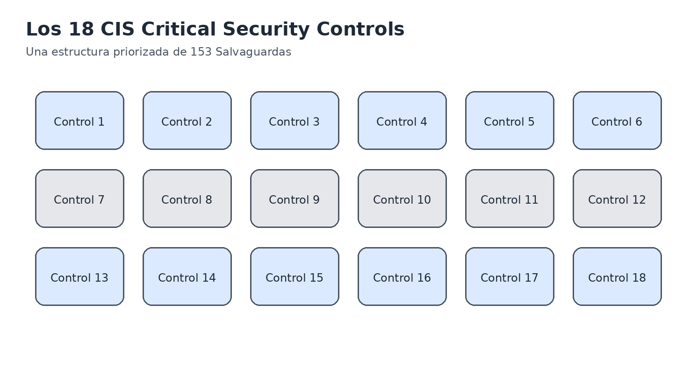
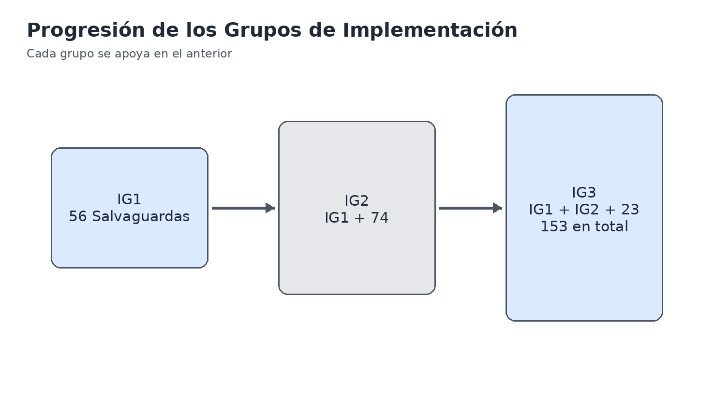
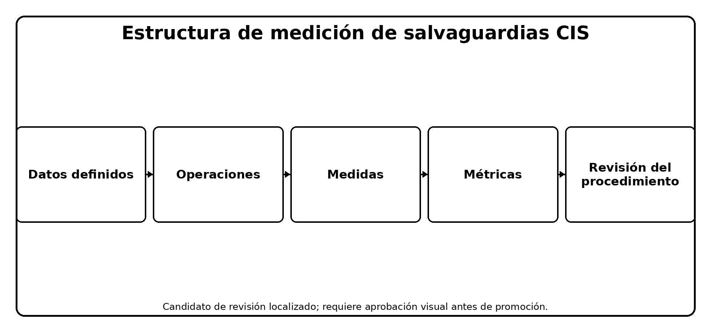
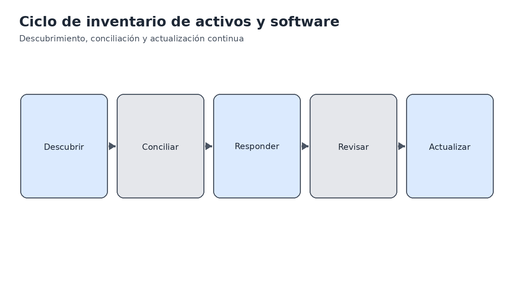
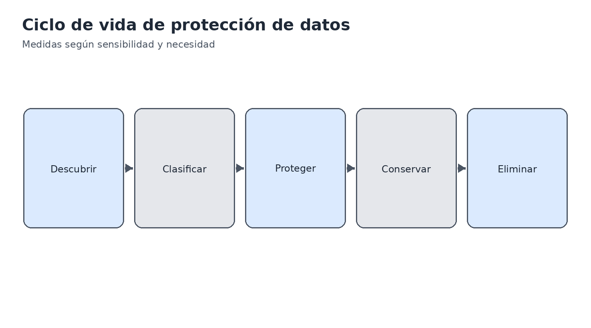
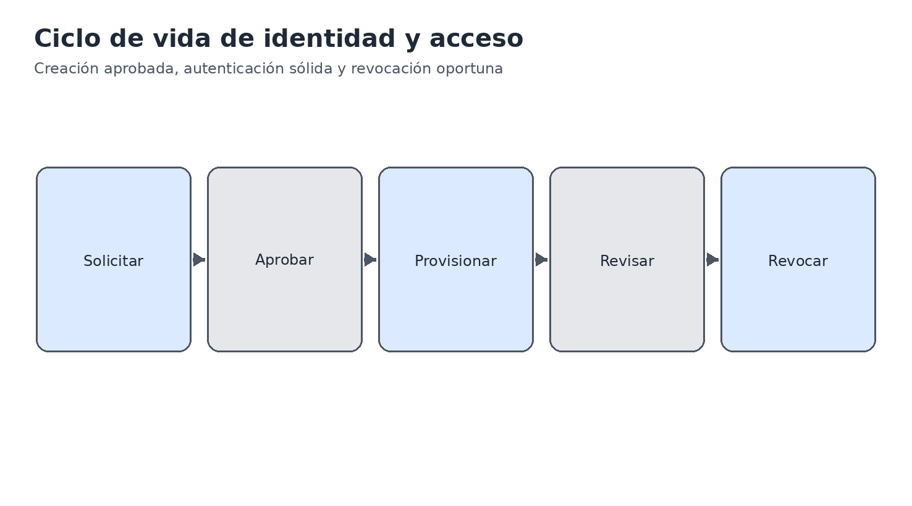
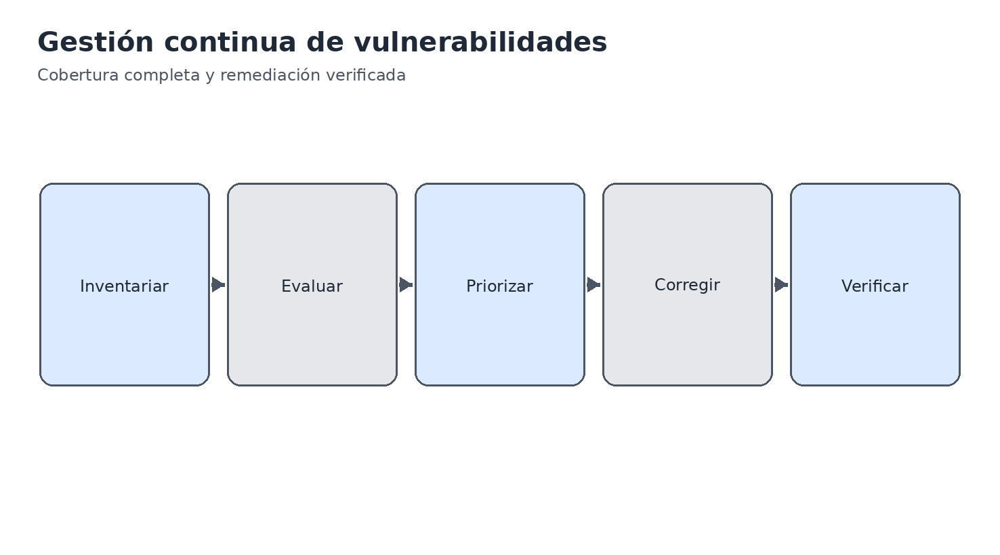
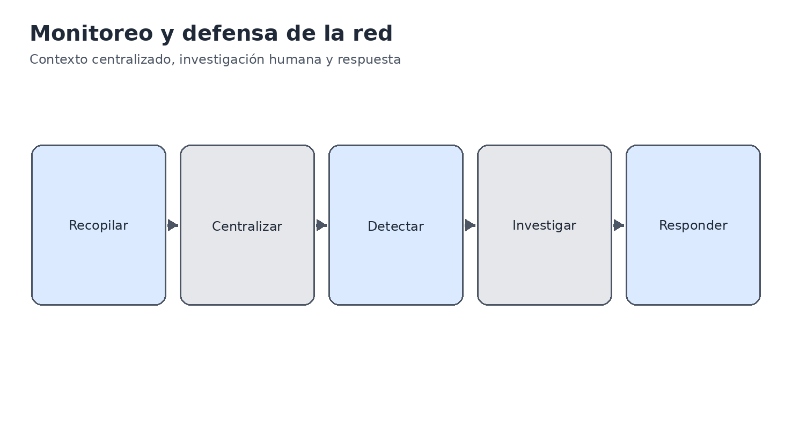
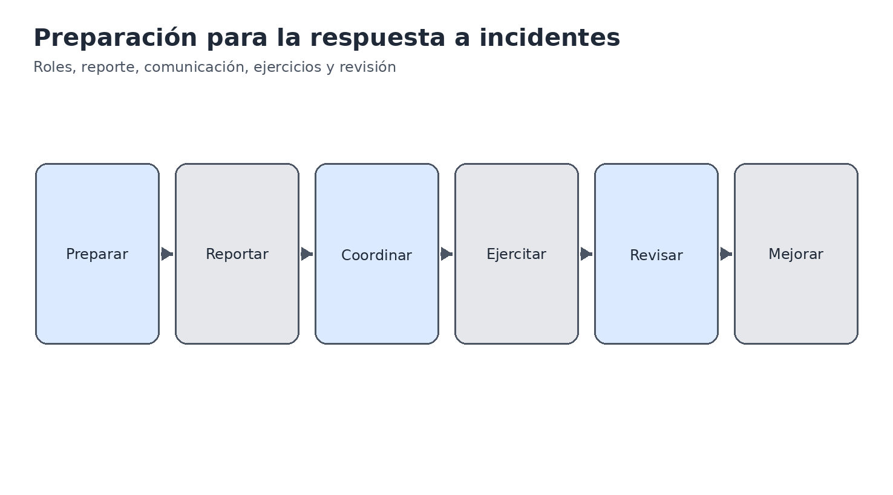
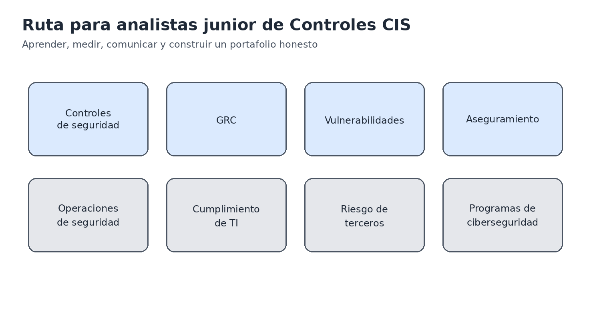

> **Estado de revisión:** Edición de revisión controlada. Requiere validación humana de terminología, significado, enlaces, formato, accesibilidad y vigencia técnica antes de la publicación final.

**SERIE PRÁCTICA DE CIBERSEGURIDAD, PRIVACIDAD Y CUMPLIMIENTO**

**CIS Critical Security Controls v8.1**

**Implementación práctica, medición, evidencia y herramientas de código abierto**

*Manual de trabajo para gestores, analistas júnior, estudiantes, profesionales en transición de carrera, evaluadores y equipos de seguridad*

**Alberto (Al) Leiva**

Primera edición • Julio de 2026

| **Contenido:** 18 Controles • 153 Salvaguardas • IG1, IG2 e IG3 • medición • evidencia • herramientas • guía para gestores • laboratorios • preparación profesional |
|---|

# Aviso de publicación y uso

Autor: Alberto (Al) Leiva

Edición: Primera edición, julio de 2026

Este manual educativo independiente no es una publicación, certificación, acreditación, informe de auditoría, opinión jurídica ni garantía de seguridad o cumplimiento emitida por el Center for Internet Security. CIS Controls y CIS Benchmarks son marcas del Center for Internet Security. Consulte los recursos oficiales de CIS para obtener el contenido exacto y la orientación vigente.

Los CIS Controls representan buenas prácticas de ciberseguridad. No sustituyen las leyes, los reglamentos, los contratos, los requisitos sectoriales, las evaluaciones de riesgo ni las responsabilidades de gestión aplicables. Una correspondencia entre marcos muestra relaciones; no demuestra automáticamente el cumplimiento de otro marco.

## Uso ético y autorizado

Utilice herramientas técnicas únicamente en activos, redes, aplicaciones, cuentas de nube, repositorios y datos que posea o para los que haya recibido autorización específica por escrito. En los laboratorios, utilice información sintética y sistemas aislados.

# Prefacio

*Introducción práctica a la defensa cibernética priorizada y a la medición basada en evidencia.*

Los CIS Controls convierten necesidades defensivas comunes en Salvaguardas específicas. Su principal fortaleza es la priorización práctica: conocer los activos, controlar el software y los datos, proteger configuraciones e identidades, gestionar vulnerabilidades y registros, prepararse para interrupciones y ataques, y comprobar si las defensas funcionan.

La versión 8.1 es una actualización iterativa de la versión 8. Realineó las correspondencias con NIST CSF 2.0, amplió definiciones de términos reservados, revisó clases de activos y correspondencias de Salvaguardas, corrigió cuestiones menores, aclaró determinadas Salvaguardas e incorporó la función Gobernar a las correspondencias. Los 18 Controles y las 153 Salvaguardas continúan siendo la estructura central.

La instalación de una herramienta no equivale a la implementación de un control. Una implementación efectiva exige un alcance definido, poblaciones completas, configuración segura, evidencia operativa, responsables capacitados, tratamiento de excepciones, medición, corrección y repetición de pruebas. Los gestores definen prioridades y recursos; los analistas hacen que esas decisiones sean confiables mediante inventarios y evidencia precisos.

# Cómo utilizar este manual

- Los gestores deben comenzar con los capítulos 1–5 y 24–25.
- Los analistas júnior deben estudiar los 18 capítulos de Controles, el método de medición, las herramientas, el laboratorio y el capítulo de entrevistas.
- Los equipos técnicos deben relacionar cada Salvaguarda con activos, datos, responsables, procedimientos, configuraciones, monitoreo, excepciones y evidencia.
- Los evaluadores deben utilizar la especificación oficial de evaluación de CIS Controls para confirmar entradas, operaciones, medidas, métricas, supuestos y revisiones de procedimientos.

| **Tabla de contenido en Word:** El archivo DOCX puede contener un campo nativo de tabla de contenido. Después de cualquier edición, actualice el campo y seleccione la opción para actualizar toda la tabla. |
|---|

# Tabla de contenidos

1. Fundamentos de CIS Controls v8.1  
2. Grupos de Implementación y priorización  
3. Gobernanza, alcance y responsabilidades  
4. Medición con la Especificación para la Evaluación de Controles de CIS  
5. Hoja de ruta de implementación  
6–23. Los 18 CIS Controls  
24. Herramientas de código abierto  
25. Guía de CIS Controls para gestores  
26. Guía profesional para analistas júnior  
27. Laboratorio ficticio y portafolio  
28. Plan de aprendizaje de treinta días  
29. Preparación para entrevistas  
30. Plantillas, glosario, índice y referencias

# 1. Fundamentos de CIS Controls v8.1

*La versión vigente, su estructura, propósito y limitaciones.*

Figura 1. Los 18 Controles Críticos de Seguridad de CIS

- CIS Controls v8.1 se publicó en junio de 2024 y continúa siendo la edición vigente en julio de 2026.

- Los Controles son buenas prácticas priorizadas diseñadas para defender sistemas y redes frente a ataques frecuentes.

- El marco contiene 18 Controles y 153 Salvaguardas.

- Las Salvaguardas se relacionan con clases de activos, funciones de seguridad y Grupos de Implementación.

- La versión 8.1 alinea su correspondencia con NIST CSF 2.0 e incorpora la función Gobernar.

- Existen correspondencias oficiales con diversos marcos, pero la implementación debe verificarse por separado para cada requisito aplicable.

| **Capa** | **Propósito** |
|---|---|
| Control | Resultado defensivo amplio, como el inventario de activos o la respuesta a incidentes |
| Salvaguarda | Acción específica que puede asignarse, implementarse y medirse |
| Clase de activo | Tipo de elemento afectado, como dispositivos, software, datos, red, usuarios o documentación |
| Función de seguridad | Correspondencia con Gobernar, Identificar, Proteger, Detectar, Responder o Recuperar |
| Grupo de Implementación | Priorización recomendada según el perfil de riesgo y los recursos |
| Medida de evaluación | Entradas, operaciones, medidas, métricas y revisión de procedimientos utilizadas para evaluar una Salvaguarda |

# 2. Grupos de Implementación y priorización

*Cómo IG1, IG2 e IG3 ayudan a las organizaciones a elegir un punto de partida realista.*

Figura 2. Progresión de los Grupos de Implementación

| **Grupo** | **Salvaguardas** | **Situación habitual** | **Objetivo** |
|---|---:|---|---|
| IG1 | 56 | Recursos y experiencia de seguridad limitados, menor sensibilidad y alta necesidad de continuidad básica | Higiene cibernética esencial frente a ataques comunes |
| IG2 | IG1 + 74 | Varias áreas, mayor complejidad, información sensible y mayor dependencia operativa | Gestionar el aumento del riesgo y de la complejidad operativa |
| IG3 | IG1 + IG2 + 23 = 153 | Especialistas en seguridad, datos sensibles o regulados, servicios críticos y amenazas sofisticadas | Reducir el impacto de ataques dirigidos y avanzados |

- Según la orientación de CIS, toda organización debe comenzar con IG1.

- Seleccione un Grupo de Implementación considerando la sensibilidad de los datos, los servicios críticos, la exposición a amenazas, las obligaciones legales y contractuales, la tolerancia empresarial, la tecnología, el personal y la experiencia.

- Un Grupo de Implementación es una ayuda de priorización, no una autorización para ignorar un riesgo material o un requisito obligatorio.

- Documente las adiciones adaptadas, la secuencia, las excepciones, la aceptación del riesgo, los responsables y las fechas.

- Utilice CIS Controls Navigator para filtrar las Salvaguardas de v8.1 y revisar las correspondencias oficiales.

# 3. Gobernanza, alcance y responsabilidades

*La base de gestión necesaria para que las Salvaguardas funcionen de manera consistente.*

- Defina los objetivos empresariales, los servicios críticos, los datos sensibles, las obligaciones legales y contractuales, el perfil de amenazas, la tolerancia al riesgo y el Grupo de Implementación elegido.

- Cree inventarios completos de activos empresariales, software, datos, cuentas, sistemas de autenticación, infraestructura de red, registros, proveedores, aplicaciones y recursos de recuperación.

- Asigne una persona responsable de rendir cuentas por cada Salvaguarda y responsables operativos para cada plataforma o proceso afectado.

- Defina alcance, aplicabilidad, dependencias, responsabilidades de proveedores, excepciones permitidas, autoridad de aprobación y factores que activan una revisión.

- Planifique financiación, personal, competencias, tecnología, tiempo y gestión del cambio.

- Defina métricas e informes antes de la implementación para que la cobertura y los fallos sean visibles.

- Mantenga un ciclo de gobernanza: priorizar, implementar, medir, corregir, repetir pruebas y mejorar.

| **Rol** | **Decisión o responsabilidad** |
|---|---|
| Patrocinador ejecutivo | Dirección, tolerancia al riesgo, financiación, escalamiento y rendición de cuentas |
| Responsable del control | Diseño de la Salvaguarda, alcance, procedimiento, medición, excepciones y mejora |
| Responsable del activo o servicio | Inventario exacto, uso aprobado, configuración, impacto empresarial y remediación |
| Operaciones de seguridad | Monitoreo, alertas, investigación, respuesta y evidencia |
| TI / Ingeniería | Implementación, control de cambios, aplicación de parches, configuración y recuperación |
| GRC / Analista | Correspondencias, evidencia, medición, hallazgos, seguimiento de acciones e informes |
| Auditoría interna / evaluador | Criterios objetivos, pruebas, limitaciones y conclusiones |
| Proveedor de servicios | Controles contratados, evidencia, incidentes, cambios y apoyo para la salida |

# 4. Medición con la Especificación para la Evaluación de Controles de CIS

*Un método repetible para determinar si las Salvaguardas están implementadas.*

Figura 3. Estructura de medición de las Salvaguardas de CIS

| **Elemento** | **Pregunta** |
|---|---|
| Metadatos de la Salvaguarda | ¿Cuál es la Salvaguarda exacta, la clase de activo, la función de seguridad y el Grupo de Implementación? |
| Dependencias | ¿Qué otras Salvaguardas o poblaciones deben existir primero? |
| Supuestos | ¿Qué condición aceptada afecta la medición? |
| Entradas | ¿Qué datos completos y fiables se requieren? |
| Operaciones | ¿Qué análisis debe realizarse sobre las entradas? |
| Medidas | ¿Qué conteos, listas, fechas, configuraciones o resultados se obtienen? |
| Métricas | ¿Cómo se calculan e interpretan las medidas? |
| Revisión del procedimiento | ¿Existe un proceso documentado y contiene los elementos requeridos? |

- Defina la Salvaguarda exacta y la población incluida en el alcance.

- Obtenga las entradas requeridas y valide su integridad, exactitud, oportunidad, responsabilidad y fiabilidad de la fuente.

- Siga las operaciones oficiales de medición o documente un método equivalente y fiable.

- Conserve los cálculos de las medidas y la población subyacente de excepciones, no solo un porcentaje.

- Evalúe si la Salvaguarda está implementada y qué tan bien funciona.

- Asigne una acción correctiva para la cobertura faltante, la configuración incorrecta, la revisión vencida, las excepciones o los datos poco fiables.

- Repita las pruebas con los mismos criterios y una población actualizada.

- Informe alcance, resultado, excepción, limitación, responsable, acción y fecha.

# 5. Hoja de ruta de implementación

*Una secuencia práctica desde los inventarios hasta una resiliencia comprobada.*

1. Elija y documente el Grupo de Implementación inicial y cualquier adición requerida.

2. Construya y concilie las poblaciones principales: activos, software, datos, cuentas, sistemas de autenticación, red, proveedores, aplicaciones y registros.

3. Implemente las Salvaguardas de IG1 con responsables, procedimientos, métricas de cobertura, excepciones y evidencia.

4. Proteja identidades, configuraciones, vulnerabilidades, correo electrónico, navegadores, defensas contra malware, copias de seguridad y monitoreo esencial.

5. Ejercite la respuesta a incidentes y la recuperación antes de una emergencia real.

6. Mida cada Salvaguarda aplicable mediante entradas fiables y operaciones repetibles.

7. Corrija la cobertura incompleta y los fallos repetidos; verifique las correcciones mediante nuevas pruebas.

8. Avance hacia IG2 o IG3 según el riesgo, las obligaciones, la madurez y la exposición a amenazas.

9. Utilice las correspondencias oficiales para coordinar otros marcos sin tratarlas como cumplimiento automático.

| **Principio de implementación:** Un grupo más pequeño de Salvaguardas totalmente definido, operado, medido y mejorado es más defendible que una lista extensa marcada como completa sin evidencia fiable. |
|---|

# 6. Control 1 — Inventario y control de activos empresariales

*Las 5 Salvaguardas, su significado claro, el enfoque de verificación y ejemplos de evidencia.*

Figura 4. Ciclo de inventario de activos y software

| **Propósito del control:** Fortalecer la empresa mediante la implementación y medición de Salvaguardas para el inventario y control de activos empresariales. |
|---|

| **ID** | **Salvaguarda** | **Significado claro** | **Enfoque de verificación** | **Ejemplos de evidencia** |
|---|---|---|---|---|
| 1.1 | Establecer y mantener un inventario detallado de activos empresariales | Establecer un proceso repetible y con responsable definido para mantener un inventario detallado de activos y verificar su cobertura y excepciones. | Confirmar alcance, población, propietario, frecuencia, cobertura, excepciones, corrección y nueva prueba. | Inventario de activos, propietarios, estado de aprobación, descubrimiento activo y pasivo, registros DHCP/IPAM y tickets de activos no autorizados. |
| 1.2 | Abordar los activos no autorizados | Detectar, investigar y retirar, aislar o autorizar formalmente los activos no autorizados. | Verificar que las alertas generan acciones trazables y oportunas. | Alertas, tickets, registros de aislamiento, autorizaciones y evidencia de cierre. |
| 1.3 | Utilizar una herramienta de descubrimiento activo | Ejecutar descubrimiento activo para identificar activos conectados y conciliar los resultados con el inventario. | Confirmar cobertura, programación, exclusiones y conciliación. | Configuración de escaneo, resultados, inventario actualizado y excepciones aprobadas. |
| 1.4 | Utilizar registros DHCP para actualizar el inventario de activos empresariales | Integrar registros DHCP con el proceso de actualización y conciliación del inventario. | Verificar ingestión, frecuencia, cobertura y tratamiento de discrepancias. | Registros DHCP, integraciones, reportes de conciliación y tickets. |
| 1.5 | Utilizar una herramienta de descubrimiento pasivo de activos | Supervisar tráfico o telemetría para identificar activos sin generar exploración activa. | Confirmar sensores, segmentos cubiertos, alertas y conciliación. | Configuración de sensores, resultados, cobertura de red y actualizaciones del inventario. |

Utilice la guía oficial de CIS Controls v8.1 y la Especificación de Evaluación de Controles para el lenguaje exacto, la clase de activo, la función de seguridad, el Grupo de Implementación, las dependencias, las entradas, las operaciones, las medidas, las métricas y la revisión de procedimientos.

# 7. Control 2 — Inventario y control de activos de software

*Las 7 Salvaguardas, su significado claro, el enfoque de verificación y ejemplos de evidencia.*

| **Propósito del control:** Fortalecer la empresa mediante la implementación y medición de Salvaguardas para el inventario y control de activos de software. |
|---|

| **ID** | **Salvaguarda** | **Significado claro** | **Enfoque de verificación** | **Ejemplos de evidencia** |
|---|---|---|---|---|
| 2.1 | Establecer y mantener un inventario de software | Mantener un inventario autorizado, actualizado y con responsables definidos. | Confirmar alcance, propietario, frecuencia, cobertura y excepciones. | Inventario, versiones, propietarios, estado de soporte y resultados de descubrimiento. |
| 2.2 | Asegurar que el software autorizado tenga soporte vigente | Identificar software sin soporte y actualizarlo, reemplazarlo o gestionarlo mediante una excepción aprobada. | Verificar fechas de fin de soporte y acciones correctivas. | Inventario, boletines de proveedor, planes de actualización y excepciones. |
| 2.3 | Abordar el software no autorizado | Detectar y retirar, bloquear o aprobar formalmente el software no autorizado. | Confirmar que los hallazgos generan acciones trazables. | Alertas, tickets, registros de desinstalación, bloqueos y aprobaciones. |
| 2.4 | Utilizar herramientas automatizadas de inventario de software | Automatizar la detección de software instalado y conciliarla con el inventario autorizado. | Verificar cobertura, frecuencia y tratamiento de discrepancias. | Configuración de herramientas, resultados y reportes de conciliación. |
| 2.5 | Crear una lista de software autorizado | Permitir la ejecución únicamente del software aprobado conforme al riesgo y la necesidad empresarial. | Confirmar política, cobertura, excepciones y eventos de bloqueo. | Política de allowlisting, reglas, excepciones y registros de eventos. |
| 2.6 | Crear una lista de bibliotecas autorizadas | Restringir bibliotecas y componentes cargados a versiones aprobadas. | Verificar reglas, cobertura y excepciones. | Configuración, inventario de bibliotecas, eventos y aprobaciones. |
| 2.7 | Crear una lista de scripts autorizados | Restringir la ejecución de scripts a los aprobados y controlados. | Confirmar firma, reglas, cobertura y excepciones. | Repositorio aprobado, firmas, reglas de ejecución y eventos. |

Utilice la guía oficial de CIS Controls v8.1 y la Especificación de Evaluación de Controles para el lenguaje exacto y los criterios de evaluación.

# 8. Control 3 — Protección de datos

*Las 14 Salvaguardas, su significado claro, el enfoque de verificación y ejemplos de evidencia.*

Figura 5. Ciclo de vida de protección de datos

| **Propósito del control:** Fortalecer la empresa mediante la implementación y medición de Salvaguardas para la protección de datos. |
|---|

| **ID** | **Salvaguarda** | **Significado claro** | **Enfoque de verificación** | **Ejemplos de evidencia** |
|---|---|---|---|---|
| 3.1 | Establecer y mantener un proceso de gestión de datos | Definir cómo se identifican, clasifican, protegen, conservan y eliminan los datos. | Confirmar alcance, propietario, revisión y aplicación. | Política, procedimientos, responsables y registros de revisión. |
| 3.2 | Establecer y mantener un inventario de datos | Mantener un inventario de conjuntos de datos, ubicación, propietario, sensibilidad y uso. | Verificar cobertura, actualidad y conciliación. | Inventario, catálogos, propietarios y resultados de descubrimiento. |
| 3.3 | Configurar listas de control de acceso a datos | Limitar el acceso a datos conforme a necesidad y autorización. | Revisar permisos, roles, excepciones y recertificaciones. | ACL, roles, aprobaciones y revisiones de acceso. |
| 3.4 | Aplicar la retención de datos | Conservar los datos durante el período aprobado y exigido. | Comparar reglas, sistemas y resultados. | Calendario de retención, configuraciones y registros. |
| 3.5 | Eliminar datos de forma segura | Destruir o borrar datos de manera verificable cuando ya no sean necesarios. | Confirmar método, cobertura y evidencia de eliminación. | Certificados, registros, tickets y pruebas de borrado. |
| 3.6 | Cifrar datos en dispositivos de usuario final | Proteger datos almacenados en dispositivos mediante cifrado administrado. | Verificar cobertura, claves, excepciones y estado. | Consola de cifrado, inventario, políticas y excepciones. |
| 3.7 | Establecer y mantener un esquema de clasificación de datos | Definir niveles de sensibilidad y reglas de manejo. | Confirmar criterios, aprobación, comunicación y uso. | Esquema, etiquetas, procedimientos y capacitación. |
| 3.8 | Documentar los flujos de datos | Mantener diagramas y registros de cómo se recopilan, procesan, almacenan y transfieren los datos. | Verificar integridad, actualidad y propietarios. | Diagramas, registros de tratamiento e interfaces. |
| 3.9 | Cifrar datos en medios extraíbles | Exigir cifrado para datos almacenados en medios removibles. | Confirmar política, configuración y excepciones. | Configuración, inventario de medios y registros. |
| 3.10 | Cifrar datos sensibles en tránsito | Proteger comunicaciones que transportan datos sensibles. | Revisar protocolos, certificados, cobertura y excepciones. | Configuración TLS/VPN, certificados y resultados de pruebas. |
| 3.11 | Cifrar datos sensibles en reposo | Proteger datos sensibles almacenados en bases, archivos y respaldos. | Confirmar algoritmos, claves, cobertura y excepciones. | Configuración, KMS/HSM, inventarios y pruebas. |
| 3.12 | Segmentar el procesamiento y almacenamiento de datos según su sensibilidad | Separar entornos y repositorios según clasificación y riesgo. | Revisar arquitectura, reglas y flujos permitidos. | Diagramas, segmentación, reglas y resultados de pruebas. |
| 3.13 | Implementar una solución de prevención de pérdida de datos | Detectar y controlar transferencias no autorizadas de datos sensibles. | Verificar cobertura, reglas, alertas, excepciones y respuesta. | Políticas DLP, eventos, tickets y métricas. |
| 3.14 | Registrar el acceso a datos sensibles | Mantener registros suficientes para identificar quién accedió a datos sensibles y qué acción realizó. | Confirmar fuentes, detalle, retención y revisión. | Registros de acceso, SIEM, alertas y revisiones. |

Utilice la guía oficial de CIS Controls v8.1 y la Especificación de Evaluación de Controles para el lenguaje exacto y los criterios de evaluación.

# 9. Control 4 — Configuración segura de activos empresariales y software

*Las 12 Salvaguardas, su significado claro, el enfoque de verificación y ejemplos de evidencia.*

| **Propósito del control:** Fortalecer la empresa mediante la implementación y medición de Salvaguardas para la configuración segura de activos empresariales y software. |
|---|

| **ID** | **Salvaguarda** | **Significado claro** | **Enfoque de verificación** | **Ejemplos de evidencia** |
|---|---|---|---|---|
| 4.1 | Establecer y mantener un proceso de configuración segura | Definir, aprobar, implementar y revisar configuraciones seguras para activos y software. | Confirmar estándares, responsables, frecuencia, cobertura y excepciones. | Estándares, líneas base, resultados de evaluación y excepciones. |
| 4.2 | Establecer y mantener un proceso de configuración segura para la infraestructura de red | Aplicar líneas base seguras a dispositivos y servicios de red. | Revisar cobertura, cambios, desviaciones y correcciones. | Configuraciones, respaldos, comparaciones y tickets. |
| 4.3 | Configurar el bloqueo automático de sesión en activos empresariales | Bloquear sesiones inactivas después del período aprobado. | Verificar política, configuración y cobertura. | GPO/MDM, resultados de consulta y excepciones. |
| 4.4 | Implementar y administrar un firewall en servidores | Habilitar y gestionar reglas de firewall en servidores. | Revisar cobertura, reglas, cambios y excepciones. | Configuración, inventario, reglas y registros. |
| 4.5 | Implementar y administrar un firewall en dispositivos de usuario final | Habilitar y gestionar el firewall local en endpoints. | Confirmar cobertura y estado centralizado. | Consola, políticas y reportes de cumplimiento. |
| 4.6 | Administrar de forma segura los activos empresariales y el software | Utilizar protocolos y canales administrativos seguros. | Revisar métodos de administración, autenticación y registros. | Configuración, listas de administradores y registros. |
| 4.7 | Administrar cuentas predeterminadas en activos empresariales y software | Deshabilitar, cambiar o controlar cuentas predeterminadas. | Confirmar inventario, estado y excepciones. | Resultados de escaneo, configuración y tickets. |
| 4.8 | Desinstalar o deshabilitar servicios innecesarios | Reducir superficie de ataque retirando servicios no requeridos. | Comparar líneas base, servicios activos y excepciones. | Inventario de servicios, configuración y aprobaciones. |
| 4.9 | Configurar servidores DNS de confianza en activos empresariales | Forzar el uso de resolutores DNS aprobados. | Verificar configuración, cobertura y desvíos. | GPO/MDM, configuración de red y registros DNS. |
| 4.10 | Aplicar bloqueo automático del dispositivo en equipos portátiles de usuario final | Bloquear dispositivos portátiles tras inactividad o intentos fallidos. | Confirmar política, configuración y cobertura. | MDM, políticas y reportes. |
| 4.11 | Aplicar capacidad de borrado remoto en dispositivos portátiles de usuario final | Permitir borrado remoto administrado cuando el riesgo lo requiera. | Verificar cobertura, autorización y pruebas. | Consola MDM, procedimientos y registros de prueba. |
| 4.12 | Separar espacios de trabajo empresariales en dispositivos móviles de usuario final | Separar datos y aplicaciones empresariales de los personales. | Revisar perfiles, políticas y cobertura. | Configuración MDM/MAM, inventario y reportes. |

Utilice la guía oficial de CIS Controls v8.1 y la Especificación de Evaluación de Controles para el lenguaje exacto y los criterios de evaluación.

# 10. Control 5 — Gestión de cuentas

*Las 6 Salvaguardas, su significado claro, el enfoque de verificación y ejemplos de evidencia.*

| **Propósito del control:** Fortalecer la empresa mediante la implementación y medición de Salvaguardas para la gestión de cuentas. |
|---|

| **ID** | **Salvaguarda** | **Significado claro** | **Enfoque de verificación** | **Ejemplos de evidencia** |
|---|---|---|---|---|
| 5.1 | Establecer y mantener un inventario de cuentas | Mantener una población completa de cuentas con propietario, tipo, estado y fechas relevantes. | Confirmar cobertura, actualidad, responsables y conciliación. | Inventarios, directorios, reportes y revisiones. |
| 5.2 | Utilizar contraseñas únicas | Impedir la reutilización de contraseñas entre cuentas administradas. | Revisar política, configuración, excepciones y pruebas. | Política, configuración de identidad y resultados de auditoría. |
| 5.3 | Deshabilitar cuentas inactivas | Deshabilitar oportunamente cuentas que superen el período de inactividad aprobado. | Confirmar umbral, ejecución, excepciones y seguimiento. | Reportes, tickets, registros y aprobaciones. |
| 5.4 | Restringir privilegios administrativos a cuentas administrativas dedicadas | Separar las actividades administrativas de las cuentas de uso normal. | Revisar asignaciones, uso, excepciones y registros. | Inventario de administradores, roles y registros de acceso. |
| 5.5 | Establecer y mantener un inventario de cuentas de servicio | Identificar cuentas de servicio, propietarios, propósito, privilegios y ciclo de vida. | Verificar cobertura, revisión y credenciales. | Inventario, propietarios, rotación y revisiones. |
| 5.6 | Centralizar la gestión de cuentas | Administrar cuentas mediante servicios centralizados cuando sea viable. | Confirmar sistemas cubiertos, sincronización, excepciones y monitoreo. | Arquitectura, configuración, directorios y reportes. |

Utilice la guía oficial de CIS Controls v8.1 y la Especificación de Evaluación de Controles para el lenguaje exacto y los criterios de evaluación.

# 11. Control 6 — Gestión del control de acceso

*Las 8 Salvaguardas, su significado claro, el enfoque de verificación y ejemplos de evidencia.*

Figura 6. Ciclo de vida de identidad y acceso

| **Propósito del control:** Fortalecer la empresa mediante la implementación y medición de Salvaguardas para la gestión del control de acceso. |
|---|

| **ID** | **Salvaguarda** | **Significado claro** | **Enfoque de verificación** | **Ejemplos de evidencia** |
|---|---|---|---|---|
| 6.1 | Establecer un proceso de concesión de acceso | Definir un proceso aprobado, trazable y basado en necesidad para otorgar acceso. | Confirmar solicitud, aprobación, implementación, plazo y excepciones. | Solicitudes, aprobaciones, tickets, registros y revisiones. |
| 6.2 | Establecer un proceso de revocación de acceso | Retirar acceso oportunamente cuando cambien las funciones o termine la relación. | Verificar disparadores, tiempos, cobertura y seguimiento. | Tickets de baja, registros de directorio, listas de terminación y pruebas. |
| 6.3 | Exigir MFA para aplicaciones expuestas externamente | Proteger aplicaciones accesibles desde Internet mediante autenticación multifactor. | Confirmar cobertura, métodos, excepciones y pruebas. | Configuración de identidad, reportes de cobertura y excepciones. |
| 6.4 | Exigir MFA para acceso remoto a la red | Aplicar MFA a conexiones remotas hacia recursos empresariales. | Revisar VPN, ZTNA, cobertura, excepciones y registros. | Configuración, registros de autenticación y reportes. |
| 6.5 | Exigir MFA para acceso administrativo | Aplicar MFA a toda actividad con privilegios administrativos. | Confirmar población, sistemas, métodos y excepciones. | Inventario de administradores, políticas y registros. |
| 6.6 | Establecer y mantener un inventario de sistemas de autenticación y autorización | Mantener una lista completa de sistemas que gestionan identidades, autenticación y autorización. | Verificar propietario, alcance, actualidad y conciliación. | Inventario, diagramas, responsables y revisiones. |
| 6.7 | Centralizar el control de acceso | Gestionar identidades y autorizaciones mediante plataformas centralizadas cuando sea viable. | Confirmar integración, cobertura y cuentas locales excepcionales. | Directorios, IAM, SSO, integraciones y excepciones. |
| 6.8 | Definir y mantener control de acceso basado en roles | Asignar permisos mediante roles aprobados y revisados periódicamente. | Revisar diseño, propietarios, asignaciones, recertificación y separación de funciones. | Catálogo de roles, matrices, aprobaciones y revisiones. |

Utilice la guía oficial de CIS Controls v8.1 y la Especificación de Evaluación de Controles para el lenguaje exacto y los criterios de evaluación.

# 12. Control 7 — Gestión continua de vulnerabilidades

*Las 7 Salvaguardas, su significado claro, el enfoque de verificación y ejemplos de evidencia.*

Figura 7. Gestión continua de vulnerabilidades

| **Propósito del control:** Fortalecer la empresa mediante la implementación y medición de Salvaguardas para la gestión continua de vulnerabilidades. |
|---|

| **ID** | **Salvaguarda** | **Significado claro** | **Enfoque de verificación** | **Ejemplos de evidencia** |
|---|---|---|---|---|
| 7.1 | Establecer y mantener un proceso de gestión de vulnerabilidades | Definir alcance, responsabilidades, frecuencia, priorización y seguimiento de vulnerabilidades. | Confirmar aprobación, cobertura, métricas, excepciones y revisión. | Política, procedimientos, responsables, métricas y registros. |
| 7.2 | Establecer y mantener un proceso de remediación | Corregir vulnerabilidades según riesgo y verificar el cierre. | Revisar plazos, prioridades, excepciones, nuevas pruebas y escalamiento. | Tickets, planes, excepciones, resultados de nuevas pruebas y métricas. |
| 7.3 | Realizar gestión automatizada de parches del sistema operativo | Identificar, probar y desplegar parches del sistema operativo mediante un proceso administrado. | Confirmar cobertura, frecuencia, fallos, excepciones y cumplimiento. | Consolas, inventarios, reportes de despliegue y tickets. |
| 7.4 | Realizar gestión automatizada de parches de aplicaciones | Identificar, probar y desplegar actualizaciones de aplicaciones. | Verificar cobertura, versiones, fallos y excepciones. | Inventarios, consolas, resultados y planes correctivos. |
| 7.5 | Realizar escaneos automatizados de vulnerabilidades de activos empresariales internos | Escanear activos internos con cobertura y credenciales adecuadas. | Confirmar alcance, autenticación, frecuencia, exclusiones y resultados. | Configuración de escáner, resultados, cobertura y excepciones. |
| 7.6 | Realizar escaneos automatizados de vulnerabilidades de activos empresariales expuestos externamente | Evaluar de forma periódica los activos accesibles desde Internet. | Verificar inventario, alcance, frecuencia, hallazgos y seguimiento. | Inventario externo, resultados, tickets y nuevas pruebas. |
| 7.7 | Corregir las vulnerabilidades detectadas | Priorizar, corregir y volver a probar vulnerabilidades identificadas. | Confirmar riesgo, plazo, propietario, evidencia de cierre y excepciones. | Tickets, cambios, resultados de nueva prueba y aprobaciones. |

Utilice la guía oficial de CIS Controls v8.1 y la Especificación de Evaluación de Controles para el lenguaje exacto y los criterios de evaluación.

# 13. Control 8 — Gestión de registros de auditoría

*Las 12 Salvaguardas, su significado claro, el enfoque de verificación y ejemplos de evidencia.*

| **Propósito del control:** Fortalecer la empresa mediante la implementación y medición de Salvaguardas para la gestión de registros de auditoría. |
|---|

| **ID** | **Salvaguarda** | **Significado claro** | **Enfoque de verificación** | **Ejemplos de evidencia** |
|---|---|---|---|---|
| 8.1 | Establecer y mantener un proceso de gestión de registros de auditoría | Definir alcance, responsables, fuentes, almacenamiento, revisión y conservación de registros. | Confirmar aprobación, cobertura, frecuencia, excepciones y mejora. | Política, procedimientos, responsables, inventario de fuentes y métricas. |
| 8.2 | Recopilar registros de auditoría | Recopilar los registros necesarios de activos, aplicaciones, servicios e infraestructura. | Verificar fuentes, cobertura, integridad, frecuencia y fallos de ingestión. | Configuración, inventario de fuentes, registros recibidos y alertas de fallos. |
| 8.3 | Garantizar almacenamiento adecuado de registros de auditoría | Dimensionar y proteger el almacenamiento para cumplir los períodos de conservación. | Revisar capacidad, crecimiento, disponibilidad, protección y alertas. | Métricas de capacidad, configuración, alertas y planes de ampliación. |
| 8.4 | Estandarizar la sincronización horaria | Utilizar fuentes horarias autorizadas y consistentes en los sistemas. | Confirmar servidores, configuración, cobertura, desviaciones y excepciones. | Configuración NTP, inventario, alertas y resultados de consulta. |
| 8.5 | Recopilar registros de auditoría detallados | Registrar eventos con suficiente detalle para investigación y trazabilidad. | Verificar campos, identidades, marcas de tiempo, acciones y resultados. | Muestras de registros, esquema, configuración y resultados de prueba. |
| 8.6 | Recopilar registros de consultas DNS | Registrar consultas DNS relevantes para detección e investigación. | Confirmar fuentes, cobertura, detalle, conservación y revisión. | Registros DNS, configuración, SIEM y alertas. |
| 8.7 | Recopilar registros de solicitudes URL | Registrar solicitudes web relevantes conforme al riesgo y la privacidad. | Verificar cobertura, detalle, conservación, acceso y uso analítico. | Registros proxy/SWG, configuración, SIEM y casos de uso. |
| 8.8 | Recopilar registros de línea de comandos | Registrar la ejecución de comandos donde el riesgo lo justifique. | Confirmar sistemas cubiertos, detalle, protección y revisión. | Registros EDR, auditoría del sistema, SIEM y alertas. |
| 8.9 | Centralizar los registros de auditoría | Consolidar registros en una plataforma administrada para análisis y protección. | Verificar fuentes, ingestión, normalización, disponibilidad y excepciones. | Arquitectura, conectores, paneles, alertas y reportes de cobertura. |
| 8.10 | Conservar los registros de auditoría | Mantener registros durante períodos definidos por riesgo, operación y obligaciones. | Comparar requisitos, configuración y evidencia de eliminación. | Calendario de conservación, configuración y reportes. |
| 8.11 | Realizar revisiones de registros de auditoría | Revisar registros y alertas con frecuencia definida y seguimiento documentado. | Confirmar responsables, frecuencia, criterios, hallazgos y cierre. | Procedimientos, tickets, reportes de revisión y métricas. |
| 8.12 | Recopilar registros de proveedores de servicios | Obtener registros relevantes de servicios externos y plataformas administradas. | Verificar contratos, acceso, cobertura, formato, conservación y fallos. | Contratos, configuraciones, registros recibidos y tickets. |

Utilice la guía oficial de CIS Controls v8.1 y la Especificación de Evaluación de Controles para el lenguaje exacto y los criterios de evaluación.

# 14. Control 9 — Protecciones de correo electrónico y navegador web

*Las 7 Salvaguardas, su significado claro, el enfoque de verificación y ejemplos de evidencia.*

| **Propósito del control:** Fortalecer la empresa mediante la implementación y medición de Salvaguardas para las protecciones de correo electrónico y navegador web. |
|---|

| **ID** | **Salvaguarda** | **Significado claro** | **Enfoque de verificación** | **Ejemplos de evidencia** |
|---|---|---|---|---|
| 9.1 | Asegurar el uso de navegadores y clientes de correo con soporte vigente | Permitir únicamente productos y versiones que reciben soporte de seguridad. | Revisar inventario, versiones, fechas de soporte, excepciones y corrección. | Inventario, versiones, boletines de proveedor y tickets. |
| 9.2 | Utilizar servicios de filtrado DNS | Bloquear dominios maliciosos o no permitidos mediante resolutores y políticas administradas. | Confirmar cobertura, reglas, registros, excepciones y pruebas. | Configuración DNS, políticas, eventos y resultados de prueba. |
| 9.3 | Mantener y aplicar filtros URL basados en red | Controlar el acceso web conforme al riesgo y la política. | Verificar cobertura, categorías, reglas, excepciones y eventos. | Configuración SWG/proxy, políticas, registros y tickets. |
| 9.4 | Restringir extensiones innecesarias o no autorizadas de navegador y correo | Permitir solo extensiones aprobadas y administradas. | Confirmar listas, despliegue, cobertura, excepciones y bloqueos. | Políticas, inventarios, eventos y aprobaciones. |
| 9.5 | Implementar DMARC | Configurar SPF, DKIM y DMARC para reducir la suplantación de dominios. | Revisar registros DNS, alineación, política, reportes y evolución. | Registros DNS, reportes DMARC, tickets y métricas. |
| 9.6 | Bloquear tipos de archivo innecesarios | Impedir archivos adjuntos o descargas de alto riesgo no requeridos. | Confirmar política, cobertura, excepciones, eventos y pruebas. | Reglas, registros de bloqueo, excepciones y resultados de prueba. |
| 9.7 | Implementar y mantener protección antimalware del servidor de correo | Analizar mensajes y archivos mediante controles administrados y actualizados. | Verificar cobertura, configuración, actualizaciones, alertas y respuesta. | Consola, políticas, eventos, tickets y métricas. |

Utilice la guía oficial de CIS Controls v8.1 y la Especificación de Evaluación de Controles para el lenguaje exacto y los criterios de evaluación.

# 15. Control 10 — Defensas contra malware

*Las 7 Salvaguardas, su significado claro, el enfoque de verificación y ejemplos de evidencia.*

| **Propósito del control:** Fortalecer la empresa mediante la implementación y medición de Salvaguardas para las defensas contra malware. |
|---|

| **ID** | **Salvaguarda** | **Significado claro** | **Enfoque de verificación** | **Ejemplos de evidencia** |
|---|---|---|---|---|
| 10.1 | Implementar y mantener software antimalware | Proteger los activos aplicables mediante soluciones antimalware administradas. | Confirmar cobertura, estado, configuración, excepciones y respuesta. | Consola, inventario, políticas, alertas y tickets. |
| 10.2 | Configurar actualizaciones automáticas de firmas antimalware | Mantener firmas, motores y componentes actualizados automáticamente. | Verificar frecuencia, éxito, fallos, cobertura y excepciones. | Reportes de actualización, configuración, alertas y tickets. |
| 10.3 | Deshabilitar Autorun y Autoplay para medios extraíbles | Impedir la ejecución automática de contenido desde medios removibles. | Confirmar política, configuración, cobertura y excepciones. | GPO/MDM, resultados de consulta y reportes. |
| 10.4 | Configurar análisis antimalware automático de medios extraíbles | Analizar medios removibles al conectarse o antes de su uso. | Verificar configuración, cobertura, eventos y tratamiento de fallos. | Consola, políticas, registros y tickets. |
| 10.5 | Habilitar funciones contra explotación | Activar controles que dificulten la explotación de vulnerabilidades. | Confirmar configuración, cobertura, compatibilidad, excepciones y alertas. | Políticas, consola, inventario y resultados de prueba. |
| 10.6 | Administrar centralmente el software antimalware | Utilizar una plataforma central para configuración, supervisión y respuesta. | Verificar cobertura, comunicación, permisos, alertas y métricas. | Consola, roles, paneles, reportes y tickets. |
| 10.7 | Utilizar software antimalware basado en comportamiento | Detectar actividad maliciosa mediante análisis de comportamiento, no solo firmas. | Confirmar cobertura, reglas, alertas, ajustes y respuesta. | Configuración EDR, eventos, casos, tickets y métricas. |

Utilice la guía oficial de CIS Controls v8.1 y la Especificación de Evaluación de Controles para el lenguaje exacto y los criterios de evaluación.

# 16. Control 11 — Recuperación de datos

*Las 5 Salvaguardas, su significado claro, el enfoque de verificación y ejemplos de evidencia.*

| **Propósito del control:** Fortalecer la empresa mediante la implementación y medición de Salvaguardas para la recuperación de datos. |
|---|

| **ID** | **Salvaguarda** | **Significado claro** | **Enfoque de verificación** | **Ejemplos de evidencia** |
|---|---|---|---|---|
| 11.1 | Establecer y mantener un proceso de recuperación de datos | Definir alcance, responsabilidades, prioridades, objetivos de recuperación y procedimientos de restauración. | Confirmar aprobación, cobertura, revisión, pruebas y tratamiento de excepciones. | Plan de recuperación, procedimientos, responsables, inventario de sistemas y registros de revisión. |
| 11.2 | Realizar copias de seguridad automatizadas | Ejecutar respaldos automatizados de los datos y sistemas incluidos en el alcance. | Verificar programación, éxito, cobertura, alertas y seguimiento de fallos. | Consola de respaldos, reportes de ejecución, alertas y tickets. |
| 11.3 | Proteger los datos de recuperación | Proteger respaldos contra acceso no autorizado, modificación, eliminación y cifrado malicioso. | Revisar cifrado, acceso, inmutabilidad, segregación y monitoreo. | Configuración, controles de acceso, registros, almacenamiento inmutable y alertas. |
| 11.4 | Establecer y mantener una instancia aislada de los datos de recuperación | Mantener al menos una copia separada lógica o físicamente del entorno de producción. | Confirmar aislamiento, actualización, acceso restringido y resistencia a fallos del entorno principal. | Arquitectura, configuración, inventario de copias y pruebas de aislamiento. |
| 11.5 | Probar la recuperación de datos | Restaurar datos y sistemas de manera periódica para confirmar que los respaldos son utilizables. | Verificar alcance, frecuencia, resultados, deficiencias, correcciones y nuevas pruebas. | Planes de prueba, resultados de restauración, tickets, métricas y aprobaciones. |

Utilice la guía oficial de CIS Controls v8.1 y la Especificación de Evaluación de Controles para el lenguaje exacto y los criterios de evaluación.

# 17. Control 12 — Gestión de la infraestructura de red

*Las 8 Salvaguardas, su significado claro, el enfoque de verificación y ejemplos de evidencia.*

| **Propósito del control:** Fortalecer la empresa mediante la implementación y medición de Salvaguardas para la gestión de la infraestructura de red. |
|---|

| **ID** | **Salvaguarda** | **Significado claro** | **Enfoque de verificación** | **Ejemplos de evidencia** |
|---|---|---|---|---|
| 12.1 | Asegurar que la infraestructura de red esté actualizada | Mantener dispositivos, software y firmware de red en versiones compatibles y corregidas. | Confirmar inventario, versiones, soporte, vulnerabilidades, excepciones y remediación. | Inventario, versiones, boletines, planes de actualización y tickets. |
| 12.2 | Establecer y mantener una arquitectura de red segura | Diseñar y mantener una arquitectura alineada con riesgo, segmentación, resiliencia y mínimo privilegio. | Revisar aprobación, diagramas, zonas, flujos, dependencias y cambios. | Arquitectura, diagramas, reglas, revisiones y registros de cambios. |
| 12.3 | Administrar de forma segura la infraestructura de red | Utilizar canales, protocolos, autenticación y estaciones administrativas protegidas. | Verificar métodos de administración, MFA, cifrado, registros y restricciones. | Configuración, listas de administradores, registros y resultados de pruebas. |
| 12.4 | Establecer y mantener diagramas de arquitectura | Documentar componentes, conexiones, zonas de confianza, servicios y flujos relevantes. | Confirmar integridad, actualidad, responsables, aprobación y control de cambios. | Diagramas, repositorio, historial de cambios y revisiones. |
| 12.5 | Centralizar la autenticación, autorización y auditoría de red | Utilizar servicios centralizados para controlar y registrar el acceso administrativo. | Confirmar cobertura, integración, disponibilidad, roles y registros. | Configuración AAA, inventario de dispositivos, roles, registros y alertas. |
| 12.6 | Utilizar protocolos seguros de administración y comunicación de red | Deshabilitar protocolos inseguros y exigir alternativas cifradas y autenticadas. | Revisar configuración, cobertura, excepciones y resultados de escaneo. | Líneas base, configuraciones, escaneos y excepciones aprobadas. |
| 12.7 | Asegurar que los dispositivos remotos utilicen VPN y AAA empresarial | Proteger el acceso remoto mediante túneles administrados y autenticación centralizada. | Verificar cobertura, MFA, configuración, registros y excepciones. | Configuración VPN, AAA, inventario, registros y reportes de cumplimiento. |
| 12.8 | Mantener recursos informáticos dedicados para tareas administrativas | Separar las actividades privilegiadas del uso cotidiano mediante estaciones o entornos dedicados. | Confirmar población, configuración, restricciones, monitoreo y excepciones. | Inventario, líneas base, políticas, registros y resultados de revisión. |

Utilice la guía oficial de CIS Controls v8.1 y la Especificación de Evaluación de Controles para el lenguaje exacto y los criterios de evaluación.

# 18. Control 13 — Monitoreo y defensa de la red

*Las 11 Salvaguardas, su significado claro, el enfoque de verificación y ejemplos de evidencia.*

Figura 8. Monitoreo y defensa de la red

| **Propósito del control:** Fortalecer la empresa mediante la implementación y medición de Salvaguardas para el monitoreo y la defensa de la red. |
|---|

| **ID** | **Salvaguarda** | **Significado claro** | **Enfoque de verificación** | **Ejemplos de evidencia** |
|---|---|---|---|---|
| 13.1 | Centralizar las alertas de eventos de seguridad | Consolidar alertas relevantes en una capacidad central para su análisis y respuesta. | Confirmar fuentes, cobertura, responsables, priorización, retención y seguimiento. | Inventario de fuentes, configuración SIEM, alertas, tickets y métricas. |
| 13.2 | Implementar una solución de detección de intrusiones basada en host | Detectar actividad sospechosa en activos empresariales mediante sensores administrados. | Verificar cobertura, estado, reglas, excepciones y respuesta. | Consola HIDS/EDR, inventario, políticas, alertas y tickets. |
| 13.3 | Implementar una solución de detección de intrusiones de red | Supervisar tráfico de red para identificar actividad maliciosa o anómala. | Revisar ubicación de sensores, cobertura, reglas, alertas y excepciones. | Diagramas, configuración NIDS, registros, alertas y casos. |
| 13.4 | Realizar filtrado de tráfico entre segmentos de red | Restringir comunicaciones entre segmentos conforme al riesgo y la necesidad empresarial. | Confirmar arquitectura, reglas, cambios, pruebas y excepciones. | Diagramas, reglas, resultados de pruebas y tickets de cambio. |
| 13.5 | Administrar el control de acceso para activos remotos | Aplicar controles de acceso, autenticación y monitoreo a conexiones remotas. | Verificar población, métodos, MFA, registros y excepciones. | Configuración VPN/ZTNA, inventario, registros y revisiones. |
| 13.6 | Recopilar registros de flujo de tráfico de red | Conservar telemetría de flujo suficiente para investigación y análisis. | Confirmar fuentes, campos, cobertura, sincronización, retención y acceso. | NetFlow/IPFIX, inventario de fuentes, almacenamiento y consultas. |
| 13.7 | Implementar una solución de prevención de intrusiones basada en host | Bloquear o contener actividad maliciosa en activos empresariales. | Verificar modo de prevención, cobertura, reglas, excepciones y eventos. | Configuración HIPS/EDR, eventos de bloqueo, tickets y excepciones. |
| 13.8 | Implementar una solución de prevención de intrusiones de red | Detectar y bloquear tráfico malicioso en puntos de control de red. | Confirmar ubicación, cobertura, políticas, pruebas y respuesta. | Configuración NIPS, reglas, alertas, bloqueos y métricas. |
| 13.9 | Implementar control de acceso a nivel de puerto | Restringir el acceso a la red mediante autenticación o políticas de puerto. | Verificar alcance, configuración, excepciones y eventos de denegación. | Configuración 802.1X/NAC, inventario, registros y tickets. |
| 13.10 | Realizar filtrado de capa de aplicación | Inspeccionar y controlar tráfico según aplicaciones, protocolos y riesgo. | Revisar políticas, cobertura, excepciones, eventos y pruebas. | Reglas de firewall/proxy, registros, alertas y aprobaciones. |
| 13.11 | Ajustar los umbrales de alerta de eventos de seguridad | Revisar y ajustar reglas para reducir ruido sin perder detecciones relevantes. | Confirmar frecuencia, responsables, métricas, cambios y validación. | Historial de ajustes, casos de uso, métricas y aprobaciones. |

Utilice la guía oficial de CIS Controls v8.1 y la Especificación de Evaluación de Controles para el lenguaje exacto y los criterios de evaluación.

# 19. Control 14 — Concienciación y capacitación en habilidades de seguridad

*Las 9 Salvaguardas, su significado claro, el enfoque de verificación y ejemplos de evidencia.*

| **Propósito del control:** Fortalecer la empresa mediante la implementación y medición de Salvaguardas para la concienciación y capacitación en habilidades de seguridad. |
|---|

| **ID** | **Salvaguarda** | **Significado claro** | **Enfoque de verificación** | **Ejemplos de evidencia** |
|---|---|---|---|---|
| 14.1 | Establecer y mantener un programa de concienciación sobre seguridad | Mantener un programa aprobado, periódico y basado en riesgos para toda la fuerza laboral. | Confirmar alcance, responsables, frecuencia, finalización, excepciones y mejora. | Plan, contenidos, calendario, registros de finalización y métricas. |
| 14.2 | Capacitar para reconocer ataques de ingeniería social | Enseñar a identificar y reportar phishing, suplantación y otras tácticas sociales. | Verificar contenidos, población, simulaciones, resultados y seguimiento. | Materiales, campañas, resultados, reportes y acciones correctivas. |
| 14.3 | Capacitar sobre mejores prácticas de autenticación | Explicar contraseñas, MFA, protección de credenciales y reporte de anomalías. | Confirmar cobertura, comprensión, frecuencia y excepciones. | Contenido, evaluaciones, registros y métricas. |
| 14.4 | Capacitar sobre mejores prácticas de manejo de datos | Enseñar clasificación, almacenamiento, transferencia, retención y eliminación segura. | Revisar alineación con políticas, población, evaluación y seguimiento. | Materiales, políticas, evaluaciones y registros. |
| 14.5 | Capacitar sobre causas de exposición involuntaria de datos | Explicar errores comunes y controles preventivos para reducir divulgaciones accidentales. | Verificar escenarios, población, evaluación y lecciones aprendidas. | Casos, contenidos, resultados y acciones de mejora. |
| 14.6 | Capacitar para reconocer y reportar incidentes de seguridad | Enseñar indicadores, canales de reporte y acciones iniciales. | Confirmar claridad, disponibilidad, pruebas y tiempos de reporte. | Procedimientos, ejercicios, registros y métricas. |
| 14.7 | Capacitar para identificar y reportar actualizaciones de seguridad faltantes | Enseñar a reconocer activos o aplicaciones desactualizados y reportarlos. | Verificar contenidos, canales, población y seguimiento. | Materiales, reportes, tickets y métricas. |
| 14.8 | Capacitar sobre los riesgos de redes inseguras | Explicar riesgos de redes públicas, acceso remoto y medidas de protección. | Confirmar cobertura, escenarios, evaluación y excepciones. | Contenidos, evaluaciones y registros. |
| 14.9 | Realizar capacitación específica por función | Proporcionar formación adicional según responsabilidades y exposición al riesgo. | Verificar perfiles, requisitos, frecuencia, finalización y eficacia. | Matriz de funciones, rutas formativas, registros y evaluaciones. |

Utilice la guía oficial de CIS Controls v8.1 y la Especificación de Evaluación de Controles para el lenguaje exacto y los criterios de evaluación.

# 20. Control 15 — Gestión de proveedores de servicios

*Las 7 Salvaguardas, su significado claro, el enfoque de verificación y ejemplos de evidencia.*

| **Propósito del control:** Fortalecer la empresa mediante la implementación y medición de Salvaguardas para la gestión de proveedores de servicios. |
|---|

| **ID** | **Salvaguarda** | **Significado claro** | **Enfoque de verificación** | **Ejemplos de evidencia** |
|---|---|---|---|---|
| 15.1 | Establecer y mantener un inventario de proveedores de servicios | Mantener una población completa de proveedores, propietarios, servicios, datos y criticidad. | Confirmar cobertura, actualidad, responsables y conciliación. | Inventario, contratos, propietarios, clasificaciones y revisiones. |
| 15.2 | Establecer y mantener una política de gestión de proveedores de servicios | Definir requisitos de selección, evaluación, contratación, monitoreo y terminación. | Verificar aprobación, alcance, responsabilidades, revisión y aplicación. | Política, procedimientos, RACI y registros de revisión. |
| 15.3 | Clasificar a los proveedores de servicios | Asignar niveles de riesgo y criticidad mediante criterios documentados. | Confirmar metodología, datos de entrada, aprobación y actualización. | Metodología, evaluaciones, clasificaciones y aprobaciones. |
| 15.4 | Asegurar que los contratos incluyan requisitos de seguridad | Incorporar obligaciones proporcionales al riesgo, incluidos incidentes, auditoría y terminación. | Revisar cláusulas, excepciones, aprobaciones y cobertura contractual. | Plantillas, contratos, anexos, excepciones y revisiones legales. |
| 15.5 | Evaluar a los proveedores de servicios | Evaluar controles y riesgos antes y durante la relación. | Confirmar alcance, evidencia, hallazgos, planes y aceptación de riesgo. | Cuestionarios, informes, certificaciones, hallazgos y planes. |
| 15.6 | Monitorear a los proveedores de servicios | Supervisar cambios, desempeño, incidentes y exposición durante la relación. | Verificar frecuencia, fuentes, umbrales, escalamiento y seguimiento. | Paneles, alertas, revisiones, tickets y métricas. |
| 15.7 | Retirar proveedores de servicios de forma segura | Revocar accesos, recuperar activos, transferir o eliminar datos y cerrar obligaciones. | Confirmar lista de cierre, responsables, evidencia y excepciones. | Tickets, revocaciones, certificados, actas y aprobaciones. |

Utilice la guía oficial de CIS Controls v8.1 y la Especificación de Evaluación de Controles para el lenguaje exacto y los criterios de evaluación.

# 21. Control 16 — Seguridad del software de aplicaciones

*Las 14 Salvaguardas, su significado claro, el enfoque de verificación y ejemplos de evidencia.*

| **Propósito del control:** Fortalecer la empresa mediante la implementación y medición de Salvaguardas para la seguridad del software de aplicaciones. |
|---|

| **ID** | **Salvaguarda** | **Significado claro** | **Enfoque de verificación** | **Ejemplos de evidencia** |
|---|---|---|---|---|
| 16.1 | Establecer y mantener un proceso seguro de desarrollo de aplicaciones | Integrar requisitos, responsabilidades, revisiones y controles de seguridad en el ciclo de vida. | Confirmar aprobación, cobertura, funciones, puertas de control y excepciones. | SDLC, estándares, RACI, listas de control y registros. |
| 16.2 | Establecer y mantener un proceso para aceptar y abordar vulnerabilidades de software | Recibir, priorizar, corregir y comunicar vulnerabilidades reportadas. | Verificar canales, SLA, propietarios, seguimiento y divulgación. | Política, buzón o portal, tickets, métricas y comunicaciones. |
| 16.3 | Realizar análisis de causa raíz de vulnerabilidades de seguridad | Identificar causas sistémicas y prevenir recurrencias. | Confirmar criterios, profundidad, acciones, propietarios y cierre. | Informes RCA, acciones correctivas, tickets y nuevas pruebas. |
| 16.4 | Establecer y administrar un inventario de componentes de software de terceros | Mantener componentes, versiones, dependencias, licencias y estado de soporte. | Verificar cobertura, actualización, propietarios y conciliación. | SBOM, inventarios, escaneos y registros de revisión. |
| 16.5 | Utilizar componentes de software de terceros actualizados y confiables | Seleccionar y mantener componentes compatibles, aprobados y con riesgo aceptable. | Confirmar criterios, versiones, fuentes, excepciones y actualización. | Repositorios, listas aprobadas, escaneos y excepciones. |
| 16.6 | Establecer y mantener un sistema de clasificación de gravedad y un proceso de tratamiento | Clasificar vulnerabilidades y definir plazos y acciones según riesgo. | Revisar metodología, SLA, excepciones, métricas y escalamiento. | Matriz, tickets, métricas y aprobaciones. |
| 16.7 | Utilizar plantillas de configuración segura para infraestructura de aplicaciones | Aplicar configuraciones aprobadas y repetibles a plataformas de aplicación. | Verificar plantillas, cobertura, desviaciones, cambios y pruebas. | IaC, imágenes, líneas base, resultados y tickets. |
| 16.8 | Separar sistemas de producción y no producción | Aislar entornos, datos, credenciales y accesos para reducir exposición. | Confirmar arquitectura, controles, excepciones y pruebas. | Diagramas, reglas, cuentas, resultados y aprobaciones. |
| 16.9 | Capacitar a desarrolladores en conceptos de desarrollo seguro | Proporcionar formación pertinente a tecnologías y riesgos utilizados. | Verificar población, contenidos, frecuencia, finalización y eficacia. | Rutas formativas, registros, evaluaciones y métricas. |
| 16.10 | Aplicar principios de diseño seguro en arquitecturas de aplicaciones | Incorporar mínimo privilegio, defensa en profundidad, validación y manejo seguro de fallos. | Revisar decisiones, modelos de amenaza, excepciones y aprobaciones. | Diseños, ADR, modelos de amenaza y revisiones. |
| 16.11 | Utilizar módulos o servicios examinados para componentes de seguridad | Preferir componentes aprobados para identidad, cifrado, registro y otras funciones críticas. | Confirmar catálogo, uso, excepciones y revisión. | Bibliotecas aprobadas, servicios, dependencias y pruebas. |
| 16.12 | Implementar comprobaciones de seguridad a nivel de código | Integrar análisis estático, revisión y controles equivalentes en el flujo de desarrollo. | Verificar cobertura, reglas, puertas, hallazgos y excepciones. | SAST, revisiones, resultados de CI/CD y tickets. |
| 16.13 | Realizar pruebas de penetración de aplicaciones | Evaluar aplicaciones según riesgo antes y durante su operación. | Confirmar alcance, metodología, independencia, hallazgos y nuevas pruebas. | Planes, informes, tickets, excepciones y resultados de cierre. |
| 16.14 | Realizar modelado de amenazas de aplicaciones | Identificar activos, límites de confianza, amenazas y mitigaciones durante el diseño. | Verificar alcance, participantes, actualización y seguimiento. | Modelos, diagramas, registros de riesgos y acciones. |

Utilice la guía oficial de CIS Controls v8.1 y la Especificación de Evaluación de Controles para el lenguaje exacto y los criterios de evaluación.

# 22. Control 17 — Gestión de la respuesta a incidentes

*Las nueve Salvaguardas, su significado en lenguaje claro, el enfoque de verificación y ejemplos de evidencia.*

Figura 9. Preparación para la respuesta a incidentes

| **Objetivo del control:** Fortalecer la organización mediante la implementación y medición de Salvaguardas para la gestión de la respuesta a incidentes. |
|---|

| **ID** | **Salvaguarda** | **Significado en lenguaje claro** | **Enfoque de verificación** | **Ejemplos de evidencia** |
|---|---|---|---|---|
| 17.1 | Designar al personal responsable de gestionar los incidentes | Implementar un proceso repetible, con un responsable definido, para designar al personal encargado de gestionar los incidentes; después, verificar su cobertura y sus excepciones. | Confirmar alcance, población, responsabilidad, implementación, frecuencia, cobertura, excepciones, corrección y repetición de pruebas. | responsables de incidentes, contactos, mecanismos de reporte, plan, roles, comunicaciones, ejercicios, revisiones y umbrales |
| 17.2 | Mantener información de contacto para reportar incidentes de seguridad | Implementar un proceso repetible, con un responsable definido, para mantener la información de contacto utilizada para reportar incidentes de seguridad; después, verificar su cobertura y sus excepciones. | Confirmar alcance, población, responsabilidad, implementación, frecuencia, cobertura, excepciones, corrección y repetición de pruebas. | responsables de incidentes, contactos, mecanismos de reporte, plan, roles, comunicaciones, ejercicios, revisiones y umbrales |
| 17.3 | Mantener un proceso organizacional para reportar incidentes | Implementar un proceso repetible, con un responsable definido, para mantener un proceso organizacional de reporte de incidentes; después, verificar su cobertura y sus excepciones. | Confirmar alcance, población, responsabilidad, implementación, frecuencia, cobertura, excepciones, corrección y repetición de pruebas. | responsables de incidentes, contactos, mecanismos de reporte, plan, roles, comunicaciones, ejercicios, revisiones y umbrales |
| 17.4 | Establecer y mantener un proceso de respuesta a incidentes | Implementar un proceso repetible, con un responsable definido, para establecer y mantener un proceso de respuesta a incidentes; después, verificar su cobertura y sus excepciones. | Confirmar alcance, población, responsabilidad, implementación, frecuencia, cobertura, excepciones, corrección y repetición de pruebas. | responsables de incidentes, contactos, mecanismos de reporte, plan, roles, comunicaciones, ejercicios, revisiones y umbrales |
| 17.5 | Asignar roles y responsabilidades clave | Implementar un proceso repetible, con un responsable definido, para asignar roles y responsabilidades clave; después, verificar su cobertura y sus excepciones. | Confirmar alcance, población, responsabilidad, implementación, frecuencia, cobertura, excepciones, corrección y repetición de pruebas. | responsables de incidentes, contactos, mecanismos de reporte, plan, roles, comunicaciones, ejercicios, revisiones y umbrales |
| 17.6 | Definir mecanismos de comunicación durante la respuesta a incidentes | Implementar un proceso repetible, con un responsable definido, para definir mecanismos de comunicación durante la respuesta a incidentes; después, verificar su cobertura y sus excepciones. | Confirmar alcance, población, responsabilidad, implementación, frecuencia, cobertura, excepciones, corrección y repetición de pruebas. | responsables de incidentes, contactos, mecanismos de reporte, plan, roles, comunicaciones, ejercicios, revisiones y umbrales |
| 17.7 | Realizar ejercicios periódicos de respuesta a incidentes | Implementar un proceso repetible, con un responsable definido, para realizar ejercicios periódicos de respuesta a incidentes; después, verificar su cobertura y sus excepciones. | Confirmar alcance, población, responsabilidad, implementación, frecuencia, cobertura, excepciones, corrección y repetición de pruebas. | responsables de incidentes, contactos, mecanismos de reporte, plan, roles, comunicaciones, ejercicios, revisiones y umbrales |
| 17.8 | Realizar revisiones posteriores a los incidentes | Implementar un proceso repetible, con un responsable definido, para realizar revisiones posteriores a los incidentes; después, verificar su cobertura y sus excepciones. | Confirmar alcance, población, responsabilidad, implementación, frecuencia, cobertura, excepciones, corrección y repetición de pruebas. | responsables de incidentes, contactos, mecanismos de reporte, plan, roles, comunicaciones, ejercicios, revisiones y umbrales |
| 17.9 | Establecer y mantener umbrales para los incidentes de seguridad | Implementar un proceso repetible, con un responsable definido, para establecer y mantener umbrales para los incidentes de seguridad; después, verificar su cobertura y sus excepciones. | Confirmar alcance, población, responsabilidad, implementación, frecuencia, cobertura, excepciones, corrección y repetición de pruebas. | responsables de incidentes, contactos, mecanismos de reporte, plan, roles, comunicaciones, ejercicios, revisiones y umbrales |

Utilice la guía oficial de CIS Controls v8.1 y la Especificación para la Evaluación de Controles para consultar el lenguaje exacto de cada Salvaguarda, la clase de activo, la función de seguridad, el Grupo de Implementación, las dependencias, las entradas, las operaciones, las medidas, las métricas y la revisión de procedimientos.

# 23. Control 18 — Pruebas de penetración

*Las cinco Salvaguardas, su significado en lenguaje claro, el enfoque de verificación y ejemplos de evidencia.*

| **Objetivo del control:** Fortalecer la organización mediante la implementación y medición de Salvaguardas para las pruebas de penetración. |
|---|

| **ID** | **Salvaguarda** | **Significado en lenguaje claro** | **Enfoque de verificación** | **Ejemplos de evidencia** |
|---|---|---|---|---|
| 18.1 | Establecer y mantener un programa de pruebas de penetración | Implementar un proceso repetible, con un responsable definido, para establecer y mantener un programa de pruebas de penetración; después, verificar su cobertura y sus excepciones. | Confirmar alcance, población, responsabilidad, implementación, frecuencia, cobertura, excepciones, corrección y repetición de pruebas. | reglas de compromiso aprobadas, alcance, evaluadores cualificados, informes, remediación, repetición de pruebas y evidencia de validación |
| 18.2 | Realizar pruebas periódicas de penetración externa | Implementar un proceso repetible, con un responsable definido, para realizar pruebas periódicas de penetración externa; después, verificar su cobertura y sus excepciones. | Confirmar alcance, población, responsabilidad, implementación, frecuencia, cobertura, excepciones, corrección y repetición de pruebas. | reglas de compromiso aprobadas, alcance, evaluadores cualificados, informes, remediación, repetición de pruebas y evidencia de validación |
| 18.3 | Corregir los hallazgos de las pruebas de penetración | Implementar un proceso repetible, con un responsable definido, para corregir los hallazgos de las pruebas de penetración; después, verificar su cobertura y sus excepciones. | Confirmar alcance, población, responsabilidad, implementación, frecuencia, cobertura, excepciones, corrección y repetición de pruebas. | reglas de compromiso aprobadas, alcance, evaluadores cualificados, informes, remediación, repetición de pruebas y evidencia de validación |
| 18.4 | Validar las medidas de seguridad | Implementar un proceso repetible, con un responsable definido, para validar las medidas de seguridad; después, verificar su cobertura y sus excepciones. | Confirmar alcance, población, responsabilidad, implementación, frecuencia, cobertura, excepciones, corrección y repetición de pruebas. | reglas de compromiso aprobadas, alcance, evaluadores cualificados, informes, remediación, repetición de pruebas y evidencia de validación |
| 18.5 | Realizar pruebas periódicas de penetración interna | Implementar un proceso repetible, con un responsable definido, para realizar pruebas periódicas de penetración interna; después, verificar su cobertura y sus excepciones. | Confirmar alcance, población, responsabilidad, implementación, frecuencia, cobertura, excepciones, corrección y repetición de pruebas. | reglas de compromiso aprobadas, alcance, evaluadores cualificados, informes, remediación, repetición de pruebas y evidencia de validación |

Utilice la guía oficial de CIS Controls v8.1 y la Especificación para la Evaluación de Controles para consultar el lenguaje exacto de cada Salvaguarda, la clase de activo, la función de seguridad, el Grupo de Implementación, las dependencias, las entradas, las operaciones, las medidas, las métricas y la revisión de procedimientos.

# 24. Herramientas de código abierto

*Enlaces oficiales, inicios rápidos seguros, evidencia y limitaciones.*

| **Herramienta** | **Propósito** | **Controles posibles** |
|---|---|---|
| CIS Controls Navigator | Seleccionar Grupos de Implementación y explorar correspondencias oficiales | Todos |
| CIS Controls Assessment Specification | Orientación oficial para la medición | Todos |
| CIS-CAT Lite | Evaluación de determinados CIS Benchmarks | 4 |
| CISO Assistant | Controles, riesgos, evidencia y hallazgos | Todos |
| Wazuh | Monitoreo de endpoints, SIEM, FIM y alertas | 1, 4, 8, 10, 13, 17 |
| osquery | Consultas sobre activos, software, cuentas y configuración | 1, 2, 4, 5, 8 |
| OpenSCAP | Evaluación de configuración segura en Linux | 4, 7 |
| Lynis | Auditoría de seguridad en Linux | 4, 7 |
| Nmap | Descubrimiento autorizado de activos y servicios | 1, 12 |
| Greenbone Community Edition | Evaluación de vulnerabilidades | 7 |
| Trivy | Repositorios, imágenes, dependencias, secretos e infraestructura como código | 2, 4, 7, 16 |
| OWASP ZAP | Pruebas autorizadas de seguridad web | 16, 18 |
| Suricata | Detección de intrusiones en red y visibilidad del tráfico | 8, 13, 17 |
| Keycloak | Identidades, roles, MFA, sesiones y eventos | 5, 6, 8 |
| DefectDojo | Ingesta de hallazgos, deduplicación, remediación y repetición de pruebas | 7, 16, 18 |
| Velociraptor | Visibilidad de endpoints y respuesta a incidentes | 1, 8, 13, 17 |

| **Limitación crítica:** Una herramienta puede respaldar una o más Salvaguardas, pero no puede seleccionar por sí sola el Grupo de Implementación de una organización, definir su tolerancia al riesgo, garantizar una cobertura completa, sustituir los procedimientos y la revisión humana, autorizar pruebas de penetración ni demostrar por sí sola el cumplimiento de otro marco. |
|---|

# 25. Manual de los Controles CIS para gerentes

*Preguntas, tablero, responsabilidades y decisiones que la dirección debe controlar.*

1. ¿El Grupo de Implementación seleccionado sigue siendo apropiado para los datos sensibles, los servicios críticos, la exposición a amenazas, las obligaciones, la escala y las capacidades disponibles?

2. ¿Las poblaciones fundamentales están completas, actualizadas, tienen un responsable y se concilian con fuentes independientes de descubrimiento?

3. ¿Qué Salvaguardas de IG1 presentan cobertura incompleta, revisiones vencidas, datos de entrada poco fiables o excepciones recurrentes?

4. ¿Se escalan el acceso administrativo, los sistemas expuestos externamente, el software sin soporte, las vulnerabilidades críticas y los fallos de recuperación?

5. ¿Las alertas generan investigación y respuesta, o solo volumen en los tableros?

6. ¿Se comprenden las responsabilidades de los proveedores de servicios, la evidencia, las obligaciones ante incidentes, los subcontratistas y los planes de salida?

7. ¿Las pruebas de penetración y los ejercicios están autorizados de forma segura, tienen un alcance adecuado, se realizan con independencia cuando corresponde y se siguen hasta la repetición de pruebas?

8. ¿Qué financiación, personal, tiempo de ingeniería o decisión empresarial está bloqueando la corrección?

| **Área** | **Pregunta para la dirección** | **Estado** |
|---|---|---|
| IG y alcance | ¿Están documentadas la priorización, las adiciones, las exclusiones y las obligaciones? | Verde / Amarillo / Rojo |
| Inventarios | ¿Están completos los activos, el software, los datos, las cuentas, los proveedores, las aplicaciones y los registros? | Verde / Amarillo / Rojo |
| Protección | ¿Funcionan los controles de configuración, acceso, parches, correo electrónico, malware y datos? | Verde / Amarillo / Rojo |
| Detección | ¿La cobertura de registros y red está completa y se revisan las alertas? | Verde / Amarillo / Rojo |
| Recuperación | ¿Las copias de seguridad protegidas y las restauraciones se prueban frente a las necesidades del negocio? | Verde / Amarillo / Rojo |
| Respuesta | ¿Están actualizados los roles, contactos, umbrales, ejercicios y revisiones? | Verde / Amarillo / Rojo |
| Medición | ¿Los datos de entrada son fiables y se corrigen las poblaciones con excepciones? | Verde / Amarillo / Rojo |
| Aseguramiento | ¿Las pruebas, limitaciones, hallazgos y repeticiones de pruebas son sustentables? | Verde / Amarillo / Rojo |

# 26. Guía profesional para analistas junior

*Una ruta práctica hacia trabajos de controles, vulnerabilidades, aseguramiento, GRC y operaciones de seguridad.*

Figura 10. Ruta para analistas junior de Controles CIS

Analista junior de controles de seguridad

Analista de GRC

Analista de gestión de vulnerabilidades

Analista de aseguramiento de seguridad

Analista de operaciones de seguridad

Analista de cumplimiento de TI

Analista de riesgos de terceros

Analista de programas de ciberseguridad

## 26.1 Trabajo típico de nivel junior

- Mantener inventarios de activos, software, datos, cuentas, sistemas de red, proveedores, aplicaciones, hallazgos y evidencia.

- Recopilar evidencia sin alterar los registros fuente y validar la integridad de las poblaciones.

- Mapear Salvaguardas con responsables, sistemas, procedimientos, configuraciones, evidencia, métricas, excepciones y acciones.

- Ejecutar herramientas autorizadas de descubrimiento, configuración, vulnerabilidades, registros o seguridad de aplicaciones conforme a procedimientos aprobados.

- Calcular métricas de cobertura y excepciones mediante la estructura oficial de evaluación.

- Dar seguimiento al software sin soporte, activos no autorizados, problemas de acceso, vulnerabilidades, copias de seguridad fallidas, brechas de alertas y hallazgos de proveedores hasta la repetición de pruebas.

- Redactar conclusiones claras sin afirmar autoridad ni certeza más allá de lo que respalda la evidencia.

| **Competencia** | **Evidencia para el portafolio** |
|---|---|
| Marco | Explicar los 18 Controles, los IG, las clases de activos y las funciones |
| Inventarios | Conciliar dos fuentes independientes y explicar las diferencias |
| Medición | Mostrar entradas, operaciones, medidas, métrica, lista de excepciones y conclusión |
| Conocimientos técnicos | Interpretar evidencia de configuración, identidad, escaneo, registros, recuperación y aplicaciones |
| Remediación | Relacionar el hallazgo con el responsable, la fecha límite, la corrección y la repetición de pruebas verificada |
| Comunicación | Redactar un resumen de una página para la dirección y un documento de trabajo detallado |
| Ética | Utilizar datos sintéticos, autorización, límites de alcance y afirmaciones honestas |

# 27. Laboratorio y portafolio ficticios

*Un entorno seguro de práctica con datos sintéticos y sistemas de laboratorio autorizados.*

| **Regla del laboratorio:** Utilice organizaciones ficticias, datos sintéticos, sistemas aislados y autorización escrita. Nunca ataque objetivos públicos, use credenciales reales ni publique resultados sensibles de herramientas. |
|---|

1. Cree una empresa ficticia de 50 personas con portátiles, servidores, servicios en la nube, una aplicación web, personal remoto y cinco proveedores.

2. Seleccione IG1 y documente tres adiciones basadas en riesgos provenientes de IG2 o IG3.

3. Cree inventarios de activos empresariales, software, datos, cuentas, sistemas de autenticación, red, proveedores, aplicaciones y fuentes de registros.

4. Utilice Nmap y osquery en un laboratorio aislado para conciliar los inventarios de activos y software.

5. Utilice OpenSCAP o Lynis en un equipo de laboratorio; documente hallazgos de configuración, excepciones, correcciones y reevaluación.

6. Utilice Greenbone en objetivos de laboratorio aprobados; valide la cobertura, los hallazgos, la remediación y el nuevo escaneo.

7. Utilice Wazuh o Suricata para generar e investigar una alerta de prueba segura.

8. Utilice Trivy o ZAP sobre un repositorio o una aplicación de capacitación y registre la corrección y la repetición de pruebas.

9. Redacte una prueba de restauración de copias de seguridad y un registro de ejercicio de mesa para incidentes.

10. Cree cinco documentos de trabajo basados en la Especificación para la Evaluación de Controles CIS, con entradas, operaciones, medidas, métricas, listas de excepciones y conclusiones.

11. Publique únicamente artefactos depurados e indique claramente que el proyecto es ficticio y no constituye una evaluación formal de CIS.

| **Artefacto** | **Qué demuestra** |
|---|---|
| Memorando de selección del IG | Priorización y razonamiento basado en riesgos |
| Conciliación de inventarios | Integridad de la población y capacidad analítica |
| Documento de trabajo de una Salvaguarda | Estructura oficial de medición y evidencia |
| Reevaluación de configuración | Hallazgo técnico, corrección y repetición de pruebas |
| Informe de vulnerabilidades | Cobertura, priorización, excepción y remediación |
| Caso de detección | Validación, investigación y respuesta ante alertas |
| Prueba de restauración | Evidencia de disponibilidad y recuperación |
| Tablero para la dirección | Comunicación clara de riesgos y acciones |

# 28. Plan de aprendizaje de treinta días

*Un cronograma concentrado para desarrollar capacidades útiles de nivel junior.*

| **Días** | **Enfoque** | **Entregable** |
|---|---|---|
| 1–4 | Marco, 18 Controles, 153 Salvaguardas, IG, clases de activos y funciones | Mapa conceptual del marco y memorando del IG |
| 5–8 | Activos, software, datos, cuentas y acceso | Cuatro inventarios conciliados |
| 9–12 | Configuración, vulnerabilidades, correo electrónico y malware | Documento de trabajo de configuración y vulnerabilidades del laboratorio |
| 13–16 | Registros, monitoreo y defensa de red | Mapa de fuentes de registros y caso de alerta segura |
| 17–19 | Recuperación y respuesta a incidentes | Prueba de restauración y registro de ejercicio de mesa |
| 20–22 | Proveedores y seguridad de aplicaciones | Evaluación de proveedor y lista de comprobación de desarrollo seguro |
| 23–25 | Especificación para la Evaluación de Controles | Cinco mediciones completas de Salvaguardas |
| 26–28 | Laboratorios autorizados con herramientas y remediación | Dos memorandos de corrección y repetición de pruebas |
| 29–30 | Portafolio y entrevistas | Portafolio depurado y cinco historias STAR |

# 29.1 ¿Cuáles son los Controles CIS?

Un conjunto priorizado de mejores prácticas defensivas organizadas en 18 Controles y 153 Salvaguardias enfocadas.

## 29.2 ¿Qué es IG1?

El punto de partida esencial de la higiene cibernética 56-Safeguard que CIS recomienda que cada empresa comience.

## 29.3 ¿Importa IG1 cada requisito?

Es una base de referencia de priorización. El riesgo material, los contratos, las leyes, los clientes o los servicios críticos pueden requerir salvaguardias adicionales.

## 29.4 ¿Cómo mide una Salvaguardia?

Utilizar criterios oficiales, dependencias, hipótesis, aportaciones completas, operaciones definidas, medidas, métricas, revisión de procedimientos, excepciones y pruebas.

## 29.5 ¿Por qué son importantes los inventarios?

Definen a las poblaciones que deben cubrir los controles de configuración, vulnerabilidad, registro, recuperación y respuesta.

## 29.6 Vulnerability scan versus penetración test?

Un escaneo identifica principalmente debilidades conocidas; la prueba de penetración utiliza el análisis humano calificado y la explotación controlada para evaluar el impacto y la resiliencia.

## 29.7 ¿Una cartografía de marco demuestra el cumplimiento?

No. Identifica las relaciones, pero la organización debe probar el requisito y la evidencia exacta aplicable.

## 29.8 ¿Qué puede concluir un analista junior?

Sólo lo que el alcance definido y el soporte de evidencia confiable, con muestreo y limitaciones claramente reveladas.

## 29.9 Preguntas para hacer al empleador

¿Qué grupo de implementación y adiciones están en alcance?

¿Cómo se crean y reconcilian las poblaciones de inventarios?

¿Qué Salvaguardias tienen la cobertura más incompleta?

¿Cómo se revisan los datos de medición y las excepciones?

¿Qué herramientas de código abierto y comerciales son aprobadas?

¿Cómo se priorizan, financian y prueban los resultados?

¿Cómo revisará el trabajo de los funcionarios superiores?

# 30. Plantillas, glosario, índice y referencias

*Estructuras de trabajo reutilizables, términos importantes y puntos de partida autorizados.*

## 30.1 Hoja de trabajo para medir Salvaguardas

| Campo | Contenido esperado |
|---|---|
| Salvaguarda e IG | Identificador, nombre y Grupo de Implementación aplicable. |
| Alcance y clase de activo | Población, sistemas, datos, usuarios o procesos incluidos. |
| Propietario y sistemas de registro | Responsable, custodios y fuentes autoritativas. |
| Dependencias y supuestos | Condiciones necesarias, exclusiones y limitaciones. |
| Entradas y validación | Datos utilizados y controles sobre su integridad. |
| Operaciones | Pasos ejecutados para implementar o evaluar la Salvaguarda. |
| Medidas | Conteos, fechas, configuraciones y resultados observados. |
| Métrica e interpretación | Cálculo, umbral, tendencia y significado del resultado. |
| Excepciones | Riesgo aceptado, aprobación, vigencia y compensaciones. |
| Acción correctiva | Acción, propietario, fecha objetivo y evidencia de nueva prueba. |

## 30.2 Registro de hallazgos y nuevas pruebas

| Campo | Contenido esperado |
|---|---|
| Criterio | Requisito o condición evaluada. |
| Condición y evidencia | Estado observado y evidencia trazable. |
| Población afectada | Registros, activos, personas, sistemas o eventos aplicables. |
| Riesgo e impacto | Consecuencia, probabilidad y prioridad. |
| Causa | Causa raíz o factor contribuyente. |
| Protección provisional | Medida temporal para reducir el riesgo. |
| Corrección y propietario | Acción definitiva y responsable. |
| Fecha objetivo | Fecha comprometida para completar la corrección. |
| Procedimiento de nueva prueba | Método, alcance y evidencia requerida. |
| Resultado final | Cerrado, parcialmente corregido, aceptado o pendiente. |

## 30.3 Glosario

| Término | Definición |
|---|---|
| Clase de activo | Categoría afectada por una Salvaguarda, como dispositivos, software, datos, redes, usuarios o documentación. |
| CIS Benchmark | Recomendaciones de configuración segura para una tecnología específica. |
| CIS Control | Una de las 18 áreas defensivas de alto nivel de CIS Controls v8.1. |
| CIS Salvaguarda | Acción enfocada e implementable incluida dentro de un CIS Control. |
| Cobertura | Proporción de la población aplicable en la que una Salvaguarda está implementada correctamente. |
| IG1 | Grupo de Implementación 1: 56 Salvaguardas esenciales de higiene cibernética. |
| IG2 | Grupo de Implementación 2: IG1 más 74 Salvaguardas adicionales. |
| IG3 | Grupo de Implementación 3: IG1 e IG2 más 23 Salvaguardas adicionales; 153 en total. |
| Medida | Conteo, lista, fecha, configuración o resultado producido por las operaciones de evaluación. |
| Métrica | Cálculo o interpretación construido a partir de medidas. |
| Población | Conjunto completo de registros, activos, personas, sistemas o eventos aplicables. |
| Revisión de procedimiento | Evaluación manual de si existe un proceso requerido y contiene los elementos necesarios. |
| Función de seguridad | Categoría de resultado: Gobernar, Identificar, Proteger, Detectar, Responder o Recuperar. |

## 30.4 Índice temático

| Tema | Sección |
|---|---:|
| Cuentas | 10 |
| Seguridad de aplicaciones | 21 |
| Inventario de activos empresariales | 6 |
| Registros de auditoría | 13 |
| Protección de datos | 8 |
| Evidencia y medición | 4 |
| Grupos de Implementación | 3 |
| Respuesta a incidentes | 22 |
| Analista junior | 5 |
| Monitoreo y defensa de redes | 18 |
| Herramientas de código abierto | 24 |
| Pruebas de penetración | 23 |
| Recuperación de datos | 16 |
| Proveedores de servicios | 20 |
| Inventario de software | 7 |
| Gestión de vulnerabilidades | 12 |

## 30.5 Referencias oficiales

- [CIS Controls v8.1](https://www.cisecurity.org/controls/v8-1)
- [Lista de CIS Controls](https://www.cisecurity.org/controls/cis-controls-list)
- [Grupos de Implementación](https://www.cisecurity.org/controls/implementation-groups)
- [Especificación de Evaluación de CIS Controls](https://www.cisecurity.org/controls/cis-controls-assessment-specification)
