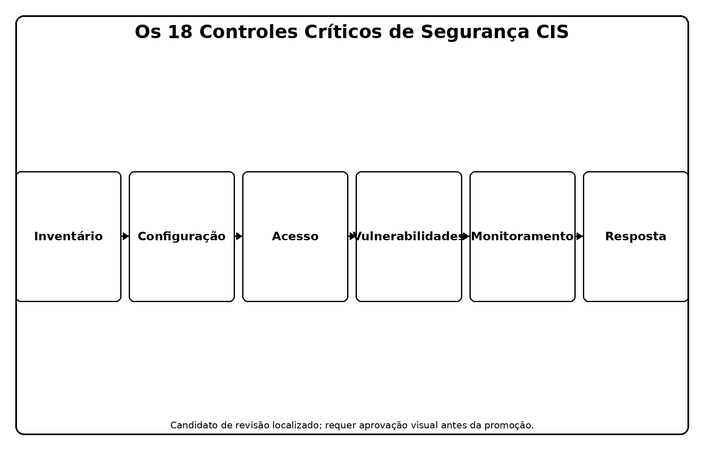
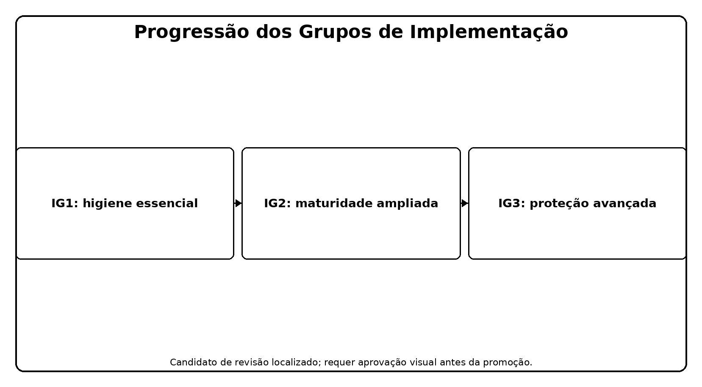
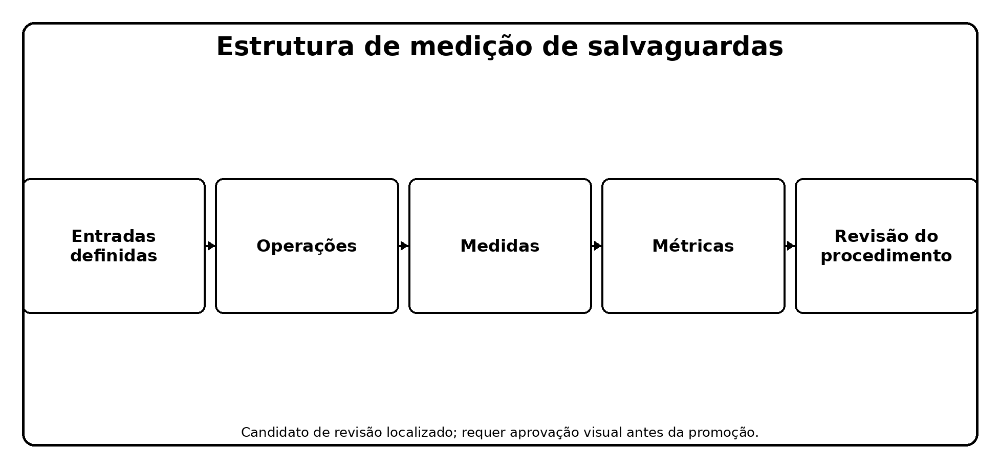
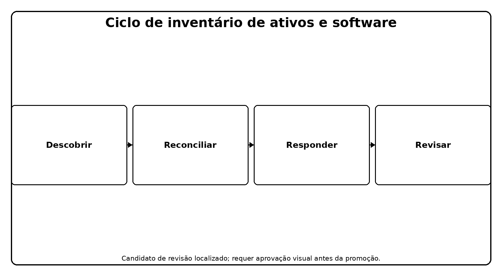
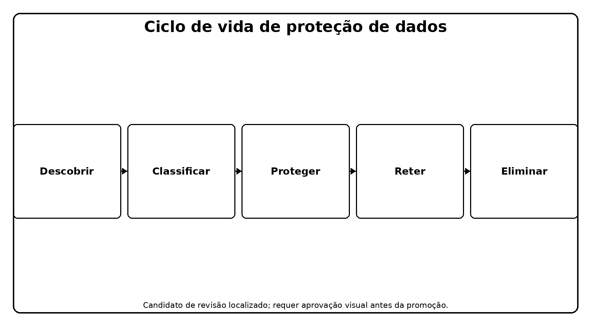
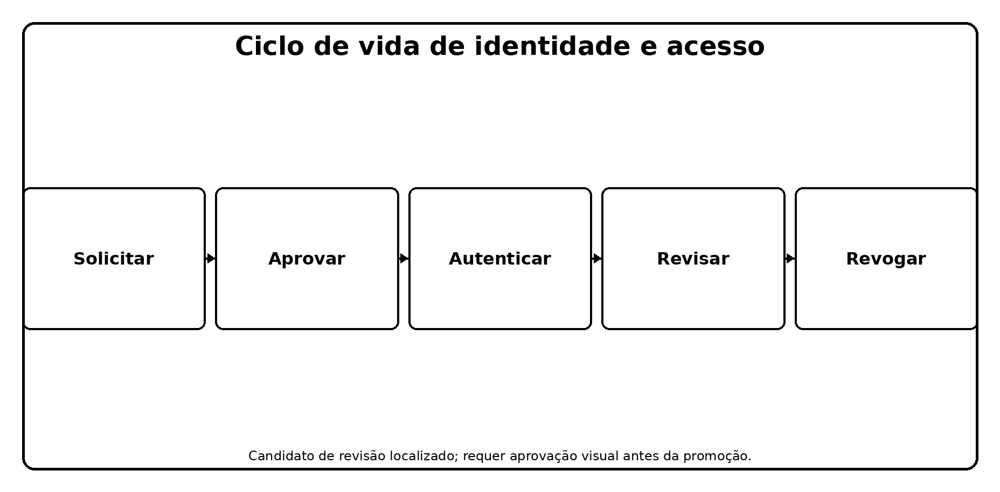
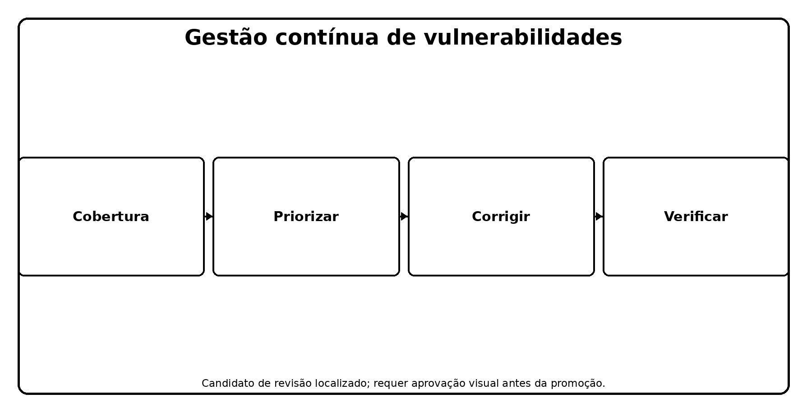
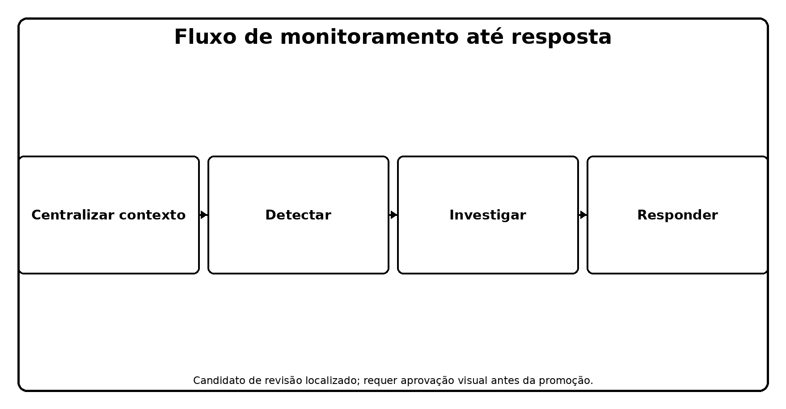
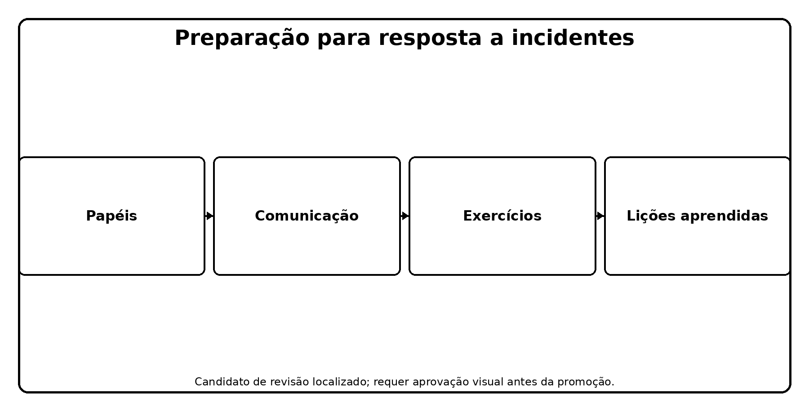
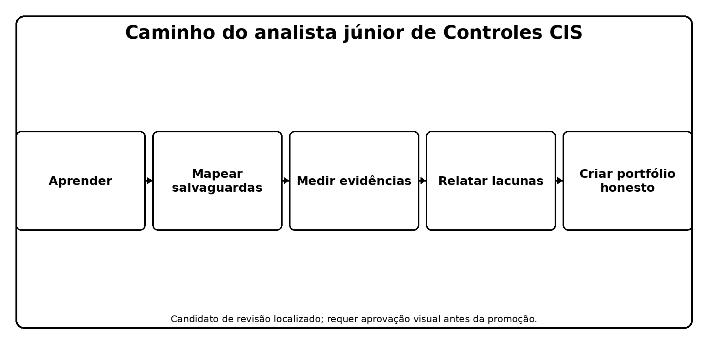

> **Status da revisão:** Rascunho de tradução assistida por máquina. Requer revisão humana de terminologia, significado, links, formatação e atualidade técnica antes de ser marcado como edição final.

** SÉRIES PRÁTICAS DE CIBERSegurança, PRIVACIDADE E COMPLIANÇA

**CIS Critical Security Controls v8.1**

**Implementação Prática, Medição, Evidência e Ferramentas de Código Aberto

* Um manual de trabalho para gerentes, analistas júnior, estudantes, profissionais de mudança de carreira, avaliadores e equipes de segurança*

** Alberto (Al) Leiva**

Primeira edição • Julho de 2026

No interior:** 18 Controlos • 153 Salvaguardas • IG1, IG2, IG3 • medição • evidência • ferramentas • livro de instruções do gestor • laboratórios • preparação para a carreira
---------------------------------------------------------------------------------------------------------------------------------------------------------------------

# Publicação e Aviso de Uso

Autor: Alberto (Al) Leiva

Edição: Primeira Edição, Julho 2026

Este manual educacional independente não é um Centro de Segurança da Internet publicação, certificação, acreditação, relatório de auditoria, opinião jurídica, ou garantia de segurança ou conformidade. CIS Controls e CIS Benchmarks são marcas comerciais do Centro de Segurança da Internet. Use recursos oficiais CIS para o conteúdo exato e orientação atual.

Os controles CIS são as melhores práticas de segurança cibernética. Não substituem as leis, regulamentos, contratos, requisitos do setor, avaliação de risco ou responsabilidade de gestão aplicáveis. Um mapeamento mostra relacionamentos; ele não prova automaticamente conformidade com outro framework.

# # Uso ético e autorizado

Use ferramentas técnicas apenas em ativos, redes, aplicativos, contas em nuvem, repositórios e dados que você possui ou estão especificamente autorizados por escrito para avaliar. Use informações sintéticas e sistemas isolados em laboratórios.

Prefácio

* Uma introdução prática para a defesa cibernética priorizada e medição baseada em evidências.*

Os controles CIS transformam as necessidades defensivas comuns em salvaguardas focadas. Sua força é a priorização prática: saiba o que você possui, controle software e dados, configure configurações e identidades seguras, gerencie vulnerabilidades e logs, prepare-se para rupturas e ataques e teste se as defesas funcionam.

Versão 8.1 é a edição atual. É uma atualização iterativa para v8 que realinhava mapeamentos para NIST CSF 2.0, expandiu definições de prazo reservado, revisou classes de ativos e mapeamentos de Salvaguarda, corrigiu problemas menores, clarificou algumas Salvaguardas, e incorporou a função de segurança do governo em mapeamentos. Os 18 Controlos e 153 Salvaguardas continuam a ser a estrutura central.

Uma instalação de ferramenta não é implementação. A implementação efetiva requer escopo definido, populações completas, configuração segura, evidência operacional, proprietários treinados, manipulação de exceção, medição, correção e reteste. Os gestores decidem prioridades e recursos; os analistas tornam essas decisões confiáveis através de inventários e evidências precisas.

Como usar este manual

- Os gestores devem começar pelos capítulos 1–5 e 24–25.

- Os analistas júnior devem estudar os 18 capítulos de controle, método de medição, ferramentas, laboratório e capítulo de entrevista.

- Equipes técnicas devem conectar cada Salvaguarda a ativos, dados, proprietários, procedimentos, configuração, monitoramento, manipulação de exceções e evidências.

- Os avaliadores devem usar a especificação oficial de avaliação de controles CIS para entradas exatas, operações, medidas, métricas, pressupostos e revisões de procedimentos.

*Conteúdo verdadeiro da palavra:** Este documento contém um campo nativo da tabela de conteúdos do Word. O guia do capítulo conterá números de página verificados para esta edição. Depois de editar, clique com o botão direito do mouse no conteúdo e escolha o Campo de Atualização e, em seguida, atualize a tabela inteira.
□----------------------------------------------------------------------------------------------------------------------------------------------------------------------------------------------------------------------- (--------------------------------------

Sumário

[Comunicação de publicação e utilização [2](#publication-and-use-notice)](#publication-and-use-notice)

[Utilização ética e autorizada [2](#ethical-and-authorized-use)](#ethical-and-authorized-use)

[Prefácio [3](#preface)](#preface)

[Como usar este manual [4](#how-to-use-this-manual)](#how-to-use-this-manual)

[Quadro de conteúdos [4](#table-of-contents)](#table-of-contents)

[1. CIS Controls v8.1 Fundações [7](#cis-controls-v8.1-foundations)](#cis-controls-v8.1-foundations)

[2. Grupos de implementação e priorização [8](#implementation-groups-and-prioritization)](#implementation-groups-and-prioritization)

[3. Governança, Âmbito e Propriedade [9](#governance-scope-and-ownership)](#governance-scope-and-ownership)

[4. Medição com a especificação de avaliação CIS [10](#measurement-with-the-cis-assessment-specification)](#measurement-with-the-cis-assessment-specification)

[5. Roteiro de aplicação [11](#implementation-roadmap)](#implementation-roadmap)

[6. Controlo 1 — Inventário e controlo dos activos empresariais [12](#control-1-inventory-and-control-of-enterprise-assets)](#control-1-inventory-and-control-of-enterprise-assets)

[7. Controlo 2 — Inventário e controlo de activos de software [13](#control-2-inventory-and-control-of-software-assets)](#control-2-inventory-and-control-of-software-assets)

[8. Controlo 3 — Protecção de dados [14](#control-3-data-protection)](#control-3-data-protection)

[9. Controlo 4 — Configuração segura dos activos empresariais e do software [16](#control-4-secure-configuration-of-enterprise-assets-and-software)](#control-4-secure-configuration-of-enterprise-assets-and-software)

[10. Controlo 5 — Gestão de Contas [18](#control-5-account-management)](#control-5-account-management)

[11. Controlo 6 — Gestão do controlo do acesso [19](#control-6-access-control-management)](#control-6-access-control-management)

[12. Controlo 7 — Gestão contínua da vulnerabilidade [21](#control-7-continuous-vulnerability-management)](#control-7-continuous-vulnerability-management)

[13. Controlo 8 — Gestão do Registo de Auditoria [23](#control-8-audit-log-management)](#control-8-audit-log-management)

[14. Controlo 9 — Proteção por e-mail e navegador Web [24](#control-9-email-and-web-browser-protections)](#control-9-email-and-web-browser-protections)

[15. Controle 10 — Defesas de malware [25](#control-10-malware-defenses)](#control-10-malware-defenses)

[16. Controlo 11 — Recuperação de dados [26](#control-11-data-recovery)](#control-11-data-recovery)

[17. Controlo 12 — Gestão da infra-estrutura da rede [27](#control-12-network-infrastructure-management)](#control-12-network-infrastructure-management)

[18. Controlo 13 — Monitorização e Defesa da Rede [28](#control-13-network-monitoring-and-defense)](#control-13-network-monitoring-and-defense)

[19. Controlo 14 — Formação em matéria de sensibilização e competências para a segurança [30](#control-14-security-awareness-and-skills-training)](#control-14-security-awareness-and-skills-training)

[20. Controlo 15 — Gestão do prestador de serviços [31](#control-15-service-provider-management)](#control-15-service-provider-management)

[21. Controlo 16 — Segurança do software de aplicação [32](#control-16-application-software-security)](#control-16-application-software-security)

[22. Controlo 17 — Gestão da resposta a incidentes [34](#control-17-incident-response-management)](#control-17-incident-response-management)

[23. Controlo 18 — Ensaio de penetração [36](#control-18-penetration-testing)](#control-18-penetration-testing)

[24. Ferramentas de Código Aberto [37](#open-source-tools)](#open-source-tools)

[24,1 CIS Controls Navigator [37](#cis-controls-navigator)](#cis-controls-navigator)

[24,2 CIS Controls Assessment Specification [37](#cis-controls-assessment-specification)](#cis-controls-assessment-specification)

[24,3 CIS-CAT Lite [37](#cis-cat-lite)](#cis-cat-lite)

[24.4 Assistente CISO [38](#ciso-assistant)](#ciso-assistant)

[24.5 Wazuh [38](#wazuh)](#wazuh)

[24.6 osquery [38](#osquery)](#osquery)

[24.7 OpenSCAP [38](#openscap)](#openscap)

[24.8 Lynis [38](#lynis)](#lynis)

[24,9 Nmap [39](#nmap)](#nmap)

[24.10 Greenbone Community Edition [39](#greenbone-community-edition)](#greenbone-community-edition)

[24.11 Trivy [39](#trivy)](#trivy)

[24,12 OWASP ZAP [39](#owasp-zap)](#owasp-zap)

[24.13 Suricata [39](#suricata)](#suricata)

[24.14 Keycloak [39](#keycloak)](#keycloak)

[24.15 DefectDojo [40](#defectdojo)](#defectdojo)

[24.16 Velociraptor [40](#velociraptor)](#velociraptor)

[25. CIS do gestor controla playbook [41](#managers-cis-controls-playbook)](#managers-cis-controls-playbook)

[26. Guia de carreira do analista júnior [42](#junior-analyst-career-guide)](#junior-analyst-career-guide)

[26.1 Trabalho júnior típico [42](#typical-junior-work)](#typical-junior-work)

[27. Laboratório e Portfólio Fictícios [44](#fictional-laboratory-and-portfolio)](#fictional-laboratory-and-portfolio)

[28. Plano de Aprendizagem de Trinta Dias [45](#thirty-day-learning-plan)](#thirty-day-learning-plan)

[29. Preparação da entrevista [46](#interview-preparation)](#interview-preparation)

[29.1 Quais são os controles CIS? [46](#what-are-the-cis-controls)](#what-are-the-cis-controls)

[29.2 O que é IG1? [46](#what-is-ig1)](#what-is-ig1)

[29.3 O IG1 corresponde a todos os requisitos? [46](#does-ig1-fit-every-requirement)](#does-ig1-fit-every-requirement)

[29.4 Como medir uma salvaguarda? [46](#how-do-you-measure-a-safeguard)](#how-do-you-measure-a-safeguard)

[29.5 Por que os inventários são importantes? [46](#why-are-inventories-important)](#why-are-inventories-important)

[29.6 Teste de vulnerabilidade versus penetração? [46](#vulnerability-scan-versus-penetration-test)](#vulnerability-scan-versus-penetration-test)

[29.7 Um mapeamento de framework prova conformidade? [46](#does-a-framework-mapping-prove-compliance)](#does-a-framework-mapping-prove-compliance)

[29,8 O que pode um analista júnior concluir? [46](#what-can-a-junior-analyst-conclude)](#what-can-a-junior-analyst-conclude)

[29.9 Perguntas ao empregador [46](#questions-to-ask-the-employer)](#questions-to-ask-the-employer)

[30. Modelos, Glossário, Índice e Referências [48](#templates-glossary-index-and-references)](#templates-glossary-index-and-references)

[30.1 Papel de medição de salvaguarda [48](#safeguard-measurement-workpaper)](#safeguard-measurement-workpaper)

[30.2 Registo de pesquisa e reteste [48](#finding-and-retest-record)](#finding-and-retest-record)

[30,3 Glossário [48](#glossary)](#glossary)

[30,4 Índice de assunto [49](#subject-index)](#subject-index)

[30,5 Referências oficiais [49](#official-references)](#official-references)

# 1. CIS Controls v8.1 Fundações

* A versão atual, estrutura, propósito e limitações.*

Figura 1. Os 18 controles de segurança críticos CIS

- CIS Controls v8.1 foi publicado em junho de 2024 e continua a ser a edição atual a partir de julho de 2026.

- Os controles são priorizadas as melhores práticas projetadas para defender sistemas e redes contra ataques prevalentes.

- O quadro contém 18 controlos e 153 salvaguardas.

- Salvaguarda mapas para classes de ativos, funções de segurança e grupos de implementação.

- A versão 8.1 alinha seu mapeamento NIST CSF para CSF 2.0 e inclui mapeamentos Govern.

- Existem mapeamentos oficiais para múltiplos quadros, mas a implementação deve ser verificada separadamente para cada requisito aplicável.

* ** ** ** ** ** **
----------------------------------------------------------------------------------------------------------------------------------------------------------------------------------------------------------
• Controlo • Resultado defensivo amplo, como inventário de activos ou resposta a incidentes
□ Salvaguarda □ Ação focada que pode ser atribuída, implementada e medida
Tipo de assunto afetado, como dispositivos, software, dados, rede, usuários ou documentação
Função de segurança □ Govern, Identificar, Proteger, Detectar, Responder, ou Recuperar mapeamento
Grupo de Implementação □ Priorização recomendada baseada no perfil de risco e nos recursos
□ Medida de avaliação □ Entradas, operações, medidas, métricas e revisão de procedimentos utilizados para avaliar uma Salvaguarda

2. Grupos de Implementação e Priorização

* Como IG1, IG2 e IG3 ajudam as organizações a escolher um ponto de partida realista.*

Figura 2. Progressão do Grupo de Implementação

Grupo** Grupo** **Segurança** ** Situação típica** **Objetivo**
------------------------------------------------------------------------------------------------------------------------------------------------------------
. . . . . 56 . . recursos de segurança limitados e experiência; menor sensibilidade; alta necessidade de continuidade básica . .
. . . . . . . . . .
□ IG3 □ IG1 + IG2 + 23 = 153 □ Especialistas em segurança, dados sensíveis ou regulamentados, serviços críticos e ameaças sofisticadas

- Cada empresa deve começar com IG1 de acordo com a orientação CIS.

- Selecione um IG considerando sensibilidade de dados, serviços críticos, exposição a ameaças, deveres legais e contratuais, tolerância aos negócios, tecnologia, pessoal e experiência.

- Um GI é uma ajuda de priorização, não permissão para ignorar um risco material ou exigência obrigatória.

- Adições sob medida do documento, sequenciamento, exceções, aceitação de risco, proprietários e datas.

- Use o oficial CIS Controls Navigator para filtrar v8.1 Salvaguardas e mapeamentos de revisão.

# 3. Governança, Escopo e Propriedade

* A fundação de gestão necessária para que as Salvaguardas funcionem de forma consistente.*

- Defina objetivos comerciais, serviços críticos, dados sensíveis, obrigações legais e contratuais, perfil de ameaça, tolerância ao risco e Grupo de Implementação escolhido.

- Criar inventários completos para ativos empresariais, software, dados, contas, sistemas de autenticação, infraestrutura de rede, logs, fornecedores, aplicativos e recursos de recuperação.

- Atribuir um proprietário responsável para cada proprietário de Salvaguarda e operacional para cada plataforma ou processo afetado.

- Definir escopo, aplicabilidade, dependências, responsabilidades prestadoras de serviços, exceções permitidas, autoridade de aprovação e gatilhos de revisão.

- Planeje financiamento, pessoas, habilidades, tecnologia, tempo e gestão de mudanças.

- Defina métricas e relatórios antes da implementação para que a cobertura e falha sejam visíveis.

- Operar um ciclo de governança: priorizar, implementar, medir, corrigir, reteste e melhorar.

• ** ** ** ** ** Decisão ou responsabilidade **
------------------------------------------------------------------------------------------------------------------------------------------------------------------------------------------------
• Patrocinador executivo □ Direção, tolerância ao risco, financiamento, escalada e responsabilização
□ Controlar o proprietário; Proteger o projeto, o escopo, o procedimento, a medição, as exceções e a melhoria;
□ Ativo ou proprietário de serviço □ Inventário preciso, uso aprovado, configuração, impacto de negócios e remediação
• Operações de segurança • Monitoramento, alerta, investigação, resposta e evidência
Implementação, controle de mudança, patching, configuração e recuperação
GRC / Analisador
• Auditoria interna / avaliador
Prestador de serviços □ Controles, evidências, incidentes, mudanças e suporte de saída contratados

# 4. Medição com a especificação de avaliação CIS

* Um método repetitivo para decidir se as salvaguardas são implementadas.*

Figura 3. CIS Estrutura de medição de salvaguarda

* Elemento** ** Pergunta**
----------------------------------------------------------------------
□ Proteger metadados Qual é a segurança exata, classe de ativos, função de segurança e IG?
Dependências Que outras salvaguardas ou populações devem existir primeiro?
Assunções Qual condição aceita afeta a medição?
Entradas Que dados completos e confiáveis são necessários? □
- Operações - Que análise deve ser realizada nas entradas?
Medidas O que conta, listas, datas, configurações ou resultados resultam?
Como as medidas são calculadas e interpretadas?
□ Revisão de procedimentos □ Existe um processo documentado e inclui elementos necessários? □

- Define exactamente a segurança e a população.

- Obter entradas necessárias e validar a completude, precisão, tempo, propriedade e confiabilidade da fonte.

- Siga as operações oficiais de medição ou documento de um método equivalente confiável.

- Manter os cálculos das medidas e a população de excepção subjacente — não apenas uma percentagem.

- Avaliar se a Salvaguarda está implementada e se está funcionando bem.

- Atribuir uma correção por falta de cobertura, má configuração, revisão atrasada, exceções, ou dados não confiáveis.

- Reteste usando os mesmos critérios e população atualizada.

- Denunciar escopo, resultado, exceção, limitação, proprietário, ação e data.

# 5. Roteiro de Implementação

* Uma sequência prática de inventários para resiliência testada.*

1. Escolha e documente o Grupo de Implementação inicial e quaisquer adições necessárias.

2. Construir e conciliar as populações principais: ativos, software, dados, contas, sistemas de autenticação, rede, fornecedores, aplicações e logs.

3. Implementar salvaguardas IG1 com proprietários, procedimentos, métricas de cobertura, exceções e evidências.

4. Identidades seguras, configurações, vulnerabilidades, e-mail, navegadores, defesas de malware, backups e monitoramento essencial.

5. Exercite resposta incidente e recuperação antes de uma emergência real.

6. Medir cada salvaguarda aplicável usando entradas confiáveis e operações repetitivas.

7. Corrigir a cobertura incompleta e repetir falhas; verificar correções através do reteste.

8. Expandir para IG2 ou IG3 com base em risco, obrigações, maturidade e exposição à ameaça.

9. Use mapeamentos oficiais para coordenar outros frameworks sem tratar mapeamentos como conformidade automática.

Princípio de implementação:** Um grupo menor de Salvaguardas que é totalmente escopo, operado, medido e melhorado é mais defensável do que uma longa lista marcada completa sem evidência confiável. □
□---------------------------------------------------------------------------------------------------------------------------------------------------------------------------------------------------------------------------------------------------------------------------------

# 6. Controle 1 — Inventário e controle de ativos empresariais

* Todas as 5 Salvaguardas, significado simples, foco de verificação e evidência de exemplo.*

Figura 4. Ciclo de inventário de ativos e software

. ** Finalidade do controlo: ** Fortalecer a empresa através da implementação e medição de salvaguardas para o inventário e controle de ativos empresariais. □
----------------------------------------------------------------------

* * * * * * * * * * * * * * * * * * * * * * * * * * * * * * * * * * * * * * * * * * * * * * * * * * * *
-----------------------------------------------------------------------------------------------------------------------------------------------------------------------------------------------------------------------------------------------------------------------------------------------------------------------------------------------------------------------------------------------------------------------------------------------------------------
Introdução e manutenção detalhada Inventário de ativos corporativos Coloque em prática um processo repetível, de propriedade ou controle técnico para estabelecer e manter o Inventário de ativos corporativos detalhados, então verifique cobertura e exceções. Confirmar escopo definido, população, propriedade, implementação, frequência, cobertura, exceções, correção e reteste. Inventário de ativos, proprietários, status de aprovação, descoberta ativa/passiva, logs DHCP/IPAM, tickets não autorizados
Endereço Activos Não Autorizados Coloque um processo repetível, de propriedade ou controle técnico no local para abordar ativos não autorizados, em seguida, verificar cobertura e exceções. Confirmar escopo definido, população, propriedade, implementação, frequência, cobertura, exceções, correção e reteste. Inventário de ativos, proprietários, status de aprovação, descoberta ativa/passiva, logs DHCP/IPAM, tickets não autorizados
□ 1.3 □ Utilizar uma ferramenta de descoberta ativa Coloque no lugar um processo repetível, de propriedade ou controle técnico para utilizar uma ferramenta Active Discovery, então verifique cobertura e exceções. Confirmar escopo definido, população, propriedade, implementação, frequência, cobertura, exceções, correção e reteste. Inventário de ativos, proprietários, status de aprovação, descoberta ativa/passiva, logs DHCP/IPAM, tickets não autorizados
Use o DHCP Logging para atualizar o Inventário de Ativos Empresariais.Põr em prática um processo repetível, de propriedade ou controle técnico para usar o DHCP Logging para atualizar o Inventário de Ativos Empresariais, em seguida, verificar a cobertura e exceções. Confirmar escopo definido, população, propriedade, implementação, frequência, cobertura, exceções, correção e reteste. Inventário de ativos, proprietários, status de aprovação, descoberta ativa/passiva, logs DHCP/IPAM, tickets não autorizados
Use uma ferramenta de descoberta passiva de ativos Coloque no lugar um processo repetível, de propriedade ou controle técnico para usar uma ferramenta Passive Asset Discovery, então verifique cobertura e exceções. Confirmar escopo definido, população, propriedade, implementação, frequência, cobertura, exceções, correção e reteste. Inventário de ativos, proprietários, status de aprovação, descoberta ativa/passiva, logs DHCP/IPAM, tickets não autorizados

Use o guia oficial de Controles CIS v8.1 e Especificações de Avaliação de Controles para linguagem de Salvaguarda exata, classe de ativos, função de segurança, Grupo de Implementação, dependências, entradas, operações, medidas, métricas e revisão processual.

# 7. Controle 2 — Inventário e Controle de Ativos de Software

* Todas as 7 Salvaguardas, significado simples, foco de verificação e evidência de exemplo.*

. ** Finalidade do controlo: ** Fortalecer a empresa através da implementação e medição de salvaguardas para o inventário e controle de ativos de software. □
□-----------------------------------------------------------------------------------------------------------------------------------------------------------------------------------------------------------------------------------------------------------------

* * * * * * * * * * * * * * * * * * * * * * * * * * * * * * * * * * * * * * * * * * * * * * * * * * * *
----------------------------------------------------------------------------------------------------------------------------------------------------------------------------------------------------------------------------------------------------------------------------------------------------------------------------------------------------------------------------------------------------------------------------------------------------------------------------------------------------------------------------------------------------------------------------------------------------------------------------------------
Estabelecer e manter um Inventário de Software.Coloque em prática um processo repetível, de propriedade ou controle técnico para estabelecer e manter um Inventário de Software, então verifique cobertura e exceções. Confirmar escopo definido, população, propriedade, implementação, frequência, cobertura, exceções, correção e reteste. Inventário de software, status de suporte, lista aprovada, resultados de descoberta, exceções, política de allowlisting e eventos
• 2.2 • Certifique-se de que o Software Autorizado está atualmente suportado □ Coloque em prática um processo repetível, de propriedade ou controle técnico para garantir que o Software Autorizado esteja atualmente apoiado, então verifique cobertura e exceções. Confirmar escopo definido, população, propriedade, implementação, frequência, cobertura, exceções, correção e reteste. Inventário de software, status de suporte, lista aprovada, resultados de descoberta, exceções, política de allowlisting e eventos
Endereço Software não autorizado Coloque um processo repetível, de propriedade ou controle técnico no local para abordar Software não autorizado, em seguida, verificar cobertura e exceções. Confirmar escopo definido, população, propriedade, implementação, frequência, cobertura, exceções, correção e reteste. Inventário de software, status de suporte, lista aprovada, resultados de descoberta, exceções, política de allowlisting e eventos
□ 2.4 □ Utilizar ferramentas de inventário de software automatizadas Coloque um processo repetível, de propriedade ou controle técnico no local para utilizar Ferramentas de Inventário de Software Automatizado, em seguida, verifique cobertura e exceções. Confirmar escopo definido, população, propriedade, implementação, frequência, cobertura, exceções, correção e reteste. Inventário de software, status de suporte, lista aprovada, resultados de descoberta, exceções, política de allowlisting e eventos
Software Autorizado de Allowlist Coloque um processo repetível, de propriedade ou controle técnico no local para permitir o software autorizado lista, em seguida, verificar a cobertura e exceções. Confirmar escopo definido, população, propriedade, implementação, frequência, cobertura, exceções, correção e reteste. Inventário de software, status de suporte, lista aprovada, resultados de descoberta, exceções, política de allowlisting e eventos
2.6 □ Allowlist Bibliotecas Autorizadas □ Coloque em prática um processo repetível, de propriedade ou controle técnico para permitir a lista Bibliotecas Autorizadas, então verifique cobertura e exceções. Confirmar escopo definido, população, propriedade, implementação, frequência, cobertura, exceções, correção e reteste. Inventário de software, status de suporte, lista aprovada, resultados de descoberta, exceções, política de allowlisting e eventos
Lista de Allowlist Scripts Autorizados Coloque um processo repetível, de propriedade ou controle técnico no local para permitir Lista Scripts Autorizados, em seguida, verificar cobertura e exceções. Confirmar escopo definido, população, propriedade, implementação, frequência, cobertura, exceções, correção e reteste. Inventário de software, status de suporte, lista aprovada, resultados de descoberta, exceções, política de allowlisting e eventos

Use o guia oficial de Controles CIS v8.1 e Especificações de Avaliação de Controles para linguagem de Salvaguarda exata, classe de ativos, função de segurança, Grupo de Implementação, dependências, entradas, operações, medidas, métricas e revisão processual.

# 8. Controle 3 — Proteção de dados

* Todas as 14 Salvaguardas, significado simples, foco de verificação e evidência de exemplo.*

Figura 5. Ciclo de vida de proteção de dados

. ** Finalidade do controlo: ** Reforçar a empresa através da implementação e medição de salvaguardas para a protecção de dados. □
-------------------------------------------------------------------------------------------------------------------------------------------------------------------------------------------------------------------------------------------------------------------------------

* * * * * * * * * * * * * * * * * * * * * * * * * * * * * * * * * * * * * * * * * * * * * * * * * * * *
---------------------------------------------------------------------------------------------------------------------------------------------------------------------------------------------------------------------------------------------------------------------------------------------------------------------------------------------------------------------------------------------------------------------------------------------------------------------------------------------------------------
3.1 Estabelecer e manter um processo de gerenciamento de dados .Põr em prática um processo repetível, de propriedade ou controle técnico para estabelecer e manter um processo de gerenciamento de dados, em seguida, verificar cobertura e exceções. Confirmar escopo definido, população, propriedade, implementação, frequência, cobertura, exceções, correção e reteste. Lista de dados, classificação, fluxos, ACLs, retenção, eliminação, criptografia, DLP e logs de acesso
3.2 Estabelecer e manter um Inventário de Dados .Põr em prática um processo repetível, de propriedade ou controle técnico para estabelecer e manter um Inventário de Dados, em seguida, verificar a cobertura e exceções. Confirmar escopo definido, população, propriedade, implementação, frequência, cobertura, exceções, correção e reteste. Lista de dados, classificação, fluxos, ACLs, retenção, eliminação, criptografia, DLP e logs de acesso
Configurar Listas de Controle de Acesso de Dados Coloque em prática um processo repetível, de propriedade ou controle técnico para configurar Listas de Controle de Acesso de Dados e, em seguida, verifique a cobertura e exceções. Confirmar escopo definido, população, propriedade, implementação, frequência, cobertura, exceções, correção e reteste. Lista de dados, classificação, fluxos, ACLs, retenção, eliminação, criptografia, DLP e logs de acesso
□ 3.4 □ Forçar a retenção de dados □ Coloque em prática um processo repetível, de propriedade ou controle técnico para impor a retenção de dados, em seguida, verificar a cobertura e exceções. Confirmar escopo definido, população, propriedade, implementação, frequência, cobertura, exceções, correção e reteste. Lista de dados, classificação, fluxos, ACLs, retenção, eliminação, criptografia, DLP e logs de acesso
3.5 □ Eliminar com segurança os dados Coloque em prática um processo repetível, de propriedade ou controle técnico para eliminar de forma segura os dados, então verifique a cobertura e exceções. Confirmar escopo definido, população, propriedade, implementação, frequência, cobertura, exceções, correção e reteste. Lista de dados, classificação, fluxos, ACLs, retenção, eliminação, criptografia, DLP e logs de acesso
□ 3.6 □ Criptografar Dados em Dispositivos de Usuário Final □ Coloque em prática um processo repetível, de propriedade ou controle técnico para criptografar Dados em Dispositivos de Usuário Final, então verifique cobertura e exceções. Confirmar escopo definido, população, propriedade, implementação, frequência, cobertura, exceções, correção e reteste. Lista de dados, classificação, fluxos, ACLs, retenção, eliminação, criptografia, DLP e logs de acesso
□ 3.7 □ Estabelecer e manter um esquema de classificação de dados □ Colocar em prática um processo repetível, de propriedade ou controle técnico para estabelecer e manter um esquema de classificação de dados, em seguida, verificar a cobertura e exceções. Confirmar escopo definido, população, propriedade, implementação, frequência, cobertura, exceções, correção e reteste. Lista de dados, classificação, fluxos, ACLs, retenção, eliminação, criptografia, DLP e logs de acesso
Os fluxos de dados do documento Coloque em prática um processo repetível, de propriedade ou controle técnico para documentar Fluxos de Dados, então verifique cobertura e exceções. Confirmar escopo definido, população, propriedade, implementação, frequência, cobertura, exceções, correção e reteste. Lista de dados, classificação, fluxos, ACLs, retenção, eliminação, criptografia, DLP e logs de acesso
.. 3.9 .. Criptografar dados em mídia removível .. Coloque um processo repetível, de propriedade ou controle técnico para criptografar dados em mídia removível, em seguida, verificar cobertura e exceções. Confirmar escopo definido, população, propriedade, implementação, frequência, cobertura, exceções, correção e reteste. Lista de dados, classificação, fluxos, ACLs, retenção, eliminação, criptografia, DLP e logs de acesso
3.10 Crypt Sensitive Data in Trânsito Coloque no lugar um processo repetível, de propriedade ou controle técnico para criptografar Dados Sensitivos em Trânsito, então verifique cobertura e exceções. Confirmar escopo definido, população, propriedade, implementação, frequência, cobertura, exceções, correção e reteste. Lista de dados, classificação, fluxos, ACLs, retenção, eliminação, criptografia, DLP e logs de acesso
Em repouso, criptografar dados sensíveis Coloque um processo repetível, de propriedade ou controle técnico no local para criptografar dados sensíveis em repouso, então verifique cobertura e exceções. Confirmar escopo definido, população, propriedade, implementação, frequência, cobertura, exceções, correção e reteste. Lista de dados, classificação, fluxos, ACLs, retenção, eliminação, criptografia, DLP e logs de acesso
Segmento Processamento e Armazenamento de Dados Baseado na Sensibilidade .. Coloque em prática um processo repetível, de propriedade ou controle técnico para segmentar Processamento e Armazenamento de Dados Baseado na Sensibilidade, então verifique cobertura e exceções. Confirmar escopo definido, população, propriedade, implementação, frequência, cobertura, exceções, correção e reteste. Lista de dados, classificação, fluxos, ACLs, retenção, eliminação, criptografia, DLP e logs de acesso
3.13 Implantar uma solução de prevenção de perda de dados Coloque em prática um processo repetível, de propriedade ou controle técnico para implantar uma Solução de Prevenção de Perda de Dados, então verifique cobertura e exceções. Confirmar escopo definido, população, propriedade, implementação, frequência, cobertura, exceções, correção e reteste. Lista de dados, classificação, fluxos, ACLs, retenção, eliminação, criptografia, DLP e logs de acesso
Acesso de Dados Sensíveis ao Log Coloque um processo repetível, de propriedade ou controle técnico no local para registrar o acesso de dados sensíveis, em seguida, verificar a cobertura e exceções. Confirmar escopo definido, população, propriedade, implementação, frequência, cobertura, exceções, correção e reteste. Lista de dados, classificação, fluxos, ACLs, retenção, eliminação, criptografia, DLP e logs de acesso

Use o guia oficial de Controles CIS v8.1 e Especificações de Avaliação de Controles para linguagem de Salvaguarda exata, classe de ativos, função de segurança, Grupo de Implementação, dependências, entradas, operações, medidas, métricas e revisão processual.

# 9. Controle 4 — Configuração segura de ativos empresariais e software

* Todas as 12 Salvaguardas, significado simples, foco de verificação e evidência de exemplo.*

. ** Finalidade do controlo: ** Fortaleça a empresa implementando e medindo salvaguardas para a configuração segura de ativos e software da empresa. □
□---------------------------------------------------------------------------------------------------------------------------------------------------------------------------------------------------------------------------------

* * * * * * * * * * * * * * * * * * * * * * * * * * * * * * * * * * * * * * * * * * * * * * * * * * * *
--------------------------------------------------------------------------------------------------------------------------------------------------------------------------------------------------------------------------------------------------------------------------------------------------------------------------------------------------------------------------------------------------------------------------------------------------------------------------------------------------------------------------------------------------------------------------------------------------------------------------------------------------------------------------------------------------------------------------------------------------------------------------------------------------------------------------------------------
4.1 Estabelecer e manter um processo de configuração seguro .Põr em prática um processo repetível, de propriedade ou controle técnico para estabelecer e manter um processo de configuração seguro, em seguida, verificar a cobertura e exceções. Confirmar escopo definido, população, propriedade, implementação, frequência, cobertura, exceções, correção e reteste. Normas de configuração, resultados de benchmark, firewalls, bloqueios de sessão, protocolos de administração, defaults, serviços e configurações móveis
4.2 Estabelecer e manter um processo de configuração seguro para a infraestrutura de rede.Põr em prática um processo repetível, de propriedade ou controle técnico para estabelecer e manter um processo de configuração seguro para a infraestrutura de rede, em seguida, verificar a cobertura e exceções. Confirmar escopo definido, população, propriedade, implementação, frequência, cobertura, exceções, correção e reteste. Normas de configuração, resultados de benchmark, firewalls, bloqueios de sessão, protocolos de administração, defaults, serviços e configurações móveis
Configura o bloqueio automático de sessão em ativos empresariais Coloque em prática um processo repetível, de propriedade ou controle técnico para configurar o bloqueio automático de sessão em ativos corporativos, em seguida, verifique a cobertura e exceções. Confirmar escopo definido, população, propriedade, implementação, frequência, cobertura, exceções, correção e reteste. Normas de configuração, resultados de benchmark, firewalls, bloqueios de sessão, protocolos de administração, defaults, serviços e configurações móveis
4.4 Implementar e Gerenciar um Firewall em Servidores Coloque um processo repetível, de propriedade ou controle técnico para implementar e gerenciar um Firewall em Servidores, então verifique cobertura e exceções. Confirmar escopo definido, população, propriedade, implementação, frequência, cobertura, exceções, correção e reteste. Normas de configuração, resultados de benchmark, firewalls, bloqueios de sessão, protocolos de administração, defaults, serviços e configurações móveis
□ 4.5 □ Implementar e Gerenciar um Firewall em Dispositivos de Usuário Final □ Coloque em prática um processo ou controle técnico repetível, de propriedade para implementar e gerenciar um Firewall em Dispositivos de Usuário Final, em seguida, verifique cobertura e exceções. Confirmar escopo definido, população, propriedade, implementação, frequência, cobertura, exceções, correção e reteste. Normas de configuração, resultados de benchmark, firewalls, bloqueios de sessão, protocolos de administração, defaults, serviços e configurações móveis
Como Gerenciar com segurança os ativos e o software corporativos?Coloque no lugar um processo repetível, de propriedade ou controle técnico para Gerenciar com segurança os ativos empresariais e o software, então verifique a cobertura e exceções. Confirmar escopo definido, população, propriedade, implementação, frequência, cobertura, exceções, correção e reteste. Normas de configuração, resultados de benchmark, firewalls, bloqueios de sessão, protocolos de administração, defaults, serviços e configurações móveis
Como Gerenciar contas padrão em ativos e software corporativos?Coloque em prática um processo repetível, de propriedade ou controle técnico para gerenciar contas padrão em ativos corporativos e software, então verifique cobertura e exceções. Confirmar escopo definido, população, propriedade, implementação, frequência, cobertura, exceções, correção e reteste. Normas de configuração, resultados de benchmark, firewalls, bloqueios de sessão, protocolos de administração, defaults, serviços e configurações móveis
4.8 Desinstalar ou desativar Serviços Desnecessários em Ativos e Software Corporativos Coloque em prática um processo ou controle técnico repetível, de propriedade para desinstalar ou desativar Serviços Desnecessários em Ativos e Software Corporativos, então verifique cobertura e exceções. Confirmar escopo definido, população, propriedade, implementação, frequência, cobertura, exceções, correção e reteste. Normas de configuração, resultados de benchmark, firewalls, bloqueios de sessão, protocolos de administração, defaults, serviços e configurações móveis
Configura Servidores DNS confiáveis em ativos corporativos Coloque um processo repetível, de propriedade ou controle técnico para configurar Servidores DNS confiáveis em ativos corporativos, então verifique cobertura e exceções. Confirmar escopo definido, população, propriedade, implementação, frequência, cobertura, exceções, correção e reteste. Normas de configuração, resultados de benchmark, firewalls, bloqueios de sessão, protocolos de administração, defaults, serviços e configurações móveis
4.10 Forçar o bloqueio automático do dispositivo em dispositivos portáteis do usuário final Coloque em prática um processo repetível, de propriedade ou controle técnico para aplicar o Bloqueio Automático de Dispositivos Portáteis de Usuário Final, em seguida, verifique a cobertura e exceções. Confirmar escopo definido, população, propriedade, implementação, frequência, cobertura, exceções, correção e reteste. Normas de configuração, resultados de benchmark, firewalls, bloqueios de sessão, protocolos de administração, defaults, serviços e configurações móveis
• 4.11 • Forçar a capacidade de limpeza remota em dispositivos portáteis de uso final Coloque em prática um processo repetível, de propriedade ou controle técnico para impor a capacidade de limpeza remota em dispositivos portáteis de usuário final, em seguida, verifique a cobertura e exceções. Confirmar escopo definido, população, propriedade, implementação, frequência, cobertura, exceções, correção e reteste. Normas de configuração, resultados de benchmark, firewalls, bloqueios de sessão, protocolos de administração, defaults, serviços e configurações móveis
□ 4.12 □ Separar os espaços de trabalho empresariais em dispositivos móveis de utilização final □ Coloque em prática um processo repetível, de propriedade ou controlo técnico para separar os espaços de trabalho empresariais em dispositivos móveis de utilização final e verificar a cobertura e as exceções. Confirmar escopo definido, população, propriedade, implementação, frequência, cobertura, exceções, correção e reteste. Normas de configuração, resultados de benchmark, firewalls, bloqueios de sessão, protocolos de administração, defaults, serviços e configurações móveis

Use o guia oficial de Controles CIS v8.1 e Especificações de Avaliação de Controles para linguagem de Salvaguarda exata, classe de ativos, função de segurança, Grupo de Implementação, dependências, entradas, operações, medidas, métricas e revisão processual.

# 10. Controle 5 — Gestão de Contas

* Todas as 6 Salvaguardas, significado simples, foco de verificação e evidência de exemplo.*

. ** Finalidade do controlo: ** Reforçar a empresa através da implementação e medição de salvaguardas para a gestão de contas. □
□--------------------------------------------------------------------------------------------------------------------------------

* * * * * * * * * * * * * * * * * * * * * * * * * * * * * * * * * * * * * * * * * * * * * * * * * * * *
----------------------------------------------------------------------------------------------------------------------------------------------------------------------------------------------------------------------------------------------------------------------------------------------------------------------------------------------------------------------------------------------------------------------------------------------------------------------------------------------------------------------------------------------------------------------------------------------------------------------------------------------------------------------------------------------------------------------------
• 5.1 • Estabelecer e manter um Inventário de Contas • Colocar em prática um processo repetível, de propriedade ou controle técnico para estabelecer e manter um Inventário de Contas, em seguida, verificar a cobertura e exceções. Confirmar escopo definido, população, propriedade, implementação, frequência, cobertura, exceções, correção e reteste. As populações da conta, os proprietários, as datas, a política da senha, as ações da conta dormente, os inventários da conta do administrador e do serviço
Use senhas únicas Coloque um processo repetível, de propriedade ou controle técnico para usar senhas únicas e, em seguida, verifique a cobertura e exceções. Confirmar escopo definido, população, propriedade, implementação, frequência, cobertura, exceções, correção e reteste. As populações da conta, os proprietários, as datas, a política da senha, as ações da conta dormente, os inventários da conta do administrador e do serviço
5.3 Desactivar contas domésticas Coloque em prática um processo repetível, de propriedade ou controle técnico para desativar Contas Dormintes e, em seguida, verificar a cobertura e exceções. Confirmar escopo definido, população, propriedade, implementação, frequência, cobertura, exceções, correção e reteste. As populações da conta, os proprietários, as datas, a política da senha, as ações da conta dormente, os inventários da conta do administrador e do serviço
Restringir os Privilégios de Administrador às Contas de Administradores Dedicadas Coloque em prática um processo repetível, de propriedade ou controle técnico para restringir os Privilégios de Administrador às Contas de Administrador Dedicadas, em seguida, verifique a cobertura e exceções. Confirmar escopo definido, população, propriedade, implementação, frequência, cobertura, exceções, correção e reteste. As populações da conta, os proprietários, as datas, a política da senha, as ações da conta dormente, os inventários da conta do administrador e do serviço
5,5 □ Estabelecer e manter um Inventário de Contas de Serviço □ Colocar em prática um processo repetível, de propriedade ou controle técnico para estabelecer e manter um Inventário de Contas de Serviço, em seguida, verificar cobertura e exceções. Confirmar escopo definido, população, propriedade, implementação, frequência, cobertura, exceções, correção e reteste. As populações da conta, os proprietários, as datas, a política da senha, as ações da conta dormente, os inventários da conta do administrador e do serviço
5.6 Centralizar a Gestão de Contas Coloque em prática um processo repetível, de propriedade ou controle técnico para centralizar o Gerenciamento de Contas, em seguida, verifique a cobertura e exceções. Confirmar escopo definido, população, propriedade, implementação, frequência, cobertura, exceções, correção e reteste. As populações da conta, os proprietários, as datas, a política da senha, as ações da conta dormente, os inventários da conta do administrador e do serviço

Use o guia oficial de Controles CIS v8.1 e Especificações de Avaliação de Controles para linguagem de Salvaguarda exata, classe de ativos, função de segurança, Grupo de Implementação, dependências, entradas, operações, medidas, métricas e revisão processual.

# 11. Controle 6 — Gerenciamento de Controle de Acesso

* Todas as 8 Salvaguardas, significado simples, foco de verificação e evidência de exemplo.*

Figura 6. Ciclo de vida de identidade e acesso

. ** Finalidade do controlo: ** Reforçar a empresa através da implementação e medição de salvaguardas para a gestão do controlo de acesso. □
----------------------------------------------------

* * * * * * * * * * * * * * * * * * * * * * * * * * * * * * * * * * * * * * * * * * * * * * * * * * * *
-------------------------------------------------------------------------------------------------------------------------------------------------------------------------------------------------------------------------------------------------------------------------------------------------------------------------------------------------------------------------------------------------------------------------------------------------------------------------------------------------------------------------------------------------------------------------------------------------------------------------------------------------------------------------------------------------------------------------------------------------------------------------------------------------------------------------------------------------------------------------
• 6.1 • Estabelecer um Processo de Concessão de Acesso • Colocar em prática um processo repetível, de propriedade ou controle técnico para estabelecer um Processo de Concessão de Acesso e, em seguida, verificar a cobertura e exceções. Confirmar escopo definido, população, propriedade, implementação, frequência, cobertura, exceções, correção e reteste. Ingressos de concessão/revoke, cobertura MFA, inventário do sistema de autenticação, funções, direitos e revisões de acesso
□ 6.2 □ Estabelecer um Processo de Revogação de Acesso □ Colocar um processo repetível, de propriedade ou controle técnico para estabelecer um Processo de Revogação de Acesso, em seguida, verificar a cobertura e exceções. Confirmar escopo definido, população, propriedade, implementação, frequência, cobertura, exceções, correção e reteste. Ingressos de concessão/revoke, cobertura MFA, inventário do sistema de autenticação, funções, direitos e revisões de acesso
□ 6.3 □ Exigir o MFA para Aplicações Expostas Externamente • Coloque em prática um processo repetível, de propriedade ou controle técnico para exigir o MFA para Aplicações Expostas Externamente e, em seguida, verifique a cobertura e exceções. Confirmar escopo definido, população, propriedade, implementação, frequência, cobertura, exceções, correção e reteste. Ingressos de concessão/revoke, cobertura MFA, inventário do sistema de autenticação, funções, direitos e revisões de acesso
6.4 Requer MFA para acesso remoto à rede Coloque um processo repetível, de propriedade ou controle técnico para exigir MFA para acesso remoto à rede, então verifique cobertura e exceções. Confirmar escopo definido, população, propriedade, implementação, frequência, cobertura, exceções, correção e reteste. Ingressos de concessão/revoke, cobertura MFA, inventário do sistema de autenticação, funções, direitos e revisões de acesso
6.5 Requer AMF para acesso administrativo Coloque um processo repetível, de propriedade ou controle técnico para exigir MFA para acesso administrativo, em seguida, verificar cobertura e exceções. Confirmar escopo definido, população, propriedade, implementação, frequência, cobertura, exceções, correção e reteste. Ingressos de concessão/revoke, cobertura MFA, inventário do sistema de autenticação, funções, direitos e revisões de acesso
6.6 Criar e manter um Inventário de Sistemas de Autenticação e Autorização.Põr em prática um processo repetível, de propriedade ou controle técnico para estabelecer e manter um Inventário de Sistemas de Autenticação e Autorização, em seguida, verificar a cobertura e exceções. Confirmar escopo definido, população, propriedade, implementação, frequência, cobertura, exceções, correção e reteste. Ingressos de concessão/revoke, cobertura MFA, inventário do sistema de autenticação, funções, direitos e revisões de acesso
6.7 Centralizar o Controle de Acesso Coloque em prática um processo repetível, de propriedade ou controle técnico para centralizar o Controle de Acesso, então verifique cobertura e exceções. Confirmar escopo definido, população, propriedade, implementação, frequência, cobertura, exceções, correção e reteste. Ingressos de concessão/revoke, cobertura MFA, inventário do sistema de autenticação, funções, direitos e revisões de acesso
Defina e mantenha o controle de acesso baseado em funções Coloque em prática um processo repetível, de propriedade ou controle técnico para definir e manter o controle de acesso baseado em funções, então verifique cobertura e exceções. Confirmar escopo definido, população, propriedade, implementação, frequência, cobertura, exceções, correção e reteste. Ingressos de concessão/revoke, cobertura MFA, inventário do sistema de autenticação, funções, direitos e revisões de acesso

Use o guia oficial de Controles CIS v8.1 e Especificações de Avaliação de Controles para linguagem de Salvaguarda exata, classe de ativos, função de segurança, Grupo de Implementação, dependências, entradas, operações, medidas, métricas e revisão processual.

# 12. Controle 7 — Gestão de Vulnerabilidade Contínua

* Todas as 7 Salvaguardas, significado simples, foco de verificação e evidência de exemplo.*

Figura 7. Gestão contínua da vulnerabilidade

. ** Finalidade do controlo: ** Fortalecer a empresa implementando e medindo salvaguardas para a gestão contínua da vulnerabilidade. □
□----------------------------------------------------------------------------------------------------------------------------------------------------------------------------------

* * * * * * * * * * * * * * * * * * * * * * * * * * * * * * * * * * * * * * * * * * * * * * * * * * * *
------------------------------------------------------------------------------------------------------------------------------------------------------------------------------------------------------------------------------------------------------------------------------------------------------------------------------------------------------------------------------------------------------------
□ 7.1 □ Estabeleça e mantenha um Processo de Gestão de Vulnerabilidade □ Coloque em prática um processo repetível, de propriedade ou controle técnico para estabelecer e manter um Processo de Gestão de Vulnerabilidade, em seguida, verifique cobertura e exceções. Confirmar escopo definido, população, propriedade, implementação, frequência, cobertura, exceções, correção e reteste. Processos, feeds, cobertura de ativos, varreduras autenticadas, resultados de patch, exceções, tickets de remediação e rescans
• 7,2 • Estabelecer e manter um processo de remediação; • Colocar um processo repetível, de propriedade ou controle técnico para estabelecer e manter um processo de remediação; Confirmar escopo definido, população, propriedade, implementação, frequência, cobertura, exceções, correção e reteste. Processos, feeds, cobertura de ativos, varreduras autenticadas, resultados de patch, exceções, tickets de remediação e rescans
Realizar o gerenciamento automático do patch do sistema operacional Coloque em prática um processo repetível, de propriedade ou controle técnico para executar o gerenciamento automático do patch do sistema operacional, então verifique a cobertura e exceções. Confirmar escopo definido, população, propriedade, implementação, frequência, cobertura, exceções, correção e reteste. Processos, feeds, cobertura de ativos, varreduras autenticadas, resultados de patch, exceções, tickets de remediação e rescans
Realizar o gerenciamento automatizado do patch da aplicação Coloque um processo repetível, de propriedade ou controle técnico no local para executar o gerenciamento automático de patch de aplicação, em seguida, verifique a cobertura e exceções. Confirmar escopo definido, população, propriedade, implementação, frequência, cobertura, exceções, correção e reteste. Processos, feeds, cobertura de ativos, varreduras autenticadas, resultados de patch, exceções, tickets de remediação e rescans
Realizar verificações automáticas de vulnerabilidade de ativos internos da empresa Coloque em prática um processo repetível, de propriedade ou controle técnico para realizar varreduras de vulnerabilidade automatizada de ativos empresariais internos, então verifique cobertura e exceções. Confirmar escopo definido, população, propriedade, implementação, frequência, cobertura, exceções, correção e reteste. Processos, feeds, cobertura de ativos, varreduras autenticadas, resultados de patch, exceções, tickets de remediação e rescans
Realizar verificações de vulnerabilidade automatizadas de ativos empresariais externamente expostos Coloque em prática um processo repetível, de propriedade ou controle técnico para executar varreduras de vulnerabilidade automatizada de ativos corporativos externamente expostos, então verifique cobertura e exceções. Confirmar escopo definido, população, propriedade, implementação, frequência, cobertura, exceções, correção e reteste. Processos, feeds, cobertura de ativos, varreduras autenticadas, resultados de patch, exceções, tickets de remediação e rescans
□ 7.7 □ Remediar Vulnerabilidades Detectadas □ Coloque no lugar um processo repetível, de propriedade ou controle técnico para corrigir Vulnerabilidades Detectadas, então verifique cobertura e exceções. Confirmar escopo definido, população, propriedade, implementação, frequência, cobertura, exceções, correção e reteste. Processos, feeds, cobertura de ativos, varreduras autenticadas, resultados de patch, exceções, tickets de remediação e rescans

Use o guia oficial de Controles CIS v8.1 e Especificações de Avaliação de Controles para linguagem de Salvaguarda exata, classe de ativos, função de segurança, Grupo de Implementação, dependências, entradas, operações, medidas, métricas e revisão processual.

# 13. Controle 8 — Gestão do Registo de Auditoria

* Todas as 12 Salvaguardas, significado simples, foco de verificação e evidência de exemplo.*

. ** Finalidade do controlo: ** Reforçar a empresa através da implementação e medição de salvaguardas para a gestão de registos de auditoria. □
□-------------------------------------------------------------------------------------------------------------------------------------------------

* * * * * * * * * * * * * * * * * * * * * * * * * * * * * * * * * * * * * * * * * * * * * * * * * * * *
--------------------------------------------------------------------------------------------------------------------------------------------------------------------------------------------------------------------------------------------------------------------------------------------------------------------------------------------------------------------------------------------------------------------------------------------------------------------------------------------------------------------------------------------------------------------------------------------------------------------------------------------------------------------------------------------------------------------------------------------------------------------------------------------------------------------------------------------
□ 8.1 □ Estabelecer e manter um processo de gerenciamento de registro de auditoria □ Colocar em prática um processo repetível, de propriedade ou controle técnico para estabelecer e manter um processo de gerenciamento de registro de auditoria, em seguida, verificar cobertura e exceções. Confirmar escopo definido, população, propriedade, implementação, frequência, cobertura, exceções, correção e reteste. Requisitos de registro, inventário de origem, armazenamento, configurações de tempo, logs detalhados, plataforma central, comentários e retenção
Recolher registros de auditoria Coloque um processo repetível, de propriedade ou controle técnico no local para coletar Registros de Auditoria, em seguida, verificar a cobertura e exceções. Confirmar escopo definido, população, propriedade, implementação, frequência, cobertura, exceções, correção e reteste. Requisitos de registro, inventário de origem, armazenamento, configurações de tempo, logs detalhados, plataforma central, comentários e retenção
□ 8.3 □ Assegurar o armazenamento adequado do log de auditoria Coloque em prática um processo repetível, de propriedade ou controle técnico para garantir o armazenamento adequado do registro de auditoria e, em seguida, verificar a cobertura e exceções. Confirmar escopo definido, população, propriedade, implementação, frequência, cobertura, exceções, correção e reteste. Requisitos de registro, inventário de origem, armazenamento, configurações de tempo, logs detalhados, plataforma central, comentários e retenção
□ 8.4 □ Padronize a Sincronização do Tempo □ Coloque em prática um processo repetível, de propriedade ou controle técnico para padronizar a Sincronização do Tempo, em seguida, verifique a cobertura e exceções. Confirmar escopo definido, população, propriedade, implementação, frequência, cobertura, exceções, correção e reteste. Requisitos de registro, inventário de origem, armazenamento, configurações de tempo, logs detalhados, plataforma central, comentários e retenção
Recolher registros de auditoria detalhados Coloque em prática um processo repetível, de propriedade ou controle técnico para coletar registros de auditoria detalhados, em seguida, verifique a cobertura e exceções. Confirmar escopo definido, população, propriedade, implementação, frequência, cobertura, exceções, correção e reteste. Requisitos de registro, inventário de origem, armazenamento, configurações de tempo, logs detalhados, plataforma central, comentários e retenção
Recolher registros de auditoria do DNS Coloque um processo repetível, de propriedade ou controle técnico no local para coletar DNS Consultar Registros de Auditoria, em seguida, verificar cobertura e exceções. Confirmar escopo definido, população, propriedade, implementação, frequência, cobertura, exceções, correção e reteste. Requisitos de registro, inventário de origem, armazenamento, configurações de tempo, logs detalhados, plataforma central, comentários e retenção
Recolher URL Solicitar Registros de Auditoria Coloque em prática um processo repetível, de propriedade ou controle técnico para coletar URL Request Audit Logs, então verifique cobertura e exceções. Confirmar escopo definido, população, propriedade, implementação, frequência, cobertura, exceções, correção e reteste. Requisitos de registro, inventário de origem, armazenamento, configurações de tempo, logs detalhados, plataforma central, comentários e retenção
Recolher registros de auditoria de linha de comando Coloque um processo repetível, de propriedade ou controle técnico para coletar registros de auditoria de linha de comando, em seguida, verificar a cobertura e exceções. Confirmar escopo definido, população, propriedade, implementação, frequência, cobertura, exceções, correção e reteste. Requisitos de registro, inventário de origem, armazenamento, configurações de tempo, logs detalhados, plataforma central, comentários e retenção
• 8.9 □ Centralizar os Registos de Auditoria Coloque em prática um processo repetível, de propriedade ou controle técnico para centralizar os Logs de Auditoria, em seguida, verifique a cobertura e exceções. Confirmar escopo definido, população, propriedade, implementação, frequência, cobertura, exceções, correção e reteste. Requisitos de registro, inventário de origem, armazenamento, configurações de tempo, logs detalhados, plataforma central, comentários e retenção
* 8.10 * Manter registos de auditoria * Coloque em prática um processo repetível, de propriedade ou controle técnico para reter registros de auditoria, em seguida, verificar a cobertura e exceções. Confirmar escopo definido, população, propriedade, implementação, frequência, cobertura, exceções, correção e reteste. Requisitos de registro, inventário de origem, armazenamento, configurações de tempo, logs detalhados, plataforma central, comentários e retenção
• 8,11 • Realizar revisões de registos de auditoria Coloque em prática um processo repetível, de propriedade ou controle técnico para realizar Revisões de Registro de Auditoria, então verifique cobertura e exceções. Confirmar escopo definido, população, propriedade, implementação, frequência, cobertura, exceções, correção e reteste. Requisitos de registro, inventário de origem, armazenamento, configurações de tempo, logs detalhados, plataforma central, comentários e retenção
Recolher Registros do Provedor de Serviço Coloque em prática um processo repetível, de propriedade ou controle técnico para coletar registros de provedores de serviços, então verifique cobertura e exceções. Confirmar escopo definido, população, propriedade, implementação, frequência, cobertura, exceções, correção e reteste. Requisitos de registro, inventário de origem, armazenamento, configurações de tempo, logs detalhados, plataforma central, comentários e retenção

Use o guia oficial de Controles CIS v8.1 e Especificações de Avaliação de Controles para linguagem de Salvaguarda exata, classe de ativos, função de segurança, Grupo de Implementação, dependências, entradas, operações, medidas, métricas e revisão processual.

# 14. Controle 9 — Email e Proteção de Navegador Web

* Todas as 7 Salvaguardas, significado simples, foco de verificação e evidência de exemplo.*

. ** Finalidade do controlo: ** Fortaleça a empresa implementando e medindo salvaguardas para proteção de e-mail e navegador web. □
O que é que se passa?

* * * * * * * * * * * * * * * * * * * * * * * * * * * * * * * * * * * * * * * * * * * * * * * * * * * *
----------------------------------------------------------------------------------------------------------------------------------------------------------------------------------------------------------------------------------------------------------------------------------------------------------------------------------------------------------------------------------------------------------------------------------------------------------------------------------------------------------------
• 9.1 • Garantir o uso de apenas navegadores totalmente suportados e clientes de e-mail • Colocar um processo repetível, de propriedade ou controle técnico para garantir o uso de apenas navegadores totalmente suportados e clientes de e-mail, em seguida, verificar a cobertura e exceções. Confirmar escopo definido, população, propriedade, implementação, frequência, cobertura, exceções, correção e reteste. Lista de navegadores e e-mails, status de suporte, filtragem DNS/URL, política de extensão, controle DMARC e anexo
□ 9.2 □ Use os Serviços de Filtragem DNS □ Coloque em prática um processo repetível, de propriedade ou controle técnico para usar os Serviços de Filtragem DNS e, em seguida, verifique a cobertura e exceções. Confirmar escopo definido, população, propriedade, implementação, frequência, cobertura, exceções, correção e reteste. Lista de navegadores e e-mails, status de suporte, filtragem DNS/URL, política de extensão, controle DMARC e anexo
Manter e reforçar os filtros de URL baseados em rede Coloque um processo repetível, de propriedade ou controle técnico no local para manter e reforçar filtros de URL baseados em rede, em seguida, verifique cobertura e exceções. Confirmar escopo definido, população, propriedade, implementação, frequência, cobertura, exceções, correção e reteste. Lista de navegadores e e-mails, status de suporte, filtragem DNS/URL, política de extensão, controle DMARC e anexo
9.4 Restrinja Extensões Desnecessárias ou Não Autorizadas do Navegador e do Cliente de Email.Coloque em prática um processo ou controle técnico repetível, próprio para restringir Extensões Desnecessárias ou Não Autorizadas do Navegador e do Cliente de Email, então verifique cobertura e exceções. Confirmar escopo definido, população, propriedade, implementação, frequência, cobertura, exceções, correção e reteste. Lista de navegadores e e-mails, status de suporte, filtragem DNS/URL, política de extensão, controle DMARC e anexo
□ 9.5 □ Implementar o DMARC □ Colocar em prática um processo repetível, de propriedade ou controle técnico para implementar o DMARC, em seguida, verificar a cobertura e exceções. Confirmar escopo definido, população, propriedade, implementação, frequência, cobertura, exceções, correção e reteste. Lista de navegadores e e-mails, status de suporte, filtragem DNS/URL, política de extensão, controle DMARC e anexo
"!9 .. Bloquear tipos de ficheiros desnecessários Coloque um processo repetível, de propriedade ou controle técnico no local para bloquear Tipos de Arquivo Desnecessários, em seguida, verifique cobertura e exceções. Confirmar escopo definido, população, propriedade, implementação, frequência, cobertura, exceções, correção e reteste. Lista de navegadores e e-mails, status de suporte, filtragem DNS/URL, política de extensão, controle DMARC e anexo
□ 9.7 □ Implantar e manter as proteções anti-Malware do servidor de e-mail Coloque em prática um processo repetível, de propriedade ou controle técnico para implantar e manter as proteções anti-Malware do servidor de e-mail, em seguida, verifique a cobertura e exceções. Confirmar escopo definido, população, propriedade, implementação, frequência, cobertura, exceções, correção e reteste. Lista de navegadores e e-mails, status de suporte, filtragem DNS/URL, política de extensão, controle DMARC e anexo

Use o guia oficial de Controles CIS v8.1 e Especificações de Avaliação de Controles para linguagem de Salvaguarda exata, classe de ativos, função de segurança, Grupo de Implementação, dependências, entradas, operações, medidas, métricas e revisão processual.

# 15. Controle 10 — Defesas de Malware

* Todas as 7 Salvaguardas, significado simples, foco de verificação e evidência de exemplo.*

. ** Finalidade do controlo: ** Fortaleça a empresa implementando e medindo salvaguardas para defesas de malware. □
-------------------------------------------------------------------------------------------------------------------------------------------------------------------------

* * * * * * * * * * * * * * * * * * * * * * * * * * * * * * * * * * * * * * * * * * * * * * * * * * * *
----------------------------------------------------------------------------------------------------------------------------------------------------------------------------------------------------------------------------------------------------------------------------------------------------------------------------------------------------------------------------------------------------------------------------------------------------------------
□ 10.1 □ Implantar e manter o software anti-Malware Coloque um processo repetível, de propriedade ou controle técnico no local para implantar e manter o software Anti-Malware, em seguida, verifique a cobertura e exceções. Confirmar escopo definido, população, propriedade, implementação, frequência, cobertura, exceções, correção e reteste. cobertura de endpoint , configuração anti-malware, atualizações, controles de mídia removível, alertas de comportamento e tickets de resposta .
□ 10.2 □ Configurar atualizações automáticas de assinatura anti-Malware Coloque em prática um processo repetível, de propriedade ou controle técnico para configurar Atualizações de Assinatura Automáticas Anti-Malware, então verifique cobertura e exceções. Confirmar escopo definido, população, propriedade, implementação, frequência, cobertura, exceções, correção e reteste. cobertura de endpoint , configuração anti-malware, atualizações, controles de mídia removível, alertas de comportamento e tickets de resposta .
□ 10.3 □ Desativar Autorun e Autoplay para mídia removível □ Coloque no lugar um processo repetível, de propriedade ou controle técnico para desativar Autorun e Autoplay para mídia removível, então verifique cobertura e exceções. Confirmar escopo definido, população, propriedade, implementação, frequência, cobertura, exceções, correção e reteste. cobertura de endpoint , configuração anti-malware, atualizações, controles de mídia removível, alertas de comportamento e tickets de resposta .
Configura a verificação automática anti-Malware de mídia removível Coloque em prática um processo repetível, de propriedade ou controle técnico para configurar a Digitalização Automática Anti-Malware de Mídia Removível, em seguida, verifique a cobertura e exceções. Confirmar escopo definido, população, propriedade, implementação, frequência, cobertura, exceções, correção e reteste. cobertura de endpoint , configuração anti-malware, atualizações, controles de mídia removível, alertas de comportamento e tickets de resposta .
Ativar recursos anti-exploração Coloque em prática um processo repetível, de propriedade ou controle técnico para permitir o Anti-exploração Características, em seguida, verificar a cobertura e exceções. Confirmar escopo definido, população, propriedade, implementação, frequência, cobertura, exceções, correção e reteste. cobertura de endpoint , configuração anti-malware, atualizações, controles de mídia removível, alertas de comportamento e tickets de resposta .
Gerenciar o software anti-Malware centralmente Coloque um processo repetível, de propriedade ou controle técnico no local para gerenciar centralmente o Software Anti-Malware, então verifique a cobertura e exceções. Confirmar escopo definido, população, propriedade, implementação, frequência, cobertura, exceções, correção e reteste. cobertura de endpoint , configuração anti-malware, atualizações, controles de mídia removível, alertas de comportamento e tickets de resposta .
Use o software anti-Malware baseado em comportamento Coloque um processo repetível, de propriedade ou controle técnico no local para usar Behavior-Based Anti-Malware Software, em seguida, verifique cobertura e exceções. Confirmar escopo definido, população, propriedade, implementação, frequência, cobertura, exceções, correção e reteste. cobertura de endpoint , configuração anti-malware, atualizações, controles de mídia removível, alertas de comportamento e tickets de resposta .

Use o guia oficial de Controles CIS v8.1 e Especificações de Avaliação de Controles para linguagem de Salvaguarda exata, classe de ativos, função de segurança, Grupo de Implementação, dependências, entradas, operações, medidas, métricas e revisão processual.

# 16. Controle 11 — Recuperação de dados

* Todas as 5 Salvaguardas, significado simples, foco de verificação e evidência de exemplo.*

. ** Finalidade do controlo: ** Reforçar a empresa através da implementação e medição de salvaguardas para a recuperação de dados. □
-------------------------------------------------------------------------------------------------------------------------

* * * * * * * * * * * * * * * * * * * * * * * * * * * * * * * * * * * * * * * * * * * * * * * * * * * *
-----------------------------------------------------------------------------------------------------------------------------------------------------------------------------------------------------------------------------------------------------------------------------------------------------------------------------------------------------------------------------------------------------------------------------------------------------------------------------------------------------------------------------------------------------------------------------------------------------------------------------------------------------------------------------------------------------------------------------------------------
.11.1 .. Estabelecer e manter um processo de recuperação de dados .. Coloque um processo repetível, de propriedade ou controle técnico no lugar para estabelecer e manter um processo de recuperação de dados, em seguida, verificar a cobertura e exceções. Confirmar escopo definido, população, propriedade, implementação, frequência, cobertura, exceções, correção e reteste. Plano de recuperação, cobertura de backup, cópias protegidas e isoladas, restaurar testes, resultados, lacunas e retestes
Realizar backups automatizados Coloque um processo repetível, de propriedade ou controle técnico no local para executar backups automatizados, em seguida, verifique cobertura e exceções. Confirmar escopo definido, população, propriedade, implementação, frequência, cobertura, exceções, correção e reteste. Plano de recuperação, cobertura de backup, cópias protegidas e isoladas, restaurar testes, resultados, lacunas e retestes
Proteger Dados de Recuperação Coloque um processo repetível, de propriedade ou controle técnico no local para proteger dados de recuperação, em seguida, verificar a cobertura e exceções. Confirmar escopo definido, população, propriedade, implementação, frequência, cobertura, exceções, correção e reteste. Plano de recuperação, cobertura de backup, cópias protegidas e isoladas, restaurar testes, resultados, lacunas e retestes
11.4 Estabelecer e manter uma instância isolada de dados de recuperação , colocar um processo repetível, de propriedade ou controle técnico no local para estabelecer e manter uma instância isolada de dados de recuperação, em seguida, verificar a cobertura e exceções. Confirmar escopo definido, população, propriedade, implementação, frequência, cobertura, exceções, correção e reteste. Plano de recuperação, cobertura de backup, cópias protegidas e isoladas, restaurar testes, resultados, lacunas e retestes
.11.5 .. Testar Recuperação de Dados .. Coloque um processo repetível, de propriedade ou controle técnico no lugar para testar a recuperação de dados, em seguida, verificar a cobertura e exceções. Confirmar escopo definido, população, propriedade, implementação, frequência, cobertura, exceções, correção e reteste. Plano de recuperação, cobertura de backup, cópias protegidas e isoladas, restaurar testes, resultados, lacunas e retestes

Use o guia oficial de Controles CIS v8.1 e Especificações de Avaliação de Controles para linguagem de Salvaguarda exata, classe de ativos, função de segurança, Grupo de Implementação, dependências, entradas, operações, medidas, métricas e revisão processual.

# 17. Controle 12 — Gestão de Infraestruturas de Rede

* Todas as 8 Salvaguardas, significado simples, foco de verificação e evidência de exemplo.*

. ** Finalidade do controlo: ** Reforçar a empresa através da implementação e medição de salvaguardas para a gestão das infra-estruturas de rede. □
O que é que se passa?

* * * * * * * * * * * * * * * * * * * * * * * * * * * * * * * * * * * * * * * * * * * * * * * * * * * *
--------------------------------------------------------------------------------------------------------------------------------------------------------------------------------------------------------------------------------------------------------------------------------------------------------------------------------------------------------------------------------------------------------------------------------------------------------------------------------------------------------------------------------------------------------------------------------------------------------------------------------------------------------------------------------------------------------------------------------------------------------------------------------------------------------------------------
• 12.1 • Garantir que a infra-estrutura de rede está atualizada Coloque em prática um processo repetível, de propriedade ou controle técnico para garantir que a Infraestrutura de Rede está atualizada, então verifique cobertura e exceções. Confirmar escopo definido, população, propriedade, implementação, frequência, cobertura, exceções, correção e reteste. Inventário de rede, versões, arquitetura, diagramas, caminhos de administração, AAA, protocolos seguros, estações de trabalho VPN e admin
.12.2 Estabelecer e manter uma arquitetura segura de rede .. Coloque em prática um processo repetível, de propriedade ou controle técnico para estabelecer e manter uma arquitetura segura de rede, em seguida, verificar cobertura e exceções. Confirmar escopo definido, população, propriedade, implementação, frequência, cobertura, exceções, correção e reteste. Inventário de rede, versões, arquitetura, diagramas, caminhos de administração, AAA, protocolos seguros, estações de trabalho VPN e admin
Gestão segura da infra-estrutura de rede Coloque em prática um processo repetível, de propriedade ou controle técnico para gerenciar com segurança a infraestrutura de rede, então verifique a cobertura e exceções. Confirmar escopo definido, população, propriedade, implementação, frequência, cobertura, exceções, correção e reteste. Inventário de rede, versões, arquitetura, diagramas, caminhos de administração, AAA, protocolos seguros, estações de trabalho VPN e admin
.12.4 . Estabeleça e mantenha os Diagramas de Arquitetura . Coloque em prática um processo repetível, de propriedade ou controle técnico para estabelecer e manter os Diagramas de Arquitetura, então verifique a cobertura e exceções. Confirmar escopo definido, população, propriedade, implementação, frequência, cobertura, exceções, correção e reteste. Inventário de rede, versões, arquitetura, diagramas, caminhos de administração, AAA, protocolos seguros, estações de trabalho VPN e admin
Autenticação, Autorização e Auditoria de Redes Centralize a Autenticação, a Autorização e a Auditoria de Redes Coloque em prática um processo repetível, de propriedade ou controle técnico para centralizar a Autenticação, a Autorização e a Auditoria de Redes e, em seguida, verifique a cobertura e exceções. Confirmar escopo definido, população, propriedade, implementação, frequência, cobertura, exceções, correção e reteste. Inventário de rede, versões, arquitetura, diagramas, caminhos de administração, AAA, protocolos seguros, estações de trabalho VPN e admin
Utilização de protocolos seguros de gestão e comunicação de rede Coloque em prática um processo repetível, de propriedade ou controle técnico para usar os Protocolos de Gestão e Comunicação de Rede Segura e, em seguida, verifique a cobertura e exceções. Confirmar escopo definido, população, propriedade, implementação, frequência, cobertura, exceções, correção e reteste. Inventário de rede, versões, arquitetura, diagramas, caminhos de administração, AAA, protocolos seguros, estações de trabalho VPN e admin
□ 12.7 □ Garantir Dispositivos Remotos Use uma VPN e Enterprise AAA □ Coloque em prática um processo repetível, de propriedade ou controle técnico para garantir Dispositivos Remotos Use uma VPN e Enterprise AAA, então verifique cobertura e exceções. Confirmar escopo definido, população, propriedade, implementação, frequência, cobertura, exceções, correção e reteste. Inventário de rede, versões, arquitetura, diagramas, caminhos de administração, AAA, protocolos seguros, estações de trabalho VPN e admin
Manter recursos de computação dedicados para o trabalho administrativo Coloque em prática um processo repetível, de propriedade ou controle técnico para manter recursos de computação dedicados para o trabalho administrativo, em seguida, verificar a cobertura e exceções. Confirmar escopo definido, população, propriedade, implementação, frequência, cobertura, exceções, correção e reteste. Inventário de rede, versões, arquitetura, diagramas, caminhos de administração, AAA, protocolos seguros, estações de trabalho VPN e admin

Use o guia oficial de Controles CIS v8.1 e Especificações de Avaliação de Controles para linguagem de Salvaguarda exata, classe de ativos, função de segurança, Grupo de Implementação, dependências, entradas, operações, medidas, métricas e revisão processual.

# 18. Controle 13 — Monitoramento e Defesa de Rede

* Todas as 11 Salvaguardas, significado simples, foco de verificação e evidência de exemplo.*

Figura 8. Fluxo de trabalho de monitorização à resposta

. ** Finalidade do controlo: ** Fortalecer a empresa implementando e medindo salvaguardas para monitoramento e defesa da rede. □
-----------------------------------------------------------------------------------------------------------------------------------------------

* * * * * * * * * * * * * * * * * * * * * * * * * * * * * * * * * * * * * * * * * * * * * * * * * * * *
------------------------------------------------------------------------------------------------------------------------------------------------------------------------------------------------------------------------------------------------------------------------------------------------------------------------------------------------------------------------------------------------------------------------------------------------------------------------------------------------------------------------------------------------------------------------------------------------------------------------------------------------------------------------------------------------------------------------------------------------------------------------------------------------------------------------------
Alertar o Evento de Segurança Centralize o Evento de Segurança Coloque no lugar um processo repetível, de propriedade ou controle técnico para centralizar o Alerta do Evento de Segurança, então verifique a cobertura e exceções. Confirmar escopo definido, população, propriedade, implementação, frequência, cobertura, exceções, correção e reteste. Cobertura do SIEM, detecção de host/rede, segmentação, controles remotos, registros de fluxo, sistemas de prevenção e ajuste de alerta
Implemente uma solução de detecção de intrusão baseada em hosts Coloque em prática um processo repetível, de propriedade ou controle técnico para implantar uma Solução de Detecção de Intrusão Baseada em Host, então verifique cobertura e exceções. Confirmar escopo definido, população, propriedade, implementação, frequência, cobertura, exceções, correção e reteste. Cobertura do SIEM, detecção de host/rede, segmentação, controles remotos, registros de fluxo, sistemas de prevenção e ajuste de alerta
□ 13.3 □ Implantar uma solução de detecção de intrusão de rede Coloque em prática um processo repetível, de propriedade ou controle técnico para implantar uma Solução de Detecção de Intrusão de Rede, então verifique cobertura e exceções. Confirmar escopo definido, população, propriedade, implementação, frequência, cobertura, exceções, correção e reteste. Cobertura do SIEM, detecção de host/rede, segmentação, controles remotos, registros de fluxo, sistemas de prevenção e ajuste de alerta
Realizar filtragem de tráfego entre segmentos de rede Coloque em prática um processo repetível, de propriedade ou controle técnico para realizar Filtragem de Tráfego Entre Segmentos de Rede, então verifique cobertura e exceções. Confirmar escopo definido, população, propriedade, implementação, frequência, cobertura, exceções, correção e reteste. Cobertura do SIEM, detecção de host/rede, segmentação, controles remotos, registros de fluxo, sistemas de prevenção e ajuste de alerta
Gerenciar controle de acesso para ativos remotos Coloque um processo repetível, de propriedade ou controle técnico para gerenciar o controle de acesso para ativos remotos, então verifique cobertura e exceções. Confirmar escopo definido, população, propriedade, implementação, frequência, cobertura, exceções, correção e reteste. Cobertura do SIEM, detecção de host/rede, segmentação, controles remotos, registros de fluxo, sistemas de prevenção e ajuste de alerta
Recolher registros de fluxo de tráfego de rede Coloque um processo repetível, de propriedade ou controle técnico para coletar registros de fluxo de tráfego de rede, em seguida, verifique cobertura e exceções. Confirmar escopo definido, população, propriedade, implementação, frequência, cobertura, exceções, correção e reteste. Cobertura do SIEM, detecção de host/rede, segmentação, controles remotos, registros de fluxo, sistemas de prevenção e ajuste de alerta
Solução de Prevenção de Intrusão Baseada em Host Coloque em prática um processo repetível, de propriedade ou controle técnico para implantar uma Solução de Prevenção de Intrusão Baseada em Host, então verifique cobertura e exceções. Confirmar escopo definido, população, propriedade, implementação, frequência, cobertura, exceções, correção e reteste. Cobertura do SIEM, detecção de host/rede, segmentação, controles remotos, registros de fluxo, sistemas de prevenção e ajuste de alerta
□ 13.8 □ Implantar uma solução de prevenção de intrusão de rede □ Coloque em prática um processo repetível, de propriedade ou controle técnico para implantar uma solução de prevenção de intrusão de rede, em seguida, verifique cobertura e exceções. Confirmar escopo definido, população, propriedade, implementação, frequência, cobertura, exceções, correção e reteste. Cobertura do SIEM, detecção de host/rede, segmentação, controles remotos, registros de fluxo, sistemas de prevenção e ajuste de alerta
Controle de Acesso de Nível-Porto Coloque em prática um processo repetível, de propriedade ou controle técnico para implantar o Controle de Acesso de Nível-Porto, então verifique a cobertura e exceções. Confirmar escopo definido, população, propriedade, implementação, frequência, cobertura, exceções, correção e reteste. Cobertura do SIEM, detecção de host/rede, segmentação, controles remotos, registros de fluxo, sistemas de prevenção e ajuste de alerta
Realizar Filtragem de Camada de Aplicação Coloque um processo repetível, de propriedade ou controle técnico para executar Filtragem de Camada de Aplicação, então verifique cobertura e exceções. Confirmar escopo definido, população, propriedade, implementação, frequência, cobertura, exceções, correção e reteste. Cobertura do SIEM, detecção de host/rede, segmentação, controles remotos, registros de fluxo, sistemas de prevenção e ajuste de alerta
Ajustar os Limiares de Alerta de Evento de Segurança .Coloque no lugar um processo repetível, de propriedade ou controle técnico para sintonizar os Limiares de Alerta de Evento de Segurança, então verifique a cobertura e exceções. Confirmar escopo definido, população, propriedade, implementação, frequência, cobertura, exceções, correção e reteste. Cobertura do SIEM, detecção de host/rede, segmentação, controles remotos, registros de fluxo, sistemas de prevenção e ajuste de alerta

Use o guia oficial de Controles CIS v8.1 e Especificações de Avaliação de Controles para linguagem de Salvaguarda exata, classe de ativos, função de segurança, Grupo de Implementação, dependências, entradas, operações, medidas, métricas e revisão processual.

# 19. Controle 14 — Sensibilização de Segurança e Treinamento de Habilidades

* Todas as 9 Salvaguardas, significado simples, foco de verificação e evidência de exemplo.*

. ** Finalidade do controlo: ** Reforçar a empresa através da implementação e medição de salvaguardas para a sensibilização para a segurança e formação de competências. □
□-----------------------------------------------------------------------------------------------------------------------------------------------------------------------------------------------------------------

* * * * * * * * * * * * * * * * * * * * * * * * * * * * * * * * * * * * * * * * * * * * * * * * * * * *
-----------------------------------------------------------------------------------------------------------------------------------------------------------------------------------------------------------------------------------------------------------------------------------------------------------------------------------------------------------------------------------------------------------------------------------------------------------------------------------------------------------------------
• 14,1 • Estabelecer e manter um Programa de Sensibilização de Segurança • Colocar em prática um processo repetível, de propriedade ou controle técnico para estabelecer e manter um Programa de Sensibilização de Segurança e, em seguida, verificar a cobertura e exceções. Confirmar escopo definido, população, propriedade, implementação, frequência, cobertura, exceções, correção e reteste. Programa, população de trabalhadores, currículo de funções, conclusão, simulações, avaliação, exceções e acompanhamento
Os membros da força de trabalho do trem para reconhecer ataques de engenharia social.Coloque em prática um processo repetível, de propriedade ou controle técnico para treinar os membros da força de trabalho para reconhecer ataques de engenharia social, então verifique cobertura e exceções. Confirmar escopo definido, população, propriedade, implementação, frequência, cobertura, exceções, correção e reteste. Programa, população de trabalhadores, currículo de funções, conclusão, simulações, avaliação, exceções e acompanhamento
Os membros da força de trabalho do trem sobre as melhores práticas de autenticação do trem.Coloque em prática um processo repetível, de propriedade ou controle técnico para treinar os membros da força de trabalho sobre as melhores práticas de autenticação e, em seguida, verifique a cobertura e exceções. Confirmar escopo definido, população, propriedade, implementação, frequência, cobertura, exceções, correção e reteste. Programa, população de trabalhadores, currículo de funções, conclusão, simulações, avaliação, exceções e acompanhamento
□ 14.4 □ Train Workforce on Data Handling Best Practices □ Coloque em prática um processo repetível, de propriedade ou controle técnico para treinar Workforce on Data Handling Best Practices, então verifique cobertura e exceções. Confirmar escopo definido, população, propriedade, implementação, frequência, cobertura, exceções, correção e reteste. Programa, população de trabalhadores, currículo de funções, conclusão, simulações, avaliação, exceções e acompanhamento
Os membros da força de trabalho do trem sobre causas de exposição de dados não intencionais . . . . . . . . . . . . . . . . . . . . . . . . . . . . . . . . . . . . . . . . . . . . . . . . . . . . . . . . . . . . . . Confirmar escopo definido, população, propriedade, implementação, frequência, cobertura, exceções, correção e reteste. Programa, população de trabalhadores, currículo de funções, conclusão, simulações, avaliação, exceções e acompanhamento
Os membros da Força de Trabalho do Trem em Incidentes de Segurança de Reconhecimento e Relato .Coloque em prática um processo repetível, de propriedade ou controle técnico para treinar os membros da Força de Trabalho em Incidentes de Segurança de Reconhecimento e Relato, em seguida, verifique cobertura e exceções. Confirmar escopo definido, população, propriedade, implementação, frequência, cobertura, exceções, correção e reteste. Programa, população de trabalhadores, currículo de funções, conclusão, simulações, avaliação, exceções e acompanhamento
□ 14.7 □ Força de Trabalho do Trem para Identificar e Denunciar Atualizações de Segurança Desaparecidas □ Coloque em prática um processo repetível, de propriedade ou controle técnico para treinar a Força de Trabalho para Identificar e Comunicar Atualizações de Segurança Desaparecidas, em seguida, verifique cobertura e exceções. Confirmar escopo definido, população, propriedade, implementação, frequência, cobertura, exceções, correção e reteste. Programa, população de trabalhadores, currículo de funções, conclusão, simulações, avaliação, exceções e acompanhamento
□ 14.8 □ Força de Trabalho do Trem em Riscos de Redes Inseguras □ Coloque em prática um processo repetível, de propriedade ou controle técnico para treinar a Força de Trabalho em Riscos de Redes Inseguras, em seguida, verifique cobertura e exceções. Confirmar escopo definido, população, propriedade, implementação, frequência, cobertura, exceções, correção e reteste. Programa, população de trabalhadores, currículo de funções, conclusão, simulações, avaliação, exceções e acompanhamento
□ 14.9 □ Conduzir Conscientização de Segurança Específica e Treinamento de Habilidades □ Coloque em prática um processo repetível, de propriedade ou controle técnico para conduzir a Consciência de Segurança Específica e Treinamento de Habilidades, em seguida, verifique cobertura e exceções. Confirmar escopo definido, população, propriedade, implementação, frequência, cobertura, exceções, correção e reteste. Programa, população de trabalhadores, currículo de funções, conclusão, simulações, avaliação, exceções e acompanhamento

Use o guia oficial de Controles CIS v8.1 e Especificações de Avaliação de Controles para linguagem de Salvaguarda exata, classe de ativos, função de segurança, Grupo de Implementação, dependências, entradas, operações, medidas, métricas e revisão processual.

# 20. Controle 15 — Gestão de Prestadores de Serviços

* Todas as 7 Salvaguardas, significado simples, foco de verificação e evidência de exemplo.*

. ** Finalidade do controlo: ** Reforçar a empresa através da implementação e medição de salvaguardas para a gestão dos prestadores de serviços. □
-------------------------------------------------------------------------------------------------------------------------------------------------------------------------------------------------------------------------------------------------------------------------------------------------------------------------------------------------------------------------------------------------------------------------------------------

* * * * * * * * * * * * * * * * * * * * * * * * * * * * * * * * * * * * * * * * * * * * * * * * * * * *
-------------------------------------------------------------------------------------------------------------------------------------------------------------------------------------------------------------------------------------------------------------------------------------------------------------------------------------------------------------------------------------------------------------------------------------------------------------------------------------------------------------------------------------------------------------------------------------------------------------------------------------------------------------------------------------------------------------------------------------------------------------------------------------------------------------
□ 15.1 □ Estabeleça e mantenha um Inventário de Prestadores de Serviços □ Coloque em prática um processo repetível, de propriedade ou controle técnico para estabelecer e manter um Inventário de Prestadores de Serviços, em seguida, verifique cobertura e exceções. Confirmar escopo definido, população, propriedade, implementação, frequência, cobertura, exceções, correção e reteste. Inventário, classificações, política, contratos, avaliações, acompanhamento, incidentes e provas de desmantelamento
• 15.2 • Estabelecer e manter uma política de gerenciamento de provedores de serviços • Colocar em prática um processo repetível, de propriedade ou controle técnico para estabelecer e manter uma política de gerenciamento de provedores de serviços e, em seguida, verificar cobertura e exceções. Confirmar escopo definido, população, propriedade, implementação, frequência, cobertura, exceções, correção e reteste. Inventário, classificações, política, contratos, avaliações, acompanhamento, incidentes e provas de desmantelamento
□ 15.3 □ Classifique prestadores de serviços Coloque em prática um processo repetível, de propriedade ou controle técnico para classificar os provedores de serviços, em seguida, verificar a cobertura e exceções. Confirmar escopo definido, população, propriedade, implementação, frequência, cobertura, exceções, correção e reteste. Inventário, classificações, política, contratos, avaliações, acompanhamento, incidentes e provas de desmantelamento
□ 15.4 □ Garanta que os contratos de prestador de serviços incluam requisitos de segurança □ Coloque em prática um processo repetível, de propriedade ou controle técnico para garantir que os contratos de prestador de serviços incluam requisitos de segurança, então verifique cobertura e exceções. Confirmar escopo definido, população, propriedade, implementação, frequência, cobertura, exceções, correção e reteste. Inventário, classificações, política, contratos, avaliações, acompanhamento, incidentes e provas de desmantelamento
□ 15.5 □ Avaliar Prestadores de Serviços □ Coloque em prática um processo repetível, de propriedade ou controle técnico para avaliar Prestadores de Serviços, em seguida, verificar a cobertura e exceções. Confirmar escopo definido, população, propriedade, implementação, frequência, cobertura, exceções, correção e reteste. Inventário, classificações, política, contratos, avaliações, acompanhamento, incidentes e provas de desmantelamento
Monitorar provedores de serviços Coloque em prática um processo repetível, de propriedade ou controle técnico para monitorar provedores de serviços, então verifique cobertura e exceções. Confirmar escopo definido, população, propriedade, implementação, frequência, cobertura, exceções, correção e reteste. Inventário, classificações, política, contratos, avaliações, acompanhamento, incidentes e provas de desmantelamento
15.7 Prestadores de serviços de desmantelamento seguros Coloque em prática um processo repetível, de propriedade ou controle técnico para os provedores de serviços de desactivação com segurança e, em seguida, verifique a cobertura e exceções. Confirmar escopo definido, população, propriedade, implementação, frequência, cobertura, exceções, correção e reteste. Inventário, classificações, política, contratos, avaliações, acompanhamento, incidentes e provas de desmantelamento

Use o guia oficial de Controles CIS v8.1 e Especificações de Avaliação de Controles para linguagem de Salvaguarda exata, classe de ativos, função de segurança, Grupo de Implementação, dependências, entradas, operações, medidas, métricas e revisão processual.

# 21. Controle 16 — Segurança de Software de Aplicação

* Todas as 14 Salvaguardas, significado simples, foco de verificação e evidência de exemplo.*

. ** Finalidade do controlo: ** Fortaleça a empresa implementando e medindo salvaguardas para segurança de software de aplicação. □
----------------------------------------------------------------------------

* * * * * * * * * * * * * * * * * * * * * * * * * * * * * * * * * * * * * * * * * * * * * * * * * * * *
--------------------------------------------------------------------------------------------------------------------------------------------------------------------------------------------------------------------------------------------------------------------------------------------------------------------------------------------------------------------------------------------------------------------------------------------------------------------------------------------------------------------------------------------------------------------------------------------------------------------------------------------------------------------------------------------------------------------------------------------------------------------------------------------------------------------------------------------------------------------------------------------------------------------------------------------------------------------------------------------
□ 16.1 □ Estabelecer e manter um processo seguro de desenvolvimento de aplicativos □ Colocar em prática um processo repetível, de propriedade ou controle técnico para estabelecer e manter um processo seguro de desenvolvimento de aplicativos, em seguida, verificar a cobertura e exceções. Confirmar escopo definido, população, propriedade, implementação, frequência, cobertura, exceções, correção e reteste. SDLC seguro, processo de divulgação, causa raiz, inventário de componentes, severidade, endurecimento, treinamento, testes e modelos de ameaça
Criar e Manter um Processo para Aceitar e Endereçar Vulnerabilidades de Software .Coloque em prática um processo repetível, de propriedade ou controle técnico para estabelecer e manter um Processo para Aceitar e Endereçar Vulnerabilidades de Software, então verifique cobertura e exceções. Confirmar escopo definido, população, propriedade, implementação, frequência, cobertura, exceções, correção e reteste. SDLC seguro, processo de divulgação, causa raiz, inventário de componentes, severidade, endurecimento, treinamento, testes e modelos de ameaça
Realizar análise de causas de raiz em vulnerabilidades de segurança Colocar um processo repetível, de propriedade ou controle técnico para realizar análise de causas de raiz em vulnerabilidades de segurança, em seguida, verificar a cobertura e exceções. Confirmar escopo definido, população, propriedade, implementação, frequência, cobertura, exceções, correção e reteste. SDLC seguro, processo de divulgação, causa raiz, inventário de componentes, severidade, endurecimento, treinamento, testes e modelos de ameaça
□ 16.4 Criar e Gerenciar um Inventário de Componentes de Software de Terceiros □ Coloque em prática um processo repetível, de propriedade ou controle técnico para estabelecer e gerenciar um Inventário de Componentes de Software de Terceiros, em seguida, verifique a cobertura e exceções. Confirmar escopo definido, população, propriedade, implementação, frequência, cobertura, exceções, correção e reteste. SDLC seguro, processo de divulgação, causa raiz, inventário de componentes, severidade, endurecimento, treinamento, testes e modelos de ameaça
Use componentes de software de terceiros atualizados e confiáveis Coloque em prática um processo repetível, de propriedade ou controle técnico para usar Componentes de Software Up-to-Date e Trusted Third-Party, então verifique cobertura e exceções. Confirmar escopo definido, população, propriedade, implementação, frequência, cobertura, exceções, correção e reteste. SDLC seguro, processo de divulgação, causa raiz, inventário de componentes, severidade, endurecimento, treinamento, testes e modelos de ameaça
□ 16.6 □ Estabeleça um Sistema de Avaliação de Severidade e um Processo para Vulnerabilidades de Aplicações □ Coloque em prática um processo repetível, de propriedade ou controle técnico para estabelecer um Sistema de Avaliação de Severidade e Processo para Vulnerabilidades de Aplicações, em seguida, verifique cobertura e exceções. Confirmar escopo definido, população, propriedade, implementação, frequência, cobertura, exceções, correção e reteste. SDLC seguro, processo de divulgação, causa raiz, inventário de componentes, severidade, endurecimento, treinamento, testes e modelos de ameaça
Use Modelos de Endurecimento Padrão para Infraestrutura de Aplicação □ Coloque em prática um processo repetível, de propriedade ou controle técnico para usar Modelos de Endurecimento Padrão para Infraestrutura de Aplicação, então verifique cobertura e exceções. Confirmar escopo definido, população, propriedade, implementação, frequência, cobertura, exceções, correção e reteste. SDLC seguro, processo de divulgação, causa raiz, inventário de componentes, severidade, endurecimento, treinamento, testes e modelos de ameaça
16,8 Sistemas de Produção e Não Produção Separados Coloque em prática um processo repetível, de propriedade ou controle técnico para separar sistemas de produção e não-produção, então verifique cobertura e exceções. Confirmar escopo definido, população, propriedade, implementação, frequência, cobertura, exceções, correção e reteste. SDLC seguro, processo de divulgação, causa raiz, inventário de componentes, severidade, endurecimento, treinamento, testes e modelos de ameaça
Os desenvolvedores de trens em Segurança de Aplicação e Codificação Segura . Coloque um processo repetível, de propriedade ou controle técnico para treinar desenvolvedores em Segurança de Aplicação e Codificação Segura, então verifique cobertura e exceções. Confirmar escopo definido, população, propriedade, implementação, frequência, cobertura, exceções, correção e reteste. SDLC seguro, processo de divulgação, causa raiz, inventário de componentes, severidade, endurecimento, treinamento, testes e modelos de ameaça
Aplique Princípios de Design Seguro em Arquiteturas de Aplicação .Coloque em prática um processo repetível, de propriedade ou controle técnico para aplicar Princípios de Design Seguro em Arquiteturas de Aplicação e, em seguida, verifique cobertura e exceções. Confirmar escopo definido, população, propriedade, implementação, frequência, cobertura, exceções, correção e reteste. SDLC seguro, processo de divulgação, causa raiz, inventário de componentes, severidade, endurecimento, treinamento, testes e modelos de ameaça
Use Módulos ou Serviços Vetted para Componentes de Segurança de Aplicações □ Coloque em prática um processo repetível, de propriedade ou controle técnico para usar Módulos ou Serviços Vetted para Componentes de Segurança de Aplicações, em seguida, verifique cobertura e exceções. Confirmar escopo definido, população, propriedade, implementação, frequência, cobertura, exceções, correção e reteste. SDLC seguro, processo de divulgação, causa raiz, inventário de componentes, severidade, endurecimento, treinamento, testes e modelos de ameaça
6.12 Implementar verificações de segurança de nível de código Coloque em prática um processo repetível, de propriedade ou controle técnico para implementar verificações de segurança de nível de código, em seguida, verificar a cobertura e exceções. Confirmar escopo definido, população, propriedade, implementação, frequência, cobertura, exceções, correção e reteste. SDLC seguro, processo de divulgação, causa raiz, inventário de componentes, severidade, endurecimento, treinamento, testes e modelos de ameaça
Teste de penetração de aplicação de condução Coloque em prática um processo repetível, de propriedade ou controle técnico para realizar o Teste de Penetração de Aplicação, em seguida, verifique a cobertura e exceções. Confirmar escopo definido, população, propriedade, implementação, frequência, cobertura, exceções, correção e reteste. SDLC seguro, processo de divulgação, causa raiz, inventário de componentes, severidade, endurecimento, treinamento, testes e modelos de ameaça
• 16.14 • Conduzir a Modelação de Ameaças • Coloque no lugar um processo repetível, de propriedade ou controle técnico para conduzir a Modelação de Ameaças, em seguida, verifique a cobertura e exceções. Confirmar escopo definido, população, propriedade, implementação, frequência, cobertura, exceções, correção e reteste. SDLC seguro, processo de divulgação, causa raiz, inventário de componentes, severidade, endurecimento, treinamento, testes e modelos de ameaça

Use o guia oficial de Controles CIS v8.1 e Especificações de Avaliação de Controles para linguagem de Salvaguarda exata, classe de ativos, função de segurança, Grupo de Implementação, dependências, entradas, operações, medidas, métricas e revisão processual.

# 22. Controle 17 — Gestão de Respostas a Incidentes

* Todas as 9 Salvaguardas, significado simples, foco de verificação e evidência de exemplo.*

Figura 9. Disponibilidade para resposta ao incidente

. ** Finalidade do controlo: ** Reforçar a empresa através da implementação e medição de salvaguardas para a gestão da resposta a incidentes. □
-----------------------------------------------------------------------------------------------------------------------------------------------------------------------------------------------------------------------------------------------------------------------------------------------------------------------------------------------------------------------------------------------------

* * * * * * * * * * * * * * * * * * * * * * * * * * * * * * * * * * * * * * * * * * * * * * * * * * * *
------------------------------------------------------------------------------------------------------------------------------------------------------------------------------------------------------------------------------------------------------------------------------------------------------------------------------------------------------------------------------------------------------------------------------------------------------------------------------------------------------------------------------------------------------------------------------------------------------------------------------------------------------------------------------------------------------------------------------------------------------------------------------------
□ 17.1 □ Designar Pessoal para Gerenciar o Tratamento de Incidentes □ Coloque em prática um processo repetível, de propriedade ou controle técnico para designar Pessoal para Gerenciar o Tratamento de Incidentes e, em seguida, verificar a cobertura e exceções. Confirmar escopo definido, população, propriedade, implementação, frequência, cobertura, exceções, correção e reteste. Líderes incidentes, contatos, relatórios, planos, funções, comunicações, exercícios, revisões e limiares
• 17,2 • Mantenha as informações de contato para os incidentes de segurança de relatórios • Coloque em prática um processo repetível, de propriedade ou controle técnico para manter as informações de contato para os incidentes de segurança de relatórios e, em seguida, verifique a cobertura e exceções. Confirmar escopo definido, população, propriedade, implementação, frequência, cobertura, exceções, correção e reteste. Líderes incidentes, contatos, relatórios, planos, funções, comunicações, exercícios, revisões e limiares
Manter um Processo Empresarial para Incidentes de Relato . Coloque em prática um processo repetível, de propriedade ou controle técnico para manter um Processo Empresarial para Incidentes de Relato, então verifique cobertura e exceções. Confirmar escopo definido, população, propriedade, implementação, frequência, cobertura, exceções, correção e reteste. Líderes incidentes, contatos, relatórios, planos, funções, comunicações, exercícios, revisões e limiares
□ 17.4 □ Estabelecer e manter um Processo de Resposta a Incidentes □ Colocar em prática um processo repetível, de propriedade ou controle técnico para estabelecer e manter um Processo de Resposta a Incidentes, em seguida, verificar a cobertura e exceções. Confirmar escopo definido, população, propriedade, implementação, frequência, cobertura, exceções, correção e reteste. Líderes incidentes, contatos, relatórios, planos, funções, comunicações, exercícios, revisões e limiares
Atribuir funções-chave e responsabilidades .Coloque no lugar um processo repetível, de propriedade ou controle técnico para atribuir funções-chave e responsabilidades, então verifique cobertura e exceções. Confirmar escopo definido, população, propriedade, implementação, frequência, cobertura, exceções, correção e reteste. Líderes incidentes, contatos, relatórios, planos, funções, comunicações, exercícios, revisões e limiares
Define mecanismos para comunicação durante a resposta ao incidente Coloque em prática um processo repetível, de propriedade ou controle técnico para definir Mecanismos de Comunicação Durante a Resposta a Incidentes, então verifique cobertura e exceções. Confirmar escopo definido, população, propriedade, implementação, frequência, cobertura, exceções, correção e reteste. Líderes incidentes, contatos, relatórios, planos, funções, comunicações, exercícios, revisões e limiares
Exercícios de resposta de incidentes de rotina Coloque em prática um processo repetível, de propriedade ou controle técnico para realizar exercícios de resposta a incidentes de rotina, então verifique cobertura e exceções. Confirmar escopo definido, população, propriedade, implementação, frequência, cobertura, exceções, correção e reteste. Líderes incidentes, contatos, relatórios, planos, funções, comunicações, exercícios, revisões e limiares
17.8 Comentários Pós-Incidentes Coloque em prática um processo repetível, de propriedade ou controle técnico para realizar Revisões Pós-Incidentes, em seguida, verifique cobertura e exceções. Confirmar escopo definido, população, propriedade, implementação, frequência, cobertura, exceções, correção e reteste. Líderes incidentes, contatos, relatórios, planos, funções, comunicações, exercícios, revisões e limiares
□ 17.9 □ Estabelecer e Manter Limiares de Incidente de Segurança □ Colocar um processo repetível, de propriedade ou controle técnico para estabelecer e manter Limiares de Incidente de Segurança, em seguida, verificar a cobertura e exceções. Confirmar escopo definido, população, propriedade, implementação, frequência, cobertura, exceções, correção e reteste. Líderes incidentes, contatos, relatórios, planos, funções, comunicações, exercícios, revisões e limiares

Use o guia oficial de Controles CIS v8.1 e Especificações de Avaliação de Controles para linguagem de Salvaguarda exata, classe de ativos, função de segurança, Grupo de Implementação, dependências, entradas, operações, medidas, métricas e revisão processual.

# 23. Controle 18 — Testes de penetração

* Todas as 5 Salvaguardas, significado simples, foco de verificação e evidência de exemplo.*

. ** Finalidade do controlo: ** Reforçar a empresa através da implementação e medição de salvaguardas para testes de penetração. □
□--------------------------------------------------------------------------------------------------------------------------------------------------

* * * * * * * * * * * * * * * * * * * * * * * * * * * * * * * * * * * * * * * * * * * * * * * * * * * *
--------------------------------------------------------------------------------------------------------
Criar e Manter um Programa de Teste de Penetração.Coloque em prática um processo repetível, de propriedade ou controle técnico para estabelecer e manter um Programa de Teste de Penetração, então verifique cobertura e exceções. Confirmar escopo definido, população, propriedade, implementação, frequência, cobertura, exceções, correção e reteste. As regras aprovadas de engajamento, escopo, testadores qualificados, relatórios, remediação, reteste e evidência de validação .
• 18.2 • Realizar Testes Periódicos de Penetração Externa Coloque um processo repetível, de propriedade ou controle técnico para realizar testes de penetração externa periódica, em seguida, verificar a cobertura e exceções. Confirmar escopo definido, população, propriedade, implementação, frequência, cobertura, exceções, correção e reteste. As regras aprovadas de engajamento, escopo, testadores qualificados, relatórios, remediação, reteste e evidência de validação .
• 18,3 • Resultados do teste de penetração corretiva Coloque um processo repetível, de propriedade ou controle técnico no local para corrigir os resultados do teste de penetração, em seguida, verificar a cobertura e exceções. Confirmar escopo definido, população, propriedade, implementação, frequência, cobertura, exceções, correção e reteste. As regras aprovadas de engajamento, escopo, testadores qualificados, relatórios, remediação, reteste e evidência de validação .
18.4 Validar medidas de segurança Coloque em prática um processo repetível, de propriedade ou controle técnico para validar medidas de segurança, em seguida, verificar a cobertura e exceções. Confirmar escopo definido, população, propriedade, implementação, frequência, cobertura, exceções, correção e reteste. As regras aprovadas de engajamento, escopo, testadores qualificados, relatórios, remediação, reteste e evidência de validação .
Realizar testes de penetração interna periódica Coloque um processo repetível, de propriedade ou controle técnico para realizar testes de penetração interna periódica, em seguida, verificar a cobertura e exceções. Confirmar escopo definido, população, propriedade, implementação, frequência, cobertura, exceções, correção e reteste. As regras aprovadas de engajamento, escopo, testadores qualificados, relatórios, remediação, reteste e evidência de validação .

Use o guia oficial de Controles CIS v8.1 e Especificações de Avaliação de Controles para linguagem de Salvaguarda exata, classe de ativos, função de segurança, Grupo de Implementação, dependências, entradas, operações, medidas, métricas e revisão processual.

# 24. Ferramentas de Código Aberto

* Links oficiais, inícios rápidos seguros, evidências e limitações.*

• **Ferramenta ** **Purpose ** **Controles Possíveis**
----------------------------------------------------
CIS Controls Navigator Seleccionar IGs e explorar mapeamentos oficiais
CIS Controls Assessment Specification (Official Measurement Guideline)
CIS-CAT Lite . Avaliação do valor de referência
□ CISO Assistant □ Controles, riscos, evidências e achados
* Wazuh * Monitoramento de endpoints, SIEM, FIM e alertas * 1, 4, 8, 10, 13, 17
* Osquery * Activo, software, conta e consultas de configuração * 1, 2, 4, 5, 8 *
• Avaliação de configuração segura do OpenSCAP
* Lynis * Auditoria de segurança Linux * 4, 7 *
O Nmap O activo autorizado e a descoberta do serviço
Edição da Comunidade Greenbone
Repositórios, imagens, dependências, segredos e IaC
OWASP ZAP □ Testes de segurança da web autorizados
□ Suricata □ Detecção de intrusão de rede e visibilidade de tráfego
Keycloak, identidade, papéis, MFA, sessões e eventos
* DefectDojo * Encontrando ingestão, deduplicação, remediação e reteste
* Velociraptor * Visibilidade e resposta de incidentes * 1, 8, 13, 17 *

Limitação crítica: ** Uma ferramenta pode suportar uma ou mais Salvaguardas, mas não pode escolher o GI da organização, definir tolerância ao risco, garantir cobertura completa, substituir procedimento e revisão humana, autorizar testes de penetração ou provar a conformidade de outro framework por si só. □
□---------------------------------------------------------------------------------------------------------------------------------------------------------------------------------------------------------------------------------------------------------------------------------------------------------------------------------------

# # 24,1 CIS Controla Navegador

Objetivo: Selecione IGs e explore mapeamentos oficiais. Projeto oficial: [<u>CIS Controls Navigator</u>](https://www.cisecurity.org/controls/cis-controls-navigator)

Início rápido seguro: Escolha v8.1, selecione um Grupo de Implementação e mapeamento, reveja Salvaguardas e, em seguida, exporte a seleção autorizada.

Evidências: escopo aprovado, versão, configuração, cobertura, dados fonte, resultados, revisão humana, exceção, remediação e reteste. Proteger o acesso administrativo e dados recolhidos.

# # 24.2 CIS Especificação de Avaliação de Controles

Objetivo: Orientação oficial de medição. Projecto oficial: [<u>CIS Controls Assessment Specification</u>](https://cas.docs.cisecurity.org/en/latest/)

Início rápido seguro: Abra uma Salvaguarda, identifique inputs e suposições, siga operações, calcule medidas e revisão do procedimento do documento.

Evidências: escopo aprovado, versão, configuração, cobertura, dados fonte, resultados, revisão humana, exceção, remediação e reteste. Proteger o acesso administrativo e dados recolhidos.

# # 24,3 CIS-CAT Lite

Objetivo: CIS selecionado Avaliação comparativa. Projecto oficial: [<u>CIS-CAT Lite</u>](https://learn.cisecurity.org/cis-cat-lite)

Início rápido seguro: Execute apenas em sistemas autorizados, escolha um benchmark e perfil disponíveis, preserve o relatório, valide as descobertas, corrija e reavalie.

Evidências: escopo aprovado, versão, configuração, cobertura, dados fonte, resultados, revisão humana, exceção, remediação e reteste. Proteger o acesso administrativo e dados recolhidos.

# # 24.4 Assistente CISO

Objetivo: Controles, riscos, evidências e achados. Projeto oficial: [<u>CISO Assistant</u>](https://intuitem.github.io/ciso-assistant-community/)

Início rápido seguro: Crie um projeto abrangente, carregue um framework aplicável, atribua proprietários, anexe evidências, rastreie descobertas e reveja permissões.

Evidências: escopo aprovado, versão, configuração, cobertura, dados fonte, resultados, revisão humana, exceção, remediação e reteste. Proteger o acesso administrativo e dados recolhidos.

# 24.5 Wazuh

Objetivo: Monitoramento de pontos finais, SIEM, MIF e alertas. Projecto oficial: [<u>Wazuh</u>](https://wazuh.com/)

Início rápido e seguro: Inscreva-se em um endpoint de laboratório, desencadeie um evento seguro, confirme coleta e alerta, investigue e mantenha evidências de cobertura e resposta.

Evidências: escopo aprovado, versão, configuração, cobertura, dados fonte, resultados, revisão humana, exceção, remediação e reteste. Proteger o acesso administrativo e dados recolhidos.

# # 24.6 Osquery

Finalidade: Asset, software, conta e consultas de configuração. Projeto oficial: [<u>osquery</u>](https://www.osquery.io/)

Início rápido seguro: Execute consultas somente leitura em um laboratório, agendar consultas aprovadas, comparar resultados com inventários, plataforma de documentos e limites de cobertura.

Evidências: escopo aprovado, versão, configuração, cobertura, dados fonte, resultados, revisão humana, exceção, remediação e reteste. Proteger o acesso administrativo e dados recolhidos.

# # 24.7 OpenSCAP

Objetivo: Avaliação da configuração segura do Linux. Projeto oficial: [<u>OpenSCAP</u>](https://www.open-scap.org/)

Início rápido seguro: Escolha um perfil apropriado, verifique um sistema de laboratório, valide resultados, exceções de documentos, corrija e reescane.

Evidências: escopo aprovado, versão, configuração, cobertura, dados fonte, resultados, revisão humana, exceção, remediação e reteste. Proteger o acesso administrativo e dados recolhidos.

## 24.8 Lynis

Objetivo: Auditoria de segurança Linux. Projeto oficial: [<u>Lynis</u>](https://cisofy.com/lynis/)

Início rápido seguro: Audite um host de laboratório, reveja os resultados contra o escopo e os padrões, atribua ações, corrija itens selecionados e reexecute.

Evidências: escopo aprovado, versão, configuração, cobertura, dados fonte, resultados, revisão humana, exceção, remediação e reteste. Proteger o acesso administrativo e dados recolhidos.

# # 24.9 Nmap

Finalidade: Activo autorizado e descoberta de serviços. Projeto oficial: [<u>Nmap</u>](https://nmap.org/)

Início rápido seguro: Use uma varredura limitada em intervalos escritos-autorizados, compare com inventário, investigue serviços desconhecidos e mantenha o escopo e evidência de comando.

Evidências: escopo aprovado, versão, configuração, cobertura, dados fonte, resultados, revisão humana, exceção, remediação e reteste. Proteger o acesso administrativo e dados recolhidos.

# # 24.10 Greenbone Community Edition

Objetivo: Avaliação da vulnerabilidade. Projeto oficial: [<u>Greenbone Community Edition</u>](https://greenbone.github.io/docs/latest/)

Início rápido e seguro: Atualizar feeds, usar metas e credenciais autorizadas, validar cobertura de ativos, revisar descobertas, corrigir e reescapar.

Evidências: escopo aprovado, versão, configuração, cobertura, dados fonte, resultados, revisão humana, exceção, remediação e reteste. Proteger o acesso administrativo e dados recolhidos.

# # 24.11 Trivy

Objetivo: Repositórios, imagens, dependências, segredos e IAC. Projeto oficial: [<u>Trivy</u>](https://trivy.dev/)

Início rápido e seguro: Analise um repositório de testes ou imagem, valide achados, confira exceções justificadas por documentos e reescane na tubulação.

Evidências: escopo aprovado, versão, configuração, cobertura, dados fonte, resultados, revisão humana, exceção, remediação e reteste. Proteger o acesso administrativo e dados recolhidos.

# # 24.12 OWASP ZAP

Objetivo: Testes de segurança da web autorizados. Projecto oficial: [<u>OWASP ZAP</u>](https://www.zaproxy.org/)

Início rápido seguro: Proxy uma aplicação de treinamento, rasteje passivamente, use a varredura ativa apenas com aprovação, valide achados, correto e reteste.

Evidências: escopo aprovado, versão, configuração, cobertura, dados fonte, resultados, revisão humana, exceção, remediação e reteste. Proteger o acesso administrativo e dados recolhidos.

# # 24.13 Suricata

Objetivo: Detecção de intrusão de rede e visibilidade do tráfego. Projeto oficial: [<u>Suricata</u>](https://suricata.io/)

Início rápido seguro: Use um sensor de laboratório, confirme interface e regras, gere tráfego de teste aprovado, valide alertas, afinar cuidadosamente e preservar o histórico de alterações.

Evidências: escopo aprovado, versão, configuração, cobertura, dados fonte, resultados, revisão humana, exceção, remediação e reteste. Proteger o acesso administrativo e dados recolhidos.

# # 24.14 Keycloak

Objetivo: Identidade, papéis, MFA, sessões e eventos. Projeto oficial: [<u>Keycloak</u>](https://www.keycloak.org/)

Início rápido e seguro: Crie um reino de laboratório, papéis e MFA, teste casos de joiner-mover-leaver, reveja eventos e configuração de documentos e resultados.

Evidências: escopo aprovado, versão, configuração, cobertura, dados fonte, resultados, revisão humana, exceção, remediação e reteste. Proteger o acesso administrativo e dados recolhidos.

# # 24.15 DefectDojo

Objetivo: Encontrar ingestão, deduplicação, remediação e reteste. Projeto oficial: [<u>DefectDojo</u>](https://www.defectdojo.org/)

Início rápido seguro: Importar resultados seguros, validar deduplicação, atribuir proprietários e datas, anexar prova e fechar apenas após o reteste verificado.

Evidências: escopo aprovado, versão, configuração, cobertura, dados fonte, resultados, revisão humana, exceção, remediação e reteste. Proteger o acesso administrativo e dados recolhidos.

# # 24.16 Velociraptor

Objetivo: Visibilidade do ponto final e resposta ao incidente. Projecto oficial: [<u>Velociraptor</u>](https://docs.velociraptor.app/)

Início rápido seguro: Implantar apenas em um laboratório autorizado isolado, coletar um artefato estreito, escopo de documentos e acesso, investigar resultados e remover dados do laboratório com segurança.

Evidências: escopo aprovado, versão, configuração, cobertura, dados fonte, resultados, revisão humana, exceção, remediação e reteste. Proteger o acesso administrativo e dados recolhidos.

# 25. CIS do gerente controla playbook

*Perguntas, painel, propriedade e decisões os gerentes devem controlar.*

1. O GI escolhido ainda é adequado para dados sensíveis, serviços críticos, exposição à ameaça, obrigações, escala e habilidades?

2. As populações centrais são completas, atuais, possuídas e reconciliadas com a descoberta independente?

3. Quais salvaguardas IG1 têm cobertura incompleta, revisão atrasada, dados de entrada não confiáveis, ou repetidas exceções?

4. O acesso administrativo, sistemas expostos externamente, software não suportado, vulnerabilidades críticas e falhas de recuperação aumentaram?

5. Os alertas resultam em investigação e resposta, ou apenas no volume do painel?

6. As responsabilidades dos prestadores de serviços, as provas, as obrigações em matéria de incidentes, os subcontratantes e os planos de saída estão entendidos?

7. Os testes de penetração e os exercícios são autorizados de forma segura, adequadamente explorados, realizados independentemente quando necessário, e seguidos através do reteste?

8. Que financiamento, pessoal, tempo de engenharia, ou decisão de negócios está bloqueando correção?

* * * * * * * * * * * * * * * * * * * * * * * * * * * * *
-----------------------------------------------------------------------------------------------------------------------------------------------------------------------------------------------
□ GI e escopo □ Priorização, adições, exclusões e obrigações estão documentadas? Verde / Amarelo / Vermelho
□ Inventários □ Os ativos, software, dados, contas, fornecedores, aplicativos e logs estão completos? Verde / Amarelo / Vermelho
□ Proteção □ A configuração, o acesso, o patching, o email, o malware e os controles de dados estão funcionando? Verde / Amarelo / Vermelho
□ Detecção □ A cobertura de log e rede é completa e os alertas são revistos? Verde / Amarelo / Vermelho
Recuperação , são protegidos backups e restaurações testados contra as necessidades dos negócios? Verde / Amarelo / Vermelho
□ Resposta □ São atuais os papéis, contatos, limiares, exercícios e revisões? Verde / Amarelo / Vermelho
□ Medição □ Os insumos são confiáveis e as populações de exceção corrigidas? Verde / Amarelo / Vermelho
Assegura-te que os testes, as limitações, os resultados e os retestes são suportáveis? Verde / Amarelo / Vermelho

# 26. Guia de Carreira do Analista Júnior

*Uma rota prática para controles, vulnerabilidade, garantia, GRC, e operações de segurança funcionam.*

Figura 10. CIS Júnior Controla o caminho do analista

Analista de Controles de Segurança Júnior

GRC Analisador

Analista de Gestão de Vulnerabilidade

Analista de Garantia de Segurança

Analista de Operações de Segurança

Analisador de conformidade de TI

Analista de Riscos de Terceiros

Analista do Programa de Cibersegurança

# # 26.1 Típico trabalho júnior

- Manter inventários de ativos, software, dados, contas, sistemas de rede, fornecedores, aplicações, descobertas e evidências.

- Recolher provas sem alterar os registos de origem e validar a completude da população.

- Mapa Salvaguardas para proprietários, sistemas, procedimentos, configuração, evidências, métricas, exceções e ações.

- Execute ferramentas autorizadas de descoberta, configuração, vulnerabilidade, registro ou segurança de aplicativos sob procedimentos aprovados.

- Calcular as métricas de cobertura e exceção utilizando a estrutura oficial de avaliação.

- Rastreie software não suportado, ativos não autorizados, problemas de acesso, vulnerabilidades, backups falhados, falhas de alerta e descobertas do fornecedor através do reteste.

- Escreva conclusões claras sem reivindicar autoridade ou certeza além das provas.

Competência** Comprovação de Portfólio**
----------------------------------------------------------------------------------------------------------------------------
□ Framework □ Explique os 18 Controles, IGs, classes de ativos e funções
Inventário Reconcile duas fontes independentes e explique diferenças
□ Medição □ Mostrar entradas, operações, medidas, métrica, lista de exceções e conclusão □
□ Alfabetização técnica □ Configuração de intérpretes, identidade, digitalização, log, recuperação e evidência de aplicativos
• Remediação • Rastrear o dono, data de vencimento, correção e reteste verificado
• Comunicação – Escreva um resumo do gestor de uma página e um documento de trabalho detalhado
Ético Use dados sintéticos, autorização, limites de escopo e alegações honestas

# 27. Laboratório Fictício e Portfólio

* Um ambiente de prática segura usando dados sintéticos e sistemas de laboratório autorizados.*

Regra do laboratório:** Use organizações ficcionais, dados sintéticos, sistemas isolados e autorização escrita. Nunca ataque alvos públicos, use credenciais reais, ou publique saída de ferramenta sensível.
□--------------------------------------------------------------------------------------------------------------------------------------------------------------------------------------------------------------------------------------------------------------------------------------------------------------------------------------------------------------------------------

1. Crie uma empresa fictícia de 50 pessoas com laptops, servidores, serviços de nuvem, uma aplicação web, pessoal remoto e cinco fornecedores.

2. Selecione IG1 e documentar três adições baseadas em risco do IG2 ou IG3.

3. Build Enterprise-asset, software, dados, conta, sistema de autenticação, rede, fornecedor, aplicativo e log-source inventários.

4. Use Nmap e osquery em um laboratório isolado para conciliar inventários de ativos e software.

5. Use OpenSCAP ou Lynis em um host de laboratório; conclusões de configuração do documento, exceções, correções e reavaliação.

6. Use Greenbone em alvos de laboratório aprovados; valide cobertura, achados, remediação e rescan.

7. Use Wazuh ou Suricata para gerar e investigar um alerta de teste seguro.

8. Use Trivy ou ZAP em um repositório de treinamento ou aplicação e corrigir registro e reteste.

9. Escreva um teste de backup-restore e incidente registro de mesa.

10. Crie cinco trabalhos CIS Assessment Specification com entradas, operações, medidas, métricas, listas de exceções e conclusões.

11. Publicar apenas artefatos higienizados e afirmar claramente que o projeto é fictício e não uma avaliação formal CIS.

Artifact** Artifact** Artifact
----------------------------------------------------------------------------------------------------------------
Memorando de seleção □ Priorização e raciocínio de risco
• Reconciliação de inventários
□ Guardar papel de trabalho ; Estrutura e evidência oficiais de medição
Reavaliação de configuração
Relato de vulnerabilidade, cobertura, priorização, exceção e remediação
Caso de Detecção, validação de alerta, investigação e resposta
Restaurar teste de disponibilidade e evidência de recuperação
Painel do gerente ..Limpar a comunicação de risco e ação .

# 28. Plano de Aprendizagem de Trinta Dias

* Uma programação focada para uma capacidade útil de nível júnior.*

* Dias** * Foco** * Entrega**
------------------------------------------------------------------------------------------------------------------------------------------------------------
□ 1–4 □ Framework, 18 Controlos, 153 Salvaguardas, IGs, classes de activos, funções
4 inventários reconciliados
Configuração, vulnerabilidade, e-mail, malware
• 13–16 • Registros, monitoramento, defesa de rede • Mapa de log-source e caso de alerta seguro
Recuperação e resposta de incidentes
• 20–22 • Fornecedores e segurança da aplicação • Avaliação do fornecedor e lista de verificação de desenvolvimento seguro
• 23–25 • Especificação de Avaliação • Cinco medições completas de salvaguarda
26–28 Laboratório de ferramentas e remediação Autorizados
29-30 - Portfólio e entrevistas - Portfólio higiénico e cinco histórias de STAR

29. Preparação da entrevista

* Respostas claras, cenários práticos e perguntas para o empregador.*

## 29.1 Quais são os controles CIS?

Um conjunto priorizado de melhores práticas defensivas organizadas em 18 Controles e 153 Salvaguardas focadas.

# # 29,2 O que é o IG1?

O ponto de partida de higiene cibernética essencial 56-Safeguard que a CIS recomenda a cada empresa que comece.

# # 29.3 O IG1 se encaixa em todos os requisitos?

É uma linha de base de priorização. Risco material, contratos, leis, clientes ou serviços críticos podem exigir salvaguardas adicionais.

## 29.4 Como mede uma Salvaguarda?

Use critérios oficiais, dependências, suposições, entradas completas, operações definidas, medidas, métricas, revisão de procedimentos, exceções e reteste.

## 29.5 Por que os inventários são importantes?

Eles definem as populações que os controles de configuração, vulnerabilidade, registro, recuperação e resposta devem cobrir.

## 29.6 Varredura de vulnerabilidade versus teste de penetração?

Um scan identifica principalmente fraquezas conhecidas; teste de penetração usa análise humana qualificada e exploração controlada para avaliar o impacto e resiliência.

## 29.7 Um mapeamento de framework prova conformidade?

Não. Identifica relações, mas a organização deve testar o requisito e a evidência exatos aplicáveis.

## 29.8 O que pode concluir um analista júnior?

Apenas o que o escopo definido e o suporte de evidência confiável, com amostragem e limitações claramente divulgadas.

# # 29.9 Perguntas para perguntar ao empregador

Que Grupo de Implementação e adições estão no escopo?

Como são criadas e reconciliadas populações de inventário?

Quais salvaguardas têm a cobertura mais incompleta?

Como são revisados os dados e exceções de medição?

Quais ferramentas open-source e comerciais são aprovadas?

Como os resultados são priorizados, financiados e retestados?

Como avaliará o trabalho júnior?

# 30. Modelos, Glossário, Índice e Referências

* Estruturas de trabalho reutilizáveis, termos importantes e pontos de partida autoritários.*

## 30.1 Papel de medição de proteção

* Campo** * Entrada**
(-------------------------------- (----------------------- (--------------)
* Salvaguarda e IG \ \ \ \  \ \ \ \  \  \ \ \ \ \ \ \ \ \  \ \ \ \ \ \ \ \ \ \ \ 
Classe de âmbito e de activo
• Proprietário e sistemas
Dependências e pressupostos
Entradas e validação
Operações realizadas
Medidas
Métrico e interpretação
Excepções e limitações
Acção, proprietário, data e novo teste

# # 30.2 Encontrar e reteste recorde

* Campo** * Entrada**
--------------------------------------------------------------------------------------------------------------------------------------
Critérios
Condição e provas
População afectada
Risco e impacto
Causa:
Protecção provisória
Correcção e proprietário
Data limite
• Procedimento de repetição
Resultado final

# # 30.3 Glossário

* ** ** ** ** ** ** **
-----------------------------------------------------------------------
□ Classe de ativos □ Categoria afetada por uma Salvaguarda, como dispositivos, software, dados, rede, usuários ou documentação. □
□ CIS Benchmark • Recomendações de configuração segura para uma tecnologia específica.
Controle CIS □ Uma das 18 áreas de defesa amplas.
CIS Salvaguarda □ Uma ação focada e implementável dentro de um controle.
. Cobertura .. Parte da população aplicável na qual a Salvaguarda é devidamente implementada. □
□ IG1 56 Higiene cibernética essencial
□ IG2 □ IG1 mais 74 salvaguardas adicionais.
. . . . . .
□ Medir □ Contagem, lista, data, configuração ou resultado produzidos por operações de avaliação. □
Cálculo ou interpretação construída a partir de medidas.
• População – Conjunto completo de registros, ativos, pessoas, sistemas ou eventos aplicáveis.
• Revisão do procedimento; avaliação manual da existência ou não de um processo necessário e que contenha elementos necessários. □
Função de segurança .Govern, Identificar, Proteger, Detectar, Responder ou Recuperar mapeamento. .

# # 30.4 Índice de assunto

**Sujeito** **Capítulo**
---------------------------
Contas
• Segurança da aplicação
Inventário de activos 6
• Registos de auditoria
• Proteção de dados
□ Evidências e medições
Grupos de Implementação 2
Resposta ao incidente .. 22 .
Analistas júnior
> Malware > 15
Gestor
Rede
• Ferramentas de código aberto
Testes de penetração
Recuperação 16
Os prestadores de serviços
Inventário de software
Formação
Gestão da vulnerabilidade

## 30.5 Referências oficiais

[<u>CIS Controls v8.1</u>](https://www.cisecurity.org/controls/v8-1)

[<u>18 Lista de controlos CIS</u>](https://www.cisecurity.org/controls/cis-controls-list)

[<u>Grupos de implementação</u>](https://www.cisecurity.org/controls/implementation-groups)

[<u> Especificação de avaliação dos controlos</u>](https://www.cisecurity.org/controls/cis-controls-assessment-specification)

[<u>Documentação da especificação de avaliação</u>](https://cas.docs.cisecurity.org/en/latest/)

[<u>CIS Controls Navigator</u>](https://www.cisecurity.org/controls/cis-controls-navigator)

[<u>CIS Controla mapeamentos e conformidade</u>](https://www.cisecurity.org/cybersecurity-tools/mapping-compliance/mapping-and-compliance-with-the-cis-controls)

**Lembramento final:** Frameworks, mapeamentos, ferramentas, produtos, ameaças, leis, contratos e riscos organizacionais mudam. Confirmar os recursos atuais oficiais e as obrigações aplicáveis antes de uma implementação ou avaliação reais. □
O que é que se passa?
