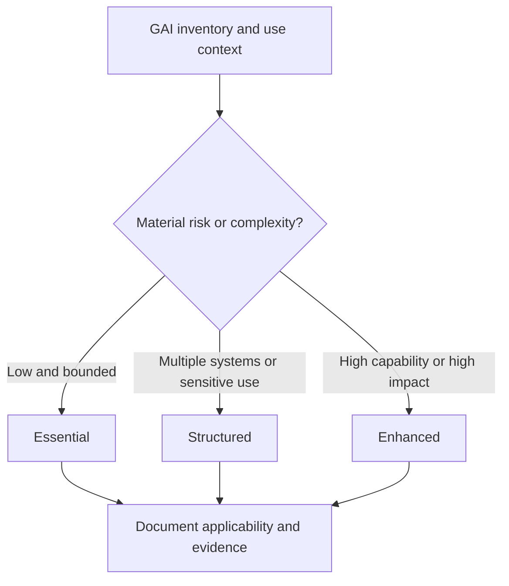
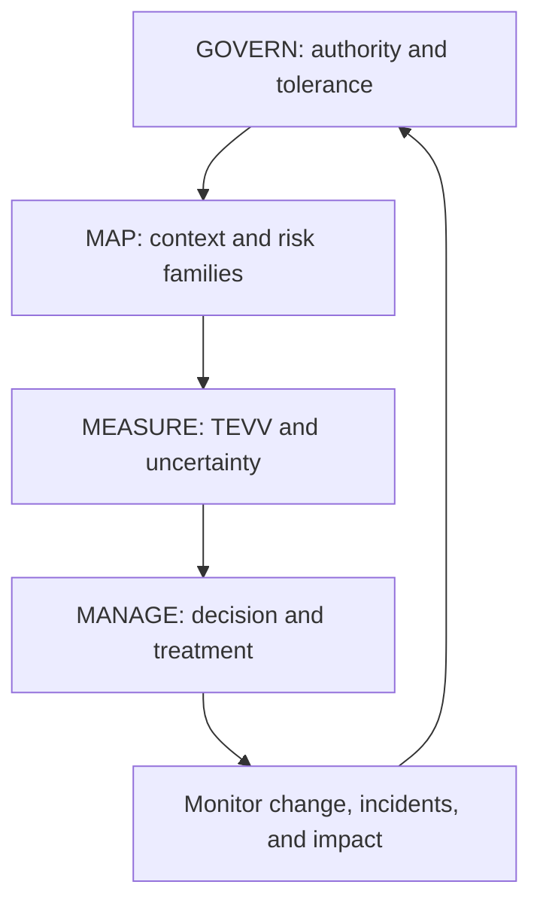
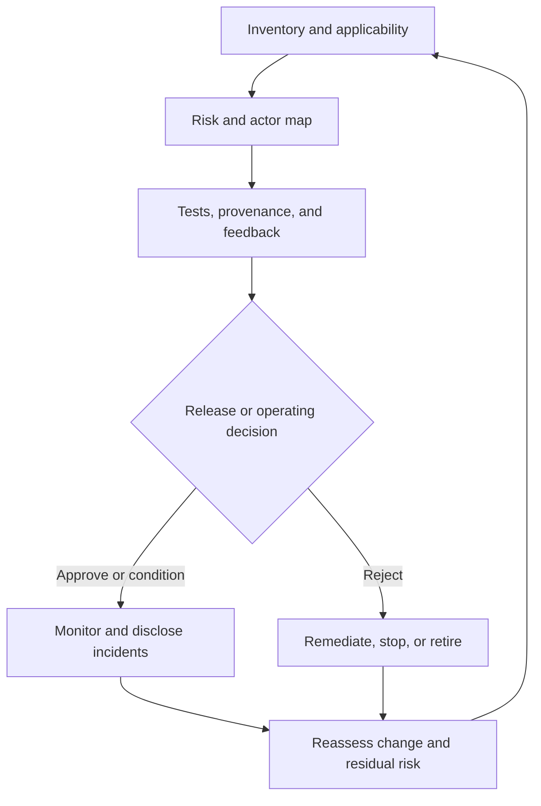

# Manual 04 implementation paths

## Purpose and control boundary

This intake converts NIST AI 600-1 into scalable implementation work without turning voluntary suggested actions into universal requirements. Every organization must determine applicability from its GAI inventory, AI actor tasks, lifecycle stage, context of use, affected parties, risk tolerance, applicable obligations, and resources.

The three paths change the depth, independence, frequency, and evidence expected. They do not change the need to understand material GAI risk, assign accountable decisions, stop or rollback unacceptable use, respond to incidents, and retain defensible evidence.

## 1. Select a proportionate path

### Essential path

Use when the GAI footprint is narrow, the organization is small, use cases are low-complexity, and no material safety, rights, critical-service, highly sensitive data, high-capability, or large-scale public-information impact has been identified.

Minimum operating set:

- named executive or owner for GAI risk;
- inventory of approved models, services, integrations, use cases, users, and data;
- acceptable-use and prohibited-use rules;
- screening of all twelve GAI risk families;
- basic privacy, security, intellectual-property, content, and supplier checks;
- documented human review for consequential outputs;
- defined release, stop, rollback, and incident-escalation criteria;
- periodic monitoring and reassessment after material change; and
- one evidence register linking decisions, tests, findings, remediation, and residual risk.

### Structured path

Use when multiple GAI systems or business units are involved, sensitive data or regulated processes are present, customer-facing outputs are material, third-party dependencies are significant, or the organization needs repeatable assurance.

Add to the Essential path:

- formal GAI governance forum and actor/responsibility map;
- action-by-action applicability and tailoring register;
- model/system/use-case/ecosystem risk assessments;
- risk-based pre-deployment TEVV and red-teaming plan;
- content-provenance and information-integrity controls;
- representative user and affected-party feedback;
- documented supplier due diligence, contract clauses, monitoring, and exit plans;
- independent review of higher-risk release decisions;
- defined metrics, thresholds, alerting, incident disclosure, and corrective-action workflow; and
- scheduled control-effectiveness review and management reporting.

### Enhanced path

Use for high-capability or broadly deployed GAI, material national-security or CBRN exposure, safety-critical or essential-service contexts, high-impact decisions, vulnerable populations, large-scale information-integrity effects, high-value intellectual property, or complex value chains.

Add to the Structured path:

- independent technical and domain evaluation;
- adversarial testing against realistic threat models and misuse cases;
- controlled evaluation environments and protected test data;
- quantitative and qualitative uncertainty analysis;
- continuous monitoring for drift, capability changes, emergent misuse, and correlated failure;
- separation of development, validation, release, and residual-risk approval;
- rehearsed containment, model/service shutdown, fallback, and recovery procedures;
- enhanced downstream-use and ecosystem monitoring;
- formal affected-party, regulator, customer, and supplier communication plans; and
- board or equivalent oversight for risks exceeding delegated tolerance.

**Accessible explanation:** Start with the GAI inventory and actual context. Low, bounded uses may use Essential controls; multiple or sensitive uses need Structured controls; high-capability or high-impact uses need Enhanced controls. Every path ends in a documented applicability and evidence decision.

## 2. Operate the profile through the AI RMF Core

### GOVERN

Establish the authority and conditions for using GAI:

- assign accountable owners and AI actor tasks;
- define risk tolerance, prohibited uses, acceptable use, escalation, and exceptions;
- integrate legal, privacy, security, safety, intellectual-property, records, procurement, and incident obligations;
- require competence and independence appropriate to the decision;
- define supplier, open-source, model, tool, plugin, retrieval, and downstream-use controls;
- protect whistleblowers and channels for reporting substantiated risk or harm;
- establish document retention, decision traceability, and change control; and
- require explicit approval before development, deployment, expansion, or material configuration change.

### MAP

Describe the real system and context before measuring it:

- distinguish the base model, fine-tuning, retrieval, prompt/system instructions, tools, agents, application logic, user interface, and downstream consumers;
- identify intended purpose, reasonably foreseeable use and misuse, users, non-users, and affected parties;
- map data and content sources, rights, consent, sensitivity, provenance, transformations, retention, and deletion;
- map upstream providers, open-source components, APIs, hosting, monitoring, and fallback dependencies;
- assess risk at model, system, use-case, and ecosystem levels;
- record assumptions, limitations, uncertainty, benefits, negative impacts, and risk concentration; and
- determine which of the twelve GAI risk families are material, monitored, deferred, or not applicable, with reasons.

### MEASURE

Use methods proportionate to the risk and claim:

- validate capability and performance claims under representative conditions;
- test confabulation, source/citation reliability, and uncertainty communication;
- evaluate privacy leakage, memorization, inference, and sensitive-data handling;
- test information security, prompt injection, data poisoning, model theft, tool misuse, and unsafe autonomy;
- evaluate harmful bias, homogenization, dangerous content, abusive content, and human-AI configuration;
- conduct risk-based CBRN and offensive-cyber capability assessment when relevant and authorized;
- assess content provenance, labeling, watermarking, metadata, detection limits, and chain of custody;
- evaluate intellectual-property and data-rights risks;
- measure resource and environmental impacts when material;
- use red-teaming, structured human feedback, field testing, or independent assessment as appropriate;
- record test scope, datasets, environment, thresholds, limitations, failures, and remediation; and
- include risks that cannot be measured quantitatively in the residual-risk decision rather than treating them as zero.

### MANAGE

Turn evidence into accountable action:

- prioritize by context, likelihood or uncertainty, magnitude, scale, affected parties, reversibility, and organizational tolerance;
- select prevention, detection, response, recovery, transfer, avoidance, acceptance, or discontinuation treatments;
- define go, conditional-go, no-go, stop, rollback, containment, and decommissioning decisions;
- assign remediation owners and due dates;
- monitor model, system, use, supplier, data, content, and ecosystem changes;
- trigger reassessment after new capability, fine-tuning, retrieval change, tool access, deployment expansion, incident, supplier change, or regulatory change;
- disclose incidents to appropriate internal and external parties under applicable obligations;
- preserve evidence and communicate limitations to downstream actors and affected parties; and
- verify corrective action and feed lessons back into GOVERN and MAP.

**Accessible explanation:** Governance sets authority and tolerance; mapping establishes context and relevant GAI risks; measurement produces test evidence and uncertainty; management makes and enforces decisions. Monitoring sends change, incident, and impact information back into governance.

## 3. Screen the twelve risk families

For each model, system, application, or use case, record a disposition for every family:

| Risk family | Minimum implementation question | Example evidence |
|---|---|---|
| CBRN Information or Capabilities | Could the system materially lower barriers to harmful biological, chemical, radiological, or nuclear activity? | Authorized capability tests, access limits, escalation records |
| Confabulation | Could false or unsupported output cause material decisions, harm, or loss? | Grounding tests, citation checks, human-review thresholds |
| Dangerous, Violent, or Hateful Content | Can inputs or outputs facilitate violence, hate, extremism, or dangerous activity? | Safety evaluations, moderation results, misuse monitoring |
| Data Privacy | Can training, retrieval, prompts, logs, or outputs expose or infer sensitive data? | Data-flow map, privacy tests, retention and deletion evidence |
| Environmental Impacts | Are training or inference resource impacts material to the decision? | Energy/resource estimates, efficiency decisions, monitoring |
| Harmful Bias and Homogenization | Do outputs create disparate harms, correlated failure, or reduced diversity? | Subpopulation tests, affected-party feedback, mitigation results |
| Human-AI Configuration | Could users over-rely, misunderstand, anthropomorphize, or lose effective oversight? | UX tests, instructions, workload and override evidence |
| Information Integrity | Can generated content undermine provenance, authenticity, public trust, or decisions? | Provenance design, labeling tests, disclosure and monitoring |
| Information Security | Can the system be attacked or misused through prompts, data, models, tools, APIs, or agents? | Threat model, red-team results, access and logging controls |
| Intellectual Property | Are training, input, output, or distribution rights uncertain or infringed? | Rights register, contract analysis, output review controls |
| Obscene, Degrading, and/or Abusive Content | Can the system create or amplify sexual, degrading, exploitative, or abusive content? | Safety tests, moderation, reporting and victim-support process |
| Value Chain and Component Integration | Can upstream or downstream dependencies create opaque, concentrated, or cascading risk? | Supplier inventory, contracts, change notices, fallback tests |

No family may be omitted. `Not applicable` requires a recorded rationale and reconsideration trigger. A family may be material at one level and not another; for example, a base model risk may be controlled at the application layer, while ecosystem dependence remains.

## 4. Tailor suggested actions without losing accountability

Use an applicability register with these fields:

- NIST action ID and AI RMF subcategory;
- relevant GAI risk families;
- applicable AI actor tasks;
- model, system, use-case, and ecosystem scope;
- disposition: adopt, tailor, equivalent control, defer, or not applicable;
- rationale and requirement source;
- accountable owner and approving authority;
- implementation evidence;
- effectiveness test and result;
- residual risk and expiry/review date; and
- change or incident triggers that reopen the decision.

An equivalent control must achieve the same risk objective in the actual context. Deferral must state the proof gap, interim control, owner, due date, and exposure accepted. Not-applicable decisions must not be used to avoid a material but difficult-to-measure risk.

## 5. Define release and operating gates

Before deployment or material expansion, require evidence that:

- intended and foreseeable uses are documented;
- relevant risk families were assessed;
- required tests met approved thresholds;
- critical and high findings are resolved or explicitly rejected by authorized risk acceptance;
- human oversight is competent, available, and effective;
- supplier and component risks are within tolerance;
- content provenance and disclosure controls are fit for purpose;
- monitoring, incident disclosure, stop, rollback, and fallback controls are operational;
- users and downstream actors receive necessary limitations and instructions; and
- residual risk is approved by the correct authority.

Stop or rollback triggers should include threshold breach, new dangerous capability, control failure, material privacy/security event, repeated harmful output, unreliable oversight, supplier loss, unexplained drift, serious incident, or evidence that actual use differs materially from the approved context.

## 6. Preserve the evidence and decision loop

**Accessible explanation:** The evidence loop begins with inventory and applicability, then maps risks and actors, collects tests and feedback, and reaches an accountable decision. Approved or conditional use is monitored; rejected use is remediated, stopped, or retired. Change and residual-risk reassessment restart the loop.

## 7. Analyst and manager completion criteria

An analyst should be able to show:

- the exact NIST source and controlled version used;
- the relevant model/system/use-case/ecosystem boundaries;
- every risk-family disposition;
- action applicability and tailoring evidence;
- source-to-control-to-test-to-decision traceability;
- open assumptions, limitations, and proof gaps; and
- monitoring, incident, and reassessment records.

A manager should be able to answer:

- who owns the risk and who can approve, stop, or rollback the system;
- which harms or failures exceed tolerance;
- which evidence supports the decision and what remains uncertain;
- whether human oversight and supplier controls work in practice;
- how affected parties and downstream actors are protected and informed;
- what changes invalidate the approval; and
- whether residual risk is still acceptable.

## Assurance statement

This implementation intake supports controlled, evidence-based use of NIST AI 600-1. It does not certify a system, replace applicable law or contract, prove that every suggested action applies, establish legal compliance, or provide an audit opinion. Human reviewers and authorized decision-makers remain accountable for applicability, semantics, risk acceptance, and release.
