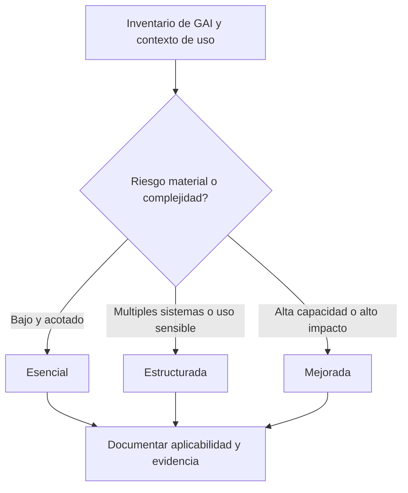
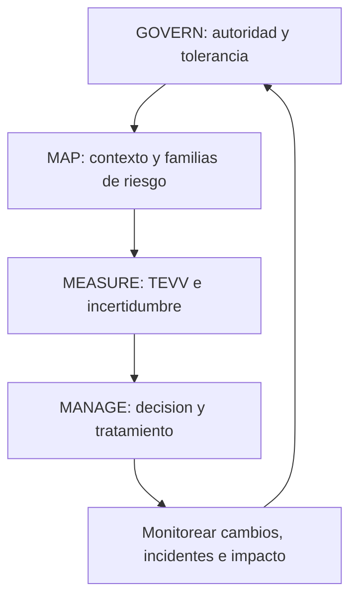
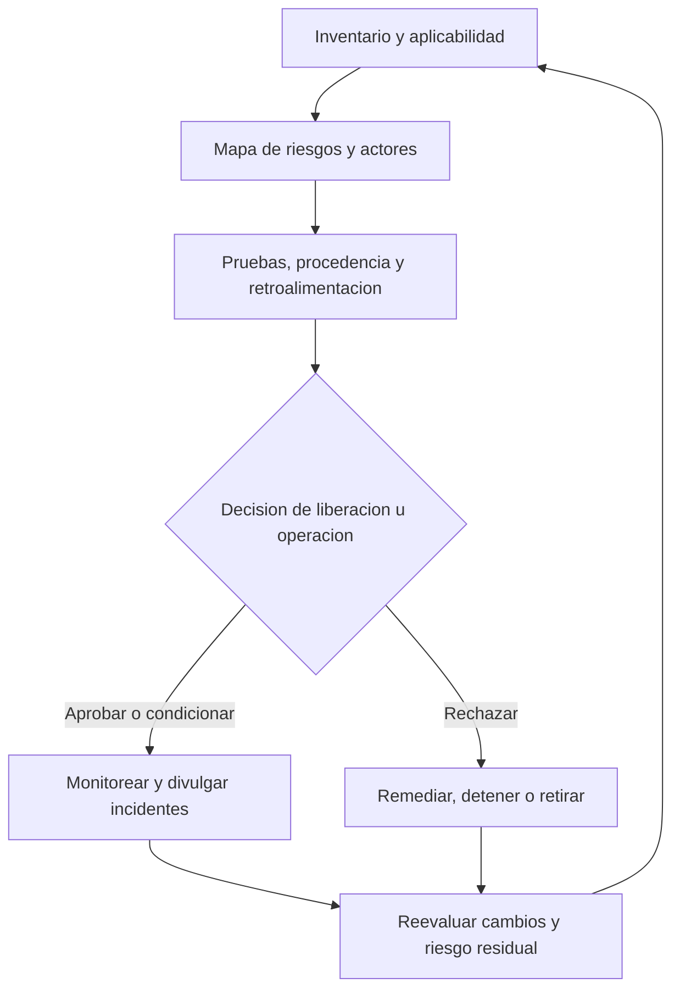

# Manual 04 - rutas de implementacion

## Proposito y limite de control

Esta incorporacion convierte NIST AI 600-1 en trabajo de implementacion escalable sin transformar las acciones sugeridas de caracter voluntario en requisitos universales. Cada organizacion debe determinar la aplicabilidad a partir de su inventario de IA generativa (GAI), las tareas de los actores de IA, la etapa del ciclo de vida, el contexto de uso, las partes afectadas, la tolerancia al riesgo, las obligaciones aplicables y los recursos.

Las tres rutas modifican la profundidad, independencia, frecuencia y evidencia esperadas. No modifican la necesidad de comprender el riesgo material de GAI, asignar decisiones responsables, detener o revertir un uso inaceptable, responder a incidentes y conservar evidencia defendible.

## 1. Seleccionar una ruta proporcional

### Ruta esencial

Usela cuando la huella de GAI sea limitada, la organizacion sea pequena, los casos de uso tengan baja complejidad y no se haya identificado un impacto material de seguridad, derechos, servicios criticos, datos altamente sensibles, alta capacidad o informacion publica a gran escala.

Conjunto operativo minimo:

- ejecutivo u propietario designado para el riesgo de GAI;
- inventario de modelos, servicios, integraciones, casos de uso, usuarios y datos aprobados;
- reglas de uso aceptable y uso prohibido;
- evaluacion de las doce familias de riesgo de GAI;
- controles basicos de privacidad, seguridad, propiedad intelectual, contenido y proveedores;
- revision humana documentada para resultados con consecuencias relevantes;
- criterios definidos de liberacion, detencion, reversion y escalamiento de incidentes;
- monitoreo periodico y reevaluacion despues de cambios materiales; y
- un registro de evidencia que vincule decisiones, pruebas, hallazgos, remediacion y riesgo residual.

### Ruta estructurada

Usela cuando participen multiples sistemas de GAI o unidades de negocio, existan datos sensibles o procesos regulados, los resultados orientados a clientes sean materiales, las dependencias de terceros sean significativas o la organizacion necesite aseguramiento repetible.

Agregue a la ruta Esencial:

- foro formal de gobernanza de GAI y mapa de actores/responsabilidades;
- registro de aplicabilidad y adaptacion accion por accion;
- evaluaciones de riesgo a nivel de modelo, sistema, caso de uso y ecosistema;
- plan de TEVV previo al despliegue y red teaming basado en riesgo;
- controles de procedencia de contenido e integridad de la informacion;
- retroalimentacion representativa de usuarios y partes afectadas;
- debida diligencia de proveedores, clausulas contractuales, monitoreo y planes de salida documentados;
- revision independiente de decisiones de liberacion de mayor riesgo;
- metricas, umbrales, alertas, divulgacion de incidentes y flujo de acciones correctivas definidos; y
- revision programada de efectividad de controles e informes a la gerencia.

### Ruta mejorada

Usela para GAI de alta capacidad o ampliamente desplegada, exposicion material de seguridad nacional o CBRN, contextos criticos para la seguridad o servicios esenciales, decisiones de alto impacto, poblaciones vulnerables, efectos de integridad de informacion a gran escala, propiedad intelectual de alto valor o cadenas de valor complejas.

Agregue a la ruta Estructurada:

- evaluacion tecnica y de dominio independiente;
- pruebas adversariales contra modelos de amenaza y casos de uso indebido realistas;
- entornos de evaluacion controlados y datos de prueba protegidos;
- analisis cuantitativo y cualitativo de incertidumbre;
- monitoreo continuo de deriva, cambios de capacidad, uso indebido emergente y fallas correlacionadas;
- separacion de desarrollo, validacion, liberacion y aprobacion del riesgo residual;
- procedimientos ensayados de contencion, apagado de modelo/servicio, alternativa y recuperacion;
- monitoreo mejorado del uso posterior y del ecosistema;
- planes formales de comunicacion con partes afectadas, reguladores, clientes y proveedores; y
- supervision de la junta directiva o equivalente para riesgos que excedan la tolerancia delegada.

**Explicacion accesible:** Comience con el inventario de GAI y el contexto real. Los usos bajos y acotados pueden emplear controles Esenciales; los usos multiples o sensibles necesitan controles Estructurados; los usos de alta capacidad o alto impacto necesitan controles Mejorados. Cada ruta termina en una decision documentada de aplicabilidad y evidencia.

## 2. Operar el perfil mediante el nucleo del AI RMF

### GOVERN

Establezca la autoridad y las condiciones para utilizar GAI:

- asigne responsables y tareas de actores de IA;
- defina tolerancia al riesgo, usos prohibidos, uso aceptable, escalamiento y excepciones;
- integre obligaciones legales, de privacidad, seguridad, seguridad fisica, propiedad intelectual, registros, adquisiciones e incidentes;
- exija competencia e independencia apropiadas para la decision;
- defina controles para proveedores, codigo abierto, modelos, herramientas, plugins, recuperacion y uso posterior;
- proteja a denunciantes y canales para reportar riesgos o danos fundamentados;
- establezca retencion documental, trazabilidad de decisiones y control de cambios; y
- exija aprobacion explicita antes del desarrollo, despliegue, expansion o cambio material de configuracion.

### MAP

Describa el sistema real y el contexto antes de medirlo:

- distinga el modelo base, ajuste fino, recuperacion, instrucciones de prompt/sistema, herramientas, agentes, logica de aplicacion, interfaz de usuario y consumidores posteriores;
- identifique proposito previsto, uso y uso indebido razonablemente previsibles, usuarios, no usuarios y partes afectadas;
- mapee fuentes de datos y contenido, derechos, consentimiento, sensibilidad, procedencia, transformaciones, retencion y eliminacion;
- mapee proveedores ascendentes, componentes de codigo abierto, API, alojamiento, monitoreo y dependencias de contingencia;
- evalue el riesgo en los niveles de modelo, sistema, caso de uso y ecosistema;
- registre supuestos, limitaciones, incertidumbre, beneficios, impactos negativos y concentracion de riesgo; y
- determine cuales de las doce familias de riesgo de GAI son materiales, monitoreadas, diferidas o no aplicables, con sus razones.

### MEASURE

Utilice metodos proporcionales al riesgo y a la afirmacion evaluada:

- valide afirmaciones de capacidad y desempeno bajo condiciones representativas;
- pruebe confabulacion, confiabilidad de fuentes/citas y comunicacion de incertidumbre;
- evalue filtracion de privacidad, memorizacion, inferencia y manejo de datos sensibles;
- pruebe seguridad de la informacion, inyeccion de prompts, envenenamiento de datos, robo de modelos, uso indebido de herramientas y autonomia insegura;
- evalue sesgo perjudicial, homogeneizacion, contenido peligroso, contenido abusivo y configuracion humano-IA;
- realice evaluacion basada en riesgo de capacidades CBRN y ciberofensivas cuando sea pertinente y este autorizada;
- evalue procedencia de contenido, etiquetado, marcas de agua, metadatos, limites de deteccion y cadena de custodia;
- evalue riesgos de propiedad intelectual y derechos sobre datos;
- mida impactos de recursos y ambientales cuando sean materiales;
- utilice red teaming, retroalimentacion humana estructurada, pruebas de campo o evaluacion independiente segun corresponda;
- registre alcance de pruebas, conjuntos de datos, entorno, umbrales, limitaciones, fallas y remediacion; e
- incluya en la decision de riesgo residual los riesgos que no puedan medirse cuantitativamente, en lugar de tratarlos como cero.

### MANAGE

Convierta la evidencia en accion responsable:

- priorice por contexto, probabilidad o incertidumbre, magnitud, escala, partes afectadas, reversibilidad y tolerancia organizacional;
- seleccione tratamientos de prevencion, deteccion, respuesta, recuperacion, transferencia, evitacion, aceptacion o discontinuacion;
- defina decisiones de seguir, seguir condicionado, no seguir, detener, revertir, contener y retirar;
- asigne responsables y fechas limite de remediacion;
- monitoree cambios de modelo, sistema, uso, proveedor, datos, contenido y ecosistema;
- active reevaluacion despues de una nueva capacidad, ajuste fino, cambio de recuperacion, acceso a herramientas, expansion del despliegue, incidente, cambio de proveedor o cambio regulatorio;
- divulgue incidentes a las partes internas y externas apropiadas conforme a las obligaciones aplicables;
- preserve evidencia y comunique limitaciones a actores posteriores y partes afectadas; y
- verifique la accion correctiva y retroalimente las lecciones a GOVERN y MAP.

**Explicacion accesible:** La gobernanza establece autoridad y tolerancia; el mapeo establece el contexto y los riesgos de GAI pertinentes; la medicion produce evidencia de pruebas e incertidumbre; la gestion toma y hace cumplir decisiones. El monitoreo devuelve a la gobernanza la informacion sobre cambios, incidentes e impactos.

## 3. Evaluar las doce familias de riesgo

Para cada modelo, sistema, aplicacion o caso de uso, registre una disposicion para cada familia:

| Familia de riesgo | Pregunta minima de implementacion | Ejemplo de evidencia |
|---|---|---|
| Informacion o capacidades CBRN | Podria el sistema reducir materialmente las barreras para actividades biologicas, quimicas, radiologicas o nucleares daninas? | Pruebas de capacidad autorizadas, limites de acceso, registros de escalamiento |
| Confabulacion | Podria una salida falsa o no respaldada provocar decisiones materiales, danos o perdidas? | Pruebas de grounding, controles de citas, umbrales de revision humana |
| Contenido peligroso, violento o de odio | Pueden las entradas o salidas facilitar violencia, odio, extremismo o actividades peligrosas? | Evaluaciones de seguridad, resultados de moderacion, monitoreo de uso indebido |
| Privacidad de datos | Pueden el entrenamiento, la recuperacion, los prompts, los registros o las salidas exponer o inferir datos sensibles? | Mapa de flujo de datos, pruebas de privacidad, evidencia de retencion y eliminacion |
| Impactos ambientales | Son materiales para la decision los impactos de recursos del entrenamiento o inferencia? | Estimaciones de energia/recursos, decisiones de eficiencia, monitoreo |
| Sesgo perjudicial y homogeneizacion | Generan las salidas danos dispares, fallas correlacionadas o menor diversidad? | Pruebas por subpoblacion, retroalimentacion de partes afectadas, resultados de mitigacion |
| Configuracion humano-IA | Podrian los usuarios depender en exceso, malinterpretar, antropomorfizar o perder supervision efectiva? | Pruebas de UX, instrucciones, evidencia de carga de trabajo y anulacion |
| Integridad de la informacion | Puede el contenido generado socavar procedencia, autenticidad, confianza publica o decisiones? | Diseno de procedencia, pruebas de etiquetado, divulgacion y monitoreo |
| Seguridad de la informacion | Puede el sistema ser atacado o utilizado indebidamente mediante prompts, datos, modelos, herramientas, API o agentes? | Modelo de amenazas, resultados de red team, controles de acceso y registro |
| Propiedad intelectual | Son inciertos o se infringen los derechos de entrenamiento, entrada, salida o distribucion? | Registro de derechos, analisis contractual, controles de revision de salidas |
| Contenido obsceno, degradante y/o abusivo | Puede el sistema crear o amplificar contenido sexual, degradante, explotador o abusivo? | Pruebas de seguridad, moderacion, proceso de reporte y apoyo a victimas |
| Cadena de valor e integracion de componentes | Pueden las dependencias ascendentes o posteriores crear riesgo opaco, concentrado o en cascada? | Inventario de proveedores, contratos, avisos de cambio, pruebas de contingencia |

No se puede omitir ninguna familia. `No aplicable` requiere una justificacion registrada y un disparador de reconsideracion. Una familia puede ser material en un nivel y no en otro; por ejemplo, un riesgo del modelo base puede controlarse en la capa de aplicacion mientras la dependencia del ecosistema permanece.

## 4. Adaptar las acciones sugeridas sin perder responsabilidad

Utilice un registro de aplicabilidad con estos campos:

- ID de accion NIST y subcategoria del AI RMF;
- familias de riesgo de GAI pertinentes;
- tareas aplicables de actores de IA;
- alcance de modelo, sistema, caso de uso y ecosistema;
- disposicion: adoptar, adaptar, control equivalente, diferir o no aplicable;
- justificacion y fuente del requisito;
- responsable y autoridad aprobadora;
- evidencia de implementacion;
- prueba de efectividad y resultado;
- riesgo residual y fecha de vencimiento/revision; y
- cambios o incidentes que reabren la decision.

Un control equivalente debe lograr el mismo objetivo de riesgo en el contexto real. El diferimiento debe indicar la brecha de evidencia, el control interino, el responsable, la fecha limite y la exposicion aceptada. Las decisiones de no aplicabilidad no deben utilizarse para evitar un riesgo material pero dificil de medir.

## 5. Definir compuertas de liberacion y operacion

Antes del despliegue o una expansion material, exija evidencia de que:

- los usos previstos y previsibles estan documentados;
- se evaluaron las familias de riesgo pertinentes;
- las pruebas requeridas cumplieron los umbrales aprobados;
- los hallazgos criticos y altos estan resueltos o fueron rechazados explicitamente mediante aceptacion de riesgo autorizada;
- la supervision humana es competente, disponible y efectiva;
- los riesgos de proveedores y componentes estan dentro de tolerancia;
- los controles de procedencia de contenido y divulgacion son adecuados para el proposito;
- el monitoreo, divulgacion de incidentes, detencion, reversion y contingencia estan operativos;
- los usuarios y actores posteriores reciben las limitaciones e instrucciones necesarias; y
- el riesgo residual esta aprobado por la autoridad correcta.

Los disparadores de detencion o reversion deben incluir incumplimiento de umbral, nueva capacidad peligrosa, falla de control, evento material de privacidad/seguridad, salida danina repetida, supervision no confiable, perdida de proveedor, deriva inexplicada, incidente grave o evidencia de que el uso real difiere materialmente del contexto aprobado.

## 6. Preservar el ciclo de evidencia y decision

**Explicacion accesible:** El ciclo de evidencia comienza con inventario y aplicabilidad, luego mapea riesgos y actores, recopila pruebas y retroalimentacion y llega a una decision responsable. El uso aprobado o condicionado se monitorea; el uso rechazado se remedia, detiene o retira. La reevaluacion de cambios y riesgo residual reinicia el ciclo.

## 7. Criterios de finalizacion para analistas y gerentes

Un analista debe poder mostrar:

- la fuente NIST exacta y la version controlada utilizada;
- los limites pertinentes de modelo/sistema/caso de uso/ecosistema;
- la disposicion de cada familia de riesgo;
- evidencia de aplicabilidad y adaptacion de acciones;
- trazabilidad de fuente a control, prueba y decision;
- supuestos, limitaciones y brechas de evidencia abiertas; y
- registros de monitoreo, incidentes y reevaluacion.

Un gerente debe poder responder:

- quien es dueno del riesgo y quien puede aprobar, detener o revertir el sistema;
- cuales danos o fallas exceden la tolerancia;
- que evidencia respalda la decision y que sigue siendo incierto;
- si la supervision humana y los controles de proveedores funcionan en la practica;
- como se protege e informa a las partes afectadas y actores posteriores;
- que cambios invalidan la aprobacion; y
- si el riesgo residual sigue siendo aceptable.

## Declaracion de aseguramiento

Esta incorporacion de implementacion apoya el uso controlado y basado en evidencia de NIST AI 600-1. No certifica un sistema, no sustituye la ley o contrato aplicable, no demuestra que todas las acciones sugeridas sean aplicables, no establece cumplimiento legal y no proporciona una opinion de auditoria. Los revisores humanos y los responsables autorizados siguen siendo responsables de la aplicabilidad, la semantica, la aceptacion del riesgo y la liberacion.
