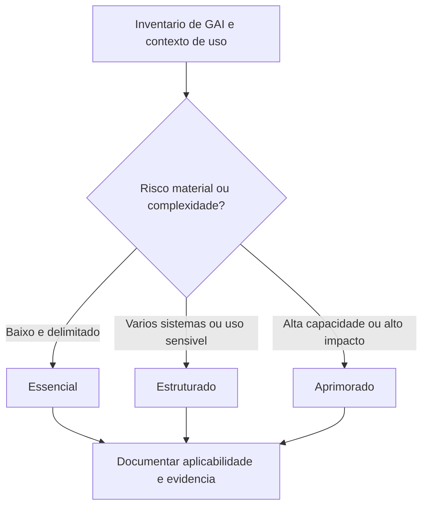
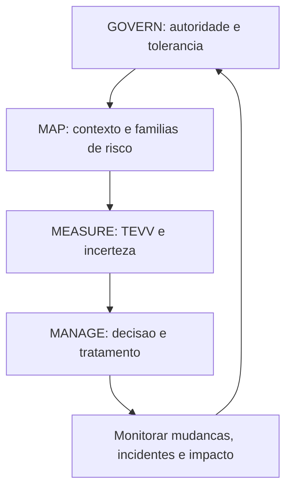
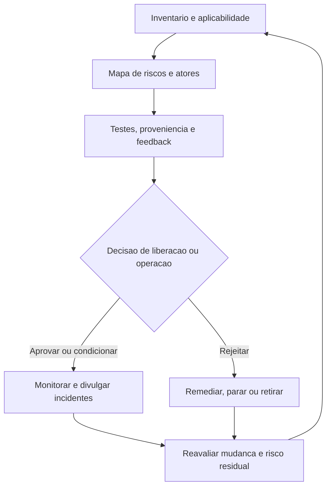

# Manual 04 - caminhos de implementacao

## Proposito e limite de controle

Esta incorporacao converte o NIST AI 600-1 em trabalho de implementacao escalavel sem transformar acoes sugeridas voluntarias em requisitos universais. Cada organizacao deve determinar a aplicabilidade com base em seu inventario de IA generativa (GAI), nas tarefas dos atores de IA, na etapa do ciclo de vida, no contexto de uso, nas partes afetadas, na tolerancia a risco, nas obrigacoes aplicaveis e nos recursos.

Os tres caminhos alteram a profundidade, a independencia, a frequencia e a evidencia esperadas. Eles nao alteram a necessidade de compreender riscos materiais de GAI, atribuir decisoes responsaveis, interromper ou reverter uso inaceitavel, responder a incidentes e manter evidencia defensavel.

## 1. Selecionar um caminho proporcional

### Caminho essencial

Use quando a presenca de GAI for restrita, a organizacao for pequena, os casos de uso tiverem baixa complexidade e nao tiver sido identificado impacto material de seguranca, direitos, servicos criticos, dados altamente sensiveis, alta capacidade ou informacao publica em grande escala.

Conjunto operacional minimo:

- executivo ou proprietario nomeado para o risco de GAI;
- inventario de modelos, servicos, integracoes, casos de uso, usuarios e dados aprovados;
- regras de uso aceitavel e uso proibido;
- triagem das doze familias de risco de GAI;
- verificacoes basicas de privacidade, seguranca, propriedade intelectual, conteudo e fornecedores;
- revisao humana documentada para resultados consequenciais;
- criterios definidos de liberacao, parada, rollback e escalonamento de incidentes;
- monitoramento periodico e reavaliacao apos mudanca material; e
- um registro de evidencias vinculando decisoes, testes, achados, remediacao e risco residual.

### Caminho estruturado

Use quando houver varios sistemas de GAI ou unidades de negocio, dados sensiveis ou processos regulados, saidas para clientes forem materiais, dependencias de terceiros forem significativas ou a organizacao precisar de asseguracao repetivel.

Adicione ao caminho Essencial:

- forum formal de governanca de GAI e mapa de atores/responsabilidades;
- registro de aplicabilidade e adaptacao acao por acao;
- avaliacoes de risco de modelo, sistema, caso de uso e ecossistema;
- plano de TEVV pre-implantacao e red teaming baseado em risco;
- controles de proveniencia de conteudo e integridade da informacao;
- feedback representativo de usuarios e partes afetadas;
- due diligence de fornecedores, clausulas contratuais, monitoramento e planos de saida documentados;
- revisao independente de decisoes de liberacao de maior risco;
- metricas, limites, alertas, divulgacao de incidentes e fluxo de acao corretiva definidos; e
- revisao programada da efetividade de controles e relatorios gerenciais.

### Caminho aprimorado

Use para GAI de alta capacidade ou amplamente implantada, exposicao material de seguranca nacional ou CBRN, contextos criticos de seguranca ou servicos essenciais, decisoes de alto impacto, populacoes vulneraveis, efeitos de integridade da informacao em grande escala, propriedade intelectual de alto valor ou cadeias de valor complexas.

Adicione ao caminho Estruturado:

- avaliacao tecnica e de dominio independente;
- testes adversariais contra modelos de ameaca e casos de uso indevido realistas;
- ambientes de avaliacao controlados e dados de teste protegidos;
- analise quantitativa e qualitativa de incerteza;
- monitoramento continuo de drift, mudancas de capacidade, uso indevido emergente e falhas correlacionadas;
- separacao entre desenvolvimento, validacao, liberacao e aprovacao do risco residual;
- procedimentos ensaiados de contencao, desligamento de modelo/servico, fallback e recuperacao;
- monitoramento aprimorado de uso downstream e do ecossistema;
- planos formais de comunicacao com partes afetadas, reguladores, clientes e fornecedores; e
- supervisao do conselho ou equivalente para riscos acima da tolerancia delegada.

**Explicacao acessivel:** Comece pelo inventario de GAI e pelo contexto real. Usos baixos e delimitados podem utilizar controles Essenciais; usos multiplos ou sensiveis precisam de controles Estruturados; usos de alta capacidade ou alto impacto precisam de controles Aprimorados. Todo caminho termina em uma decisao documentada de aplicabilidade e evidencia.

## 2. Operar o perfil por meio do nucleo do AI RMF

### GOVERN

Estabeleca a autoridade e as condicoes para uso de GAI:

- atribua proprietarios responsaveis e tarefas dos atores de IA;
- defina tolerancia a risco, usos proibidos, uso aceitavel, escalonamento e excecoes;
- integre obrigacoes legais, de privacidade, seguranca, safety, propriedade intelectual, registros, compras e incidentes;
- exija competencia e independencia adequadas a decisao;
- defina controles para fornecedores, codigo aberto, modelos, ferramentas, plugins, recuperacao e uso downstream;
- proteja denunciantes e canais para relatar risco ou dano fundamentado;
- estabeleca retencao de documentos, rastreabilidade de decisoes e controle de mudancas; e
- exija aprovacao explicita antes de desenvolvimento, implantacao, expansao ou mudanca material de configuracao.

### MAP

Descreva o sistema real e o contexto antes de medi-lo:

- diferencie modelo base, fine-tuning, recuperacao, instrucoes de prompt/sistema, ferramentas, agentes, logica de aplicacao, interface do usuario e consumidores downstream;
- identifique finalidade pretendida, uso e uso indevido razoavelmente previsiveis, usuarios, nao usuarios e partes afetadas;
- mapeie fontes de dados e conteudo, direitos, consentimento, sensibilidade, proveniencia, transformacoes, retencao e exclusao;
- mapeie fornecedores upstream, componentes de codigo aberto, APIs, hospedagem, monitoramento e dependencias de fallback;
- avalie risco nos niveis de modelo, sistema, caso de uso e ecossistema;
- registre premissas, limitacoes, incerteza, beneficios, impactos negativos e concentracao de risco; e
- determine quais das doze familias de risco de GAI sao materiais, monitoradas, adiadas ou nao aplicaveis, com justificativa.

### MEASURE

Use metodos proporcionais ao risco e a alegacao:

- valide alegacoes de capacidade e desempenho em condicoes representativas;
- teste confabulacao, confiabilidade de fontes/citacoes e comunicacao de incerteza;
- avalie vazamento de privacidade, memorizacao, inferencia e tratamento de dados sensiveis;
- teste seguranca da informacao, prompt injection, data poisoning, roubo de modelo, uso indevido de ferramentas e autonomia insegura;
- avalie vies prejudicial, homogeneizacao, conteudo perigoso, conteudo abusivo e configuracao humano-IA;
- realize avaliacao baseada em risco de capacidade CBRN e ciberofensiva quando pertinente e autorizada;
- avalie proveniencia de conteudo, rotulagem, marcas d'agua, metadados, limites de deteccao e cadeia de custodia;
- avalie riscos de propriedade intelectual e direitos sobre dados;
- meca impactos de recursos e ambientais quando materiais;
- use red teaming, feedback humano estruturado, testes de campo ou avaliacao independente conforme apropriado;
- registre escopo do teste, conjuntos de dados, ambiente, limites, limitacoes, falhas e remediacao; e
- inclua riscos que nao possam ser medidos quantitativamente na decisao de risco residual, em vez de trata-los como zero.

### MANAGE

Transforme evidencia em acao responsavel:

- priorize por contexto, probabilidade ou incerteza, magnitude, escala, partes afetadas, reversibilidade e tolerancia organizacional;
- selecione tratamentos de prevencao, deteccao, resposta, recuperacao, transferencia, evitacao, aceitacao ou descontinuacao;
- defina decisoes de go, go condicional, no-go, parada, rollback, contencao e desativacao;
- atribua responsaveis e prazos de remediacao;
- monitore mudancas de modelo, sistema, uso, fornecedor, dados, conteudo e ecossistema;
- acione reavaliacao apos nova capacidade, fine-tuning, mudanca de recuperacao, acesso a ferramenta, expansao da implantacao, incidente, mudanca de fornecedor ou mudanca regulatoria;
- divulgue incidentes as partes internas e externas adequadas conforme as obrigacoes aplicaveis;
- preserve evidencia e comunique limitacoes a atores downstream e partes afetadas; e
- verifique acao corretiva e devolva as licoes a GOVERN e MAP.

**Explicacao acessivel:** A governanca define autoridade e tolerancia; o mapeamento estabelece contexto e riscos de GAI relevantes; a medicao produz evidencia de testes e incerteza; a gestao toma e aplica decisoes. O monitoramento devolve informacoes sobre mudancas, incidentes e impactos para a governanca.

## 3. Avaliar as doze familias de risco

Para cada modelo, sistema, aplicacao ou caso de uso, registre uma disposicao para cada familia:

| Familia de risco | Pergunta minima de implementacao | Exemplo de evidencia |
|---|---|---|
| Informacao ou capacidades CBRN | O sistema poderia reduzir materialmente as barreiras para atividade biologica, quimica, radiologica ou nuclear prejudicial? | Testes de capacidade autorizados, limites de acesso, registros de escalonamento |
| Confabulacao | Uma saida falsa ou sem suporte poderia causar decisoes materiais, dano ou perda? | Testes de grounding, verificacoes de citacao, limites de revisao humana |
| Conteudo perigoso, violento ou de odio | Entradas ou saidas podem facilitar violencia, odio, extremismo ou atividade perigosa? | Avaliacoes de safety, resultados de moderacao, monitoramento de uso indevido |
| Privacidade de dados | Treinamento, recuperacao, prompts, logs ou saidas podem expor ou inferir dados sensiveis? | Mapa de fluxo de dados, testes de privacidade, evidencia de retencao e exclusao |
| Impactos ambientais | Os impactos de recursos de treinamento ou inferencia sao materiais para a decisao? | Estimativas de energia/recursos, decisoes de eficiencia, monitoramento |
| Vies prejudicial e homogeneizacao | As saidas criam danos desiguais, falha correlacionada ou reducao de diversidade? | Testes por subpopulacao, feedback de partes afetadas, resultados de mitigacao |
| Configuracao humano-IA | Usuarios podem depender excessivamente, interpretar incorretamente, antropomorfizar ou perder supervisao efetiva? | Testes de UX, instrucoes, evidencia de carga de trabalho e override |
| Integridade da informacao | Conteudo gerado pode comprometer proveniencia, autenticidade, confianca publica ou decisoes? | Projeto de proveniencia, testes de rotulagem, divulgacao e monitoramento |
| Seguranca da informacao | O sistema pode ser atacado ou usado indevidamente por prompts, dados, modelos, ferramentas, APIs ou agentes? | Modelo de ameacas, resultados de red team, controles de acesso e logging |
| Propriedade intelectual | Direitos de treinamento, entrada, saida ou distribuicao sao incertos ou violados? | Registro de direitos, analise contratual, controles de revisao de saida |
| Conteudo obsceno, degradante e/ou abusivo | O sistema pode criar ou ampliar conteudo sexual, degradante, exploratorio ou abusivo? | Testes de safety, moderacao, processo de denuncia e apoio a vitimas |
| Cadeia de valor e integracao de componentes | Dependencias upstream ou downstream podem criar risco opaco, concentrado ou em cascata? | Inventario de fornecedores, contratos, avisos de mudanca, testes de fallback |

Nenhuma familia pode ser omitida. `Nao aplicavel` exige justificativa registrada e gatilho de reconsideracao. Uma familia pode ser material em um nivel e nao em outro; por exemplo, um risco do modelo base pode ser controlado na camada de aplicacao enquanto a dependencia do ecossistema permanece.

## 4. Adaptar acoes sugeridas sem perder responsabilidade

Use um registro de aplicabilidade com estes campos:

- ID da acao NIST e subcategoria do AI RMF;
- familias de risco de GAI relevantes;
- tarefas aplicaveis dos atores de IA;
- escopo de modelo, sistema, caso de uso e ecossistema;
- disposicao: adotar, adaptar, controle equivalente, adiar ou nao aplicavel;
- justificativa e fonte do requisito;
- proprietario responsavel e autoridade de aprovacao;
- evidencia de implementacao;
- teste de efetividade e resultado;
- risco residual e data de expiracao/revisao; e
- mudancas ou incidentes que reabrem a decisao.

Um controle equivalente deve atingir o mesmo objetivo de risco no contexto real. O adiamento deve declarar a lacuna de evidencia, controle temporario, responsavel, prazo e exposicao aceita. Decisoes de nao aplicabilidade nao devem ser usadas para evitar risco material que seja dificil de medir.

## 5. Definir gates de liberacao e operacao

Antes da implantacao ou expansao material, exija evidencia de que:

- usos pretendidos e previsiveis estejam documentados;
- familias de risco relevantes tenham sido avaliadas;
- testes requeridos tenham atingido limites aprovados;
- achados criticos e altos estejam resolvidos ou explicitamente rejeitados por aceitacao de risco autorizada;
- supervisao humana seja competente, disponivel e efetiva;
- riscos de fornecedores e componentes estejam dentro da tolerancia;
- controles de proveniencia de conteudo e divulgacao sejam adequados a finalidade;
- monitoramento, divulgacao de incidentes, parada, rollback e fallback estejam operacionais;
- usuarios e atores downstream recebam limitacoes e instrucoes necessarias; e
- risco residual seja aprovado pela autoridade correta.

Gatilhos de parada ou rollback devem incluir violacao de limite, nova capacidade perigosa, falha de controle, evento material de privacidade/seguranca, saida prejudicial repetida, supervisao nao confiavel, perda de fornecedor, drift inexplicado, incidente grave ou evidencia de que o uso real difere materialmente do contexto aprovado.

## 6. Preservar o ciclo de evidencia e decisao

**Explicacao acessivel:** O ciclo de evidencias comeca com inventario e aplicabilidade, depois mapeia riscos e atores, coleta testes e feedback e chega a uma decisao responsavel. Uso aprovado ou condicional e monitorado; uso rejeitado e remediado, interrompido ou retirado. A reavaliacao de mudancas e risco residual reinicia o ciclo.

## 7. Criterios de conclusao para analistas e gestores

Um analista deve conseguir demonstrar:

- a fonte NIST exata e a versao controlada utilizada;
- os limites relevantes de modelo/sistema/caso de uso/ecossistema;
- a disposicao de cada familia de risco;
- evidencia de aplicabilidade e adaptacao das acoes;
- rastreabilidade de fonte para controle, teste e decisao;
- premissas, limitacoes e lacunas de evidencia abertas; e
- registros de monitoramento, incidentes e reavaliacao.

Um gestor deve conseguir responder:

- quem e dono do risco e quem pode aprovar, parar ou reverter o sistema;
- quais danos ou falhas excedem a tolerancia;
- quais evidencias sustentam a decisao e o que permanece incerto;
- se supervisao humana e controles de fornecedores funcionam na pratica;
- como partes afetadas e atores downstream sao protegidos e informados;
- quais mudancas invalidam a aprovacao; e
- se o risco residual continua aceitavel.

## Declaracao de asseguracao

Esta incorporacao de implementacao apoia o uso controlado e baseado em evidencias do NIST AI 600-1. Ela nao certifica um sistema, nao substitui lei ou contrato aplicavel, nao prova que todas as acoes sugeridas se aplicam, nao estabelece conformidade legal e nao fornece uma opiniao de auditoria. Revisores humanos e decisores autorizados continuam responsaveis por aplicabilidade, semantica, aceitacao de risco e liberacao.
