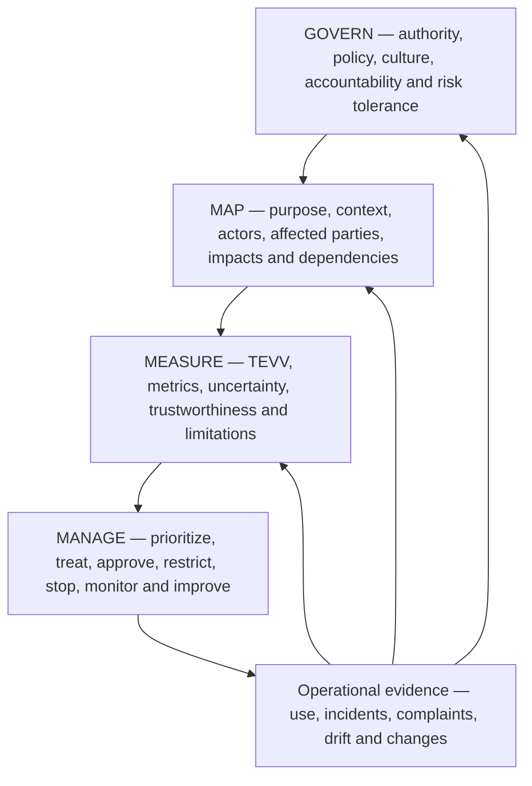
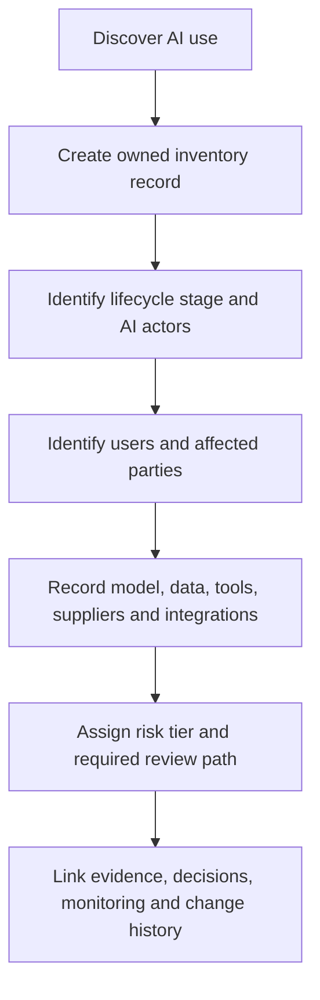
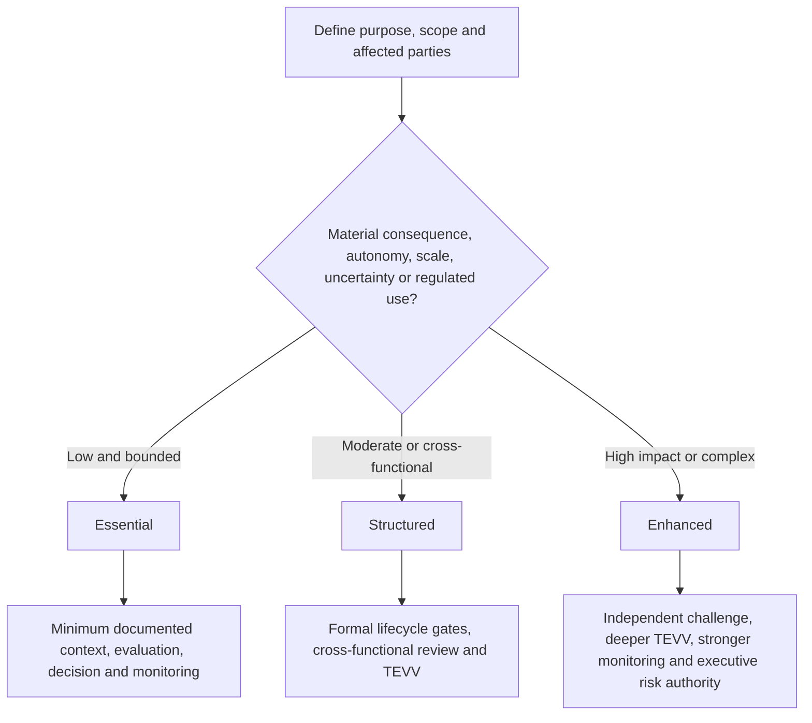

# Manual 03 — NIST AI Risk Management Framework Implementation

## English controlled source — Part 1: Preliminaries and Chapters 1–8

**Current source baseline:** NIST AI RMF 1.0 / NIST AI 100-1

**Version state:** final published framework under revision by NIST as of 24 August 2026

**Companion profile:** NIST AI 600-1 for generative AI when applicable

**Author and accountable human creator:** Alberto “Al” Leiva

> **Controlled-development notice:** This is original practical implementation guidance. NIST AI RMF is voluntary guidance, not a certification standard. NIST states that AI RMF 1.0 is being revised. This manual is version-bound to the current published baseline and must undergo impact analysis when a revised framework is published.

# Preface

The NIST Artificial Intelligence Risk Management Framework helps organizations manage AI risk across design, development, deployment, use, evaluation and retirement. It is intentionally flexible and can be adapted to organizations of different sizes, sectors and risk profiles.

This manual converts that flexibility into practical operating steps without turning the framework into a false checklist. The aim is to help a manager, GRC professional, security/privacy practitioner, AI product owner, engineer, auditor or junior analyst answer five questions repeatedly:

1. What AI system or use are we actually governing?
2. Who and what can be affected?
3. What evidence do we have about benefits, limitations, risk and uncertainty?
4. Who has authority to approve, restrict, stop or retire the use?
5. How do operations, incidents, complaints and changes update our decisions?

The manual uses NIST’s four Core functions — GOVERN, MAP, MEASURE and MANAGE — as an integrated operating cycle. GOVERN is cross-cutting. MAP establishes context. MEASURE produces evidence. MANAGE converts evidence into prioritized treatment and decisions. New information then changes governance, context, measurement or treatment.

## Source and revision boundary

- `nist-ai-rmf-1-0`: current published AI RMF 1.0 baseline; repository status `final-under-revision`.
- `nist-ai-600-1`: current final NIST Generative AI Profile used when generative AI is in scope.
- NIST’s current AI Resource Center states that AI RMF 1.0 is being revised.
- The current Playbook is based on AI RMF 1.0 and NIST states that it will be updated after the framework revision.
- A draft, concept note or developing profile is not treated here as a final requirement.

# Chapter guide

| Chapter | Topic |
|---:|---|
| 1 | NIST AI RMF purpose, voluntary boundary and implementation model |
| 2 | AI risk-management architecture and the four-function operating cycle |
| 3 | AI inventory, actors, ownership and lifecycle boundaries |
| 4 | Proportional risk and complexity routing |
| 5 | GOVERN function architecture |
| 6 | GOVERN: policy, legal obligations, risk tolerance and inventory |
| 7 | GOVERN: accountability, competence, human oversight and effective challenge |
| 8 | GOVERN: culture, engagement, suppliers and third-party resilience |

# 1. NIST AI RMF purpose, voluntary boundary and implementation model

*NIST AI RMF 1.0 is a voluntary, non-sector-specific framework for managing AI risks and supporting trustworthy and responsible AI practices.*

## 1.1 What implementation means

Implementation means embedding risk decisions into normal organizational work. A useful AI RMF implementation therefore connects:

- strategy and risk tolerance;
- AI inventory and ownership;
- product, acquisition and lifecycle gates;
- affected-party and stakeholder analysis;
- technical and non-technical evaluation;
- data, model, software, infrastructure and supplier governance;
- cybersecurity, privacy, safety, quality and resilience;
- user instructions and human oversight;
- monitoring, complaints and incident response;
- residual-risk acceptance and escalation; and
- corrective action, learning and retirement.

## 1.2 What implementation does not mean

- Completing every Playbook suggestion regardless of context.
- Treating every AI system as equally risky.
- Assuming a high benchmark score proves acceptable real-world performance.
- Treating a vendor attestation as sufficient evidence for the customer’s context.
- Treating AI RMF use as legal compliance, ISO/IEC 42001 certification or an audit opinion.
- Claiming that a system is “trustworthy” because a governance document exists.

## 1.3 A practical unit of accountability

Use the **AI system/use record** as the minimum unit that connects governance to operations. One record may cover a tightly controlled service or use case, but do not aggregate unrelated uses if their affected parties, decision consequences, models, data, configurations, suppliers or risk owners differ materially.

| Field | Minimum content |
|---|---|
| Identity | System/use name, unique ID, owner, business process and lifecycle status |
| Purpose | Intended task, decision/content role, users and expected benefit |
| Scope | Geography, population, scale, autonomy and prohibited uses |
| Technology | Model/service, version, software, tools, infrastructure and integrations |
| Data | Inputs, outputs, sensitive data, sources, retention and key lineage |
| Parties | AI actors, users, affected people/groups, suppliers and reviewers |
| Risk | Tier, material scenarios, uncertainty, treatment and residual-risk authority |
| Evidence | Evaluation, approvals, monitoring, incidents, complaints and changes |

# 2. AI risk-management architecture and the four-function operating cycle

*The Core functions should reinforce each other continuously; they are not four boxes completed once.*

**Accessible explanation:** Governance establishes who can decide and how risk is handled. Mapping describes the real context and people or systems affected. Measurement creates evidence through testing and other evaluation. Management uses the evidence to treat and accept or reject risk. Operational results, incidents, complaints and changes then feed back into all four functions.

## 2.1 Governance is cross-cutting

Do not isolate GOVERN as an annual committee activity. Governance should determine:

- who owns each AI use;
- when legal, privacy, security, safety, accessibility or domain specialists must participate;
- what level of risk-management effort is required;
- who may approve residual risk;
- what evidence is required before deployment;
- what events require reassessment; and
- when a system must be restricted, rolled back or retired.

## 2.2 Profiles and tailoring

A practical implementation may create a profile for a use case, business unit or sector. Tailoring should identify:

- which AI RMF outcomes matter most in the context;
- current state and desired target state;
- risk tolerance and legal/contractual constraints;
- evidence and metrics;
- resource and independence expectations; and
- planned actions with owners and dates.

Tailoring must not be used to hide known high-consequence risks or remove a binding obligation.

# 3. AI inventory, actors, ownership and lifecycle boundaries

*An organization cannot govern AI it cannot identify, classify and assign to accountable people.*

**Accessible explanation:** Discovery creates an inventory record. The organization then identifies who develops, supplies, operates, uses, oversees and is affected by the AI; records technical and supplier dependencies; assigns a proportional review path; and links evidence and decisions through the lifecycle.

## 3.1 Discovery sources

Reconcile multiple sources because self-report alone misses shadow AI:

- procurement and expense records;
- cloud and SaaS inventories;
- model/API usage and billing;
- software repositories and package dependencies;
- identity and access logs;
- endpoint/browser extension inventories;
- data catalogs and integration platforms;
- product architecture and service catalogs;
- vendor-risk records;
- interviews and employee attestations; and
- security monitoring where appropriate and lawful.

## 3.2 AI actors

Document roles by actual activity, not job title. Common activities include:

- executive and risk governance;
- system commissioning and product ownership;
- data acquisition, preparation and stewardship;
- model development, adaptation or configuration;
- software and infrastructure engineering;
- testing, evaluation, verification and validation;
- deployment and operations;
- human oversight and decision review;
- user support, complaint and redress;
- security, privacy, legal, compliance and safety review;
- supplier and contract management; and
- independent assurance/audit.

One person may perform several roles in a small organization, but conflicts of interest should be identified and compensating review added for material risks.

## 3.3 Affected parties

Affected people may never use the system. Consider people whose employment, access, eligibility, safety, reputation, finances, privacy, speech, learning, health, mobility or other interests can be influenced by the AI-enabled process.

Record:

- direct users;
- decision subjects;
- people represented in data;
- bystanders and indirectly affected groups;
- customers or workers downstream;
- communities or populations affected at scale; and
- organizations or public systems that depend on outputs.

# 4. Proportional risk and complexity routing

*Resource intensity should follow plausible consequences, uncertainty and complexity rather than organization size alone.*

**Accessible explanation:** The organization starts with context and affected parties, then considers potential consequence, autonomy, scale, uncertainty and regulatory exposure. Low bounded uses may use an Essential path. Moderate uses require a Structured path. High-impact or complex uses require an Enhanced path with stronger independence and oversight.

## 4.1 Risk factors

Consider at least:

- severity and reversibility of plausible harm;
- number and vulnerability of people affected;
- whether the use influences consequential decisions;
- degree of automation or action authority;
- public exposure and abuse potential;
- data sensitivity and volume;
- model opacity and supplier control;
- novelty and uncertainty;
- security and safety consequences;
- geographic/legal complexity;
- ability to monitor and correct outcomes; and
- concentration or common-mode dependency risk.

## 4.2 Tiering record

| Field | Example evidence |
|---|---|
| Inherent consequence | Narrative plus dimensions such as safety, rights, finance, security or operations |
| Likelihood/uncertainty | Data, expert judgment, analogous incidents, assumptions and confidence |
| Exposure | Scale, frequency, duration, population and geography |
| Autonomy | Advisory, human-approved, automatically executed or agentic/tool-using |
| Control strength | Existing controls and known limitations |
| Tier/path | Essential, Structured or Enhanced with rationale |
| Authority | Person/committee authorized to approve the tier and residual risk |
| Review trigger | Change, incident, complaint, drift, law/provider update or scheduled review |

# 5. GOVERN function architecture

*GOVERN makes AI risk management durable by establishing policy, accountability, culture, engagement, supplier controls and review mechanisms.*

The current AI RMF 1.0 GOVERN function groups outcomes into six broad themes. For implementation, treat them as:

1. organizational policy/process and risk-tolerance infrastructure;
2. accountability, training and decision authority;
3. interdisciplinary capability and human-AI oversight roles;
4. risk-aware culture, impact documentation, testing and information sharing;
5. external and internal engagement with meaningful feedback; and
6. third-party and supply-chain governance, including contingency planning.

> **Revision caution:** Some current AI RMF 1.0 terminology is specifically identified by NIST as subject to revision. Preserve identifier-level traceability to the controlled 1.0 baseline, but do not present today’s category wording as immutable future text.

## 5.1 Governance evidence hierarchy

Stronger evidence moves from intent to operation:

- **Intent:** policy, charter, principles and risk tolerance.
- **Design:** defined process, roles, decision rights, templates and controls.
- **Operation:** completed reviews, approvals, tests, supplier actions and incident records.
- **Effectiveness:** evidence that controls change decisions, reduce risk or detect failures.
- **Improvement:** corrected causes, updated policies/processes and verified follow-through.

# 6. GOVERN: policy, legal obligations, risk tolerance and inventory

*Policies should connect AI risk priorities to repeatable decisions rather than restating broad principles.*

## 6.1 AI policy

A practical policy should define:

- purpose and scope;
- approved/prohibited use boundaries;
- accountability and escalation;
- risk-tiering method;
- legal/regulatory/contractual review triggers;
- data and security requirements;
- minimum evaluation expectations;
- human-oversight expectations;
- supplier controls;
- monitoring and incident duties;
- recordkeeping; and
- exceptions and enforcement.

## 6.2 Obligation register

AI RMF is voluntary, but AI systems may be subject to binding obligations. Maintain a separate obligation register with:

| Field | Minimum content |
|---|---|
| Source | Law, regulation, contract, policy, standard or customer requirement |
| Jurisdiction | Country/state/sector/business relationship |
| Applicability | System/use/data/party/process affected |
| Requirement | Practical obligation stated in organizational language |
| Owner | Accountable function/person |
| Evidence | Control, record, test or approval |
| Change watch | Source monitor and review cadence |

Do not label a voluntary NIST suggestion as law. Do not label legal compliance as achieved merely because it maps to an AI RMF outcome.

## 6.3 Risk tolerance and effort

Define which decisions can be made at each level. For example:

- low-risk owner approval within documented criteria;
- moderate-risk cross-functional review;
- high-risk executive/committee approval;
- mandatory escalation for prohibited or legally restricted use;
- independent challenge for high-consequence systems; and
- stop authority when critical controls fail.

The risk-management effort itself should be resourced based on risk priority.

## 6.4 Inventory as a governance control

The inventory should be reconciled periodically and after acquisition, deployment or material change. A stale inventory is a governance failure because downstream risk processes depend on complete population data.

# 7. GOVERN: accountability, competence, human oversight and effective challenge

*Responsibility must be explicit enough that a material AI decision can be traced to people with authority and competence.*

## 7.1 Responsibility model

At minimum identify:

- executive sponsor;
- business/system owner;
- technical/model owner;
- data owner/steward;
- risk/compliance/legal/privacy/security/safety reviewers as applicable;
- human-oversight role;
- supplier owner;
- incident owner;
- residual-risk approver; and
- independent assurance role where needed.

## 7.2 Competence

Competence is role-specific. Evidence may include education, experience, supervised practice, training, assessment and reviewed work products. High-risk evaluation requires competence in both the technology and the domain where consequences occur.

Training should cover actual decisions people make, such as:

- recognizing unapproved AI use;
- handling restricted data;
- interpreting model confidence and limitations;
- verifying outputs;
- recognizing automation bias;
- escalating safety/security/privacy concerns;
- responding to incidents; and
- using stop or fallback procedures.

## 7.3 Human oversight

“Human in the loop” is not sufficient by itself. Document:

- what the human sees;
- what they are expected to verify;
- time and information available;
- authority to disagree or stop;
- incentives and workload;
- competence;
- override logging; and
- evidence that intervention is effective.

A reviewer who automatically accepts AI output is not a meaningful control.

## 7.4 Effective challenge

For material risks, use a reviewer or group that can question assumptions and has enough authority, independence, expertise and access to evidence to affect the decision. Independence can be scaled for small organizations through peer review, external expertise or separation of approval from creation.

# 8. GOVERN: culture, engagement, suppliers and third-party resilience

*AI risk management depends on the organization’s willingness to surface failures, hear affected perspectives and control dependencies it does not own.*

## 8.1 Risk-aware culture

Useful practices include:

- leadership that rewards escalation of material concerns;
- protected reporting channels;
- pre-mortems and failure-mode review;
- documented dissent on high-risk decisions;
- red-team or adversarial challenge where appropriate;
- learning from incidents and near misses; and
- avoiding delivery incentives that punish safe delay or stop decisions.

## 8.2 Engagement and feedback

Engagement should be proportionate and meaningful, not performative. Define:

- why feedback is sought;
- which affected or expert perspectives are needed;
- how participants are selected and protected;
- accessibility and language needs;
- how feedback is recorded and adjudicated;
- what changed because of the feedback; and
- how unresolved concerns are escalated.

Feedback may come from users, affected people, workers, domain experts, customer support, complaints, appeal processes, incident databases, regulators, researchers or civil-society organizations depending on context.

## 8.3 Supplier and third-party governance

AI supply chains may include foundation models, APIs, datasets, open-source components, evaluation tools, cloud infrastructure, human labeling services, safety filters and orchestration platforms.

Minimum supplier evidence should address:

- exact product/model/service and version;
- intended use and contractual restrictions;
- data handling, retention and training use;
- security and privacy evidence;
- performance/evaluation evidence and limitations;
- change-notification practices;
- subprocessors/dependencies;
- incident/vulnerability notification;
- continuity, portability and exit; and
- responsibility allocation between provider and customer.

## 8.4 Third-party failure planning

For material dependencies, plan for:

- model/service outage;
- material quality degradation;
- silent model update;
- supplier security incident;
- loss of API/functionality;
- changed terms or data practices;
- supplier exit or service discontinuation; and
- inability to obtain evidence needed for continued risk acceptance.

Fallback may include alternate providers, safe degraded mode, manual process, traffic limiting, cached approved results, feature disablement or full stop depending on the use.

**Part 1 checkpoint:** Chapters 1–8 establish version awareness, inventory, proportional routing and the governance foundation. Part 2 continues with MAP and affected-context analysis.
