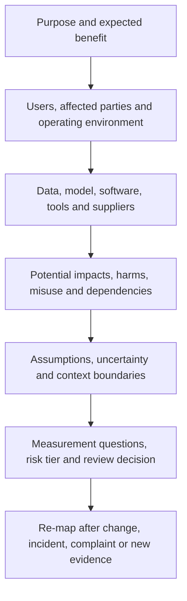
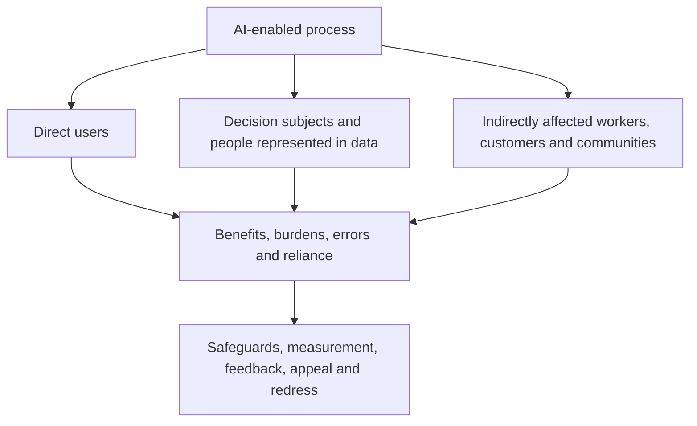
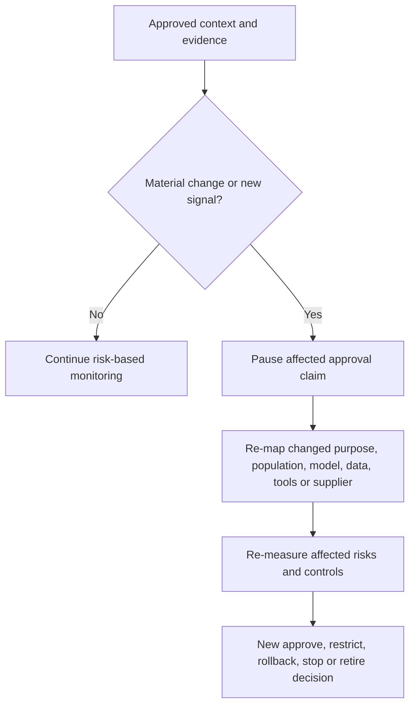

# Manual 03 — NIST AI Risk Management Framework Implementation

## English controlled source — Part 2: MAP, Chapters 9–16

**Controlled baseline:** NIST AI RMF 1.0 / NIST AI 100-1

**Source boundary:** Original practical implementation guidance. It summarizes and operationalizes the currently published framework without reproducing the NIST publication. AI RMF 1.0 is being revised; identifier-level mappings must be impact-reviewed when NIST publishes a replacement.

# Chapter guide

| Chapter | Topic |
|---:|---|
| 9 | MAP function architecture and context record |
| 10 | Intended purpose, scope, actors and lifecycle context |
| 11 | Affected parties, benefits, impacts and harms |
| 12 | Data, model, software, infrastructure and supplier dependencies |
| 13 | Misuse, abuse, security, privacy, safety and resilience scenarios |
| 14 | Assumptions, uncertainty, context validity and change triggers |
| 15 | Requirements, standards, stakeholder expectations and risk criteria |
| 16 | MAP evidence package, review and handoff to MEASURE |

# 9. MAP function architecture and context record

*MAP establishes enough socio-technical context to identify relevant risks, benefits, affected parties and measurement needs.*

Mapping is not a one-time questionnaire. It is a controlled description of the system as it is intended, configured, supplied and actually used. The record should be specific enough that reviewers can distinguish one deployment, population, model version or decision role from another.

**Accessible explanation:** Mapping starts with purpose and expected benefit, then documents users and affected parties, technical and supplier dependencies, plausible impacts and misuse, and key assumptions. These facts determine measurement questions and risk tier. Changes, incidents, complaints and new evidence send the system back through mapping.

## 9.1 The context record

Maintain one controlled context record for each materially distinct AI system or use. It should link to the inventory record and include:

- business purpose and expected benefit;
- system boundary and lifecycle stage;
- AI actors, accountable owner and decision authority;
- direct users, decision subjects and indirectly affected parties;
- operating environment, geography, frequency, scale and duration;
- decision or content role and degree of autonomy;
- data, model, software, tool and infrastructure dependencies;
- third parties and contractual boundaries;
- plausible positive and negative impacts;
- reasonable misuse and failure scenarios;
- assumptions, uncertainties and evidence gaps;
- applicable requirements and stakeholder expectations;
- initial risk tier and rationale; and
- measurement questions, thresholds and review triggers.

## 9.2 Context quality criteria

A context record is ready for review when it is:

- **specific:** names the actual use, population, version and environment;
- **traceable:** links claims to evidence, owners and dates;
- **bounded:** states what is excluded and why;
- **plural:** considers technical, human, organizational and societal perspectives as relevant;
- **challengeable:** records assumptions and dissent rather than presenting certainty that does not exist;
- **current:** reflects the deployed or proposed configuration; and
- **actionable:** produces measurable questions and management choices.

Generic product descriptions, vendor marketing, policy slogans and benchmark summaries do not meet this standard by themselves.

# 10. Intended purpose, scope, actors and lifecycle context

*Risk cannot be evaluated without defining what the AI is expected to do, where it is used and how people interact with it.*

## 10.1 Intended purpose statement

Write the purpose in operational language:

> The system assists **[named users]** with **[specific task or decision]** for **[defined population/environment]** by producing **[output/action]**. It is expected to provide **[measurable benefit]**. It must not be used for **[prohibited or unvalidated uses]**.

Avoid purposes such as “improve efficiency” unless the record defines the process, user, output, consequence and metric.

## 10.2 Scope and boundaries

Record:

- organizational units and processes;
- jurisdictions and languages;
- user and affected populations;
- channels, devices and environments;
- operating hours and expected transaction volume;
- integrations and downstream decisions;
- advisory versus automatic action;
- human review points;
- data and model versions;
- pilot, production or retirement status; and
- excluded uses and environments.

If a single model supports different decisions, populations or autonomy levels, create linked use records rather than hiding risk variation inside one broad inventory entry.

## 10.3 Lifecycle context

Identify the current and planned lifecycle stages:

1. concept and intake;
2. design or acquisition;
3. data preparation and model development/configuration;
4. integration and pre-deployment evaluation;
5. pilot or limited release;
6. production use;
7. monitoring and change;
8. suspension, rollback or remediation; and
9. retirement and controlled disposal.

Different evidence is available at different stages. Early mapping relies more heavily on assumptions, analogous evidence and planned safeguards. Production mapping must incorporate observed performance, incidents, complaints, overrides, drift and supplier changes.

## 10.4 Actor-task mapping

Map people and organizations to actual tasks, authority and evidence. Include external providers when they develop, configure, evaluate, host or monitor part of the system.

| Actor/task | Accountable activity | Required evidence |
|---|---|---|
| Business owner | Defines purpose, benefit, process and acceptable residual risk | Business case, purpose statement, approvals |
| Product/system owner | Maintains lifecycle record and coordinates gates | Inventory, context, decision log, change history |
| Data/model/engineering roles | Build, configure and operate technical components | Lineage, version records, design and test evidence |
| Domain specialist | Tests whether the system works safely in the real domain | Scenario review, acceptance criteria, limitations |
| Oversight user | Verifies or challenges outputs in operation | Instructions, competence, override and escalation evidence |
| Risk/legal/privacy/security/safety reviewers | Apply specialist requirements and risk challenge | Findings, decisions, conditions and remediation |
| Supplier owner | Controls provider evidence, contracts and changes | Due diligence, clauses, notices and exit plan |
| Assurance reviewer | Independently tests design or operation where needed | Scope, workpapers, findings and conclusion |

# 11. Affected parties, benefits, impacts and harms

*The relevant unit of analysis is not only the user or customer; it includes people, groups, organizations and systems influenced by the AI-enabled process.*

## 11.1 Affected-party map

**Accessible explanation:** An AI-enabled process can affect direct users, people who are the subject of decisions or represented in data, and people or communities affected indirectly. Mapping considers benefits, burdens, errors and reliance for each group, then determines safeguards, evaluation, feedback, appeal and redress needs.

## 11.2 Benefit analysis

State expected benefits as testable claims. Consider:

- improved access, quality, timeliness or consistency;
- reduced hazardous or repetitive work;
- better detection or decision support;
- personalization or accessibility;
- cost or resource efficiency; and
- new scientific, educational, creative or operational capability.

For each material benefit, record the beneficiary, metric, baseline, evidence and possible tradeoff. A projected organizational saving does not automatically establish a benefit to affected people.

## 11.3 Impact and harm scenarios

Use scenario statements that connect cause, event and consequence:

> Because **[condition or weakness]**, the system may **[error, misuse or failure]** during **[context]**, causing **[consequence]** to **[affected party]**. Detection may be difficult because **[limitation]**.

Consider:

- physical or psychological safety;
- civil rights, access, eligibility and due process;
- employment, education, housing, credit, insurance or healthcare consequences;
- privacy, surveillance and autonomy;
- economic loss, fraud and manipulation;
- security compromise and operational disruption;
- reputation, dignity, speech and information integrity;
- environmental or community effects where material;
- exclusion through inaccessible design or language; and
- compounded or cumulative effects across systems.

## 11.4 Severity, exposure and reversibility

Do not compress every dimension into a single score without preserving the narrative. Record:

- severity of plausible consequence;
- frequency and duration of exposure;
- number and vulnerability of affected people;
- reversibility and availability of remedy;
- detectability before harm;
- concentration and correlated-failure potential;
- likelihood where evidence supports a meaningful estimate; and
- uncertainty and confidence.

## 11.5 Feedback and representation

For material impacts, determine whose perspective is missing. Feedback methods may include interviews, user research, accessibility review, worker consultation, complaint analysis, domain panels, public-interest expertise, community engagement or controlled testing with representative participants.

Document how feedback changed the context, design, evaluation, restrictions or decision. If feedback cannot be obtained, record the limitation and compensating steps.

# 12. Data, model, software, infrastructure and supplier dependencies

*AI risk emerges from the complete system and supply chain, not the model alone.*

## 12.1 Dependency map

Document the deployed chain from input source to output/action:

- input collection and validation;
- data stores, retrieval and transformations;
- model/provider and exact version or endpoint;
- prompts, system instructions, fine-tuning or adapters;
- safety filters, policy engines and guardrails;
- orchestration, agents, tools and permissions;
- application software and user interface;
- identity, access, secrets and network controls;
- logging, monitoring and evaluation services;
- human review and downstream systems; and
- fallback, rollback and retirement dependencies.

## 12.2 Data context

For each material dataset or data flow, record:

- source, authority and collection purpose;
- population and time period represented;
- selection, labeling and transformation methods;
- quality, completeness and known gaps;
- sensitive or regulated data;
- access, sharing, retention and deletion;
- provenance and version;
- representativeness for the intended context;
- contamination, poisoning or leakage risk; and
- restrictions on training, evaluation or secondary use.

## 12.3 Model and service context

Record what the organization knows and does not know about:

- model family, version and change behavior;
- training or adaptation information available;
- intended and restricted use;
- evaluated capabilities and limitations;
- security, privacy and safety evidence;
- regional hosting and data practices;
- availability, rate, latency and capacity constraints;
- subcontractors and external tools;
- update notification and rollback options; and
- portability and exit.

Provider opacity is a risk factor, not proof of safety or unsafety. The customer must decide whether available evidence is sufficient for its own use and consequences.

## 12.4 Concentration and common-mode risk

Identify whether many processes depend on the same model, dataset, cloud, provider, evaluation method or safety control. A single provider update or outage may create correlated failure across otherwise separate applications.

For material concentration, define limits, alternate capability, degraded operation, manual fallback, communication and executive escalation.

# 13. Misuse, abuse, security, privacy, safety and resilience scenarios

*Mapping includes reasonably foreseeable misuse and system interaction, not only intended operation.*

## 13.1 Scenario families

Consider, as relevant:

- unauthorized or prohibited use;
- automation beyond approved authority;
- prompt injection, tool abuse or excessive permissions;
- malicious input, data poisoning or evasion;
- model extraction, privacy leakage or sensitive output;
- insecure integration, secrets exposure or dependency compromise;
- harmful, deceptive, illegal or unsafe content;
- over-reliance, automation bias and loss of human skill;
- inaccurate, fabricated or contextually inappropriate output;
- subgroup or accessibility failure;
- denial of service, capacity exhaustion or supplier outage;
- monitoring/logging failure;
- rollback or stop failure; and
- abuse at scale or coordinated misuse.

## 13.2 Misuse-case workpaper

| Field | Question |
|---|---|
| Actor | Who could misuse the capability, intentionally or accidentally? |
| Access | What identity, data, prompt, tool or integration access is available? |
| Path | How could normal controls be bypassed or manipulated? |
| Consequence | What could happen to people, systems or the organization? |
| Evidence | What incidents, tests, threat intelligence or analogous cases support the scenario? |
| Prevention | What authorization, design or process controls reduce opportunity? |
| Detection | What signal identifies attempted or successful misuse? |
| Response | Who can contain, revoke, rollback, notify and recover? |
| Residual risk | What remains and who may accept it? |

## 13.3 Agentic and tool-using AI

When AI can call tools or execute transactions, map:

- allowed and blocked tools;
- identity and credential boundaries;
- read, write, approve and execute permissions;
- transaction, time and resource limits;
- confirmation requirements;
- environment isolation;
- memory and retained context;
- input/output trust boundaries;
- monitoring and complete action traces;
- compensating human review; and
- deterministic emergency stop and revocation.

# 14. Assumptions, uncertainty, context validity and change triggers

*A risk record that hides uncertainty creates false confidence and weakens later decisions.*

## 14.1 Assumption register

For each material assumption, record:

- statement;
- owner;
- basis or evidence;
- confidence;
- consequence if false;
- validation method and due date;
- linked controls; and
- event that invalidates it.

Examples include expected user competence, stable provider behavior, representative evaluation data, adequate human review time, reliable logging or limited deployment scale.

## 14.2 Uncertainty types

Distinguish uncertainty caused by:

- insufficient or low-quality evidence;
- changing populations or environments;
- model non-determinism;
- supplier opacity;
- rare or emerging failure modes;
- measurement limitations;
- disagreement among experts or affected parties;
- unknown adversarial behavior; and
- incomplete legal or contractual interpretation.

Uncertainty should affect evaluation depth, deployment limits, monitoring, fallback and residual-risk authority.

## 14.3 Context-validity statement

Every material evaluation result should state the context in which it is believed to apply. At minimum link the result to:

- model/service and version;
- prompts, configuration and tools;
- data/population and time period;
- environment and workflow;
- user and oversight model;
- measured conditions; and
- known exclusions.

## 14.4 Change triggers

**Accessible explanation:** An approved system remains under monitoring. A material change or new signal pauses reliance on affected approval evidence. The organization re-maps what changed, re-evaluates affected risks and controls, and records a new management decision.

Trigger reassessment after changes to purpose, population, geography, model, data, prompts, tools, autonomy, supplier, interface, downstream decision, human oversight or applicable requirement. Incidents, complaints, drift, security findings and failed controls are also triggers.

# 15. Requirements, standards, stakeholder expectations and risk criteria

*MAP should identify the decision constraints that MEASURE and MANAGE must apply.*

## 15.1 Requirement sources

Relevant sources may include:

- law and regulation;
- contracts and customer commitments;
- organizational policy and risk appetite;
- sector rules and professional duties;
- security, privacy, safety, accessibility and quality standards;
- intellectual-property and data-use restrictions;
- product claims and user instructions;
- collective bargaining or workforce commitments; and
- expectations identified through affected-party engagement.

Keep binding requirements separate from voluntary framework guidance. Confirm legal interpretations through the organization’s authorized legal process.

## 15.2 Acceptance criteria

Translate context into criteria that can support a decision. Criteria should state:

- measure or condition;
- threshold or qualitative standard;
- relevant population/scenario;
- evidence source;
- owner and reviewer;
- blocking versus advisory effect;
- exception authority; and
- expiry or reassessment trigger.

Avoid selecting thresholds only because the system already meets them. Document the consequence-based rationale.

## 15.3 Conflicting objectives and tradeoffs

Trustworthiness characteristics can interact. Improving privacy may reduce available monitoring detail; increasing explainability may expose security-sensitive information; stronger filtering may affect utility or accessibility. Record the tradeoff, affected parties, alternatives, evidence, decision authority and residual risk.

# 16. MAP evidence package, review and handoff to MEASURE

*MAP is complete enough for the next gate when reviewers can identify what must be evaluated and why.*

## 16.1 Minimum MAP package

1. current inventory and ownership record;
2. intended-purpose and prohibited-use statement;
3. system, lifecycle and deployment boundary;
4. actor-task and responsibility map;
5. affected-party and benefit-impact analysis;
6. data/model/software/infrastructure/supplier dependency map;
7. misuse, failure, security, privacy, safety and resilience scenarios;
8. requirement and acceptance-criteria register;
9. assumption, uncertainty and evidence-gap register;
10. initial risk tier and review-path rationale;
11. measurement questions and planned evidence; and
12. reviewer findings, unresolved dissent and approval conditions.

## 16.2 MAP review questions

- Does the record describe the actual system/use rather than a generic product?
- Are affected parties broader than direct users where appropriate?
- Are positive impacts, harms and uncertainty considered together?
- Are system and supplier dependencies version-specific?
- Are reasonably foreseeable misuse and failure included?
- Do requirements and acceptance criteria match the context?
- Are evidence gaps visible?
- Does the risk tier match consequence and uncertainty?
- Are material dissent and open questions preserved?
- Are re-mapping triggers explicit?

## 16.3 Handoff to MEASURE

Convert each material scenario, claim or requirement into one or more evaluation questions. For each question, identify:

- the decision it supports;
- the relevant population and context;
- method and evidence source;
- metric or qualitative rubric;
- threshold and confidence expectation;
- independence and competence needed;
- limitations and uncertainty to report; and
- result that would require restriction, remediation or stop.

**Part 2 checkpoint:** Chapters 9–16 establish the operational context and evidence questions. Part 3 builds the MEASURE program that tests claims, risks and controls against that context.
