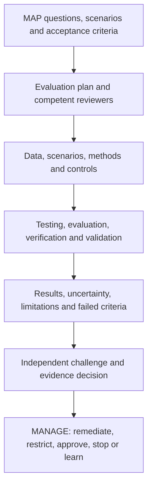
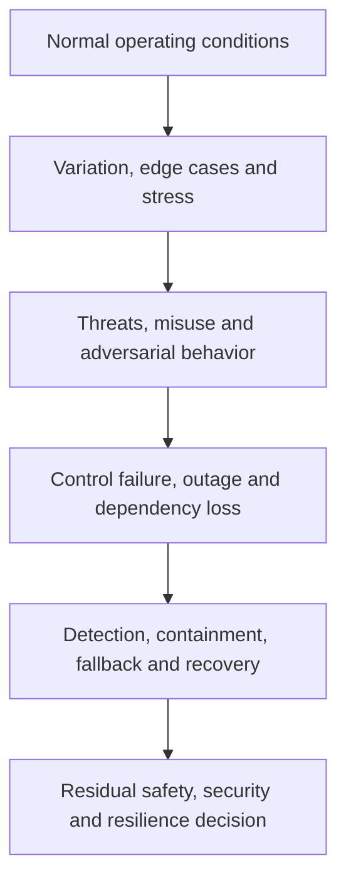
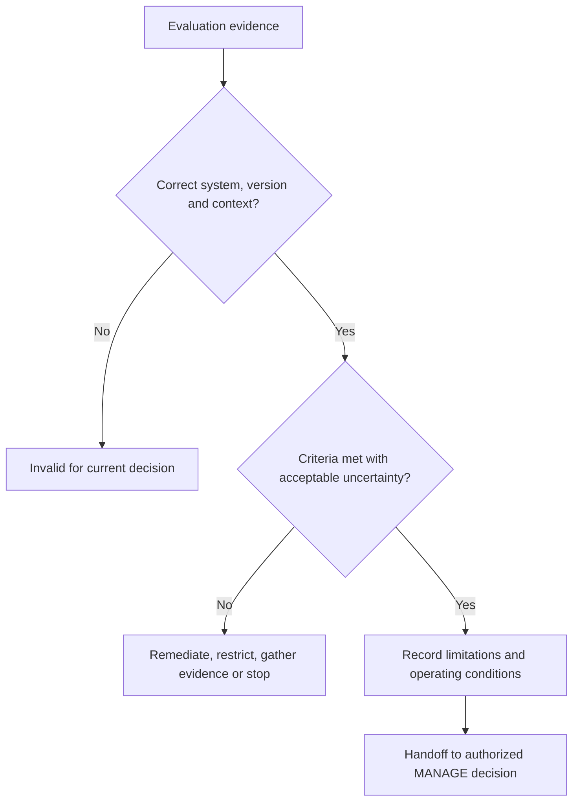

# Manual 03 — NIST AI Risk Management Framework Implementation

## English controlled source — Part 3: MEASURE, Chapters 17–24

**Controlled baseline:** NIST AI RMF 1.0 / NIST AI 100-1

**Source boundary:** Original practical implementation guidance. The current AI RMF 1.0 and Playbook are under announced revision. This source keeps controlled 1.0 traceability and avoids claiming that any test proves universal trustworthiness.

# Chapter guide

| Chapter | Topic |
|---:|---|
| 17 | MEASURE function architecture and TEVV governance |
| 18 | Evaluation plan, methods, data, thresholds and independence |
| 19 | Validity, reliability and task-performance evaluation |
| 20 | Safety, security, robustness and resilience evaluation |
| 21 | Accountability, transparency, explainability and interpretability evidence |
| 22 | Privacy and harmful-bias evaluation |
| 23 | Human factors, oversight and affected-party evaluation |
| 24 | Uncertainty, limitations, result review and MEASURE evidence package |

# 17. MEASURE function architecture and TEVV governance

*MEASURE produces decision-relevant evidence about system behavior, risk, trustworthiness characteristics, controls and uncertainty in the mapped context.*

Testing, evaluation, verification and validation are related but not interchangeable:

- **Testing** executes defined cases or conditions and records observed results.
- **Evaluation** judges evidence against criteria and decision needs.
- **Verification** asks whether specified requirements or design expectations were met.
- **Validation** asks whether the system is suitable for the intended real-world purpose and context.

**Accessible explanation:** Mapping supplies questions, scenarios and acceptance criteria. The evaluation plan selects competent reviewers, data, scenarios and methods. TEVV produces results with uncertainty and limitations. Reviewers challenge the evidence before management uses it to remediate, restrict, approve, stop or improve the system.

## 17.1 Measurement principles

Evaluation should be:

- tied to a specific decision;
- representative of the intended and reasonably foreseeable context;
- version-linked and reproducible where feasible;
- proportional to consequence and uncertainty;
- multidisciplinary for socio-technical risks;
- independent enough to provide effective challenge;
- explicit about failures and missing evidence;
- protected from metric manipulation and benchmark leakage; and
- repeated after material change or degraded evidence.

## 17.2 Measurement inventory

Maintain a register of evaluation questions. Each record should identify:

| Field | Minimum content |
|---|---|
| Question | Claim, requirement, scenario or control being evaluated |
| Decision | Approval, restriction, control design or monitoring decision supported |
| Context | Population, environment, workflow, user and version |
| Method | Test, analysis, review, simulation, experiment, audit or monitoring |
| Criteria | Threshold, rubric, comparator and blocking condition |
| Evidence | Dataset, scenario set, logs, expert review or other source |
| Reviewer | Performer, challenger and required competence |
| Timing | Pre-release, periodic, continuous, event-triggered or retirement |
| Limitation | Known uncertainty, exclusion or transfer risk |
| Outcome | Pass, conditional, fail, inconclusive or not tested |

## 17.3 Measurement governance

Define who may approve methods, thresholds and exceptions. A team that built the system may perform testing, but material risks may require separate validation or challenge. Independence can be achieved through organizational separation, a qualified peer, external specialist, rotating reviewer or audit function proportional to risk.

# 18. Evaluation plan, methods, data, thresholds and independence

*A result is only as useful as the question, method, evidence and decision rule behind it.*

## 18.1 Evaluation-plan contents

The plan should record:

1. system/use, version and context;
2. mapped claims, scenarios and requirements;
3. evaluation questions and decision owners;
4. methods and rationale;
5. test data, cases, scenarios and sampling;
6. relevant populations and subgroups;
7. baseline, comparator and acceptance criteria;
8. execution environment and controls;
9. reviewer roles, competence and independence;
10. security, privacy and safety protections for the evaluation itself;
11. result analysis and uncertainty method;
12. blocking failures and escalation;
13. reproducibility and evidence-retention requirements; and
14. retest and change triggers.

## 18.2 Method selection

Use multiple methods where one cannot capture the risk:

- quantitative performance testing;
- qualitative rubric-based review;
- scenario and failure-mode testing;
- simulation or controlled experiment;
- usability and human-factors evaluation;
- subgroup and accessibility analysis;
- privacy and security assessment;
- adversarial or red-team testing;
- code, architecture, data and process review;
- supplier-evidence validation;
- operational log, incident and complaint analysis; and
- expert or affected-party review.

## 18.3 Evaluation data

Verify that evaluation data are appropriate for the claim. Record source, authority, population, time period, collection, preprocessing, labeling, exclusions, quality, sensitive content, version and separation from training or tuning where relevant.

Test data can create privacy, security, safety or intellectual-property risk. Apply access, minimization, isolation, retention and deletion controls.

## 18.4 Thresholds and rubrics

Define thresholds before examining final results where practical. Explain:

- why the threshold is acceptable for the consequence;
- whether it applies to averages, tails, subgroups or individual events;
- confidence or uncertainty expectation;
- allowed exceptions;
- blocking conditions; and
- who may change it.

Averages may conceal severe subgroup or rare-event failures. Include distribution, worst-case or scenario-specific analysis when consequences justify it.

## 18.5 Evaluation integrity

Protect evaluation from:

- selecting only favorable cases;
- changing criteria after results are known;
- benchmark contamination or memorization;
- tuning to the test set without independent confirmation;
- excluding failures without documented rationale;
- version mismatch between tested and deployed systems;
- reviewer conflicts of interest; and
- reporting only aggregate scores without limitations.

# 19. Validity, reliability and task-performance evaluation

*Performance evidence must reflect the real task, not only a convenient benchmark.*

## 19.1 Claim decomposition

Break broad claims into observable properties. “Accurate” might include:

- correct classification or prediction;
- completeness of required information;
- calibration or confidence behavior;
- consistency across repeated runs;
- stability across expected variation;
- timeliness and latency;
- appropriate abstention or uncertainty signaling; and
- acceptable error behavior across relevant populations.

## 19.2 Validity

Ask whether the evaluation actually supports the intended inference:

- Does the test represent the task and population?
- Is the reference or ground truth credible?
- Are labels and rubrics sufficiently reliable?
- Are important confounders controlled or reported?
- Does offline performance transfer to the workflow?
- Does human interaction change the result?
- Are downstream actions included?

## 19.3 Reliability

Evaluate consistency across:

- repeated executions;
- seeds or non-deterministic runs;
- time and operational load;
- devices, regions or environments;
- relevant input variation;
- reviewers or annotators; and
- model/provider versions.

For generative systems, use multiple samples and structured review rather than presenting one favorable output as evidence.

## 19.4 Error analysis

Do not stop at a single score. Characterize:

- error types and severity;
- false-positive and false-negative consequences;
- tail and rare-event behavior;
- subgroup and intersectional variation where relevant;
- abstention and escalation behavior;
- error detectability by users;
- downstream amplification; and
- operational conditions linked to failure.

## 19.5 Comparative evaluation

Compare against the current process, a simpler system, qualified human performance or another reasonable baseline. Record differences in cost, time, access, quality, safety and burden. The relevant question is often whether the AI-enabled process improves the overall decision system, not whether the model exceeds one isolated metric.

# 20. Safety, security, robustness and resilience evaluation

*Material AI systems require evidence about behavior under stress, attack, failure and recovery.*

## 20.1 Evaluation model

**Accessible explanation:** Evaluation begins with normal operation, expands to edge cases and stress, then tests threats and misuse. It also examines control or dependency failure and whether the organization can detect, contain, fall back and recover before deciding what residual risk remains.

## 20.2 Safety evaluation

As relevant, evaluate:

- hazards and unsafe actions;
- foreseeable use and misuse;
- unsafe interaction with people or physical systems;
- failure detection and safe state;
- human intervention time;
- emergency stop and manual alternative;
- cascading consequences; and
- recovery validation.

Use domain safety expertise when consequences extend beyond ordinary software failure.

## 20.3 Security evaluation

Scope the full AI system. Consider:

- data poisoning and malicious inputs;
- evasion and adversarial examples;
- prompt injection and indirect prompt injection;
- excessive agency and tool misuse;
- model, prompt, data or secret extraction;
- insecure output handling;
- access-control and identity weaknesses;
- dependency and software supply-chain compromise;
- denial of service and resource exhaustion;
- logging or monitoring bypass; and
- unauthorized model/configuration change.

Use controlled environments and explicit authorization for adversarial testing. Do not expose real sensitive data or production systems unnecessarily.

## 20.4 Robustness

Test behavior under expected variation and plausible perturbation, including noisy, incomplete, ambiguous, out-of-distribution, multilingual or intentionally manipulated inputs where relevant. Robustness is context-specific; resistance to one test does not prove broad robustness.

## 20.5 Resilience and recovery

Exercise:

- provider or model outage;
- latency or capacity degradation;
- safety-filter failure;
- corrupted or unavailable data;
- loss of logging or monitoring;
- credential revocation;
- rollback to a known version;
- degraded or manual operation;
- incident communication; and
- restoration validation.

Record recovery time, recovery point, manual workload, data reconciliation and residual limitations.

# 21. Accountability, transparency, explainability and interpretability evidence

*Information is useful only when it enables the intended person to understand, act, challenge or seek remedy.*

## 21.1 Audience-specific transparency

Identify what each audience needs:

| Audience | Typical need |
|---|---|
| User/operator | Purpose, correct use, limits, verification, escalation and stop instructions |
| Affected person | AI involvement, relevant consequence, accessible explanation, correction/appeal path |
| Owner/management | Risk, evidence, failures, residual risk, incidents and decision conditions |
| Technical team | Versions, data, methods, limitations, monitoring and change details |
| Reviewer/auditor | Traceable evidence, approvals, criteria, workpapers and control operation |
| Regulator/customer | Information required by applicable authority or contract, subject to legal review |

## 21.2 Explainability and interpretability

Evaluate whether the explanation method is appropriate for the model, decision, audience and consequence. Test:

- fidelity to actual system behavior;
- stability and consistency;
- completeness for the decision need;
- understandability and accessibility;
- actionability;
- resistance to misleading presentation; and
- security/privacy tradeoffs.

An explanation that sounds plausible but does not reflect the system is worse than an honest limitation.

## 21.3 Traceability and accountability

Confirm that the organization can reconstruct:

- what system/version acted;
- relevant input and context, subject to privacy limits;
- output or action;
- human review or override;
- applicable policy and control state;
- decision authority;
- incident or complaint linkage; and
- later correction or change.

# 22. Privacy and harmful-bias evaluation

*Privacy and fairness-related risks require context, affected-party analysis and more than one aggregate metric.*

## 22.1 Privacy evaluation

Evaluate the full data lifecycle:

- authority and purpose;
- minimization and necessity;
- notice and meaningful choice where applicable;
- sensitive data handling;
- training, retrieval, prompt and output exposure;
- inference or re-identification risk;
- retention and deletion;
- access, sharing and subprocessors;
- monitoring/logging privacy; and
- correction, access or other applicable rights processes.

Technical testing may include leakage, memorization, extraction or inference analysis as relevant, but must be paired with governance and process evidence.

## 22.2 Harmful-bias evaluation

Start with mapped harms and affected groups. Determine:

- which outcomes or errors matter;
- which groups and intersections require analysis;
- what comparison is meaningful;
- whether data support the inference;
- whether the metric reflects the real decision process;
- whether human review mitigates or amplifies the effect;
- what threshold or qualitative judgment applies; and
- what remedy exists.

No single fairness metric is universally correct. Record the rationale, tradeoffs, legal review where needed, limitations and residual risk.

## 22.3 Process and outcome evidence

Review both:

- **process evidence:** participation, data governance, design choices, review, documentation and complaint handling; and
- **outcome evidence:** performance, error, allocation, burden or impact patterns in the real context.

## 22.4 Accessibility and language

Evaluate whether interfaces, notices, explanations, support and appeal paths work for relevant disability, literacy, language and technology-access needs. Accessibility defects can create systematic exclusion even when model performance appears acceptable.

# 23. Human factors, oversight and affected-party evaluation

*The performance of the human-AI team may differ materially from the model measured alone.*

## 23.1 Oversight-effectiveness test

Evaluate whether the oversight person:

- recognizes when AI is involved;
- understands purpose and limitations;
- has enough information and time;
- can identify important errors;
- can disagree without penalty;
- can correct, override or stop;
- uses escalation and fallback correctly; and
- leaves an auditable record.

Measure automation bias, complacency, workload, alert fatigue, skill degradation and differences across experience levels.

## 23.2 Human-AI workflow evaluation

Compare at least where material:

- human-only baseline;
- AI-only result for diagnostic understanding;
- human with AI assistance;
- different interface or explanation designs; and
- degraded or fallback operation.

The approved operating model should be the one actually evaluated.

## 23.3 Affected-party evaluation

Methods may include accessible usability tests, interviews, complaint analysis, controlled pilots, journey review, participatory evaluation or domain-expert panels. Protect participants and sensitive information, and avoid placing the burden of proving harm entirely on affected people.

## 23.4 Appeals, correction and redress

Test whether a person can:

- recognize a relevant decision or output;
- obtain understandable information;
- submit correction or challenge;
- reach a competent human;
- receive timely handling;
- prevent repeated propagation where appropriate; and
- obtain the remedy authorized by policy or law.

# 24. Uncertainty, limitations, result review and MEASURE evidence package

*Decision makers need a faithful account of what the evidence supports, what it does not support and how quickly it can become stale.*

## 24.1 Result record

For each material evaluation, retain:

- evaluation ID and linked MAP question;
- system, model, data, prompt/configuration and software versions;
- method, environment and execution date;
- dataset/scenario set and sampling;
- criteria and pre-defined thresholds;
- performer, reviewer and competence;
- detailed and summarized results;
- failures, exclusions and anomalies;
- uncertainty and confidence;
- limitations and transfer conditions;
- security/privacy handling;
- findings and remediation;
- retest results; and
- management disposition.

## 24.2 Uncertainty statement

State:

1. what is known with reasonable support;
2. what remains uncertain;
3. why uncertainty exists;
4. how uncertainty could affect people or decisions;
5. controls or deployment limits used because of it;
6. monitoring or research planned; and
7. who accepted the remaining uncertainty and until when.

## 24.3 Result classification

- **Pass:** evidence meets defined criteria in the tested context.
- **Conditional:** criteria are met only under documented restrictions or compensating controls.
- **Fail:** one or more blocking criteria are not met.
- **Inconclusive:** evidence is insufficient or inconsistent for the decision.
- **Not tested:** the question remains open and cannot be represented as satisfied.

Fail closed when a mandatory result is failed, inconclusive, missing, version-mismatched, expired or invalidated by material change.

## 24.4 Evidence review

**Accessible explanation:** Review first confirms that evidence applies to the correct system, version and context. If not, it is invalid. If criteria or uncertainty are unacceptable, the organization remediates, restricts, gathers more evidence or stops. Acceptable evidence is handed to an authorized management decision with limitations and conditions preserved.

## 24.5 Minimum MEASURE package

1. approved evaluation plan;
2. question-to-method matrix;
3. controlled datasets and scenario manifests;
4. environment and version record;
5. executed results and analysis;
6. trustworthiness-characteristic evidence relevant to context;
7. human/affected-party evaluation where needed;
8. failed, inconclusive and untested items;
9. uncertainty and limitations statement;
10. reviewer challenge, findings and remediation;
11. retest evidence; and
12. decision-ready summary linked to detailed workpapers.

**Part 3 checkpoint:** Chapters 17–24 create evidence without overstating it. Part 4 uses that evidence to prioritize, treat, decide, monitor, respond and improve through MANAGE.
