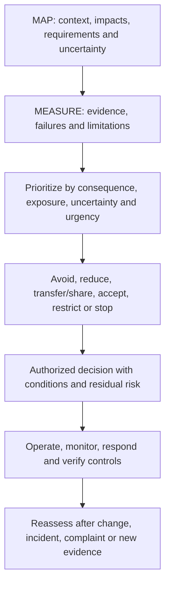
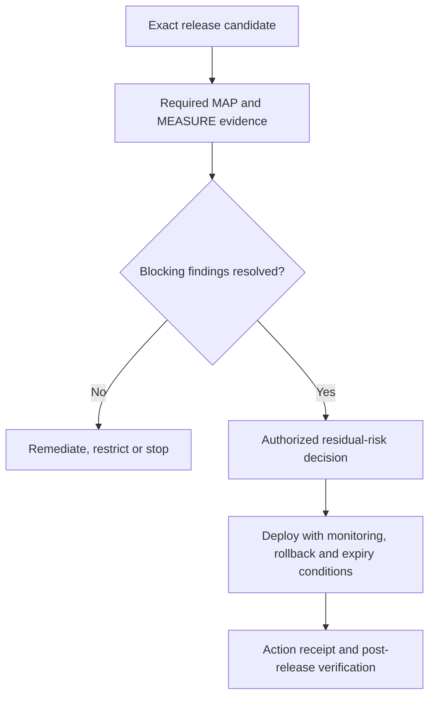
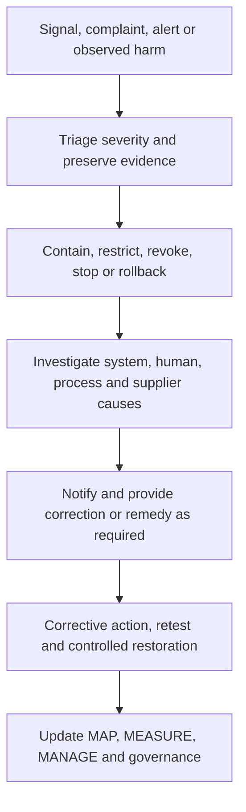

# Manual 03 — NIST AI Risk Management Framework Implementation

## English controlled source — Part 4: MANAGE, Chapters 25–32

**Controlled baseline:** NIST AI RMF 1.0 / NIST AI 100-1

**Source boundary:** Original practical implementation guidance. NIST AI RMF is voluntary and does not replace binding law, contract, policy, sector duties, certification criteria or professional judgment. AI RMF 1.0 is being revised, so this version-bound source requires impact review after a new final NIST publication.

# Chapter guide

| Chapter | Topic |
|---:|---|
| 25 | MANAGE function architecture and risk prioritization |
| 26 | Risk treatment, controls, ownership and action planning |
| 27 | Residual-risk decisions, exceptions and accountable acceptance |
| 28 | Deployment, release, restriction, stop, rollback and retirement |
| 29 | Monitoring, drift, incidents, complaints, appeals and corrective action |
| 30 | Change, suppliers, generative AI and agentic-system governance |
| 31 | Metrics, assurance, internal audit and continual improvement |
| 32 | Implementation roadmaps, maturity, profiles and framework revision |

# 25. MANAGE function architecture and risk prioritization

*MANAGE converts mapped context and measured evidence into prioritized treatment, accountable decisions, operational controls and improvement.*

**Accessible explanation:** Management combines mapped context with measured evidence, prioritizes risk, selects treatment, and records an authorized decision with conditions and residual risk. Operations then monitor and verify controls. Changes and real-world signals trigger reassessment.

## 25.1 Prioritization record

Prioritize using more than a generic score. Record:

- plausible consequence and reversibility;
- affected population, vulnerability and scale;
- exposure, frequency and duration;
- likelihood where supportable;
- uncertainty and evidence quality;
- control strength and detectability;
- urgency, including active incidents or legal deadlines;
- common-mode or concentration risk;
- opportunity and benefit tradeoffs; and
- dependencies among risks.

High uncertainty can justify stronger controls or a narrower pilot even when likelihood is unknown.

## 25.2 Portfolio view

Aggregate AI risks across systems without losing system-level accountability. Management should identify:

- multiple uses relying on the same model/provider;
- repeated control failures;
- cumulative effects on the same population;
- scarce oversight or validation capacity;
- correlated cybersecurity, privacy or operational risk;
- exceptions and residual-risk decisions nearing expiry; and
- systems whose combined autonomy or scale exceeds original assumptions.

## 25.3 Decision cadence

Use event-driven review in addition to calendars. Review priority when a material change, incident, complaint, evaluation failure, supplier notice, legal development, risk-tolerance change or new affected population appears.

# 26. Risk treatment, controls, ownership and action planning

*Treatment should change actual exposure, behavior or recovery capability, not only create documentation.*

## 26.1 Treatment choices

- **Avoid:** do not start, remove a feature or retire the use.
- **Reduce:** change purpose, design, data, model, autonomy, population, process or controls.
- **Share/transfer:** allocate defined duties contractually or through insurance while retaining non-transferable accountability.
- **Accept:** authorize residual risk within documented authority and conditions.
- **Pilot/restrict:** limit geography, population, users, data, autonomy, duration or volume to gather evidence safely.
- **Stop/rollback:** suspend operation or return to a known safe state.

## 26.2 Control design record

| Field | Minimum content |
|---|---|
| Risk/scenario | Mapped cause-event-consequence and affected parties |
| Objective | What exposure, failure or consequence the control addresses |
| Control | Preventive, detective, corrective or recovery activity |
| Owner/operator | Accountable owner and person/system performing it |
| Trigger/frequency | Continuous, transaction, release, periodic or event-driven |
| Evidence | Record proving design and operation |
| Threshold | Condition that causes action or escalation |
| Dependency | Data, tool, supplier, reviewer or infrastructure needed |
| Limitation | Known gap or failure mode |
| Test | How design and operating effectiveness are evaluated |
| Residual risk | What remains after the control |

## 26.3 Control hierarchy

Prefer controls that remove or constrain risk at the source before relying solely on users to catch errors. Depending on context:

1. eliminate the use or hazardous capability;
2. reduce scope, autonomy, data or access;
3. redesign architecture, model, workflow or interface;
4. implement technical and process controls;
5. add competent human oversight and independent verification;
6. add warnings, instructions and training; and
7. monitor, respond and provide remedy.

Training and disclaimers are rarely sufficient controls for high-consequence system behavior.

## 26.4 Action plan

Every remediation item should have an owner, due date, severity, dependency, acceptance criteria, evidence, retest method and escalation path. A due date does not reduce current risk; interim restrictions may be needed until remediation is verified.

# 27. Residual-risk decisions, exceptions and accountable acceptance

*Residual risk is a decision about remaining exposure after evidence and controls, not a label generated by a scoring tool.*

## 27.1 Acceptance record

Record:

- exact system/use and version;
- decision scope, population, geography and duration;
- relevant risks, benefits and affected parties;
- evidence reviewed and unresolved uncertainty;
- controls and operating conditions;
- failed, inconclusive or untested items;
- residual-risk rationale;
- decision authority and competence;
- approval, conditional approval, restriction or rejection;
- expiration and review date;
- automatic reassessment/stop triggers; and
- dissent or minority view.

## 27.2 Authority levels

Align acceptance authority to consequence. Low bounded risk may be accepted by the accountable owner within policy. Moderate risk may require cross-functional approval. High-consequence, regulated, safety-sensitive or portfolio-level risk may require executive or board-designated authority and independent challenge.

No one should accept risk on behalf of affected parties merely because the organization benefits. Legal duties and non-transferable obligations remain binding.

## 27.3 Exceptions

An exception should be:

- narrow and time-bound;
- approved by authorized people;
- explicit about the requirement not met;
- supported by risk analysis;
- paired with compensating controls or restrictions;
- monitored;
- visible to assurance functions; and
- automatically expired unless renewed through a new decision.

## 27.4 Decision quality check

Reject or return a decision if evidence is missing, version-mismatched, expired, materially changed, internally inconsistent or unable to support the asserted context. “Business urgency” should be recorded as a factor, not used to erase risk.

# 28. Deployment, release, restriction, stop, rollback and retirement

*Release is an evidence-based risk decision for an exact configuration, not the end of risk management.*

## 28.1 Release gate

**Accessible explanation:** The release gate identifies the exact candidate and required evidence. Blocking findings lead to remediation, restriction or stop. When evidence supports the decision, an authorized person accepts residual risk and deployment occurs with monitoring and rollback conditions. The release and follow-up are recorded.

## 28.2 Minimum release evidence

- approved purpose and context;
- current risk tier;
- exact model, data, prompt/configuration, software and dependency versions;
- required evaluation results and limitations;
- security, privacy, safety, accessibility and domain reviews as applicable;
- supplier evidence and contract conditions;
- user and oversight instructions;
- monitoring and incident readiness;
- stop, rollback, fallback and recovery test;
- unresolved findings and accepted conditions;
- residual-risk approval; and
- release record and checksum/version identifiers.

## 28.3 Progressive deployment

Use staged or canary release, limited populations, lower autonomy, rate limits, approval gates, parallel human process or shadow evaluation when this reduces uncertainty without exposing people to unacceptable risk.

## 28.4 Stop and rollback

Define objective triggers, authority and technical capability. Examples:

- severe harm or credible imminent harm;
- security compromise or sensitive-data exposure;
- material performance or subgroup degradation;
- repeated harmful or prohibited outputs;
- loss of required human oversight;
- invalid or missing required evidence;
- unapproved provider/model change;
- monitoring or logging failure for a critical control; and
- binding legal or contractual prohibition.

Test stop and rollback before relying on them. Confirm identity revocation, queued actions, downstream reconciliation, communications and restoration validation.

## 28.5 Retirement

Retirement should address data and record retention/deletion, model and credential access, integrations, user communication, supplier termination, pending decisions, legal hold, knowledge transfer, archive, monitoring shutdown and confirmation that the system no longer acts.

# 29. Monitoring, drift, incidents, complaints, appeals and corrective action

*Operational evidence determines whether assumptions and controls remain valid after release.*

## 29.1 Monitoring design

For each measure, define:

- question and risk addressed;
- data source and privacy boundary;
- population and version;
- calculation or rubric;
- baseline and threshold;
- owner and reviewer;
- frequency or latency;
- action when breached;
- false-positive/false-negative limitation; and
- evidence retention.

Monitor system behavior, human interaction, controls, affected outcomes, supplier changes and the monitoring system itself.

## 29.2 Drift and degradation

Distinguish changes in input data, population, concept/relationship, model behavior, workflow, users, environment and outcome. A metric may remain stable while the consequence changes, so combine quantitative signals with incidents, complaints, overrides and domain review.

## 29.3 Incident process

**Accessible explanation:** An incident begins with a signal or complaint, followed by triage and evidence preservation. The organization contains the issue, investigates technical and organizational causes, provides required notification or remedy, verifies corrective action and updates the full risk-management cycle.

## 29.4 Complaint, appeal and redress

Treat complaints as risk evidence, not only customer-service tickets. Link them to the system version and context, protect complainants, support accessible channels, prevent retaliation, define service levels, enable competent human review and track repeated patterns.

## 29.5 Corrective action

Separate immediate correction from root-cause corrective action. Record:

- issue and consequence;
- containment/correction;
- cause analysis across technology, people, process and governance;
- systemic extent;
- action owner and due date;
- verification of implementation;
- effectiveness retest;
- recurrence monitoring; and
- updates to related systems, policies, training and supplier controls.

# 30. Change, suppliers, generative AI and agentic-system governance

*Material change invalidates affected assumptions and evidence until impact is assessed.*

## 30.1 Change classes

Review changes to:

- purpose or prohibited-use boundary;
- population, geography, language or scale;
- data source, feature, retention or transformation;
- model, provider, version, fine-tuning or prompt;
- software, tool, integration or permission;
- autonomy or downstream action;
- interface, notice or human oversight;
- supplier/subprocessor and contract;
- monitoring and logging; and
- applicable requirement or risk tolerance.

Classify changes as non-material, material with bounded review, or material requiring full reassessment. Preserve rationale and reviewer.

## 30.2 Supplier change control

Require notification where feasible, but assume providers may change behavior without complete notice. Use version pinning, regression tests, monitoring, contract rights, evidence refresh, fallback and exit planning proportional to dependency.

## 30.3 Generative AI profile integration

When generative AI is in scope, apply NIST AI 600-1 as a companion profile to the general AI RMF process. Evaluate applicable GenAI risk families and profile actions without treating every action as universally required.

At minimum consider:

- confabulation and unsupported content;
- dangerous, hateful or abusive content;
- data privacy and intellectual-property concerns;
- information integrity and provenance;
- cybersecurity and prompt/tool attacks;
- human over-reliance and emotional or social effects;
- harmful bias and homogenization;
- misuse enablement and abuse at scale;
- environmental and resource effects where material;
- value-chain and component-integration risk; and
- evaluation limitations.

Manual 04 provides the deeper NIST AI 600-1 implementation.

## 30.4 Agentic systems

For tool-using or autonomous agents, implement and test:

- narrow identities and least privilege;
- tool allowlists and prohibited actions;
- transaction, time, rate and resource limits;
- human confirmation for consequential actions;
- input/content trust boundaries;
- environment isolation;
- complete action traces;
- memory and retention controls;
- deterministic revocation and emergency stop;
- rollback and downstream reconciliation; and
- explicit responsibility for delegated decisions.

# 31. Metrics, assurance, internal audit and continual improvement

*Assurance asks whether governance and controls are designed and operating effectively; it does not certify that risk is eliminated.*

## 31.1 Management metrics

Use measures linked to decisions, such as:

- active AI uses with current owner, tier and approval;
- material systems linked to deployed-version evaluation evidence;
- high-severity failures and remediation age;
- expired exceptions and residual-risk decisions;
- incidents, complaints, appeals, overrides and recurrence;
- threshold breaches and response time;
- supplier evidence and unreviewed changes;
- corrective-action effectiveness retests; and
- systems restricted, stopped or redesigned because evidence was inadequate.

Avoid rewarding document volume or suppressing incident reporting.

## 31.2 Control assurance

Test both:

- **design effectiveness:** the control, if operated as designed, addresses the risk in context; and
- **operating effectiveness:** the control actually operated for the required population and period, produced evidence, detected exceptions and caused required action.

## 31.3 Internal audit

An audit program should define risk-based scope, criteria, competence, independence, sampling, evidence, findings, reporting and follow-up. Auditors should not audit their own work without safeguards. Preserve the distinction between internal audit, technical evaluation, compliance review, certification and regulatory examination.

## 31.4 Finding classification

Classify findings based on consequence, systemic extent, control failure, recurrence, evidence and urgency. Every finding should identify criteria, condition, evidence, impact/risk, owner, action, due date and closure test.

## 31.5 Learning loop

Use incidents, near misses, complaints, audits, supplier events and successful controls to update inventory, risk criteria, scenarios, evaluation methods, thresholds, training, design standards and portfolio decisions.

# 32. Implementation roadmaps, maturity, profiles and framework revision

*Organizations should start with a controlled minimum and add depth where risk, complexity and evidence demand it.*

## 32.1 Essential roadmap

### First 30 days

- designate accountable AI-risk leadership;
- issue interim approved/prohibited-use rules;
- begin AI discovery and inventory;
- define a simple risk-routing method;
- identify material existing uses;
- establish incident and stop contacts; and
- select a small evidence template set.

### Days 31–90

- complete context and minimum evaluation for material uses;
- assign residual-risk authority;
- implement supplier and change checks;
- document user/oversight instructions;
- define monitoring thresholds; and
- remediate or restrict uses lacking supportable evidence.

### Months 4–12

- reconcile inventory periodically;
- test controls and corrective actions;
- improve incident/complaint handling;
- build management metrics;
- perform risk-based internal review; and
- update the target profile.

## 32.2 Structured roadmap

Add formal governance, cross-functional lifecycle gates, controlled TEVV, version/lineage, supplier evidence, privacy/security/accessibility/domain review, operational metrics, periodic management review, internal audit and controlled evidence retention.

## 32.3 Enhanced roadmap

Add executive/board oversight, independent validation, affected-party engagement, adversarial and stress evaluation, continuous monitoring for key risks, rehearsed stop/rollback, portfolio concentration analysis, enhanced supplier surveillance and formal residual-risk expiration.

## 32.4 Maturity model

| Level | Observable state |
|---|---|
| 0 — Uncontrolled | AI use is unknown or unmanaged; ownership and evidence are absent |
| 1 — Initial | Basic inventory, policy, owner and case-by-case review exist |
| 2 — Repeatable | Risk routing, lifecycle gates, evaluation and evidence are consistently used |
| 3 — Measured | Operational metrics, control testing, supplier/change review and management decisions are linked |
| 4 — Adaptive | Incidents, affected-party evidence, portfolio risk and assurance systematically drive improvement |

Maturity is not a certification. A Level 4 process can still make a poor system decision, and a small organization can operate strong controls without elaborate bureaucracy.

## 32.5 Current and target profiles

Create a current profile describing actual outcomes and evidence, and a target profile describing desired outcomes based on risk and obligations. The gap plan should identify priority, owner, resources, dependencies, date, evidence and interim restriction.

## 32.6 Framework revision protocol

When NIST publishes a revised AI RMF:

1. freeze the current Manual 03 release candidate;
2. verify the final official publication and version;
3. compare functions, categories, subcategories, terminology and guidance;
4. classify impacts on chapters, templates, graphics, profiles and crosswalks;
5. update the English controlled source first;
6. reopen affected source and technical reviews;
7. retranslate changed meaning through controlled human-reviewed localization;
8. regenerate DOCX/PDF artifacts and rerun accessibility, visual and security QA; and
9. publish a versioned change record without silently overwriting the prior baseline.

## 32.7 Final implementation boundary

Implementing this manual can strengthen risk governance and evidence. It does not prove that an AI system is trustworthy, eliminate harm, satisfy every law, establish ISO/IEC 42001 conformity, create certification or constitute an audit opinion. The organization remains accountable for the actual system, context, obligations, decisions and effects.

**Part 4 checkpoint:** Chapters 25–32 complete the GOVERN–MAP–MEASURE–MANAGE operating cycle and connect it to deployment, operations, incidents, assurance, roadmaps and controlled framework revision.
