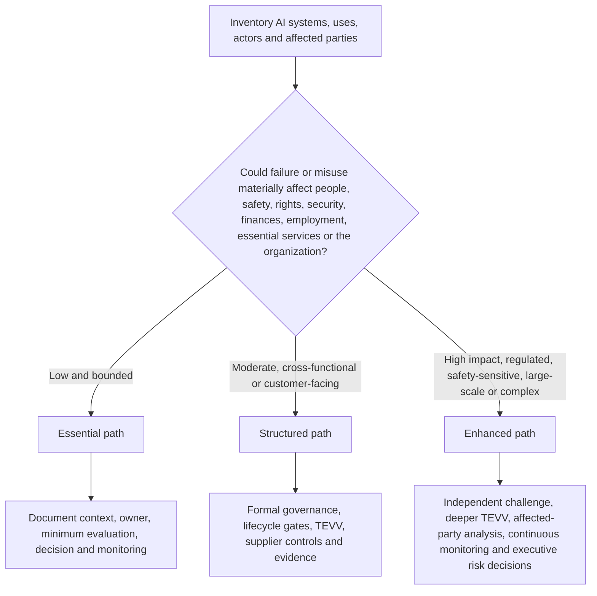
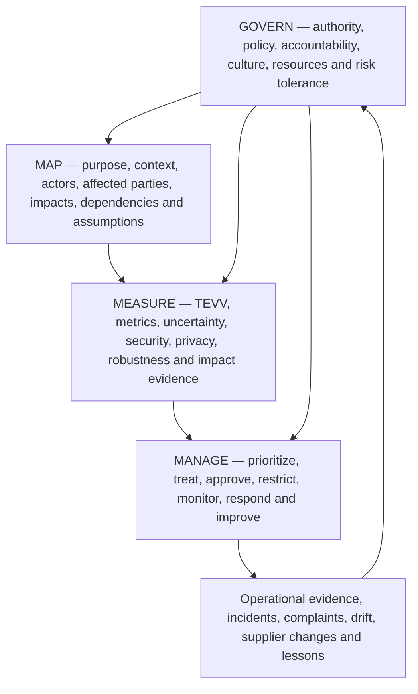
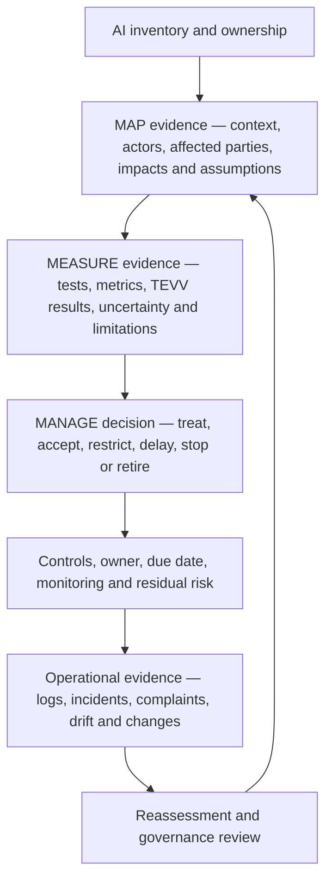

# Manual 03 — NIST AI RMF Implementation Paths

**Controlled baseline:** NIST AI RMF 1.0 (NIST AI 100-1) with NIST AI 600-1 applied when generative AI is in scope.

> **Version warning:** NIST states that AI RMF 1.0 is being updated. This implementation entry is version-bound to the currently published AI RMF 1.0 baseline and must be impact-reviewed when NIST publishes a revision.

## 1. Choose the implementation path by risk and complexity

Do not choose a path only by employee count. Start with the least complex path that can still control the organization’s actual AI risk, lifecycle, affected parties, regulatory exposure, autonomy, scale, third-party dependence, and potential consequences.

**Accessible explanation:** First inventory AI systems and their context. Low, bounded uses can begin with an Essential path. Moderate or cross-functional/customer-facing uses need a Structured path. High-impact, regulated, safety-sensitive, large-scale, or complex uses need an Enhanced path with stronger independence, evaluation, monitoring, and decision authority. Organizations may move a system to a stronger path whenever risk or uncertainty increases.

| Path | Typical context | Minimum governance expectation |
|---|---|---|
| **Essential** | Small organization or bounded AI use with limited consequences and manageable dependencies | Named owner, inventory, documented context, basic risk/impact review, approved use, minimum testing, user guidance, monitoring and incident path |
| **Structured** | Midsize organization, customer-facing AI, multiple business units, material data/model dependencies or moderate impact | Formal AI policy/governance, cross-functional review, lifecycle gates, documented TEVV, supplier controls, metrics, change review and periodic management reporting |
| **Enhanced** | Large/complex enterprise, regulated/safety-sensitive/high-impact use, substantial autonomy/scale or severe downside | Executive risk governance, independent challenge, deeper TEVV, affected-party engagement, red teaming where appropriate, continuous monitoring, robust fallback/stop authority and documented residual-risk acceptance |

Escalate above the default path when any of the following is material: children or vulnerable groups; employment, credit, healthcare, education, safety, law enforcement, essential services or other consequential decisions; autonomous actions; sensitive or high-volume data; model/provider opacity; generative or agentic AI with tool access; security-sensitive use; broad public exposure; significant legal or contractual duties; inability to reverse harm; or weak evidence about performance.

## 2. Build one operating cycle around GOVERN, MAP, MEASURE and MANAGE

The Core functions are mutually reinforcing rather than a one-time sequence. Governance should influence every other function, and new evidence from measurement or operations should update context and management decisions.

**Accessible explanation:** GOVERN establishes accountability and decision authority across the lifecycle. MAP describes the actual context and potential impacts. MEASURE produces evidence through testing, evaluation, verification, validation, metrics, and other analysis. MANAGE uses that evidence to prioritize and treat risk and make operational decisions. Operational evidence, incidents, complaints, drift, and supplier changes feed back into governance and renewed mapping and measurement.

### Essential operating cycle

1. Name the business/system owner and responsible technical contact.
2. Record purpose, users, affected parties, data, model/provider, decision role and prohibited uses.
3. Identify plausible benefits, harms, misuse, security/privacy issues, dependency risks and uncertainty.
4. Test the system against a small but relevant set of acceptance criteria before approved use.
5. Document the decision: approve, approve with conditions, pilot, restrict or do not use.
6. Give users clear instructions, verification expectations, escalation and stop conditions.
7. Monitor key failures, complaints, incidents, provider/model changes and material drift.
8. Reassess after material change or evidence that assumptions were wrong.

### Structured operating cycle

Add to the Essential path:

- cross-functional governance and risk ownership;
- documented risk criteria and decision authorities;
- lifecycle gates for intake, design/acquisition, evaluation, deployment, operation, change and retirement;
- documented TEVV plan with representative data and explicit thresholds;
- model/data/provider version control and lineage;
- privacy, cybersecurity, accessibility, human-oversight and affected-party checks where relevant;
- supplier due diligence and contract/evidence requirements;
- formal incident/complaint and corrective-action processes;
- management metrics and periodic review; and
- controlled evidence retention.

### Enhanced operating cycle

Add to the Structured path:

- executive or board-level oversight for material AI risk;
- independent validation/challenge proportional to consequence;
- scenario, stress, adversarial, subgroup, misuse and failure-mode testing as relevant;
- stronger human-factors and affected-party evaluation;
- explicit fallback, rollback, kill/stop, business-continuity and manual-alternative controls;
- continuous or near-continuous monitoring for key operational risks;
- formal residual-risk acceptance with expiration/review conditions;
- enhanced vendor/subprocessor/model-change surveillance;
- exercises for major AI incidents and communications; and
- portfolio-level concentration, correlated-failure and systemic-risk analysis.

## 3. Convert the Core into evidence, not paperwork

Every material AI risk decision should leave a traceable chain from context to evidence to action.

**Accessible explanation:** Evidence begins with an owned AI inventory, then documents context and impacts, testing and uncertainty, and the resulting management decision. Controls and residual risk are tracked into operations. Logs, incidents, complaints, drift, and changes trigger reassessment and governance review. A policy by itself is not evidence that the risk was controlled.

Minimum evidence record for a material AI system:

| Evidence area | Minimum record |
|---|---|
| Identity | System/use name, owner, lifecycle stage, version, provider/model, business process and status |
| Context | Purpose, users, affected parties, geography, scale, decision role, dependencies and assumptions |
| Risk/impact | Scenarios, benefits, harms, misuse, severity, likelihood where meaningful, uncertainty and affected groups |
| Measurement | Evaluation method, population/data, version, thresholds, results, limitations, reviewer and date |
| Treatment | Controls, conditions, restrictions, human oversight, supplier actions and remediation |
| Decision | Authorized approver, approve/restrict/pilot/stop decision, residual risk, conditions and expiration/review trigger |
| Operations | Monitoring measures, complaints, incidents, drift, provider/model changes and evidence of control operation |
| Improvement | Corrective action, retest, lessons learned and updates to governance, context, measures or treatment |

## 4. Apply NIST AI 600-1 when generative AI is in scope

Generative AI should not be treated as a completely separate governance system. Apply the general AI RMF operating model and then add GenAI-specific analysis and controls proportional to the use.

At minimum, evaluate as relevant:

- confabulation or unsupported output;
- harmful, illegal, unsafe or policy-violating content;
- information integrity and provenance concerns;
- privacy and sensitive-data exposure;
- intellectual-property and content-origin issues;
- prompt injection, tool abuse, data poisoning and other security threats;
- model extraction, abuse, excessive agency and unsafe automation;
- third-party foundation-model and service-provider opacity/change risk;
- human over-reliance, automation bias and inadequate review;
- misuse at scale and abuse enablement;
- evaluation limitations, benchmark contamination and poor transfer from test to production; and
- monitoring of prompts, outputs and traces with appropriate privacy and access controls.

For agentic or tool-using GenAI, add explicit authorization boundaries, least privilege, transaction limits, confirmation gates, environment isolation, tool allowlists, high-risk action blocks, logging, rollback and emergency stop controls.

## 5. Integrate with existing governance instead of duplicating it

Manual 03 should reuse evidence and decision systems where they are fit for purpose.

| Existing capability | AI RMF integration |
|---|---|
| Enterprise risk management | AI risk criteria, aggregation, residual-risk acceptance and escalation |
| Security program / NIST CSF | Identity, access, logging, vulnerability, incident, resilience and supply-chain controls |
| Privacy program | Data purpose, minimization, rights, privacy risk, notice, retention and complaints |
| Product / SDLC | Requirements, lifecycle gates, testing, release, change and retirement |
| Data governance | Ownership, quality, provenance, access, retention and lineage |
| Vendor risk | Model/service due diligence, contracts, changes, incidents, evidence and exit |
| Quality / safety | Verification, validation, failure analysis, corrective action and continuous improvement |
| Internal audit / assurance | Independent testing of governance, evidence, control design and operation |
| ISO/IEC 42001 | Management-system structure, documented control operation, audit/review and improvement |
| EU AI Act / sector law | Binding applicability and legal duties kept separate from voluntary NIST guidance |

Do not say that implementing AI RMF automatically establishes ISO/IEC 42001 conformity or legal compliance. Crosswalks are evidence-reuse tools, not equivalence claims.

## 6. Define decision gates and stop conditions

Every organization should define who may make material AI decisions and when use must pause.

Typical decision outcomes:

- **Approve:** evidence meets current criteria and residual risk is within authority.
- **Approve with conditions:** limited use is permitted with explicit restrictions, monitoring and expiry/review.
- **Pilot:** uncertainty is too high for broad use; a bounded experiment is approved to generate evidence.
- **Remediate before use:** material control or evidence gaps must be closed first.
- **Restrict:** scope, population, autonomy, data or functionality is reduced.
- **Stop/rollback:** actual or plausible harm exceeds tolerance, critical controls fail or safe operation cannot be demonstrated.
- **Retire:** system is removed and dependencies, data, identities, contracts and records are handled through controlled exit.

Examples of automatic review/stop triggers should include severe incidents; material model/provider changes; unauthorized data exposure; security compromise; material performance or subgroup degradation; repeated harmful outputs; significant complaints; new affected populations or geographies; expansion into consequential decisions; loss of required human oversight; expired supplier evidence; or a new binding requirement affecting the use.

## 7. Measure whether AI risk management is improving

Metrics should answer management questions rather than reward paperwork volume.

Useful examples include:

- percentage of active AI uses reconciled to an accountable owner and current risk tier;
- time from intake/material change to approved risk decision;
- percentage of material systems with current evaluation evidence linked to deployed version;
- unresolved high-severity evaluation failures and their age;
- incidents, complaints, overrides, appeals and repeat failure patterns;
- drift/performance/security/privacy measures tied to action thresholds;
- percentage of critical AI suppliers with current evidence and reviewed material changes;
- overdue residual-risk approvals or exceptions;
- corrective actions retested for effectiveness within risk-based targets; and
- systems stopped, restricted or redesigned because evidence did not support continued use.

A metric is useful only when management knows what decision or action it should trigger.

## 8. Keep the baseline current without silently changing the manual

Because NIST has announced an AI RMF revision, Manual 03 must distinguish **source monitoring** from **source adoption**.

When NIST publishes a new AI RMF version:

1. freeze the current Manual 03 release candidate;
2. verify the exact final NIST publication and effective publication state;
3. compare the new framework against the controlled AI RMF 1.0 baseline;
4. classify changes as editorial, terminology, structural, outcome/action, implementation, crosswalk or assurance impacts;
5. identify affected chapters, templates, graphics, translations and QA controls;
6. update the English controlled source first;
7. perform human semantic review for localized changes;
8. regenerate release artifacts; and
9. publish a clear change history rather than overwriting prior guidance without explanation.

**Assurance boundary:** Passing the Manual 03 repository gate will validate controlled structure, source state, accessibility and evidence expectations. It will not certify an organization, determine legal compliance, guarantee trustworthy AI, eliminate risk or constitute an audit opinion.
