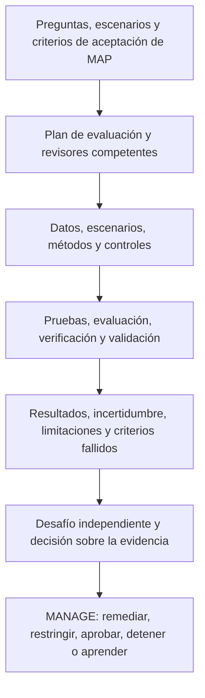
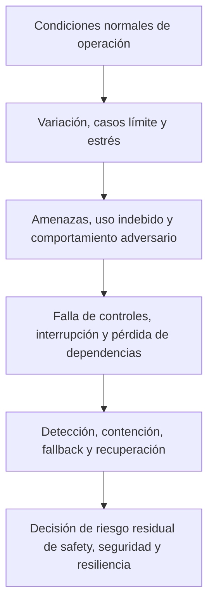
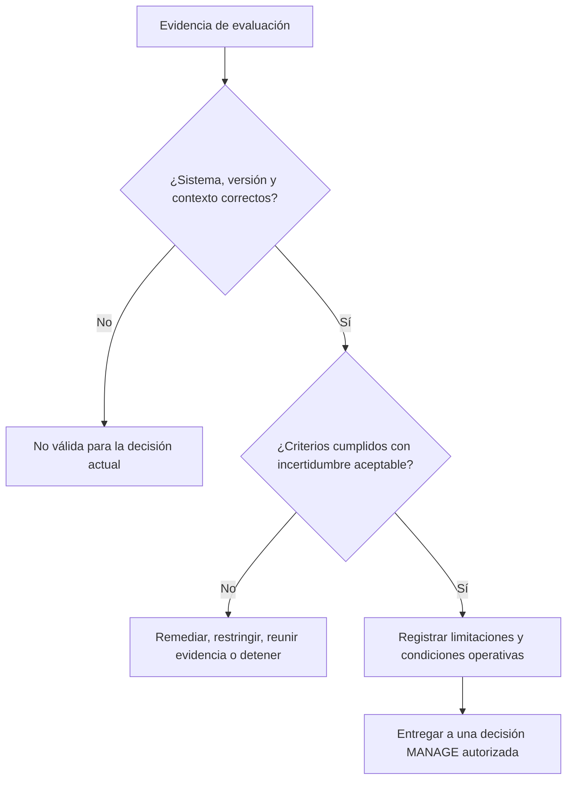

# Manual 03 — Implementación del Marco de Gestión de Riesgos de IA de NIST

## Fuente controlada es-419 — Parte 3: MEASURE, capítulos 17–24

**Línea base controlada:** NIST AI RMF 1.0 / NIST AI 100-1

**Límite de fuente:** Orientación práctica original de implementación. AI RMF 1.0 y el Playbook actuales están bajo una revisión anunciada. Esta fuente conserva trazabilidad controlada a la versión 1.0 y evita afirmar que una prueba demuestre confiabilidad universal.

> **Aviso de control:** Localización semántica asistida a partir del maestro inglés controlado. Conserva la estructura, los límites de aseguramiento y el significado operativo; no es una traducción oficial de NIST.

# Guía de capítulos

| Capítulo | Tema |
|---:|---|
| 17 | Arquitectura de la función MEASURE y gobierno de TEVV |
| 18 | Plan de evaluación, métodos, datos, umbrales e independencia |
| 19 | Validez, confiabilidad y evaluación del desempeño de la tarea |
| 20 | Evaluación de safety, ciberseguridad, robustez y resiliencia |
| 21 | Evidencia de rendición de cuentas, transparencia, explicabilidad e interpretabilidad |
| 22 | Evaluación de privacidad y sesgo perjudicial |
| 23 | Factores humanos, supervisión y evaluación de partes afectadas |
| 24 | Incertidumbre, limitaciones, revisión de resultados y paquete de evidencia MEASURE |

# 17. Arquitectura de la función MEASURE y gobierno de TEVV

*MEASURE produce evidencia relevante para decisiones sobre el comportamiento del sistema, el riesgo, las características de confiabilidad, los controles y la incertidumbre dentro del contexto establecido en MAP.*

Las pruebas, la evaluación, la verificación y la validación están relacionadas, pero no son intercambiables:

- **Pruebas:** ejecutan casos o condiciones definidos y registran los resultados observados.
- **Evaluación:** juzga la evidencia frente a criterios y necesidades de decisión.
- **Verificación:** determina si se cumplieron requisitos especificados o expectativas de diseño.
- **Validación:** determina si el sistema es adecuado para el propósito y contexto reales previstos.

**Explicación accesible:** MAP proporciona preguntas, escenarios y criterios de aceptación. El plan de evaluación selecciona revisores competentes, datos, escenarios y métodos. TEVV produce resultados con incertidumbre y limitaciones. Los revisores desafían la evidencia antes de que la administración la utilice para remediar, restringir, aprobar, detener o mejorar el sistema.

## 17.1 Principios de medición

La evaluación debe estar:

- vinculada con una decisión específica;
- representada por el contexto previsto y razonablemente previsible;
- vinculada a una versión y ser reproducible cuando sea factible;
- proporcionada a la consecuencia y la incertidumbre;
- respaldada por varias disciplinas para riesgos sociotécnicos;
- suficientemente independiente para proporcionar desafío efectivo;
- explícita sobre fallos y evidencia faltante;
- protegida contra manipulación de métricas y filtración de benchmarks; y
- repetida después de un cambio material o de una degradación de la evidencia.

## 17.2 Inventario de medición

Mantenga un registro de preguntas de evaluación. Cada registro debe identificar:

| Campo | Contenido mínimo |
|---|---|
| Pregunta | Afirmación, requisito, escenario o control que se evalúa |
| Decisión | Aprobación, restricción, diseño de control o decisión de monitoreo respaldada |
| Contexto | Población, ambiente, flujo de trabajo, usuario y versión |
| Método | Prueba, análisis, revisión, simulación, experimento, auditoría o monitoreo |
| Criterios | Umbral, rúbrica, comparador y condición bloqueante |
| Evidencia | Dataset, conjunto de escenarios, logs, revisión experta u otra fuente |
| Revisor | Ejecutor, persona que desafía y competencia requerida |
| Momento | Previo a liberación, periódico, continuo, activado por evento o retiro |
| Limitación | Incertidumbre, exclusión o riesgo de transferencia conocido |
| Resultado | Aprobado, condicional, fallido, inconcluso o no probado |

## 17.3 Gobierno de la medición

Defina quién puede aprobar métodos, umbrales y excepciones. Un equipo que construyó el sistema puede realizar pruebas, pero los riesgos materiales pueden requerir validación o desafío separado. La independencia puede obtenerse mediante separación organizacional, un par calificado, un especialista externo, un revisor rotativo o una función de auditoría de manera proporcional al riesgo.

# 18. Plan de evaluación, métodos, datos, umbrales e independencia

*Un resultado solo es tan útil como la pregunta, el método, la evidencia y la regla de decisión que lo sustentan.*

## 18.1 Contenido del plan de evaluación

El plan debe registrar:

1. sistema/uso, versión y contexto;
2. afirmaciones, escenarios y requisitos derivados de MAP;
3. preguntas de evaluación y responsables de decisión;
4. métodos y justificación;
5. datos de prueba, casos, escenarios y muestreo;
6. poblaciones y subgrupos pertinentes;
7. línea base, comparador y criterios de aceptación;
8. ambiente de ejecución y controles;
9. roles, competencia e independencia de los revisores;
10. protecciones de seguridad, privacidad y safety para la propia evaluación;
11. método de análisis de resultados e incertidumbre;
12. fallos bloqueantes y escalamiento;
13. requisitos de reproducibilidad y retención de evidencia; y
14. activadores de repetición de prueba y cambio.

## 18.2 Selección de métodos

Use múltiples métodos cuando uno solo no pueda capturar el riesgo:

- pruebas cuantitativas de desempeño;
- revisión cualitativa basada en rúbricas;
- pruebas de escenarios y modos de falla;
- simulación o experimento controlado;
- evaluación de usabilidad y factores humanos;
- análisis de subgrupos y accesibilidad;
- evaluación de privacidad y seguridad;
- pruebas adversarias o red-team;
- revisión de código, arquitectura, datos y procesos;
- validación de evidencia de proveedores;
- análisis de logs operativos, incidentes y quejas; y
- revisión por expertos o partes afectadas.

## 18.3 Datos de evaluación

Verifique que los datos de evaluación sean adecuados para la afirmación. Registre fuente, autoridad, población, período, recopilación, preprocesamiento, etiquetado, exclusiones, calidad, contenido sensible, versión y separación respecto del entrenamiento o ajuste cuando corresponda.

Los datos de prueba pueden crear riesgos de privacidad, seguridad, safety o propiedad intelectual. Aplique controles de acceso, minimización, aislamiento, retención y eliminación.

## 18.4 Umbrales y rúbricas

Defina umbrales antes de examinar los resultados finales cuando sea práctico. Explique:

- por qué el umbral es aceptable para la consecuencia;
- si se aplica a promedios, colas, subgrupos o eventos individuales;
- expectativa de confianza o incertidumbre;
- excepciones permitidas;
- condiciones bloqueantes; y
- quién puede cambiarlo.

Los promedios pueden ocultar fallos graves de subgrupos o eventos raros. Incluya análisis de distribución, peor caso o escenarios específicos cuando las consecuencias lo justifiquen.

## 18.5 Integridad de la evaluación

Proteja la evaluación contra:

- seleccionar solo casos favorables;
- cambiar criterios después de conocer los resultados;
- contaminación o memorización del benchmark;
- ajustar al conjunto de prueba sin confirmación independiente;
- excluir fallos sin una justificación documentada;
- desajuste de versión entre los sistemas probado y desplegado;
- conflictos de interés de los revisores; y
- reportar únicamente puntuaciones agregadas sin limitaciones.

# 19. Validez, confiabilidad y evaluación del desempeño de la tarea

*La evidencia de desempeño debe reflejar la tarea real, no solo un benchmark conveniente.*

## 19.1 Descomposición de afirmaciones

Descomponga afirmaciones generales en propiedades observables. “Preciso” podría incluir:

- clasificación o predicción correcta;
- completitud de la información requerida;
- calibración o comportamiento de confianza;
- consistencia entre ejecuciones repetidas;
- estabilidad ante variaciones esperadas;
- oportunidad y latencia;
- abstención apropiada o señalización de incertidumbre; y
- comportamiento aceptable de errores entre poblaciones pertinentes.

## 19.2 Validez

Pregunte si la evaluación realmente respalda la inferencia prevista:

- ¿La prueba representa la tarea y la población?
- ¿La referencia o ground truth es creíble?
- ¿Las etiquetas y rúbricas son suficientemente confiables?
- ¿Los principales factores de confusión están controlados o reportados?
- ¿El desempeño offline se transfiere al flujo de trabajo?
- ¿La interacción humana cambia el resultado?
- ¿Se incluyen las acciones downstream?

## 19.3 Confiabilidad

Evalúe la consistencia entre:

- ejecuciones repetidas;
- semillas o ejecuciones no deterministas;
- tiempo y carga operativa;
- dispositivos, regiones o ambientes;
- variación pertinente de entradas;
- revisores o anotadores; y
- versiones de modelo/proveedor.

Para sistemas generativos, use múltiples muestras y revisión estructurada en lugar de presentar una salida favorable como evidencia.

## 19.4 Análisis de errores

No se detenga en una sola puntuación. Caracterice:

- tipos de error y severidad;
- consecuencias de falsos positivos y falsos negativos;
- comportamiento de cola y eventos raros;
- variación entre subgrupos e intersecciones cuando corresponda;
- comportamiento de abstención y escalamiento;
- detectabilidad de errores por los usuarios;
- amplificación downstream; y
- condiciones operativas vinculadas con fallos.

## 19.5 Evaluación comparativa

Compare con el proceso actual, un sistema más simple, desempeño humano calificado u otra línea base razonable. Registre diferencias de costo, tiempo, acceso, calidad, safety y carga. La pregunta relevante suele ser si el proceso habilitado por IA mejora el sistema general de decisión, no si el modelo supera una sola métrica aislada.

# 20. Evaluación de safety, ciberseguridad, robustez y resiliencia

*Los sistemas de IA materiales requieren evidencia sobre su comportamiento bajo estrés, ataque, falla y recuperación.*

## 20.1 Modelo de evaluación

**Explicación accesible:** La evaluación comienza con la operación normal, se amplía a casos límite y estrés y después prueba amenazas y uso indebido. También examina fallas de controles o dependencias y si la organización puede detectar, contener, usar alternativas y recuperarse antes de decidir qué riesgo residual permanece.

## 20.2 Evaluación de safety

Según corresponda, evalúe:

- peligros y acciones inseguras;
- uso y uso indebido previsibles;
- interacción insegura con personas o sistemas físicos;
- detección de fallas y estado seguro;
- tiempo de intervención humana;
- parada de emergencia y alternativa manual;
- consecuencias en cascada; y
- validación de recuperación.

Utilice experiencia especializada del dominio de safety cuando las consecuencias excedan una falla ordinaria de software.

## 20.3 Evaluación de ciberseguridad

Incluya el sistema de IA completo. Considere:

- envenenamiento de datos y entradas maliciosas;
- evasión y ejemplos adversarios;
- prompt injection e indirect prompt injection;
- agencia excesiva y uso indebido de herramientas;
- extracción de modelo, prompts, datos o secretos;
- manejo inseguro de salidas;
- debilidades de control de acceso e identidad;
- compromiso de dependencias y cadena de suministro de software;
- denegación de servicio y agotamiento de recursos;
- evasión de logging o monitoreo; y
- cambios no autorizados de modelo/configuración.

Use ambientes controlados y autorización explícita para pruebas adversarias. No exponga innecesariamente datos sensibles reales ni sistemas de producción.

## 20.4 Robustez

Pruebe el comportamiento ante variación esperada y perturbaciones plausibles, incluidas entradas ruidosas, incompletas, ambiguas, fuera de distribución, multilingües o manipuladas intencionalmente cuando corresponda. La robustez depende del contexto; resistir una prueba no demuestra robustez general.

## 20.5 Resiliencia y recuperación

Ejercite:

- caída del proveedor o modelo;
- degradación de latencia o capacidad;
- falla de filtros de safety;
- datos corruptos o no disponibles;
- pérdida de logging o monitoreo;
- revocación de credenciales;
- rollback a una versión conocida;
- operación degradada o manual;
- comunicación de incidentes; y
- validación de restauración.

Registre tiempo de recuperación, punto de recuperación, carga de trabajo manual, reconciliación de datos y limitaciones residuales.

# 21. Evidencia de rendición de cuentas, transparencia, explicabilidad e interpretabilidad

*La información es útil solo cuando permite que la persona prevista comprenda, actúe, cuestione o busque reparación.*

## 21.1 Transparencia específica para la audiencia

Identifique lo que necesita cada audiencia:

| Audiencia | Necesidad típica |
|---|---|
| Usuario/operador | Propósito, uso correcto, límites, verificación, escalamiento e instrucciones de parada |
| Persona afectada | Participación de IA, consecuencia relevante, explicación accesible y ruta de corrección/apelación |
| Propietario/administración | Riesgo, evidencia, fallos, riesgo residual, incidentes y condiciones de decisión |
| Equipo técnico | Versiones, datos, métodos, limitaciones, monitoreo y detalles de cambio |
| Revisor/auditor | Evidencia trazable, aprobaciones, criterios, papeles de trabajo y operación de controles |
| Regulador/cliente | Información requerida por la autoridad aplicable o contrato, sujeta a revisión legal |

## 21.2 Explicabilidad e interpretabilidad

Evalúe si el método de explicación es adecuado para el modelo, decisión, audiencia y consecuencia. Pruebe:

- fidelidad al comportamiento real del sistema;
- estabilidad y consistencia;
- completitud para la necesidad de decisión;
- comprensibilidad y accesibilidad;
- capacidad de actuar a partir de la explicación;
- resistencia a una presentación engañosa; y
- compensaciones de seguridad/privacidad.

Una explicación que parece plausible pero no refleja el sistema es peor que una limitación declarada con honestidad.

## 21.3 Trazabilidad y rendición de cuentas

Confirme que la organización pueda reconstruir:

- qué sistema/versión actuó;
- entrada y contexto pertinentes, sujetos a límites de privacidad;
- salida o acción;
- revisión humana o anulación;
- política aplicable y estado de controles;
- autoridad de decisión;
- vínculo con incidente o queja; y
- corrección o cambio posterior.

# 22. Evaluación de privacidad y sesgo perjudicial

*Los riesgos relacionados con privacidad y equidad requieren contexto, análisis de partes afectadas y más de una métrica agregada.*

## 22.1 Evaluación de privacidad

Evalúe el ciclo de vida completo de los datos:

- autoridad y propósito;
- minimización y necesidad;
- aviso y elección significativa cuando corresponda;
- tratamiento de datos sensibles;
- exposición en entrenamiento, retrieval, prompts y salidas;
- riesgo de inferencia o reidentificación;
- retención y eliminación;
- acceso, intercambio y subprocesadores;
- privacidad de monitoreo/logging; y
- procesos de corrección, acceso u otros derechos aplicables.

Las pruebas técnicas pueden incluir análisis de leakage, memorización, extracción o inferencia según corresponda, pero deben combinarse con evidencia de gobierno y procesos.

## 22.2 Evaluación de sesgo perjudicial

Comience por los daños mapeados y los grupos afectados. Determine:

- qué resultados o errores importan;
- qué grupos e intersecciones requieren análisis;
- qué comparación es significativa;
- si los datos respaldan la inferencia;
- si la métrica refleja el proceso real de decisión;
- si la revisión humana mitiga o amplifica el efecto;
- qué umbral o juicio cualitativo se aplica; y
- qué remedio existe.

Ninguna métrica de equidad es universalmente correcta. Registre la justificación, compensaciones, revisión legal cuando se requiera, limitaciones y riesgo residual.

## 22.3 Evidencia de proceso y resultado

Revise ambos tipos:

- **evidencia de proceso:** participación, gobierno de datos, decisiones de diseño, revisión, documentación y manejo de quejas; y
- **evidencia de resultado:** patrones de desempeño, error, asignación, carga o impacto en el contexto real.

## 22.4 Accesibilidad e idioma

Evalúe si interfaces, avisos, explicaciones, soporte y rutas de apelación funcionan para necesidades pertinentes de discapacidad, alfabetización, idioma y acceso tecnológico. Los defectos de accesibilidad pueden crear exclusión sistemática incluso cuando el desempeño del modelo parezca aceptable.

# 23. Factores humanos, supervisión y evaluación de partes afectadas

*El desempeño del equipo humano-IA puede diferir materialmente del desempeño del modelo medido por separado.*

## 23.1 Prueba de eficacia de la supervisión

Evalúe si la persona responsable de supervisar:

- reconoce cuándo participa la IA;
- entiende el propósito y las limitaciones;
- dispone de suficiente información y tiempo;
- puede identificar errores importantes;
- puede disentir sin penalización;
- puede corregir, anular o detener;
- utiliza correctamente el escalamiento y fallback; y
- deja un registro auditable.

Mida sesgo de automatización, complacencia, carga de trabajo, fatiga de alertas, degradación de habilidades y diferencias entre niveles de experiencia.

## 23.2 Evaluación del flujo humano-IA

Compare, al menos cuando sea material:

- línea base solo humana;
- resultado solo de IA para comprensión diagnóstica;
- persona con asistencia de IA;
- diferentes diseños de interfaz o explicación; y
- operación degradada o fallback.

El modelo operativo aprobado debe ser el que realmente se evaluó.

## 23.3 Evaluación de partes afectadas

Los métodos pueden incluir pruebas de usabilidad accesibles, entrevistas, análisis de quejas, pilotos controlados, revisión del recorrido, evaluación participativa o paneles de expertos del dominio. Proteja a participantes e información sensible y evite trasladar por completo a las personas afectadas la carga de demostrar el daño.

## 23.4 Apelaciones, corrección y reparación

Pruebe si una persona puede:

- reconocer una decisión o salida pertinente;
- obtener información comprensible;
- presentar una corrección o impugnación;
- acceder a una persona competente;
- recibir atención oportuna;
- evitar propagación repetida cuando corresponda; y
- obtener el remedio autorizado por política o ley.

# 24. Incertidumbre, limitaciones, revisión de resultados y paquete de evidencia MEASURE

*Los responsables de decisión necesitan una descripción fiel de lo que la evidencia respalda, lo que no respalda y qué tan rápido puede quedar obsoleta.*

## 24.1 Registro de resultados

Para cada evaluación material, conserve:

- ID de evaluación y pregunta MAP vinculada;
- versiones del sistema, modelo, datos, prompt/configuración y software;
- método, ambiente y fecha de ejecución;
- dataset/conjunto de escenarios y muestreo;
- criterios y umbrales predefinidos;
- ejecutor, revisor y competencia;
- resultados detallados y resumidos;
- fallos, exclusiones y anomalías;
- incertidumbre y confianza;
- limitaciones y condiciones de transferencia;
- manejo de seguridad/privacidad;
- hallazgos y remediación;
- resultados de repetición de prueba; y
- disposición de la administración.

## 24.2 Declaración de incertidumbre

Indique:

1. qué se conoce con respaldo razonable;
2. qué permanece incierto;
3. por qué existe la incertidumbre;
4. cómo la incertidumbre podría afectar a personas o decisiones;
5. controles o límites de despliegue utilizados debido a ella;
6. monitoreo o investigación planificados; y
7. quién aceptó la incertidumbre restante y hasta cuándo.

## 24.3 Clasificación de resultados

- **Aprobado:** la evidencia cumple los criterios definidos en el contexto probado.
- **Condicional:** los criterios solo se cumplen bajo restricciones documentadas o controles compensatorios.
- **Fallido:** uno o más criterios bloqueantes no se cumplen.
- **Inconcluso:** la evidencia es insuficiente o inconsistente para la decisión.
- **No probado:** la pregunta permanece abierta y no puede representarse como satisfecha.

Falle de forma cerrada cuando un resultado obligatorio haya fallado, sea inconcluso, falte, no corresponda a la versión, haya vencido o haya sido invalidado por un cambio material.

## 24.4 Revisión de evidencia

**Explicación accesible:** La revisión primero confirma que la evidencia corresponda al sistema, versión y contexto correctos. Si no, es inválida. Si los criterios o la incertidumbre son inaceptables, la organización remedia, restringe, reúne más evidencia o detiene. La evidencia aceptable se entrega a una decisión de administración autorizada conservando limitaciones y condiciones.

## 24.5 Paquete mínimo de MEASURE

1. plan de evaluación aprobado;
2. matriz de preguntas a métodos;
3. datasets controlados y manifiestos de escenarios;
4. registro de ambiente y versión;
5. resultados ejecutados y análisis;
6. evidencia de características de confiabilidad pertinentes al contexto;
7. evaluación humana/de partes afectadas cuando sea necesaria;
8. elementos fallidos, inconclusos y no probados;
9. declaración de incertidumbre y limitaciones;
10. desafío del revisor, hallazgos y remediación;
11. evidencia de repetición de pruebas; y
12. resumen listo para decisión vinculado con papeles de trabajo detallados.

**Punto de control Parte 3:** Los capítulos 17–24 crean evidencia sin sobreestimarla. La Parte 4 utiliza esa evidencia para priorizar, tratar, decidir, monitorear, responder y mejorar mediante MANAGE.
