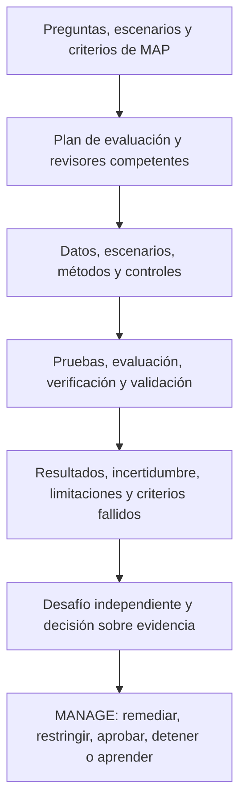

# Manual 03 — Implementación del Marco de Gestión de Riesgos de IA de NIST

## Borrador controlado es-419 — Parte 3: MEASURE, capítulos 17–24

**Línea base controlada:** NIST AI RMF 1.0 / NIST AI 100-1

> **Aviso de control:** Traducción semántica asistida para revisión humana. Conserva el significado operativo del maestro inglés; no es una traducción oficial de NIST.

# Guía de capítulos

| Capítulo | Tema |
|---:|---|
| 17 | Arquitectura de MEASURE y gobierno de TEVV |
| 18 | Plan de evaluación, métodos, datos, umbrales e independencia |
| 19 | Validez, confiabilidad y evaluación del desempeño de la tarea |
| 20 | Evaluación de seguridad, ciberseguridad, robustez y resiliencia |
| 21 | Evidencia de rendición de cuentas, transparencia, explicabilidad e interpretabilidad |
| 22 | Evaluación de privacidad y sesgo perjudicial |
| 23 | Factores humanos, supervisión y evaluación de partes afectadas |
| 24 | Incertidumbre, limitaciones, revisión de resultados y paquete de evidencia MEASURE |

# 17. Arquitectura de MEASURE y gobierno de TEVV

MEASURE produce evidencia útil para decisiones sobre comportamiento, riesgo, características de confiabilidad, controles e incertidumbre dentro del contexto definido en MAP.

- **Pruebas:** ejecutan casos o condiciones definidos y registran resultados observados.
- **Evaluación:** juzga evidencia frente a criterios y necesidades de decisión.
- **Verificación:** comprueba si se cumplieron requisitos o expectativas de diseño.
- **Validación:** determina si el sistema es adecuado para el propósito y contexto reales.

**Explicación accesible:** MAP define qué debe evaluarse. El plan selecciona personas competentes, datos y métodos. TEVV produce resultados con incertidumbres y limitaciones. Después, una revisión suficientemente independiente desafía la evidencia antes de que la administración decida.

El registro mínimo de medición debe incluir pregunta, decisión soportada, contexto, método, criterios, evidencia, revisor, momento, limitaciones y resultado.

# 18. Plan de evaluación, métodos, datos, umbrales e independencia

El plan debe identificar sistema y versión, preguntas, métodos, datos, escenarios, poblaciones, criterios de aceptación, ambiente, roles, independencia, protecciones, reglas de escalamiento, retención de evidencia y disparadores de repetición.

Use métodos múltiples cuando una sola técnica no capture el riesgo: pruebas cuantitativas, rúbricas cualitativas, escenarios, simulación, factores humanos, accesibilidad, privacidad, seguridad, pruebas adversarias, revisión de arquitectura y evidencia de proveedores.

Los umbrales deben justificarse por consecuencias y, cuando sea viable, definirse antes de observar el resultado final. No se deben cambiar criterios para convertir un fallo conocido en un supuesto éxito.

# 19. Validez, confiabilidad y desempeño

Descomponga afirmaciones generales como “preciso” en propiedades observables: corrección, completitud, calibración, consistencia, estabilidad, latencia, abstención y comportamiento de errores.

La validez pregunta si la prueba permite inferir desempeño en el contexto real. La confiabilidad evalúa consistencia entre ejecuciones, tiempo, ambientes, entradas, revisores y versiones. En IA generativa deben usarse múltiples muestras y revisión estructurada.

No se limite a un promedio. Analice tipos de error, severidad, falsos positivos/negativos, eventos de cola, subgrupos, detectabilidad y efectos aguas abajo.

# 20. Seguridad, ciberseguridad, robustez y resiliencia

Evalúe condiciones normales, variaciones, estrés, amenazas, abuso, fallas de controles y capacidad de recuperación.

Incluya, según aplique: peligros, acciones inseguras, prompt injection, abuso de herramientas, extracción de datos o secretos, controles de identidad, compromiso de dependencias, denegación de servicio, fallas de monitoreo, variación fuera de distribución, pérdida de proveedor, rollback y operación degradada.

Las pruebas adversarias deben ejecutarse en ambientes controlados y con autorización explícita.

# 21. Rendición de cuentas, transparencia, explicabilidad e interpretabilidad

La información debe ser útil para la audiencia concreta: usuario, persona afectada, propietario, equipo técnico, auditor o autoridad.

Evalúe fidelidad, estabilidad, completitud, comprensibilidad, accesibilidad, utilidad para actuar y compensaciones de privacidad/seguridad. Debe poder reconstruirse qué sistema/version actuó, el contexto relevante, la salida o acción, la revisión humana, el control aplicable, la autoridad de decisión y cualquier corrección posterior.

# 22. Privacidad y sesgo perjudicial

Evalúe el ciclo de vida de datos: propósito, minimización, datos sensibles, exposición en entrenamiento/retrieval/prompts/salidas, inferencia, retención, acceso, terceros y derechos aplicables.

Para sesgo perjudicial, parta del daño y de las partes afectadas. Defina resultados relevantes, grupos, comparadores, métricas, papel de la supervisión humana, umbrales, remedios y limitaciones. Ninguna métrica de equidad es universalmente correcta.

Incluya accesibilidad e idioma; una falla de accesibilidad puede crear exclusión sistemática aunque el promedio de desempeño sea aceptable.

# 23. Factores humanos, supervisión y partes afectadas

Evalúe el desempeño del equipo humano-IA, no solo del modelo. Confirme que la persona que supervisa reconoce el uso de IA, entiende límites, dispone de tiempo e información, puede disentir, corregir, detener y escalar, y deja evidencia auditable.

Mida sesgo de automatización, complacencia, carga de trabajo, fatiga de alertas y degradación de habilidades. Pruebe también procesos de apelación, corrección y reparación cuando correspondan.

# 24. Incertidumbre, limitaciones y paquete MEASURE

Cada resultado material debe registrar: ID, versión, método, fecha, datos/escenarios, criterios, revisores, resultados, fallos, incertidumbre, limitaciones, hallazgos, remediación, repetición de prueba y disposición administrativa.

Clasifique resultados como **aprobado**, **condicional**, **fallido**, **inconcluso** o **no probado**. La incertidumbre debe influir en restricciones, monitoreo y autoridad de aceptación.

El paquete MEASURE debe permitir que MANAGE distinga claramente qué evidencia soporta una decisión, qué quedó sin resolver y qué cambio invalida la evidencia.

**Punto de control Parte 3:** capítulos 17–24 convierten los escenarios de MAP en evidencia evaluada y trazable para decisiones de MANAGE.