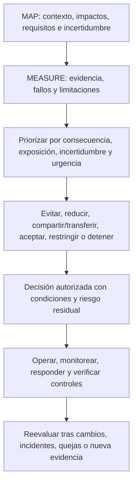
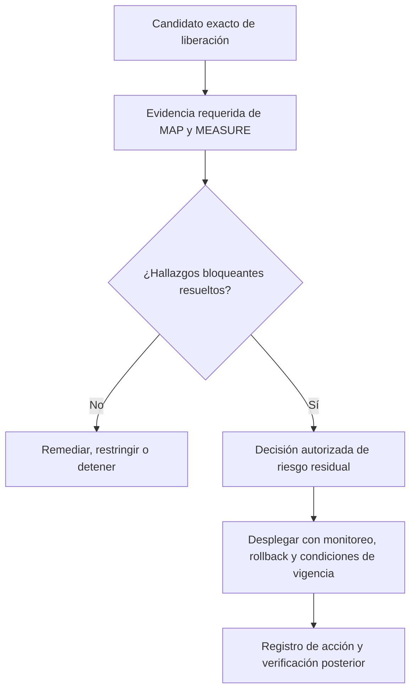
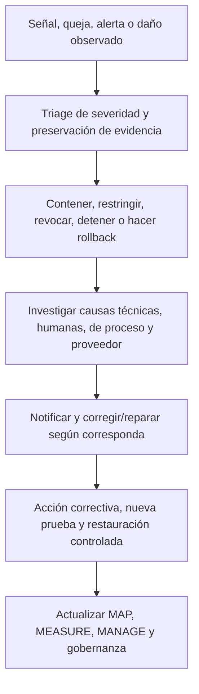

# Manual 03 — Implementación del Marco de Gestión de Riesgos de IA de NIST

## Borrador controlado es-419 — Parte 4: MANAGE, capítulos 25–32

**Línea base controlada:** NIST AI RMF 1.0 / NIST AI 100-1

> **Aviso de control:** Traducción semántica asistida para revisión humana. Conserva el significado operativo del maestro inglés; no es una traducción oficial de NIST.

# Guía de capítulos

| Capítulo | Tema |
|---:|---|
| 25 | Arquitectura de MANAGE y priorización del riesgo |
| 26 | Tratamiento del riesgo, controles, propiedad y planes de acción |
| 27 | Decisiones de riesgo residual, excepciones y aceptación responsable |
| 28 | Despliegue, liberación, restricción, detención, rollback y retiro |
| 29 | Monitoreo, deriva, incidentes, quejas, apelaciones y acciones correctivas |
| 30 | Cambios, proveedores, IA generativa y sistemas agénticos |
| 31 | Métricas, aseguramiento, auditoría interna y mejora continua |
| 32 | Hojas de ruta, madurez, perfiles y revisión del marco |

# 25. Arquitectura de MANAGE y priorización

MANAGE convierte el contexto de MAP y la evidencia de MEASURE en tratamiento priorizado, decisiones responsables, controles operativos y mejora.

**Explicación accesible:** La administración combina contexto y evidencia, prioriza el riesgo, selecciona tratamiento y documenta una decisión autorizada. La operación verifica controles y cualquier señal material dispara una nueva evaluación.

La priorización debe conservar consecuencia, reversibilidad, población afectada, exposición, incertidumbre, calidad de evidencia, fortaleza de controles, urgencia y riesgos de concentración.

# 26. Tratamiento, controles y planes de acción

Opciones de tratamiento: **evitar**, **reducir**, **compartir/transferir**, **aceptar**, **pilotar/restringir** o **detener/volver atrás**.

Cada control debe registrar escenario, objetivo, actividad, propietario, disparador/frecuencia, evidencia, umbral, dependencia, limitación, prueba y riesgo residual.

Prefiera controles que eliminen o reduzcan el riesgo en la fuente antes de depender únicamente de capacitación o advertencias. Cada remediación requiere responsable, fecha, severidad, criterios de aceptación, evidencia y prueba de eficacia.

# 27. Riesgo residual, excepciones y aceptación

La aceptación de riesgo residual debe identificar sistema/version, alcance, población, riesgos, beneficios, evidencia revisada, incertidumbres, controles, fallos, autoridad, decisión, vigencia, disparadores y desacuerdos significativos.

Las excepciones deben ser estrechas, temporales, autorizadas, explícitas sobre el requisito incumplido, acompañadas de controles compensatorios y visibles para aseguramiento.

Devuelva una decisión si la evidencia está ausente, vencida, no corresponde a la versión o fue invalidada por un cambio material.

# 28. Despliegue, liberación, restricción, detención y retiro

La liberación es una decisión de riesgo para una configuración exacta.

El paquete mínimo incluye propósito aprobado, nivel de riesgo, versiones, evaluaciones, revisiones aplicables, evidencia de proveedor, instrucciones, monitoreo, capacidades de detención/rollback, hallazgos abiertos y aprobación residual.

Defina disparadores objetivos para detener o revertir: daño grave, compromiso de seguridad, exposición de datos, degradación material, pérdida de supervisión humana, evidencia inválida, cambio no aprobado del proveedor o prohibición legal/contractual.

El retiro debe cubrir datos, credenciales, integraciones, comunicaciones, contratos, archivos y confirmación de que el sistema ya no actúa.

# 29. Monitoreo, deriva, incidentes y acciones correctivas

Para cada medida operativa documente pregunta, fuente, población, versión, cálculo, línea base, umbral, responsable, frecuencia, acción y limitaciones.

Diferencie deriva de datos, población, relación/concepto, comportamiento del modelo, flujo de trabajo, usuarios y ambiente.

Las quejas y apelaciones son evidencia de riesgo. La acción correctiva debe separar la corrección inmediata del tratamiento de causa raíz y verificar eficacia antes del cierre.

# 30. Cambios, proveedores, IA generativa y sistemas agénticos

Revise cambios de propósito, población, geografía, idioma, datos, modelo, proveedor, prompts, herramientas, autonomía, interfaz, supervisión, monitoreo y requisitos aplicables.

Clasifique el cambio como no material, material con revisión acotada o material que requiere reevaluación completa.

Cuando aplique IA generativa, use NIST AI 600-1 como perfil complementario y evalúe confabulación, contenido dañino, privacidad, propiedad intelectual, integridad de información, seguridad, dependencia humana, sesgo, abuso a escala y riesgos de cadena de valor.

Para agentes con herramientas: identidad limitada, mínimo privilegio, allowlists, límites de transacción/tiempo, confirmación humana para acciones consecuenciales, aislamiento, trazas completas, controles de memoria, revocación determinista y rollback.

# 31. Métricas, aseguramiento, auditoría interna y mejora

Use métricas vinculadas a decisiones: inventario con propietario y aprobación vigente, evidencia conectada a versión desplegada, fallos graves, excepciones vencidas, incidentes/quejas, umbrales excedidos, cambios de proveedor y efectividad de remediaciones.

Pruebe **eficacia de diseño** y **eficacia operativa**. La auditoría interna debe definir alcance, criterios, competencia, independencia, muestreo, evidencia, hallazgos, seguimiento y límites de aseguramiento.

Los hallazgos deben registrar criterio, condición, evidencia, impacto/riesgo, propietario, acción, vencimiento y prueba de cierre.

# 32. Hojas de ruta, madurez, perfiles y revisión del marco

Empiece con un mínimo controlado y aumente profundidad según riesgo y complejidad.

**Ruta Essential:** liderazgo, reglas iniciales, inventario, clasificación, contactos de incidente, plantillas mínimas; luego contexto/evaluación, autoridad residual, proveedor/cambio, monitoreo y remediación; finalmente reconciliación, pruebas de controles, métricas y revisión interna.

**Ruta Structured:** agregue gobernanza formal, puertas de ciclo de vida, TEVV controlado, linaje/versionado, revisiones especializadas, métricas operativas y auditoría interna.

**Ruta Enhanced:** agregue supervisión ejecutiva, desafío independiente, pruebas adversarias y de escenarios, monitoreo continuo, análisis de concentración, planes de continuidad y aceptación de riesgo residual de mayor nivel.

Cuando NIST publique una revisión final del AI RMF, congele el candidato actual, verifique la publicación, compare cambios, identifique capítulos/plantillas/gráficos/traducciones afectados, actualice primero el maestro inglés, repita revisión semántica y regenere artefactos. No sustituya silenciosamente una línea base publicada.

**Punto de control Parte 4:** capítulos 25–32 completan el ciclo operativo y conectan tratamiento, liberación, operación, mejora y futuras revisiones del marco.