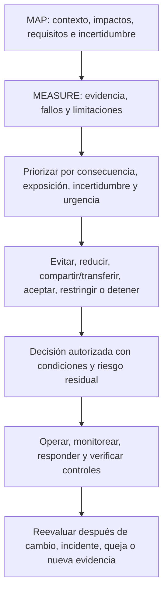
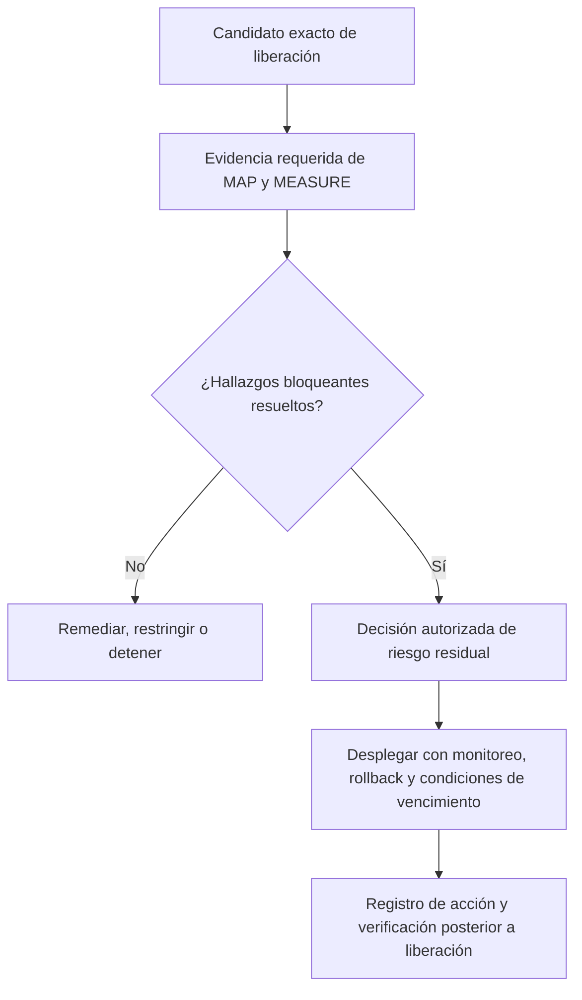
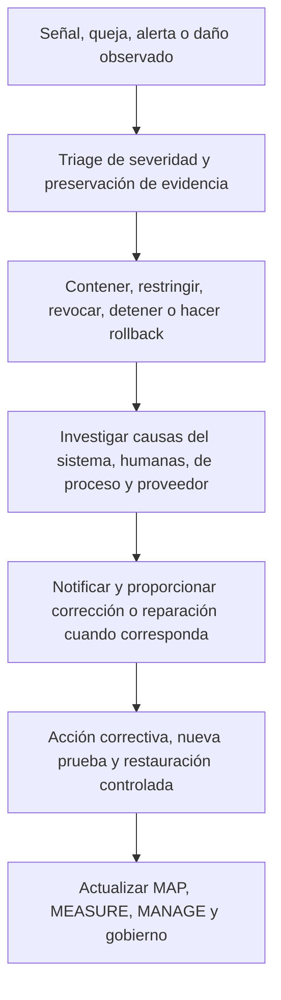

# Manual 03 — Implementación del Marco de Gestión de Riesgos de IA de NIST

## Fuente controlada es-419 — Parte 4: MANAGE, capítulos 25–32

**Línea base controlada:** NIST AI RMF 1.0 / NIST AI 100-1

**Límite de fuente:** Orientación práctica original de implementación. NIST AI RMF es orientación voluntaria y no sustituye leyes vinculantes, contratos, políticas, obligaciones sectoriales, criterios de certificación ni juicio profesional. AI RMF 1.0 está siendo revisado, por lo que esta fuente vinculada a versión requiere análisis de impacto después de una nueva publicación final de NIST.

> **Aviso de control:** Localización semántica asistida a partir del maestro inglés controlado. Conserva la estructura, los límites de aseguramiento y el significado operativo; no es una traducción oficial de NIST.

# Guía de capítulos

| Capítulo | Tema |
|---:|---|
| 25 | Arquitectura de la función MANAGE y priorización del riesgo |
| 26 | Tratamiento del riesgo, controles, propiedad y planificación de acciones |
| 27 | Decisiones de riesgo residual, excepciones y aceptación responsable |
| 28 | Despliegue, liberación, restricción, detención, rollback y retiro |
| 29 | Monitoreo, deriva, incidentes, quejas, apelaciones y acción correctiva |
| 30 | Cambios, proveedores, IA generativa y gobierno de sistemas agénticos |
| 31 | Métricas, aseguramiento, auditoría interna y mejora continua |
| 32 | Hojas de ruta de implementación, madurez, perfiles y revisión del marco |

# 25. Arquitectura de la función MANAGE y priorización del riesgo

*MANAGE convierte el contexto mapeado y la evidencia medida en tratamiento priorizado, decisiones responsables, controles operativos y mejora.*

**Explicación accesible:** La administración combina el contexto de MAP con la evidencia de MEASURE, prioriza el riesgo, selecciona tratamiento y registra una decisión autorizada con condiciones y riesgo residual. La operación monitorea y verifica controles. Los cambios y señales del mundo real activan una nueva evaluación.

## 25.1 Registro de priorización

Priorice usando más que una puntuación genérica. Registre:

- consecuencia plausible y reversibilidad;
- población afectada, vulnerabilidad y escala;
- exposición, frecuencia y duración;
- probabilidad cuando pueda respaldarse;
- incertidumbre y calidad de la evidencia;
- fortaleza del control y detectabilidad;
- urgencia, incluidos incidentes activos o plazos legales;
- riesgo de modo común o concentración;
- compensaciones entre oportunidad y beneficio; y
- dependencias entre riesgos.

Una incertidumbre alta puede justificar controles más fuertes o un piloto más estrecho incluso cuando se desconoce la probabilidad.

## 25.2 Vista de portafolio

Agregue riesgos de IA entre sistemas sin perder la rendición de cuentas a nivel de sistema. La administración debe identificar:

- múltiples usos dependientes del mismo modelo/proveedor;
- fallos repetidos de controles;
- efectos acumulativos sobre la misma población;
- capacidad escasa de supervisión o validación;
- riesgo correlacionado de ciberseguridad, privacidad u operación;
- excepciones y decisiones de riesgo residual próximas a vencer; y
- sistemas cuya autonomía o escala combinada exceda los supuestos originales.

## 25.3 Cadencia de decisiones

Utilice revisión activada por eventos además de calendarios. Revise la prioridad cuando aparezca un cambio material, incidente, queja, fallo de evaluación, aviso de proveedor, desarrollo legal, cambio de tolerancia al riesgo o nueva población afectada.

# 26. Tratamiento del riesgo, controles, propiedad y planificación de acciones

*El tratamiento debe cambiar la exposición real, el comportamiento o la capacidad de recuperación, no solo crear documentación.*

## 26.1 Opciones de tratamiento

- **Evitar:** no iniciar, retirar una función o retirar el uso.
- **Reducir:** cambiar propósito, diseño, datos, modelo, autonomía, población, proceso o controles.
- **Compartir/transferir:** asignar obligaciones definidas mediante contrato o seguro, conservando la rendición de cuentas que no puede transferirse.
- **Aceptar:** autorizar riesgo residual dentro de autoridad y condiciones documentadas.
- **Pilotar/restringir:** limitar geografía, población, usuarios, datos, autonomía, duración o volumen para reunir evidencia de forma segura.
- **Detener/rollback:** suspender la operación o volver a un estado seguro conocido.

## 26.2 Registro de diseño de controles

| Campo | Contenido mínimo |
|---|---|
| Riesgo/escenario | Causa-evento-consecuencia mapeados y partes afectadas |
| Objetivo | Exposición, fallo o consecuencia que aborda el control |
| Control | Actividad preventiva, detectiva, correctiva o de recuperación |
| Propietario/operador | Propietario responsable y persona/sistema que lo ejecuta |
| Activador/frecuencia | Continuo, por transacción, por liberación, periódico o por evento |
| Evidencia | Registro que demuestra diseño y operación |
| Umbral | Condición que causa acción o escalamiento |
| Dependencia | Datos, herramienta, proveedor, revisor o infraestructura necesaria |
| Limitación | Brecha o modo de falla conocido |
| Prueba | Cómo se evalúan la eficacia de diseño y la eficacia operativa |
| Riesgo residual | Lo que permanece después del control |

## 26.3 Jerarquía de controles

Prefiera controles que eliminen o restrinjan el riesgo en la fuente antes de depender únicamente de que los usuarios detecten errores. Según el contexto:

1. eliminar el uso o capacidad peligrosa;
2. reducir alcance, autonomía, datos o acceso;
3. rediseñar arquitectura, modelo, flujo de trabajo o interfaz;
4. implementar controles técnicos y de proceso;
5. agregar supervisión humana competente y verificación independiente;
6. agregar advertencias, instrucciones y capacitación; y
7. monitorear, responder y proporcionar reparación.

La capacitación y los descargos rara vez son controles suficientes para comportamiento de sistemas de alta consecuencia.

## 26.4 Plan de acción

Cada elemento de remediación debe tener propietario, fecha de vencimiento, severidad, dependencia, criterios de aceptación, evidencia, método de repetición de prueba y ruta de escalamiento. Una fecha de vencimiento no reduce el riesgo actual; pueden requerirse restricciones interinas hasta verificar la remediación.

# 27. Decisiones de riesgo residual, excepciones y aceptación responsable

*El riesgo residual es una decisión sobre la exposición restante después de la evidencia y los controles, no una etiqueta generada por una herramienta de puntuación.*

## 27.1 Registro de aceptación

Registre:

- sistema/uso y versión exactos;
- alcance de la decisión, población, geografía y duración;
- riesgos, beneficios y partes afectadas relevantes;
- evidencia revisada e incertidumbre no resuelta;
- controles y condiciones operativas;
- elementos fallidos, inconclusos o no probados;
- justificación del riesgo residual;
- autoridad de decisión y competencia;
- aprobación, aprobación condicional, restricción o rechazo;
- fecha de vencimiento y revisión;
- activadores automáticos de reevaluación/detención; y
- disenso o posición minoritaria.

## 27.2 Niveles de autoridad

Alinee la autoridad de aceptación con la consecuencia. El riesgo bajo y acotado puede aceptarse por el propietario responsable dentro de la política. El riesgo moderado puede requerir aprobación multifuncional. El riesgo de alta consecuencia, regulado, sensible a safety o a nivel de portafolio puede requerir autoridad ejecutiva o designada por la junta y desafío independiente.

Nadie debe aceptar riesgo en nombre de las partes afectadas simplemente porque la organización obtenga un beneficio. Las obligaciones legales y no transferibles permanecen vinculantes.

## 27.3 Excepciones

Una excepción debe ser:

- estrecha y limitada en el tiempo;
- aprobada por personas autorizadas;
- explícita sobre el requisito incumplido;
- respaldada por análisis de riesgo;
- acompañada de controles compensatorios o restricciones;
- monitoreada;
- visible para funciones de aseguramiento; y
- vencida automáticamente salvo que se renueve mediante una nueva decisión.

## 27.4 Verificación de calidad de la decisión

Rechace o devuelva una decisión si la evidencia falta, no corresponde a la versión, venció, fue invalidada por cambio material, es internamente inconsistente o no puede respaldar el contexto afirmado. La “urgencia del negocio” debe registrarse como un factor, no utilizarse para borrar el riesgo.

# 28. Despliegue, liberación, restricción, detención, rollback y retiro

*La liberación es una decisión de riesgo basada en evidencia para una configuración exacta, no el final de la gestión de riesgos.*

## 28.1 Puerta de liberación

**Explicación accesible:** La puerta de liberación identifica el candidato exacto y la evidencia requerida. Los hallazgos bloqueantes conducen a remediación, restricción o detención. Cuando la evidencia respalda la decisión, una persona autorizada acepta el riesgo residual y el despliegue ocurre con condiciones de monitoreo y rollback. La liberación y el seguimiento quedan registrados.

## 28.2 Evidencia mínima de liberación

- propósito y contexto aprobados;
- nivel de riesgo actual;
- versiones exactas de modelo, datos, prompt/configuración, software y dependencias;
- resultados de evaluación requeridos y limitaciones;
- revisiones de ciberseguridad, privacidad, safety, accesibilidad y dominio según corresponda;
- evidencia del proveedor y condiciones contractuales;
- instrucciones para usuario y supervisión;
- preparación para monitoreo e incidentes;
- prueba de detención, rollback, fallback y recuperación;
- hallazgos no resueltos y condiciones aceptadas;
- aprobación de riesgo residual; y
- registro de liberación e identificadores de checksum/versión.

## 28.3 Despliegue progresivo

Utilice liberación por etapas o canary, poblaciones limitadas, menor autonomía, límites de tasa, puertas de aprobación, proceso humano paralelo o evaluación en sombra cuando esto reduzca la incertidumbre sin exponer a las personas a un riesgo inaceptable.

## 28.4 Detención y rollback

Defina activadores objetivos, autoridad y capacidad técnica. Ejemplos:

- daño grave o daño inminente creíble;
- compromiso de seguridad o exposición de datos sensibles;
- degradación material del desempeño o de subgrupos;
- salidas dañinas o prohibidas repetidas;
- pérdida de supervisión humana requerida;
- evidencia requerida inválida o faltante;
- cambio no aprobado de proveedor/modelo;
- falla de monitoreo o logging para un control crítico; y
- prohibición legal o contractual vinculante.

Pruebe la detención y el rollback antes de depender de ellos. Confirme revocación de identidad, acciones en cola, reconciliación downstream, comunicaciones y validación de restauración.

## 28.5 Retiro

El retiro debe abordar retención/eliminación de datos y registros, acceso a modelo y credenciales, integraciones, comunicación a usuarios, terminación de proveedor, decisiones pendientes, legal hold, transferencia de conocimiento, archivo, detención del monitoreo y confirmación de que el sistema ya no actúa.

# 29. Monitoreo, deriva, incidentes, quejas, apelaciones y acción correctiva

*La evidencia operativa determina si los supuestos y controles continúan siendo válidos después de la liberación.*

## 29.1 Diseño de monitoreo

Para cada medida, defina:

- pregunta y riesgo abordado;
- fuente de datos y límite de privacidad;
- población y versión;
- cálculo o rúbrica;
- línea base y umbral;
- propietario y revisor;
- frecuencia o latencia;
- acción cuando se supera el umbral;
- limitación de falso positivo/falso negativo; y
- retención de evidencia.

Monitoree el comportamiento del sistema, interacción humana, controles, resultados que afectan a personas, cambios de proveedores y el propio sistema de monitoreo.

## 29.2 Deriva y degradación

Distinga cambios en datos de entrada, población, concepto/relación, comportamiento del modelo, flujo de trabajo, usuarios, ambiente y resultados. Una métrica puede permanecer estable mientras cambia la consecuencia, por lo que combine señales cuantitativas con incidentes, quejas, anulaciones y revisión del dominio.

## 29.3 Proceso de incidentes

**Explicación accesible:** Un incidente comienza con una señal o queja, seguido de triage y preservación de evidencia. La organización contiene el problema, investiga causas técnicas y organizacionales, proporciona la notificación o reparación requerida, verifica la acción correctiva y actualiza todo el ciclo de gestión de riesgos.

## 29.4 Quejas, apelaciones y reparación

Trate las quejas como evidencia de riesgo, no solo como tickets de servicio al cliente. Vincúlelas a la versión y contexto del sistema, proteja a quienes presentan quejas, mantenga canales accesibles, evite represalias, defina niveles de servicio, habilite revisión humana competente y rastree patrones repetidos.

## 29.5 Acción correctiva

Separe la corrección inmediata de la acción correctiva sobre causa raíz. Registre:

- problema y consecuencia;
- contención/corrección;
- análisis de causa en tecnología, personas, procesos y gobierno;
- alcance sistémico;
- propietario de la acción y fecha de vencimiento;
- verificación de implementación;
- repetición de prueba de eficacia;
- monitoreo de recurrencia; y
- actualizaciones a sistemas relacionados, políticas, capacitación y controles de proveedores.

# 30. Cambios, proveedores, IA generativa y gobierno de sistemas agénticos

*Un cambio material invalida los supuestos y la evidencia afectados hasta que se analice su impacto.*

## 30.1 Clases de cambio

Revise cambios en:

- propósito o límite de uso prohibido;
- población, geografía, idioma o escala;
- fuente de datos, característica, retención o transformación;
- modelo, proveedor, versión, fine-tuning o prompt;
- software, herramienta, integración o permiso;
- autonomía o acción downstream;
- interfaz, aviso o supervisión humana;
- proveedor/subprocesador y contrato;
- monitoreo y logging; y
- requisito aplicable o tolerancia al riesgo.

Clasifique los cambios como no materiales, materiales con revisión limitada o materiales que requieren reevaluación completa. Conserve la justificación y el revisor.

## 30.2 Control de cambios de proveedor

Exija notificación cuando sea factible, pero suponga que los proveedores pueden cambiar el comportamiento sin aviso completo. Utilice fijación de versión, pruebas de regresión, monitoreo, derechos contractuales, actualización de evidencia, fallback y planificación de salida de manera proporcional a la dependencia.

## 30.3 Integración del perfil de IA generativa

Cuando la IA generativa esté dentro del alcance, aplique NIST AI 600-1 como perfil complementario al proceso general de AI RMF. Evalúe las familias de riesgo GenAI y las acciones del perfil que sean aplicables sin tratar cada acción como universalmente requerida.

Como mínimo considere:

- confabulación y contenido no respaldado;
- contenido peligroso, de odio o abusivo;
- preocupaciones de privacidad de datos y propiedad intelectual;
- integridad y procedencia de información;
- ciberseguridad y ataques a prompts/herramientas;
- dependencia humana excesiva y efectos emocionales o sociales;
- sesgo perjudicial y homogeneización;
- habilitación de uso indebido y abuso a escala;
- efectos ambientales y de recursos cuando sean materiales;
- riesgo de cadena de valor e integración de componentes; y
- limitaciones de evaluación.

Manual 04 proporciona una implementación más profunda de NIST AI 600-1.

## 30.4 Sistemas agénticos

Para agentes autónomos o que utilizan herramientas, implemente y pruebe:

- identidades estrechas y mínimo privilegio;
- listas permitidas de herramientas y acciones prohibidas;
- límites de transacción, tiempo, tasa y recursos;
- confirmación humana para acciones de consecuencia;
- límites de confianza de entrada/contenido;
- aislamiento del ambiente;
- trazas completas de acciones;
- controles de memoria y retención;
- revocación determinista y parada de emergencia;
- rollback y reconciliación downstream; y
- responsabilidad explícita por decisiones delegadas.

# 31. Métricas, aseguramiento, auditoría interna y mejora continua

*El aseguramiento pregunta si el gobierno y los controles están diseñados y operan eficazmente; no certifica que el riesgo haya sido eliminado.*

## 31.1 Métricas de administración

Use medidas vinculadas a decisiones, como:

- usos activos de IA con propietario, nivel y aprobación vigentes;
- sistemas materiales vinculados a evidencia de evaluación de la versión desplegada;
- fallos de alta severidad y antigüedad de remediación;
- excepciones y decisiones de riesgo residual vencidas;
- incidentes, quejas, apelaciones, anulaciones y recurrencia;
- violaciones de umbral y tiempo de respuesta;
- evidencia de proveedores y cambios no revisados;
- repetición de pruebas de eficacia de acción correctiva; y
- sistemas restringidos, detenidos o rediseñados porque la evidencia era inadecuada.

Evite recompensar el volumen de documentos o suprimir el reporte de incidentes.

## 31.2 Aseguramiento de controles

Pruebe ambos:

- **eficacia de diseño:** el control, si opera como fue diseñado, aborda el riesgo en contexto; y
- **eficacia operativa:** el control realmente operó para la población y período requeridos, produjo evidencia, detectó excepciones y causó la acción requerida.

## 31.3 Auditoría interna

Un programa de auditoría debe definir alcance basado en riesgo, criterios, competencia, independencia, muestreo, evidencia, hallazgos, reporte y seguimiento. Los auditores no deben auditar su propio trabajo sin salvaguardas. Conserve la distinción entre auditoría interna, evaluación técnica, revisión de compliance, certificación y examen regulatorio.

## 31.4 Clasificación de hallazgos

Clasifique hallazgos con base en consecuencia, alcance sistémico, falla de control, recurrencia, evidencia y urgencia. Cada hallazgo debe identificar criterio, condición, evidencia, impacto/riesgo, propietario, acción, fecha de vencimiento y prueba de cierre.

## 31.5 Ciclo de aprendizaje

Utilice incidentes, near misses, quejas, auditorías, eventos de proveedores y controles exitosos para actualizar inventario, criterios de riesgo, escenarios, métodos de evaluación, umbrales, capacitación, estándares de diseño y decisiones de portafolio.

# 32. Hojas de ruta de implementación, madurez, perfiles y revisión del marco

*Las organizaciones deben comenzar con un mínimo controlado y agregar profundidad cuando el riesgo, la complejidad y la evidencia lo exijan.*

## 32.1 Hoja de ruta Essential

### Primeros 30 días

- designar liderazgo responsable de riesgo de IA;
- emitir reglas interinas de usos aprobados/prohibidos;
- comenzar descubrimiento e inventario de IA;
- definir un método simple de enrutamiento de riesgos;
- identificar usos materiales existentes;
- establecer contactos de incidentes y detención; y
- seleccionar un conjunto pequeño de plantillas de evidencia.

### Días 31–90

- completar contexto y evaluación mínima para usos materiales;
- asignar autoridad de riesgo residual;
- implementar verificaciones de proveedores y cambios;
- documentar instrucciones de usuario/supervisión;
- definir umbrales de monitoreo; y
- remediar o restringir usos que carezcan de evidencia respaldable.

### Meses 4–12

- reconciliar el inventario periódicamente;
- probar controles y acciones correctivas;
- mejorar el manejo de incidentes/quejas;
- construir métricas de administración;
- realizar revisión interna basada en riesgo; y
- actualizar el perfil objetivo.

## 32.2 Hoja de ruta Structured

Agregue gobierno formal, puertas multifuncionales del ciclo de vida, TEVV controlado, versión/linaje, evidencia de proveedores, revisión de privacidad/ciberseguridad/accesibilidad/dominio, métricas operativas, revisión periódica por la administración, auditoría interna y retención controlada de evidencia.

## 32.3 Hoja de ruta Enhanced

Agregue supervisión ejecutiva/de junta, validación independiente, participación de partes afectadas, evaluación adversaria y de estrés, monitoreo continuo de riesgos clave, detención/rollback ensayados, análisis de concentración de portafolio, vigilancia mejorada de proveedores y vencimiento formal de riesgo residual.

## 32.4 Modelo de madurez

| Nivel | Estado observable |
|---|---|
| 0 — No controlado | El uso de IA es desconocido o no gestionado; faltan propiedad y evidencia |
| 1 — Inicial | Existen inventario básico, política, propietario y revisión caso por caso |
| 2 — Repetible | Enrutamiento de riesgo, puertas del ciclo de vida, evaluación y evidencia se utilizan consistentemente |
| 3 — Medido | Métricas operativas, pruebas de controles, revisión de proveedores/cambios y decisiones administrativas están vinculadas |
| 4 — Adaptativo | Incidentes, evidencia de partes afectadas, riesgo de portafolio y aseguramiento impulsan sistemáticamente la mejora |

La madurez no es una certificación. Un proceso de Nivel 4 aún puede tomar una mala decisión sobre un sistema, y una organización pequeña puede operar controles fuertes sin una burocracia elaborada.

## 32.5 Perfiles actual y objetivo

Cree un perfil actual que describa resultados y evidencia reales y un perfil objetivo que describa resultados deseados con base en riesgo y obligaciones. El plan de brechas debe identificar prioridad, propietario, recursos, dependencias, fecha, evidencia y restricción interina.

## 32.6 Protocolo de revisión del marco

Cuando NIST publique un AI RMF revisado:

1. congele el candidato de liberación actual del Manual 03;
2. verifique la publicación oficial final y la versión;
3. compare funciones, categorías, subcategorías, terminología y orientación;
4. clasifique impactos sobre capítulos, plantillas, gráficos, perfiles y crosswalks;
5. actualice primero la fuente controlada en inglés;
6. reabra las revisiones de fuente y técnicas afectadas;
7. vuelva a localizar el significado modificado mediante localización controlada revisada por humanos;
8. regenere artefactos DOCX/PDF y repita QA de accesibilidad, visual y seguridad; y
9. publique un registro de cambio versionado sin sobrescribir silenciosamente la línea base anterior.

## 32.7 Límite final de implementación

Implementar este manual puede fortalecer el gobierno de riesgos y la evidencia. No demuestra que un sistema de IA sea confiable, no elimina el daño, no satisface todas las leyes, no establece conformidad con ISO/IEC 42001, no crea certificación ni constituye una opinión de auditoría. La organización sigue siendo responsable del sistema real, contexto, obligaciones, decisiones y efectos.

**Punto de control Parte 4:** Los capítulos 25–32 completan el ciclo operativo GOVERN–MAP–MEASURE–MANAGE y lo conectan con despliegue, operaciones, incidentes, aseguramiento, hojas de ruta y revisión controlada del marco.
