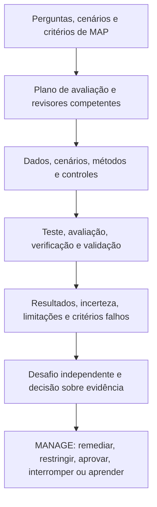

# Manual 03 — Implementação do NIST AI Risk Management Framework

## Rascunho controlado pt-BR — Parte 3: MEASURE, capítulos 17–24

**Linha de base controlada:** NIST AI RMF 1.0 / NIST AI 100-1

> **Aviso de controle:** Tradução semântica assistida para revisão humana. Preserva o significado operacional do mestre em inglês; não é uma tradução oficial do NIST.

# Guia de capítulos

| Capítulo | Tema |
|---:|---|
| 17 | Arquitetura de MEASURE e governança de TEVV |
| 18 | Plano de avaliação, métodos, dados, limiares e independência |
| 19 | Validade, confiabilidade e avaliação do desempenho da tarefa |
| 20 | Avaliação de segurança, cibersegurança, robustez e resiliência |
| 21 | Evidência de responsabilização, transparência, explicabilidade e interpretabilidade |
| 22 | Avaliação de privacidade e viés prejudicial |
| 23 | Fatores humanos, supervisão e avaliação de partes afetadas |
| 24 | Incerteza, limitações, revisão de resultados e pacote de evidências MEASURE |

# 17. Arquitetura de MEASURE e governança de TEVV

MEASURE produz evidência útil para decisão sobre comportamento, risco, características de confiabilidade, controles e incerteza dentro do contexto definido em MAP.

- **Teste:** executa casos ou condições definidos e registra resultados observados.
- **Avaliação:** julga evidências contra critérios e necessidades de decisão.
- **Verificação:** verifica se requisitos ou expectativas de projeto foram atendidos.
- **Validação:** determina se o sistema é adequado ao propósito e contexto reais.

**Explicação acessível:** MAP define o que precisa ser avaliado. O plano seleciona pessoas competentes, dados e métodos. TEVV produz resultados com incertezas e limitações. Em seguida, uma revisão suficientemente independente desafia as evidências antes da decisão gerencial.

O registro mínimo de medição deve conter pergunta, decisão suportada, contexto, método, critérios, evidência, revisor, momento, limitações e resultado.

# 18. Plano de avaliação, métodos, dados, limiares e independência

O plano deve identificar sistema e versão, perguntas, métodos, dados, cenários, populações, critérios de aceitação, ambiente, papéis, independência, proteções, regras de escalonamento, retenção de evidências e gatilhos de repetição.

Use métodos múltiplos quando uma única técnica não captar o risco: testes quantitativos, rubricas qualitativas, cenários, simulação, fatores humanos, acessibilidade, privacidade, segurança, testes adversariais, revisão de arquitetura e validação de evidências de fornecedores.

Os limiares devem ser justificados pelas consequências e, quando viável, definidos antes de observar o resultado final. Critérios não devem ser alterados para transformar uma falha conhecida em suposto sucesso.

# 19. Validade, confiabilidade e desempenho

Decomponha afirmações amplas como “preciso” em propriedades observáveis: correção, completude, calibração, consistência, estabilidade, latência, abstenção e comportamento de erro.

Validade pergunta se o teste sustenta inferência sobre o contexto real. Confiabilidade avalia consistência entre execuções, tempo, ambientes, entradas, revisores e versões. Em IA generativa, use múltiplas amostras e revisão estruturada.

Não pare em uma média. Analise tipos de erro, severidade, falsos positivos/negativos, eventos de cauda, subgrupos, detectabilidade e efeitos a jusante.

# 20. Segurança, cibersegurança, robustez e resiliência

Avalie condições normais, variação, estresse, ameaças, abuso, falhas de controle e capacidade de recuperação.

Inclua, conforme aplicável: perigos, ações inseguras, prompt injection, abuso de ferramentas, extração de dados ou segredos, controles de identidade, comprometimento de dependências, negação de serviço, falha de monitoramento, variação fora de distribuição, perda de fornecedor, rollback e operação degradada.

Testes adversariais devem ocorrer em ambientes controlados e com autorização explícita.

# 21. Responsabilização, transparência, explicabilidade e interpretabilidade

A informação deve ser útil para a audiência específica: usuário, pessoa afetada, proprietário, equipe técnica, auditor ou autoridade.

Avalie fidelidade, estabilidade, completude, compreensão, acessibilidade, utilidade para ação e compensações de privacidade/segurança. Deve ser possível reconstruir qual sistema/versão atuou, o contexto relevante, a saída ou ação, revisão humana, controle aplicável, autoridade de decisão e correção posterior.

# 22. Privacidade e viés prejudicial

Avalie o ciclo de vida dos dados: finalidade, minimização, dados sensíveis, exposição em treinamento/recuperação/prompts/saídas, inferência, retenção, acesso, terceiros e direitos aplicáveis.

Para viés prejudicial, comece pelo dano e pelas partes afetadas. Defina resultados relevantes, grupos, comparadores, métricas, papel da supervisão humana, limiares, remédios e limitações. Nenhuma métrica de equidade é universalmente correta.

Inclua acessibilidade e idioma; uma falha de acessibilidade pode criar exclusão sistemática mesmo com desempenho médio aceitável.

# 23. Fatores humanos, supervisão e partes afetadas

Avalie o desempenho da equipe humano-IA, não apenas do modelo. Confirme que a pessoa supervisora reconhece o uso de IA, entende limites, tem tempo e informação, pode discordar, corrigir, interromper e escalar, e deixa evidência auditável.

Meça viés de automação, complacência, carga de trabalho, fadiga de alertas e perda de habilidade. Teste também processos de recurso, correção e reparação quando aplicáveis.

# 24. Incerteza, limitações e pacote MEASURE

Cada resultado material deve registrar: ID, versão, método, data, dados/cenários, critérios, revisores, resultados, falhas, incerteza, limitações, achados, remediação, reteste e disposição gerencial.

Classifique resultados como **aprovado**, **condicional**, **falha**, **inconclusivo** ou **não testado**. A incerteza deve influenciar restrições, monitoramento e autoridade de aceitação.

O pacote MEASURE deve permitir que MANAGE diferencie claramente o que a evidência sustenta, o que permanece em aberto e qual mudança invalida a evidência.

**Checkpoint Parte 3:** capítulos 17–24 convertem cenários de MAP em evidência avaliada e rastreável para decisões de MANAGE.