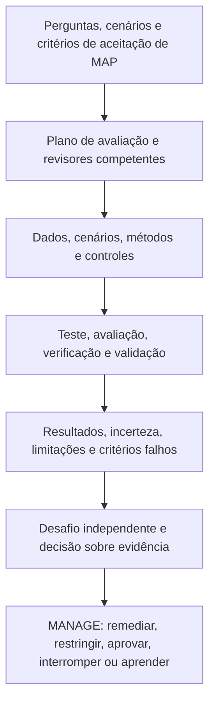
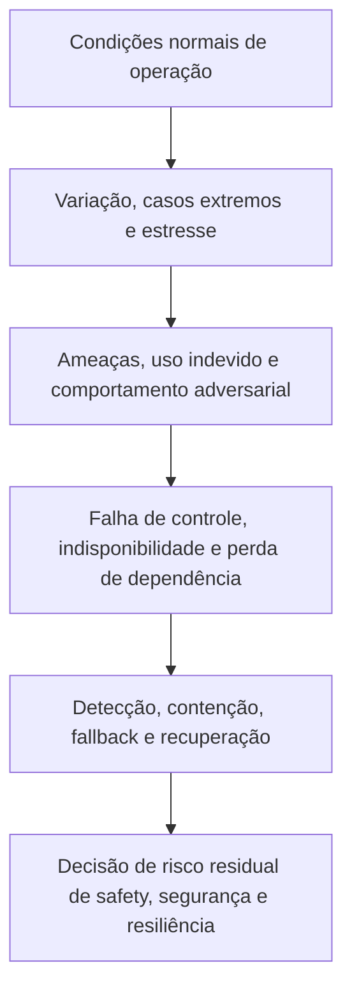
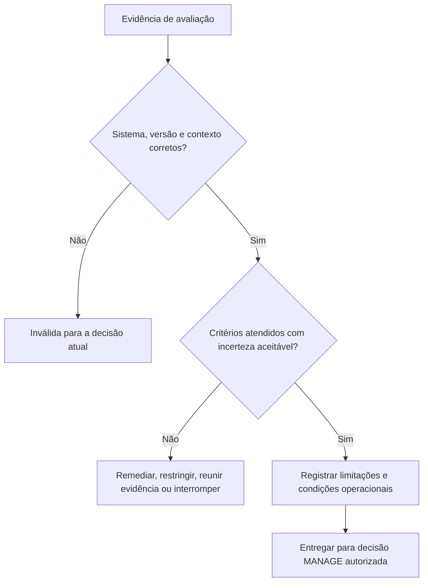

# Manual 03 — Implementação do NIST AI Risk Management Framework

## Fonte controlada pt-BR — Parte 3: MEASURE, capítulos 17–24

**Linha de base controlada:** NIST AI RMF 1.0 / NIST AI 100-1

**Limite de fonte:** Orientação prática original de implementação. O AI RMF 1.0 e o Playbook atuais estão sob revisão anunciada. Esta fonte preserva rastreabilidade controlada à versão 1.0 e evita afirmar que qualquer teste demonstre confiabilidade universal.

> **Aviso de controle:** Localização semântica assistida a partir do mestre controlado em inglês. Preserva estrutura, limites de asseguração e significado operacional; não é uma tradução oficial do NIST.

# Guia de capítulos

| Capítulo | Tema |
|---:|---|
| 17 | Arquitetura da função MEASURE e governança de TEVV |
| 18 | Plano de avaliação, métodos, dados, limiares e independência |
| 19 | Validade, confiabilidade e avaliação do desempenho da tarefa |
| 20 | Avaliação de safety, cibersegurança, robustez e resiliência |
| 21 | Evidência de responsabilização, transparência, explicabilidade e interpretabilidade |
| 22 | Avaliação de privacidade e viés prejudicial |
| 23 | Fatores humanos, supervisão e avaliação de partes afetadas |
| 24 | Incerteza, limitações, revisão de resultados e pacote de evidências MEASURE |

# 17. Arquitetura da função MEASURE e governança de TEVV

*MEASURE produz evidências relevantes para decisões sobre comportamento do sistema, risco, características de confiabilidade, controles e incerteza no contexto definido em MAP.*

Teste, avaliação, verificação e validação são relacionados, mas não intercambiáveis:

- **Teste:** executa casos ou condições definidos e registra resultados observados.
- **Avaliação:** julga evidências em relação a critérios e necessidades de decisão.
- **Verificação:** determina se requisitos especificados ou expectativas de projeto foram atendidos.
- **Validação:** determina se o sistema é adequado ao propósito e contexto reais pretendidos.

**Explicação acessível:** MAP fornece perguntas, cenários e critérios de aceitação. O plano de avaliação seleciona revisores competentes, dados, cenários e métodos. TEVV produz resultados com incertezas e limitações. Os revisores desafiam as evidências antes de a gestão usá-las para remediar, restringir, aprovar, interromper ou melhorar o sistema.

## 17.1 Princípios de medição

A avaliação deve ser:

- vinculada a uma decisão específica;
- representativa do contexto pretendido e razoavelmente previsível;
- vinculada à versão e reproduzível quando viável;
- proporcional à consequência e à incerteza;
- multidisciplinar para riscos sociotécnicos;
- suficientemente independente para proporcionar desafio efetivo;
- explícita sobre falhas e evidências ausentes;
- protegida contra manipulação de métricas e vazamento de benchmarks; e
- repetida após mudança material ou degradação da evidência.

## 17.2 Inventário de medição

Mantenha um registro de perguntas de avaliação. Cada registro deve identificar:

| Campo | Conteúdo mínimo |
|---|---|
| Pergunta | Afirmação, requisito, cenário ou controle avaliado |
| Decisão | Aprovação, restrição, desenho de controle ou decisão de monitoramento suportada |
| Contexto | População, ambiente, fluxo de trabalho, usuário e versão |
| Método | Teste, análise, revisão, simulação, experimento, auditoria ou monitoramento |
| Critérios | Limiar, rubrica, comparador e condição bloqueadora |
| Evidência | Dataset, conjunto de cenários, logs, revisão especializada ou outra fonte |
| Revisor | Executor, desafiador e competência necessária |
| Momento | Pré-liberação, periódico, contínuo, acionado por evento ou retirada |
| Limitação | Incerteza, exclusão ou risco de transferência conhecido |
| Resultado | Aprovado, condicional, falhou, inconclusivo ou não testado |

## 17.3 Governança da medição

Defina quem pode aprovar métodos, limiares e exceções. Uma equipe que construiu o sistema pode executar testes, mas riscos materiais podem exigir validação ou desafio separado. A independência pode ser obtida por separação organizacional, par qualificado, especialista externo, revisor rotativo ou função de auditoria proporcional ao risco.

# 18. Plano de avaliação, métodos, dados, limiares e independência

*Um resultado só é tão útil quanto a pergunta, o método, a evidência e a regra de decisão que o sustentam.*

## 18.1 Conteúdo do plano de avaliação

O plano deve registrar:

1. sistema/uso, versão e contexto;
2. afirmações, cenários e requisitos derivados de MAP;
3. perguntas de avaliação e responsáveis pela decisão;
4. métodos e justificativa;
5. dados de teste, casos, cenários e amostragem;
6. populações e subgrupos relevantes;
7. linha de base, comparador e critérios de aceitação;
8. ambiente de execução e controles;
9. papéis, competência e independência dos revisores;
10. proteções de segurança, privacidade e safety para a própria avaliação;
11. método de análise de resultados e incerteza;
12. falhas bloqueadoras e escalonamento;
13. requisitos de reprodutibilidade e retenção de evidências; e
14. gatilhos de reteste e mudança.

## 18.2 Seleção de métodos

Use múltiplos métodos quando um único não puder capturar o risco:

- testes quantitativos de desempenho;
- revisão qualitativa baseada em rubricas;
- testes de cenário e modo de falha;
- simulação ou experimento controlado;
- avaliação de usabilidade e fatores humanos;
- análise de subgrupos e acessibilidade;
- avaliação de privacidade e segurança;
- testes adversariais ou red-team;
- revisão de código, arquitetura, dados e processos;
- validação de evidências de fornecedores;
- análise de logs operacionais, incidentes e reclamações; e
- revisão por especialistas ou partes afetadas.

## 18.3 Dados de avaliação

Verifique se os dados de avaliação são adequados à afirmação. Registre fonte, autoridade, população, período, coleta, pré-processamento, rotulagem, exclusões, qualidade, conteúdo sensível, versão e separação em relação a treinamento ou ajuste quando relevante.

Dados de teste podem criar riscos de privacidade, segurança, safety ou propriedade intelectual. Aplique controles de acesso, minimização, isolamento, retenção e exclusão.

## 18.4 Limiares e rubricas

Defina limiares antes de examinar os resultados finais quando prático. Explique:

- por que o limiar é aceitável para a consequência;
- se ele se aplica a médias, caudas, subgrupos ou eventos individuais;
- expectativa de confiança ou incerteza;
- exceções permitidas;
- condições bloqueadoras; e
- quem pode alterá-lo.

Médias podem ocultar falhas graves de subgrupos ou eventos raros. Inclua análise de distribuição, pior caso ou cenários específicos quando as consequências justificarem.

## 18.5 Integridade da avaliação

Proteja a avaliação contra:

- selecionar apenas casos favoráveis;
- alterar critérios depois de conhecer os resultados;
- contaminação ou memorização de benchmark;
- ajuste ao conjunto de teste sem confirmação independente;
- exclusão de falhas sem justificativa documentada;
- incompatibilidade de versão entre os sistemas testado e implantado;
- conflitos de interesse dos revisores; e
- relatar somente pontuações agregadas sem limitações.

# 19. Validade, confiabilidade e avaliação do desempenho da tarefa

*Evidências de desempenho devem refletir a tarefa real, não apenas um benchmark conveniente.*

## 19.1 Decomposição de afirmações

Decomponha afirmações amplas em propriedades observáveis. “Preciso” pode incluir:

- classificação ou previsão correta;
- completude das informações necessárias;
- calibração ou comportamento de confiança;
- consistência entre execuções repetidas;
- estabilidade sob variação esperada;
- tempestividade e latência;
- abstenção apropriada ou sinalização de incerteza; e
- comportamento de erro aceitável entre populações relevantes.

## 19.2 Validade

Pergunte se a avaliação realmente sustenta a inferência pretendida:

- O teste representa a tarefa e a população?
- A referência ou ground truth é confiável?
- Rótulos e rubricas são suficientemente confiáveis?
- Fatores de confusão importantes estão controlados ou relatados?
- O desempenho offline se transfere ao fluxo de trabalho?
- A interação humana altera o resultado?
- Ações downstream estão incluídas?

## 19.3 Confiabilidade

Avalie consistência entre:

- execuções repetidas;
- sementes ou execuções não determinísticas;
- tempo e carga operacional;
- dispositivos, regiões ou ambientes;
- variação relevante de entradas;
- revisores ou anotadores; e
- versões de modelo/provedor.

Para sistemas generativos, use múltiplas amostras e revisão estruturada em vez de apresentar uma saída favorável como evidência.

## 19.4 Análise de erros

Não pare em uma única pontuação. Caracterize:

- tipos de erro e severidade;
- consequências de falsos positivos e falsos negativos;
- comportamento de cauda e eventos raros;
- variação entre subgrupos e interseções quando relevante;
- comportamento de abstenção e escalonamento;
- detectabilidade de erros pelos usuários;
- amplificação downstream; e
- condições operacionais associadas à falha.

## 19.5 Avaliação comparativa

Compare com o processo atual, um sistema mais simples, desempenho humano qualificado ou outra linha de base razoável. Registre diferenças de custo, tempo, acesso, qualidade, safety e carga. A pergunta relevante frequentemente é se o processo habilitado por IA melhora o sistema de decisão como um todo, não se o modelo supera uma métrica isolada.

# 20. Avaliação de safety, cibersegurança, robustez e resiliência

*Sistemas de IA materiais exigem evidências sobre comportamento sob estresse, ataque, falha e recuperação.*

## 20.1 Modelo de avaliação

**Explicação acessível:** A avaliação começa com operação normal, amplia-se para casos extremos e estresse e então testa ameaças e uso indevido. Também examina falha de controles ou dependências e se a organização consegue detectar, conter, usar alternativas e recuperar antes de decidir qual risco residual permanece.

## 20.2 Avaliação de safety

Conforme relevante, avalie:

- perigos e ações inseguras;
- uso e uso indevido previsíveis;
- interação insegura com pessoas ou sistemas físicos;
- detecção de falha e estado seguro;
- tempo de intervenção humana;
- parada de emergência e alternativa manual;
- consequências em cascata; e
- validação de recuperação.

Use expertise especializada do domínio de safety quando as consequências forem além de falha comum de software.

## 20.3 Avaliação de cibersegurança

Inclua o sistema de IA completo. Considere:

- envenenamento de dados e entradas maliciosas;
- evasão e exemplos adversariais;
- prompt injection e indirect prompt injection;
- agência excessiva e uso indevido de ferramentas;
- extração de modelo, prompts, dados ou segredos;
- tratamento inseguro de saídas;
- fraquezas de controle de acesso e identidade;
- comprometimento de dependências e cadeia de suprimentos de software;
- negação de serviço e exaustão de recursos;
- bypass de logging ou monitoramento; e
- alteração não autorizada de modelo/configuração.

Use ambientes controlados e autorização explícita para testes adversariais. Não exponha dados sensíveis reais nem sistemas de produção desnecessariamente.

## 20.4 Robustez

Teste o comportamento sob variação esperada e perturbações plausíveis, incluindo entradas ruidosas, incompletas, ambíguas, fora de distribuição, multilíngues ou manipuladas intencionalmente quando relevante. Robustez é específica ao contexto; resistência a um teste não demonstra robustez ampla.

## 20.5 Resiliência e recuperação

Exercite:

- indisponibilidade de fornecedor ou modelo;
- degradação de latência ou capacidade;
- falha de filtro de safety;
- dados corrompidos ou indisponíveis;
- perda de logging ou monitoramento;
- revogação de credenciais;
- rollback para uma versão conhecida;
- operação degradada ou manual;
- comunicação de incidentes; e
- validação de restauração.

Registre tempo de recuperação, ponto de recuperação, carga de trabalho manual, reconciliação de dados e limitações residuais.

# 21. Evidência de responsabilização, transparência, explicabilidade e interpretabilidade

*A informação só é útil quando permite à pessoa pretendida compreender, agir, questionar ou buscar reparação.*

## 21.1 Transparência específica para a audiência

Identifique o que cada audiência precisa:

| Audiência | Necessidade típica |
|---|---|
| Usuário/operador | Propósito, uso correto, limites, verificação, escalonamento e instruções de parada |
| Pessoa afetada | Envolvimento de IA, consequência relevante, explicação acessível e caminho de correção/recurso |
| Proprietário/gestão | Risco, evidência, falhas, risco residual, incidentes e condições de decisão |
| Equipe técnica | Versões, dados, métodos, limitações, monitoramento e detalhes de mudança |
| Revisor/auditor | Evidência rastreável, aprovações, critérios, papéis de trabalho e operação de controles |
| Regulador/cliente | Informação exigida pela autoridade aplicável ou contrato, sujeita a revisão jurídica |

## 21.2 Explicabilidade e interpretabilidade

Avalie se o método de explicação é apropriado ao modelo, decisão, audiência e consequência. Teste:

- fidelidade ao comportamento real do sistema;
- estabilidade e consistência;
- completude para a necessidade de decisão;
- compreensibilidade e acessibilidade;
- capacidade de ação;
- resistência a apresentação enganosa; e
- compensações de segurança/privacidade.

Uma explicação que parece plausível, mas não reflete o sistema, é pior que uma limitação declarada honestamente.

## 21.3 Rastreabilidade e responsabilização

Confirme que a organização consegue reconstruir:

- qual sistema/versão atuou;
- entrada e contexto relevantes, sujeitos a limites de privacidade;
- saída ou ação;
- revisão humana ou override;
- política aplicável e estado do controle;
- autoridade de decisão;
- vínculo com incidente ou reclamação; e
- correção ou mudança posterior.

# 22. Avaliação de privacidade e viés prejudicial

*Riscos relacionados a privacidade e equidade exigem contexto, análise de partes afetadas e mais de uma métrica agregada.*

## 22.1 Avaliação de privacidade

Avalie todo o ciclo de vida dos dados:

- autoridade e propósito;
- minimização e necessidade;
- aviso e escolha significativa quando aplicável;
- tratamento de dados sensíveis;
- exposição em treinamento, retrieval, prompts e saídas;
- risco de inferência ou reidentificação;
- retenção e exclusão;
- acesso, compartilhamento e subprocessadores;
- privacidade de monitoramento/logging; e
- processos de correção, acesso ou outros direitos aplicáveis.

Testes técnicos podem incluir análise de leakage, memorização, extração ou inferência conforme relevante, mas devem ser combinados com evidências de governança e processo.

## 22.2 Avaliação de viés prejudicial

Comece pelos danos mapeados e grupos afetados. Determine:

- quais resultados ou erros importam;
- quais grupos e interseções exigem análise;
- qual comparação é significativa;
- se os dados sustentam a inferência;
- se a métrica reflete o processo real de decisão;
- se a revisão humana mitiga ou amplifica o efeito;
- qual limiar ou julgamento qualitativo se aplica; e
- qual remédio existe.

Nenhuma métrica de equidade é universalmente correta. Registre justificativa, compensações, revisão jurídica quando necessária, limitações e risco residual.

## 22.3 Evidência de processo e resultado

Revise ambos:

- **evidência de processo:** participação, governança de dados, escolhas de projeto, revisão, documentação e tratamento de reclamações; e
- **evidência de resultado:** padrões de desempenho, erro, alocação, carga ou impacto no contexto real.

## 22.4 Acessibilidade e idioma

Avalie se interfaces, avisos, explicações, suporte e caminhos de recurso funcionam para necessidades relevantes de deficiência, alfabetização, idioma e acesso à tecnologia. Defeitos de acessibilidade podem criar exclusão sistemática mesmo quando o desempenho do modelo parece aceitável.

# 23. Fatores humanos, supervisão e avaliação de partes afetadas

*O desempenho da equipe humano-IA pode diferir materialmente do desempenho do modelo medido isoladamente.*

## 23.1 Teste de eficácia da supervisão

Avalie se a pessoa responsável pela supervisão:

- reconhece quando IA está envolvida;
- entende propósito e limitações;
- tem informação e tempo suficientes;
- consegue identificar erros importantes;
- pode discordar sem penalidade;
- pode corrigir, fazer override ou interromper;
- usa corretamente escalonamento e fallback; e
- deixa um registro auditável.

Meça viés de automação, complacência, carga de trabalho, fadiga de alertas, degradação de habilidades e diferenças entre níveis de experiência.

## 23.2 Avaliação do fluxo humano-IA

Compare, pelo menos quando material:

- linha de base apenas humana;
- resultado apenas de IA para compreensão diagnóstica;
- humano com assistência de IA;
- diferentes desenhos de interface ou explicação; e
- operação degradada ou fallback.

O modelo operacional aprovado deve ser o que foi efetivamente avaliado.

## 23.3 Avaliação de partes afetadas

Métodos podem incluir testes de usabilidade acessíveis, entrevistas, análise de reclamações, pilotos controlados, revisão de jornada, avaliação participativa ou painéis de especialistas do domínio. Proteja participantes e informações sensíveis e evite colocar inteiramente sobre pessoas afetadas o ônus de provar dano.

## 23.4 Recursos, correção e reparação

Teste se uma pessoa pode:

- reconhecer uma decisão ou saída relevante;
- obter informação compreensível;
- apresentar correção ou contestação;
- alcançar uma pessoa competente;
- receber tratamento oportuno;
- evitar propagação repetida quando apropriado; e
- obter o remédio autorizado por política ou lei.

# 24. Incerteza, limitações, revisão de resultados e pacote de evidências MEASURE

*Responsáveis por decisões precisam de um relato fiel do que a evidência sustenta, do que não sustenta e de quão rapidamente ela pode se tornar obsoleta.*

## 24.1 Registro de resultados

Para cada avaliação material, retenha:

- ID da avaliação e pergunta MAP vinculada;
- versões de sistema, modelo, dados, prompt/configuração e software;
- método, ambiente e data de execução;
- dataset/conjunto de cenários e amostragem;
- critérios e limiares predefinidos;
- executor, revisor e competência;
- resultados detalhados e resumidos;
- falhas, exclusões e anomalias;
- incerteza e confiança;
- limitações e condições de transferência;
- tratamento de segurança/privacidade;
- achados e remediação;
- resultados de reteste; e
- disposição da gestão.

## 24.2 Declaração de incerteza

Declare:

1. o que é conhecido com suporte razoável;
2. o que permanece incerto;
3. por que a incerteza existe;
4. como a incerteza pode afetar pessoas ou decisões;
5. controles ou limites de implantação usados por causa dela;
6. monitoramento ou pesquisa planejados; e
7. quem aceitou a incerteza restante e até quando.

## 24.3 Classificação de resultados

- **Aprovado:** a evidência atende aos critérios definidos no contexto testado.
- **Condicional:** os critérios são atendidos apenas sob restrições documentadas ou controles compensatórios.
- **Falhou:** um ou mais critérios bloqueadores não são atendidos.
- **Inconclusivo:** a evidência é insuficiente ou inconsistente para a decisão.
- **Não testado:** a pergunta permanece aberta e não pode ser representada como satisfeita.

Falhe de forma fechada quando um resultado obrigatório tiver falhado, for inconclusivo, estiver ausente, incompatível com a versão, expirado ou invalidado por mudança material.

## 24.4 Revisão de evidências

**Explicação acessível:** A revisão primeiro confirma que a evidência se aplica ao sistema, versão e contexto corretos. Caso contrário, é inválida. Se critérios ou incerteza forem inaceitáveis, a organização remedia, restringe, reúne mais evidências ou interrompe. Evidência aceitável é entregue a uma decisão de gestão autorizada com limitações e condições preservadas.

## 24.5 Pacote mínimo de MEASURE

1. plano de avaliação aprovado;
2. matriz de perguntas para métodos;
3. datasets controlados e manifestos de cenários;
4. registro de ambiente e versão;
5. resultados executados e análise;
6. evidência de características de confiabilidade relevantes ao contexto;
7. avaliação humana/de partes afetadas quando necessária;
8. itens falhos, inconclusivos e não testados;
9. declaração de incerteza e limitações;
10. desafio do revisor, achados e remediação;
11. evidência de reteste; e
12. resumo pronto para decisão vinculado a papéis de trabalho detalhados.

**Checkpoint Parte 3:** Os capítulos 17–24 criam evidências sem exagerá-las. A Parte 4 usa essas evidências para priorizar, tratar, decidir, monitorar, responder e melhorar por meio de MANAGE.
