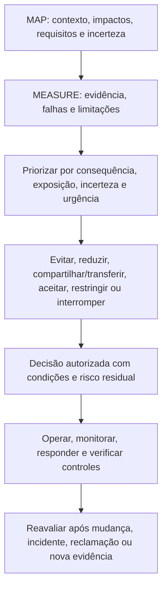
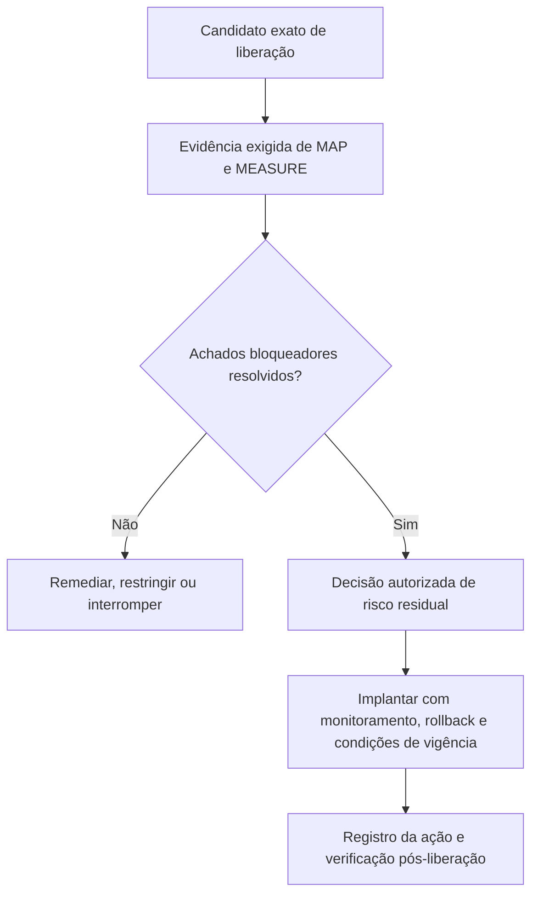
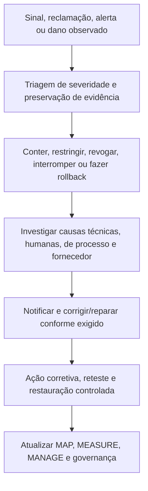

# Manual 03 — Implementação do NIST AI Risk Management Framework

## Rascunho controlado pt-BR — Parte 4: MANAGE, capítulos 25–32

**Linha de base controlada:** NIST AI RMF 1.0 / NIST AI 100-1

> **Aviso de controle:** Tradução semântica assistida para revisão humana. Preserva o significado operacional do mestre em inglês; não é uma tradução oficial do NIST.

# Guia de capítulos

| Capítulo | Tema |
|---:|---|
| 25 | Arquitetura de MANAGE e priorização de risco |
| 26 | Tratamento de risco, controles, responsabilidade e planos de ação |
| 27 | Decisões de risco residual, exceções e aceitação responsável |
| 28 | Implantação, liberação, restrição, interrupção, rollback e retirada |
| 29 | Monitoramento, drift, incidentes, reclamações, recursos e ação corretiva |
| 30 | Mudanças, fornecedores, IA generativa e sistemas agênticos |
| 31 | Métricas, asseguração, auditoria interna e melhoria contínua |
| 32 | Roteiros, maturidade, perfis e revisão do framework |

# 25. Arquitetura de MANAGE e priorização

MANAGE converte o contexto de MAP e a evidência de MEASURE em tratamento priorizado, decisões responsáveis, controles operacionais e melhoria.

**Explicação acessível:** A gestão combina contexto e evidência, prioriza o risco, seleciona o tratamento e registra uma decisão autorizada. A operação verifica controles e qualquer sinal material aciona nova avaliação.

A priorização deve preservar consequência, reversibilidade, população afetada, exposição, incerteza, qualidade da evidência, força dos controles, urgência e risco de concentração.

# 26. Tratamento, controles e planos de ação

Opções de tratamento: **evitar**, **reduzir**, **compartilhar/transferir**, **aceitar**, **pilotar/restringir** ou **interromper/rollback**.

Cada controle deve registrar cenário, objetivo, atividade, responsável, gatilho/frequência, evidência, limiar, dependência, limitação, teste e risco residual.

Prefira controles que eliminem ou reduzam o risco na origem antes de depender somente de treinamento ou avisos. Cada remediação precisa de responsável, prazo, severidade, critérios de aceitação, evidência e teste de eficácia.

# 27. Risco residual, exceções e aceitação

A aceitação de risco residual deve identificar sistema/versão, escopo, população, riscos, benefícios, evidências revisadas, incertezas, controles, falhas, autoridade, decisão, vigência, gatilhos e divergências materiais.

Exceções devem ser estreitas, temporárias, autorizadas, explícitas sobre o requisito não atendido, acompanhadas de controles compensatórios e visíveis para asseguração.

Devolva uma decisão se a evidência estiver ausente, vencida, incompatível com a versão ou invalidada por mudança material.

# 28. Implantação, liberação, restrição, interrupção e retirada

A liberação é uma decisão de risco para uma configuração exata.

O pacote mínimo inclui propósito aprovado, nível de risco, versões, avaliações, revisões aplicáveis, evidência de fornecedor, instruções, monitoramento, capacidade de interrupção/rollback, achados em aberto e aprovação de risco residual.

Defina gatilhos objetivos para parar ou reverter: dano grave, comprometimento de segurança, exposição de dados, degradação material, perda de supervisão humana, evidência inválida, mudança não aprovada do fornecedor ou proibição legal/contratual.

A retirada deve cobrir dados, credenciais, integrações, comunicações, contratos, arquivos e confirmação de que o sistema não atua mais.

# 29. Monitoramento, drift, incidentes e ações corretivas

Para cada medida operacional documente pergunta, fonte, população, versão, cálculo, linha de base, limiar, responsável, frequência, ação e limitações.

Diferencie drift de dados, população, conceito/relação, comportamento do modelo, fluxo de trabalho, usuários e ambiente.

Reclamações e recursos são evidência de risco. A ação corretiva deve separar correção imediata de causa raiz e verificar eficácia antes do encerramento.

# 30. Mudanças, fornecedores, IA generativa e sistemas agênticos

Revise mudanças de propósito, população, geografia, idioma, dados, modelo, fornecedor, prompts, ferramentas, autonomia, interface, supervisão, monitoramento e requisitos aplicáveis.

Classifique a mudança como não material, material com revisão limitada ou material exigindo reavaliação completa.

Quando IA generativa estiver em escopo, use NIST AI 600-1 como perfil complementar e avalie confabulação, conteúdo nocivo, privacidade, propriedade intelectual, integridade da informação, segurança, dependência humana, viés, abuso em escala e riscos da cadeia de valor.

Para agentes com ferramentas: identidade restrita, menor privilégio, allowlists, limites de transação/tempo, confirmação humana para ações consequenciais, isolamento, rastros completos, controles de memória, revogação determinística e rollback.

# 31. Métricas, asseguração, auditoria interna e melhoria

Use métricas ligadas a decisões: inventário com responsável e aprovação atual, evidência vinculada à versão implantada, falhas graves, exceções vencidas, incidentes/reclamações, limiares excedidos, mudanças de fornecedor e eficácia de remediações.

Teste **eficácia de desenho** e **eficácia operacional**. Auditoria interna deve definir escopo, critérios, competência, independência, amostragem, evidência, achados, acompanhamento e limites de asseguração.

Achados devem registrar critério, condição, evidência, impacto/risco, responsável, ação, prazo e teste de encerramento.

# 32. Roteiros, maturidade, perfis e revisão do framework

Comece com um mínimo controlado e aumente a profundidade conforme risco e complexidade.

**Rota Essential:** liderança, regras iniciais, inventário, classificação, contatos de incidente e modelos mínimos; depois contexto/avaliação, autoridade residual, fornecedor/mudança, monitoramento e remediação; finalmente reconciliação, testes de controle, métricas e revisão interna.

**Rota Structured:** adicione governança formal, gates de ciclo de vida, TEVV controlado, linhagem/versionamento, revisões especializadas, métricas operacionais e auditoria interna.

**Rota Enhanced:** adicione supervisão executiva, desafio independente, testes adversariais e de cenários, monitoramento contínuo, análise de concentração, continuidade e aceitação de risco residual de maior nível.

Quando o NIST publicar revisão final do AI RMF, congele o candidato atual, verifique a publicação, compare mudanças, identifique capítulos/modelos/gráficos/traduções afetados, atualize primeiro o mestre em inglês, repita revisão semântica e regenere artefatos. Não substitua silenciosamente uma linha de base publicada.

**Checkpoint Parte 4:** capítulos 25–32 completam o ciclo operacional e conectam tratamento, liberação, operação, melhoria e futuras revisões do framework.