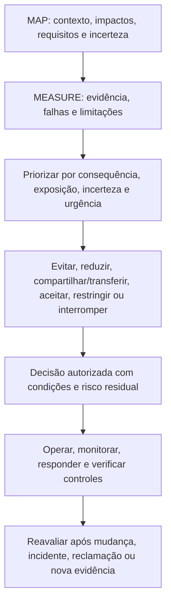
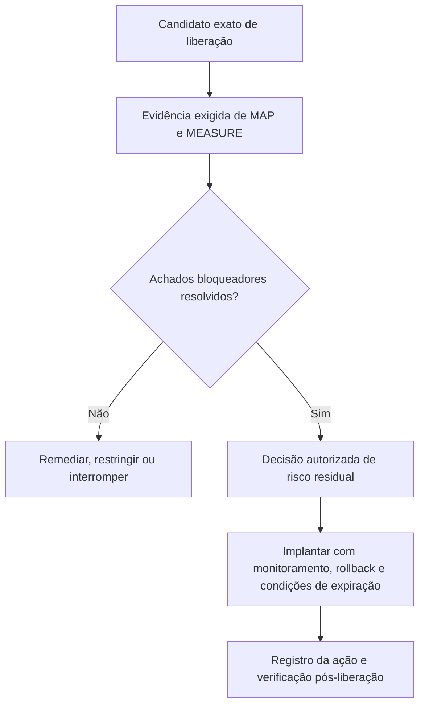
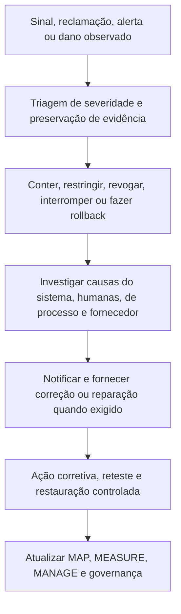

# Manual 03 — Implementação do NIST AI Risk Management Framework

## Fonte controlada pt-BR — Parte 4: MANAGE, capítulos 25–32

**Linha de base controlada:** NIST AI RMF 1.0 / NIST AI 100-1

**Limite de fonte:** Orientação prática original de implementação. O NIST AI RMF é orientação voluntária e não substitui lei vinculante, contrato, política, obrigações setoriais, critérios de certificação nem julgamento profissional. O AI RMF 1.0 está sendo revisado, portanto esta fonte vinculada à versão exige análise de impacto após uma nova publicação final do NIST.

> **Aviso de controle:** Localização semântica assistida a partir do mestre controlado em inglês. Preserva estrutura, limites de asseguração e significado operacional; não é uma tradução oficial do NIST.

# Guia de capítulos

| Capítulo | Tema |
|---:|---|
| 25 | Arquitetura da função MANAGE e priorização de risco |
| 26 | Tratamento de risco, controles, responsabilidade e planejamento de ações |
| 27 | Decisões de risco residual, exceções e aceitação responsável |
| 28 | Implantação, liberação, restrição, interrupção, rollback e retirada |
| 29 | Monitoramento, deriva, incidentes, reclamações, recursos e ação corretiva |
| 30 | Mudanças, fornecedores, IA generativa e governança de sistemas agênticos |
| 31 | Métricas, asseguração, auditoria interna e melhoria contínua |
| 32 | Roteiros de implementação, maturidade, perfis e revisão do framework |

# 25. Arquitetura da função MANAGE e priorização de risco

*MANAGE converte o contexto mapeado e a evidência medida em tratamento priorizado, decisões responsáveis, controles operacionais e melhoria.*

**Explicação acessível:** A gestão combina o contexto de MAP com a evidência de MEASURE, prioriza o risco, seleciona o tratamento e registra uma decisão autorizada com condições e risco residual. A operação monitora e verifica controles. Mudanças e sinais do mundo real acionam nova avaliação.

## 25.1 Registro de priorização

Priorize usando mais que uma pontuação genérica. Registre:

- consequência plausível e reversibilidade;
- população afetada, vulnerabilidade e escala;
- exposição, frequência e duração;
- probabilidade quando houver suporte;
- incerteza e qualidade da evidência;
- força do controle e detectabilidade;
- urgência, incluindo incidentes ativos ou prazos legais;
- risco de modo comum ou concentração;
- compensações entre oportunidade e benefício; e
- dependências entre riscos.

Alta incerteza pode justificar controles mais fortes ou um piloto mais restrito mesmo quando a probabilidade for desconhecida.

## 25.2 Visão de portfólio

Agregue riscos de IA entre sistemas sem perder responsabilização no nível do sistema. A gestão deve identificar:

- múltiplos usos dependentes do mesmo modelo/provedor;
- falhas repetidas de controles;
- efeitos cumulativos sobre a mesma população;
- capacidade escassa de supervisão ou validação;
- risco correlacionado de cibersegurança, privacidade ou operação;
- exceções e decisões de risco residual próximas da expiração; e
- sistemas cuja autonomia ou escala combinada exceda premissas originais.

## 25.3 Cadência de decisão

Use revisão orientada por eventos além de calendários. Revise a prioridade quando surgir mudança material, incidente, reclamação, falha de avaliação, aviso de fornecedor, desenvolvimento jurídico, mudança de tolerância ao risco ou nova população afetada.

# 26. Tratamento de risco, controles, responsabilidade e planejamento de ações

*O tratamento deve alterar exposição real, comportamento ou capacidade de recuperação, não apenas criar documentação.*

## 26.1 Opções de tratamento

- **Evitar:** não iniciar, remover uma função ou retirar o uso.
- **Reduzir:** alterar propósito, projeto, dados, modelo, autonomia, população, processo ou controles.
- **Compartilhar/transferir:** alocar obrigações definidas por contrato ou seguro, mantendo a responsabilização não transferível.
- **Aceitar:** autorizar risco residual dentro de autoridade e condições documentadas.
- **Pilotar/restringir:** limitar geografia, população, usuários, dados, autonomia, duração ou volume para reunir evidências com segurança.
- **Interromper/rollback:** suspender a operação ou retornar a um estado seguro conhecido.

## 26.2 Registro de desenho de controle

| Campo | Conteúdo mínimo |
|---|---|
| Risco/cenário | Causa-evento-consequência mapeados e partes afetadas |
| Objetivo | Exposição, falha ou consequência tratada pelo controle |
| Controle | Atividade preventiva, detectiva, corretiva ou de recuperação |
| Proprietário/operador | Proprietário responsável e pessoa/sistema que o executa |
| Gatilho/frequência | Contínuo, por transação, liberação, periódico ou orientado por evento |
| Evidência | Registro que comprova desenho e operação |
| Limiar | Condição que provoca ação ou escalonamento |
| Dependência | Dados, ferramenta, fornecedor, revisor ou infraestrutura necessária |
| Limitação | Lacuna ou modo de falha conhecido |
| Teste | Como eficácia de desenho e operacional são avaliadas |
| Risco residual | O que permanece após o controle |

## 26.3 Hierarquia de controles

Prefira controles que removam ou restrinjam o risco na origem antes de depender apenas de usuários para detectar erros. Conforme o contexto:

1. eliminar o uso ou capacidade perigosa;
2. reduzir escopo, autonomia, dados ou acesso;
3. redesenhar arquitetura, modelo, fluxo de trabalho ou interface;
4. implementar controles técnicos e de processo;
5. adicionar supervisão humana competente e verificação independente;
6. adicionar avisos, instruções e treinamento; e
7. monitorar, responder e fornecer reparação.

Treinamento e disclaimers raramente são controles suficientes para comportamento de sistemas de alta consequência.

## 26.4 Plano de ação

Todo item de remediação deve ter responsável, data de vencimento, severidade, dependência, critérios de aceitação, evidência, método de reteste e caminho de escalonamento. Uma data de vencimento não reduz o risco atual; restrições provisórias podem ser necessárias até a remediação ser verificada.

# 27. Decisões de risco residual, exceções e aceitação responsável

*Risco residual é uma decisão sobre a exposição restante após evidências e controles, não um rótulo gerado por ferramenta de pontuação.*

## 27.1 Registro de aceitação

Registre:

- sistema/uso e versão exatos;
- escopo da decisão, população, geografia e duração;
- riscos, benefícios e partes afetadas relevantes;
- evidências revisadas e incerteza não resolvida;
- controles e condições operacionais;
- itens falhos, inconclusivos ou não testados;
- justificativa de risco residual;
- autoridade de decisão e competência;
- aprovação, aprovação condicional, restrição ou rejeição;
- expiração e data de revisão;
- gatilhos automáticos de reavaliação/interrupção; e
- divergência ou visão minoritária.

## 27.2 Níveis de autoridade

Alinhe a autoridade de aceitação à consequência. Risco baixo e delimitado pode ser aceito pelo proprietário responsável dentro da política. Risco moderado pode exigir aprovação multifuncional. Risco de alta consequência, regulado, sensível a safety ou de portfólio pode exigir autoridade executiva ou designada pelo conselho e desafio independente.

Ninguém deve aceitar risco em nome das partes afetadas apenas porque a organização se beneficia. Obrigações legais e não transferíveis permanecem vinculantes.

## 27.3 Exceções

Uma exceção deve ser:

- estreita e limitada no tempo;
- aprovada por pessoas autorizadas;
- explícita sobre o requisito não atendido;
- apoiada por análise de risco;
- acompanhada de controles compensatórios ou restrições;
- monitorada;
- visível às funções de asseguração; e
- expirada automaticamente, salvo renovação por nova decisão.

## 27.4 Verificação da qualidade da decisão

Rejeite ou devolva uma decisão se a evidência estiver ausente, incompatível com a versão, expirada, invalidada por mudança material, internamente inconsistente ou incapaz de sustentar o contexto alegado. “Urgência do negócio” deve ser registrada como fator, não usada para apagar risco.

# 28. Implantação, liberação, restrição, interrupção, rollback e retirada

*A liberação é uma decisão de risco baseada em evidências para uma configuração exata, não o fim da gestão de riscos.*

## 28.1 Gate de liberação

**Explicação acessível:** O gate de liberação identifica o candidato exato e as evidências exigidas. Achados bloqueadores levam a remediação, restrição ou interrupção. Quando a evidência sustenta a decisão, uma pessoa autorizada aceita o risco residual e a implantação ocorre com condições de monitoramento e rollback. A liberação e o acompanhamento ficam registrados.

## 28.2 Evidência mínima de liberação

- propósito e contexto aprovados;
- nível de risco atual;
- versões exatas de modelo, dados, prompt/configuração, software e dependências;
- resultados de avaliação exigidos e limitações;
- revisões de cibersegurança, privacidade, safety, acessibilidade e domínio conforme aplicável;
- evidência do fornecedor e condições contratuais;
- instruções ao usuário e à supervisão;
- preparação para monitoramento e incidentes;
- teste de interrupção, rollback, fallback e recuperação;
- achados não resolvidos e condições aceitas;
- aprovação de risco residual; e
- registro de liberação e identificadores de checksum/versão.

## 28.3 Implantação progressiva

Use liberação em estágios ou canary, populações limitadas, autonomia menor, limites de taxa, gates de aprovação, processo humano paralelo ou avaliação shadow quando isso reduzir a incerteza sem expor pessoas a risco inaceitável.

## 28.4 Interrupção e rollback

Defina gatilhos objetivos, autoridade e capacidade técnica. Exemplos:

- dano grave ou dano iminente crível;
- comprometimento de segurança ou exposição de dados sensíveis;
- degradação material de desempenho ou de subgrupos;
- saídas prejudiciais ou proibidas repetidas;
- perda de supervisão humana exigida;
- evidência exigida inválida ou ausente;
- mudança não aprovada de fornecedor/modelo;
- falha de monitoramento ou logging de um controle crítico; e
- proibição legal ou contratual vinculante.

Teste interrupção e rollback antes de depender deles. Confirme revogação de identidade, ações em fila, reconciliação downstream, comunicações e validação de restauração.

## 28.5 Retirada

A retirada deve tratar retenção/exclusão de dados e registros, acesso a modelo e credenciais, integrações, comunicação aos usuários, encerramento de fornecedor, decisões pendentes, legal hold, transferência de conhecimento, arquivamento, encerramento do monitoramento e confirmação de que o sistema não atua mais.

# 29. Monitoramento, deriva, incidentes, reclamações, recursos e ação corretiva

*Evidência operacional determina se premissas e controles permanecem válidos após a liberação.*

## 29.1 Desenho de monitoramento

Para cada medida, defina:

- pergunta e risco tratado;
- fonte de dados e limite de privacidade;
- população e versão;
- cálculo ou rubrica;
- linha de base e limiar;
- proprietário e revisor;
- frequência ou latência;
- ação quando o limiar for excedido;
- limitação de falso positivo/falso negativo; e
- retenção de evidência.

Monitore comportamento do sistema, interação humana, controles, resultados que afetam pessoas, mudanças de fornecedores e o próprio sistema de monitoramento.

## 29.2 Deriva e degradação

Diferencie mudanças em dados de entrada, população, conceito/relação, comportamento do modelo, fluxo de trabalho, usuários, ambiente e resultado. Uma métrica pode permanecer estável enquanto a consequência muda; combine sinais quantitativos com incidentes, reclamações, overrides e revisão de domínio.

## 29.3 Processo de incidentes

**Explicação acessível:** Um incidente começa com sinal ou reclamação, seguido de triagem e preservação de evidências. A organização contém o problema, investiga causas técnicas e organizacionais, fornece notificação ou reparação exigida, verifica ação corretiva e atualiza todo o ciclo de gestão de riscos.

## 29.4 Reclamações, recursos e reparação

Trate reclamações como evidência de risco, não apenas tickets de atendimento. Vincule-as à versão e ao contexto do sistema, proteja reclamantes, ofereça canais acessíveis, impeça retaliação, defina níveis de serviço, permita revisão humana competente e acompanhe padrões repetidos.

## 29.5 Ação corretiva

Separe correção imediata de ação corretiva de causa raiz. Registre:

- problema e consequência;
- contenção/correção;
- análise de causa em tecnologia, pessoas, processo e governança;
- extensão sistêmica;
- responsável pela ação e prazo;
- verificação de implementação;
- reteste de eficácia;
- monitoramento de recorrência; e
- atualizações de sistemas relacionados, políticas, treinamento e controles de fornecedores.

# 30. Mudanças, fornecedores, IA generativa e governança de sistemas agênticos

*Mudança material invalida premissas e evidências afetadas até que o impacto seja avaliado.*

## 30.1 Classes de mudança

Revise mudanças em:

- propósito ou limite de uso proibido;
- população, geografia, idioma ou escala;
- fonte de dados, característica, retenção ou transformação;
- modelo, fornecedor, versão, fine-tuning ou prompt;
- software, ferramenta, integração ou permissão;
- autonomia ou ação downstream;
- interface, aviso ou supervisão humana;
- fornecedor/subprocessador e contrato;
- monitoramento e logging; e
- requisito aplicável ou tolerância ao risco.

Classifique mudanças como não materiais, materiais com revisão delimitada ou materiais que exigem reavaliação completa. Preserve justificativa e revisor.

## 30.2 Controle de mudanças de fornecedor

Exija notificação quando viável, mas assuma que fornecedores podem alterar comportamento sem aviso completo. Use fixação de versão, testes de regressão, monitoramento, direitos contratuais, atualização de evidências, fallback e planejamento de saída proporcional à dependência.

## 30.3 Integração do perfil de IA generativa

Quando IA generativa estiver no escopo, aplique NIST AI 600-1 como perfil complementar ao processo geral do AI RMF. Avalie famílias de risco GenAI e ações de perfil aplicáveis sem tratar toda ação como universalmente exigida.

No mínimo, considere:

- confabulação e conteúdo sem suporte;
- conteúdo perigoso, odioso ou abusivo;
- preocupações de privacidade de dados e propriedade intelectual;
- integridade e proveniência da informação;
- cibersegurança e ataques a prompts/ferramentas;
- dependência humana excessiva e efeitos emocionais ou sociais;
- viés prejudicial e homogeneização;
- habilitação de uso indevido e abuso em escala;
- efeitos ambientais e de recursos quando materiais;
- risco da cadeia de valor e integração de componentes; e
- limitações de avaliação.

O Manual 04 fornece implementação mais profunda do NIST AI 600-1.

## 30.4 Sistemas agênticos

Para agentes autônomos ou que usam ferramentas, implemente e teste:

- identidades restritas e privilégio mínimo;
- allowlists de ferramentas e ações proibidas;
- limites de transação, tempo, taxa e recursos;
- confirmação humana para ações consequenciais;
- limites de confiança de entrada/conteúdo;
- isolamento de ambiente;
- rastros completos de ações;
- controles de memória e retenção;
- revogação determinística e parada de emergência;
- rollback e reconciliação downstream; e
- responsabilidade explícita por decisões delegadas.

# 31. Métricas, asseguração, auditoria interna e melhoria contínua

*Asseguração pergunta se governança e controles estão desenhados e operando eficazmente; não certifica que o risco foi eliminado.*

## 31.1 Métricas de gestão

Use medidas vinculadas a decisões, como:

- usos ativos de IA com proprietário, nível e aprovação atuais;
- sistemas materiais vinculados a evidência de avaliação da versão implantada;
- falhas de alta severidade e idade de remediação;
- exceções e decisões de risco residual expiradas;
- incidentes, reclamações, recursos, overrides e recorrência;
- violações de limiar e tempo de resposta;
- evidência de fornecedor e mudanças não revisadas;
- retestes de eficácia de ação corretiva; e
- sistemas restritos, interrompidos ou redesenhados porque a evidência era inadequada.

Evite recompensar volume de documentos ou suprimir relato de incidentes.

## 31.2 Asseguração de controles

Teste ambos:

- **eficácia de desenho:** o controle, se operado conforme desenhado, trata o risco no contexto; e
- **eficácia operacional:** o controle realmente operou para a população e período exigidos, produziu evidência, detectou exceções e causou a ação necessária.

## 31.3 Auditoria interna

Um programa de auditoria deve definir escopo baseado em risco, critérios, competência, independência, amostragem, evidência, achados, reporte e acompanhamento. Auditores não devem auditar o próprio trabalho sem salvaguardas. Preserve a distinção entre auditoria interna, avaliação técnica, revisão de compliance, certificação e exame regulatório.

## 31.4 Classificação de achados

Classifique achados com base em consequência, extensão sistêmica, falha de controle, recorrência, evidência e urgência. Todo achado deve identificar critério, condição, evidência, impacto/risco, responsável, ação, prazo e teste de encerramento.

## 31.5 Ciclo de aprendizagem

Use incidentes, near misses, reclamações, auditorias, eventos de fornecedores e controles bem-sucedidos para atualizar inventário, critérios de risco, cenários, métodos de avaliação, limiares, treinamento, padrões de projeto e decisões de portfólio.

# 32. Roteiros de implementação, maturidade, perfis e revisão do framework

*Organizações devem começar com um mínimo controlado e adicionar profundidade quando risco, complexidade e evidência exigirem.*

## 32.1 Roteiro Essential

### Primeiros 30 dias

- designar liderança responsável por risco de IA;
- emitir regras provisórias de usos aprovados/proibidos;
- iniciar descoberta e inventário de IA;
- definir método simples de roteamento de risco;
- identificar usos materiais existentes;
- estabelecer contatos para incidentes e interrupção; e
- selecionar pequeno conjunto de modelos de evidência.

### Dias 31–90

- concluir contexto e avaliação mínima para usos materiais;
- atribuir autoridade de risco residual;
- implementar verificações de fornecedores e mudanças;
- documentar instruções de usuário/supervisão;
- definir limiares de monitoramento; e
- remediar ou restringir usos sem evidência sustentável.

### Meses 4–12

- reconciliar o inventário periodicamente;
- testar controles e ações corretivas;
- melhorar tratamento de incidentes/reclamações;
- construir métricas de gestão;
- executar revisão interna baseada em risco; e
- atualizar o perfil-alvo.

## 32.2 Roteiro Structured

Adicione governança formal, gates multifuncionais do ciclo de vida, TEVV controlado, versão/linhagem, evidência de fornecedor, revisão de privacidade/cibersegurança/acessibilidade/domínio, métricas operacionais, revisão periódica de gestão, auditoria interna e retenção controlada de evidências.

## 32.3 Roteiro Enhanced

Adicione supervisão executiva/do conselho, validação independente, engajamento de partes afetadas, avaliação adversarial e de estresse, monitoramento contínuo de riscos-chave, interrupção/rollback ensaiados, análise de concentração do portfólio, vigilância reforçada de fornecedores e expiração formal de risco residual.

## 32.4 Modelo de maturidade

| Nível | Estado observável |
|---|---|
| 0 — Não controlado | Uso de IA é desconhecido ou não gerenciado; responsabilidade e evidência estão ausentes |
| 1 — Inicial | Existem inventário básico, política, responsável e revisão caso a caso |
| 2 — Repetível | Roteamento de risco, gates do ciclo de vida, avaliação e evidência são usados consistentemente |
| 3 — Medido | Métricas operacionais, testes de controles, revisão de fornecedores/mudanças e decisões de gestão estão vinculados |
| 4 — Adaptativo | Incidentes, evidência de partes afetadas, risco de portfólio e asseguração impulsionam sistematicamente a melhoria |

Maturidade não é certificação. Um processo de Nível 4 ainda pode tomar uma decisão ruim sobre um sistema, e uma organização pequena pode operar controles fortes sem burocracia elaborada.

## 32.5 Perfis atual e alvo

Crie um perfil atual descrevendo resultados e evidências reais e um perfil-alvo descrevendo resultados desejados com base em risco e obrigações. O plano de lacunas deve identificar prioridade, responsável, recursos, dependências, data, evidência e restrição provisória.

## 32.6 Protocolo de revisão do framework

Quando o NIST publicar um AI RMF revisado:

1. congele o candidato de liberação atual do Manual 03;
2. verifique a publicação oficial final e a versão;
3. compare funções, categorias, subcategorias, terminologia e orientação;
4. classifique impactos em capítulos, modelos, gráficos, perfis e crosswalks;
5. atualize primeiro a fonte controlada em inglês;
6. reabra revisões de fonte e técnicas afetadas;
7. relocalize o significado alterado por meio de localização controlada revisada por humanos;
8. regenere artefatos DOCX/PDF e repita QA de acessibilidade, visual e segurança; e
9. publique registro de mudança versionado sem sobrescrever silenciosamente a linha de base anterior.

## 32.7 Limite final de implementação

Implementar este manual pode fortalecer governança de risco e evidências. Não demonstra que um sistema de IA é confiável, não elimina dano, não satisfaz todas as leis, não estabelece conformidade com ISO/IEC 42001, não cria certificação nem constitui opinião de auditoria. A organização permanece responsável pelo sistema real, contexto, obrigações, decisões e efeitos.

**Checkpoint Parte 4:** Os capítulos 25–32 concluem o ciclo operacional GOVERN–MAP–MEASURE–MANAGE e o conectam a implantação, operações, incidentes, asseguração, roteiros e revisão controlada do framework.
