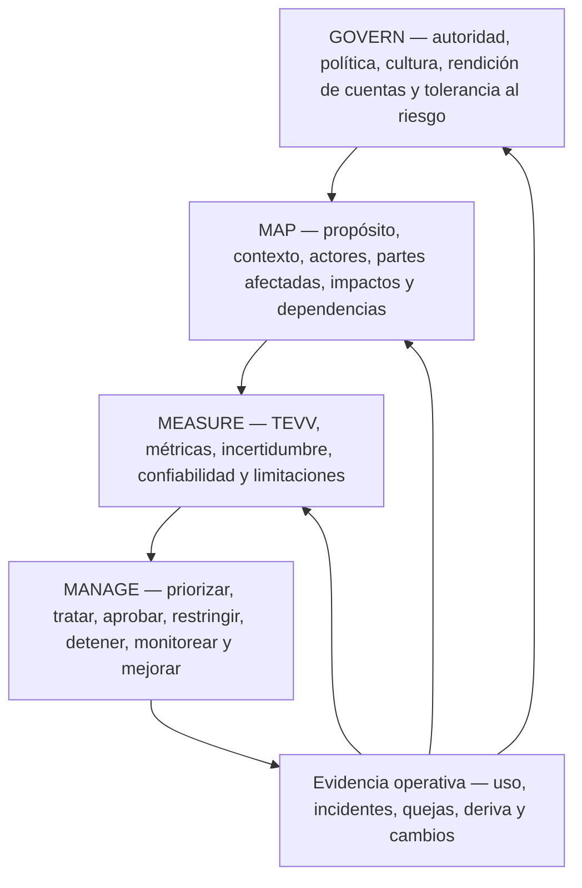
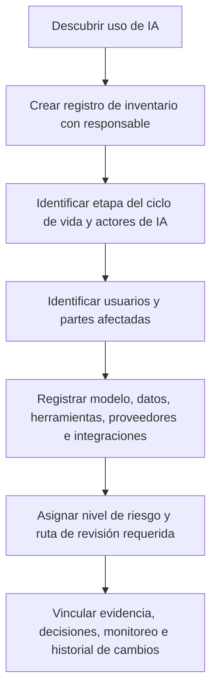
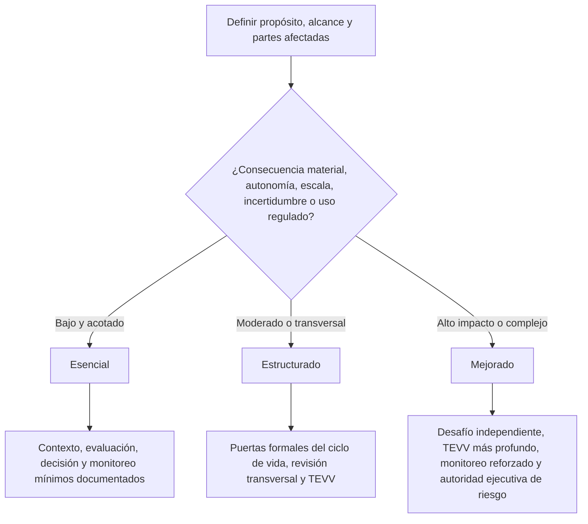

# Manual 03 — Implementación del Marco de Gestión de Riesgos de IA de NIST

## Fuente controlada en español — Parte 1: Preliminares y capítulos 1–8

**Línea base actual:** NIST AI RMF 1.0 / NIST AI 100-1

**Estado de versión:** marco final publicado, actualmente en revisión por NIST al 25 de agosto de 2026

**Perfil complementario:** NIST AI 600-1 cuando la IA generativa esté dentro del alcance

**Autor y creador humano responsable:** Alberto “Al” Leiva

> **Aviso de desarrollo controlado:** Esta es orientación práctica original de implementación. NIST AI RMF es orientación voluntaria, no una norma de certificación. NIST indica que AI RMF 1.0 está siendo revisado. Este manual está vinculado a la línea base actualmente publicada y debe someterse a análisis de impacto cuando se publique una versión revisada.

# Prefacio

El Marco de Gestión de Riesgos de Inteligencia Artificial de NIST ayuda a las organizaciones a gestionar riesgos de IA durante el diseño, desarrollo, despliegue, uso, evaluación y retiro. Está diseñado para ser flexible y adaptarse a organizaciones de distintos tamaños, sectores y perfiles de riesgo.

Este manual convierte esa flexibilidad en pasos operativos prácticos sin transformar el marco en una lista de verificación falsa. Su objetivo es ayudar a gerentes, profesionales de GRC, especialistas de seguridad y privacidad, responsables de productos de IA, ingenieros, auditores y analistas a responder repetidamente cinco preguntas:

1. ¿Qué sistema o uso de IA estamos gobernando realmente?
2. ¿Quiénes y qué pueden verse afectados?
3. ¿Qué evidencia tenemos sobre beneficios, limitaciones, riesgo e incertidumbre?
4. ¿Quién tiene autoridad para aprobar, restringir, detener o retirar el uso?
5. ¿Cómo actualizan nuestras decisiones la operación, los incidentes, las quejas y los cambios?

El manual utiliza las cuatro funciones Core de NIST — GOVERN, MAP, MEASURE y MANAGE — como un ciclo operativo integrado. GOVERN es transversal. MAP establece el contexto. MEASURE produce evidencia. MANAGE convierte la evidencia en tratamiento priorizado y decisiones. La nueva información vuelve a modificar la gobernanza, el contexto, la medición o el tratamiento.

## Límite de fuentes y revisión

- `nist-ai-rmf-1-0`: línea base publicada actual de AI RMF 1.0; estado del repositorio `final-under-revision`.
- `nist-ai-600-1`: perfil final actual de IA generativa de NIST, utilizado cuando la IA generativa está dentro del alcance.
- El AI Resource Center de NIST indica que AI RMF 1.0 está siendo revisado.
- El Playbook actual está basado en AI RMF 1.0 y NIST indica que se actualizará después de la revisión del marco.
- Los borradores, notas conceptuales o perfiles en desarrollo no se tratan aquí como requisitos finales.

# Guía de capítulos

| Capítulo | Tema |
|---:|---|
| 1 | Propósito de NIST AI RMF, límite voluntario y modelo de implementación |
| 2 | Arquitectura de gestión de riesgos de IA y ciclo operativo de cuatro funciones |
| 3 | Inventario de IA, actores, propiedad y límites del ciclo de vida |
| 4 | Enrutamiento proporcional por riesgo y complejidad |
| 5 | Arquitectura de la función GOVERN |
| 6 | GOVERN: política, obligaciones legales, tolerancia al riesgo e inventario |
| 7 | GOVERN: rendición de cuentas, competencia, supervisión humana y desafío efectivo |
| 8 | GOVERN: cultura, participación, proveedores y resiliencia de terceros |

# 1. Propósito de NIST AI RMF, límite voluntario y modelo de implementación

*NIST AI RMF 1.0 es un marco voluntario y no sectorial para gestionar riesgos de IA y apoyar prácticas de IA confiables y responsables.*

## 1.1 Qué significa implementar

Implementar significa incorporar decisiones de riesgo al trabajo normal de la organización. Una implementación útil de AI RMF conecta:

- estrategia y tolerancia al riesgo;
- inventario y propiedad de IA;
- puertas de producto, adquisición y ciclo de vida;
- análisis de partes afectadas y grupos de interés;
- evaluación técnica y no técnica;
- gobernanza de datos, modelos, software, infraestructura y proveedores;
- ciberseguridad, privacidad, seguridad, calidad y resiliencia;
- instrucciones para usuarios y supervisión humana;
- monitoreo, quejas y respuesta a incidentes;
- aceptación y escalamiento del riesgo residual; y
- acción correctiva, aprendizaje y retiro.

## 1.2 Qué no significa implementar

- Completar todas las sugerencias del Playbook sin considerar el contexto.
- Tratar todos los sistemas de IA como si tuvieran el mismo riesgo.
- Suponer que una puntuación alta en un benchmark demuestra desempeño aceptable en el mundo real.
- Tratar una declaración de un proveedor como evidencia suficiente para el contexto del cliente.
- Tratar el uso de AI RMF como cumplimiento legal, certificación ISO/IEC 42001 u opinión de auditoría.
- Afirmar que un sistema es “confiable” porque existe un documento de gobernanza.

## 1.3 Una unidad práctica de rendición de cuentas

Utilice el **registro de sistema/uso de IA** como unidad mínima que conecta la gobernanza con la operación. Un registro puede cubrir un servicio o caso de uso estrechamente controlado, pero no agrupe usos no relacionados cuando sus partes afectadas, consecuencias de decisión, modelos, datos, configuraciones, proveedores o propietarios de riesgo difieran materialmente.

| Campo | Contenido mínimo |
|---|---|
| Identidad | Nombre del sistema/uso, ID único, responsable, proceso de negocio y estado del ciclo de vida |
| Propósito | Tarea prevista, función de decisión/contenido, usuarios y beneficio esperado |
| Alcance | Geografía, población, escala, autonomía y usos prohibidos |
| Tecnología | Modelo/servicio, versión, software, herramientas, infraestructura e integraciones |
| Datos | Entradas, salidas, datos sensibles, fuentes, retención y linaje principal |
| Partes | Actores de IA, usuarios, personas/grupos afectados, proveedores y revisores |
| Riesgo | Nivel, escenarios materiales, incertidumbre, tratamiento y autoridad sobre riesgo residual |
| Evidencia | Evaluación, aprobaciones, monitoreo, incidentes, quejas y cambios |

# 2. Arquitectura de gestión de riesgos de IA y ciclo operativo de cuatro funciones

*Las funciones Core deben reforzarse continuamente; no son cuatro casillas que se completan una sola vez.*

**Explicación accesible:** La gobernanza establece quién puede decidir y cómo se maneja el riesgo. MAP describe el contexto real y las personas o sistemas afectados. MEASURE crea evidencia mediante pruebas y otras evaluaciones. MANAGE utiliza la evidencia para tratar y aceptar o rechazar el riesgo. Los resultados operativos, incidentes, quejas y cambios retroalimentan las cuatro funciones.

## 2.1 La gobernanza es transversal

No aísle GOVERN como una actividad anual de comité. La gobernanza debe determinar:

- quién es responsable de cada uso de IA;
- cuándo deben participar especialistas legales, de privacidad, seguridad, safety, accesibilidad o dominio;
- qué nivel de esfuerzo de gestión de riesgos se requiere;
- quién puede aprobar el riesgo residual;
- qué evidencia se exige antes del despliegue;
- qué eventos requieren reevaluación; y
- cuándo un sistema debe restringirse, revertirse o retirarse.

## 2.2 Perfiles y adaptación

Una implementación práctica puede crear un perfil para un caso de uso, unidad de negocio o sector. La adaptación debe identificar:

- qué resultados de AI RMF importan más en el contexto;
- estado actual y estado objetivo deseado;
- tolerancia al riesgo y restricciones legales/contractuales;
- evidencia y métricas;
- expectativas de recursos e independencia; y
- acciones previstas con responsables y fechas.

La adaptación no debe utilizarse para ocultar riesgos conocidos de consecuencias elevadas ni para eliminar una obligación vinculante.

# 3. Inventario de IA, actores, propiedad y límites del ciclo de vida

*Una organización no puede gobernar una IA que no puede identificar, clasificar y asignar a personas responsables.*

**Explicación accesible:** El descubrimiento crea un registro de inventario. La organización identifica después quién desarrolla, suministra, opera, utiliza, supervisa y se ve afectado por la IA; registra dependencias técnicas y de proveedores; asigna una ruta de revisión proporcional; y vincula evidencia y decisiones durante el ciclo de vida.

## 3.1 Fuentes de descubrimiento

Reconcilie múltiples fuentes porque el autorreporte por sí solo no detecta toda la IA en la sombra:

- registros de compras y gastos;
- inventarios de nube y SaaS;
- uso y facturación de modelos/API;
- repositorios de software y dependencias de paquetes;
- registros de identidad y acceso;
- inventarios de extensiones de endpoint/navegador;
- catálogos de datos y plataformas de integración;
- arquitectura de productos y catálogos de servicios;
- registros de riesgo de proveedores;
- entrevistas y declaraciones de empleados; y
- monitoreo de seguridad cuando sea apropiado y legal.

## 3.2 Actores de IA

Documente los roles según la actividad real, no según el cargo. Las actividades comunes incluyen:

- gobernanza ejecutiva y de riesgos;
- puesta en servicio del sistema y propiedad del producto;
- adquisición, preparación y administración de datos;
- desarrollo, adaptación o configuración de modelos;
- ingeniería de software e infraestructura;
- prueba, evaluación, verificación y validación;
- despliegue y operaciones;
- supervisión humana y revisión de decisiones;
- soporte al usuario, quejas y reparación;
- revisión de seguridad, privacidad, legal, compliance y safety;
- gestión de proveedores y contratos; y
- aseguramiento/auditoría independiente.

Una persona puede desempeñar varios roles en una organización pequeña, pero deben identificarse los conflictos de interés y añadirse revisiones compensatorias para riesgos materiales.

## 3.3 Partes afectadas

Las personas afectadas pueden no usar nunca el sistema. Considere a quienes puedan ver influido su empleo, acceso, elegibilidad, seguridad, reputación, finanzas, privacidad, expresión, aprendizaje, salud, movilidad u otros intereses por el proceso habilitado por IA.

Registre:

- usuarios directos;
- sujetos de decisiones;
- personas representadas en los datos;
- observadores y grupos afectados indirectamente;
- clientes o trabajadores aguas abajo;
- comunidades o poblaciones afectadas a escala; y
- organizaciones o sistemas públicos que dependan de los resultados.

# 4. Enrutamiento proporcional por riesgo y complejidad

*La intensidad de recursos debe seguir las consecuencias plausibles, la incertidumbre y la complejidad, no únicamente el tamaño de la organización.*

**Explicación accesible:** La organización comienza con el contexto y las partes afectadas y luego considera consecuencias potenciales, autonomía, escala, incertidumbre y exposición regulatoria. Los usos de bajo riesgo y alcance limitado pueden utilizar una ruta Esencial. Los usos moderados requieren una ruta Estructurada. Los usos de alto impacto o complejos requieren una ruta Mejorada con mayor independencia y supervisión.

## 4.1 Factores de riesgo

Considere al menos:

- severidad y reversibilidad del daño plausible;
- cantidad y vulnerabilidad de personas afectadas;
- si el uso influye en decisiones de alto impacto;
- grado de automatización o autoridad de acción;
- exposición pública y potencial de abuso;
- sensibilidad y volumen de datos;
- opacidad del modelo y control del proveedor;
- novedad e incertidumbre;
- consecuencias de ciberseguridad y safety;
- complejidad geográfica/legal;
- capacidad para monitorear y corregir resultados; y
- riesgo de concentración o dependencia de modo común.

## 4.2 Registro de nivel

| Campo | Ejemplo de evidencia |
|---|---|
| Consecuencia inherente | Narrativa más dimensiones como safety, derechos, finanzas, seguridad u operaciones |
| Probabilidad/incertidumbre | Datos, juicio experto, incidentes análogos, supuestos y confianza |
| Exposición | Escala, frecuencia, duración, población y geografía |
| Autonomía | Asesoría, aprobada por humanos, ejecutada automáticamente o agéntica/con herramientas |
| Fortaleza del control | Controles existentes y limitaciones conocidas |
| Nivel/ruta | Esencial, Estructurada o Mejorada con justificación |
| Autoridad | Persona/comité autorizado para aprobar el nivel y el riesgo residual |
| Activador de revisión | Cambio, incidente, queja, deriva, actualización legal/del proveedor o revisión programada |

# 5. Arquitectura de la función GOVERN

*GOVERN hace sostenible la gestión del riesgo de IA mediante política, rendición de cuentas, cultura, participación, controles de proveedores y mecanismos de revisión.*

La función GOVERN de AI RMF 1.0 agrupa sus resultados en seis temas amplios. Para implementación, trátelos como:

1. infraestructura organizacional de políticas/procesos y tolerancia al riesgo;
2. rendición de cuentas, capacitación y autoridad de decisión;
3. capacidad interdisciplinaria y roles de supervisión humano-IA;
4. cultura consciente del riesgo, documentación de impactos, pruebas e intercambio de información;
5. participación externa e interna con retroalimentación significativa; y
6. gobernanza de terceros y cadena de suministro, incluida planificación de contingencia.

> **Precaución de revisión:** NIST ha indicado específicamente que parte de la terminología actual de AI RMF 1.0 está sujeta a revisión. Mantenga trazabilidad a nivel de identificador con la línea base controlada 1.0, pero no presente la redacción actual de categorías como texto futuro inmutable.

## 5.1 Jerarquía de evidencia de gobernanza

La evidencia más sólida avanza de intención a operación:

- **Intención:** política, estatuto, principios y tolerancia al riesgo.
- **Diseño:** proceso definido, roles, derechos de decisión, plantillas y controles.
- **Operación:** revisiones, aprobaciones, pruebas, acciones de proveedores y registros de incidentes completados.
- **Eficacia:** evidencia de que los controles cambian decisiones, reducen riesgo o detectan fallas.
- **Mejora:** causas corregidas, políticas/procesos actualizados y seguimiento verificado.

# 6. GOVERN: política, obligaciones legales, tolerancia al riesgo e inventario

*Las políticas deben conectar prioridades de riesgo de IA con decisiones repetibles en lugar de limitarse a repetir principios generales.*

## 6.1 Política de IA

Una política práctica debe definir:

- propósito y alcance;
- límites de uso aprobado/prohibido;
- rendición de cuentas y escalamiento;
- método de clasificación por riesgo;
- activadores de revisión legal/regulatoria/contractual;
- requisitos de datos y seguridad;
- expectativas mínimas de evaluación;
- expectativas de supervisión humana;
- controles de proveedores;
- obligaciones de monitoreo e incidentes;
- mantenimiento de registros; y
- excepciones y cumplimiento interno.

## 6.2 Registro de obligaciones

AI RMF es voluntario, pero los sistemas de IA pueden estar sujetos a obligaciones vinculantes. Mantenga un registro separado de obligaciones con:

| Campo | Contenido mínimo |
|---|---|
| Fuente | Ley, regulación, contrato, política, estándar o requisito del cliente |
| Jurisdicción | País/estado/sector/relación comercial |
| Aplicabilidad | Sistema/uso/datos/parte/proceso afectado |
| Requisito | Obligación práctica expresada en lenguaje organizacional |
| Responsable | Función/persona accountable |
| Evidencia | Control, registro, prueba o aprobación |
| Vigilancia de cambios | Monitor de fuente y frecuencia de revisión |

No etiquete una sugerencia voluntaria de NIST como ley. No declare cumplimiento legal únicamente porque exista un mapeo con un resultado de AI RMF.

## 6.3 Tolerancia al riesgo y esfuerzo

Defina qué decisiones pueden tomarse en cada nivel. Por ejemplo:

- aprobación del responsable para bajo riesgo dentro de criterios documentados;
- revisión transversal para riesgo moderado;
- aprobación ejecutiva/de comité para alto riesgo;
- escalamiento obligatorio para usos prohibidos o legalmente restringidos;
- desafío independiente para sistemas de altas consecuencias; y
- autoridad de parada cuando fallen controles críticos.

El esfuerzo de gestión de riesgos debe dimensionarse según la prioridad del riesgo.

## 6.4 Inventario como control de gobernanza

El inventario debe reconciliarse periódicamente y después de adquisiciones, despliegues o cambios materiales. Un inventario desactualizado es una falla de gobernanza porque los procesos posteriores de riesgo dependen de una población completa.

# 7. GOVERN: rendición de cuentas, competencia, supervisión humana y desafío efectivo

*La responsabilidad debe ser suficientemente explícita para que una decisión material de IA pueda rastrearse hasta personas con autoridad y competencia.*

## 7.1 Modelo de responsabilidades

Como mínimo identifique:

- patrocinador ejecutivo;
- responsable de negocio/sistema;
- responsable técnico/modelo;
- responsable/administrador de datos;
- revisores de riesgo/compliance/legal/privacidad/seguridad/safety según corresponda;
- rol de supervisión humana;
- responsable de proveedor;
- responsable de incidente;
- aprobador del riesgo residual; y
- rol de aseguramiento independiente cuando sea necesario.

## 7.2 Competencia

La competencia depende del rol. La evidencia puede incluir educación, experiencia, práctica supervisada, capacitación, evaluación y productos de trabajo revisados. La evaluación de alto riesgo requiere competencia tanto en la tecnología como en el dominio donde se producen las consecuencias.

La capacitación debe cubrir decisiones reales que las personas toman, como:

- reconocer usos no aprobados de IA;
- manejar datos restringidos;
- interpretar confianza y limitaciones de modelos;
- verificar resultados;
- reconocer sesgo de automatización;
- escalar preocupaciones de safety/seguridad/privacidad;
- responder a incidentes; y
- utilizar procedimientos de parada o contingencia.

## 7.3 Supervisión humana

“Human in the loop” no es suficiente por sí solo. Documente:

- qué ve la persona;
- qué se espera que verifique;
- tiempo e información disponibles;
- autoridad para discrepar o detener;
- incentivos y carga de trabajo;
- competencia;
- registro de overrides; y
- evidencia de que la intervención es eficaz.

Un revisor que acepta automáticamente la salida de IA no constituye un control significativo.

## 7.4 Desafío efectivo

Para riesgos materiales, utilice un revisor o grupo capaz de cuestionar supuestos y con suficiente autoridad, independencia, experiencia y acceso a evidencia para influir en la decisión. En organizaciones pequeñas, la independencia puede escalarse mediante revisión entre pares, experiencia externa o separación de la aprobación respecto de la creación.

# 8. GOVERN: cultura, participación, proveedores y resiliencia de terceros

*La gestión del riesgo de IA depende de que la organización esté dispuesta a exponer fallas, escuchar perspectivas afectadas y controlar dependencias que no posee.*

## 8.1 Cultura consciente del riesgo

Las prácticas útiles incluyen:

- liderazgo que recompense el escalamiento de preocupaciones materiales;
- canales protegidos de reporte;
- pre-mortems y revisión de modos de falla;
- disenso documentado en decisiones de alto riesgo;
- red teaming o desafío adversarial cuando corresponda;
- aprendizaje a partir de incidentes y casi incidentes; y
- evitar incentivos de entrega que castiguen retrasos o decisiones de parada por razones de seguridad.

## 8.2 Participación y retroalimentación

La participación debe ser proporcional y significativa, no performativa. Defina:

- por qué se busca retroalimentación;
- qué perspectivas afectadas o expertas se necesitan;
- cómo se selecciona y protege a los participantes;
- necesidades de accesibilidad e idioma;
- cómo se registra y resuelve la retroalimentación;
- qué cambió como consecuencia de la retroalimentación; y
- cómo se escalan las preocupaciones no resueltas.

Según el contexto, la retroalimentación puede provenir de usuarios, personas afectadas, trabajadores, expertos de dominio, soporte al cliente, quejas, procesos de apelación, bases de datos de incidentes, reguladores, investigadores u organizaciones de la sociedad civil.

## 8.3 Gobernanza de proveedores y terceros

Las cadenas de suministro de IA pueden incluir modelos fundacionales, API, conjuntos de datos, componentes de código abierto, herramientas de evaluación, infraestructura de nube, servicios humanos de etiquetado, filtros de safety y plataformas de orquestación.

La evidencia mínima de proveedores debe cubrir:

- producto/modelo/servicio y versión exactos;
- uso previsto y restricciones contractuales;
- manejo de datos, retención y uso para entrenamiento;
- evidencia de seguridad y privacidad;
- evidencia de desempeño/evaluación y limitaciones;
- prácticas de notificación de cambios;
- subprocesadores/dependencias;
- notificación de incidentes/vulnerabilidades;
- continuidad, portabilidad y salida; y
- distribución de responsabilidades entre proveedor y cliente.

## 8.4 Planificación ante fallas de terceros

Para dependencias materiales, planifique para:

- caída del modelo/servicio;
- degradación material de calidad;
- actualización silenciosa del modelo;
- incidente de seguridad del proveedor;
- pérdida de API/funcionalidad;
- cambios en términos o prácticas de datos;
- salida del proveedor o discontinuación del servicio; e
- imposibilidad de obtener evidencia necesaria para continuar aceptando el riesgo.

La contingencia puede incluir proveedores alternativos, modo degradado seguro, proceso manual, limitación de tráfico, resultados aprobados en caché, deshabilitación de funciones o parada completa según el uso.

**Punto de control de la Parte 1:** Los capítulos 1–8 establecen conciencia de versión, inventario, enrutamiento proporcional y la base de gobernanza. La Parte 2 continúa con MAP y el análisis del contexto afectado.
