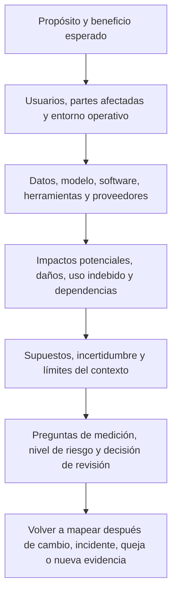
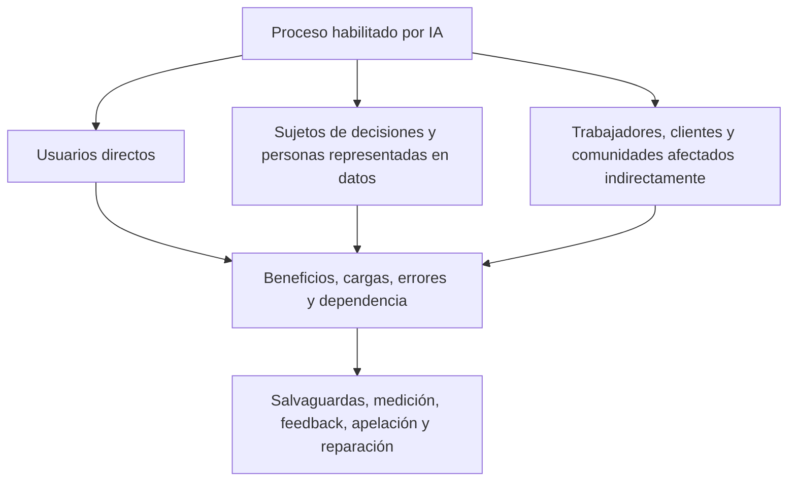
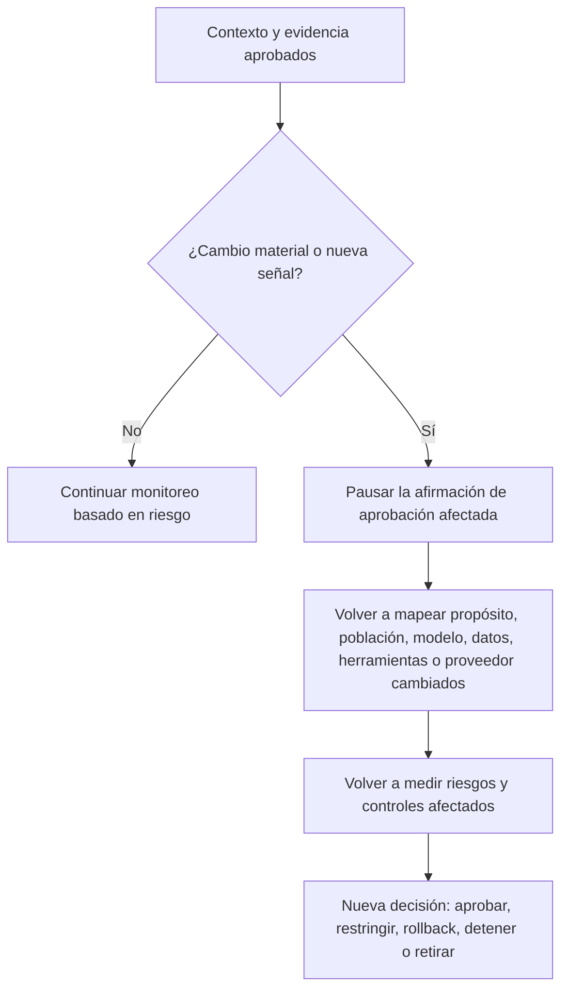

# Manual 03 — Implementación del Marco de Gestión de Riesgos de IA de NIST

## Fuente controlada en español — Parte 2: MAP, capítulos 9–16

**Línea base controlada:** NIST AI RMF 1.0 / NIST AI 100-1

**Límite de fuente:** Orientación práctica original de implementación. Resume y operacionaliza el marco actualmente publicado sin reproducir la publicación de NIST. AI RMF 1.0 está siendo revisado; los mapeos a nivel de identificador deben someterse a análisis de impacto cuando NIST publique un reemplazo.

# Guía de capítulos

| Capítulo | Tema |
|---:|---|
| 9 | Arquitectura de la función MAP y registro de contexto |
| 10 | Propósito previsto, alcance, actores y contexto del ciclo de vida |
| 11 | Partes afectadas, beneficios, impactos y daños |
| 12 | Dependencias de datos, modelos, software, infraestructura y proveedores |
| 13 | Escenarios de uso indebido, abuso, seguridad, privacidad, safety y resiliencia |
| 14 | Supuestos, incertidumbre, validez del contexto y activadores de cambio |
| 15 | Requisitos, estándares, expectativas de stakeholders y criterios de riesgo |
| 16 | Paquete de evidencia MAP, revisión y entrega a MEASURE |

# 9. Arquitectura de la función MAP y registro de contexto

*MAP establece suficiente contexto sociotécnico para identificar riesgos, beneficios, partes afectadas y necesidades de medición pertinentes.*

El mapeo no es un cuestionario de una sola vez. Es una descripción controlada del sistema según su intención, configuración, suministro y uso real. El registro debe ser lo bastante específico para que los revisores distingan entre despliegues, poblaciones, versiones de modelo o funciones de decisión diferentes.

**Explicación accesible:** El mapeo comienza con el propósito y beneficio esperado, luego documenta usuarios y partes afectadas, dependencias técnicas y de proveedores, impactos plausibles y uso indebido, y los principales supuestos. Estos hechos determinan las preguntas de medición y el nivel de riesgo. Cambios, incidentes, quejas y nueva evidencia obligan a volver a mapear el sistema.

## 9.1 Registro de contexto

Mantenga un registro controlado de contexto para cada sistema o uso de IA materialmente distinto. Debe vincularse al registro de inventario e incluir:

- propósito de negocio y beneficio esperado;
- límite del sistema y etapa del ciclo de vida;
- actores de IA, responsable accountable y autoridad de decisión;
- usuarios directos, sujetos de decisiones y partes afectadas indirectamente;
- entorno operativo, geografía, frecuencia, escala y duración;
- función de decisión o contenido y grado de autonomía;
- dependencias de datos, modelos, software, herramientas e infraestructura;
- terceros y límites contractuales;
- impactos positivos y negativos plausibles;
- escenarios razonables de uso indebido y falla;
- supuestos, incertidumbres y brechas de evidencia;
- requisitos aplicables y expectativas de stakeholders;
- nivel inicial de riesgo y justificación; y
- preguntas de medición, umbrales y activadores de revisión.

## 9.2 Criterios de calidad del contexto

Un registro de contexto está listo para revisión cuando es:

- **específico:** nombra el uso, población, versión y entorno reales;
- **trazable:** vincula afirmaciones con evidencia, responsables y fechas;
- **delimitado:** declara qué queda excluido y por qué;
- **plural:** considera perspectivas técnicas, humanas, organizacionales y sociales cuando sea pertinente;
- **cuestionable:** registra supuestos y disenso en lugar de presentar certeza inexistente;
- **actual:** refleja la configuración desplegada o propuesta; y
- **accionable:** genera preguntas medibles y decisiones de gestión.

Las descripciones genéricas de producto, marketing de proveedores, eslóganes de política y resúmenes de benchmark no cumplen por sí solos este estándar.

# 10. Propósito previsto, alcance, actores y contexto del ciclo de vida

*El riesgo no puede evaluarse sin definir qué se espera que haga la IA, dónde se utiliza y cómo interactúan las personas con ella.*

## 10.1 Declaración de propósito previsto

Escriba el propósito en lenguaje operativo:

> El sistema ayuda a **[usuarios identificados]** con **[tarea o decisión específica]** para **[población/entorno definido]** mediante **[salida/acción]**. Se espera que proporcione **[beneficio medible]**. No debe utilizarse para **[usos prohibidos o no validados]**.

Evite propósitos como “mejorar eficiencia” salvo que el registro defina proceso, usuario, salida, consecuencia y métrica.

## 10.2 Alcance y límites

Registre:

- unidades organizacionales y procesos;
- jurisdicciones e idiomas;
- poblaciones de usuarios y afectadas;
- canales, dispositivos y entornos;
- horarios de operación y volumen esperado de transacciones;
- integraciones y decisiones downstream;
- asesoría versus acción automática;
- puntos de revisión humana;
- versiones de datos y modelos;
- estado de piloto, producción o retiro; y
- usos y entornos excluidos.

Si un mismo modelo respalda distintas decisiones, poblaciones o niveles de autonomía, cree registros de uso vinculados en lugar de ocultar la variación de riesgo dentro de una sola entrada amplia de inventario.

## 10.3 Contexto del ciclo de vida

Identifique las etapas actuales y previstas:

1. concepto e intake;
2. diseño o adquisición;
3. preparación de datos y desarrollo/configuración del modelo;
4. integración y evaluación previa al despliegue;
5. piloto o liberación limitada;
6. uso en producción;
7. monitoreo y cambio;
8. suspensión, rollback o remediación; y
9. retiro y disposición controlada.

La evidencia disponible cambia según la etapa. El mapeo temprano depende más de supuestos, evidencia análoga y salvaguardas planificadas. El mapeo en producción debe incorporar desempeño observado, incidentes, quejas, overrides, drift y cambios de proveedores.

## 10.4 Mapeo actor-tarea

Mapee personas y organizaciones a tareas reales, autoridad y evidencia. Incluya proveedores externos cuando desarrollen, configuren, evalúen, hospeden o monitoreen parte del sistema.

| Actor/tarea | Actividad accountable | Evidencia requerida |
|---|---|---|
| Responsable de negocio | Define propósito, beneficio, proceso y riesgo residual aceptable | Caso de negocio, declaración de propósito, aprobaciones |
| Responsable de producto/sistema | Mantiene el registro del ciclo de vida y coordina gates | Inventario, contexto, registro de decisiones, historial de cambios |
| Roles de datos/modelo/ingeniería | Construyen, configuran y operan componentes técnicos | Linaje, registros de versión, diseño y evidencia de pruebas |
| Especialista de dominio | Prueba si el sistema funciona de forma segura en el dominio real | Revisión de escenarios, criterios de aceptación, limitaciones |
| Usuario de supervisión | Verifica o desafía resultados en operación | Instrucciones, competencia, evidencia de override y escalamiento |
| Revisores de riesgo/legal/privacidad/seguridad/safety | Aplican requisitos especializados y desafío de riesgo | Hallazgos, decisiones, condiciones y remediación |
| Responsable de proveedor | Controla evidencia del proveedor, contratos y cambios | Due diligence, cláusulas, avisos y plan de salida |
| Revisor de aseguramiento | Prueba independientemente diseño u operación cuando sea necesario | Alcance, workpapers, hallazgos y conclusión |

# 11. Partes afectadas, beneficios, impactos y daños

*La unidad de análisis relevante no es únicamente el usuario o cliente; incluye personas, grupos, organizaciones y sistemas influenciados por el proceso habilitado por IA.*

## 11.1 Mapa de partes afectadas

**Explicación accesible:** Un proceso habilitado por IA puede afectar a usuarios directos, personas que son objeto de decisiones o están representadas en datos y personas o comunidades afectadas indirectamente. El mapeo considera beneficios, cargas, errores y dependencia de cada grupo y luego determina salvaguardas, evaluación, feedback, apelación y necesidades de reparación.

## 11.2 Análisis de beneficios

Exprese los beneficios esperados como afirmaciones verificables. Considere:

- mejor acceso, calidad, oportunidad o consistencia;
- reducción de trabajo peligroso o repetitivo;
- mejor detección o apoyo a decisiones;
- personalización o accesibilidad;
- eficiencia de costos o recursos; y
- nuevas capacidades científicas, educativas, creativas u operativas.

Para cada beneficio material registre beneficiario, métrica, línea base, evidencia y posibles tradeoffs. Un ahorro proyectado para la organización no demuestra automáticamente un beneficio para las personas afectadas.

## 11.3 Escenarios de impacto y daño

Utilice declaraciones que conecten causa, evento y consecuencia:

> Debido a **[condición o debilidad]**, el sistema puede **[error, uso indebido o falla]** durante **[contexto]**, causando **[consecuencia]** a **[parte afectada]**. La detección puede ser difícil debido a **[limitación]**.

Considere:

- seguridad física o psicológica;
- derechos civiles, acceso, elegibilidad y debido proceso;
- consecuencias en empleo, educación, vivienda, crédito, seguros o salud;
- privacidad, vigilancia y autonomía;
- pérdida económica, fraude y manipulación;
- compromiso de seguridad y disrupción operativa;
- reputación, dignidad, expresión e integridad de la información;
- efectos ambientales o comunitarios cuando sean materiales;
- exclusión por diseño inaccesible o idioma; y
- efectos compuestos o acumulativos entre sistemas.

## 11.4 Severidad, exposición y reversibilidad

No comprima todas las dimensiones en una sola puntuación sin conservar la narrativa. Registre:

- severidad de la consecuencia plausible;
- frecuencia y duración de exposición;
- cantidad y vulnerabilidad de personas afectadas;
- reversibilidad y disponibilidad de reparación;
- capacidad de detección antes del daño;
- concentración y potencial de falla correlacionada;
- probabilidad cuando exista evidencia suficiente para estimarla; e
- incertidumbre y confianza.

## 11.5 Feedback y representación

Para impactos materiales, determine qué perspectiva falta. Los métodos pueden incluir entrevistas, investigación con usuarios, revisión de accesibilidad, consulta laboral, análisis de quejas, paneles de dominio, expertise de interés público, participación comunitaria o pruebas controladas con participantes representativos.

Documente cómo el feedback cambió el contexto, diseño, evaluación, restricciones o decisión. Si no puede obtenerse feedback, registre la limitación y medidas compensatorias.

# 12. Dependencias de datos, modelos, software, infraestructura y proveedores

*El riesgo de IA surge del sistema completo y de la cadena de suministro, no únicamente del modelo.*

## 12.1 Mapa de dependencias

Documente la cadena desplegada desde la fuente de entrada hasta la salida/acción:

- recopilación y validación de entradas;
- almacenes de datos, retrieval y transformaciones;
- modelo/proveedor y versión o endpoint exacto;
- prompts, instrucciones del sistema, fine-tuning o adaptadores;
- filtros de safety, motores de política y guardrails;
- orquestación, agentes, herramientas y permisos;
- software de aplicación e interfaz de usuario;
- controles de identidad, acceso, secretos y red;
- servicios de logging, monitoreo y evaluación;
- revisión humana y sistemas downstream; y
- dependencias de fallback, rollback y retiro.

## 12.2 Contexto de datos

Para cada dataset o flujo material de datos, registre:

- fuente, autoridad y propósito de recopilación;
- población y período representados;
- métodos de selección, etiquetado y transformación;
- calidad, completitud y brechas conocidas;
- datos sensibles o regulados;
- acceso, intercambio, retención y eliminación;
- procedencia y versión;
- representatividad para el contexto previsto;
- riesgo de contaminación, poisoning o leakage; y
- restricciones sobre entrenamiento, evaluación o uso secundario.

## 12.3 Contexto del modelo y servicio

Registre lo que la organización sabe y no sabe sobre:

- familia de modelo, versión y comportamiento ante cambios;
- información disponible sobre entrenamiento o adaptación;
- uso previsto y restringido;
- capacidades y limitaciones evaluadas;
- evidencia de seguridad, privacidad y safety;
- hosting regional y prácticas de datos;
- restricciones de disponibilidad, tasa, latencia y capacidad;
- subcontratistas y herramientas externas;
- notificación de actualizaciones y opciones de rollback; y
- portabilidad y salida.

La opacidad del proveedor es un factor de riesgo, no una prueba de seguridad o inseguridad. El cliente debe decidir si la evidencia disponible es suficiente para su propio uso y consecuencias.

## 12.4 Concentración y riesgo de modo común

Identifique si muchos procesos dependen del mismo modelo, dataset, nube, proveedor, método de evaluación o control de safety. Una actualización o caída de un solo proveedor puede generar fallas correlacionadas en aplicaciones que de otro modo serían separadas.

Para concentración material, defina límites, capacidad alternativa, operación degradada, fallback manual, comunicación y escalamiento ejecutivo.

# 13. Escenarios de uso indebido, abuso, seguridad, privacidad, safety y resiliencia

*MAP incluye uso razonablemente previsible y la interacción del sistema, no solo la operación prevista.*

## 13.1 Familias de escenarios

Considere, cuando sea pertinente:

- uso no autorizado o prohibido;
- automatización más allá de la autoridad aprobada;
- prompt injection, abuso de herramientas o permisos excesivos;
- entrada maliciosa, data poisoning o evasión;
- extracción de modelos, leakage de privacidad o salida sensible;
- integración insegura, exposición de secretos o compromiso de dependencias;
- contenido dañino, engañoso, ilegal o inseguro;
- exceso de confianza, automation bias y pérdida de habilidades humanas;
- salida inexacta, fabricada o inadecuada para el contexto;
- fallas por subgrupos o accesibilidad;
- denegación de servicio, agotamiento de capacidad o caída de proveedor;
- falla de monitoreo/logging;
- falla de rollback o parada; y
- abuso a escala o uso indebido coordinado.

## 13.2 Workpaper de casos de uso indebido

| Campo | Pregunta |
|---|---|
| Actor | ¿Quién podría utilizar indebidamente la capacidad, intencional o accidentalmente? |
| Acceso | ¿Qué acceso de identidad, datos, prompt, herramienta o integración está disponible? |
| Ruta | ¿Cómo podrían eludirse o manipularse los controles normales? |
| Consecuencia | ¿Qué podría ocurrir a personas, sistemas u organización? |
| Evidencia | ¿Qué incidentes, pruebas, threat intelligence o casos análogos respaldan el escenario? |
| Prevención | ¿Qué controles de autorización, diseño o proceso reducen la oportunidad? |
| Detección | ¿Qué señal identifica intento o uso indebido exitoso? |
| Respuesta | ¿Quién puede contener, revocar, hacer rollback, notificar y recuperar? |
| Riesgo residual | ¿Qué queda y quién puede aceptarlo? |

## 13.3 IA agéntica y con uso de herramientas

Cuando la IA pueda llamar herramientas o ejecutar transacciones, mapee:

- herramientas permitidas y bloqueadas;
- límites de identidad y credenciales;
- permisos de lectura, escritura, aprobación y ejecución;
- límites de transacción, tiempo y recursos;
- requisitos de confirmación;
- aislamiento del entorno;
- memoria y contexto retenido;
- límites de confianza de entrada/salida;
- monitoreo y trazas completas de acciones;
- revisión humana compensatoria; y
- parada de emergencia y revocación deterministas.

# 14. Supuestos, incertidumbre, validez del contexto y activadores de cambio

*Un registro de riesgo que oculta incertidumbre genera falsa confianza y debilita decisiones posteriores.*

## 14.1 Registro de supuestos

Para cada supuesto material, registre:

- declaración;
- responsable;
- fundamento o evidencia;
- confianza;
- consecuencia si resulta falso;
- método de validación y fecha objetivo;
- controles vinculados; y
- evento que lo invalida.

Ejemplos incluyen competencia esperada del usuario, comportamiento estable del proveedor, datos de evaluación representativos, tiempo suficiente para revisión humana, logging confiable o escala limitada de despliegue.

## 14.2 Tipos de incertidumbre

Distinga incertidumbre causada por:

- evidencia insuficiente o de baja calidad;
- poblaciones o entornos cambiantes;
- no determinismo del modelo;
- opacidad del proveedor;
- modos de falla raros o emergentes;
- limitaciones de medición;
- desacuerdo entre expertos o partes afectadas;
- comportamiento adversarial desconocido; e
- interpretación legal o contractual incompleta.

La incertidumbre debe influir en la profundidad de evaluación, límites de despliegue, monitoreo, fallback y autoridad sobre riesgo residual.

## 14.3 Declaración de validez de contexto

Todo resultado material de evaluación debe indicar el contexto en el que se considera aplicable. Como mínimo vincule el resultado con:

- modelo/servicio y versión;
- prompts, configuración y herramientas;
- datos/población y período;
- entorno y workflow;
- usuario y modelo de supervisión;
- condiciones medidas; y
- exclusiones conocidas.

## 14.4 Activadores de cambio

**Explicación accesible:** Un sistema aprobado permanece bajo monitoreo. Un cambio material o nueva señal pausa la confianza en la evidencia de aprobación afectada. La organización vuelve a mapear lo que cambió, reevalúa riesgos y controles afectados y registra una nueva decisión de gestión.

Active reevaluación después de cambios de propósito, población, geografía, modelo, datos, prompts, herramientas, autonomía, proveedor, interfaz, decisión downstream, supervisión humana o requisito aplicable. Incidentes, quejas, drift, hallazgos de seguridad y controles fallidos también son activadores.

# 15. Requisitos, estándares, expectativas de stakeholders y criterios de riesgo

*MAP debe identificar las restricciones de decisión que MEASURE y MANAGE deberán aplicar.*

## 15.1 Fuentes de requisitos

Las fuentes pertinentes pueden incluir:

- leyes y regulaciones;
- contratos y compromisos con clientes;
- política organizacional y apetito de riesgo;
- reglas sectoriales y deberes profesionales;
- estándares de seguridad, privacidad, safety, accesibilidad y calidad;
- restricciones de propiedad intelectual y uso de datos;
- afirmaciones de producto e instrucciones de usuario;
- negociación colectiva o compromisos laborales; y
- expectativas identificadas mediante participación de partes afectadas.

Mantenga los requisitos vinculantes separados de la orientación voluntaria del marco. Confirme interpretaciones legales mediante el proceso jurídico autorizado de la organización.

## 15.2 Criterios de aceptación

Traduzca el contexto en criterios que puedan respaldar una decisión. Los criterios deben indicar:

- medida o condición;
- umbral o estándar cualitativo;
- población/escenario pertinente;
- fuente de evidencia;
- responsable y revisor;
- efecto bloqueante versus asesor;
- autoridad de excepción; y
- vencimiento o activador de reevaluación.

Evite seleccionar umbrales únicamente porque el sistema ya los cumple. Documente la justificación basada en consecuencias.

## 15.3 Objetivos en conflicto y tradeoffs

Las características de confiabilidad pueden interactuar. Mejorar privacidad puede reducir detalle disponible para monitoreo; aumentar explicabilidad puede exponer información sensible de seguridad; un filtrado más fuerte puede afectar utilidad o accesibilidad. Registre el tradeoff, partes afectadas, alternativas, evidencia, autoridad de decisión y riesgo residual.

# 16. Paquete de evidencia MAP, revisión y entrega a MEASURE

*MAP está suficientemente completo para el siguiente gate cuando los revisores pueden identificar qué debe evaluarse y por qué.*

## 16.1 Paquete MAP mínimo

1. inventario actual y registro de responsabilidad;
2. declaración de propósito previsto y usos prohibidos;
3. límite del sistema, ciclo de vida y despliegue;
4. mapa de actor-tarea y responsabilidades;
5. análisis de partes afectadas y beneficio-impacto;
6. mapa de dependencias de datos/modelo/software/infraestructura/proveedor;
7. escenarios de uso indebido, falla, seguridad, privacidad, safety y resiliencia;
8. registro de requisitos y criterios de aceptación;
9. registro de supuestos, incertidumbre y brechas de evidencia;
10. nivel inicial de riesgo y justificación de ruta de revisión;
11. preguntas de medición y evidencia prevista; y
12. hallazgos de revisores, disenso no resuelto y condiciones de aprobación.

## 16.2 Preguntas de revisión MAP

- ¿El registro describe el sistema/uso real en lugar de un producto genérico?
- ¿Las partes afectadas van más allá de usuarios directos cuando corresponde?
- ¿Se consideran conjuntamente impactos positivos, daños e incertidumbre?
- ¿Las dependencias de sistema y proveedores son específicas de versión?
- ¿Se incluyen uso indebido y fallas razonablemente previsibles?
- ¿Los requisitos y criterios de aceptación corresponden al contexto?
- ¿Las brechas de evidencia son visibles?
- ¿El nivel de riesgo coincide con consecuencia e incertidumbre?
- ¿Se preservan disenso material y preguntas abiertas?
- ¿Los activadores para volver a mapear son explícitos?

## 16.3 Entrega a MEASURE

Convierta cada escenario, afirmación o requisito material en una o más preguntas de evaluación. Para cada pregunta identifique:

- la decisión que respalda;
- población y contexto pertinentes;
- método y fuente de evidencia;
- métrica o rúbrica cualitativa;
- umbral y expectativa de confianza;
- independencia y competencia necesarias;
- limitaciones e incertidumbre que deben reportarse; y
- resultado que exigiría restricción, remediación o parada.

**Punto de control de la Parte 2:** Los capítulos 9–16 establecen el contexto operativo y las preguntas de evidencia. La Parte 3 construye el programa MEASURE que prueba afirmaciones, riesgos y controles frente a ese contexto.
