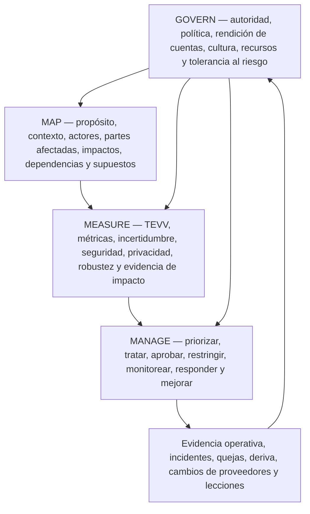
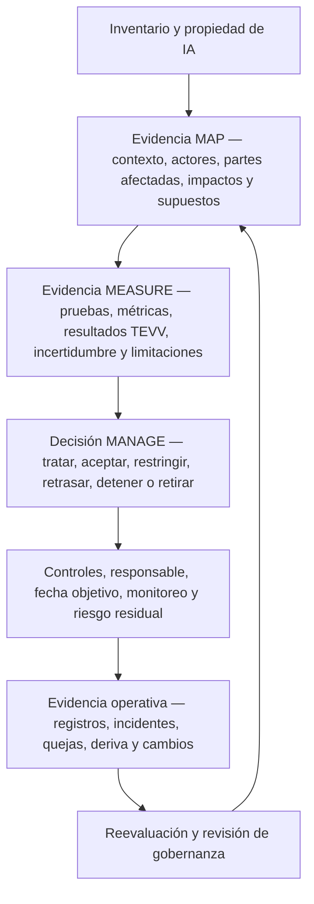

# Manual 03 — Rutas de implementación del NIST AI RMF

**Línea base controlada:** NIST AI RMF 1.0 (NIST AI 100-1), con NIST AI 600-1 aplicado cuando la IA generativa está dentro del alcance.

> **Advertencia de versión:** NIST indica que AI RMF 1.0 está siendo actualizado. Esta entrada de implementación está vinculada a la línea base actualmente publicada de AI RMF 1.0 y debe someterse a una revisión de impacto cuando NIST publique una revisión.

## 1. Seleccionar la ruta de implementación según el riesgo y la complejidad

No seleccione una ruta únicamente por la cantidad de empleados. Comience con la ruta menos compleja que todavía pueda controlar el riesgo real de IA de la organización, su ciclo de vida, las partes afectadas, la exposición regulatoria, el nivel de autonomía, la escala, la dependencia de terceros y las consecuencias potenciales.

```mermaid
flowchart TD
    A["Inventariar sistemas de IA, usos, actores y partes afectadas"] --> B{"¿Una falla o uso indebido podría afectar materialmente a personas, seguridad, derechos, ciberseguridad, finanzas, empleo, servicios esenciales o a la organización?"]
    B -->|"Bajo y acotado"| C["Ruta Esencial"]
    B -->|"Moderado, transversal o de cara al cliente"| D["Ruta Estructurada"]
    B -->|"Alto impacto, regulado, sensible a la seguridad, a gran escala o complejo"| E["Ruta Mejorada"]
    C --> F["Documentar contexto, responsable, evaluación mínima, decisión y monitoreo"]
    D --> G["Gobernanza formal, puertas del ciclo de vida, TEVV, controles de proveedores y evidencia"]
    E --> H["Desafío independiente, TEVV más profundo, análisis de partes afectadas, monitoreo continuo y decisiones ejecutivas de riesgo"]
```

**Explicación accesible:** Primero se inventarían los sistemas de IA y su contexto. Los usos de bajo riesgo y alcance limitado pueden comenzar con una ruta Esencial. Los usos moderados, transversales o de cara al cliente requieren una ruta Estructurada. Los usos de alto impacto, regulados, sensibles a la seguridad, a gran escala o complejos requieren una ruta Mejorada con mayor independencia, evaluación, monitoreo y autoridad para decidir. Una organización puede mover un sistema a una ruta más exigente cuando aumenten el riesgo o la incertidumbre.

| Ruta | Contexto típico | Expectativa mínima de gobernanza |
|---|---|---|
| **Esencial** | Organización pequeña o uso de IA acotado con consecuencias limitadas y dependencias manejables | Responsable designado, inventario, contexto documentado, revisión básica de riesgo/impacto, uso aprobado, pruebas mínimas, orientación al usuario, monitoreo y ruta de incidentes |
| **Estructurada** | Organización mediana, IA de cara al cliente, varias unidades de negocio, dependencias materiales de datos/modelos o impacto moderado | Política/gobernanza formal de IA, revisión transversal, puertas del ciclo de vida, TEVV documentado, controles de proveedores, métricas, revisión de cambios e informes periódicos a la dirección |
| **Mejorada** | Empresa grande o compleja, uso regulado/sensible a la seguridad/de alto impacto, autonomía o escala sustancial o consecuencias severas | Gobernanza ejecutiva del riesgo, desafío independiente, TEVV más profundo, participación de partes afectadas, pruebas adversariales cuando corresponda, monitoreo continuo, autoridad sólida de contingencia/parada y aceptación documentada del riesgo residual |

Escalone por encima de la ruta predeterminada cuando cualquiera de los siguientes factores sea material: niños o grupos vulnerables; empleo, crédito, salud, educación, seguridad, fuerzas del orden, servicios esenciales u otras decisiones de alto impacto; acciones autónomas; datos sensibles o de gran volumen; opacidad del modelo/proveedor; IA generativa o agéntica con acceso a herramientas; uso sensible desde el punto de vista de seguridad; amplia exposición pública; obligaciones legales o contractuales significativas; imposibilidad de revertir el daño; o evidencia débil sobre el desempeño.

## 2. Construir un único ciclo operativo alrededor de GOVERN, MAP, MEASURE y MANAGE

Las funciones principales se refuerzan mutuamente y no constituyen una secuencia de una sola vez. La gobernanza debe influir en todas las demás funciones, y la nueva evidencia proveniente de medición u operación debe actualizar el contexto y las decisiones de gestión.



**Explicación accesible:** GOVERN establece la rendición de cuentas y la autoridad de decisión durante todo el ciclo de vida. MAP describe el contexto real y los posibles impactos. MEASURE produce evidencia mediante pruebas, evaluación, verificación, validación, métricas y otros análisis. MANAGE utiliza esa evidencia para priorizar y tratar el riesgo y tomar decisiones operativas. La evidencia operacional, los incidentes, las quejas, la deriva y los cambios de proveedores retroalimentan la gobernanza y una nueva evaluación del contexto y de las mediciones.

### Ciclo operativo Esencial

1. Designar al responsable del negocio/sistema y al contacto técnico responsable.
2. Registrar propósito, usuarios, partes afectadas, datos, modelo/proveedor, función en la decisión y usos prohibidos.
3. Identificar beneficios plausibles, daños, uso indebido, problemas de seguridad/privacidad, riesgos de dependencia e incertidumbre.
4. Probar el sistema frente a un conjunto pequeño pero pertinente de criterios de aceptación antes del uso aprobado.
5. Documentar la decisión: aprobar, aprobar con condiciones, piloto, restringir o no utilizar.
6. Proporcionar a los usuarios instrucciones claras, expectativas de verificación, escalamiento y condiciones de parada.
7. Monitorear fallas clave, quejas, incidentes, cambios de proveedor/modelo y deriva material.
8. Reevaluar después de un cambio material o cuando exista evidencia de que los supuestos eran incorrectos.

### Ciclo operativo Estructurado

Agregar a la ruta Esencial:

- gobernanza transversal y propiedad del riesgo;
- criterios de riesgo y autoridades de decisión documentados;
- puertas del ciclo de vida para ingreso, diseño/adquisición, evaluación, despliegue, operación, cambio y retiro;
- plan TEVV documentado con datos representativos y umbrales explícitos;
- control de versiones y linaje de modelos, datos y proveedores;
- revisiones de privacidad, ciberseguridad, accesibilidad, supervisión humana y partes afectadas cuando corresponda;
- debida diligencia de proveedores y requisitos contractuales/de evidencia;
- procesos formales de incidentes/quejas y acciones correctivas;
- métricas de gestión y revisión periódica; y
- retención controlada de evidencia.

### Ciclo operativo Mejorado

Agregar a la ruta Estructurada:

- supervisión ejecutiva o del consejo para riesgos materiales de IA;
- validación/desafío independiente proporcional a las consecuencias;
- pruebas de escenarios, estrés, adversariales, por subgrupos, de uso indebido y modos de falla según corresponda;
- evaluación más sólida de factores humanos y partes afectadas;
- controles explícitos de respaldo, reversión, apagado/parada, continuidad del negocio y alternativa manual;
- monitoreo continuo o casi continuo de riesgos operativos clave;
- aceptación formal del riesgo residual con vencimiento/condiciones de revisión;
- vigilancia reforzada de proveedores, subprocesadores y cambios de modelos;
- ejercicios para incidentes importantes de IA y comunicaciones; y
- análisis a nivel de portafolio de concentración, fallas correlacionadas y riesgo sistémico.

## 3. Convertir el Core en evidencia, no en burocracia

Toda decisión material de riesgo de IA debe dejar una cadena trazable desde el contexto hasta la evidencia y la acción.



**Explicación accesible:** La evidencia comienza con un inventario de IA con responsable asignado, luego documenta contexto e impactos, pruebas e incertidumbre y la decisión de gestión resultante. Los controles y el riesgo residual se rastrean durante la operación. Registros, incidentes, quejas, deriva y cambios activan reevaluación y revisión de gobernanza. Una política por sí sola no demuestra que el riesgo haya sido controlado.

Registro mínimo de evidencia para un sistema material de IA:

| Área de evidencia | Registro mínimo |
|---|---|
| Identidad | Nombre del sistema/uso, responsable, etapa del ciclo de vida, versión, proveedor/modelo, proceso de negocio y estado |
| Contexto | Propósito, usuarios, partes afectadas, geografía, escala, función en la decisión, dependencias y supuestos |
| Riesgo/impacto | Escenarios, beneficios, daños, uso indebido, severidad, probabilidad cuando sea significativo, incertidumbre y grupos afectados |
| Medición | Método de evaluación, población/datos, versión, umbrales, resultados, limitaciones, revisor y fecha |
| Tratamiento | Controles, condiciones, restricciones, supervisión humana, acciones de proveedores y remediación |
| Decisión | Aprobador autorizado, decisión de aprobar/restringir/pilotar/detener, riesgo residual, condiciones y vencimiento/activador de revisión |
| Operación | Medidas de monitoreo, quejas, incidentes, deriva, cambios de proveedor/modelo y evidencia de operación de controles |
| Mejora | Acción correctiva, nueva prueba, lecciones aprendidas y actualizaciones de gobernanza, contexto, mediciones o tratamiento |

## 4. Aplicar NIST AI 600-1 cuando la IA generativa esté dentro del alcance

La IA generativa no debe tratarse como un sistema de gobernanza completamente separado. Aplique el modelo operativo general de AI RMF y luego agregue análisis y controles específicos de GenAI proporcionales al uso.

Como mínimo, evalúe cuando corresponda:

- confabulación o salida sin respaldo;
- contenido dañino, ilegal, inseguro o contrario a políticas;
- problemas de integridad y procedencia de la información;
- privacidad y exposición de datos sensibles;
- propiedad intelectual y origen del contenido;
- inyección de prompts, abuso de herramientas, envenenamiento de datos y otras amenazas de seguridad;
- extracción de modelos, abuso, agencia excesiva y automatización insegura;
- opacidad y riesgo de cambio de modelos fundacionales y proveedores de servicios externos;
- exceso de confianza humana, sesgo de automatización y revisión inadecuada;
- uso indebido a escala y habilitación de abusos;
- limitaciones de evaluación, contaminación de benchmarks y mala transferencia de pruebas a producción; y
- monitoreo de prompts, salidas y trazas con controles apropiados de privacidad y acceso.

Para GenAI agéntica o con uso de herramientas, agregue límites explícitos de autorización, mínimo privilegio, límites de transacción, puertas de confirmación, aislamiento de entornos, listas permitidas de herramientas, bloqueo de acciones de alto riesgo, registro, reversión y controles de parada de emergencia.

## 5. Integrar con la gobernanza existente en lugar de duplicarla

Manual 03 debe reutilizar sistemas de evidencia y decisión cuando sean adecuados para su propósito.

| Capacidad existente | Integración con AI RMF |
|---|---|
| Gestión de riesgo empresarial | Criterios de riesgo de IA, agregación, aceptación de riesgo residual y escalamiento |
| Programa de seguridad / NIST CSF | Identidad, acceso, registros, vulnerabilidad, incidentes, resiliencia y cadena de suministro |
| Programa de privacidad | Propósito de datos, minimización, derechos, riesgo de privacidad, avisos, retención y quejas |
| Producto / SDLC | Requisitos, puertas del ciclo de vida, pruebas, liberación, cambio y retiro |
| Gobernanza de datos | Propiedad, calidad, procedencia, acceso, retención y linaje |
| Riesgo de proveedores | Debida diligencia de modelos/servicios, contratos, cambios, incidentes, evidencia y salida |
| Calidad / seguridad | Verificación, validación, análisis de fallas, acción correctiva y mejora continua |
| Auditoría interna / aseguramiento | Pruebas independientes de gobernanza, evidencia, diseño y operación de controles |
| ISO/IEC 42001 | Estructura del sistema de gestión, operación documentada de controles, auditoría/revisión y mejora |
| Ley de IA de la UE / legislación sectorial | Aplicabilidad vinculante y obligaciones legales mantenidas separadas de la orientación voluntaria de NIST |

No afirme que implementar AI RMF establece automáticamente conformidad con ISO/IEC 42001 o cumplimiento legal. Los crosswalks son herramientas para reutilizar evidencia, no declaraciones de equivalencia.

## 6. Definir puertas de decisión y condiciones de parada

Toda organización debe definir quién puede tomar decisiones materiales sobre IA y cuándo debe pausarse su uso.

Resultados típicos de decisión:

- **Aprobar:** la evidencia cumple los criterios actuales y el riesgo residual está dentro de la autoridad.
- **Aprobar con condiciones:** se permite un uso limitado con restricciones, monitoreo y vencimiento/revisión explícitos.
- **Piloto:** la incertidumbre es demasiado alta para un uso amplio; se aprueba un experimento acotado para generar evidencia.
- **Remediar antes del uso:** deben cerrarse primero brechas materiales de control o evidencia.
- **Restringir:** se reduce el alcance, población, autonomía, datos o funcionalidad.
- **Detener/revertir:** el daño real o plausible excede la tolerancia, fallan controles críticos o no puede demostrarse una operación segura.
- **Retirar:** el sistema se elimina y dependencias, datos, identidades, contratos y registros se gestionan mediante salida controlada.

Entre los activadores automáticos de revisión/parada deben incluirse incidentes graves; cambios materiales de modelo/proveedor; exposición no autorizada de datos; compromiso de seguridad; degradación material del desempeño o por subgrupos; salidas dañinas repetidas; quejas significativas; nuevas poblaciones o geografías afectadas; expansión hacia decisiones de alto impacto; pérdida de la supervisión humana requerida; evidencia de proveedor vencida; o una nueva obligación vinculante que afecte el uso.

## 7. Medir si la gestión del riesgo de IA está mejorando

Las métricas deben responder preguntas de gestión y no recompensar el volumen de documentación.

Ejemplos útiles:

- porcentaje de usos activos de IA reconciliados con un responsable y nivel de riesgo vigentes;
- tiempo desde ingreso/cambio material hasta una decisión de riesgo aprobada;
- porcentaje de sistemas materiales con evidencia de evaluación vigente vinculada a la versión desplegada;
- fallas de evaluación de alta severidad sin resolver y su antigüedad;
- incidentes, quejas, anulaciones, apelaciones y patrones repetidos de falla;
- medidas de deriva/desempeño/seguridad/privacidad vinculadas a umbrales de acción;
- porcentaje de proveedores críticos de IA con evidencia vigente y cambios materiales revisados;
- aprobaciones de riesgo residual o excepciones vencidas;
- acciones correctivas probadas nuevamente para verificar su eficacia dentro de objetivos basados en riesgo; y
- sistemas detenidos, restringidos o rediseñados porque la evidencia no respaldó continuar su uso.

Una métrica es útil únicamente cuando la dirección sabe qué decisión o acción debe activar.

## 8. Mantener la línea base actual sin cambiar silenciosamente el manual

Dado que NIST anunció una revisión de AI RMF, Manual 03 debe distinguir **monitoreo de fuentes** de **adopción de fuentes**.

Cuando NIST publique una nueva versión de AI RMF:

1. congelar el candidato de liberación vigente de Manual 03;
2. verificar la publicación final exacta de NIST y su estado de publicación efectivo;
3. comparar el nuevo marco con la línea base controlada de AI RMF 1.0;
4. clasificar los cambios como editoriales, terminológicos, estructurales, de resultados/acciones, implementación, crosswalk o impacto de aseguramiento;
5. identificar capítulos, plantillas, gráficos, traducciones y controles QA afectados;
6. actualizar primero la fuente controlada en inglés;
7. realizar revisión semántica humana de los cambios localizados;
8. regenerar los artefactos de publicación; y
9. publicar un historial de cambios claro en lugar de sobrescribir orientación anterior sin explicación.

**Límite de aseguramiento:** Aprobar la puerta del repositorio de Manual 03 validará la estructura controlada, estado de fuentes, accesibilidad y expectativas de evidencia. No certificará a una organización, determinará cumplimiento legal, garantizará una IA confiable, eliminará el riesgo ni constituirá una opinión de auditoría.
