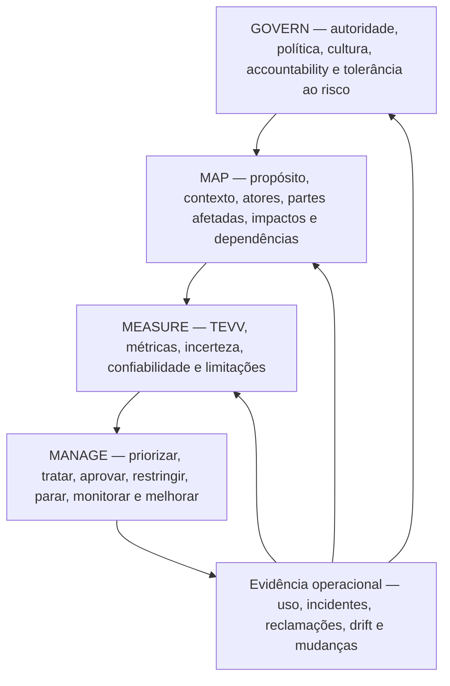
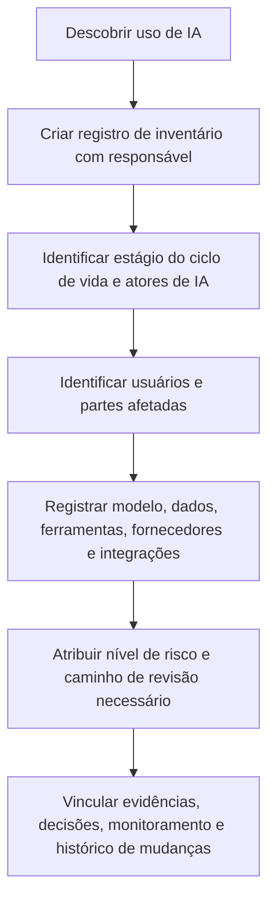
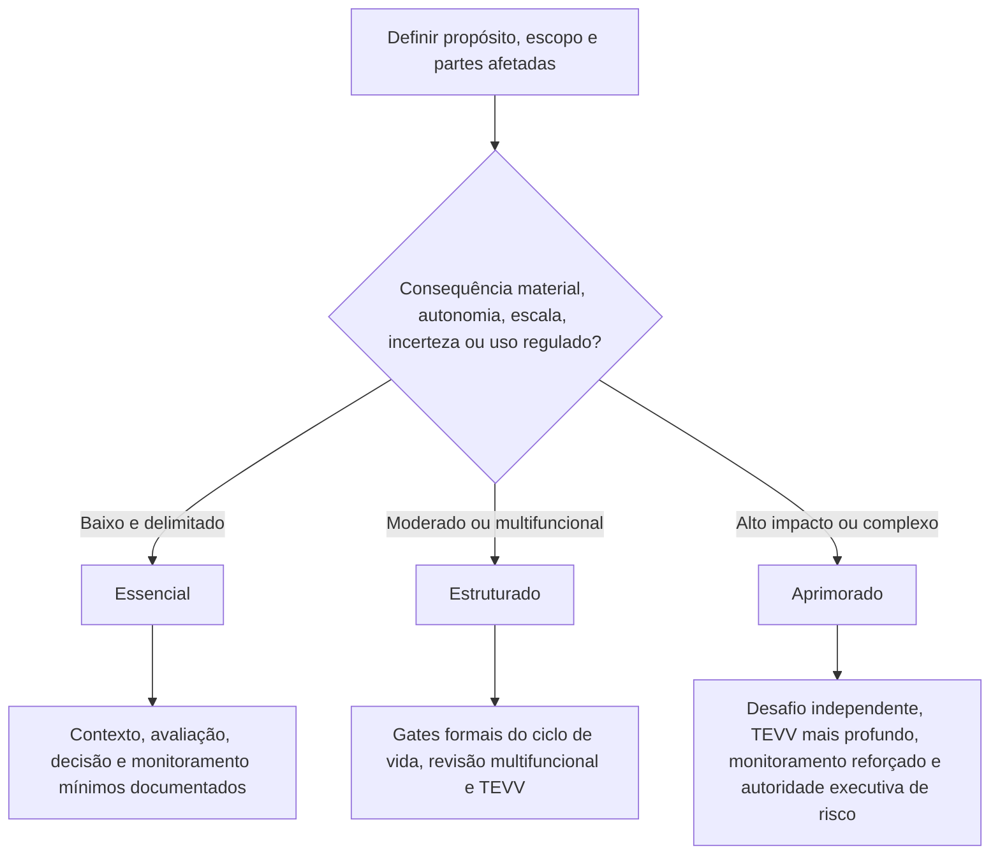

# Manual 03 — Implementação do NIST AI Risk Management Framework

## Fonte controlada em português — Parte 1: Preliminares e capítulos 1–8

**Linha de base atual:** NIST AI RMF 1.0 / NIST AI 100-1

**Estado da versão:** framework final publicado, atualmente em revisão pelo NIST em 25 de agosto de 2026

**Perfil complementar:** NIST AI 600-1 quando IA generativa estiver no escopo

**Autor e criador humano responsável:** Alberto “Al” Leiva

> **Aviso de desenvolvimento controlado:** Esta é orientação prática original de implementação. O NIST AI RMF é orientação voluntária, não um padrão de certificação. O NIST informa que o AI RMF 1.0 está sendo revisado. Este manual está vinculado à linha de base atualmente publicada e deve passar por análise de impacto quando uma versão revisada for publicada.

# Prefácio

O NIST Artificial Intelligence Risk Management Framework ajuda organizações a gerenciar riscos de IA durante design, desenvolvimento, implantação, uso, avaliação e retirada. Ele é intencionalmente flexível e pode ser adaptado a organizações de diferentes tamanhos, setores e perfis de risco.

Este manual converte essa flexibilidade em etapas operacionais práticas sem transformar o framework em uma falsa lista de verificação. O objetivo é ajudar gestores, profissionais de GRC, especialistas de segurança e privacidade, responsáveis por produtos de IA, engenheiros, auditores e analistas a responder repetidamente a cinco perguntas:

1. Qual sistema ou uso de IA estamos realmente governando?
2. Quem e o que pode ser afetado?
3. Que evidências temos sobre benefícios, limitações, risco e incerteza?
4. Quem tem autoridade para aprovar, restringir, parar ou retirar o uso?
5. Como operações, incidentes, reclamações e mudanças atualizam nossas decisões?

O manual utiliza as quatro funções Core do NIST — GOVERN, MAP, MEASURE e MANAGE — como um ciclo operacional integrado. GOVERN é transversal. MAP estabelece o contexto. MEASURE produz evidências. MANAGE transforma evidências em tratamento priorizado e decisões. Novas informações então alteram governança, contexto, medição ou tratamento.

## Limite de fontes e revisão

- `nist-ai-rmf-1-0`: linha de base publicada atual do AI RMF 1.0; status do repositório `final-under-revision`.
- `nist-ai-600-1`: perfil final atual de IA generativa do NIST, usado quando IA generativa estiver no escopo.
- O AI Resource Center atual do NIST informa que o AI RMF 1.0 está sendo revisado.
- O Playbook atual é baseado no AI RMF 1.0 e o NIST informa que será atualizado após a revisão do framework.
- Rascunhos, concept notes ou perfis em desenvolvimento não são tratados aqui como requisitos finais.

# Guia de capítulos

| Capítulo | Tema |
|---:|---|
| 1 | Propósito do NIST AI RMF, limite voluntário e modelo de implementação |
| 2 | Arquitetura de gestão de riscos de IA e ciclo operacional de quatro funções |
| 3 | Inventário de IA, atores, responsabilidade e limites do ciclo de vida |
| 4 | Roteamento proporcional por risco e complexidade |
| 5 | Arquitetura da função GOVERN |
| 6 | GOVERN: política, obrigações legais, tolerância ao risco e inventário |
| 7 | GOVERN: accountability, competência, supervisão humana e desafio efetivo |
| 8 | GOVERN: cultura, engajamento, fornecedores e resiliência de terceiros |

# 1. Propósito do NIST AI RMF, limite voluntário e modelo de implementação

*O NIST AI RMF 1.0 é um framework voluntário e não setorial para gerenciar riscos de IA e apoiar práticas de IA confiáveis e responsáveis.*

## 1.1 O que implementação significa

Implementação significa incorporar decisões de risco ao trabalho normal da organização. Uma implementação útil do AI RMF conecta:

- estratégia e tolerância ao risco;
- inventário e responsabilidade por IA;
- gates de produto, aquisição e ciclo de vida;
- análise de partes afetadas e stakeholders;
- avaliação técnica e não técnica;
- governança de dados, modelos, software, infraestrutura e fornecedores;
- cibersegurança, privacidade, safety, qualidade e resiliência;
- instruções aos usuários e supervisão humana;
- monitoramento, reclamações e resposta a incidentes;
- aceitação e escalonamento de risco residual; e
- ação corretiva, aprendizado e retirada.

## 1.2 O que implementação não significa

- Completar todas as sugestões do Playbook independentemente do contexto.
- Tratar todos os sistemas de IA como igualmente arriscados.
- Presumir que uma pontuação alta em benchmark prova desempenho aceitável no mundo real.
- Tratar uma declaração de fornecedor como evidência suficiente para o contexto do cliente.
- Tratar o uso do AI RMF como conformidade legal, certificação ISO/IEC 42001 ou opinião de auditoria.
- Afirmar que um sistema é “confiável” apenas porque existe um documento de governança.

## 1.3 Uma unidade prática de accountability

Use o **registro de sistema/uso de IA** como unidade mínima que conecta governança a operações. Um registro pode cobrir um serviço ou caso de uso estritamente controlado, mas não agregue usos não relacionados quando partes afetadas, consequências de decisão, modelos, dados, configurações, fornecedores ou proprietários de risco diferirem materialmente.

| Campo | Conteúdo mínimo |
|---|---|
| Identidade | Nome do sistema/uso, ID único, responsável, processo de negócio e status do ciclo de vida |
| Propósito | Tarefa pretendida, papel na decisão/conteúdo, usuários e benefício esperado |
| Escopo | Geografia, população, escala, autonomia e usos proibidos |
| Tecnologia | Modelo/serviço, versão, software, ferramentas, infraestrutura e integrações |
| Dados | Entradas, saídas, dados sensíveis, fontes, retenção e linhagem principal |
| Partes | Atores de IA, usuários, pessoas/grupos afetados, fornecedores e revisores |
| Risco | Nível, cenários materiais, incerteza, tratamento e autoridade sobre risco residual |
| Evidência | Avaliação, aprovações, monitoramento, incidentes, reclamações e mudanças |

# 2. Arquitetura de gestão de riscos de IA e ciclo operacional de quatro funções

*As funções Core devem se reforçar continuamente; elas não são quatro caixas preenchidas uma única vez.*

**Explicação acessível:** A governança estabelece quem pode decidir e como o risco é tratado. MAP descreve o contexto real e as pessoas ou sistemas afetados. MEASURE cria evidências por meio de testes e outras avaliações. MANAGE usa as evidências para tratar e aceitar ou rejeitar o risco. Resultados operacionais, incidentes, reclamações e mudanças retornam às quatro funções.

## 2.1 A governança é transversal

Não isole GOVERN como uma atividade anual de comitê. A governança deve determinar:

- quem é responsável por cada uso de IA;
- quando especialistas jurídicos, de privacidade, segurança, safety, acessibilidade ou domínio devem participar;
- qual nível de esforço de gestão de riscos é necessário;
- quem pode aprovar o risco residual;
- quais evidências são necessárias antes da implantação;
- quais eventos exigem reavaliação; e
- quando um sistema deve ser restringido, revertido ou retirado.

## 2.2 Perfis e adaptação

Uma implementação prática pode criar um perfil para um caso de uso, unidade de negócio ou setor. A adaptação deve identificar:

- quais resultados do AI RMF importam mais no contexto;
- estado atual e estado-alvo desejado;
- tolerância ao risco e restrições legais/contratuais;
- evidências e métricas;
- expectativas de recursos e independência; e
- ações planejadas com responsáveis e datas.

A adaptação não deve ser usada para ocultar riscos conhecidos de alta consequência ou remover uma obrigação vinculante.

# 3. Inventário de IA, atores, responsabilidade e limites do ciclo de vida

*Uma organização não pode governar IA que não consegue identificar, classificar e atribuir a pessoas responsáveis.*

**Explicação acessível:** A descoberta cria um registro de inventário. Em seguida, a organização identifica quem desenvolve, fornece, opera, usa, supervisiona e é afetado pela IA; registra dependências técnicas e de fornecedores; atribui um caminho de revisão proporcional; e vincula evidências e decisões ao longo do ciclo de vida.

## 3.1 Fontes de descoberta

Reconcilie várias fontes porque o autorrelato sozinho não encontra toda a shadow AI:

- registros de compras e despesas;
- inventários de nuvem e SaaS;
- uso e faturamento de modelos/API;
- repositórios de software e dependências de pacotes;
- logs de identidade e acesso;
- inventários de extensões de endpoint/navegador;
- catálogos de dados e plataformas de integração;
- arquitetura de produtos e catálogos de serviços;
- registros de risco de fornecedores;
- entrevistas e atestações de empregados; e
- monitoramento de segurança quando apropriado e legal.

## 3.2 Atores de IA

Documente os papéis pela atividade real, não pelo cargo. Atividades comuns incluem:

- governança executiva e de riscos;
- comissionamento do sistema e responsabilidade pelo produto;
- aquisição, preparação e stewardship de dados;
- desenvolvimento, adaptação ou configuração de modelos;
- engenharia de software e infraestrutura;
- teste, avaliação, verificação e validação;
- implantação e operações;
- supervisão humana e revisão de decisões;
- suporte ao usuário, reclamações e reparação;
- revisão de segurança, privacidade, jurídico, compliance e safety;
- gestão de fornecedores e contratos; e
- assurance/auditoria independente.

Uma pessoa pode executar vários papéis em uma organização pequena, mas conflitos de interesse devem ser identificados e revisões compensatórias devem ser adicionadas para riscos materiais.

## 3.3 Partes afetadas

Pessoas afetadas podem nunca usar o sistema. Considere pessoas cujo emprego, acesso, elegibilidade, segurança, reputação, finanças, privacidade, expressão, aprendizado, saúde, mobilidade ou outros interesses possam ser influenciados pelo processo habilitado por IA.

Registre:

- usuários diretos;
- sujeitos de decisões;
- pessoas representadas nos dados;
- observadores e grupos indiretamente afetados;
- clientes ou trabalhadores downstream;
- comunidades ou populações afetadas em escala; e
- organizações ou sistemas públicos que dependam das saídas.

# 4. Roteamento proporcional por risco e complexidade

*A intensidade de recursos deve seguir consequências plausíveis, incerteza e complexidade, e não apenas o tamanho da organização.*

**Explicação acessível:** A organização começa pelo contexto e pelas partes afetadas, depois considera consequências potenciais, autonomia, escala, incerteza e exposição regulatória. Usos de baixo risco e escopo limitado podem usar o caminho Essencial. Usos moderados exigem o caminho Estruturado. Usos de alto impacto ou complexos exigem o caminho Aprimorado, com maior independência e supervisão.

## 4.1 Fatores de risco

Considere pelo menos:

- severidade e reversibilidade do dano plausível;
- número e vulnerabilidade das pessoas afetadas;
- se o uso influencia decisões consequenciais;
- grau de automação ou autoridade de ação;
- exposição pública e potencial de abuso;
- sensibilidade e volume de dados;
- opacidade do modelo e controle do fornecedor;
- novidade e incerteza;
- consequências de cibersegurança e safety;
- complexidade geográfica/jurídica;
- capacidade de monitorar e corrigir resultados; e
- risco de concentração ou dependência de modo comum.

## 4.2 Registro de nível

| Campo | Exemplo de evidência |
|---|---|
| Consequência inerente | Narrativa mais dimensões como safety, direitos, finanças, segurança ou operações |
| Probabilidade/incerteza | Dados, julgamento de especialistas, incidentes análogos, premissas e confiança |
| Exposição | Escala, frequência, duração, população e geografia |
| Autonomia | Consultivo, aprovado por humano, executado automaticamente ou agêntico/com ferramentas |
| Força do controle | Controles existentes e limitações conhecidas |
| Nível/caminho | Essencial, Estruturado ou Aprimorado com justificativa |
| Autoridade | Pessoa/comitê autorizado a aprovar o nível e o risco residual |
| Gatilho de revisão | Mudança, incidente, reclamação, drift, atualização legal/do fornecedor ou revisão programada |

# 5. Arquitetura da função GOVERN

*GOVERN torna durável a gestão de riscos de IA ao estabelecer política, accountability, cultura, engajamento, controles de fornecedores e mecanismos de revisão.*

A função GOVERN atual do AI RMF 1.0 agrupa resultados em seis temas amplos. Para implementação, trate-os como:

1. infraestrutura organizacional de política/processo e tolerância ao risco;
2. accountability, treinamento e autoridade de decisão;
3. capacidade interdisciplinar e papéis de supervisão humano-IA;
4. cultura consciente de risco, documentação de impacto, testes e compartilhamento de informações;
5. engajamento externo e interno com feedback significativo; e
6. governança de terceiros e cadeia de suprimentos, incluindo planejamento de contingência.

> **Cautela de revisão:** O NIST identificou especificamente que parte da terminologia atual do AI RMF 1.0 está sujeita a revisão. Preserve rastreabilidade no nível de identificadores à linha de base controlada 1.0, mas não apresente a redação atual das categorias como texto futuro imutável.

## 5.1 Hierarquia de evidências de governança

Evidências mais fortes avançam da intenção para a operação:

- **Intenção:** política, charter, princípios e tolerância ao risco.
- **Desenho:** processo definido, papéis, direitos de decisão, templates e controles.
- **Operação:** revisões, aprovações, testes, ações de fornecedores e registros de incidentes concluídos.
- **Efetividade:** evidência de que controles alteram decisões, reduzem risco ou detectam falhas.
- **Melhoria:** causas corrigidas, políticas/processos atualizados e acompanhamento verificado.

# 6. GOVERN: política, obrigações legais, tolerância ao risco e inventário

*Políticas devem conectar prioridades de risco de IA a decisões repetíveis em vez de apenas repetir princípios amplos.*

## 6.1 Política de IA

Uma política prática deve definir:

- propósito e escopo;
- limites de uso aprovado/proibido;
- accountability e escalonamento;
- método de classificação por risco;
- gatilhos de revisão legal/regulatória/contratual;
- requisitos de dados e segurança;
- expectativas mínimas de avaliação;
- expectativas de supervisão humana;
- controles de fornecedores;
- deveres de monitoramento e incidentes;
- manutenção de registros; e
- exceções e aplicação interna.

## 6.2 Registro de obrigações

O AI RMF é voluntário, mas sistemas de IA podem estar sujeitos a obrigações vinculantes. Mantenha um registro separado de obrigações com:

| Campo | Conteúdo mínimo |
|---|---|
| Fonte | Lei, regulamento, contrato, política, padrão ou requisito do cliente |
| Jurisdição | País/estado/setor/relação comercial |
| Aplicabilidade | Sistema/uso/dados/parte/processo afetado |
| Requisito | Obrigação prática expressa em linguagem organizacional |
| Responsável | Função/pessoa accountable |
| Evidência | Controle, registro, teste ou aprovação |
| Monitoramento de mudança | Monitor de fonte e frequência de revisão |

Não rotule uma sugestão voluntária do NIST como lei. Não declare conformidade legal apenas porque existe um mapeamento para um resultado do AI RMF.

## 6.3 Tolerância ao risco e esforço

Defina quais decisões podem ser tomadas em cada nível. Por exemplo:

- aprovação pelo responsável para baixo risco dentro de critérios documentados;
- revisão multifuncional para risco moderado;
- aprovação executiva/de comitê para alto risco;
- escalonamento obrigatório para uso proibido ou legalmente restrito;
- desafio independente para sistemas de alta consequência; e
- autoridade de parada quando controles críticos falharem.

O esforço de gestão de riscos deve ser dimensionado de acordo com a prioridade do risco.

## 6.4 Inventário como controle de governança

O inventário deve ser reconciliado periodicamente e após aquisição, implantação ou mudança material. Um inventário desatualizado é uma falha de governança porque processos de risco posteriores dependem de uma população completa.

# 7. GOVERN: accountability, competência, supervisão humana e desafio efetivo

*A responsabilidade deve ser explícita o suficiente para que uma decisão material de IA possa ser rastreada até pessoas com autoridade e competência.*

## 7.1 Modelo de responsabilidades

No mínimo, identifique:

- patrocinador executivo;
- responsável pelo negócio/sistema;
- responsável técnico/modelo;
- proprietário/steward de dados;
- revisores de risco/compliance/jurídico/privacidade/segurança/safety conforme aplicável;
- papel de supervisão humana;
- responsável por fornecedor;
- responsável por incidente;
- aprovador de risco residual; e
- papel de assurance independente quando necessário.

## 7.2 Competência

A competência depende do papel. A evidência pode incluir educação, experiência, prática supervisionada, treinamento, avaliação e produtos de trabalho revisados. A avaliação de alto risco requer competência tanto na tecnologia quanto no domínio onde as consequências ocorrem.

O treinamento deve cobrir decisões reais que as pessoas tomam, como:

- reconhecer uso de IA não aprovado;
- tratar dados restritos;
- interpretar confiança e limitações do modelo;
- verificar saídas;
- reconhecer automation bias;
- escalar preocupações de safety/segurança/privacidade;
- responder a incidentes; e
- usar procedimentos de parada ou fallback.

## 7.3 Supervisão humana

“Human in the loop” não é suficiente por si só. Documente:

- o que o humano vê;
- o que se espera que ele verifique;
- tempo e informações disponíveis;
- autoridade para discordar ou parar;
- incentivos e carga de trabalho;
- competência;
- logging de overrides; e
- evidência de que a intervenção é efetiva.

Um revisor que aceita automaticamente a saída de IA não é um controle significativo.

## 7.4 Desafio efetivo

Para riscos materiais, use um revisor ou grupo capaz de questionar premissas e com autoridade, independência, experiência e acesso a evidências suficientes para afetar a decisão. A independência pode ser dimensionada em organizações pequenas por revisão por pares, expertise externa ou separação entre aprovação e criação.

# 8. GOVERN: cultura, engajamento, fornecedores e resiliência de terceiros

*A gestão de riscos de IA depende da disposição da organização para expor falhas, ouvir perspectivas afetadas e controlar dependências que não possui.*

## 8.1 Cultura consciente de risco

Práticas úteis incluem:

- liderança que recompense o escalonamento de preocupações materiais;
- canais protegidos de reporte;
- pre-mortems e revisão de modos de falha;
- discordância documentada em decisões de alto risco;
- red teaming ou desafio adversarial quando apropriado;
- aprendizado com incidentes e quase incidentes; e
- evitar incentivos de entrega que punam atraso seguro ou decisões de parada.

## 8.2 Engajamento e feedback

O engajamento deve ser proporcional e significativo, não performático. Defina:

- por que o feedback é buscado;
- quais perspectivas afetadas ou especializadas são necessárias;
- como participantes são selecionados e protegidos;
- necessidades de acessibilidade e idioma;
- como o feedback é registrado e adjudicado;
- o que mudou por causa do feedback; e
- como preocupações não resolvidas são escaladas.

O feedback pode vir de usuários, pessoas afetadas, trabalhadores, especialistas de domínio, suporte ao cliente, reclamações, processos de recurso, bancos de dados de incidentes, reguladores, pesquisadores ou organizações da sociedade civil, conforme o contexto.

## 8.3 Governança de fornecedores e terceiros

Cadeias de suprimentos de IA podem incluir foundation models, APIs, datasets, componentes open source, ferramentas de avaliação, infraestrutura de nuvem, serviços humanos de rotulagem, filtros de safety e plataformas de orquestração.

A evidência mínima de fornecedor deve abordar:

- produto/modelo/serviço e versão exatos;
- uso pretendido e restrições contratuais;
- tratamento de dados, retenção e uso para treinamento;
- evidência de segurança e privacidade;
- evidência de desempenho/avaliação e limitações;
- práticas de notificação de mudanças;
- subprocessadores/dependências;
- notificação de incidentes/vulnerabilidades;
- continuidade, portabilidade e saída; e
- alocação de responsabilidades entre fornecedor e cliente.

## 8.4 Planejamento para falha de terceiros

Para dependências materiais, planeje para:

- indisponibilidade do modelo/serviço;
- degradação material de qualidade;
- atualização silenciosa do modelo;
- incidente de segurança do fornecedor;
- perda de API/funcionalidade;
- alteração de termos ou práticas de dados;
- saída do fornecedor ou descontinuação do serviço; e
- incapacidade de obter evidência necessária para continuar aceitando o risco.

O fallback pode incluir fornecedores alternativos, modo degradado seguro, processo manual, limitação de tráfego, resultados aprovados em cache, desativação de funcionalidades ou parada completa, dependendo do uso.

**Checkpoint da Parte 1:** Os capítulos 1–8 estabelecem consciência de versão, inventário, roteamento proporcional e a base de governança. A Parte 2 continua com MAP e análise do contexto afetado.
