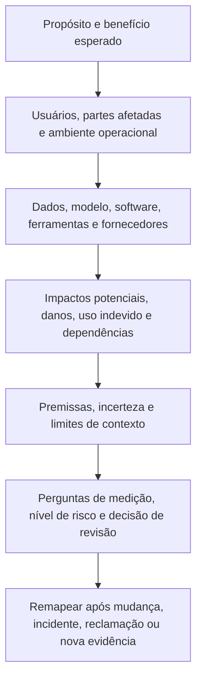
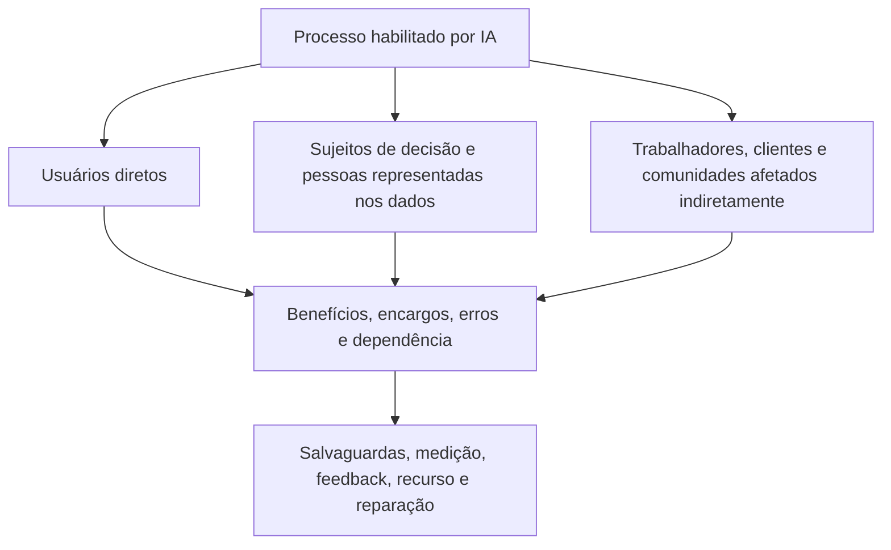
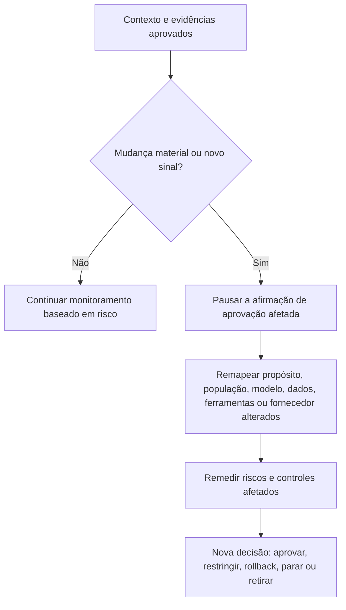

# Manual 03 — Implementação do NIST AI Risk Management Framework

## Fonte controlada em português — Parte 2: MAP, capítulos 9–16

**Linha de base controlada:** NIST AI RMF 1.0 / NIST AI 100-1

**Limite de fonte:** Orientação prática original de implementação. Resume e operacionaliza o framework atualmente publicado sem reproduzir a publicação do NIST. O AI RMF 1.0 está sendo revisado; os mapeamentos no nível de identificadores devem passar por análise de impacto quando o NIST publicar um substituto.

# Guia de capítulos

| Capítulo | Tema |
|---:|---|
| 9 | Arquitetura da função MAP e registro de contexto |
| 10 | Propósito pretendido, escopo, atores e contexto do ciclo de vida |
| 11 | Partes afetadas, benefícios, impactos e danos |
| 12 | Dependências de dados, modelos, software, infraestrutura e fornecedores |
| 13 | Cenários de uso indevido, abuso, segurança, privacidade, safety e resiliência |
| 14 | Premissas, incerteza, validade de contexto e gatilhos de mudança |
| 15 | Requisitos, padrões, expectativas de stakeholders e critérios de risco |
| 16 | Pacote de evidências MAP, revisão e handoff para MEASURE |

# 9. Arquitetura da função MAP e registro de contexto

*MAP estabelece contexto sociotécnico suficiente para identificar riscos, benefícios, partes afetadas e necessidades de medição relevantes.*

Mapeamento não é um questionário executado uma única vez. É uma descrição controlada do sistema conforme sua intenção, configuração, fornecimento e uso real. O registro deve ser específico o bastante para que revisores distingam diferentes implantações, populações, versões de modelo ou papéis de decisão.

**Explicação acessível:** O mapeamento começa pelo propósito e benefício esperado, depois documenta usuários e partes afetadas, dependências técnicas e de fornecedores, impactos plausíveis e uso indevido e principais premissas. Esses fatos determinam perguntas de medição e nível de risco. Mudanças, incidentes, reclamações e novas evidências levam o sistema de volta ao mapeamento.

## 9.1 Registro de contexto

Mantenha um registro controlado de contexto para cada sistema ou uso de IA materialmente distinto. Ele deve estar vinculado ao registro de inventário e incluir:

- propósito de negócio e benefício esperado;
- limite do sistema e estágio do ciclo de vida;
- atores de IA, responsável accountable e autoridade de decisão;
- usuários diretos, sujeitos de decisão e partes indiretamente afetadas;
- ambiente operacional, geografia, frequência, escala e duração;
- papel na decisão ou no conteúdo e grau de autonomia;
- dependências de dados, modelos, software, ferramentas e infraestrutura;
- terceiros e limites contratuais;
- impactos positivos e negativos plausíveis;
- cenários razoáveis de uso indevido e falha;
- premissas, incertezas e lacunas de evidência;
- requisitos aplicáveis e expectativas de stakeholders;
- nível inicial de risco e justificativa; e
- perguntas de medição, limiares e gatilhos de revisão.

## 9.2 Critérios de qualidade do contexto

Um registro de contexto está pronto para revisão quando é:

- **específico:** identifica uso, população, versão e ambiente reais;
- **rastreável:** vincula afirmações a evidências, responsáveis e datas;
- **delimitado:** declara o que está excluído e por quê;
- **plural:** considera perspectivas técnicas, humanas, organizacionais e sociais quando relevantes;
- **questionável:** registra premissas e discordâncias em vez de apresentar certeza inexistente;
- **atual:** reflete a configuração implantada ou proposta; e
- **acionável:** produz perguntas mensuráveis e escolhas gerenciais.

Descrições genéricas de produto, marketing de fornecedor, slogans de política e resumos de benchmark não atendem a esse padrão por si só.

# 10. Propósito pretendido, escopo, atores e contexto do ciclo de vida

*O risco não pode ser avaliado sem definir o que se espera que a IA faça, onde é usada e como as pessoas interagem com ela.*

## 10.1 Declaração de propósito pretendido

Escreva o propósito em linguagem operacional:

> O sistema auxilia **[usuários identificados]** com **[tarefa ou decisão específica]** para **[população/ambiente definido]** ao produzir **[saída/ação]**. Espera-se que forneça **[benefício mensurável]**. Não deve ser usado para **[usos proibidos ou não validados]**.

Evite propósitos como “melhorar eficiência” a menos que o registro defina processo, usuário, saída, consequência e métrica.

## 10.2 Escopo e limites

Registre:

- unidades organizacionais e processos;
- jurisdições e idiomas;
- populações usuárias e afetadas;
- canais, dispositivos e ambientes;
- horários de operação e volume esperado de transações;
- integrações e decisões downstream;
- caráter consultivo versus ação automática;
- pontos de revisão humana;
- versões de dados e modelos;
- status de piloto, produção ou retirada; e
- usos e ambientes excluídos.

Se um mesmo modelo apoiar decisões, populações ou níveis de autonomia diferentes, crie registros de uso vinculados em vez de ocultar variação de risco em uma única entrada ampla de inventário.

## 10.3 Contexto do ciclo de vida

Identifique os estágios atuais e planejados:

1. conceito e intake;
2. design ou aquisição;
3. preparação de dados e desenvolvimento/configuração do modelo;
4. integração e avaliação pré-implantação;
5. piloto ou liberação limitada;
6. uso em produção;
7. monitoramento e mudança;
8. suspensão, rollback ou remediação; e
9. retirada e descarte controlado.

Diferentes evidências ficam disponíveis em diferentes estágios. O mapeamento inicial depende mais de premissas, evidência análoga e salvaguardas planejadas. O mapeamento em produção deve incorporar desempenho observado, incidentes, reclamações, overrides, drift e mudanças de fornecedores.

## 10.4 Mapeamento ator-tarefa

Mapeie pessoas e organizações para tarefas reais, autoridade e evidências. Inclua fornecedores externos quando desenvolverem, configurarem, avaliarem, hospedarem ou monitorarem parte do sistema.

| Ator/tarefa | Atividade accountable | Evidência necessária |
|---|---|---|
| Responsável de negócio | Define propósito, benefício, processo e risco residual aceitável | Business case, declaração de propósito, aprovações |
| Responsável de produto/sistema | Mantém o registro do ciclo de vida e coordena gates | Inventário, contexto, log de decisões, histórico de mudanças |
| Papéis de dados/modelo/engenharia | Constroem, configuram e operam componentes técnicos | Linhagem, registros de versão, design e evidências de teste |
| Especialista de domínio | Testa se o sistema funciona de forma segura no domínio real | Revisão de cenários, critérios de aceitação, limitações |
| Usuário de supervisão | Verifica ou desafia saídas em operação | Instruções, competência, evidências de override e escalonamento |
| Revisores de risco/jurídico/privacidade/segurança/safety | Aplicam requisitos especializados e challenge de risco | Findings, decisões, condições e remediação |
| Responsável por fornecedor | Controla evidência do fornecedor, contratos e mudanças | Due diligence, cláusulas, notificações e plano de saída |
| Revisor de assurance | Testa de forma independente design ou operação quando necessário | Escopo, workpapers, findings e conclusão |

# 11. Partes afetadas, benefícios, impactos e danos

*A unidade relevante de análise não é apenas o usuário ou cliente; inclui pessoas, grupos, organizações e sistemas influenciados pelo processo habilitado por IA.*

## 11.1 Mapa de partes afetadas

**Explicação acessível:** Um processo habilitado por IA pode afetar usuários diretos, pessoas que são objeto de decisões ou representadas nos dados e pessoas ou comunidades afetadas indiretamente. O mapeamento considera benefícios, encargos, erros e dependência para cada grupo e então determina salvaguardas, avaliação, feedback, recurso e necessidades de reparação.

## 11.2 Análise de benefícios

Expresse benefícios esperados como afirmações testáveis. Considere:

- melhoria de acesso, qualidade, tempestividade ou consistência;
- redução de trabalho perigoso ou repetitivo;
- melhor detecção ou suporte à decisão;
- personalização ou acessibilidade;
- eficiência de custos ou recursos; e
- novas capacidades científicas, educacionais, criativas ou operacionais.

Para cada benefício material, registre beneficiário, métrica, baseline, evidência e possível tradeoff. Uma economia projetada para a organização não prova automaticamente benefício para pessoas afetadas.

## 11.3 Cenários de impacto e dano

Use declarações que conectem causa, evento e consequência:

> Devido a **[condição ou fraqueza]**, o sistema pode **[erro, uso indevido ou falha]** durante **[contexto]**, causando **[consequência]** a **[parte afetada]**. A detecção pode ser difícil por causa de **[limitação]**.

Considere:

- segurança física ou psicológica;
- direitos civis, acesso, elegibilidade e devido processo;
- consequências em emprego, educação, moradia, crédito, seguros ou saúde;
- privacidade, vigilância e autonomia;
- perda econômica, fraude e manipulação;
- comprometimento de segurança e disrupção operacional;
- reputação, dignidade, expressão e integridade da informação;
- efeitos ambientais ou comunitários quando materiais;
- exclusão por design inacessível ou idioma; e
- efeitos compostos ou cumulativos entre sistemas.

## 11.4 Severidade, exposição e reversibilidade

Não comprima todas as dimensões em uma única pontuação sem preservar a narrativa. Registre:

- severidade da consequência plausível;
- frequência e duração da exposição;
- número e vulnerabilidade das pessoas afetadas;
- reversibilidade e disponibilidade de reparação;
- detectabilidade antes do dano;
- concentração e potencial de falha correlacionada;
- probabilidade quando evidências suportarem uma estimativa significativa; e
- incerteza e confiança.

## 11.5 Feedback e representação

Para impactos materiais, determine qual perspectiva está faltando. Métodos podem incluir entrevistas, pesquisa com usuários, revisão de acessibilidade, consulta a trabalhadores, análise de reclamações, painéis de domínio, expertise de interesse público, engajamento comunitário ou testes controlados com participantes representativos.

Documente como o feedback alterou contexto, design, avaliação, restrições ou decisão. Se o feedback não puder ser obtido, registre a limitação e medidas compensatórias.

# 12. Dependências de dados, modelos, software, infraestrutura e fornecedores

*O risco de IA emerge do sistema completo e da cadeia de suprimentos, não apenas do modelo.*

## 12.1 Mapa de dependências

Documente a cadeia implantada desde a fonte de entrada até a saída/ação:

- coleta e validação de entradas;
- data stores, retrieval e transformações;
- modelo/provedor e versão ou endpoint exato;
- prompts, instruções de sistema, fine-tuning ou adapters;
- filtros de safety, policy engines e guardrails;
- orquestração, agents, ferramentas e permissões;
- software de aplicação e interface de usuário;
- controles de identidade, acesso, secrets e rede;
- serviços de logging, monitoramento e avaliação;
- revisão humana e sistemas downstream; e
- dependências de fallback, rollback e retirada.

## 12.2 Contexto de dados

Para cada dataset ou fluxo material de dados, registre:

- fonte, autoridade e propósito de coleta;
- população e período representados;
- métodos de seleção, rotulagem e transformação;
- qualidade, completude e lacunas conhecidas;
- dados sensíveis ou regulados;
- acesso, compartilhamento, retenção e exclusão;
- proveniência e versão;
- representatividade para o contexto pretendido;
- risco de contaminação, poisoning ou leakage; e
- restrições a treinamento, avaliação ou uso secundário.

## 12.3 Contexto de modelo e serviço

Registre o que a organização sabe e não sabe sobre:

- família do modelo, versão e comportamento de mudança;
- informações disponíveis sobre treinamento ou adaptação;
- uso pretendido e restrito;
- capacidades e limitações avaliadas;
- evidências de segurança, privacidade e safety;
- hosting regional e práticas de dados;
- restrições de disponibilidade, rate, latência e capacidade;
- subcontratados e ferramentas externas;
- notificação de atualização e opções de rollback; e
- portabilidade e saída.

A opacidade do fornecedor é um fator de risco, não prova de segurança ou insegurança. O cliente deve decidir se a evidência disponível é suficiente para seu próprio uso e consequências.

## 12.4 Concentração e risco de modo comum

Identifique se muitos processos dependem do mesmo modelo, dataset, nuvem, fornecedor, método de avaliação ou controle de safety. Uma única atualização ou indisponibilidade de fornecedor pode criar falha correlacionada em aplicações que de outro modo seriam separadas.

Para concentração material, defina limites, capacidade alternativa, operação degradada, fallback manual, comunicação e escalonamento executivo.

# 13. Cenários de uso indevido, abuso, segurança, privacidade, safety e resiliência

*MAP inclui uso razoavelmente previsível e interação do sistema, não apenas operação pretendida.*

## 13.1 Famílias de cenários

Considere, conforme relevante:

- uso não autorizado ou proibido;
- automação além da autoridade aprovada;
- prompt injection, abuso de ferramentas ou permissões excessivas;
- entrada maliciosa, data poisoning ou evasão;
- extração de modelo, privacy leakage ou saída sensível;
- integração insegura, exposição de secrets ou comprometimento de dependências;
- conteúdo prejudicial, enganoso, ilegal ou inseguro;
- excesso de confiança, automation bias e perda de habilidade humana;
- saída incorreta, fabricada ou inadequada ao contexto;
- falha por subgrupo ou acessibilidade;
- denial of service, exaustão de capacidade ou indisponibilidade de fornecedor;
- falha de monitoramento/logging;
- falha de rollback ou parada; e
- abuso em escala ou uso indevido coordenado.

## 13.2 Workpaper de misuse case

| Campo | Pergunta |
|---|---|
| Ator | Quem poderia usar indevidamente a capacidade, intencional ou acidentalmente? |
| Acesso | Qual acesso a identidade, dados, prompt, ferramenta ou integração está disponível? |
| Caminho | Como controles normais poderiam ser contornados ou manipulados? |
| Consequência | O que poderia acontecer a pessoas, sistemas ou à organização? |
| Evidência | Quais incidentes, testes, threat intelligence ou casos análogos apoiam o cenário? |
| Prevenção | Quais controles de autorização, design ou processo reduzem a oportunidade? |
| Detecção | Qual sinal identifica tentativa ou uso indevido bem-sucedido? |
| Resposta | Quem pode conter, revogar, fazer rollback, notificar e recuperar? |
| Risco residual | O que permanece e quem pode aceitá-lo? |

## 13.3 IA agêntica e com uso de ferramentas

Quando a IA puder chamar ferramentas ou executar transações, mapeie:

- ferramentas permitidas e bloqueadas;
- limites de identidade e credenciais;
- permissões de leitura, escrita, aprovação e execução;
- limites de transação, tempo e recursos;
- requisitos de confirmação;
- isolamento de ambiente;
- memória e contexto retido;
- trust boundaries de entrada/saída;
- monitoramento e traces completos de ações;
- revisão humana compensatória; e
- parada de emergência e revogação determinísticas.

# 14. Premissas, incerteza, validade de contexto e gatilhos de mudança

*Um registro de risco que oculta incerteza cria falsa confiança e enfraquece decisões posteriores.*

## 14.1 Registro de premissas

Para cada premissa material, registre:

- declaração;
- responsável;
- base ou evidência;
- confiança;
- consequência se falsa;
- método de validação e prazo;
- controles vinculados; e
- evento que a invalida.

Exemplos incluem competência esperada do usuário, comportamento estável do fornecedor, dados de avaliação representativos, tempo adequado para revisão humana, logging confiável ou escala limitada de implantação.

## 14.2 Tipos de incerteza

Distinga incerteza causada por:

- evidência insuficiente ou de baixa qualidade;
- populações ou ambientes em mudança;
- não determinismo do modelo;
- opacidade do fornecedor;
- modos de falha raros ou emergentes;
- limitações de medição;
- desacordo entre especialistas ou partes afetadas;
- comportamento adversarial desconhecido; e
- interpretação jurídica ou contratual incompleta.

A incerteza deve afetar profundidade de avaliação, limites de implantação, monitoramento, fallback e autoridade sobre risco residual.

## 14.3 Declaração de validade do contexto

Todo resultado material de avaliação deve declarar o contexto no qual se acredita aplicável. No mínimo, vincule o resultado a:

- modelo/serviço e versão;
- prompts, configuração e ferramentas;
- dados/população e período;
- ambiente e workflow;
- usuário e modelo de supervisão;
- condições medidas; e
- exclusões conhecidas.

## 14.4 Gatilhos de mudança

**Explicação acessível:** Um sistema aprovado permanece sob monitoramento. Uma mudança material ou novo sinal pausa a confiança na evidência de aprovação afetada. A organização remapeia o que mudou, reavalia riscos e controles afetados e registra uma nova decisão gerencial.

Dispare reavaliação após mudanças de propósito, população, geografia, modelo, dados, prompts, ferramentas, autonomia, fornecedor, interface, decisão downstream, supervisão humana ou requisito aplicável. Incidentes, reclamações, drift, findings de segurança e controles que falharam também são gatilhos.

# 15. Requisitos, padrões, expectativas de stakeholders e critérios de risco

*MAP deve identificar as restrições de decisão que MEASURE e MANAGE terão de aplicar.*

## 15.1 Fontes de requisitos

Fontes relevantes podem incluir:

- leis e regulamentos;
- contratos e compromissos com clientes;
- política organizacional e apetite de risco;
- regras setoriais e deveres profissionais;
- padrões de segurança, privacidade, safety, acessibilidade e qualidade;
- restrições de propriedade intelectual e uso de dados;
- claims de produto e instruções ao usuário;
- negociação coletiva ou compromissos com a força de trabalho; e
- expectativas identificadas por engajamento com partes afetadas.

Mantenha requisitos vinculantes separados da orientação voluntária do framework. Confirme interpretações jurídicas por meio do processo jurídico autorizado da organização.

## 15.2 Critérios de aceitação

Traduza o contexto em critérios que possam apoiar uma decisão. Eles devem declarar:

- medida ou condição;
- limiar ou padrão qualitativo;
- população/cenário relevante;
- fonte de evidência;
- responsável e revisor;
- efeito bloqueante versus consultivo;
- autoridade de exceção; e
- expiração ou gatilho de reavaliação.

Evite escolher limiares apenas porque o sistema já os atende. Documente a justificativa baseada em consequências.

## 15.3 Objetivos conflitantes e tradeoffs

Características de confiabilidade podem interagir. Melhorar privacidade pode reduzir detalhes disponíveis para monitoramento; aumentar explicabilidade pode expor informação sensível de segurança; filtragem mais forte pode afetar utilidade ou acessibilidade. Registre tradeoff, partes afetadas, alternativas, evidência, autoridade de decisão e risco residual.

# 16. Pacote de evidências MAP, revisão e handoff para MEASURE

*MAP está suficientemente completo para o próximo gate quando revisores conseguem identificar o que deve ser avaliado e por quê.*

## 16.1 Pacote MAP mínimo

1. inventário atual e registro de responsabilidade;
2. declaração de propósito pretendido e uso proibido;
3. limite do sistema, ciclo de vida e implantação;
4. mapa de ator-tarefa e responsabilidades;
5. análise de partes afetadas e benefício-impacto;
6. mapa de dependências de dados/modelo/software/infraestrutura/fornecedor;
7. cenários de uso indevido, falha, segurança, privacidade, safety e resiliência;
8. registro de requisitos e critérios de aceitação;
9. registro de premissas, incerteza e lacunas de evidência;
10. nível inicial de risco e justificativa do caminho de revisão;
11. perguntas de medição e evidências planejadas; e
12. findings de revisão, discordância não resolvida e condições de aprovação.

## 16.2 Perguntas de revisão MAP

- O registro descreve o sistema/uso real em vez de um produto genérico?
- As partes afetadas vão além dos usuários diretos quando apropriado?
- Impactos positivos, danos e incerteza são considerados em conjunto?
- Dependências de sistema e fornecedores são específicas de versão?
- Uso indevido e falhas razoavelmente previsíveis estão incluídos?
- Requisitos e critérios de aceitação correspondem ao contexto?
- Lacunas de evidência estão visíveis?
- O nível de risco corresponde à consequência e à incerteza?
- Discordância material e questões em aberto são preservadas?
- Gatilhos de remapeamento estão explícitos?

## 16.3 Handoff para MEASURE

Converta cada cenário, afirmação ou requisito material em uma ou mais perguntas de avaliação. Para cada pergunta, identifique:

- a decisão que apoia;
- população e contexto relevantes;
- método e fonte de evidência;
- métrica ou rubrica qualitativa;
- limiar e expectativa de confiança;
- independência e competência necessárias;
- limitações e incerteza a reportar; e
- resultado que exigiria restrição, remediação ou parada.

**Checkpoint da Parte 2:** Os capítulos 9–16 estabelecem o contexto operacional e as perguntas de evidência. A Parte 3 constrói o programa MEASURE que testa afirmações, riscos e controles contra esse contexto.
