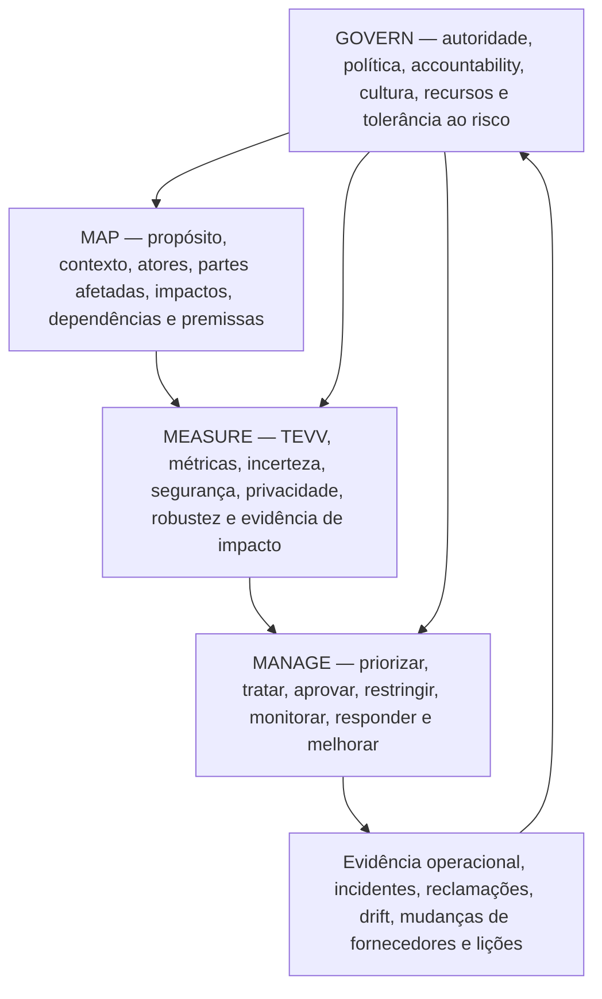
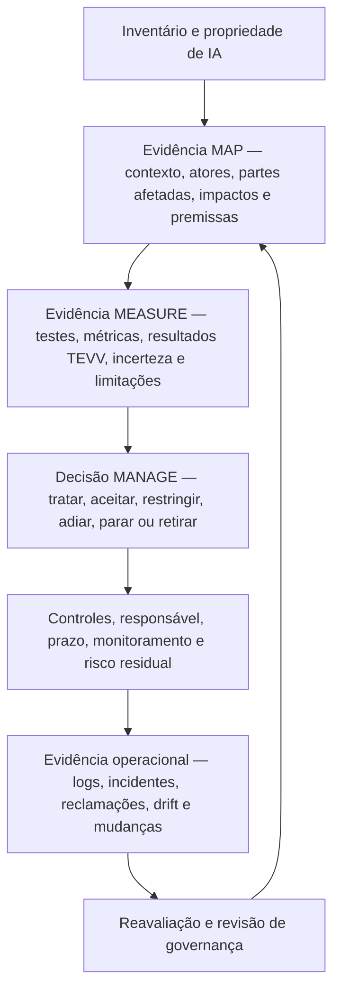

# Manual 03 — Caminhos de implementação do NIST AI RMF

**Linha de base controlada:** NIST AI RMF 1.0 (NIST AI 100-1), com NIST AI 600-1 aplicado quando IA generativa estiver no escopo.

> **Aviso de versão:** O NIST informa que o AI RMF 1.0 está sendo atualizado. Esta entrada de implementação está vinculada à linha de base atualmente publicada do AI RMF 1.0 e deve passar por análise de impacto quando o NIST publicar uma revisão.

## 1. Escolher o caminho de implementação com base em risco e complexidade

Não escolha um caminho apenas pelo número de empregados. Comece pelo caminho menos complexo que ainda consiga controlar o risco real de IA da organização, seu ciclo de vida, partes afetadas, exposição regulatória, autonomia, escala, dependência de terceiros e consequências potenciais.

```mermaid
flowchart TD
    A["Inventariar sistemas de IA, usos, atores e partes afetadas"] --> B{"Uma falha ou uso indevido poderia afetar materialmente pessoas, segurança, direitos, cibersegurança, finanças, emprego, serviços essenciais ou a organização?"]
    B -->|"Baixo e delimitado"| C["Caminho Essencial"]
    B -->|"Moderado, multifuncional ou voltado ao cliente"| D["Caminho Estruturado"]
    B -->|"Alto impacto, regulado, sensível à segurança, em grande escala ou complexo"| E["Caminho Aprimorado"]
    C --> F["Documentar contexto, responsável, avaliação mínima, decisão e monitoramento"]
    D --> G["Governança formal, gates do ciclo de vida, TEVV, controles de fornecedores e evidências"]
    E --> H["Desafio independente, TEVV mais profundo, análise de partes afetadas, monitoramento contínuo e decisões executivas de risco"]
```

**Explicação acessível:** Primeiro, inventarie os sistemas de IA e seu contexto. Usos de baixo risco e escopo limitado podem começar pelo caminho Essencial. Usos moderados, multifuncionais ou voltados ao cliente precisam do caminho Estruturado. Usos de alto impacto, regulados, sensíveis à segurança, em grande escala ou complexos exigem o caminho Aprimorado, com maior independência, avaliação, monitoramento e autoridade de decisão. A organização pode mover um sistema para um caminho mais rigoroso sempre que o risco ou a incerteza aumentar.

| Caminho | Contexto típico | Expectativa mínima de governança |
|---|---|---|
| **Essencial** | Organização pequena ou uso de IA delimitado, com consequências limitadas e dependências gerenciáveis | Responsável nomeado, inventário, contexto documentado, revisão básica de risco/impacto, uso aprovado, testes mínimos, orientação ao usuário, monitoramento e rota de incidentes |
| **Estruturado** | Organização de médio porte, IA voltada ao cliente, várias unidades de negócio, dependências materiais de dados/modelos ou impacto moderado | Política/governança formal de IA, revisão multifuncional, gates do ciclo de vida, TEVV documentado, controles de fornecedores, métricas, revisão de mudanças e reporte periódico à gestão |
| **Aprimorado** | Empresa grande ou complexa, uso regulado/sensível à segurança/de alto impacto, autonomia ou escala substancial ou consequência severa | Governança executiva de risco, desafio independente, TEVV mais profundo, participação de partes afetadas, red teaming quando apropriado, monitoramento contínuo, forte autoridade de fallback/parada e aceitação documentada do risco residual |

Escale acima do caminho padrão quando qualquer um destes fatores for material: crianças ou grupos vulneráveis; emprego, crédito, saúde, educação, segurança, aplicação da lei, serviços essenciais ou outras decisões consequenciais; ações autônomas; dados sensíveis ou em grande volume; opacidade de modelo/provedor; IA generativa ou agêntica com acesso a ferramentas; uso sensível à segurança; ampla exposição pública; obrigações legais ou contratuais significativas; incapacidade de reverter danos; ou evidência fraca de desempenho.

## 2. Construir um único ciclo operacional em torno de GOVERN, MAP, MEASURE e MANAGE

As funções do Core se reforçam mutuamente, não formando uma sequência executada apenas uma vez. A governança deve influenciar todas as demais funções, e novas evidências de medição ou operação devem atualizar o contexto e as decisões de gestão.



**Explicação acessível:** GOVERN estabelece accountability e autoridade de decisão ao longo do ciclo de vida. MAP descreve o contexto real e os impactos potenciais. MEASURE produz evidências por meio de testes, avaliação, verificação, validação, métricas e outras análises. MANAGE usa essas evidências para priorizar e tratar riscos e tomar decisões operacionais. Evidências operacionais, incidentes, reclamações, drift e mudanças de fornecedores retornam à governança e levam a novo mapeamento e nova medição.

### Ciclo operacional Essencial

1. Nomear o proprietário do negócio/sistema e o contato técnico responsável.
2. Registrar propósito, usuários, partes afetadas, dados, modelo/provedor, papel na decisão e usos proibidos.
3. Identificar benefícios plausíveis, danos, uso indevido, questões de segurança/privacidade, riscos de dependência e incerteza.
4. Testar o sistema contra um conjunto pequeno, porém relevante, de critérios de aceitação antes do uso aprovado.
5. Documentar a decisão: aprovar, aprovar com condições, piloto, restringir ou não usar.
6. Fornecer aos usuários instruções claras, expectativas de verificação, escalonamento e condições de parada.
7. Monitorar falhas-chave, reclamações, incidentes, mudanças de provedor/modelo e drift material.
8. Reavaliar após mudança material ou evidência de que as premissas estavam incorretas.

### Ciclo operacional Estruturado

Adicionar ao caminho Essencial:

- governança multifuncional e propriedade do risco;
- critérios de risco e autoridades de decisão documentados;
- gates do ciclo de vida para intake, design/aquisição, avaliação, implantação, operação, mudança e retirada;
- plano TEVV documentado com dados representativos e limiares explícitos;
- controle de versão e linhagem de modelo/dados/provedor;
- verificações de privacidade, cibersegurança, acessibilidade, supervisão humana e partes afetadas quando relevantes;
- due diligence de fornecedores e requisitos contratuais/de evidência;
- processos formais de incidente/reclamação e ação corretiva;
- métricas gerenciais e revisão periódica; e
- retenção controlada de evidências.

### Ciclo operacional Aprimorado

Adicionar ao caminho Estruturado:

- supervisão executiva ou do conselho para risco material de IA;
- validação/desafio independente proporcional à consequência;
- testes de cenário, estresse, adversariais, por subgrupos, uso indevido e modos de falha conforme aplicável;
- avaliação mais forte de fatores humanos e partes afetadas;
- controles explícitos de fallback, rollback, kill/stop, continuidade de negócios e alternativa manual;
- monitoramento contínuo ou quase contínuo dos principais riscos operacionais;
- aceitação formal de risco residual com prazo/condições de revisão;
- vigilância reforçada de fornecedor/subprocessador/mudança de modelo;
- exercícios para grandes incidentes de IA e comunicações; e
- análise em nível de portfólio de concentração, falha correlacionada e risco sistêmico.

## 3. Converter o Core em evidência, não em burocracia

Toda decisão material sobre risco de IA deve deixar uma cadeia rastreável do contexto à evidência e à ação.



**Explicação acessível:** A evidência começa com um inventário de IA com responsável definido, depois documenta contexto e impactos, testes e incerteza e a decisão de gestão resultante. Controles e risco residual são acompanhados durante a operação. Logs, incidentes, reclamações, drift e mudanças disparam reavaliação e revisão de governança. Uma política, por si só, não prova que o risco foi controlado.

Registro mínimo de evidência para um sistema material de IA:

| Área de evidência | Registro mínimo |
|---|---|
| Identidade | Nome do sistema/uso, responsável, estágio do ciclo de vida, versão, provedor/modelo, processo de negócio e status |
| Contexto | Propósito, usuários, partes afetadas, geografia, escala, papel na decisão, dependências e premissas |
| Risco/impacto | Cenários, benefícios, danos, uso indevido, severidade, probabilidade quando significativa, incerteza e grupos afetados |
| Medição | Método de avaliação, população/dados, versão, limiares, resultados, limitações, revisor e data |
| Tratamento | Controles, condições, restrições, supervisão humana, ações de fornecedores e remediação |
| Decisão | Aprovador autorizado, decisão de aprovar/restringir/pilotar/parar, risco residual, condições e expiração/gatilho de revisão |
| Operação | Medidas de monitoramento, reclamações, incidentes, drift, mudanças de provedor/modelo e evidência da operação do controle |
| Melhoria | Ação corretiva, reteste, lições aprendidas e atualizações de governança, contexto, medições ou tratamento |

## 4. Aplicar NIST AI 600-1 quando IA generativa estiver no escopo

IA generativa não deve ser tratada como um sistema de governança completamente separado. Aplique o modelo operacional geral do AI RMF e depois acrescente análise e controles específicos de GenAI proporcionais ao uso.

No mínimo, avalie quando relevante:

- confabulação ou saída sem suporte;
- conteúdo prejudicial, ilegal, inseguro ou em violação de políticas;
- problemas de integridade e proveniência da informação;
- privacidade e exposição de dados sensíveis;
- propriedade intelectual e origem do conteúdo;
- prompt injection, abuso de ferramentas, data poisoning e outras ameaças de segurança;
- extração de modelo, abuso, agência excessiva e automação insegura;
- opacidade e risco de mudança de modelo fundacional/provedor de serviços de terceiros;
- confiança humana excessiva, automation bias e revisão inadequada;
- uso indevido em escala e facilitação de abuso;
- limitações de avaliação, contaminação de benchmark e baixa transferência de teste para produção; e
- monitoramento de prompts, saídas e traces com controles apropriados de privacidade e acesso.

Para GenAI agêntica ou que use ferramentas, adicione limites explícitos de autorização, menor privilégio, limites de transação, gates de confirmação, isolamento de ambiente, allowlists de ferramentas, bloqueios de ações de alto risco, logging, rollback e controles de parada de emergência.

## 5. Integrar com a governança existente em vez de duplicá-la

O Manual 03 deve reutilizar sistemas de evidência e decisão quando forem adequados ao propósito.

| Capacidade existente | Integração com AI RMF |
|---|---|
| Gestão de riscos corporativos | Critérios de risco de IA, agregação, aceitação de risco residual e escalonamento |
| Programa de segurança / NIST CSF | Identidade, acesso, logging, vulnerabilidade, incidente, resiliência e cadeia de suprimentos |
| Programa de privacidade | Finalidade de dados, minimização, direitos, risco de privacidade, avisos, retenção e reclamações |
| Produto / SDLC | Requisitos, gates do ciclo de vida, testes, release, mudança e retirada |
| Governança de dados | Propriedade, qualidade, proveniência, acesso, retenção e linhagem |
| Risco de fornecedores | Due diligence de modelo/serviço, contratos, mudanças, incidentes, evidência e saída |
| Qualidade / segurança | Verificação, validação, análise de falhas, ação corretiva e melhoria contínua |
| Auditoria interna / assurance | Teste independente de governança, evidência, desenho e operação de controles |
| ISO/IEC 42001 | Estrutura de sistema de gestão, operação documentada de controles, auditoria/revisão e melhoria |
| EU AI Act / legislação setorial | Aplicabilidade vinculante e obrigações legais mantidas separadas da orientação voluntária do NIST |

Não afirme que implementar o AI RMF estabelece automaticamente conformidade com ISO/IEC 42001 ou conformidade legal. Crosswalks são ferramentas de reutilização de evidências, não afirmações de equivalência.

## 6. Definir gates de decisão e condições de parada

Toda organização deve definir quem pode tomar decisões materiais sobre IA e quando o uso deve ser pausado.

Resultados típicos de decisão:

- **Aprovar:** a evidência atende aos critérios atuais e o risco residual está dentro da autoridade.
- **Aprovar com condições:** uso limitado é permitido com restrições explícitas, monitoramento e expiração/revisão.
- **Piloto:** a incerteza é alta demais para uso amplo; aprova-se um experimento delimitado para gerar evidência.
- **Remediar antes do uso:** lacunas materiais de controle ou evidência devem ser encerradas primeiro.
- **Restringir:** reduz-se escopo, população, autonomia, dados ou funcionalidade.
- **Parar/reverter:** dano real ou plausível excede a tolerância, controles críticos falham ou operação segura não pode ser demonstrada.
- **Retirar:** o sistema é removido e dependências, dados, identidades, contratos e registros são tratados por uma saída controlada.

Exemplos de gatilhos automáticos de revisão/parada devem incluir incidentes severos; mudanças materiais de modelo/provedor; exposição não autorizada de dados; comprometimento de segurança; degradação material de desempenho ou de subgrupos; saídas prejudiciais repetidas; reclamações significativas; novas populações ou geografias afetadas; expansão para decisões consequenciais; perda da supervisão humana exigida; evidência de fornecedor expirada; ou nova obrigação vinculante que afete o uso.

## 7. Medir se a gestão de risco de IA está melhorando

As métricas devem responder perguntas gerenciais, não premiar volume de documentação.

Exemplos úteis incluem:

- percentual de usos ativos de IA reconciliados a um responsável e nível de risco atuais;
- tempo entre intake/mudança material e decisão de risco aprovada;
- percentual de sistemas materiais com evidência de avaliação atual vinculada à versão implantada;
- falhas de avaliação de alta severidade não resolvidas e sua idade;
- incidentes, reclamações, overrides, recursos e padrões repetidos de falha;
- medidas de drift/desempenho/segurança/privacidade vinculadas a limiares de ação;
- percentual de fornecedores críticos de IA com evidência atual e mudanças materiais revisadas;
- aprovações de risco residual ou exceções vencidas;
- ações corretivas retestadas quanto à efetividade dentro de metas baseadas em risco; e
- sistemas parados, restringidos ou redesenhados porque a evidência não sustentava o uso continuado.

Uma métrica é útil apenas quando a gestão sabe qual decisão ou ação ela deve acionar.

## 8. Manter a linha de base atual sem alterar silenciosamente o manual

Como o NIST anunciou uma revisão do AI RMF, o Manual 03 deve distinguir **monitoramento de fonte** de **adoção de fonte**.

Quando o NIST publicar uma nova versão do AI RMF:

1. congelar o candidato de release atual do Manual 03;
2. verificar a publicação final exata do NIST e seu estado efetivo de publicação;
3. comparar o novo framework com a linha de base controlada do AI RMF 1.0;
4. classificar mudanças como editoriais, terminologia, estruturais, de resultado/ação, implementação, crosswalk ou impactos de assurance;
5. identificar capítulos, templates, gráficos, traduções e controles de QA afetados;
6. atualizar primeiro a fonte controlada em inglês;
7. realizar revisão semântica humana das mudanças localizadas;
8. regenerar os artefatos de release; e
9. publicar um histórico de mudanças claro em vez de sobrescrever orientação anterior sem explicação.

**Limite de assurance:** A aprovação do gate do repositório do Manual 03 validará estrutura controlada, estado das fontes, acessibilidade e expectativas de evidência. Ela não certificará uma organização, determinará conformidade legal, garantirá IA confiável, eliminará risco nem constituirá uma opinião de auditoria.
