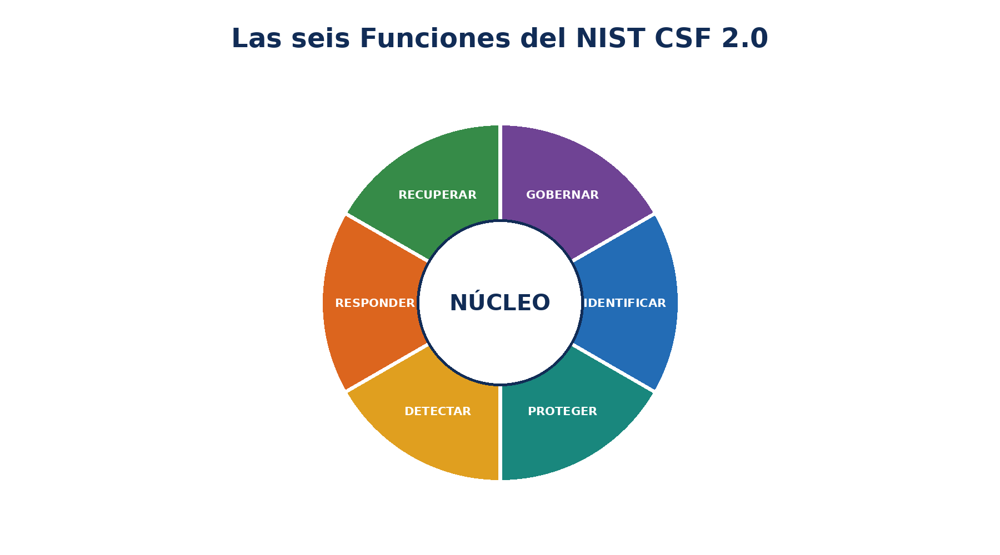
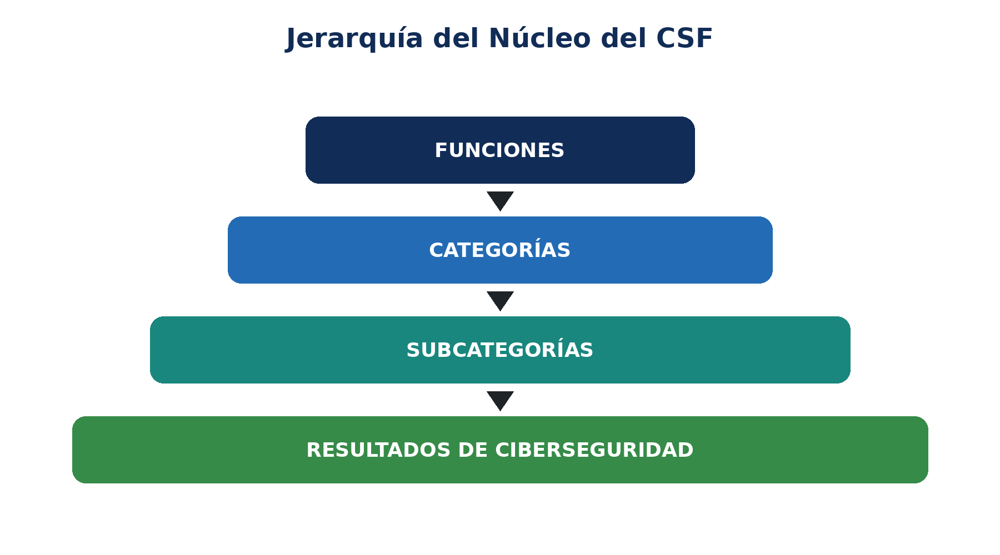
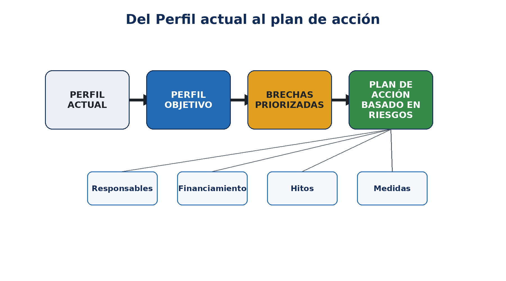
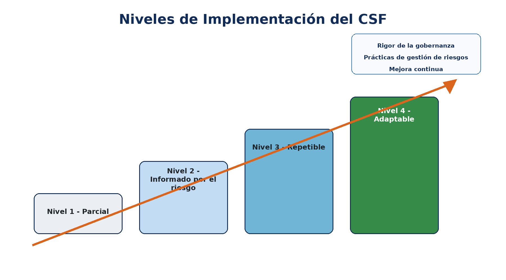
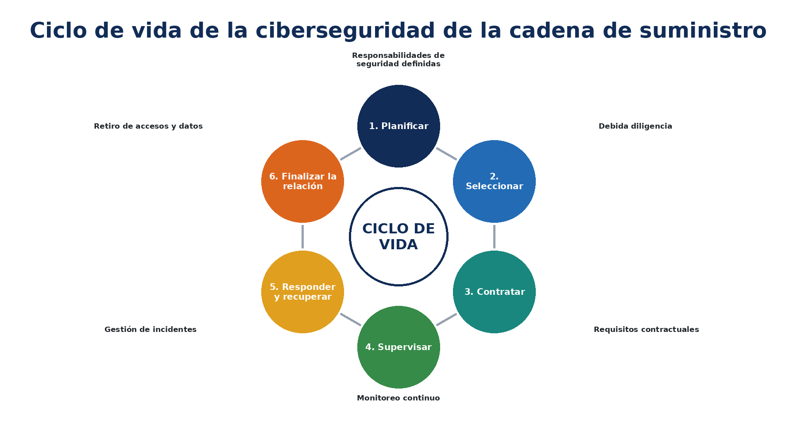
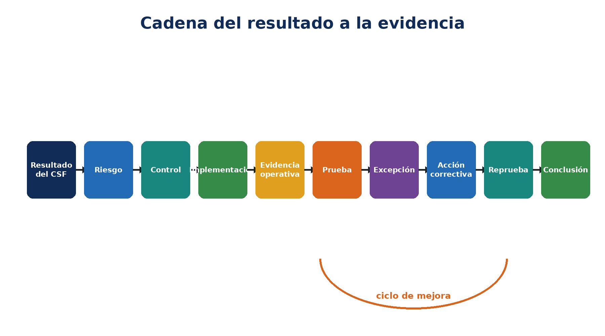
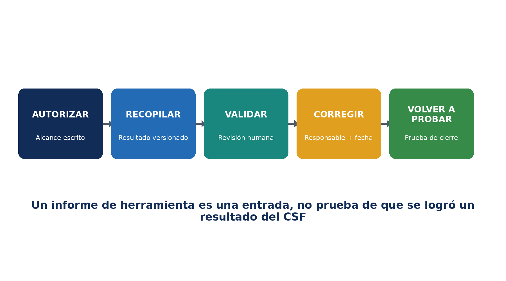
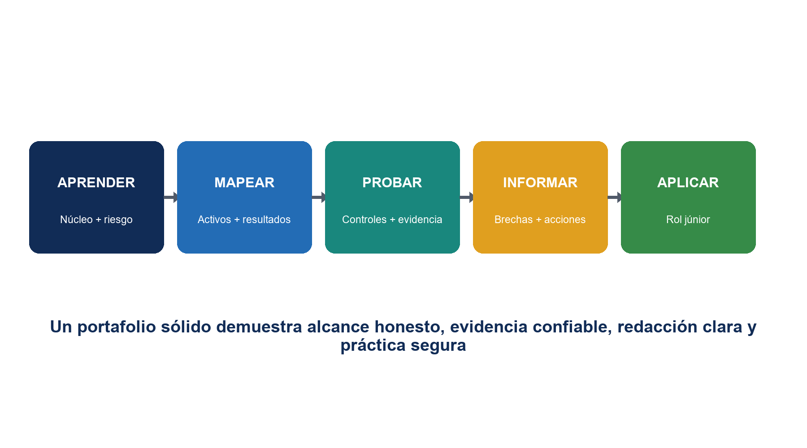

# NIST Cybersecurity Framework 2.0

## GRC práctico, implementación, evidencia y herramientas de código abierto

*Manual de trabajo para gerentes, analistas junior, estudiantes, personas en transición profesional y equipos de ciberseguridad*

**Alberto (Al) Leiva**

Primera edición • Julio de 2026

| **Contenido:** Los 106 resultados del Núcleo del CSF • Perfiles • Tiers • GRC • cadena de suministro • evidencia • pruebas de controles • herramientas de código abierto • laboratorios • preparación profesional |
|---|

# Aviso de publicación y uso

Autor: Alberto (Al) Leiva

Edición: Primera edición, julio de 2026

Propósito: Ofrecer educación gratuita y práctica para gerentes, analistas junior, estudiantes, personas en transición profesional, profesionales de riesgos y especialistas en ciberseguridad.

## Aviso educativo

Este manual proporciona información educativa general. No constituye una certificación, cumplimiento legal, una opinión de auditoría ni una garantía de seguridad. Cada organización debe adaptar el NIST CSF a su misión, riesgos, obligaciones, apetito de riesgo, recursos, tecnologías y partes interesadas. Para tomar decisiones reales, utilice fuentes oficiales vigentes y asesoramiento cualificado en materia legal, de riesgos, privacidad, seguridad física, auditoría y tecnología.

## Uso ético y autorizado

Utilice herramientas técnicas únicamente en sistemas, aplicaciones, redes, cuentas en la nube y datos que le pertenezcan o para los cuales tenga autorización específica por escrito. En actividades de formación, utilice datos ficticios, sintéticos o aprobados. La capacidad técnica no constituye autorización.

# Prefacio

*Una introducción accesible a la gestión práctica del riesgo de ciberseguridad.*

El trabajo de ciberseguridad puede parecer una colección de productos, alertas, políticas y tareas técnicas. El NIST Cybersecurity Framework ofrece un lenguaje común para conectar esas actividades. Ayuda a los líderes a explicar qué resultados son importantes, a los gerentes a establecer prioridades y a los profesionales a relacionar el trabajo diario con el riesgo organizacional.

El CSF 2.0 es deliberadamente flexible. No exige que todas las organizaciones compren la misma herramienta, implementen el mismo control o alcancen el mismo Tier. Describe resultados. Un hospital, una empresa manufacturera, una escuela, un banco, una startup, una agencia gubernamental o una organización sin fines de lucro pueden utilizar el mismo Núcleo y, al mismo tiempo, elegir prioridades e implementaciones diferentes.

Este manual adopta un enfoque centrado primero en la metodología. Una hoja de cálculo de un marco solo es útil cuando el alcance es preciso. Un tablero en verde solo es útil cuando la evidencia es confiable. El resultado de un escáner solo es útil cuando alguien lo valida, prioriza, corrige y vuelve a probar. Los gerentes siguen siendo responsables de las decisiones; los analistas mejoran esas decisiones al reunir hechos completos y comunicarlos con claridad.

# Cómo utilizar este manual

Los gerentes deberían comenzar por los capítulos 1–3 y 10–17, además de las plantillas del capítulo 22.

Los analistas junior deberían estudiar los seis capítulos dedicados a las Funciones, el método de verificación, las herramientas, el laboratorio y la preparación para entrevistas.

Los equipos técnicos deberían relacionar los hallazgos con activos, riesgos, resultados del CSF, implementación, responsables, evidencia y acciones correctivas.

Los equipos legales, de privacidad, seguridad física, tecnología operacional y negocio deberían revisar las decisiones que afecten sus responsabilidades.

| **Tabla de contenido real de Word:** La guía de capítulos incluye números de página específicos de la edición una vez finalizada la representación. El documento también contiene un campo nativo de tabla de contenido de Word. Después de editar, haga clic con el botón derecho sobre el campo, seleccione **Actualizar campo** y luego **Actualizar toda la tabla**. |
|---|

# 1. Fundamentos del NIST CSF 2.0

*Qué es el marco, qué cambió y qué no afirma.*

Figura 1. Las seis Funciones del NIST CSF 2.0

## 1.1 Qué es el CSF 2.0

NIST publicó el CSF 2.0 el 26 de febrero de 2024. Está diseñado para organizaciones de cualquier tamaño, sector y nivel de sofisticación técnica. Sus resultados son neutrales respecto del país, el sector y la tecnología. Una organización puede adoptarlo voluntariamente o porque una política, un contrato, un regulador, un cliente o una norma interna así lo requieran.

## 1.2 Qué cambió respecto del CSF 1.1

- **GOVERN** se convirtió en la sexta Función, colocando el liderazgo, la política, el riesgo empresarial y la rendición de cuentas en el centro del marco.
- La ciberseguridad de la cadena de suministro recibió mayor énfasis.
- El lenguaje se amplió más allá de la infraestructura crítica para que el marco sirva claramente a todo tipo de organizaciones.
- Los Perfiles, los Tiers, los Ejemplos de Implementación, las Referencias Informativas y las Guías de Inicio Rápido forman ahora una cartera más amplia de recursos del CSF.
- Algunas numeraciones de Subcategorías contienen espacios intencionales porque ciertos contenidos del CSF 1.1 se trasladaron dentro del CSF 2.0.

## 1.3 Qué no es el CSF 2.0

- No es, por sí mismo, una ley.
- No es un catálogo único de controles ni una lista obligatoria de tecnologías.
- No proporciona una puntuación universal de aprobado o reprobado.
- NIST no certifica organizaciones, productos, consultores ni evaluadores con respecto al CSF.
- Un Tier alto no es automáticamente el objetivo adecuado para todos los alcances.
- Relacionar una práctica con un resultado del CSF no demuestra que ese resultado se haya alcanzado.

# 2. Núcleo, Perfiles, Tiers y recursos de apoyo

*Los componentes del CSF 2.0 y cómo se relacionan entre sí.*

Figura 2. Jerarquía del Núcleo del CSF

| **Componente** | **Propósito** | **Uso práctico** |
|---|---|---|
| Núcleo | Jerarquía de seis Funciones, 22 Categorías y 106 Subcategorías | Describir los resultados de ciberseguridad deseados |
| Perfil Organizacional | Resultados actuales y/o objetivo para un alcance definido | Comparar la postura, priorizar brechas y planificar el trabajo |
| Perfil Comunitario | Línea de base compartida de resultados para un sector, tecnología, amenaza o caso de uso | Utilizarla como insumo para el Perfil Objetivo de una organización |
| Tiers | Contexto sobre el rigor de las prácticas de gobernanza y gestión de riesgos | Caracterizar las condiciones del Perfil Actual y del Perfil Objetivo |
| Ejemplos de Implementación | Acciones orientativas que pueden ayudar a alcanzar resultados | Generar ideas, adaptarlas y validarlas |
| Referencias Informativas | Correspondencias con normas, guías, regulaciones y otras fuentes | Seleccionar prácticas y controles más detallados |
| Guías de Inicio Rápido | Orientación breve y práctica sobre usos específicos del CSF | Iniciar trabajos sobre Perfiles, Tiers, ERM, cadena de suministro y pequeñas empresas |

| **Cifras importantes:** El CSF 2.0 contiene 6 Funciones, 22 Categorías y 106 Subcategorías. Las Subcategorías describen resultados; no exigen productos específicos ni implementaciones idénticas. |
|---|

# 3. Hoja de ruta práctica de implementación

*Una forma repetible de pasar del lenguaje del marco a mejoras financiadas.*

- Designe un patrocinador ejecutivo y un responsable del programa.
- Defina el alcance del Perfil: empresa, unidad de negocio, producto, servicio, sistema, región o ecosistema de proveedores.
- Reúna información sobre la misión, las partes interesadas, las obligaciones legales y contractuales, los riesgos, activos, amenazas, incidentes, auditorías, personal y proveedores.
- Seleccione los resultados del CSF aplicables y cree un Perfil Actual utilizando evidencia confiable.
- Defina un Perfil Objetivo basado en el riesgo, teniendo en cuenta los Perfiles Comunitarios y las obligaciones aplicables.
- Analice brechas, dependencias, costos, viabilidad y reducción del riesgo.
- Cree un plan de acción aprobado con responsables, recursos, hitos, métricas y medidas de protección provisionales.
- Implemente controles y procedimientos operativos.
- Pruebe la eficacia del diseño y la eficacia operativa utilizando poblaciones completas y muestras representativas.
- Informe sobre riesgos, decisiones, excepciones, avances y limitaciones.
- Actualice los Perfiles después de cambios importantes, incidentes, ejercicios, revisiones o variaciones del riesgo.

| **Comience con un alcance pequeño sin perder integridad:** Una organización pequeña puede empezar por un servicio crítico o un proceso de alto riesgo. Mantenga un alcance transparente, documente las exclusiones y amplíelo de forma deliberada. |
|---|

# 4. Función GOBERNAR

*Desglose completo y en lenguaje claro de cada Categoría y Subcategoría de GOBERNAR.*

| **Propósito de la Función:** Establecer dirección, expectativas, rendición de cuentas, políticas, supervisión y gestión del riesgo de la cadena de suministro. |
|---|

## Contexto organizacional (GV.OC)

| **Resultado** | **Significado en lenguaje claro** | **Verificación del gerente o analista** | **Ejemplos de evidencia** |
|---|---|---|---|
| GV.OC-01 | Vincular las decisiones de ciberseguridad con la misión de la organización. | Confirmar responsable, alcance, implementación, revisión, excepciones, acciones correctivas y operación repetible. | registros de misión y partes interesadas, registro de obligaciones, mapa de dependencias |
| GV.OC-02 | Identificar a las partes interesadas y considerar sus expectativas de ciberseguridad. | Confirmar responsable, alcance, implementación, revisión, excepciones, acciones correctivas y operación repetible. | registros de misión y partes interesadas, registro de obligaciones, mapa de dependencias |
| GV.OC-03 | Identificar y gestionar obligaciones legales, regulatorias, contractuales, de privacidad y libertades civiles. | Confirmar responsable, alcance, implementación, revisión, excepciones, acciones correctivas y operación repetible. | registros de misión y partes interesadas, registro de obligaciones, mapa de dependencias |
| GV.OC-04 | Comprender y comunicar los servicios críticos que otras partes esperan de la organización. | Confirmar responsable, alcance, implementación, revisión, excepciones, acciones correctivas y operación repetible. | registros de misión y partes interesadas, registro de obligaciones, mapa de dependencias |
| GV.OC-05 | Comprender y comunicar los resultados, capacidades y servicios externos de los que depende la organización. | Confirmar responsable, alcance, implementación, revisión, excepciones, acciones correctivas y operación repetible. | registros de misión y partes interesadas, registro de obligaciones, mapa de dependencias |

> **Importante:** Los resultados del CSF no son una lista de tecnologías obligatorias. Seleccione métodos de implementación y controles de acuerdo con el riesgo, la misión, las obligaciones, los recursos y el Perfil Objetivo definido.

## Estrategia de gestión de riesgos (GV.RM)

| **Resultado** | **Significado en lenguaje claro** | **Verificación del gerente o analista** | **Ejemplos de evidencia** |
|---|---|---|---|
| GV.RM-01 | Acordar objetivos de gestión del riesgo de ciberseguridad con las partes interesadas pertinentes. | Confirmar responsable, alcance, implementación, revisión, excepciones, acciones correctivas y operación repetible. | apetito de riesgo, metodología, registro de riesgos empresariales, rutas de reporte |
| GV.RM-02 | Establecer, comunicar y mantener declaraciones de apetito y tolerancia al riesgo. | Confirmar responsable, alcance, implementación, revisión, excepciones, acciones correctivas y operación repetible. | apetito de riesgo, metodología, registro de riesgos empresariales, rutas de reporte |
| GV.RM-03 | Integrar el riesgo de ciberseguridad en los procesos de gestión de riesgos empresariales. | Confirmar responsable, alcance, implementación, revisión, excepciones, acciones correctivas y operación repetible. | apetito de riesgo, metodología, registro de riesgos empresariales, rutas de reporte |
| GV.RM-04 | Definir y comunicar opciones aceptables de respuesta al riesgo. | Confirmar responsable, alcance, implementación, revisión, excepciones, acciones correctivas y operación repetible. | apetito de riesgo, metodología, registro de riesgos empresariales, rutas de reporte |
| GV.RM-05 | Establecer canales de comunicación para riesgos cibernéticos, incluidos los de proveedores y terceros. | Confirmar responsable, alcance, implementación, revisión, excepciones, acciones correctivas y operación repetible. | apetito de riesgo, metodología, registro de riesgos empresariales, rutas de reporte |
| GV.RM-06 | Usar un método coherente para calcular, documentar, categorizar y priorizar riesgos cibernéticos. | Confirmar responsable, alcance, implementación, revisión, excepciones, acciones correctivas y operación repetible. | apetito de riesgo, metodología, registro de riesgos empresariales, rutas de reporte |
| GV.RM-07 | Incluir oportunidades beneficiosas y riesgo positivo en las conversaciones de ciberseguridad. | Confirmar responsable, alcance, implementación, revisión, excepciones, acciones correctivas y operación repetible. | apetito de riesgo, metodología, registro de riesgos empresariales, rutas de reporte |

## Roles, responsabilidades y autoridades (GV.RR)

| **Resultado** | **Significado en lenguaje claro** | **Verificación del gerente o analista** | **Ejemplos de evidencia** |
|---|---|---|---|
| GV.RR-01 | La dirección acepta la responsabilidad por el riesgo de ciberseguridad y promueve una cultura ética y de mejora continua. | Confirmar responsable, alcance, implementación, revisión, excepciones, acciones correctivas y operación repetible. | matriz RACI, descripciones de puesto, presupuesto, registros de personal |
| GV.RR-02 | Establecer, comunicar, comprender y hacer cumplir roles, responsabilidades y autoridad en ciberseguridad. | Confirmar responsable, alcance, implementación, revisión, excepciones, acciones correctivas y operación repetible. | matriz RACI, descripciones de puesto, presupuesto, registros de personal |
| GV.RR-03 | Asignar personas, presupuesto, tecnología y tiempo de acuerdo con la estrategia y las políticas de riesgo. | Confirmar responsable, alcance, implementación, revisión, excepciones, acciones correctivas y operación repetible. | matriz RACI, descripciones de puesto, presupuesto, registros de personal |
| GV.RR-04 | Incorporar responsabilidades de ciberseguridad en las prácticas de recursos humanos. | Confirmar responsable, alcance, implementación, revisión, excepciones, acciones correctivas y operación repetible. | matriz RACI, descripciones de puesto, presupuesto, registros de personal |

## Política (GV.PO)

| **Resultado** | **Significado en lenguaje claro** | **Verificación del gerente o analista** | **Ejemplos de evidencia** |
|---|---|---|---|
| GV.PO-01 | Establecer, comunicar y hacer cumplir la política de ciberseguridad según el contexto, la estrategia y las prioridades. | Confirmar responsable, alcance, implementación, revisión, excepciones, acciones correctivas y operación repetible. | política aprobada, acuses de recibo, historial de revisión, registros de cumplimiento |
| GV.PO-02 | Revisar y actualizar la política cuando cambien los requisitos, las amenazas, la tecnología o la misión. | Confirmar responsable, alcance, implementación, revisión, excepciones, acciones correctivas y operación repetible. | política aprobada, acuses de recibo, historial de revisión, registros de cumplimiento |

## Supervisión (GV.OV)

| **Resultado** | **Significado en lenguaje claro** | **Verificación del gerente o analista** | **Ejemplos de evidencia** |
|---|---|---|---|
| GV.OV-01 | Revisar los resultados de la estrategia y usarlos para ajustar la dirección. | Confirmar responsable, alcance, implementación, revisión, excepciones, acciones correctivas y operación repetible. | tablero, actas, decisiones, cambios de estrategia |
| GV.OV-02 | Ajustar la estrategia de riesgo cuando los requisitos o riesgos no estén plenamente cubiertos. | Confirmar responsable, alcance, implementación, revisión, excepciones, acciones correctivas y operación repetible. | tablero, actas, decisiones, cambios de estrategia |
| GV.OV-03 | Evaluar el desempeño de ciberseguridad y determinar los cambios necesarios. | Confirmar responsable, alcance, implementación, revisión, excepciones, acciones correctivas y operación repetible. | tablero, actas, decisiones, cambios de estrategia |

## Gestión del riesgo de ciberseguridad en la cadena de suministro (GV.SC)

| **Resultado** | **Significado en lenguaje claro** | **Verificación del gerente o analista** | **Ejemplos de evidencia** |
|---|---|---|---|
| GV.SC-01 | Establecer un programa, estrategia, objetivos, políticas y procesos acordados para el riesgo de la cadena de suministro. | Confirmar responsable, alcance, implementación, revisión, excepciones, acciones correctivas y operación repetible. | inventario de proveedores, clasificación, debida diligencia, contratos, monitoreo, evidencia de salida |
| GV.SC-02 | Coordinar los roles de ciberseguridad de proveedores, clientes, socios y responsables internos. | Confirmar responsable, alcance, implementación, revisión, excepciones, acciones correctivas y operación repetible. | inventario de proveedores, clasificación, debida diligencia, contratos, monitoreo, evidencia de salida |
| GV.SC-03 | Integrar el riesgo de la cadena de suministro en la ciberseguridad, ERM, evaluaciones y mejora. | Confirmar responsable, alcance, implementación, revisión, excepciones, acciones correctivas y operación repetible. | inventario de proveedores, clasificación, debida diligencia, contratos, monitoreo, evidencia de salida |
| GV.SC-04 | Conocer a los proveedores y priorizarlos según su criticidad. | Confirmar responsable, alcance, implementación, revisión, excepciones, acciones correctivas y operación repetible. | inventario de proveedores, clasificación, debida diligencia, contratos, monitoreo, evidencia de salida |
| GV.SC-05 | Incluir requisitos de ciberseguridad priorizados en contratos y acuerdos. | Confirmar responsable, alcance, implementación, revisión, excepciones, acciones correctivas y operación repetible. | inventario de proveedores, clasificación, debida diligencia, contratos, monitoreo, evidencia de salida |
| GV.SC-06 | Realizar planificación y debida diligencia antes de iniciar relaciones con terceros. | Confirmar responsable, alcance, implementación, revisión, excepciones, acciones correctivas y operación repetible. | inventario de proveedores, clasificación, debida diligencia, contratos, monitoreo, evidencia de salida |
| GV.SC-07 | Registrar, evaluar, responder y monitorear riesgos de proveedores, productos, servicios y terceros. | Confirmar responsable, alcance, implementación, revisión, excepciones, acciones correctivas y operación repetible. | inventario de proveedores, clasificación, debida diligencia, contratos, monitoreo, evidencia de salida |
| GV.SC-08 | Incluir a terceros pertinentes en la planificación, respuesta y recuperación de incidentes. | Confirmar responsable, alcance, implementación, revisión, excepciones, acciones correctivas y operación repetible. | inventario de proveedores, clasificación, debida diligencia, contratos, monitoreo, evidencia de salida |
| GV.SC-09 | Monitorear la seguridad de la cadena de suministro durante el ciclo de vida de productos y servicios tecnológicos. | Confirmar responsable, alcance, implementación, revisión, excepciones, acciones correctivas y operación repetible. | inventario de proveedores, clasificación, debida diligencia, contratos, monitoreo, evidencia de salida |
| GV.SC-10 | Planificar actividades de seguridad para el cierre de una asociación o acuerdo de servicio. | Confirmar responsable, alcance, implementación, revisión, excepciones, acciones correctivas y operación repetible. | inventario de proveedores, clasificación, debida diligencia, contratos, monitoreo, evidencia de salida |

# 5. Función IDENTIFICAR

*Desglose completo y en lenguaje claro de cada Categoría y Subcategoría de IDENTIFICAR.*

| **Propósito de la Función:** Comprender activos, dependencias, amenazas, vulnerabilidades, riesgos y necesidades de mejora. |
|---|

## Gestión de activos (ID.AM)

| **Resultado** | **Significado en lenguaje claro** | **Verificación del gerente o analista** | **Ejemplos de evidencia** |
|---|---|---|---|
| ID.AM-01 | Mantener un inventario del hardware administrado. | Confirmar responsable, alcance, implementación, revisión, excepciones, acciones correctivas y operación repetible. | inventarios de activos y datos, responsables, diagramas, registros del ciclo de vida |
| ID.AM-02 | Mantener un inventario del software, los servicios y los sistemas administrados. | Confirmar responsable, alcance, implementación, revisión, excepciones, acciones correctivas y operación repetible. | inventarios de activos y datos, responsables, diagramas, registros del ciclo de vida |
| ID.AM-03 | Mantener diagramas actualizados de comunicaciones de red y flujos de datos autorizados. | Confirmar responsable, alcance, implementación, revisión, excepciones, acciones correctivas y operación repetible. | inventarios de activos y datos, responsables, diagramas, registros del ciclo de vida |
| ID.AM-04 | Mantener un inventario de los servicios proporcionados por proveedores. | Confirmar responsable, alcance, implementación, revisión, excepciones, acciones correctivas y operación repetible. | inventarios de activos y datos, responsables, diagramas, registros del ciclo de vida |
| ID.AM-05 | Priorizar activos según clasificación, criticidad, recursos e impacto en la misión. | Confirmar responsable, alcance, implementación, revisión, excepciones, acciones correctivas y operación repetible. | inventarios de activos y datos, responsables, diagramas, registros del ciclo de vida |
| ID.AM-07 | Inventariar tipos de datos designados y sus metadatos. | Confirmar responsable, alcance, implementación, revisión, excepciones, acciones correctivas y operación repetible. | inventarios de activos y datos, responsables, diagramas, registros del ciclo de vida |
| ID.AM-08 | Gestionar sistemas, hardware, software, servicios y datos durante todo su ciclo de vida. | Confirmar responsable, alcance, implementación, revisión, excepciones, acciones correctivas y operación repetible. | inventarios de activos y datos, responsables, diagramas, registros del ciclo de vida |

## Evaluación de riesgos (ID.RA)

| **Resultado** | **Significado en lenguaje claro** | **Verificación del gerente o analista** | **Ejemplos de evidencia** |
|---|---|---|---|
| ID.RA-01 | Identificar, validar y registrar vulnerabilidades de los activos. | Confirmar responsable, alcance, implementación, revisión, excepciones, acciones correctivas y operación repetible. | registros de amenazas y vulnerabilidades, análisis de riesgo, tratamiento y excepciones |
| ID.RA-02 | Recibir inteligencia de amenazas cibernéticas de fuentes de intercambio apropiadas. | Confirmar responsable, alcance, implementación, revisión, excepciones, acciones correctivas y operación repetible. | registros de amenazas y vulnerabilidades, análisis de riesgo, tratamiento y excepciones |
| ID.RA-03 | Identificar y registrar amenazas internas y externas. | Confirmar responsable, alcance, implementación, revisión, excepciones, acciones correctivas y operación repetible. | registros de amenazas y vulnerabilidades, análisis de riesgo, tratamiento y excepciones |
| ID.RA-04 | Estimar la probabilidad y el impacto de que las amenazas exploten vulnerabilidades. | Confirmar responsable, alcance, implementación, revisión, excepciones, acciones correctivas y operación repetible. | registros de amenazas y vulnerabilidades, análisis de riesgo, tratamiento y excepciones |
| ID.RA-05 | Usar amenazas, vulnerabilidades, probabilidad e impacto para comprender el riesgo inherente y las prioridades. | Confirmar responsable, alcance, implementación, revisión, excepciones, acciones correctivas y operación repetible. | registros de amenazas y vulnerabilidades, análisis de riesgo, tratamiento y excepciones |
| ID.RA-06 | Seleccionar, priorizar, planificar, dar seguimiento y comunicar respuestas al riesgo. | Confirmar responsable, alcance, implementación, revisión, excepciones, acciones correctivas y operación repetible. | registros de amenazas y vulnerabilidades, análisis de riesgo, tratamiento y excepciones |
| ID.RA-07 | Evaluar, registrar, aprobar y dar seguimiento al efecto de cambios y excepciones sobre el riesgo. | Confirmar responsable, alcance, implementación, revisión, excepciones, acciones correctivas y operación repetible. | registros de amenazas y vulnerabilidades, análisis de riesgo, tratamiento y excepciones |
| ID.RA-08 | Establecer un proceso para recibir, analizar y responder a divulgaciones de vulnerabilidades. | Confirmar responsable, alcance, implementación, revisión, excepciones, acciones correctivas y operación repetible. | registros de amenazas y vulnerabilidades, análisis de riesgo, tratamiento y excepciones |
| ID.RA-09 | Evaluar la autenticidad e integridad del hardware y software antes de su adquisición y uso. | Confirmar responsable, alcance, implementación, revisión, excepciones, acciones correctivas y operación repetible. | registros de amenazas y vulnerabilidades, análisis de riesgo, tratamiento y excepciones |
| ID.RA-10 | Evaluar a proveedores críticos antes de la adquisición. | Confirmar responsable, alcance, implementación, revisión, excepciones, acciones correctivas y operación repetible. | registros de amenazas y vulnerabilidades, análisis de riesgo, tratamiento y excepciones |

## Mejora (ID.IM)

| **Resultado** | **Significado en lenguaje claro** | **Verificación del gerente o analista** | **Ejemplos de evidencia** |
|---|---|---|---|
| ID.IM-01 | Identificar mejoras a partir de evaluaciones. | Confirmar responsable, alcance, implementación, revisión, excepciones, acciones correctivas y operación repetible. | evaluaciones, ejercicios, lecciones aprendidas, acciones correctivas, planes actualizados |
| ID.IM-02 | Identificar mejoras a partir de pruebas y ejercicios, incluidos ejercicios coordinados con terceros. | Confirmar responsable, alcance, implementación, revisión, excepciones, acciones correctivas y operación repetible. | evaluaciones, ejercicios, lecciones aprendidas, acciones correctivas, planes actualizados |
| ID.IM-03 | Identificar mejoras durante la operación de procesos, procedimientos y actividades. | Confirmar responsable, alcance, implementación, revisión, excepciones, acciones correctivas y operación repetible. | evaluaciones, ejercicios, lecciones aprendidas, acciones correctivas, planes actualizados |
| ID.IM-04 | Establecer, comunicar, mantener y mejorar planes de respuesta a incidentes y de ciberseguridad operativa. | Confirmar responsable, alcance, implementación, revisión, excepciones, acciones correctivas y operación repetible. | evaluaciones, ejercicios, lecciones aprendidas, acciones correctivas, planes actualizados |

> **Estado:** Traducción humana revisada para integración. Conserva los identificadores oficiales del NIST CSF 2.0. Este archivo sustituye únicamente el contenido textual de los capítulos 6–9; la edición completa todavía requiere integración, regeneración de DOCX/PDF y revisión visual.

# 6. Función PROTEGER

*Desglose completo, en lenguaje claro, de cada Categoría y Subcategoría de PROTEGER.*

| **Propósito de la Función:** Aplicar salvaguardas que reduzcan la probabilidad y el impacto de los eventos de ciberseguridad. |
|---|

## Gestión de identidades, autenticación y control de acceso (PR.AA)

| **Resultado** | **Significado en lenguaje claro** | **Verificación del gerente o analista** | **Ejemplos de evidencia** |
|---|---|---|---|
| PR.AA-01 | Gestionar las identidades y credenciales de personas, servicios y equipos autorizados. | Confirmar propietario, alcance, implementación, revisión, excepciones, acciones correctivas y operación repetible. | inventario de identidades, matriz de acceso, configuración de MFA, revisiones, tickets de baja |
| PR.AA-02 | Verificar identidades y vincularlas con credenciales de acuerdo con el riesgo de la interacción. | Confirmar propietario, alcance, implementación, revisión, excepciones, acciones correctivas y operación repetible. | inventario de identidades, matriz de acceso, configuración de MFA, revisiones, tickets de baja |
| PR.AA-03 | Autenticar usuarios, servicios y equipos. | Confirmar propietario, alcance, implementación, revisión, excepciones, acciones correctivas y operación repetible. | inventario de identidades, matriz de acceso, configuración de MFA, revisiones, tickets de baja |
| PR.AA-04 | Proteger, transmitir y verificar las declaraciones de identidad. | Confirmar propietario, alcance, implementación, revisión, excepciones, acciones correctivas y operación repetible. | inventario de identidades, matriz de acceso, configuración de MFA, revisiones, tickets de baja |
| PR.AA-05 | Definir, aplicar y revisar permisos mediante privilegio mínimo y separación de funciones. | Confirmar propietario, alcance, implementación, revisión, excepciones, acciones correctivas y operación repetible. | inventario de identidades, matriz de acceso, configuración de MFA, revisiones, tickets de baja |
| PR.AA-06 | Gestionar, monitorear y aplicar el acceso físico conforme al riesgo. | Confirmar propietario, alcance, implementación, revisión, excepciones, acciones correctivas y operación repetible. | inventario de identidades, matriz de acceso, configuración de MFA, revisiones, tickets de baja |

## Concientización y capacitación (PR.AT)

| **Resultado** | **Significado en lenguaje claro** | **Verificación del gerente o analista** | **Ejemplos de evidencia** |
|---|---|---|---|
| PR.AT-01 | Proporcionar al personal los conocimientos y habilidades necesarios para realizar su trabajo habitual considerando el riesgo cibernético. | Confirmar propietario, alcance, implementación, revisión, excepciones, acciones correctivas y operación repetible. | plan de capacitación por rol, listas de asistencia, finalización, ejercicios, seguimiento |
| PR.AT-02 | Proporcionar a las personas en funciones especializadas los conocimientos y habilidades de ciberseguridad que esas funciones requieren. | Confirmar propietario, alcance, implementación, revisión, excepciones, acciones correctivas y operación repetible. | plan de capacitación por rol, listas de asistencia, finalización, ejercicios, seguimiento |

## Seguridad de los datos (PR.DS)

| **Resultado** | **Significado en lenguaje claro** | **Verificación del gerente o analista** | **Ejemplos de evidencia** |
|---|---|---|---|
| PR.DS-01 | Proteger los datos en reposo respecto de confidencialidad, integridad y disponibilidad. | Confirmar propietario, alcance, implementación, revisión, excepciones, acciones correctivas y operación repetible. | clasificación, configuración de cifrado, registros DLP, pruebas de respaldo y restauración |
| PR.DS-02 | Proteger los datos en tránsito respecto de confidencialidad, integridad y disponibilidad. | Confirmar propietario, alcance, implementación, revisión, excepciones, acciones correctivas y operación repetible. | clasificación, configuración de cifrado, registros DLP, pruebas de respaldo y restauración |
| PR.DS-10 | Proteger los datos en uso respecto de confidencialidad, integridad y disponibilidad. | Confirmar propietario, alcance, implementación, revisión, excepciones, acciones correctivas y operación repetible. | clasificación, configuración de cifrado, registros DLP, pruebas de respaldo y restauración |
| PR.DS-11 | Crear, proteger, mantener y probar los respaldos. | Confirmar propietario, alcance, implementación, revisión, excepciones, acciones correctivas y operación repetible. | clasificación, configuración de cifrado, registros DLP, pruebas de respaldo y restauración |

## Seguridad de plataformas (PR.PS)

| **Resultado** | **Significado en lenguaje claro** | **Verificación del gerente o analista** | **Ejemplos de evidencia** |
|---|---|---|---|
| PR.PS-01 | Establecer y aplicar prácticas de gestión de configuraciones. | Confirmar propietario, alcance, implementación, revisión, excepciones, acciones correctivas y operación repetible. | líneas base, registros de parches y fin de vida, logs, listas de permitidos, evidencia de SDLC seguro |
| PR.PS-02 | Mantener, reemplazar y retirar software conforme al riesgo. | Confirmar propietario, alcance, implementación, revisión, excepciones, acciones correctivas y operación repetible. | líneas base, registros de parches y fin de vida, logs, listas de permitidos, evidencia de SDLC seguro |
| PR.PS-03 | Mantener, reemplazar y retirar hardware conforme al riesgo. | Confirmar propietario, alcance, implementación, revisión, excepciones, acciones correctivas y operación repetible. | líneas base, registros de parches y fin de vida, logs, listas de permitidos, evidencia de SDLC seguro |
| PR.PS-04 | Generar registros y ponerlos a disposición del monitoreo continuo. | Confirmar propietario, alcance, implementación, revisión, excepciones, acciones correctivas y operación repetible. | líneas base, registros de parches y fin de vida, logs, listas de permitidos, evidencia de SDLC seguro |
| PR.PS-05 | Impedir la instalación y ejecución de software no autorizado. | Confirmar propietario, alcance, implementación, revisión, excepciones, acciones correctivas y operación repetible. | líneas base, registros de parches y fin de vida, logs, listas de permitidos, evidencia de SDLC seguro |
| PR.PS-06 | Integrar y monitorear prácticas de desarrollo seguro de software durante todo el ciclo de vida. | Confirmar propietario, alcance, implementación, revisión, excepciones, acciones correctivas y operación repetible. | líneas base, registros de parches y fin de vida, logs, listas de permitidos, evidencia de SDLC seguro |

## Resiliencia de la infraestructura tecnológica (PR.IR)

| **Resultado** | **Significado en lenguaje claro** | **Verificación del gerente o analista** | **Ejemplos de evidencia** |
|---|---|---|---|
| PR.IR-01 | Proteger redes y entornos contra el acceso y uso lógico no autorizado. | Confirmar propietario, alcance, implementación, revisión, excepciones, acciones correctivas y operación repetible. | arquitectura, segmentación, controles ambientales, pruebas de resiliencia y capacidad |
| PR.IR-02 | Proteger los activos tecnológicos contra amenazas ambientales. | Confirmar propietario, alcance, implementación, revisión, excepciones, acciones correctivas y operación repetible. | arquitectura, segmentación, controles ambientales, pruebas de resiliencia y capacidad |
| PR.IR-03 | Implementar mecanismos que satisfagan las necesidades de resiliencia durante condiciones normales y adversas. | Confirmar propietario, alcance, implementación, revisión, excepciones, acciones correctivas y operación repetible. | arquitectura, segmentación, controles ambientales, pruebas de resiliencia y capacidad |
| PR.IR-04 | Mantener capacidad suficiente de recursos para respaldar la disponibilidad. | Confirmar propietario, alcance, implementación, revisión, excepciones, acciones correctivas y operación repetible. | arquitectura, segmentación, controles ambientales, pruebas de resiliencia y capacidad |

# 7. Función DETECTAR

*Desglose completo, en lenguaje claro, de cada Categoría y Subcategoría de DETECTAR.*

| **Propósito de la Función:** Monitorear y analizar eventos para identificar posibles ataques y compromisos. |
|---|

## Monitoreo continuo (DE.CM)

| **Resultado** | **Significado en lenguaje claro** | **Verificación del gerente o analista** | **Ejemplos de evidencia** |
|---|---|---|---|
| DE.CM-01 | Monitorear redes y servicios de red para detectar eventos potencialmente adversos. | Confirmar propietario, alcance, implementación, revisión, excepciones, acciones correctivas y operación repetible. | inventario de cobertura, telemetría, alertas, registros de revisión, monitoreo de proveedores |
| DE.CM-02 | Monitorear el entorno físico para detectar eventos potencialmente adversos. | Confirmar propietario, alcance, implementación, revisión, excepciones, acciones correctivas y operación repetible. | inventario de cobertura, telemetría, alertas, registros de revisión, monitoreo de proveedores |
| DE.CM-03 | Monitorear la actividad del personal y el uso de tecnología para detectar eventos potencialmente adversos. | Confirmar propietario, alcance, implementación, revisión, excepciones, acciones correctivas y operación repetible. | inventario de cobertura, telemetría, alertas, registros de revisión, monitoreo de proveedores |
| DE.CM-06 | Monitorear las actividades y servicios de proveedores externos para detectar eventos adversos. | Confirmar propietario, alcance, implementación, revisión, excepciones, acciones correctivas y operación repetible. | inventario de cobertura, telemetría, alertas, registros de revisión, monitoreo de proveedores |
| DE.CM-09 | Monitorear hardware, software, entornos de ejecución y datos para detectar eventos adversos. | Confirmar propietario, alcance, implementación, revisión, excepciones, acciones correctivas y operación repetible. | inventario de cobertura, telemetría, alertas, registros de revisión, monitoreo de proveedores |

## Análisis de eventos adversos (DE.AE)

| **Resultado** | **Significado en lenguaje claro** | **Verificación del gerente o analista** | **Ejemplos de evidencia** |
|---|---|---|---|
| DE.AE-02 | Analizar eventos potencialmente adversos para comprender la actividad relacionada. | Confirmar propietario, alcance, implementación, revisión, excepciones, acciones correctivas y operación repetible. | reglas de correlación, alertas enriquecidas, análisis de impacto, registro de declaración |
| DE.AE-03 | Correlacionar información de múltiples fuentes. | Confirmar propietario, alcance, implementación, revisión, excepciones, acciones correctivas y operación repetible. | reglas de correlación, alertas enriquecidas, análisis de impacto, registro de declaración |
| DE.AE-04 | Estimar el alcance y el impacto de los eventos adversos. | Confirmar propietario, alcance, implementación, revisión, excepciones, acciones correctivas y operación repetible. | reglas de correlación, alertas enriquecidas, análisis de impacto, registro de declaración |
| DE.AE-06 | Proporcionar información sobre eventos adversos a personas y herramientas autorizadas. | Confirmar propietario, alcance, implementación, revisión, excepciones, acciones correctivas y operación repetible. | reglas de correlación, alertas enriquecidas, análisis de impacto, registro de declaración |
| DE.AE-07 | Utilizar inteligencia de amenazas y contexto en el análisis de eventos. | Confirmar propietario, alcance, implementación, revisión, excepciones, acciones correctivas y operación repetible. | reglas de correlación, alertas enriquecidas, análisis de impacto, registro de declaración |
| DE.AE-08 | Declarar incidentes cuando los eventos cumplan los criterios definidos. | Confirmar propietario, alcance, implementación, revisión, excepciones, acciones correctivas y operación repetible. | reglas de correlación, alertas enriquecidas, análisis de impacto, registro de declaración |

# 8. Función RESPONDER

*Desglose completo, en lenguaje claro, de cada Categoría y Subcategoría de RESPONDER.*

| **Propósito de la Función:** Gestionar, analizar, comunicar, contener y erradicar los incidentes declarados. |
|---|

## Gestión de incidentes (RS.MA)

| **Resultado** | **Significado en lenguaje claro** | **Verificación del gerente o analista** | **Ejemplos de evidencia** |
|---|---|---|---|
| RS.MA-01 | Ejecutar el plan de respuesta con las terceras partes pertinentes después de declarar un incidente. | Confirmar propietario, alcance, implementación, revisión, excepciones, acciones correctivas y operación repetible. | plan de incidentes, tickets, triaje, prioridad, escalamiento, decisión de recuperación |
| RS.MA-02 | Realizar el triaje y validar los reportes de incidentes. | Confirmar propietario, alcance, implementación, revisión, excepciones, acciones correctivas y operación repetible. | plan de incidentes, tickets, triaje, prioridad, escalamiento, decisión de recuperación |
| RS.MA-03 | Clasificar y priorizar los incidentes. | Confirmar propietario, alcance, implementación, revisión, excepciones, acciones correctivas y operación repetible. | plan de incidentes, tickets, triaje, prioridad, escalamiento, decisión de recuperación |
| RS.MA-04 | Escalar o elevar los incidentes cuando sea necesario. | Confirmar propietario, alcance, implementación, revisión, excepciones, acciones correctivas y operación repetible. | plan de incidentes, tickets, triaje, prioridad, escalamiento, decisión de recuperación |
| RS.MA-05 | Aplicar criterios para iniciar la recuperación. | Confirmar propietario, alcance, implementación, revisión, excepciones, acciones correctivas y operación repetible. | plan de incidentes, tickets, triaje, prioridad, escalamiento, decisión de recuperación |

## Análisis de incidentes (RS.AN)

| **Resultado** | **Significado en lenguaje claro** | **Verificación del gerente o analista** | **Ejemplos de evidencia** |
|---|---|---|---|
| RS.AN-03 | Determinar qué ocurrió e identificar la causa raíz. | Confirmar propietario, alcance, implementación, revisión, excepciones, acciones correctivas y operación repetible. | línea de tiempo, notas forenses, registro de evidencia, hashes, análisis de causa raíz |
| RS.AN-06 | Registrar las acciones de investigación y preservar la integridad y procedencia de los registros. | Confirmar propietario, alcance, implementación, revisión, excepciones, acciones correctivas y operación repetible. | línea de tiempo, notas forenses, registro de evidencia, hashes, análisis de causa raíz |
| RS.AN-07 | Recopilar datos y metadatos del incidente preservando su integridad y procedencia. | Confirmar propietario, alcance, implementación, revisión, excepciones, acciones correctivas y operación repetible. | línea de tiempo, notas forenses, registro de evidencia, hashes, análisis de causa raíz |
| RS.AN-08 | Estimar y validar la magnitud del incidente. | Confirmar propietario, alcance, implementación, revisión, excepciones, acciones correctivas y operación repetible. | línea de tiempo, notas forenses, registro de evidencia, hashes, análisis de causa raíz |

## Reporte y comunicación de la respuesta a incidentes (RS.CO)

| **Resultado** | **Significado en lenguaje claro** | **Verificación del gerente o analista** | **Ejemplos de evidencia** |
|---|---|---|---|
| RS.CO-02 | Notificar a las partes interesadas internas y externas requeridas. | Confirmar propietario, alcance, implementación, revisión, excepciones, acciones correctivas y operación repetible. | matriz de notificación, mensajes, aprobaciones, registros de entrega |
| RS.CO-03 | Compartir información con las partes interesadas designadas. | Confirmar propietario, alcance, implementación, revisión, excepciones, acciones correctivas y operación repetible. | matriz de notificación, mensajes, aprobaciones, registros de entrega |

## Mitigación de incidentes (RS.MI)

| **Resultado** | **Significado en lenguaje claro** | **Verificación del gerente o analista** | **Ejemplos de evidencia** |
|---|---|---|---|
| RS.MI-01 | Contener los incidentes. | Confirmar propietario, alcance, implementación, revisión, excepciones, acciones correctivas y operación repetible. | acciones de contención y erradicación, validación, decisión sobre riesgo residual |
| RS.MI-02 | Erradicar los incidentes. | Confirmar propietario, alcance, implementación, revisión, excepciones, acciones correctivas y operación repetible. | acciones de contención y erradicación, validación, decisión sobre riesgo residual |

# 9. Función RECUPERAR

*Desglose completo, en lenguaje claro, de cada Categoría y Subcategoría de RECUPERAR.*

| **Propósito de la Función:** Restaurar activos y operaciones, y comunicar el avance de la recuperación. |
|---|

## Ejecución del plan de recuperación de incidentes (RC.RP)

| **Resultado** | **Significado en lenguaje claro** | **Verificación del gerente o analista** | **Ejemplos de evidencia** |
|---|---|---|---|
| RC.RP-01 | Ejecutar las actividades de recuperación cuando el proceso de incidentes inicia la recuperación. | Confirmar propietario, alcance, implementación, revisión, excepciones, acciones correctivas y operación repetible. | plan de recuperación, registros de restauración, verificaciones de integridad, validación del servicio, cierre |
| RC.RP-02 | Seleccionar, delimitar, priorizar y ejecutar las acciones de recuperación. | Confirmar propietario, alcance, implementación, revisión, excepciones, acciones correctivas y operación repetible. | plan de recuperación, registros de restauración, verificaciones de integridad, validación del servicio, cierre |
| RC.RP-03 | Verificar la integridad de los respaldos y activos de restauración antes de restaurar. | Confirmar propietario, alcance, implementación, revisión, excepciones, acciones correctivas y operación repetible. | plan de recuperación, registros de restauración, verificaciones de integridad, validación del servicio, cierre |
| RC.RP-04 | Utilizar las necesidades de la misión y el riesgo cibernético para establecer las condiciones operativas posteriores al incidente. | Confirmar propietario, alcance, implementación, revisión, excepciones, acciones correctivas y operación repetible. | plan de recuperación, registros de restauración, verificaciones de integridad, validación del servicio, cierre |
| RC.RP-05 | Verificar los activos restaurados, restablecer el servicio y confirmar el estado operativo normal. | Confirmar propietario, alcance, implementación, revisión, excepciones, acciones correctivas y operación repetible. | plan de recuperación, registros de restauración, verificaciones de integridad, validación del servicio, cierre |
| RC.RP-06 | Declarar concluida la recuperación usando criterios definidos y completar la documentación del incidente. | Confirmar propietario, alcance, implementación, revisión, excepciones, acciones correctivas y operación repetible. | plan de recuperación, registros de restauración, verificaciones de integridad, validación del servicio, cierre |

## Comunicación de la recuperación de incidentes (RC.CO)

| **Resultado** | **Significado en lenguaje claro** | **Verificación del gerente o analista** | **Ejemplos de evidencia** |
|---|---|---|---|
| RC.CO-03 | Comunicar el avance de la recuperación y las capacidades restauradas a las partes interesadas designadas. | Confirmar propietario, alcance, implementación, revisión, excepciones, acciones correctivas y operación repetible. | actualizaciones a partes interesadas, mensajes públicos aprobados, evidencia de entrega |
| RC.CO-04 | Emitir actualizaciones públicas sobre la recuperación mediante métodos y mensajes aprobados. | Confirmar propietario, alcance, implementación, revisión, excepciones, acciones correctivas y operación repetible. | actualizaciones a partes interesadas, mensajes públicos aprobados, evidencia de entrega |

> **Nota de aplicación:** Los resultados del CSF no constituyen una lista de tecnologías obligatorias. Los métodos de implementación y los controles deben seleccionarse según el riesgo, la misión, las obligaciones, los recursos y el Perfil Objetivo definido para el alcance.

# 10. Perfiles organizacionales

*Cómo describir la postura actual, establecer un objetivo y crear un plan de acción priorizado.*

**Figura 3. Del Perfil Actual al plan de acción**

### 10.1 Declaración del alcance del Perfil

- Propósito empresarial o de misión.
- Sistemas, servicios, datos, instalaciones, personas, proveedores y ubicaciones incluidos.
- Periodo evaluado y fecha de la evidencia.
- Partes interesadas y autoridad para tomar decisiones.
- Obligaciones legales, contractuales y de política, además de los Perfiles Comunitarios utilizados como referencia.
- Supuestos, exclusiones, dependencias y limitaciones.

### 10.2 Estado de los resultados

| **Estado** | **Significado** | **Soporte requerido** |
|---|---|---|
| Logrado | El resultado, dentro del alcance definido, está implementado y funciona según lo previsto. | Responsable, población completa, diseño, evidencia operativa, prueba y conclusión. |
| Parcialmente logrado | Falta parte del alcance o la operación es incompleta o inconsistente. | Brecha exacta, riesgo afectado, acción provisional, responsable y fecha. |
| No logrado | El resultado aplica, pero no está funcionando. | Decisión de riesgo, tratamiento, recursos y cronograma. |
| No aplicable | El resultado no aplica al alcance definido. | Justificación documentada y aprobación. |
| No evaluado | La evidencia es insuficiente para emitir una conclusión. | Solicitud de evidencia, responsable y fecha límite. |

### 10.3 Priorización de brechas

Priorice las brechas considerando el impacto sobre la misión, la probabilidad de amenaza, la criticidad de los activos, las obligaciones legales y contractuales, la exposición, las dependencias, la seguridad física, la privacidad, los controles actuales, el tiempo estimado para explotación, el esfuerzo de remediación y los recursos disponibles. No clasifique las brechas únicamente por la severidad indicada por una herramienta de escaneo.

# 11. Niveles del CSF

*Cómo utilizar Parcial, Informado por el Riesgo, Repetible y Adaptativo sin convertirlos en una puntuación.*

**Figura 4. Niveles del CSF**

| **Nivel** | **Significado práctico** | **Evidencia útil** |
|---|---|---|
| Nivel 1 — Parcial | Las prácticas son principalmente informales, irregulares y no siempre están guiadas por objetivos o amenazas. | Decisiones caso por caso y ausencia de procesos organizacionales consistentes. |
| Nivel 2 — Informado por el Riesgo | La dirección aprueba prácticas de riesgo, pero estas no están establecidas de manera consistente en toda la organización. | Prácticas aprobadas, implementación local y conocimiento parcial de riesgos y proveedores. |
| Nivel 3 — Repetible | Las políticas y prácticas repetibles están definidas, implementadas, revisadas y actualizadas en toda la organización. | Políticas aprobadas, ejecución consistente, funciones competentes, intercambio periódico de información y acciones sobre proveedores. |
| Nivel 4 — Adaptativo | La gestión del riesgo forma parte de la cultura y se adapta mediante lecciones aprendidas, información predictiva y conocimiento casi en tiempo real. | Decisiones integradas con ERM, controles adaptativos, mejora continua y respuesta oportuna al riesgo de proveedores. |

- Seleccione el Nivel para un alcance de Perfil definido, no como una etiqueta general de toda la empresa.
- Utilice el riesgo, la misión, las obligaciones, el costo y el beneficio para definir el Nivel Objetivo.
- No promedie los números de los Niveles para crear una puntuación engañosa.
- Documente la evidencia y las diferencias entre Funciones.
- Reevalúe cuando cambien de forma material el riesgo, la misión, los proveedores o la tecnología.

# 12. Riesgo empresarial, apetito de riesgo y comunicación

*Cómo conectar la ciberseguridad con las decisiones ejecutivas y del órgano de gobierno.*

| **Concepto** | **Significado práctico** | **Ejemplo** |
|---|---|---|
| Apetito de riesgo | Cantidad y tipo general de riesgo que la organización está dispuesta a asumir o conservar. | Apetito muy bajo frente a la interrupción de servicios de emergencia. |
| Tolerancia al riesgo | Variación específica aceptable alrededor de un objetivo. | Máximo de cuatro horas de interrupción para un servicio crítico definido. |
| Riesgo inherente | Riesgo antes de considerar los controles. | Servicio expuesto a Internet con datos valiosos y amenazas activas. |
| Riesgo residual | Riesgo que permanece después de aplicar controles. | Riesgo restante de interrupción o brecha después de MFA, segmentación, monitoreo y recuperación. |
| Respuesta al riesgo | Aceptar, evitar, mitigar, transferir o compartir el riesgo, o aprovechar una oportunidad. | Retirar software sin soporte, reducir la exposición y asegurar una parte del riesgo residual. |
| Riesgo positivo | Oportunidad que puede mejorar el logro de objetivos. | Automatización segura que reduce errores y mejora la velocidad de detección. |

## 12.1 Declaración ejecutiva de riesgo

> **Modelo:** Debido a que [amenaza] podría explotar [vulnerabilidad] y afectar [activo u objetivo], la organización podría experimentar [impacto empresarial]. Los controles existentes [resumen] dejan [exposición residual]. La dirección debería [respuesta] antes de [fecha], bajo la responsabilidad de [función], y monitorear [medida].

## 12.2 Preguntas para el órgano de gobierno

- ¿Qué objetivos de misión y servicios críticos enfrentan el mayor riesgo cibernético?
- ¿Qué riesgos exceden el apetito o la tolerancia aprobados?
- ¿Qué decisiones requieren financiamiento o aceptación explícita del riesgo?
- ¿Qué tan confiable es la evidencia que respalda el estado reportado?
- ¿Dónde existen concentraciones de proveedores o puntos únicos de falla?
- ¿Qué enseñaron los incidentes, ejercicios, auditorías y casi incidentes?
- ¿Se han demostrado las capacidades de recuperación para los servicios más importantes?

# 13. Riesgo de ciberseguridad en la cadena de suministro

*Cómo gestionar proveedores, productos, servicios y dependencias durante todo el ciclo de vida.*

**Figura 5. Ciclo de vida de la ciberseguridad en la cadena de suministro**

1. Mantenga un inventario de proveedores, subcontratistas, productos, servicios, flujos de datos, accesos, ubicaciones y dependencias.
2. Clasifique las relaciones según criticidad, sensibilidad, acceso, posibilidad de sustitución, concentración, seguridad física e impacto operativo.
3. Realice diligencia debida proporcional antes de la compra o renovación.
4. Incluya en los acuerdos obligaciones medibles sobre ciberseguridad, incidentes, notificación, evidencia, subcontratistas, resiliencia, devolución y destrucción de datos.
5. Monitoree cambios, hallazgos, incidentes, salud financiera, desempeño del servicio y dependencias materiales de cuartas partes.
6. Incluya a terceros críticos en ejercicios, respuesta, recuperación y comunicación.
7. Al finalizar la relación, elimine accesos, recupere activos, devuelva o destruya datos, transfiera conocimiento, conserve los registros requeridos y valide la finalización.

> **Advertencia contractual:** Un cuestionario o una cláusula contractual no demuestran por sí solos que los controles del proveedor funcionen. Combine los derechos contractuales con evidencia basada en riesgo, monitoreo, información de incidentes y seguimiento de acciones correctivas.

# 14. Métricas, evidencia e informes

*Medidas que respaldan decisiones en lugar de producir paneles meramente decorativos.*

| **Tipo de medida** | **Pregunta que responde** | **Ejemplo** |
|---|---|---|
| Medida de implementación | ¿Se implementó la salvaguarda? | Porcentaje de cuentas privilegiadas dentro del alcance que utilizan MFA resistente al phishing. |
| Medida operativa | ¿Funciona de manera consistente? | Porcentaje de cuentas de personal desvinculado deshabilitadas dentro del plazo aprobado. |
| Indicador de riesgo | ¿Está aumentando la exposición? | Vulnerabilidades críticas vencidas en activos expuestos a Internet. |
| Medida de resultado | ¿Está ocurriendo el resultado deseado? | Reducción de eventos de acceso no autorizado para el servicio evaluado. |
| Medida de resiliencia | ¿Puede la organización continuar y recuperarse? | Porcentaje de restauraciones de servicios críticos que cumplen los objetivos de recuperación. |
| Medida de calidad de evidencia | ¿Puede confiarse en el estado reportado? | Porcentaje de conclusiones respaldadas por poblaciones completas y pruebas independientes. |

**Figura 6. Cadena del resultado a la evidencia**

## 14.1 Calidad de la evidencia

| **Calidad** | **Ejemplo** | **Respuesta del analista** |
|---|---|---|
| Débil | Declaración verbal, captura sin fecha, exportación parcial o resumen sin respaldo. | Solicitar fuente, fecha, alcance, población, responsable, revisor e identidad del sistema. |
| Útil | Informe fechado del sistema vinculado al alcance y periodo correctos. | Confirmar configuración, integridad, acceso, interpretación y excepciones. |
| Sólida | Datos del sistema más revisión independiente, decisiones, acción correctiva y repetición de la prueba. | Rastrear toda la cadena de evidencia y declarar las limitaciones. |

# 15. Verificación de cumplimiento y pruebas de controles

*Cómo determinar si un resultado del CSF, dentro de un alcance definido, realmente se ha logrado.*

> **Distinción importante:** La alineación con el CSF no equivale automáticamente a cumplimiento legal, certificación u opinión de auditoría. Pruebe las obligaciones y los controles que realmente aplican a la organización y utilice los resultados del CSF para organizar y comunicar las conclusiones.

1. Defina el resultado del CSF, riesgo, control, responsable, sistemas, ubicaciones, población, periodo, frecuencia y evidencia esperada.
2. Evalúe el diseño del control: si se ejecutara como está descrito, ¿lograría razonablemente el resultado previsto?
3. Obtenga la población completa y pruebe su integridad y exactitud contra una fuente independiente.
4. Seleccione una muestra basada en riesgo que cubra fechas, sistemas, responsables, ubicaciones, elementos inusuales y fallas relevantes.
5. Inspeccione la evidencia y, cuando sea posible, vuelva a ejecutar o confirme de forma independiente el resultado del control.
6. Registre las excepciones con criterios, hechos, duración, activos afectados, causa, probabilidad, impacto y salvaguardas existentes.
7. Asigne acción correctiva, protección provisional, responsable, recursos, fecha límite y escalamiento.
8. Repita la prueba sobre la población afectada y redacte una conclusión clara con sus limitaciones.

## 15.1 Pruebas prácticas de verificación

| **Área de control** | **Población y muestra** | **Procedimiento de prueba** | **Evidencia** |
|---|---|---|---|
| Inventario de activos | Todos los activos dentro del alcance; incluir en la muestra activos críticos, nuevos, en nube, remotos, gestionados por proveedores y retirados. | Conciliar el inventario con fuentes de identidad, red, nube, compras, vulnerabilidades y endpoints. | Exportaciones, conciliación, propiedad, brechas, corrección y nueva prueba. |
| Ciclo de vida del acceso | Todas las altas, cambios, bajas, cuentas de servicio y cuentas privilegiadas. | Comparar aprobaciones y necesidad de función con tiempos de aprovisionamiento, revisión, modificación y eliminación. | Poblaciones de RR. HH. e IAM, aprobaciones, revisiones, tickets, registros y excepciones. |
| Gestión de vulnerabilidades | Todos los activos y hallazgos; incluir críticos, altos, antiguos, aceptados y cerrados. | Validar cobertura y credenciales; confirmar hallazgo, plazo, corrección, excepción y nuevo escaneo. | Inventario, configuración de escaneo, informe, tickets, aprobaciones y reescaneo. |
| Registro y detección | Todas las fuentes de registro requeridas, alertas, revisiones e incidentes. | Probar cobertura de fuentes, hora, regla, generación de alerta, revisión, escalamiento y retención. | Lista de fuentes, configuración, alerta, ticket, revisión y cierre. |
| Copias de seguridad y recuperación | Todos los trabajos de copia y pruebas requeridas; incluir éxitos, fallas y servicios críticos. | Revisar protección, respuesta a fallas, restauración, integridad, objetivos de recuperación y lecciones aprendidas. | Trabajos, alertas, resultados de restauración, ejercicios, correcciones y nueva prueba. |
| Supervisión de proveedores | Todos los proveedores; incluir críticos, nuevos, modificados, involucrados en incidentes y relaciones finalizadas. | Probar clasificación, diligencia debida, contrato, monitoreo, obligaciones de incidentes, acción correctiva y salida. | Inventario, evaluación, acuerdo, hallazgos, monitoreo y evidencia de eliminación de acceso. |
| Respuesta a incidentes | Población completa conciliada con alertas, mesa de ayuda, privacidad, asuntos legales y operaciones. | Probar declaración, clasificación, análisis, evidencia, notificación, contención, erradicación, recuperación y lecciones aprendidas. | Cronología, tickets, registro de evidencia, mensajes, recuperación y mejora. |
| Desarrollo seguro | Todos los repositorios, versiones, dependencias, excepciones y hallazgos dentro del alcance. | Probar requisitos, revisión, análisis, secretos, dependencias, aprobación, despliegue, corrección y nueva prueba. | Registros del pipeline, revisión, escaneo, ticket, versión y validación. |

## 15.2 Lenguaje de conclusión

> **Ejemplo:** Para el servicio y periodo de revisión definidos, el control estuvo adecuadamente diseñado y operó según lo previsto en 37 de 40 eventos incluidos en la muestra. Tres bajas de acceso se ejecutaron fuera de la tolerancia aprobada. La dirección asignó una acción correctiva, incorporó escalamiento automatizado y la nueva prueba confirmó la eliminación oportuna en la población completa posterior. La conclusión no cubre los sistemas excluidos del alcance declarado.

# 16. Herramientas de código abierto para trabajar con el CSF

*Enlaces oficiales, inicios rápidos seguros, apoyo posible al CSF, evidencia y limitaciones.*

Figura 7. Del resultado de una herramienta a evidencia útil

| **Herramienta** | **Propósito** | **Posible apoyo al CSF** |
|---|---|---|
| CISO Assistant | GRC, Perfiles, riesgos, controles y evidencia | GV, ID y presentación de informes |
| Wazuh | SIEM, monitoreo de endpoints e integridad | DE.CM, DE.AE y RS.MA |
| osquery | Inventario de endpoints y evidencia basada en consultas | ID.AM, PR.PS y PR.AA |
| OpenSCAP | Evaluación de configuración de Linux | PR.PS e ID.IM |
| Greenbone Community Edition | Evaluación de vulnerabilidades | ID.RA e ID.IM |
| Trivy | Análisis de código, imágenes, dependencias, secretos y configuración | ID.RA y PR.PS |
| OWASP ZAP | Evaluación autorizada de aplicaciones web | ID.RA e ID.IM |
| Keycloak | Identidad, roles, autenticación y MFA | PR.AA |
| DefectDojo | Recepción de hallazgos y seguimiento de remediación | ID.RA, ID.IM y GV.OV |
| Velociraptor | Visibilidad de endpoints y respuesta a incidentes | DE.CM y RS.AN |
| Open Policy Agent | Política como código | GV.PO, PR.AA y PR.PS |
| OpenSearch | Búsqueda, analítica, tableros y monitoreo de seguridad | DE.CM, DE.AE y GV.OV |

## 16.1 Lista de verificación para validar herramientas

- Aprobar el propósito, propietario, alcance, datos, sistemas, alojamiento, acceso de soporte y retención.
- Verificar la fuente oficial, versión, dependencias, integridad, método de actualización y configuración segura.
- Probar una condición conocida que la herramienta deba detectar o bloquear.
- Probar una condición permitida conocida para identificar fallas innecesarias.
- Comparar la cobertura con una población independiente de activos, agentes, repositorios o identidades.
- Restringir la administración, proteger credenciales e informes, registrar cambios y probar el respaldo o la recuperación de la herramienta.
- Definir validación humana, escalamiento, excepciones, corrección y repetición de pruebas.
- Revalidar después de actualizaciones importantes, cambios de integración o configuración, o fallas.

## 16.2–16.13 Guía común para las herramientas

Para CISO Assistant, Wazuh, osquery, OpenSCAP, Greenbone Community Edition, Trivy, OWASP ZAP, Keycloak, DefectDojo, Velociraptor, Open Policy Agent y OpenSearch:

1. Usar únicamente sistemas propios o expresamente autorizados por escrito.
2. Registrar versión, configuración, alcance, población objetivo, fecha, operador y revisor.
3. Conservar resultados sin procesar, decisiones, excepciones, acciones correctivas y repetición de pruebas.
4. Validar al menos una condición conocida y una condición permitida.
5. No presentar el resultado de una herramienta como certificación, cumplimiento legal, cobertura completa o conclusión de auditoría.

### Inicios rápidos revisados

- **CISO Assistant:** crear una organización ficticia, seleccionar cinco resultados del CSF, asignar responsables, adjuntar evidencia depurada, registrar una brecha y crear un plan de acción.
- **Wazuh:** conectar un endpoint autorizado de laboratorio, generar un evento inocuo, revisar la alerta y conservar el evento y el ticket.
- **osquery:** consultar usuarios, software, servicios, cifrado o procesos en un endpoint de laboratorio y registrar consulta, host, hora, salida y revisión.
- **OpenSCAP:** evaluar un Linux autorizado contra un perfil adecuado, corregir una configuración aprobada y comparar informes antes y después.
- **Greenbone Community Edition:** analizar únicamente un objetivo autorizado, validar un hallazgo, corregirlo, volver a analizar y documentar limitaciones.
- **Trivy:** analizar una imagen fijada o repositorio de prueba, proteger el informe, validar un resultado, corregirlo y repetir el análisis.
- **OWASP ZAP:** usar una aplicación local de entrenamiento, comenzar con análisis pasivo y conservar alcance y resultados aprobados.
- **Keycloak:** crear un realm de laboratorio, usuarios, roles y MFA; probar privilegio mínimo, acceso fallido y eliminación.
- **DefectDojo:** importar un informe de laboratorio, validar y asignar un hallazgo, registrar la corrección, repetir la prueba y cerrar con evidencia.
- **Velociraptor:** usar un cliente aislado, recopilar un artefacto inocuo autorizado y registrar propósito, alcance, revisión y preservación.
- **Open Policy Agent:** escribir una regla de laboratorio que exija propietario, clasificación y ambiente aprobado; probar entradas permitidas y denegadas.
- **OpenSearch:** cargar eventos sintéticos, crear una búsqueda y un tablero, y documentar cobertura, acceso, retención y limitaciones.

## 16.14 Herramientas oficiales de NIST

- **Herramienta de referencia del CSF 2.0:** explorar y exportar el Núcleo oficial.
- **Perfiles Organizacionales:** usar la orientación y las plantillas oficiales de NIST.

# 17. Guía práctica del CSF para gerentes

## 17.1 Preguntas mensuales

- ¿Qué cambió en la misión, sistemas, datos, amenazas, obligaciones, proveedores o apetito de riesgo?
- ¿Qué riesgos superan la tolerancia y quién tiene autoridad para decidir?
- ¿Las conclusiones del Perfil actual están respaldadas por evidencia confiable?
- ¿Qué planes de acción están atrasados, bloqueados, subfinanciados o dependen de terceros?
- ¿Los proveedores críticos están monitoreados e incluidos en respuesta y recuperación?
- ¿Las fallas, incidentes, ejercicios, pruebas y cuasi incidentes generaron mejoras?
- ¿Los servicios críticos pueden recuperarse dentro de los objetivos aprobados?
- ¿Qué limitaciones debe comprender la dirección antes de confiar en el tablero?

## 17.2 Tablero

| **Área** | **Pregunta de gestión** | **Estado** |
|---|---|---|
| Gobernanza | ¿Estrategia, política, roles, recursos y supervisión están alineados con el riesgo? | Verde / Amarillo / Rojo |
| Perfil | ¿El alcance está actualizado y el Perfil objetivo está aprobado? | Verde / Amarillo / Rojo |
| Riesgo | ¿Qué riesgos residuales superan la tolerancia? | Verde / Amarillo / Rojo |
| Activos | ¿Se conocen activos, datos, flujos y proveedores críticos? | Verde / Amarillo / Rojo |
| Protección | ¿Funcionan los controles de identidad, datos, plataforma, formación y resiliencia? | Verde / Amarillo / Rojo |
| Detección | ¿El monitoreo es completo, revisado y conectado con criterios de incidente? | Verde / Amarillo / Rojo |
| Respuesta | ¿Los incidentes se clasifican, analizan, comunican, contienen y erradican? | Verde / Amarillo / Rojo |
| Recuperación | ¿Se ha demostrado la integridad de la restauración y los objetivos de servicio? | Verde / Amarillo / Rojo |
| Mejora | ¿Los hallazgos fueron corregidos y sometidos a nuevas pruebas independientes? | Verde / Amarillo / Rojo |

## 17.3 Errores comunes

- Tratar el CSF como lista de verificación de TI y no como trabajo de riesgo empresarial.
- Comenzar con herramientas antes que con misión, alcance, riesgo y resultados.
- Marcar resultados como logrados únicamente por existir una política.
- Usar una sola puntuación que oculte debilidades críticas y diferencias de alcance.
- Describir los Niveles como madurez sin considerar el contexto previsto por NIST.
- Copiar un Perfil objetivo sin adaptarlo al riesgo de la organización.
- Ignorar proveedores, nube, OT, datos, personas, instalaciones y dependencias.
- Cerrar hallazgos sin repetir las pruebas.
- Presentar la alineación con el CSF como cumplimiento legal o certificación de NIST.

# 18. De principiante a analista junior

Figura 8. Ruta hacia el puesto de analista junior

## 18.1 Puestos de nivel inicial

Analista junior de GRC; analista de riesgo de ciberseguridad; analista de cumplimiento; analista de controles de seguridad; analista de riesgo de terceros; analista de aseguramiento de seguridad; analista de programas de ciberseguridad; analista junior de seguridad; analista de preparación para auditorías.

## 18.2 Trabajo que puede realizar un analista junior

- Mantener inventarios de activos, datos, sistemas, riesgos, obligaciones, proveedores y evidencia.
- Recopilar y organizar evidencia para resultados del CSF con alcance definido.
- Revisar muestras de acceso, vulnerabilidades, formación, registros, respaldos, proveedores e incidentes.
- Documentar estado del Perfil, brechas, limitaciones, responsables y planes de acción.
- Dar seguimiento a acciones correctivas, excepciones, aceptaciones de riesgo y nuevas pruebas.
- Preparar tableros claros sin ocultar incertidumbre.
- Apoyar ejercicios, cronologías de incidentes, lecciones aprendidas y actualizaciones de planes.
- Proteger información confidencial y respetar los límites de autorización.

## 18.3 Evidencia de portafolio

| **Competencia** | **Elemento ficticio de portafolio** |
|---|---|
| Alcance | Declaración de alcance y supuestos del Perfil |
| Mapeo del Núcleo | Matriz de aplicabilidad y evidencia de todos los resultados |
| Gestión de activos | Inventario de sistemas, datos, proveedores y flujos |
| Riesgo | Registro con apetito, tolerancia, respuesta y decisión residual |
| Perfiles | Perfiles actual y objetivo con brechas priorizadas |
| Pruebas | Hojas de prueba de acceso, vulnerabilidades, respaldos, registros y proveedores |
| Respuesta a incidentes | Cronología sintética, registro de evidencia, comunicaciones y lecciones |
| Comunicación ejecutiva | Tablero de una página y declaración ejecutiva de riesgo |

# 19. Laboratorio ficticio y portafolio

Harbor Light Services es una organización ficticia. Toda persona, cuenta, dirección, activo, evento, registro de cliente y proveedor es inventado.

- **Proyecto 1 — Alcance y contexto:** misión, partes interesadas, obligaciones, servicios críticos, dependencias, exclusiones y responsables.
- **Proyecto 2 — Mapa de activos y datos:** inventarios y diagrama autorizado de flujo de datos.
- **Proyecto 3 — Riesgo:** registro de amenazas, vulnerabilidades, probabilidad, impacto, tratamiento y riesgo residual.
- **Proyecto 4 — Perfiles:** Perfil actual basado en evidencia y Perfil objetivo basado en riesgo.
- **Proyecto 5 — Controles y pruebas:** pruebas ficticias de acceso, vulnerabilidades, registros, respaldos y proveedores.
- **Proyecto 6 — Incidente:** analizar eventos sintéticos, declarar incidente, preservar evidencia, contener, erradicar, restaurar y aprender.
- **Proyecto 7 — Herramientas:** usar tres herramientas del Capítulo 16 en laboratorio aislado y registrar autorización, versión, alcance, corrección y repetición de pruebas.
- **Proyecto 8 — Informe ejecutivo:** tablero, riesgos principales, plan de acción, decisiones y limitaciones.

> **Ética del portafolio:** identificar todo como entrenamiento ficticio. Nunca publicar información real de empleadores, clientes, pacientes, empleados, proveedores, arquitecturas, vulnerabilidades, credenciales o incidentes sin autorización expresa.

# 20. Plan de aprendizaje de treinta días

| **Semana** | **Enfoque** | **Producto requerido** |
|---|---|---|
| 1 | Propósito del CSF, Núcleo, seis Funciones, contexto y activos | Memo de alcance, mapa de partes interesadas e inventario de activos y datos |
| 2 | Riesgo, Perfiles, Niveles, gobernanza y cadena de suministro | Registro de riesgos, Perfiles actual y objetivo, clasificación de proveedores |
| 3 | Salvaguardas, monitoreo, respuesta, recuperación, evidencia y pruebas | Cinco pruebas de control, archivo de incidente y evidencia de recuperación |
| 4 | Herramientas, informes, portafolio y entrevistas | Portafolio depurado, tablero y respuestas practicadas |

## 20.1 Hábito diario

Leer una sección oficial de NIST o un grupo de resultados; explicarlo en lenguaje sencillo sin alterar el significado; crear una evidencia ficticia; comprobar integridad, alcance, fecha, propiedad y confiabilidad; escribir una conclusión, acción correctiva o lección.

# 21. Preparación para entrevistas

- **¿Qué es NIST CSF 2.0?** Un marco flexible y orientado a resultados para comprender, evaluar, priorizar y comunicar el riesgo de ciberseguridad mediante el Núcleo, los Perfiles, los Niveles y recursos de apoyo.
- **¿Cuáles son las seis Funciones?** Gobernar, Identificar, Proteger, Detectar, Responder y Recuperar.
- **¿Por qué se añadió Gobernar?** Para hacer explícitas la responsabilidad de liderazgo, política, estrategia de riesgo, integración con ERM, supervisión y riesgo de cadena de suministro.
- **¿Qué es un Perfil actual?** Una descripción de los resultados que un alcance definido logra o intenta lograr actualmente, incluyendo cómo y en qué medida.
- **¿Qué es un Perfil objetivo?** Los resultados priorizados seleccionados para un estado futuro según misión, riesgo, obligaciones, partes interesadas y recursos.
- **¿Qué son los Niveles?** Contexto para el rigor de gobernanza y gestión del riesgo: Parcial, Informado por el riesgo, Repetible y Adaptativo.
- **¿El CSF certifica cumplimiento?** No. La alineación no crea cumplimiento legal ni certificación de NIST.
- **¿Cómo se verifica un resultado?** Definir alcance y criterios, evaluar diseño, obtener población completa, muestrear por riesgo, inspeccionar y repetir, registrar excepciones, corregir, volver a probar y concluir con evidencia.
- **¿Cómo deben utilizarse las herramientas?** Solo con autorización y como una fuente de evidencia; validar cobertura y resultados, proteger salidas, corregir brechas y repetir pruebas.
- **¿Cómo priorizar brechas?** Según impacto en la misión, amenaza, probabilidad, criticidad, obligaciones, exposición, dependencias, controles existentes, costo, viabilidad y apetito de riesgo.

> **Respuesta de 60 segundos para gerentes:** Uso el CSF 2.0 para conectar la ciberseguridad con el riesgo empresarial. Definimos alcance y partes interesadas, seleccionamos resultados aplicables, construimos Perfiles actual y objetivo, priorizamos brechas, financiamos planes, probamos evidencia operativa, incluimos proveedores y comunicamos decisiones y limitaciones. Las herramientas apoyan el trabajo, pero las personas siguen siendo responsables del alcance, juicio, corrección y riesgo residual.

# 22. Plantillas y listas de verificación

## 22.1 Registro de Perfil

Alcance, propósito, responsable, patrocinador, partes interesadas, fecha, activador de revisión; identificador de Función, Categoría y Subcategoría; aplicabilidad; estado actual; implementación; evidencia; prueba; excepción; limitación; estado objetivo; prioridad; brecha; riesgo; acción; protección provisional; recursos; fecha; dependencia; repetición de prueba; contexto de Nivel; aprobación e historial de versiones.

## 22.2 Registro de riesgos

Objetivo, activo, servicio, datos, proveedor y responsable; amenaza, vulnerabilidad, escenario y resultados afectados; controles y evidencia; probabilidad, impacto y riesgo inherente; respuesta, acción, recursos y fecha; riesgo residual, comparación con apetito/tolerancia y autoridad de aceptación; indicador, activador de revisión, vencimiento de excepción y repetición de prueba.

## 22.3 Hoja de prueba de control

Resultado, riesgo, control, responsable, frecuencia, sistemas, ubicaciones y periodo; criterios de diseño; evidencia esperada; población completa; comprobación de integridad; método de muestra; procedimiento; evidencia inspeccionada; repetición; excepciones; causa; impacto; acción; protección provisional; nueva prueba; conclusión; limitaciones; revisor y aprobación.

## 22.4 Revisión de proveedores

Servicio, responsable, criticidad, acceso, datos, ubicaciones, subcontratistas, dependencias y alternativas; debida diligencia, autenticidad, desarrollo seguro, vulnerabilidades, resiliencia, historial de incidentes y situación financiera/operativa; requisitos contractuales, derechos de evidencia, notificación, recuperación, devolución/destrucción y salida; monitoreo, hallazgos, excepciones, acciones, ejercicios, incidentes, cambios, renovación y terminación.

## 22.5 Lista de preparación para gerentes

Patrocinador, roles, recursos, política y estrategia aprobados; alcance, partes interesadas, obligaciones, servicios críticos, dependencias y proveedores actualizados; poblaciones reconciliadas; Perfiles respaldados y aprobados; plan financiado; evidencia probada; controles de proveedores operando; métricas vinculadas a riesgo; excepciones, aceptaciones, limitaciones y nuevas pruebas visibles.

# 23. Glosario e índice temático

**Categoría:** grupo de resultados relacionados dentro de una Función.  
**Perfil de la comunidad:** línea base publicada para necesidades compartidas de un sector, tecnología, amenaza o caso de uso.  
**Núcleo:** jerarquía de Funciones, Categorías y Subcategorías.  
**Perfil actual:** resultados que un alcance logra o intenta lograr actualmente.  
**Riesgo de ciberseguridad:** posible efecto de la incertidumbre sobre información, tecnología y objetivos organizacionales.  
**Función:** nivel más alto del CSF.  
**Ejemplo de implementación:** ilustración orientada a acciones de una posible forma de apoyar un resultado.  
**Referencia informativa:** mapeo entre un resultado y otra norma, guía, regulación o fuente.  
**Perfil Organizacional:** mecanismo para describir la postura actual y/o objetivo.  
**Riesgo residual:** riesgo que permanece después de considerar controles y respuestas.  
**Apetito de riesgo:** cantidad y tipo amplio de riesgo que una organización está dispuesta a perseguir o retener.  
**Tolerancia al riesgo:** variación aceptable respecto de objetivos específicos.  
**Subcategoría:** resultado específico dentro de una Categoría.  
**Perfil objetivo:** resultados seleccionados y priorizados que un alcance pretende alcanzar.  
**Nivel:** contexto del rigor de gobernanza y gestión del riesgo.

## 23.1 Índice temático

| **Tema** | **Capítulos** | **Tema** | **Capítulos** |
|---|---:|---|---:|
| Control de acceso | 6, 15–16, 22 | Métricas | 14, 17 |
| Inventario de activos | 5, 15, 22 | Herramientas de código abierto | 16 |
| Preparación para auditoría | 14–15, 22 | Perfiles Organizacionales | 2–3, 10 |
| Cumplimiento | 1, 15 | Proteger | 6 |
| Núcleo | 2, 4–9 | Recuperar | 9 |
| Detectar | 7 | Apetito de riesgo | 4, 12 |
| Evidencia | 14–16 | Evaluación de riesgos | 5, 12, 22 |
| Gobernar | 4, 12–13, 17 | Cadena de suministro | 4, 13, 15, 22 |
| Identificar | 5 | Niveles | 2, 11 |
| Respuesta a incidentes | 8, 15, 19 | Verificación | 14–16 |
| Analista junior | 18–21 | Gestión de vulnerabilidades | 5, 15–16 |

# 24. Referencias oficiales y estudio adicional

- NIST Cybersecurity Framework 2.0 — CSWP 29
- Sitio oficial del NIST Cybersecurity Framework
- Herramienta de referencia del CSF 2.0
- Preguntas frecuentes del CSF 2.0
- Perfiles del CSF 2.0
- Referencias informativas del CSF 2.0
- SP 1299 — Guía de recursos y visión general
- SP 1301 — Guía rápida de Perfiles Organizacionales
- SP 1302 — Guía rápida de Niveles
- SP 1303 — Guía rápida de gestión de riesgos empresariales
- SP 1300 — Guía rápida para pequeñas empresas
- NIST SP 800-53 Rev. 5
- NIST SP 800-61 Rev. 3 — Respuesta a incidentes
- NIST SP 800-218 — Secure Software Development Framework
- NIST NICE Workforce Framework

> **Recordatorio final:** el Núcleo del CSF es estable, pero los ejemplos de implementación, referencias informativas, guías, mapeos, amenazas, tecnologías y obligaciones pueden cambiar. Verificar siempre las fuentes oficiales vigentes de NIST y los requisitos específicos de la organización antes de actuar.
