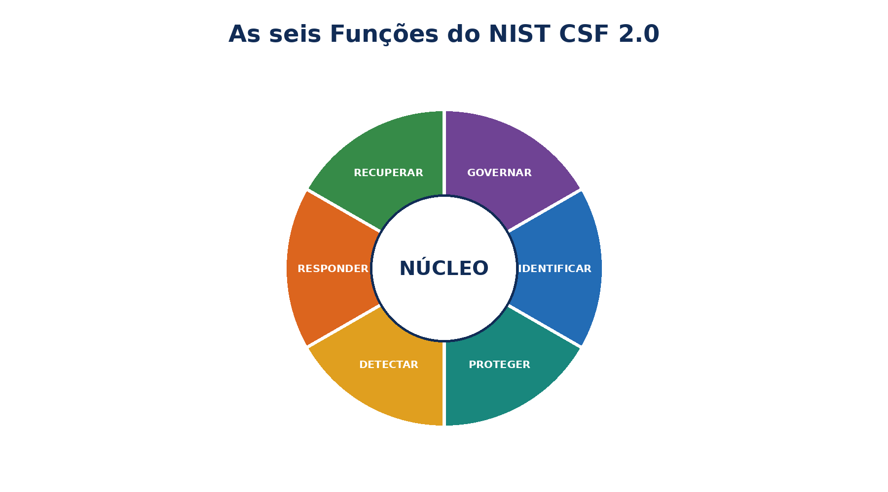
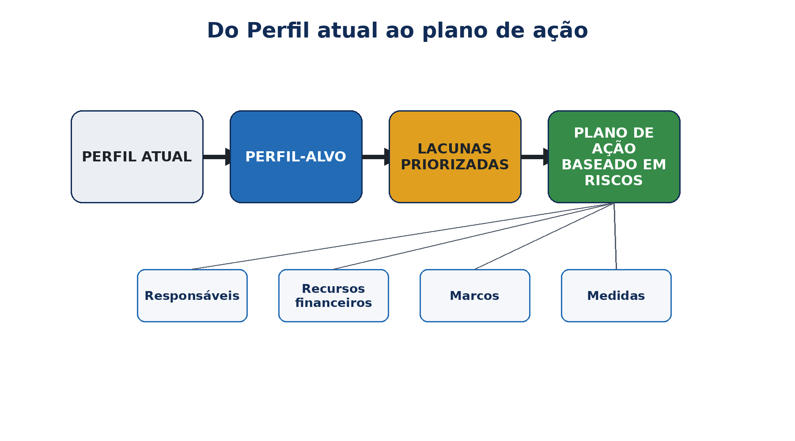
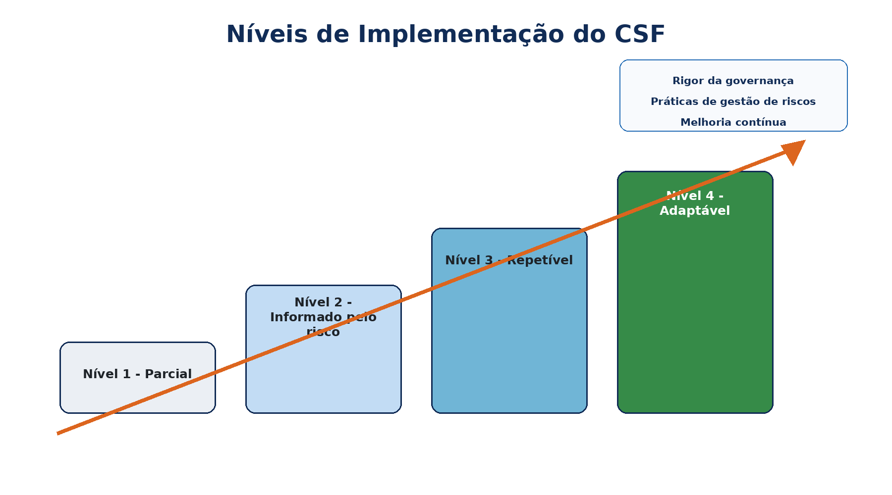
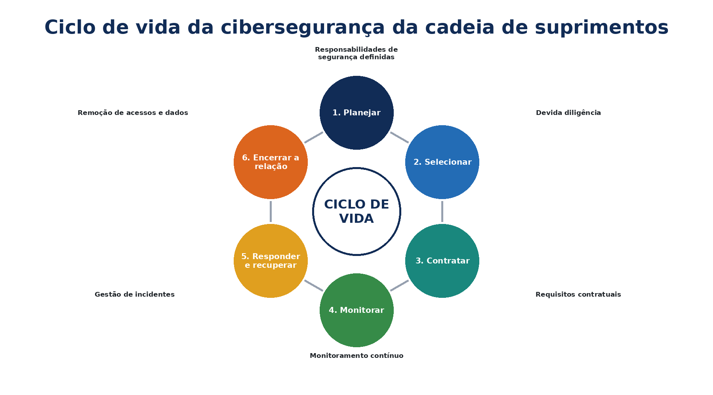
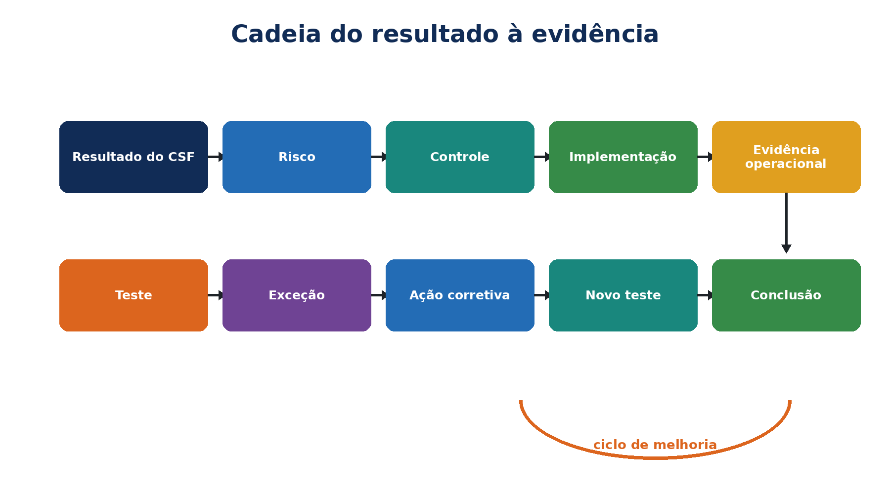
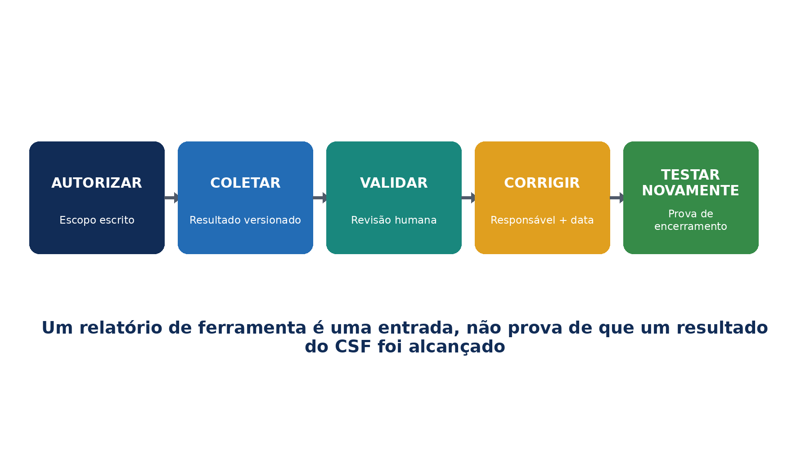
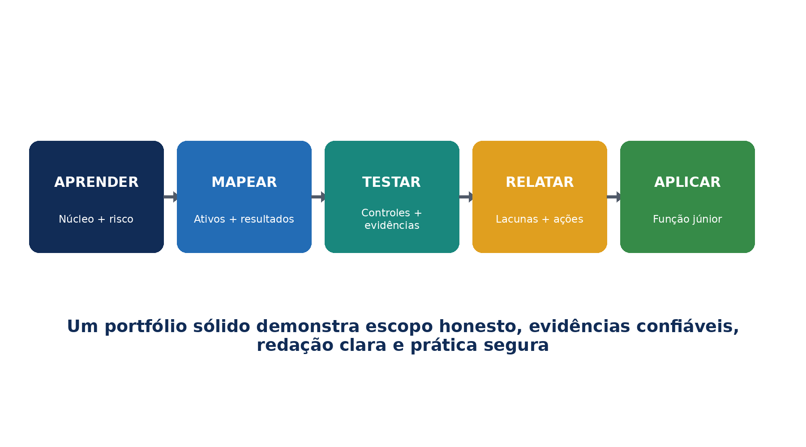

# NIST Cybersecurity Framework 2.0

## GRC prático, implementação, evidências e ferramentas de código aberto

*Manual de trabalho para gestores, analistas juniores, estudantes, profissionais em transição de carreira e equipes de cibersegurança*

**Alberto (Al) Leiva**

Primeira edição • Julho de 2026

| **Conteúdo:** Todos os 106 resultados do Núcleo do CSF • Perfis • Tiers • GRC • cadeia de suprimentos • evidências • teste de controles • ferramentas de código aberto • laboratórios • preparação profissional |
|---|

# Aviso de publicação e uso

Autor: Alberto (Al) Leiva

Edição: Primeira edição, julho de 2026

Objetivo: Oferecer educação gratuita e prática para gestores, analistas juniores, estudantes, profissionais em transição de carreira, profissionais de riscos e especialistas em cibersegurança.

## Aviso educacional

Este manual fornece informações educacionais gerais. Ele não constitui certificação, conformidade legal, opinião de auditoria nem garantia de segurança. Cada organização deve adaptar o NIST CSF à sua missão, aos seus riscos, às suas obrigações, ao seu apetite a risco, aos seus recursos, às suas tecnologias e às suas partes interessadas. Para decisões reais, utilize fontes oficiais atualizadas e orientação qualificada nas áreas jurídica, de riscos, privacidade, segurança física, auditoria e tecnologia.

## Uso ético e autorizado

Utilize ferramentas técnicas somente em sistemas, aplicações, redes, contas em nuvem e dados que sejam de sua propriedade ou para os quais você tenha autorização específica por escrito. Em atividades de treinamento, utilize dados fictícios, sintéticos ou aprovados. Capacidade técnica não constitui autorização.

# Prefácio

*Uma introdução acessível ao gerenciamento prático de riscos de cibersegurança.*

O trabalho de cibersegurança pode parecer uma coleção de produtos, alertas, políticas e tarefas técnicas. O NIST Cybersecurity Framework oferece uma linguagem comum para conectar essas atividades. Ele ajuda líderes a explicar quais resultados são importantes, gestores a definir prioridades e profissionais a relacionar o trabalho diário ao risco organizacional.

O CSF 2.0 é deliberadamente flexível. Ele não exige que todas as organizações comprem a mesma ferramenta, implementem o mesmo controle ou alcancem o mesmo Tier. Ele descreve resultados. Um hospital, uma indústria, uma escola, um banco, uma startup, um órgão governamental ou uma organização sem fins lucrativos podem utilizar o mesmo Núcleo e, ao mesmo tempo, escolher prioridades e implementações diferentes.

Este manual adota uma abordagem que começa pela metodologia. Uma planilha de framework só é útil quando o escopo é preciso. Um painel verde só é útil quando as evidências são confiáveis. O resultado de um scanner só é útil quando alguém o valida, prioriza, corrige e testa novamente. Os gestores continuam responsáveis pelas decisões; os analistas melhoram essas decisões ao reunir fatos completos e comunicá-los com clareza.

# Como utilizar este manual

Os gestores devem começar pelos capítulos 1–3 e 10–17, além dos modelos do capítulo 22.

Os analistas juniores devem estudar os seis capítulos dedicados às Funções, o método de verificação, as ferramentas, o laboratório e a preparação para entrevistas.

As equipes técnicas devem relacionar os achados a ativos, riscos, resultados do CSF, implementação, responsáveis, evidências e ações corretivas.

As equipes jurídica, de privacidade, segurança física, tecnologia operacional e negócios devem revisar as decisões que afetem suas responsabilidades.

| **Sumário real do Word:** O guia de capítulos inclui números de página específicos da edição após a renderização final. O documento também contém um campo nativo de sumário do Word. Depois de editar, clique com o botão direito no campo, selecione **Atualizar Campo** e depois **Atualizar o índice inteiro**. |
|---|

# 1. Fundamentos do NIST CSF 2.0

*O que é o framework, o que mudou e o que ele não afirma.*

{width=6.15in height=3.39605in}

Figura 1. As seis Funções do NIST CSF 2.0

## 1.1 O que é o CSF 2.0

O NIST publicou o CSF 2.0 em 26 de fevereiro de 2024. Ele foi desenvolvido para organizações de qualquer porte, setor e nível de sofisticação técnica. Seus resultados são neutros em relação a país, setor e tecnologia. Uma organização pode adotá-lo voluntariamente ou porque uma política, um contrato, um regulador, um cliente ou uma norma interna assim o exige.

## 1.2 O que mudou em relação ao CSF 1.1

- **GOVERN** tornou-se a sexta Função, colocando liderança, política, risco empresarial e prestação de contas no centro do framework.
- A cibersegurança da cadeia de suprimentos recebeu maior ênfase.
- A linguagem foi ampliada para além da infraestrutura crítica, permitindo que o framework atenda claramente a todos os tipos de organização.
- Perfis, Tiers, Exemplos de Implementação, Referências Informativas e Guias de Início Rápido formam agora um portfólio mais amplo de recursos do CSF.
- Algumas numerações de Subcategorias contêm lacunas intencionais porque determinados conteúdos do CSF 1.1 foram realocados dentro do CSF 2.0.

## 1.3 O que o CSF 2.0 não é

- Não é, por si só, uma lei.
- Não é um catálogo único de controles nem uma lista obrigatória de tecnologias.
- Não fornece uma pontuação universal de aprovação ou reprovação.
- O NIST não certifica organizações, produtos, consultores nem avaliadores em relação ao CSF.
- Um Tier elevado não é automaticamente o objetivo correto para todos os escopos.
- Relacionar uma prática a um resultado do CSF não comprova que esse resultado tenha sido alcançado.

# 2. Núcleo, Perfis, Tiers e recursos de apoio

*Os componentes do CSF 2.0 e como eles se relacionam.*

{width=6.15in height=2.6593in}

Figura 2. Hierarquia do Núcleo do CSF

| **Componente** | **Objetivo** | **Uso prático** |
|---|---|---|
| Núcleo | Hierarquia de seis Funções, 22 Categorias e 106 Subcategorias | Descrever os resultados de cibersegurança desejados |
| Perfil Organizacional | Resultados atuais e/ou alvo para um escopo definido | Comparar a postura, priorizar lacunas e planejar o trabalho |
| Perfil da Comunidade | Linha de base compartilhada de resultados para um setor, tecnologia, ameaça ou caso de uso | Utilizá-la como insumo para o Perfil-Alvo de uma organização |
| Tiers | Contexto sobre o rigor das práticas de governança e gerenciamento de riscos | Caracterizar as condições do Perfil Atual e do Perfil-Alvo |
| Exemplos de Implementação | Ações orientativas que podem ajudar a alcançar resultados | Gerar ideias, adaptá-las e validá-las |
| Referências Informativas | Correspondências com normas, orientações, regulamentos e outras fontes | Selecionar práticas e controles mais detalhados |
| Guias de Início Rápido | Orientações breves e práticas sobre usos específicos do CSF | Iniciar trabalhos sobre Perfis, Tiers, ERM, cadeia de suprimentos e pequenas empresas |

| **Números importantes:** O CSF 2.0 contém 6 Funções, 22 Categorias e 106 Subcategorias. As Subcategorias descrevem resultados; elas não exigem produtos específicos nem implementações idênticas. |
|---|

# 3. Roteiro prático de implementação

*Uma forma repetível de passar da linguagem do framework para melhorias financiadas.*

- Designe um patrocinador executivo e um responsável pelo programa.
- Defina o escopo do Perfil: empresa, unidade de negócios, produto, serviço, sistema, região ou ecossistema de fornecedores.
- Reúna informações sobre a missão, as partes interessadas, as obrigações jurídicas e contratuais, os riscos, ativos, ameaças, incidentes, auditorias, força de trabalho e fornecedores.
- Selecione os resultados do CSF aplicáveis e crie um Perfil Atual utilizando evidências confiáveis.
- Defina um Perfil-Alvo baseado em risco, considerando os Perfis da Comunidade e as obrigações aplicáveis.
- Analise lacunas, dependências, custos, viabilidade e redução de risco.
- Crie um plano de ação aprovado com responsáveis, recursos, marcos, métricas e medidas de proteção provisórias.
- Implemente controles e procedimentos operacionais.
- Teste a eficácia do desenho e a eficácia operacional utilizando populações completas e amostras representativas.
- Relate riscos, decisões, exceções, progresso e limitações.
- Atualize os Perfis após mudanças relevantes, incidentes, exercícios, revisões ou alterações no risco.

| **Comece com um escopo pequeno sem perder a integridade:** Uma organização pequena pode começar por um serviço crítico ou processo de alto risco. Mantenha o escopo transparente, documente as exclusões e amplie-o de forma deliberada. |
|---|

# 4. Função GOVERNAR

*Explicação completa, em linguagem clara, de cada Categoria e Subcategoria de GOVERNAR.*

| **Objetivo da Função:** Definir direção, expectativas, responsabilização, políticas, supervisão e gestão do risco da cadeia de suprimentos. |
|---|

## Contexto organizacional (GV.OC)

| **Resultado** | **Significado em linguagem clara** | **Verificação pelo gestor ou analista** | **Exemplos de evidência** |
|---|---|---|---|
| GV.OC-01 | Relacionar as decisões de cibersegurança à missão da organização. | Confirmar responsável, escopo, implementação, revisão, exceções, ações corretivas e operação repetível. | registros de missão e partes interessadas, registro de obrigações, mapa de dependências |
| GV.OC-02 | Identificar as partes interessadas e considerar suas expectativas de cibersegurança. | Confirmar responsável, escopo, implementação, revisão, exceções, ações corretivas e operação repetível. | registros de missão e partes interessadas, registro de obrigações, mapa de dependências |
| GV.OC-03 | Identificar e gerenciar obrigações legais, regulatórias, contratuais, de privacidade e de liberdades civis. | Confirmar responsável, escopo, implementação, revisão, exceções, ações corretivas e operação repetível. | registros de missão e partes interessadas, registro de obrigações, mapa de dependências |
| GV.OC-04 | Compreender e comunicar os serviços críticos que outras partes esperam da organização. | Confirmar responsável, escopo, implementação, revisão, exceções, ações corretivas e operação repetível. | registros de missão e partes interessadas, registro de obrigações, mapa de dependências |
| GV.OC-05 | Compreender e comunicar os resultados, as capacidades e os serviços externos dos quais a organização depende. | Confirmar responsável, escopo, implementação, revisão, exceções, ações corretivas e operação repetível. | registros de missão e partes interessadas, registro de obrigações, mapa de dependências |

> **Importante:** Os resultados do CSF não constituem uma lista de tecnologias obrigatórias. Selecione métodos de implementação e controles conforme o risco, a missão, as obrigações, os recursos e o Perfil-Alvo definido.

## Estratégia de gestão de riscos (GV.RM)

| **Resultado** | **Significado em linguagem clara** | **Verificação pelo gestor ou analista** | **Exemplos de evidência** |
|---|---|---|---|
| GV.RM-01 | Alinhar os objetivos de gestão do risco de cibersegurança com as partes interessadas relevantes. | Confirmar responsável, escopo, implementação, revisão, exceções, ações corretivas e operação repetível. | apetite a risco, metodologia, registro de riscos corporativos, fluxos de reporte |
| GV.RM-02 | Estabelecer, comunicar e manter declarações de apetite e tolerância a risco. | Confirmar responsável, escopo, implementação, revisão, exceções, ações corretivas e operação repetível. | apetite a risco, metodologia, registro de riscos corporativos, fluxos de reporte |
| GV.RM-03 | Integrar o risco de cibersegurança aos processos de gestão de riscos corporativos. | Confirmar responsável, escopo, implementação, revisão, exceções, ações corretivas e operação repetível. | apetite a risco, metodologia, registro de riscos corporativos, fluxos de reporte |
| GV.RM-04 | Definir e comunicar opções aceitáveis de resposta ao risco. | Confirmar responsável, escopo, implementação, revisão, exceções, ações corretivas e operação repetível. | apetite a risco, metodologia, registro de riscos corporativos, fluxos de reporte |
| GV.RM-05 | Estabelecer canais de comunicação para riscos cibernéticos, inclusive riscos de fornecedores e terceiros. | Confirmar responsável, escopo, implementação, revisão, exceções, ações corretivas e operação repetível. | apetite a risco, metodologia, registro de riscos corporativos, fluxos de reporte |
| GV.RM-06 | Utilizar um método consistente para calcular, documentar, categorizar e priorizar riscos cibernéticos. | Confirmar responsável, escopo, implementação, revisão, exceções, ações corretivas e operação repetível. | apetite a risco, metodologia, registro de riscos corporativos, fluxos de reporte |
| GV.RM-07 | Incluir oportunidades benéficas e riscos positivos nas discussões de cibersegurança. | Confirmar responsável, escopo, implementação, revisão, exceções, ações corretivas e operação repetível. | apetite a risco, metodologia, registro de riscos corporativos, fluxos de reporte |

## Papéis, responsabilidades e autoridades (GV.RR)

| **Resultado** | **Significado em linguagem clara** | **Verificação pelo gestor ou analista** | **Exemplos de evidência** |
|---|---|---|---|
| GV.RR-01 | A liderança assume a responsabilidade pelo risco de cibersegurança e apoia uma cultura ética e de melhoria contínua. | Confirmar responsável, escopo, implementação, revisão, exceções, ações corretivas e operação repetível. | matriz RACI, descrições de cargo, orçamento, registros da força de trabalho |
| GV.RR-02 | Estabelecer, comunicar, compreender e fazer cumprir papéis, responsabilidades e autoridades de cibersegurança. | Confirmar responsável, escopo, implementação, revisão, exceções, ações corretivas e operação repetível. | matriz RACI, descrições de cargo, orçamento, registros da força de trabalho |
| GV.RR-03 | Alocar pessoas, orçamento, tecnologia e tempo de acordo com a estratégia e as políticas de risco. | Confirmar responsável, escopo, implementação, revisão, exceções, ações corretivas e operação repetível. | matriz RACI, descrições de cargo, orçamento, registros da força de trabalho |
| GV.RR-04 | Incorporar responsabilidades de cibersegurança às práticas de recursos humanos. | Confirmar responsável, escopo, implementação, revisão, exceções, ações corretivas e operação repetível. | matriz RACI, descrições de cargo, orçamento, registros da força de trabalho |

## Política (GV.PO)

| **Resultado** | **Significado em linguagem clara** | **Verificação pelo gestor ou analista** | **Exemplos de evidência** |
|---|---|---|---|
| GV.PO-01 | Estabelecer, comunicar e aplicar a política de cibersegurança de acordo com o contexto, a estratégia e as prioridades. | Confirmar responsável, escopo, implementação, revisão, exceções, ações corretivas e operação repetível. | política aprovada, confirmações de ciência, histórico de revisão, registros de aplicação |
| GV.PO-02 | Revisar e atualizar a política quando houver mudanças em requisitos, ameaças, tecnologia ou missão. | Confirmar responsável, escopo, implementação, revisão, exceções, ações corretivas e operação repetível. | política aprovada, confirmações de ciência, histórico de revisão, registros de aplicação |

## Supervisão (GV.OV)

| **Resultado** | **Significado em linguagem clara** | **Verificação pelo gestor ou analista** | **Exemplos de evidência** |
|---|---|---|---|
| GV.OV-01 | Revisar os resultados da estratégia e utilizá-los para ajustar a direção. | Confirmar responsável, escopo, implementação, revisão, exceções, ações corretivas e operação repetível. | painel, atas de reunião, decisões, alterações de estratégia |
| GV.OV-02 | Ajustar a estratégia de risco quando requisitos ou riscos não estiverem plenamente cobertos. | Confirmar responsável, escopo, implementação, revisão, exceções, ações corretivas e operação repetível. | painel, atas de reunião, decisões, alterações de estratégia |
| GV.OV-03 | Avaliar o desempenho de cibersegurança e determinar as mudanças necessárias. | Confirmar responsável, escopo, implementação, revisão, exceções, ações corretivas e operação repetível. | painel, atas de reunião, decisões, alterações de estratégia |

## Gestão do risco de cibersegurança na cadeia de suprimentos (GV.SC)

| **Resultado** | **Significado em linguagem clara** | **Verificação pelo gestor ou analista** | **Exemplos de evidência** |
|---|---|---|---|
| GV.SC-01 | Estabelecer programa, estratégia, objetivos, políticas e processos acordados para o risco da cadeia de suprimentos. | Confirmar responsável, escopo, implementação, revisão, exceções, ações corretivas e operação repetível. | inventário de fornecedores, classificação, diligência prévia, contratos, monitoramento, evidências de encerramento |
| GV.SC-02 | Coordenar os papéis de cibersegurança de fornecedores, clientes, parceiros e responsáveis internos. | Confirmar responsável, escopo, implementação, revisão, exceções, ações corretivas e operação repetível. | inventário de fornecedores, classificação, diligência prévia, contratos, monitoramento, evidências de encerramento |
| GV.SC-03 | Integrar o risco da cadeia de suprimentos à cibersegurança, ao ERM, às avaliações e à melhoria. | Confirmar responsável, escopo, implementação, revisão, exceções, ações corretivas e operação repetível. | inventário de fornecedores, classificação, diligência prévia, contratos, monitoramento, evidências de encerramento |
| GV.SC-04 | Conhecer os fornecedores e priorizá-los conforme a criticidade. | Confirmar responsável, escopo, implementação, revisão, exceções, ações corretivas e operação repetível. | inventário de fornecedores, classificação, diligência prévia, contratos, monitoramento, evidências de encerramento |
| GV.SC-05 | Incluir requisitos de cibersegurança priorizados em contratos e acordos. | Confirmar responsável, escopo, implementação, revisão, exceções, ações corretivas e operação repetível. | inventário de fornecedores, classificação, diligência prévia, contratos, monitoramento, evidências de encerramento |
| GV.SC-06 | Realizar planejamento e diligência prévia antes de iniciar relacionamentos com terceiros. | Confirmar responsável, escopo, implementação, revisão, exceções, ações corretivas e operação repetível. | inventário de fornecedores, classificação, diligência prévia, contratos, monitoramento, evidências de encerramento |
| GV.SC-07 | Registrar, avaliar, responder e monitorar riscos de fornecedores, produtos, serviços e terceiros. | Confirmar responsável, escopo, implementação, revisão, exceções, ações corretivas e operação repetível. | inventário de fornecedores, classificação, diligência prévia, contratos, monitoramento, evidências de encerramento |
| GV.SC-08 | Incluir terceiros relevantes no planejamento, na resposta e na recuperação de incidentes. | Confirmar responsável, escopo, implementação, revisão, exceções, ações corretivas e operação repetível. | inventário de fornecedores, classificação, diligência prévia, contratos, monitoramento, evidências de encerramento |
| GV.SC-09 | Monitorar a segurança da cadeia de suprimentos durante o ciclo de vida de produtos e serviços tecnológicos. | Confirmar responsável, escopo, implementação, revisão, exceções, ações corretivas e operação repetível. | inventário de fornecedores, classificação, diligência prévia, contratos, monitoramento, evidências de encerramento |
| GV.SC-10 | Planejar atividades de segurança para o encerramento de uma parceria ou contrato de serviço. | Confirmar responsável, escopo, implementação, revisão, exceções, ações corretivas e operação repetível. | inventário de fornecedores, classificação, diligência prévia, contratos, monitoramento, evidências de encerramento |

# 5. Função IDENTIFICAR

*Explicação completa, em linguagem clara, de cada Categoria e Subcategoria de IDENTIFICAR.*

| **Objetivo da Função:** Compreender ativos, dependências, ameaças, vulnerabilidades, riscos e necessidades de melhoria. |
|---|

## Gestão de ativos (ID.AM)

| **Resultado** | **Significado em linguagem clara** | **Verificação pelo gestor ou analista** | **Exemplos de evidência** |
|---|---|---|---|
| ID.AM-01 | Manter um inventário do hardware gerenciado. | Confirmar responsável, escopo, implementação, revisão, exceções, ações corretivas e operação repetível. | inventários de ativos e dados, responsáveis, diagramas, registros do ciclo de vida |
| ID.AM-02 | Manter um inventário de software, serviços e sistemas gerenciados. | Confirmar responsável, escopo, implementação, revisão, exceções, ações corretivas e operação repetível. | inventários de ativos e dados, responsáveis, diagramas, registros do ciclo de vida |
| ID.AM-03 | Manter diagramas atualizados das comunicações de rede e dos fluxos de dados autorizados. | Confirmar responsável, escopo, implementação, revisão, exceções, ações corretivas e operação repetível. | inventários de ativos e dados, responsáveis, diagramas, registros do ciclo de vida |
| ID.AM-04 | Manter um inventário dos serviços fornecidos por terceiros. | Confirmar responsável, escopo, implementação, revisão, exceções, ações corretivas e operação repetível. | inventários de ativos e dados, responsáveis, diagramas, registros do ciclo de vida |
| ID.AM-05 | Priorizar ativos conforme classificação, criticidade, recursos e impacto na missão. | Confirmar responsável, escopo, implementação, revisão, exceções, ações corretivas e operação repetível. | inventários de ativos e dados, responsáveis, diagramas, registros do ciclo de vida |
| ID.AM-07 | Inventariar tipos de dados definidos e seus metadados. | Confirmar responsável, escopo, implementação, revisão, exceções, ações corretivas e operação repetível. | inventários de ativos e dados, responsáveis, diagramas, registros do ciclo de vida |
| ID.AM-08 | Gerenciar sistemas, hardware, software, serviços e dados durante todo o ciclo de vida. | Confirmar responsável, escopo, implementação, revisão, exceções, ações corretivas e operação repetível. | inventários de ativos e dados, responsáveis, diagramas, registros do ciclo de vida |

## Avaliação de riscos (ID.RA)

| **Resultado** | **Significado em linguagem clara** | **Verificação pelo gestor ou analista** | **Exemplos de evidência** |
|---|---|---|---|
| ID.RA-01 | Identificar, validar e registrar vulnerabilidades dos ativos. | Confirmar responsável, escopo, implementação, revisão, exceções, ações corretivas e operação repetível. | registros de ameaças e vulnerabilidades, análise de risco, tratamento e exceções |
| ID.RA-02 | Receber inteligência de ameaças cibernéticas de fontes de compartilhamento adequadas. | Confirmar responsável, escopo, implementação, revisão, exceções, ações corretivas e operação repetível. | registros de ameaças e vulnerabilidades, análise de risco, tratamento e exceções |
| ID.RA-03 | Identificar e registrar ameaças internas e externas. | Confirmar responsável, escopo, implementação, revisão, exceções, ações corretivas e operação repetível. | registros de ameaças e vulnerabilidades, análise de risco, tratamento e exceções |
| ID.RA-04 | Estimar a probabilidade e o impacto de ameaças explorarem vulnerabilidades. | Confirmar responsável, escopo, implementação, revisão, exceções, ações corretivas e operação repetível. | registros de ameaças e vulnerabilidades, análise de risco, tratamento e exceções |
| ID.RA-05 | Utilizar ameaças, vulnerabilidades, probabilidade e impacto para compreender o risco inerente e as prioridades. | Confirmar responsável, escopo, implementação, revisão, exceções, ações corretivas e operação repetível. | registros de ameaças e vulnerabilidades, análise de risco, tratamento e exceções |
| ID.RA-06 | Selecionar, priorizar, planejar, acompanhar e comunicar respostas ao risco. | Confirmar responsável, escopo, implementação, revisão, exceções, ações corretivas e operação repetível. | registros de ameaças e vulnerabilidades, análise de risco, tratamento e exceções |
| ID.RA-07 | Avaliar, registrar, aprovar e acompanhar o efeito de mudanças e exceções sobre o risco. | Confirmar responsável, escopo, implementação, revisão, exceções, ações corretivas e operação repetível. | registros de ameaças e vulnerabilidades, análise de risco, tratamento e exceções |
| ID.RA-08 | Estabelecer um processo para receber, analisar e responder a divulgações de vulnerabilidades. | Confirmar responsável, escopo, implementação, revisão, exceções, ações corretivas e operação repetível. | registros de ameaças e vulnerabilidades, análise de risco, tratamento e exceções |
| ID.RA-09 | Avaliar a autenticidade e a integridade de hardware e software antes da aquisição e do uso. | Confirmar responsável, escopo, implementação, revisão, exceções, ações corretivas e operação repetível. | registros de ameaças e vulnerabilidades, análise de risco, tratamento e exceções |
| ID.RA-10 | Avaliar fornecedores críticos antes da aquisição. | Confirmar responsável, escopo, implementação, revisão, exceções, ações corretivas e operação repetível. | registros de ameaças e vulnerabilidades, análise de risco, tratamento e exceções |

## Melhoria (ID.IM)

| **Resultado** | **Significado em linguagem clara** | **Verificação pelo gestor ou analista** | **Exemplos de evidência** |
|---|---|---|---|
| ID.IM-01 | Identificar melhorias a partir de avaliações. | Confirmar responsável, escopo, implementação, revisão, exceções, ações corretivas e operação repetível. | avaliações, exercícios, lições aprendidas, ações corretivas, planos atualizados |
| ID.IM-02 | Identificar melhorias a partir de testes e exercícios, inclusive exercícios coordenados com terceiros. | Confirmar responsável, escopo, implementação, revisão, exceções, ações corretivas e operação repetível. | avaliações, exercícios, lições aprendidas, ações corretivas, planos atualizados |
| ID.IM-03 | Identificar melhorias durante a execução de processos, procedimentos e atividades. | Confirmar responsável, escopo, implementação, revisão, exceções, ações corretivas e operação repetível. | avaliações, exercícios, lições aprendidas, ações corretivas, planos atualizados |
| ID.IM-04 | Estabelecer, comunicar, manter e aprimorar planos de resposta a incidentes e de cibersegurança operacional. | Confirmar responsável, escopo, implementação, revisão, exceções, ações corretivas e operação repetível. | avaliações, exercícios, lições aprendidas, ações corretivas, planos atualizados |

> **Status:** Tradução humana revisada para integração. Mantém os identificadores oficiais do NIST CSF 2.0. Este arquivo substitui somente o conteúdo textual dos capítulos 6–9; a edição completa ainda requer integração, nova geração de DOCX/PDF e revisão visual.

# 6. Função PROTEGER

*Descrição completa, em linguagem clara, de cada Categoria e Subcategoria de PROTEGER.*

| **Objetivo da Função:** Aplicar salvaguardas que reduzam a probabilidade e o impacto de eventos de cibersegurança. |
|---|

## Gestão de identidades, autenticação e controle de acesso (PR.AA)

| **Resultado** | **Significado em linguagem clara** | **Verificação do gestor ou analista** | **Exemplos de evidência** |
|---|---|---|---|
| PR.AA-01 | Gerenciar identidades e credenciais de pessoas, serviços e equipamentos autorizados. | Confirmar responsável, escopo, implementação, revisão, exceções, ações corretivas e operação repetível. | inventário de identidades, matriz de acesso, configuração de MFA, revisões, chamados de desligamento |
| PR.AA-02 | Comprovar identidades e vinculá-las a credenciais de acordo com o risco da interação. | Confirmar responsável, escopo, implementação, revisão, exceções, ações corretivas e operação repetível. | inventário de identidades, matriz de acesso, configuração de MFA, revisões, chamados de desligamento |
| PR.AA-03 | Autenticar usuários, serviços e equipamentos. | Confirmar responsável, escopo, implementação, revisão, exceções, ações corretivas e operação repetível. | inventário de identidades, matriz de acesso, configuração de MFA, revisões, chamados de desligamento |
| PR.AA-04 | Proteger, transmitir e verificar declarações de identidade. | Confirmar responsável, escopo, implementação, revisão, exceções, ações corretivas e operação repetível. | inventário de identidades, matriz de acesso, configuração de MFA, revisões, chamados de desligamento |
| PR.AA-05 | Definir, aplicar e revisar permissões com base em privilégio mínimo e segregação de funções. | Confirmar responsável, escopo, implementação, revisão, exceções, ações corretivas e operação repetível. | inventário de identidades, matriz de acesso, configuração de MFA, revisões, chamados de desligamento |
| PR.AA-06 | Gerenciar, monitorar e aplicar o acesso físico de acordo com o risco. | Confirmar responsável, escopo, implementação, revisão, exceções, ações corretivas e operação repetível. | inventário de identidades, matriz de acesso, configuração de MFA, revisões, chamados de desligamento |

## Conscientização e treinamento (PR.AT)

| **Resultado** | **Significado em linguagem clara** | **Verificação do gestor ou analista** | **Exemplos de evidência** |
|---|---|---|---|
| PR.AT-01 | Fornecer ao pessoal os conhecimentos e as habilidades necessários para executar o trabalho cotidiano considerando o risco cibernético. | Confirmar responsável, escopo, implementação, revisão, exceções, ações corretivas e operação repetível. | currículo por função, listas de presença, conclusão, exercícios, acompanhamento |
| PR.AT-02 | Fornecer às pessoas em funções especializadas os conhecimentos e as habilidades de cibersegurança exigidos por essas funções. | Confirmar responsável, escopo, implementação, revisão, exceções, ações corretivas e operação repetível. | currículo por função, listas de presença, conclusão, exercícios, acompanhamento |

## Segurança de dados (PR.DS)

| **Resultado** | **Significado em linguagem clara** | **Verificação do gestor ou analista** | **Exemplos de evidência** |
|---|---|---|---|
| PR.DS-01 | Proteger dados em repouso quanto à confidencialidade, integridade e disponibilidade. | Confirmar responsável, escopo, implementação, revisão, exceções, ações corretivas e operação repetível. | classificação, configuração de criptografia, registros de DLP, testes de backup e restauração |
| PR.DS-02 | Proteger dados em trânsito quanto à confidencialidade, integridade e disponibilidade. | Confirmar responsável, escopo, implementação, revisão, exceções, ações corretivas e operação repetível. | classificação, configuração de criptografia, registros de DLP, testes de backup e restauração |
| PR.DS-10 | Proteger dados em uso quanto à confidencialidade, integridade e disponibilidade. | Confirmar responsável, escopo, implementação, revisão, exceções, ações corretivas e operação repetível. | classificação, configuração de criptografia, registros de DLP, testes de backup e restauração |
| PR.DS-11 | Criar, proteger, manter e testar backups. | Confirmar responsável, escopo, implementação, revisão, exceções, ações corretivas e operação repetível. | classificação, configuração de criptografia, registros de DLP, testes de backup e restauração |

## Segurança de plataformas (PR.PS)

| **Resultado** | **Significado em linguagem clara** | **Verificação do gestor ou analista** | **Exemplos de evidência** |
|---|---|---|---|
| PR.PS-01 | Estabelecer e aplicar práticas de gestão de configuração. | Confirmar responsável, escopo, implementação, revisão, exceções, ações corretivas e operação repetível. | linhas de base, registros de correções e fim de vida, logs, listas de permissão, evidências de SDLC seguro |
| PR.PS-02 | Manter, substituir e remover software de acordo com o risco. | Confirmar responsável, escopo, implementação, revisão, exceções, ações corretivas e operação repetível. | linhas de base, registros de correções e fim de vida, logs, listas de permissão, evidências de SDLC seguro |
| PR.PS-03 | Manter, substituir e remover hardware de acordo com o risco. | Confirmar responsável, escopo, implementação, revisão, exceções, ações corretivas e operação repetível. | linhas de base, registros de correções e fim de vida, logs, listas de permissão, evidências de SDLC seguro |
| PR.PS-04 | Gerar registros e disponibilizá-los para monitoramento contínuo. | Confirmar responsável, escopo, implementação, revisão, exceções, ações corretivas e operação repetível. | linhas de base, registros de correções e fim de vida, logs, listas de permissão, evidências de SDLC seguro |
| PR.PS-05 | Impedir a instalação e a execução de software não autorizado. | Confirmar responsável, escopo, implementação, revisão, exceções, ações corretivas e operação repetível. | linhas de base, registros de correções e fim de vida, logs, listas de permissão, evidências de SDLC seguro |
| PR.PS-06 | Integrar e monitorar práticas de desenvolvimento seguro de software durante todo o ciclo de vida. | Confirmar responsável, escopo, implementação, revisão, exceções, ações corretivas e operação repetível. | linhas de base, registros de correções e fim de vida, logs, listas de permissão, evidências de SDLC seguro |

## Resiliência da infraestrutura tecnológica (PR.IR)

| **Resultado** | **Significado em linguagem clara** | **Verificação do gestor ou analista** | **Exemplos de evidência** |
|---|---|---|---|
| PR.IR-01 | Proteger redes e ambientes contra acesso e uso lógico não autorizado. | Confirmar responsável, escopo, implementação, revisão, exceções, ações corretivas e operação repetível. | arquitetura, segmentação, controles ambientais, testes de resiliência e capacidade |
| PR.IR-02 | Proteger ativos tecnológicos contra ameaças ambientais. | Confirmar responsável, escopo, implementação, revisão, exceções, ações corretivas e operação repetível. | arquitetura, segmentação, controles ambientais, testes de resiliência e capacidade |
| PR.IR-03 | Implementar mecanismos que atendam às necessidades de resiliência em condições normais e adversas. | Confirmar responsável, escopo, implementação, revisão, exceções, ações corretivas e operação repetível. | arquitetura, segmentação, controles ambientais, testes de resiliência e capacidade |
| PR.IR-04 | Manter capacidade de recursos suficiente para sustentar a disponibilidade. | Confirmar responsável, escopo, implementação, revisão, exceções, ações corretivas e operação repetível. | arquitetura, segmentação, controles ambientais, testes de resiliência e capacidade |

# 7. Função DETECTAR

*Descrição completa, em linguagem clara, de cada Categoria e Subcategoria de DETECTAR.*

| **Objetivo da Função:** Monitorar e analisar eventos para identificar possíveis ataques e comprometimentos. |
|---|

## Monitoramento contínuo (DE.CM)

| **Resultado** | **Significado em linguagem clara** | **Verificação do gestor ou analista** | **Exemplos de evidência** |
|---|---|---|---|
| DE.CM-01 | Monitorar redes e serviços de rede para identificar eventos potencialmente adversos. | Confirmar responsável, escopo, implementação, revisão, exceções, ações corretivas e operação repetível. | inventário de cobertura, telemetria, alertas, registros de revisão, monitoramento de fornecedores |
| DE.CM-02 | Monitorar o ambiente físico para identificar eventos potencialmente adversos. | Confirmar responsável, escopo, implementação, revisão, exceções, ações corretivas e operação repetível. | inventário de cobertura, telemetria, alertas, registros de revisão, monitoramento de fornecedores |
| DE.CM-03 | Monitorar a atividade do pessoal e o uso de tecnologia para identificar eventos potencialmente adversos. | Confirmar responsável, escopo, implementação, revisão, exceções, ações corretivas e operação repetível. | inventário de cobertura, telemetria, alertas, registros de revisão, monitoramento de fornecedores |
| DE.CM-06 | Monitorar atividades e serviços de provedores externos para identificar eventos adversos. | Confirmar responsável, escopo, implementação, revisão, exceções, ações corretivas e operação repetível. | inventário de cobertura, telemetria, alertas, registros de revisão, monitoramento de fornecedores |
| DE.CM-09 | Monitorar hardware, software, ambientes de execução e dados para identificar eventos adversos. | Confirmar responsável, escopo, implementação, revisão, exceções, ações corretivas e operação repetível. | inventário de cobertura, telemetria, alertas, registros de revisão, monitoramento de fornecedores |

## Análise de eventos adversos (DE.AE)

| **Resultado** | **Significado em linguagem clara** | **Verificação do gestor ou analista** | **Exemplos de evidência** |
|---|---|---|---|
| DE.AE-02 | Analisar eventos potencialmente adversos para compreender atividades relacionadas. | Confirmar responsável, escopo, implementação, revisão, exceções, ações corretivas e operação repetível. | regras de correlação, alertas enriquecidos, análise de impacto, registro de declaração |
| DE.AE-03 | Correlacionar informações de múltiplas fontes. | Confirmar responsável, escopo, implementação, revisão, exceções, ações corretivas e operação repetível. | regras de correlação, alertas enriquecidos, análise de impacto, registro de declaração |
| DE.AE-04 | Estimar o escopo e o impacto de eventos adversos. | Confirmar responsável, escopo, implementação, revisão, exceções, ações corretivas e operação repetível. | regras de correlação, alertas enriquecidos, análise de impacto, registro de declaração |
| DE.AE-06 | Fornecer informações sobre eventos adversos a pessoas e ferramentas autorizadas. | Confirmar responsável, escopo, implementação, revisão, exceções, ações corretivas e operação repetível. | regras de correlação, alertas enriquecidos, análise de impacto, registro de declaração |
| DE.AE-07 | Utilizar inteligência de ameaças e contexto na análise de eventos. | Confirmar responsável, escopo, implementação, revisão, exceções, ações corretivas e operação repetível. | regras de correlação, alertas enriquecidos, análise de impacto, registro de declaração |
| DE.AE-08 | Declarar incidentes quando os eventos atenderem aos critérios definidos. | Confirmar responsável, escopo, implementação, revisão, exceções, ações corretivas e operação repetível. | regras de correlação, alertas enriquecidos, análise de impacto, registro de declaração |

# 8. Função RESPONDER

*Descrição completa, em linguagem clara, de cada Categoria e Subcategoria de RESPONDER.*

| **Objetivo da Função:** Gerenciar, analisar, comunicar, conter e erradicar incidentes declarados. |
|---|

## Gestão de incidentes (RS.MA)

| **Resultado** | **Significado em linguagem clara** | **Verificação do gestor ou analista** | **Exemplos de evidência** |
|---|---|---|---|
| RS.MA-01 | Executar o plano de resposta com terceiros relevantes depois que um incidente for declarado. | Confirmar responsável, escopo, implementação, revisão, exceções, ações corretivas e operação repetível. | plano de incidentes, chamados, triagem, prioridade, escalonamento, decisão de recuperação |
| RS.MA-02 | Fazer a triagem e validar relatos de incidentes. | Confirmar responsável, escopo, implementação, revisão, exceções, ações corretivas e operação repetível. | plano de incidentes, chamados, triagem, prioridade, escalonamento, decisão de recuperação |
| RS.MA-03 | Classificar e priorizar incidentes. | Confirmar responsável, escopo, implementação, revisão, exceções, ações corretivas e operação repetível. | plano de incidentes, chamados, triagem, prioridade, escalonamento, decisão de recuperação |
| RS.MA-04 | Escalonar ou elevar incidentes quando necessário. | Confirmar responsável, escopo, implementação, revisão, exceções, ações corretivas e operação repetível. | plano de incidentes, chamados, triagem, prioridade, escalonamento, decisão de recuperação |
| RS.MA-05 | Aplicar critérios para iniciar a recuperação. | Confirmar responsável, escopo, implementação, revisão, exceções, ações corretivas e operação repetível. | plano de incidentes, chamados, triagem, prioridade, escalonamento, decisão de recuperação |

## Análise de incidentes (RS.AN)

| **Resultado** | **Significado em linguagem clara** | **Verificação do gestor ou analista** | **Exemplos de evidência** |
|---|---|---|---|
| RS.AN-03 | Determinar o que ocorreu e identificar a causa raiz. | Confirmar responsável, escopo, implementação, revisão, exceções, ações corretivas e operação repetível. | linha do tempo, notas forenses, registro de evidências, hashes, análise de causa raiz |
| RS.AN-06 | Registrar as ações de investigação e preservar a integridade e a procedência dos registros. | Confirmar responsável, escopo, implementação, revisão, exceções, ações corretivas e operação repetível. | linha do tempo, notas forenses, registro de evidências, hashes, análise de causa raiz |
| RS.AN-07 | Coletar dados e metadados do incidente preservando sua integridade e procedência. | Confirmar responsável, escopo, implementação, revisão, exceções, ações corretivas e operação repetível. | linha do tempo, notas forenses, registro de evidências, hashes, análise de causa raiz |
| RS.AN-08 | Estimar e validar a magnitude do incidente. | Confirmar responsável, escopo, implementação, revisão, exceções, ações corretivas e operação repetível. | linha do tempo, notas forenses, registro de evidências, hashes, análise de causa raiz |

## Relato e comunicação da resposta a incidentes (RS.CO)

| **Resultado** | **Significado em linguagem clara** | **Verificação do gestor ou analista** | **Exemplos de evidência** |
|---|---|---|---|
| RS.CO-02 | Notificar as partes interessadas internas e externas exigidas. | Confirmar responsável, escopo, implementação, revisão, exceções, ações corretivas e operação repetível. | matriz de notificação, mensagens, aprovações, registros de entrega |
| RS.CO-03 | Compartilhar informações com as partes interessadas designadas. | Confirmar responsável, escopo, implementação, revisão, exceções, ações corretivas e operação repetível. | matriz de notificação, mensagens, aprovações, registros de entrega |

## Mitigação de incidentes (RS.MI)

| **Resultado** | **Significado em linguagem clara** | **Verificação do gestor ou analista** | **Exemplos de evidência** |
|---|---|---|---|
| RS.MI-01 | Conter incidentes. | Confirmar responsável, escopo, implementação, revisão, exceções, ações corretivas e operação repetível. | ações de contenção e erradicação, validação, decisão sobre risco residual |
| RS.MI-02 | Erradicar incidentes. | Confirmar responsável, escopo, implementação, revisão, exceções, ações corretivas e operação repetível. | ações de contenção e erradicação, validação, decisão sobre risco residual |

# 9. Função RECUPERAR

*Descrição completa, em linguagem clara, de cada Categoria e Subcategoria de RECUPERAR.*

| **Objetivo da Função:** Restaurar ativos e operações e comunicar o progresso da recuperação. |
|---|

## Execução do plano de recuperação de incidentes (RC.RP)

| **Resultado** | **Significado em linguagem clara** | **Verificação do gestor ou analista** | **Exemplos de evidência** |
|---|---|---|---|
| RC.RP-01 | Executar atividades de recuperação quando o processo de incidentes iniciar a recuperação. | Confirmar responsável, escopo, implementação, revisão, exceções, ações corretivas e operação repetível. | plano de recuperação, registros de restauração, verificações de integridade, validação do serviço, encerramento |
| RC.RP-02 | Selecionar, delimitar, priorizar e executar ações de recuperação. | Confirmar responsável, escopo, implementação, revisão, exceções, ações corretivas e operação repetível. | plano de recuperação, registros de restauração, verificações de integridade, validação do serviço, encerramento |
| RC.RP-03 | Verificar a integridade dos backups e dos ativos de restauração antes da restauração. | Confirmar responsável, escopo, implementação, revisão, exceções, ações corretivas e operação repetível. | plano de recuperação, registros de restauração, verificações de integridade, validação do serviço, encerramento |
| RC.RP-04 | Utilizar as necessidades da missão e o risco cibernético para estabelecer as condições operacionais após o incidente. | Confirmar responsável, escopo, implementação, revisão, exceções, ações corretivas e operação repetível. | plano de recuperação, registros de restauração, verificações de integridade, validação do serviço, encerramento |
| RC.RP-05 | Verificar os ativos restaurados, restabelecer o serviço e confirmar o estado normal de operação. | Confirmar responsável, escopo, implementação, revisão, exceções, ações corretivas e operação repetível. | plano de recuperação, registros de restauração, verificações de integridade, validação do serviço, encerramento |
| RC.RP-06 | Declarar a recuperação concluída com base em critérios definidos e finalizar a documentação do incidente. | Confirmar responsável, escopo, implementação, revisão, exceções, ações corretivas e operação repetível. | plano de recuperação, registros de restauração, verificações de integridade, validação do serviço, encerramento |

## Comunicação da recuperação de incidentes (RC.CO)

| **Resultado** | **Significado em linguagem clara** | **Verificação do gestor ou analista** | **Exemplos de evidência** |
|---|---|---|---|
| RC.CO-03 | Comunicar o progresso da recuperação e as capacidades restauradas às partes interessadas designadas. | Confirmar responsável, escopo, implementação, revisão, exceções, ações corretivas e operação repetível. | atualizações às partes interessadas, mensagens públicas aprovadas, comprovação de entrega |
| RC.CO-04 | Emitir atualizações públicas sobre a recuperação por meio de métodos e mensagens aprovados. | Confirmar responsável, escopo, implementação, revisão, exceções, ações corretivas e operação repetível. | atualizações às partes interessadas, mensagens públicas aprovadas, comprovação de entrega |

> **Nota de aplicação:** Os resultados do CSF não formam uma lista de tecnologias obrigatórias. Os métodos de implementação e controles devem ser selecionados conforme o risco, a missão, as obrigações, os recursos e o Perfil-Alvo definido para o escopo.

# 10. Perfis Organizacionais

*Como descrever a postura atual, definir um objetivo e criar um plano de ação priorizado.*

{width=6.15in height=3.39605in}

**Figura 3. Do Perfil Atual ao plano de ação**

### 10.1 Declaração de escopo do Perfil

- Objetivo empresarial ou de missão.
- Sistemas, serviços, dados, instalações, pessoas, fornecedores e localidades incluídos.
- Período avaliado e data da evidência.
- Partes interessadas e autoridade para decisão.
- Obrigações legais, contratuais e de política, além dos Perfis da Comunidade utilizados como referência.
- Premissas, exclusões, dependências e limitações.

### 10.2 Status dos resultados

| **Status** | **Significado** | **Suporte necessário** |
|---|---|---|
| Alcançado | O resultado, dentro do escopo definido, está implementado e opera conforme o esperado. | Responsável, população completa, desenho, evidência operacional, teste e conclusão. |
| Parcialmente alcançado | Parte do escopo está ausente ou a operação é incompleta ou inconsistente. | Lacuna exata, risco afetado, ação provisória, responsável e prazo. |
| Não alcançado | O resultado é aplicável, mas não está em operação. | Decisão de risco, tratamento, recursos e cronograma. |
| Não aplicável | O resultado não se aplica ao escopo definido. | Justificativa documentada e aprovação. |
| Não avaliado | A evidência é insuficiente para uma conclusão. | Solicitação de evidência, responsável e prazo. |

### 10.3 Priorização de lacunas

Priorize as lacunas considerando impacto na missão, probabilidade de ameaça, criticidade dos ativos, obrigações legais e contratuais, exposição, dependências, segurança física, privacidade, controles atuais, tempo estimado para exploração, esforço de correção e recursos disponíveis. Não classifique lacunas apenas pela severidade indicada por uma ferramenta de varredura.

# 11. Níveis do CSF

*Como utilizar Parcial, Informado pelo Risco, Repetível e Adaptativo sem transformá-los em uma pontuação.*

{width=6.15in height=3.35755in}

**Figura 4. Níveis do CSF**

| **Nível** | **Significado prático** | **Evidência útil** |
|---|---|---|
| Nível 1 — Parcial | As práticas são principalmente informais, irregulares e nem sempre orientadas por objetivos ou ameaças. | Decisões caso a caso e ausência de processos consistentes em toda a organização. |
| Nível 2 — Informado pelo Risco | A direção aprova práticas de risco, mas elas não estão estabelecidas de forma consistente em toda a organização. | Práticas aprovadas, implementação local e conhecimento parcial de riscos e fornecedores. |
| Nível 3 — Repetível | Políticas e práticas repetíveis estão definidas, implementadas, revisadas e atualizadas em toda a organização. | Políticas aprovadas, execução consistente, funções qualificadas, compartilhamento periódico de informações e ações sobre fornecedores. |
| Nível 4 — Adaptativo | A gestão de riscos faz parte da cultura e se adapta por meio de lições aprendidas, informações preditivas e percepção quase em tempo real. | Decisões integradas à gestão de riscos corporativos, controles adaptativos, melhoria contínua e resposta oportuna ao risco de fornecedores. |

- Selecione o Nível para um escopo de Perfil definido, e não como um rótulo genérico para toda a empresa.
- Use risco, missão, obrigações, custo e benefício para definir o Nível-Alvo.
- Não faça média dos números dos Níveis para criar uma pontuação enganosa.
- Documente a evidência e as diferenças entre Funções.
- Reavalie quando houver mudanças relevantes em risco, missão, fornecedores ou tecnologia.

# 12. Risco corporativo, apetite a risco e comunicação

*Como conectar a cibersegurança às decisões executivas e do órgão de governança.*

| **Conceito** | **Significado prático** | **Exemplo** |
|---|---|---|
| Apetite a risco | Quantidade e tipo geral de risco que a organização está disposta a assumir ou reter. | Apetite muito baixo para interrupção de serviços de emergência. |
| Tolerância a risco | Variação específica aceitável em torno de um objetivo. | No máximo quatro horas de indisponibilidade para um serviço crítico definido. |
| Risco inerente | Risco antes de considerar os controles. | Serviço exposto à Internet com dados valiosos e ameaças ativas. |
| Risco residual | Risco que permanece após a aplicação dos controles. | Risco remanescente de indisponibilidade ou violação após MFA, segmentação, monitoramento e recuperação. |
| Resposta ao risco | Aceitar, evitar, mitigar, transferir ou compartilhar o risco, ou aproveitar uma oportunidade. | Retirar software sem suporte, reduzir exposição e segurar parte do risco residual. |
| Risco positivo | Oportunidade que pode melhorar o alcance dos objetivos. | Automação segura que reduz erros e melhora a velocidade de detecção. |

## 12.1 Declaração executiva de risco

> **Modelo:** Como [ameaça] pode explorar [vulnerabilidade] e afetar [ativo ou objetivo], a organização pode sofrer [impacto empresarial]. Os controles existentes [resumo] deixam [exposição residual]. A direção deve [resposta] até [data], sob responsabilidade de [função], e monitorar [medida].

## 12.2 Perguntas para o órgão de governança

- Quais objetivos de missão e serviços críticos enfrentam o maior risco cibernético?
- Quais riscos excedem o apetite ou a tolerância aprovados?
- Quais decisões exigem financiamento ou aceitação explícita do risco?
- Quão confiável é a evidência que sustenta o status informado?
- Onde existem concentrações de fornecedores ou pontos únicos de falha?
- O que incidentes, exercícios, auditorias e quase incidentes nos ensinaram?
- As capacidades de recuperação foram comprovadas para os serviços mais importantes?

# 13. Risco de cibersegurança na cadeia de suprimentos

*Como gerenciar fornecedores, produtos, serviços e dependências ao longo de todo o ciclo de vida.*

{width=6.15in height=3.21373in}

**Figura 5. Ciclo de vida da cibersegurança na cadeia de suprimentos**

1. Mantenha um inventário de fornecedores, subcontratados, produtos, serviços, fluxos de dados, acessos, localidades e dependências.
2. Classifique as relações por criticidade, sensibilidade, acesso, possibilidade de substituição, concentração, segurança física e impacto operacional.
3. Realize diligência prévia proporcional antes da compra ou renovação.
4. Inclua nos contratos obrigações mensuráveis sobre cibersegurança, incidentes, notificação, evidência, subcontratados, resiliência, devolução e destruição de dados.
5. Monitore mudanças, achados, incidentes, saúde financeira, desempenho do serviço e dependências materiais de quartas partes.
6. Inclua terceiros críticos em exercícios, resposta, recuperação e comunicação.
7. No encerramento, remova acessos, recupere ativos, devolva ou destrua dados, transfira conhecimento, preserve registros obrigatórios e valide a conclusão.

> **Alerta contratual:** Um questionário ou uma cláusula contratual, por si só, não comprova que os controles do fornecedor funcionam. Combine direitos contratuais com evidência baseada em risco, monitoramento, informações sobre incidentes e acompanhamento de ações corretivas.

# 14. Métricas, evidências e relatórios

*Medidas que apoiam decisões, em vez de produzir painéis meramente decorativos.*

| **Tipo de medida** | **Pergunta respondida** | **Exemplo** |
|---|---|---|
| Medida de implementação | A salvaguarda foi implantada? | Percentual de contas privilegiadas no escopo que usam MFA resistente a phishing. |
| Medida operacional | Está funcionando de forma consistente? | Percentual de contas de pessoas desligadas desabilitadas dentro do prazo aprovado. |
| Indicador de risco | A exposição está aumentando? | Vulnerabilidades críticas vencidas em ativos expostos à Internet. |
| Medida de resultado | O resultado desejado está ocorrendo? | Redução de eventos de acesso não autorizado para o serviço avaliado. |
| Medida de resiliência | A organização consegue continuar e se recuperar? | Percentual de restaurações de serviços críticos que atendem aos objetivos de recuperação. |
| Medida de qualidade da evidência | O status informado é confiável? | Percentual de conclusões sustentadas por populações completas e testes independentes. |

{width=6.15in height=2.73265in}

**Figura 6. Cadeia do resultado à evidência**

## 14.1 Qualidade da evidência

| **Qualidade** | **Exemplo** | **Resposta do analista** |
|---|---|---|
| Fraca | Declaração verbal, captura de tela sem data, exportação parcial ou resumo sem suporte. | Solicitar fonte, data, escopo, população, responsável, revisor e identidade do sistema. |
| Útil | Relatório datado do sistema, vinculado ao escopo e período corretos. | Confirmar configuração, completude, acesso, interpretação e exceções. |
| Forte | Dados do sistema somados a revisão independente, decisões, ação corretiva e novo teste. | Rastrear toda a cadeia de evidência e declarar as limitações. |

# 15. Verificação de conformidade e testes de controles

*Como determinar se um resultado do CSF, dentro de um escopo definido, foi realmente alcançado.*

> **Distinção importante:** Alinhamento ao CSF não equivale automaticamente a conformidade legal, certificação ou opinião de auditoria. Teste as obrigações e os controles realmente aplicáveis à organização e use os resultados do CSF para organizar e comunicar as conclusões.

1. Defina o resultado do CSF, risco, controle, responsável, sistemas, localidades, população, período, frequência e evidência esperada.
2. Avalie o desenho do controle: se executado conforme descrito, ele alcançaria razoavelmente o resultado pretendido?
3. Obtenha a população completa e teste sua completude e exatidão contra uma fonte independente.
4. Selecione uma amostra baseada em risco que cubra datas, sistemas, responsáveis, localidades, itens incomuns e falhas relevantes.
5. Inspecione a evidência e, quando possível, refaça ou confirme de forma independente o resultado do controle.
6. Registre exceções com critérios, fatos, duração, ativos afetados, causa, probabilidade, impacto e proteções existentes.
7. Defina ação corretiva, proteção provisória, responsável, recursos, prazo e escalonamento.
8. Refaça o teste sobre a população afetada e redija uma conclusão clara, incluindo limitações.

## 15.1 Testes práticos de verificação

| **Área de controle** | **População e amostra** | **Procedimento de teste** | **Evidência** |
|---|---|---|---|
| Inventário de ativos | Todos os ativos no escopo; incluir na amostra ativos críticos, novos, em nuvem, remotos, gerenciados por fornecedores e desativados. | Conciliar o inventário com fontes de identidade, rede, nuvem, compras, vulnerabilidades e endpoints. | Exportações, conciliação, propriedade, lacunas, correção e novo teste. |
| Ciclo de vida do acesso | Todas as admissões, mudanças, desligamentos, contas de serviço e contas privilegiadas. | Comparar aprovações e necessidade da função com prazos de provisionamento, revisão, alteração e remoção. | Populações de RH e IAM, aprovações, revisões, chamados, logs e exceções. |
| Gestão de vulnerabilidades | Todos os ativos e achados; incluir críticos, altos, antigos, aceitos e encerrados. | Validar cobertura e credenciais; confirmar achado, prazo, correção, exceção e nova varredura. | Inventário, configuração de varredura, relatório, chamados, aprovações e nova varredura. |
| Logs e detecção | Todas as fontes de log exigidas, alertas, revisões e incidentes. | Testar cobertura de fontes, horário, regra, geração de alerta, revisão, escalonamento e retenção. | Lista de fontes, configuração, alerta, chamado, revisão e encerramento. |
| Backup e recuperação | Todos os trabalhos de backup e testes exigidos; incluir sucessos, falhas e serviços críticos. | Examinar proteção, resposta a falhas, restauração, integridade, objetivos de recuperação e lições aprendidas. | Trabalhos, alertas, resultados de restauração, exercícios, correções e novo teste. |
| Supervisão de fornecedores | Todos os fornecedores; incluir críticos, novos, alterados, envolvidos em incidentes e relações encerradas. | Testar classificação, diligência prévia, contrato, monitoramento, obrigações de incidente, ação corretiva e saída. | Inventário, avaliação, contrato, achados, monitoramento e evidência de remoção de acesso. |
| Resposta a incidentes | População completa conciliada com alertas, service desk, privacidade, jurídico e operações. | Testar declaração, triagem, análise, evidência, notificação, contenção, erradicação, recuperação e lições aprendidas. | Linha do tempo, chamados, registro de evidências, mensagens, recuperação e melhoria. |
| Desenvolvimento seguro | Todos os repositórios, versões, dependências, exceções e achados no escopo. | Testar requisitos, revisão, análise, segredos, dependências, aprovação, implantação, correção e novo teste. | Logs do pipeline, revisão, análise, chamado, versão e validação. |

## 15.2 Linguagem de conclusão

> **Exemplo:** Para o serviço e o período de revisão definidos, o controle foi adequadamente desenhado e operou conforme o esperado em 37 de 40 eventos da amostra. Três remoções de acesso ocorreram fora da tolerância aprovada. A direção definiu uma ação corretiva, adicionou escalonamento automatizado e o novo teste confirmou a remoção tempestiva na população completa subsequente. A conclusão não abrange sistemas excluídos do escopo declarado.

# 16. Ferramentas de código aberto para trabalho com o CSF

*Links oficiais, inícios rápidos seguros, possível apoio ao CSF, evidências e limitações.*

{width=6.15in height=3.39605in}

Figura 7. Do resultado da ferramenta à evidência útil

| **Ferramenta** | **Finalidade** | **Possível apoio ao CSF** |
|---|---|---|
| CISO Assistant | GRC, Perfis, riscos, controles e evidências | GV, ID e relatórios |
| Wazuh | SIEM, monitoramento de endpoints e integridade | DE.CM, DE.AE e RS.MA |
| osquery | Inventário de endpoints e evidências por consultas | ID.AM, PR.PS e PR.AA |
| OpenSCAP | Avaliação de configuração Linux | PR.PS e ID.IM |
| Greenbone Community Edition | Avaliação de vulnerabilidades | ID.RA e ID.IM |
| Trivy | Análise de código, imagens, dependências, segredos e configuração | ID.RA e PR.PS |
| OWASP ZAP | Avaliação autorizada de aplicações web | ID.RA e ID.IM |
| Keycloak | Identidade, funções, autenticação e MFA | PR.AA |
| DefectDojo | Recebimento de achados e acompanhamento de correção | ID.RA, ID.IM e GV.OV |
| Velociraptor | Visibilidade de endpoints e resposta a incidentes | DE.CM e RS.AN |
| Open Policy Agent | Política como código | GV.PO, PR.AA e PR.PS |
| OpenSearch | Busca, análise, painéis e monitoramento de segurança | DE.CM, DE.AE e GV.OV |

## 16.1 Lista de verificação para validação de ferramentas

- Aprovar finalidade, responsável, escopo, dados, sistemas, hospedagem, acesso de suporte e retenção.
- Verificar fonte oficial, versão, dependências, integridade, método de atualização e configuração segura.
- Testar uma condição conhecida que a ferramenta deve detectar ou bloquear.
- Testar uma condição permitida conhecida para identificar falhas desnecessárias.
- Comparar a cobertura com uma população independente de ativos, agentes, repositórios ou identidades.
- Restringir administração, proteger credenciais e relatórios, registrar alterações e testar backup ou recuperação da ferramenta.
- Definir validação humana, escalonamento, exceções, correção e novos testes.
- Revalidar após atualizações relevantes, mudanças de integração ou configuração, ou falhas.

## 16.2–16.13 Orientação comum para as ferramentas

Para CISO Assistant, Wazuh, osquery, OpenSCAP, Greenbone Community Edition, Trivy, OWASP ZAP, Keycloak, DefectDojo, Velociraptor, Open Policy Agent e OpenSearch:

1. Usar somente sistemas próprios ou expressamente autorizados por escrito.
2. Registrar versão, configuração, escopo, população-alvo, data, operador e revisor.
3. Preservar resultados brutos, decisões, exceções, ações corretivas e novos testes.
4. Validar pelo menos uma condição conhecida e uma condição permitida.
5. Não apresentar o resultado de uma ferramenta como certificação, conformidade legal, cobertura completa ou conclusão de auditoria.

### Inícios rápidos revisados

- **CISO Assistant:** criar uma organização fictícia, selecionar cinco resultados do CSF, atribuir responsáveis, anexar evidências higienizadas, registrar uma lacuna e criar um plano de ação.
- **Wazuh:** conectar um endpoint autorizado de laboratório, gerar um evento inofensivo, revisar o alerta e preservar o evento e o ticket.
- **osquery:** consultar usuários, software, serviços, criptografia ou processos em um endpoint de laboratório e registrar consulta, host, horário, saída e revisão.
- **OpenSCAP:** avaliar um Linux autorizado em relação a um perfil apropriado, corrigir uma configuração aprovada e comparar relatórios antes e depois.
- **Greenbone Community Edition:** analisar somente um alvo autorizado, validar um achado, corrigi-lo, executar nova análise e documentar limitações.
- **Trivy:** analisar uma imagem fixada ou repositório de teste, proteger o relatório, validar um resultado, corrigi-lo e repetir a análise.
- **OWASP ZAP:** usar uma aplicação local de treinamento, iniciar com análise passiva e preservar o escopo e os resultados aprovados.
- **Keycloak:** criar um realm de laboratório, usuários, funções e MFA; testar privilégio mínimo, acesso negado e remoção.
- **DefectDojo:** importar um relatório de laboratório, validar e atribuir um achado, registrar a correção, testar novamente e encerrar com evidência.
- **Velociraptor:** usar um cliente isolado, coletar um artefato inofensivo autorizado e registrar finalidade, escopo, revisão e preservação.
- **Open Policy Agent:** escrever uma regra de laboratório que exija responsável, classificação e ambiente aprovado; testar entradas permitidas e negadas.
- **OpenSearch:** carregar eventos sintéticos, criar uma busca e um painel, e documentar cobertura, acesso, retenção e limitações.

## 16.14 Ferramentas oficiais do NIST

- **Ferramenta de referência do CSF 2.0:** explorar e exportar o Núcleo oficial.
- **Perfis Organizacionais:** usar a orientação e os modelos oficiais do NIST.

# 17. Guia prático do CSF para gestores

## 17.1 Perguntas mensais

- O que mudou na missão, sistemas, dados, ameaças, obrigações, fornecedores ou apetite a risco?
- Quais riscos excedem a tolerância e quem tem autoridade para decidir?
- As conclusões do Perfil Atual são sustentadas por evidências confiáveis?
- Quais planos de ação estão atrasados, bloqueados, subfinanciados ou dependem de terceiros?
- Fornecedores críticos são monitorados e incluídos em resposta e recuperação?
- Falhas, incidentes, exercícios, testes e quase incidentes resultaram em melhorias?
- Os serviços críticos conseguem se recuperar dentro dos objetivos aprovados?
- Quais limitações a liderança deve compreender antes de confiar no painel?

## 17.2 Painel

| **Área** | **Pergunta de gestão** | **Status** |
|---|---|---|
| Governança | Estratégia, política, funções, recursos e supervisão estão alinhados ao risco? | Verde / Amarelo / Vermelho |
| Perfil | O escopo está atualizado e o Perfil-Alvo está aprovado? | Verde / Amarelo / Vermelho |
| Risco | Quais riscos residuais excedem a tolerância? | Verde / Amarelo / Vermelho |
| Ativos | Ativos, dados, fluxos e fornecedores críticos são conhecidos? | Verde / Amarelo / Vermelho |
| Proteção | Controles de identidade, dados, plataforma, treinamento e resiliência estão funcionando? | Verde / Amarelo / Vermelho |
| Detecção | O monitoramento é completo, revisado e conectado a critérios de incidente? | Verde / Amarelo / Vermelho |
| Resposta | Incidentes são classificados, analisados, comunicados, contidos e erradicados? | Verde / Amarelo / Vermelho |
| Recuperação | A integridade da restauração e os objetivos de serviço foram comprovados? | Verde / Amarelo / Vermelho |
| Melhoria | Achados foram corrigidos e submetidos a novos testes independentes? | Verde / Amarelo / Vermelho |

## 17.3 Erros comuns

- Tratar o CSF como lista de verificação de TI, e não como trabalho de risco corporativo.
- Começar por ferramentas antes de missão, escopo, risco e resultados.
- Marcar resultados como alcançados apenas porque existe uma política.
- Usar uma única pontuação que oculte fraquezas críticas e diferenças de escopo.
- Chamar os Níveis de níveis de maturidade sem considerar o contexto pretendido pelo NIST.
- Copiar um Perfil-Alvo sem adaptá-lo ao risco da organização.
- Ignorar fornecedores, nuvem, OT, dados, pessoas, instalações e dependências.
- Encerrar achados sem novos testes.
- Descrever alinhamento ao CSF como conformidade legal ou certificação do NIST.

# 18. De iniciante a analista júnior

{width=6.15in height=3.20335in}

Figura 8. Caminho para analista júnior

## 18.1 Funções de entrada

Analista Júnior de GRC; Analista de Risco de Cibersegurança; Analista de Conformidade; Analista de Controles de Segurança; Analista de Risco de Terceiros; Analista de Asseguração de Segurança; Analista de Programa de Cibersegurança; Analista Júnior de Segurança; Analista de Preparação para Auditoria.

## 18.2 Trabalho que um analista júnior pode realizar

- Manter inventários de ativos, dados, sistemas, riscos, obrigações, fornecedores e evidências.
- Coletar e organizar evidências para resultados do CSF com escopo definido.
- Revisar amostras de acesso, vulnerabilidades, treinamento, logs, backups, fornecedores e incidentes.
- Documentar status do Perfil, lacunas, limitações, responsáveis e planos de ação.
- Acompanhar ações corretivas, exceções, aceitações de risco e novos testes.
- Preparar painéis claros sem ocultar incerteza.
- Apoiar exercícios, cronologias de incidentes, lições aprendidas e atualizações de planos.
- Proteger informações confidenciais e respeitar limites de autorização.

## 18.3 Evidências de portfólio

| **Competência** | **Item fictício de portfólio** |
|---|---|
| Escopo | Declaração de escopo e premissas do Perfil |
| Mapeamento do Núcleo | Matriz de aplicabilidade e evidências de todos os resultados |
| Gestão de ativos | Inventário de sistemas, dados, fornecedores e fluxos |
| Risco | Registro com apetite, tolerância, resposta e decisão residual |
| Perfis | Perfis Atual e Alvo com lacunas priorizadas |
| Testes | Planilhas de teste de acesso, vulnerabilidades, backups, logs e fornecedores |
| Resposta a incidentes | Linha do tempo sintética, registro de evidências, comunicação e lições |
| Comunicação executiva | Painel de uma página e declaração executiva de risco |

# 19. Laboratório fictício e portfólio

Harbor Light Services é uma organização fictícia. Toda pessoa, conta, endereço, ativo, evento, registro de cliente e fornecedor é inventado.

- **Projeto 1 — Escopo e contexto:** missão, partes interessadas, obrigações, serviços críticos, dependências, exclusões e responsáveis.
- **Projeto 2 — Mapa de ativos e dados:** inventários e diagrama autorizado de fluxo de dados.
- **Projeto 3 — Risco:** registro de ameaças, vulnerabilidades, probabilidade, impacto, tratamento e risco residual.
- **Projeto 4 — Perfis:** Perfil Atual baseado em evidências e Perfil-Alvo baseado em risco.
- **Projeto 5 — Controles e testes:** testes fictícios de acesso, vulnerabilidades, logs, backups e fornecedores.
- **Projeto 6 — Incidente:** analisar eventos sintéticos, declarar incidente, preservar evidências, conter, erradicar, restaurar e aprender.
- **Projeto 7 — Ferramentas:** usar três ferramentas do Capítulo 16 em laboratório isolado e registrar autorização, versão, escopo, correção e novos testes.
- **Projeto 8 — Relatório executivo:** painel, principais riscos, plano de ação, decisões e limitações.

> **Ética do portfólio:** identificar todo o trabalho como treinamento fictício. Nunca publicar informações reais de empregadores, clientes, pacientes, funcionários, fornecedores, arquiteturas, vulnerabilidades, credenciais ou incidentes sem autorização expressa.

# 20. Plano de aprendizagem de trinta dias

| **Semana** | **Foco** | **Entrega obrigatória** |
|---|---|---|
| 1 | Finalidade do CSF, Núcleo, seis Funções, contexto e ativos | Memorando de escopo, mapa de partes interessadas e inventário de ativos e dados |
| 2 | Risco, Perfis, Níveis, governança e cadeia de suprimentos | Registro de riscos, Perfis Atual e Alvo e classificação de fornecedores |
| 3 | Salvaguardas, monitoramento, resposta, recuperação, evidências e testes | Cinco testes de controle, arquivo de incidente e evidências de recuperação |
| 4 | Ferramentas, relatórios, portfólio e entrevistas | Portfólio higienizado, painel e respostas praticadas |

## 20.1 Hábito diário

Ler uma seção oficial do NIST ou grupo de resultados; explicar em linguagem simples sem alterar o significado; criar uma evidência fictícia; verificar integridade, escopo, data, responsabilidade e confiabilidade; escrever uma conclusão, ação corretiva ou lição.

# 21. Preparação para entrevistas

- **O que é o NIST CSF 2.0?** Um framework flexível e orientado a resultados para compreender, avaliar, priorizar e comunicar risco de cibersegurança por meio do Núcleo, Perfis, Níveis e recursos de apoio.
- **Quais são as seis Funções?** Governar, Identificar, Proteger, Detectar, Responder e Recuperar.
- **Por que Governar foi adicionado?** Para tornar explícitas a responsabilidade da liderança, política, estratégia de risco, integração com ERM, supervisão e risco da cadeia de suprimentos.
- **O que é um Perfil Atual?** Uma descrição dos resultados que um escopo definido alcança ou tenta alcançar atualmente, incluindo como e em que medida.
- **O que é um Perfil-Alvo?** Os resultados priorizados selecionados para um estado futuro conforme missão, risco, obrigações, partes interessadas e recursos.
- **O que são os Níveis?** Contexto para o rigor da governança e gestão do risco: Parcial, Informado pelo Risco, Repetível e Adaptável.
- **O CSF certifica conformidade?** Não. O alinhamento não cria conformidade legal nem certificação do NIST.
- **Como verificar um resultado?** Definir escopo e critérios, avaliar o desenho, obter população completa, amostrar por risco, inspecionar e reproduzir, registrar exceções, corrigir, testar novamente e concluir com evidências.
- **Como as ferramentas devem ser usadas?** Somente com autorização e como uma fonte de evidência; validar cobertura e resultados, proteger saídas, corrigir lacunas e testar novamente.
- **Como priorizar lacunas?** Conforme impacto na missão, ameaça, probabilidade, criticidade, obrigações, exposição, dependências, controles existentes, custo, viabilidade e apetite a risco.

> **Resposta de 60 segundos para gestores:** Uso o CSF 2.0 para conectar cibersegurança ao risco corporativo. Definimos escopo e partes interessadas, selecionamos resultados aplicáveis, construímos Perfis Atual e Alvo, priorizamos lacunas, financiamos planos, testamos evidências operacionais, incluímos fornecedores e comunicamos decisões e limitações. As ferramentas apoiam o trabalho, mas as pessoas continuam responsáveis por escopo, julgamento, correção e risco residual.

# 22. Modelos e listas de verificação

## 22.1 Registro de Perfil

Escopo, finalidade, responsável, patrocinador, partes interessadas, data, gatilho de revisão; identificador de Função, Categoria e Subcategoria; aplicabilidade; status atual; implementação; evidência; teste; exceção; limitação; status-alvo; prioridade; lacuna; risco; ação; proteção provisória; recursos; data; dependência; novo teste; contexto de Nível; aprovação e histórico de versões.

## 22.2 Registro de riscos

Objetivo, ativo, serviço, dados, fornecedor e responsável; ameaça, vulnerabilidade, cenário e resultados afetados; controles e evidências; probabilidade, impacto e risco inerente; resposta, ação, recursos e data; risco residual, comparação com apetite/tolerância e autoridade de aceitação; indicador, gatilho de revisão, vencimento de exceção e novo teste.

## 22.3 Planilha de teste de controle

Resultado, risco, controle, responsável, frequência, sistemas, locais e período; critérios de desenho; evidência esperada; população completa; verificação de completude; método de amostragem; procedimento; evidência inspecionada; reprodução; exceções; causa; impacto; ação; proteção provisória; novo teste; conclusão; limitações; revisor e aprovação.

## 22.4 Revisão de fornecedores

Serviço, responsável, criticidade, acesso, dados, locais, subcontratados, dependências e alternativas; due diligence, autenticidade, desenvolvimento seguro, vulnerabilidades, resiliência, histórico de incidentes e situação financeira/operacional; requisitos contratuais, direitos de evidência, notificação, recuperação, devolução/destruição e saída; monitoramento, achados, exceções, ações, exercícios, incidentes, mudanças, renovação e encerramento.

## 22.5 Lista de preparação para gestores

Patrocinador, funções, recursos, política e estratégia aprovados; escopo, partes interessadas, obrigações, serviços críticos, dependências e fornecedores atualizados; populações reconciliadas; Perfis sustentados e aprovados; plano financiado; evidências testadas; controles de fornecedores operando; métricas ligadas a risco; exceções, aceitações, limitações e novos testes visíveis.

# 23. Glossário e índice temático

**Categoria:** grupo de resultados relacionados dentro de uma Função.  
**Perfil da Comunidade:** linha de base publicada para necessidades compartilhadas de setor, tecnologia, ameaça ou caso de uso.  
**Núcleo:** hierarquia de Funções, Categorias e Subcategorias.  
**Perfil Atual:** resultados que um escopo alcança ou tenta alcançar atualmente.  
**Risco de cibersegurança:** possível efeito da incerteza sobre informação, tecnologia e objetivos organizacionais.  
**Função:** nível mais alto do CSF.  
**Exemplo de Implementação:** ilustração orientada à ação de uma possível forma de apoiar um resultado.  
**Referência Informativa:** mapeamento entre um resultado e outra norma, orientação, regulamentação ou fonte.  
**Perfil Organizacional:** mecanismo para descrever a postura Atual e/ou Alvo.  
**Risco residual:** risco que permanece após considerar controles e respostas.  
**Apetite a risco:** quantidade e tipo amplo de risco que uma organização está disposta a buscar ou reter.  
**Tolerância a risco:** variação aceitável em torno de objetivos específicos.  
**Subcategoria:** resultado específico dentro de uma Categoria.  
**Perfil-Alvo:** resultados selecionados e priorizados que um escopo pretende alcançar.  
**Nível:** contexto do rigor da governança e gestão de riscos.

## 23.1 Índice temático

| **Tema** | **Capítulos** | **Tema** | **Capítulos** |
|---|---:|---|---:|
| Controle de acesso | 6, 15–16, 22 | Métricas | 14, 17 |
| Inventário de ativos | 5, 15, 22 | Ferramentas de código aberto | 16 |
| Preparação para auditoria | 14–15, 22 | Perfis Organizacionais | 2–3, 10 |
| Conformidade | 1, 15 | Proteger | 6 |
| Núcleo | 2, 4–9 | Recuperar | 9 |
| Detectar | 7 | Apetite a risco | 4, 12 |
| Evidências | 14–16 | Avaliação de riscos | 5, 12, 22 |
| Governar | 4, 12–13, 17 | Cadeia de suprimentos | 4, 13, 15, 22 |
| Identificar | 5 | Níveis | 2, 11 |
| Resposta a incidentes | 8, 15, 19 | Verificação | 14–16 |
| Analista júnior | 18–21 | Gestão de vulnerabilidades | 5, 15–16 |

# 24. Referências oficiais e estudos adicionais

- NIST Cybersecurity Framework 2.0 — CSWP 29
- Site oficial do NIST Cybersecurity Framework
- Ferramenta de referência do CSF 2.0
- Perguntas frequentes do CSF 2.0
- Perfis do CSF 2.0
- Referências Informativas do CSF 2.0
- SP 1299 — Guia de recursos e visão geral
- SP 1301 — Guia rápido de Perfis Organizacionais
- SP 1302 — Guia rápido de Níveis
- SP 1303 — Guia rápido de gestão de riscos corporativos
- SP 1300 — Guia rápido para pequenas empresas
- NIST SP 800-53 Rev. 5
- NIST SP 800-61 Rev. 3 — Resposta a incidentes
- NIST SP 800-218 — Secure Software Development Framework
- NIST NICE Workforce Framework

> **Lembrete final:** o Núcleo do CSF é estável, mas Exemplos de Implementação, Referências Informativas, orientações, mapeamentos, ameaças, tecnologias e obrigações podem mudar. Verifique sempre as fontes oficiais atuais do NIST e os requisitos específicos da organização antes de agir.
