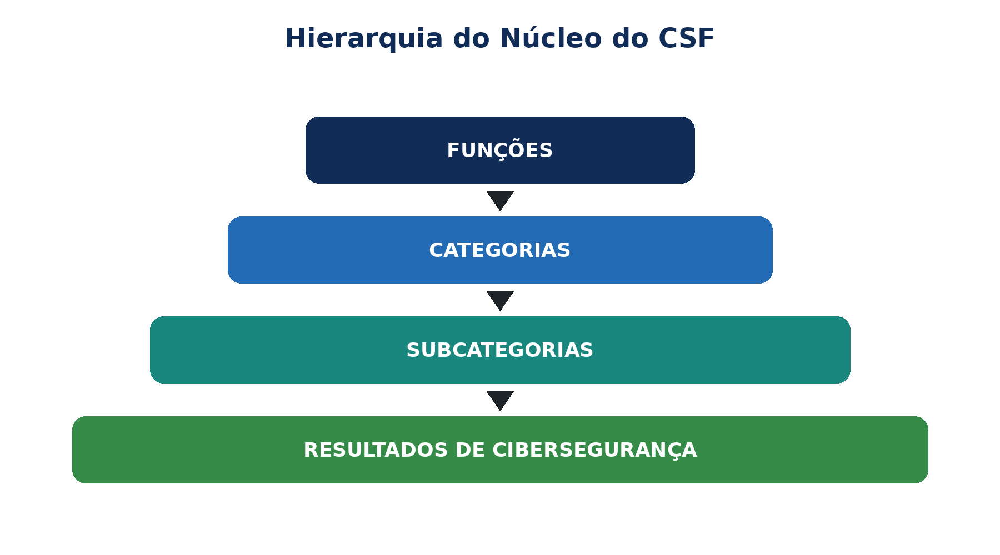

> **Status da revisão:** Rascunho de tradução assistida por máquina. Requer revisão humana de terminologia, significado, links, formatação e atualidade técnica antes de ser marcado como edição final.

** SÉRIES PRÁTICAS DE CIBERSegurança, PRIVACIDADE E COMPLIANÇA

**NIST CYBERSECURITY Framework 2.0**

**Práctica GRC, Implementação, Evidência e Ferramentas de Código Aberto**

* Um manual de trabalho para gerentes, analistas júnior, estudantes, mudadores de carreira e equipes de segurança cibernética*

** Alberto (Al) Leiva**

Primeira edição • Julho de 2026

Inside:** Todos os 106 CSF Resultados principais • Perfis • Níveis • GRC • cadeia de abastecimento • provas • testes de controlo • ferramentas de código aberto • laboratórios • preparação de carreira
---------------------------------------------------------------------------------------------------------------------------

# Publicação e Aviso de Uso

Autor: Alberto (Al) Leiva

Edição: Primeira Edição, Julho 2026

Objetivo: Educação prática gratuita para gestores, analistas júnior, estudantes, profissionais de mudança de carreira, profissionais de risco e profissionais de segurança cibernética.

# # Aviso educacional

Este manual fornece informações educacionais gerais. Não cria certificação, conformidade legal, um parecer de auditoria ou uma garantia de segurança. As organizações devem adaptar o NIST CSF à sua missão, riscos, obrigações, apetite de risco, recursos, tecnologias e stakeholders. Use as fontes oficiais atuais e qualificadas legais, risco, privacidade, segurança, auditoria e consultoria técnica para decisões reais.

# # Uso ético e autorizado

Use ferramentas técnicas apenas em sistemas, aplicativos, redes, contas em nuvem e dados que você possui ou estão especificamente autorizados por escrito para avaliar. Use dados ficcionais, sintéticos ou aprovados em treinamento. A habilidade técnica não cria permissão.

Prefácio

*Uma introdução acolhedora à gestão prática dos riscos de cibersegurança.*

O trabalho de segurança cibernética pode parecer uma coleção de produtos, alertas, políticas e tarefas técnicas. O NIST Cybersecurity Framework dá a essas atividades uma linguagem compartilhada. Ajuda os líderes a explicar o que os resultados importam, ajuda os gestores a definir prioridades e ajuda os profissionais a conectar o trabalho diário ao risco organizacional.

CSF 2.0 é deliberadamente flexível. Ele não diz a todas as organizações para comprar a mesma ferramenta, implementar o mesmo controle, ou alcançar o mesmo nível. Descreve os resultados. Um hospital, fabricante, escola, banco, startup, agência governamental e sem fins lucrativos podem usar o mesmo núcleo ao escolher diferentes prioridades e implementações.

Este manual segue uma metodologia-primeira abordagem. Uma planilha de framework é útil somente quando o escopo é preciso. Um painel verde é útil apenas quando as evidências são confiáveis. Um resultado do scanner é útil apenas quando alguém valida, prioriza, corrige e reteste. Os gestores continuam a ser responsáveis por decisões; os analistas melhoram essas decisões reunindo fatos completos e comunicando-se claramente.

Como usar este manual

Os gestores devem começar pelos capítulos 1–3, 10–17 e pelos modelos do capítulo 22.

Os analistas júnior devem estudar os seis capítulos de Função, método de verificação, ferramentas, laboratório e preparação de entrevista.

As equipes técnicas devem mapear os achados para ativos, riscos, resultados CSF, implementação, proprietários, evidências e medidas corretivas.

As equipes legais, de privacidade, de segurança, de tecnologia operacional e de negócios devem rever as decisões que afetam suas responsabilidades.

*Conteúdo verdadeiro da palavra:** O guia de capítulo abaixo contém números de página específicos da edição após a renderização final. O documento também contém um campo TOC nativo do Word. Depois de editar, clique com o botão direito e selecione Atualizar Campo e, em seguida, Atualizar tabela inteira.
□------------------------------------------------------------------------------------------------------------------------------------------------------------------------------------------------------------------------------------------------------------------------------------------------------------------

Sumário

[Comunicação de publicação e utilização [2](#publication-and-use-notice)](#publication-and-use-notice)

[Comunicação educativa [2](#educational-notice)](#educational-notice)

[Utilização ética e autorizada [2](#ethical-and-authorized-use)](#ethical-and-authorized-use)

[Prefácio [3](#preface)](#preface)

[Como usar este manual [4](#how-to-use-this-manual)](#how-to-use-this-manual)

[Quadro de conteúdos [4](#table-of-contents)](#table-of-contents)

[1. NIST CSF 2.0 Fundações [9](#nist-csf-2.0-foundations)](#nist-csf-2.0-foundations)

[1.1 O que é CSF 2.0 [9](#what-csf-2.0-is)](#what-csf-2.0-is)

[1.2 O que mudou com CSF 1.1 [9](#what-changed-from-csf-1.1)](#what-changed-from-csf-1.1)

[1.3 O que CSF 2.0 não é [9](#what-csf-2.0-is-not)](#what-csf-2.0-is-not)

[2. Núcleo, perfis, níveis e recursos de apoio [11](#core-profiles-tiers-and-supporting-resources)](#core-profiles-tiers-and-supporting-resources)

[3. Roteiro de Implementação Prática [12](#practical-implementation-roadmap)](#practical-implementation-roadmap)

[4. Função do Governo [13](#govern-function)](#govern-function)

[Contexto organizacional (GV.OC) [13](#organizational-context-gv.oc)](#organizational-context-gv.oc)

[Estratégia de gestão do risco (GV.RM) [13](#risk-management-strategy-gv.rm)](#risk-management-strategy-gv.rm)

[Roles, Responsabilidades e Autoridades (GV.RR) [14](#roles-responsibilities-and-authorities-gv.rr)](#roles-responsibilities-and-authorities-gv.rr)

[Política (GV.PO) [14](#policy-gv.po)](#policy-gv.po)

[Oversight (GV.OV) [14](#oversight-gv.ov)](#oversight-gv.ov)

[Gestão do risco da cadeia de abastecimento de cibersegurança (GV.SC) [15](#cybersecurity-supply-chain-risk-management-gv.sc)](#cybersecurity-supply-chain-risk-management-gv.sc)

[5. Função IDENTIFY [16](#identify-function)](#identify-function)

[Gestão de ativos (ID.AM) [16](#asset-management-id.am)](#asset-management-id.am)

[Avaliação do risco (ID.RA) [16](#risk-assessment-id.ra)](#risk-assessment-id.ra)

[Melhoramento (ID.IM) [17](#improvement-id.im)](#improvement-id.im)

[6. Função de proteção [18](#protect-function)](#protect-function)

[Gestão de identidade, autenticação e controle de acesso (PR.AA) [18](#identity-management-authentication-and-access-control-pr.aa)](#identity-management-authentication-and-access-control-pr.aa)

[Consciência e formação (PR.AT) [18](#awareness-and-training-pr.at)](#awareness-and-training-pr.at)

[Segurança de dados (PR.DS) [18](#data-security-pr.ds)](#data-security-pr.ds)

[Segurança da plataforma (PR.PS) [19](#platform-security-pr.ps)](#platform-security-pr.ps)

[Resistência à infraestrutura tecnológica (PR.IR) [19](#technology-infrastructure-resilience-pr.ir)](#technology-infrastructure-resilience-pr.ir)

[7. Função DETECT [21](#detect-function)](#detect-function)

[Monitorização contínua (DE.CM) [21](#continuous-monitoring-de.cm)](#continuous-monitoring-de.cm)

[Análise adversa dos acontecimentos (DE.AE) [21](#adverse-event-analysis-de.ae)](#adverse-event-analysis-de.ae)

[8. Função de resposta [23](#respond-function)](#respond-function)

[Gestão de incidentes (RS.MA) [23](#incident-management-rs.ma)](#incident-management-rs.ma)

[Análise Incidental (RS.AN) [23](#incident-analysis-rs.an)](#incident-analysis-rs.an)

[Reportagem e comunicação de resposta incidente (RS.CO) [24](#incident-response-reporting-and-communication-rs.co)](#incident-response-reporting-and-communication-rs.co)

[Mitigação incidente (RS.MI) [24](#incident-mitigation-rs.mi)](#incident-mitigation-rs.mi)

[9. Função de recuperação [25](#recover-function)](#recover-function)

[Execução do plano de recuperação de incidentes (RC.RP) [25](#incident-recovery-plan-execution-rc.rp)](#incident-recovery-plan-execution-rc.rp)

[Comunicação relativa à recuperação de incidentes (RC.CO) [25](#incident-recovery-communication-rc.co)](#incident-recovery-communication-rc.co)

[10. Perfis organizacionais [26](#organizational-profiles)](#organizational-profiles)

[10.1 Declaração de âmbito do perfil [26](#profile-scope-statement)](#profile-scope-statement)

[10.2 Estado do resultado [26](#outcome-status)](#outcome-status)

[27](#gap-prioritization)](#gap-prioritization)

[11. CSF Tiers [28](#csf-tiers)](#csf-tiers)

[12. Risco empresarial, apetite de risco e comunicação [29](#enterprise-risk-risk-appetite-and-communication)](#enterprise-risk-risk-appetite-and-communication)

[12.1 Declaração de risco [29](#executive-risk-statement)](#executive-risk-statement)

[12.2 Perguntas a nível de conselho [29](#board-level-questions)](#board-level-questions)

[13. Risco da cadeia de abastecimento de segurança cibernética [30](#cybersecurity-supply-chain-risk)](#cybersecurity-supply-chain-risk)

[14. Métricas, provas e relatórios [31](#metrics-evidence-and-reporting)](#metrics-evidence-and-reporting)

[14.1 Qualidade dos elementos de prova [31](#evidence-quality)](#evidence-quality)

[15. Ensaios de verificação e controlo da conformidade [32](#compliance-verification-and-control-testing)](#compliance-verification-and-control-testing)

[15.1 Ensaios práticos de verificação [32](#practical-verification-tests)](#practical-verification-tests)

[15.2 Língua de conclusão [33](#conclusion-language)](#conclusion-language)

[16. Ferramentas de código aberto para CSF Work [34](#open-source-tools-for-csf-work)](#open-source-tools-for-csf-work)

[16.1 Lista de verificação de validação da ferramenta [34](#tool-validation-checklist)](#tool-validation-checklist)

[16.2 Assistente CISO [35](#ciso-assistant)](#ciso-assistant)

[Início rápido [35](#quick-start)](#quick-start)

[Evidência e limitação [35](#evidence-and-limitation)](#evidence-and-limitation)

[16.3 Wazuh [35](#wazuh)](#wazuh)

[Início rápido [35](#quick-start-1)](#quick-start-1)

[Evidência e limitação [35](#evidence-and-limitation-1)](#evidence-and-limitation-1)

[16.4 osquery [35](#osquery)](#osquery)

[Início rápido [35](#quick-start-2)](#quick-start-2)

[Evidência e limitação [36](#evidence-and-limitation-2)](#evidence-and-limitation-2)

[16.5 OpenSCAP [36](#openscap)](#openscap)

[Início rápido [36](#quick-start-3)](#quick-start-3)

[Evidência e limitação [36](#evidence-and-limitation-3)](#evidence-and-limitation-3)

[16.6 Greenbone Community Edition [36](#greenbone-community-edition)](#greenbone-community-edition)

[Início rápido [36](#quick-start-4)](#quick-start-4)

[Evidência e limitação [36](#evidence-and-limitation-4)](#evidence-and-limitation-4)

[16.7 Trivy [36](#trivy)](#trivy)

[Início rápido [36](#quick-start-5)](#quick-start-5)

[Evidência e limitação [37](#evidence-and-limitation-5)](#evidence-and-limitation-5)

[16,8 OWASP ZAP [37](#owasp-zap)](#owasp-zap)

[Início rápido [37](#quick-start-6)](#quick-start-6)

[Evidência e limitação [37](#evidence-and-limitation-6)](#evidence-and-limitation-6)

[16.9 Keycloak [37](#keycloak)](#keycloak)

[Início rápido [37](#quick-start-7)](#quick-start-7)

[Evidência e limitação [37](#evidence-and-limitation-7)](#evidence-and-limitation-7)

[16,10 DefectDojo [37](#defectdojo)](#defectdojo)

[Início rápido [37](#quick-start-8)](#quick-start-8)

[Evidência e limitação [37](#evidence-and-limitation-8)](#evidence-and-limitation-8)

[16.11 Velociraptor [38](#velociraptor)](#velociraptor)

[Início rápido [38](#quick-start-9)](#quick-start-9)

[Evidência e limitação [38](#evidence-and-limitation-9)](#evidence-and-limitation-9)

[16.12 Agente de política aberta [38](#open-policy-agent)](#open-policy-agent)

[Início rápido [38](#quick-start-10)](#quick-start-10)

[Evidência e limitação [38](#evidence-and-limitation-10)](#evidence-and-limitation-10)

[16.13 OpenSearch [38](#opensearch)](#opensearch)

[Início rápido [38](#quick-start-11)](#quick-start-11)

[Evidência e limitação [38](#evidence-and-limitation-11)](#evidence-and-limitation-11)

[16.14 Ferramentas NIST oficiais [38](#official-nist-tools)](#official-nist-tools)

[17. Playbook CSF do gestor [40](#managers-csf-playbook)](#managers-csf-playbook)

[17.1 Questões mensais [40](#monthly-questions)](#monthly-questions)

[17.2 Painel [40](#dashboard)](#dashboard)

[17.3 Erros comuns [40](#common-mistakes)](#common-mistakes)

[18. De Iniciante a Analista Júnior [41](#from-beginner-to-junior-analyst)](#from-beginner-to-junior-analyst)

[18.1 Funções de nível de entrada [41](#entry-level-roles)](#entry-level-roles)

[18.2 Trabalhar um analista júnior pode executar [41](#work-a-junior-analyst-may-perform)](#work-a-junior-analyst-may-perform)

[18.3 Prova de carteira [42](#portfolio-proof)](#portfolio-proof)

[19. Laboratório Fictício e Portfólio [43](#fictional-laboratory-and-portfolio)](#fictional-laboratory-and-portfolio)

[Projecto 1 — Âmbito e contexto [43](#project-1-scope-and-context)](#project-1-scope-and-context)

[Projeto 2 — Ativos e mapa de dados [43](#project-2-asset-and-data-map)](#project-2-asset-and-data-map)

[Projeto 3 — Risco [43](#project-3-risk)](#project-3-risk)

[Projeto 4 — Perfis [43](#project-4-profiles)](#project-4-profiles)

[Projeto 5 — Controlos e testes [43](#project-5-controls-and-tests)](#project-5-controls-and-tests)

[Projeto 6 — Incidente [43](#project-6-incident)](#project-6-incident)

[Projeto 7 — Ferramentas [43](#project-7-tools)](#project-7-tools)

[Projecto 8 — Relatório executivo [43](#project-8-executive-report)](#project-8-executive-report)

[20. Plano de aprendizagem de trinta dias [44](#thirty-day-learning-plan)](#thirty-day-learning-plan)

[20,1 Costumes diários [44](#daily-habit)](#daily-habit)

[21. Preparação da entrevista [45](#interview-preparation)](#interview-preparation)

[O que é NIST CSF 2.0? [45](#what-is-nist-csf-2.0)](#what-is-nist-csf-2.0)

[Quais são as seis Funções? [45](#what-are-the-six-functions)](#what-are-the-six-functions)

[Por que foi adicionado o Govern? [45](#why-was-govern-added)](#why-was-govern-added)

[O que é um perfil atual? [45](#what-is-a-current-profile)](#what-is-a-current-profile)

[O que é um perfil alvo? [45](#what-is-a-target-profile)](#what-is-a-target-profile)

[O que são níveis? [45](#what-are-tiers)](#what-are-tiers)

[O CSF certifica a conformidade? [45](#does-csf-certify-compliance)](#does-csf-certify-compliance)

[Como você verifica um resultado? [45](#how-do-you-verify-an-outcome)](#how-do-you-verify-an-outcome)

[Como devem ser usadas as ferramentas? [45](#how-should-tools-be-used)](#how-should-tools-be-used)

[Como você prioriza lacunas? [46](#how-do-you-prioritize-gaps)](#how-do-you-prioritize-gaps)

[22. Modelos e listas de verificação [47](#templates-and-checklists)](#templates-and-checklists)

[22.1 Registo do perfil [47](#profile-record)](#profile-record)

[22.2 Registo de risco [47](#risk-register)](#risk-register)

[22.3 Folha de ensaio de controlo [47](#control-test-sheet)](#control-test-sheet)

[22.4 Avaliação do fornecedor [47](#supplier-review)](#supplier-review)

[22.5 Lista de verificação de prontidão do gestor [48](#manager-readiness-checklist)](#manager-readiness-checklist)

[23. Índice de Glossário e Assunto [49](#glossary-and-subject-index)](#glossary-and-subject-index)

[23.1 Índice do assunto [49](#subject-index)](#subject-index)

[24. Referências oficiais e estudo complementar [50](#official-references-and-further-study)](#official-references-and-further-study)

# 1. Fundação NIST CSF 2.0

* O que é o framework, o que mudou, e o que não reivindica.*

Figura 1. As seis funções NIST CSF 2.0

## 1.1 O que é CSF 2.0

NIST publicou CSF 2.0 em 26 de fevereiro de 2024. É projetado para organizações de cada tamanho, setor e nível de sofisticação técnica. Seus resultados são país, setor e tecnologia neutra. As organizações podem adotá-lo voluntariamente ou porque uma política, contrato, regulador, cliente ou padrão interno pede por ele.

# 1.2 O que mudou com CSF 1.1

- GOVERNO tornou-se uma sexta função, colocando liderança, política, risco empresarial, e responsabilização no centro.

- A segurança cibernética da cadeia de abastecimento recebeu maior ênfase.

- A linguagem foi alargada para além da infra-estrutura crítica, pelo que o quadro serve claramente a todas as organizações.

- Perfis, Níveis, Exemplos de Implementação, Referências Informativas e Guias de Iniciação Rápida formam um portfólio CSF maior.

- Alguns números de subcategoria contêm lacunas intencionais porque CSF 1.1 conteúdo movido dentro CSF 2.0.

# # 1.3 O que CSF 2.0 não é

- Não é uma lei sozinha.

- Não é um catálogo de controle único ou lista de tecnologia obrigatória.

- Não fornece uma pontuação universal passe/falha.

- NIST não certifica organizações, produtos, consultores ou avaliadores contra o CSF.

- Um nível alto não é automaticamente o alvo certo para cada escopo.

- Um mapeamento para um resultado CSF não prova que o resultado é alcançado.

# 2. Núcleo, Perfis, Níveis e Recursos de Apoio

* As peças de CSF 2.0 e como eles se encaixam.*

Figura 2. CSF Hierarquia do núcleo

• ** ** ** ** ** ** ** Uso prático **
-----------------------------------------------------------------------------------------------------------------------------------------------------------------------------
Uma hierarquia de seis Funções, 22 Categorias e 106 Subcategorias
Perfil Organizacional Resultados atuais e/ou alvos para um escopo definido Compare postura, priorize lacunas, plan work
Perfil da Comunidade Uma linha de base de resultados partilhados para um sector, tecnologia, ameaça ou caso de utilização .
Contexto para o rigor da governação e das práticas de gestão de riscos
□ Exemplos de Implementação • Ações nocionais que podem ajudar a alcançar resultados
• Referências informativas; • Mapeamento de padrões, orientações, regulamentos e outras fontes;
Guias de Iniciação Rápida Guia Acionável Breve sobre CSF específico usa Perfil Inicial, Nível, MTC, cadeia de suprimentos e trabalho de pequeno negócio

Números que importam:** CSF 2.0 contém 6 Funções, 22 Categorias e 106 subcategorias. As subcategorias descrevem resultados, produtos não exigidos ou implementações idênticas. □
□-------------------------------------------------------------------------------------------------------------------------------------------------------------------------------------------------------------------------------------------------------------------------------------------------

3. Roteiro de Implementação Prática

*Uma forma repetitiva de passar da linguagem framework para a melhoria financiada.*

- Nomeie um patrocinador executivo e proprietário do programa.

- Defina o escopo do perfil: empresa, unidade de negócios, produto, serviço, sistema, região ou ecossistema de fornecedores.

- Reunir missão, stakeholder, legal, contratual, risco, ativo, ameaça, incidente, auditoria, força de trabalho e informações do fornecedor.

- Selecione os resultados CSF aplicáveis e crie um perfil atual usando evidências confiáveis.

- Definir um perfil-alvo baseado no risco, considerando Perfis e obrigações da Comunidade.

- Analise lacunas, dependências, custo, viabilidade e redução de risco.

- Criar um plano de ação aprovado com proprietários, recursos, marcos, medidas e proteção provisória.

- Aplicar controlos e procedimentos operacionais.

- Projeto de teste e eficácia operacional com populações completas e amostras representativas.

- Relatar risco, decisões, exceções, progresso e limitações.

- Atualizar perfis após mudanças materiais, incidentes, exercícios, comentários ou risco de mudança.

Comece pequeno sem perder a integridade:** Uma pequena organização pode começar com um serviço crítico ou processo de alto risco. Mantenha o escopo honesto, registre exclusões e expanda deliberadamente. □
---------------------------------------------------------------------------------------------------

4. Função do GOVERNO

* Uma discriminação completa em língua simples de cada categoria e subcategoria GOVERN.*

□ ** Objectivo da função:** Defina direção, expectativas, responsabilização, política, supervisão e gerenciamento de risco da cadeia de suprimentos. □
---------------------------------------------------------------------------------------------------------------------------------------------------------------------------------------------------------------------------------------------------------------------------------------

# # Contexto organizacional (GV.OC)

Resultado** Resultado** Significado do plano** Verificação do gestor ou analista** Exemplo de evidência**
--------------------------------------------------------------------------------------------------------------------------------------------------------------------------------------------------------------------------------------------------------------------------
□ GV.OC-01 □ Conecte as decisões de segurança cibernética à missão da organização. Confirmar propriedade, escopo, implementação, revisão, exceções, ação corretiva e operação repetitiva. Missão e registros de stakeholders, registro de obrigações, mapa de dependência
□ GV.OC-02 Identifique os stakeholders e considere suas expectativas de segurança cibernética. Confirmar propriedade, escopo, implementação, revisão, exceções, ação corretiva e operação repetitiva. Missão e registros de stakeholders, registro de obrigações, mapa de dependência
□ GV.OC-03 Identifique e gerencie obrigações legais, regulamentares, contratuais, de privacidade e de liberdade civil. Confirmar propriedade, escopo, implementação, revisão, exceções, ação corretiva e operação repetitiva. Missão e registros de stakeholders, registro de obrigações, mapa de dependência
O GV.OC-04 Compreender e comunicar os serviços críticos que outros esperam da organização. Confirmar propriedade, escopo, implementação, revisão, exceções, ação corretiva e operação repetitiva. Missão e registros de stakeholders, registro de obrigações, mapa de dependência
GV.OC-05 Compreender e comunicar os resultados, capacidades e serviços externos da organização depende. Confirmar propriedade, escopo, implementação, revisão, exceções, ação corretiva e operação repetitiva. Missão e registros de stakeholders, registro de obrigações, mapa de dependência

*Importante: Resultados CSF não são uma lista de verificação de tecnologias necessárias. Selecione métodos de implementação e controles de acordo com o risco, missão, obrigações, recursos e o perfil alvo escopo.*

## Estratégia de Gestão de Risco (GV.RM)

Resultado** Resultado** Significado do plano** Verificação do gestor ou analista** Exemplo de evidência**
-----------------------------------------------------------------------------------------------------------------------------------------------------------------------------------------------------------------------------------------
□ GV.RM-01 □ Concordo com os objetivos de gerenciamento de risco de segurança cibernética com as partes interessadas relevantes. Confirmar propriedade, escopo, implementação, revisão, exceções, ação corretiva e operação repetitiva. Risco de apetite, método, registo de risco empresarial, caminhos de comunicação
• GV.RM-02 • Estabelecer, comunicar e manter as declarações de risco de apetite e tolerância. Confirmar propriedade, escopo, implementação, revisão, exceções, ação corretiva e operação repetitiva. Risco de apetite, método, registo de risco empresarial, caminhos de comunicação
O GV.RM-03 Integra o risco de segurança cibernética em processos de gestão de riscos empresariais. Confirmar propriedade, escopo, implementação, revisão, exceções, ação corretiva e operação repetitiva. Risco de apetite, método, registo de risco empresarial, caminhos de comunicação
□ GV.RM-04 □ Definir e comunicar opções aceitáveis de resposta ao risco. Confirmar propriedade, escopo, implementação, revisão, exceções, ação corretiva e operação repetitiva. Risco de apetite, método, registo de risco empresarial, caminhos de comunicação
O GV.RM-05 Criar caminhos de comunicação para riscos cibernéticos, incluindo riscos de fornecedores e terceiros. Confirmar propriedade, escopo, implementação, revisão, exceções, ação corretiva e operação repetitiva. Risco de apetite, método, registo de risco empresarial, caminhos de comunicação
Use um método consistente para calcular, documentar, categorizar e priorizar riscos cibernéticos. Confirmar propriedade, escopo, implementação, revisão, exceções, ação corretiva e operação repetitiva. Risco de apetite, método, registo de risco empresarial, caminhos de comunicação
O GV.RM-07 Inclui oportunidades benéficas e risco positivo nas discussões sobre segurança cibernética. Confirmar propriedade, escopo, implementação, revisão, exceções, ação corretiva e operação repetitiva. Risco de apetite, método, registo de risco empresarial, caminhos de comunicação

*Importante: Resultados CSF não são uma lista de verificação de tecnologias necessárias. Selecione métodos de implementação e controles de acordo com o risco, missão, obrigações, recursos e o perfil alvo escopo.*

# # Funções, responsabilidades e autoridades (GV.RR)

Resultado** Resultado** Significado do plano** Verificação do gestor ou analista** Exemplo de evidência**
----------------------------------------------------------------------------------------------------------------------------------------------------------------------------------------------------------------------------------------------------------------------------
GV.RR-01 A liderança aceita a responsabilidade pelo risco de cibersegurança e apoia uma cultura ética, melhorando. Confirmar propriedade, escopo, implementação, revisão, exceções, ação corretiva e operação repetitiva. RACI, descrições de trabalho, orçamento, registros de força de trabalho
□ GV.RR-02 □ Estabelecer, comunicar, compreender e impor funções cibernéticas, responsabilidades e autoridade. Confirmar propriedade, escopo, implementação, revisão, exceções, ação corretiva e operação repetitiva. RACI, descrições de trabalho, orçamento, registros de força de trabalho
Alocar pessoas, dinheiro, tecnologia e tempo de acordo com a estratégia e política de risco. Confirmar propriedade, escopo, implementação, revisão, exceções, ação corretiva e operação repetitiva. RACI, descrições de trabalho, orçamento, registros de força de trabalho
O GV.RR-04 Incluir responsabilidades de segurança cibernética nas práticas de recursos humanos. Confirmar propriedade, escopo, implementação, revisão, exceções, ação corretiva e operação repetitiva. RACI, descrições de trabalho, orçamento, registros de força de trabalho

*Importante: Resultados CSF não são uma lista de verificação de tecnologias necessárias. Selecione métodos de implementação e controles de acordo com o risco, missão, obrigações, recursos e o perfil alvo escopo.*

# # Política (GV.PO)

Resultado** Resultado** Significado do plano** Verificação do gestor ou analista** Exemplo de evidência**
---------------------------------------------------------------------------------------------------------------------------------------------------------------------------------------------------------------------------------------------------------------
□ GV.PO-01 □ Estabelecer, comunicar e aplicar a política de segurança cibernética com base em contexto, estratégia e prioridades. Confirmar propriedade, escopo, implementação, revisão, exceções, ação corretiva e operação repetitiva. Política aprovada, agradecimentos, histórico de revisão, registros de execução
O GV.PO-02 Revisão e atualização da política quando os requisitos, ameaças, tecnologia ou a mudança da missão. Confirmar propriedade, escopo, implementação, revisão, exceções, ação corretiva e operação repetitiva. Política aprovada, agradecimentos, histórico de revisão, registros de execução

*Importante: Resultados CSF não são uma lista de verificação de tecnologias necessárias. Selecione métodos de implementação e controles de acordo com o risco, missão, obrigações, recursos e o perfil alvo escopo.*

# # Supervisão (GV.OV)

Resultado** Resultado** Significado do plano** Verificação do gestor ou analista** Exemplo de evidência**
--------------------------------------------------------------------------------------------------------------------------------------------------------------------------------------------------------------------------
O GV.OV-01 Reveja os resultados da estratégia e use-os para ajustar a direção. Confirmar propriedade, escopo, implementação, revisão, exceções, ação corretiva e operação repetitiva. Painel, atas de reunião, decisões, mudanças de estratégia
Ajustar a estratégia de risco quando os requisitos ou riscos não são totalmente cobertos. Confirmar propriedade, escopo, implementação, revisão, exceções, ação corretiva e operação repetitiva. Painel, atas de reunião, decisões, mudanças de estratégia
Avaliar o desempenho em segurança cibernética e determinar as mudanças necessárias. Confirmar propriedade, escopo, implementação, revisão, exceções, ação corretiva e operação repetitiva. Painel, atas de reunião, decisões, mudanças de estratégia

*Importante: Resultados CSF não são uma lista de verificação de tecnologias necessárias. Selecione métodos de implementação e controles de acordo com o risco, missão, obrigações, recursos e o perfil alvo escopo.*

# # Gerenciamento de risco da cadeia de suprimentos de segurança cibernética (GV.SC)

Resultado** Resultado** Significado do plano** Verificação do gestor ou analista** Exemplo de evidência**
------------------------------------------------------------------------------------------------------------------------------------------------------------------------------------------------------------------------------------------------------------------------------------------------------------------------------------------------------------------------------------------------------------------------------------------------------------------------------------------
□ GV.SC-01 □ Estabelecer um programa de risco de cadeia de suprimentos, estratégia, objetivos, políticas e processos. Confirmar propriedade, escopo, implementação, revisão, exceções, ação corretiva e operação repetitiva. Inventário do fornecedor, nivelamento, due diligence, contratos, monitoramento, prova de saída
O GV.SC-02 O Coordene funções de segurança cibernética para fornecedores, clientes, parceiros e proprietários internos. Confirmar propriedade, escopo, implementação, revisão, exceções, ação corretiva e operação repetitiva. Inventário do fornecedor, nivelamento, due diligence, contratos, monitoramento, prova de saída
O GV.SC-03 Integra o risco de cadeia de suprimentos no trabalho de cibersegurança, MTC, avaliação e melhoria. Confirmar propriedade, escopo, implementação, revisão, exceções, ação corretiva e operação repetitiva. Inventário do fornecedor, nivelamento, due diligence, contratos, monitoramento, prova de saída
GV.SC-04 Conheça os fornecedores e priorize-os por criticidade. Confirmar propriedade, escopo, implementação, revisão, exceções, ação corretiva e operação repetitiva. Inventário do fornecedor, nivelamento, due diligence, contratos, monitoramento, prova de saída
□ GV.SC-05 □ Coloque requisitos de segurança cibernética priorizados em contratos e acordos. Confirmar propriedade, escopo, implementação, revisão, exceções, ação corretiva e operação repetitiva. Inventário do fornecedor, nivelamento, due diligence, contratos, monitoramento, prova de saída
O GV.SC-06 Realizar planejamento e diligência devida antes de iniciar relacionamentos de terceiros. Confirmar propriedade, escopo, implementação, revisão, exceções, ação corretiva e operação repetitiva. Inventário do fornecedor, nivelamento, due diligence, contratos, monitoramento, prova de saída
O GV.SC-07 Record, avalie, responda e monitore os riscos do fornecedor, produto, serviço e terceiros. Confirmar propriedade, escopo, implementação, revisão, exceções, ação corretiva e operação repetitiva. Inventário do fornecedor, nivelamento, due diligence, contratos, monitoramento, prova de saída
□ GV.SC-08 □ Inclua terceiros relevantes no planejamento, resposta e recuperação de incidentes. Confirmar propriedade, escopo, implementação, revisão, exceções, ação corretiva e operação repetitiva. Inventário do fornecedor, nivelamento, due diligence, contratos, monitoramento, prova de saída
• GV.SC-09 • Monitore a segurança da cadeia de suprimentos ao longo do ciclo de vida do produto e do serviço tecnológico. Confirmar propriedade, escopo, implementação, revisão, exceções, ação corretiva e operação repetitiva. Inventário do fornecedor, nivelamento, due diligence, contratos, monitoramento, prova de saída
O GV.SC-10 Planeje atividades de segurança para o fim de um acordo de parceria ou serviço. Confirmar propriedade, escopo, implementação, revisão, exceções, ação corretiva e operação repetitiva. Inventário do fornecedor, nivelamento, due diligence, contratos, monitoramento, prova de saída

*Importante: Resultados CSF não são uma lista de verificação de tecnologias necessárias. Selecione métodos de implementação e controles de acordo com o risco, missão, obrigações, recursos e o perfil alvo escopo.*

# 5. Função IDENTIFY

* Uma discriminação completa em língua simples de cada categoria e subcategoria IDENTIFY.*

□ ** Objectivo da função:** Compreenda ativos, dependências, ameaças, vulnerabilidades, riscos e necessidades de melhoria. □
O que é que se passa?

# # Gerenciamento de ativos (ID.AM)

Resultado** Resultado** Significado do plano** Verificação do gestor ou analista** Exemplo de evidência**
-------------------------------------------------------------------------------------------------------------------------------------------------------------------------------------------------------------------------------------------------------
• ID.AM-01 • Mantenha um inventário de hardware gerenciado. Confirmar propriedade, escopo, implementação, revisão, exceções, ação corretiva e operação repetitiva. inventários de ativos e dados, proprietários, diagramas, registros de ciclo de vida
• ID.AM-02 • Mantenha um inventário de software, serviços e sistemas gerenciados. Confirmar propriedade, escopo, implementação, revisão, exceções, ação corretiva e operação repetitiva. inventários de ativos e dados, proprietários, diagramas, registros de ciclo de vida
O ID.AM-03 mantém diagramas atuais de comunicação de rede autorizada e fluxos de dados. Confirmar propriedade, escopo, implementação, revisão, exceções, ação corretiva e operação repetitiva. inventários de ativos e dados, proprietários, diagramas, registros de ciclo de vida
O ID.AM-04 Manter um inventário dos serviços fornecidos pelo fornecedor. Confirmar propriedade, escopo, implementação, revisão, exceções, ação corretiva e operação repetitiva. inventários de ativos e dados, proprietários, diagramas, registros de ciclo de vida
O ID.AM-05 Priorizar ativos por classificação, criticidade, recursos e impacto da missão. Confirmar propriedade, escopo, implementação, revisão, exceções, ação corretiva e operação repetitiva. inventários de ativos e dados, proprietários, diagramas, registros de ciclo de vida
□ ID.AM-07 □ Inventário designado tipos de dados e seus metadados. Confirmar propriedade, escopo, implementação, revisão, exceções, ação corretiva e operação repetitiva. inventários de ativos e dados, proprietários, diagramas, registros de ciclo de vida
O ID.AM-08 Gerenciar sistemas, hardware, software, serviços e dados ao longo de seus ciclos de vida. Confirmar propriedade, escopo, implementação, revisão, exceções, ação corretiva e operação repetitiva. inventários de ativos e dados, proprietários, diagramas, registros de ciclo de vida

*Importante: Resultados CSF não são uma lista de verificação de tecnologias necessárias. Selecione métodos de implementação e controles de acordo com o risco, missão, obrigações, recursos e o perfil alvo escopo.*

# # Avaliação de risco (ID.RA)

Resultado** Resultado** Significado do plano** Verificação do gestor ou analista** Exemplo de evidência**
------------------------------------------------------------------------------------------------------------------------------------------------------------------------------------------------------------------------------------------------------------------------------------------------------------------------------------------------------------------------------------------------------------------------------------------------------
□ ID.RA-01 Identifique, valide e registre vulnerabilidades de ativos. Confirmar propriedade, escopo, implementação, revisão, exceções, ação corretiva e operação repetitiva. Registros de ameaça e vulnerabilidade, análise de risco, tratamento e exceções
□ ID.RA-02 □ Receba informações sobre ameaças cibernéticas de fontes de compartilhamento adequadas. Confirmar propriedade, escopo, implementação, revisão, exceções, ação corretiva e operação repetitiva. Registros de ameaça e vulnerabilidade, análise de risco, tratamento e exceções
□ ID.RA-03 Identifique e registre ameaças internas e externas. Confirmar propriedade, escopo, implementação, revisão, exceções, ação corretiva e operação repetitiva. Registros de ameaça e vulnerabilidade, análise de risco, tratamento e exceções
□ ID.RA-04 □ Estimar a probabilidade e o impacto das ameaças que exploram vulnerabilidades. Confirmar propriedade, escopo, implementação, revisão, exceções, ação corretiva e operação repetitiva. Registros de ameaça e vulnerabilidade, análise de risco, tratamento e exceções
□ ID.RA-05 □ Use ameaças, vulnerabilidades, probabilidade e impacto para entender o risco e prioridades inerentes. Confirmar propriedade, escopo, implementação, revisão, exceções, ação corretiva e operação repetitiva. Registros de ameaça e vulnerabilidade, análise de risco, tratamento e exceções
□ ID.RA-06 Escolha, priorize, planifique, rastreie e comunique respostas de risco. Confirmar propriedade, escopo, implementação, revisão, exceções, ação corretiva e operação repetitiva. Registros de ameaça e vulnerabilidade, análise de risco, tratamento e exceções
Avaliar, registrar, aprovar e rastrear o efeito de risco de mudanças e exceções. Confirmar propriedade, escopo, implementação, revisão, exceções, ação corretiva e operação repetitiva. Registros de ameaça e vulnerabilidade, análise de risco, tratamento e exceções
O ID.RA-08 Estabelecer um processo para receber, analisar e responder às divulgações de vulnerabilidade. Confirmar propriedade, escopo, implementação, revisão, exceções, ação corretiva e operação repetitiva. Registros de ameaça e vulnerabilidade, análise de risco, tratamento e exceções
Avaliar a autenticidade e integridade do hardware e software antes da aquisição e uso. Confirmar propriedade, escopo, implementação, revisão, exceções, ação corretiva e operação repetitiva. Registros de ameaça e vulnerabilidade, análise de risco, tratamento e exceções
O ID.RA-10 Avaliar fornecedores críticos antes da aquisição. Confirmar propriedade, escopo, implementação, revisão, exceções, ação corretiva e operação repetitiva. Registros de ameaça e vulnerabilidade, análise de risco, tratamento e exceções

*Importante: Resultados CSF não são uma lista de verificação de tecnologias necessárias. Selecione métodos de implementação e controles de acordo com o risco, missão, obrigações, recursos e o perfil alvo escopo.*

# # Melhoria (ID.IM)

Resultado** Resultado** Significado do plano** Verificação do gestor ou analista** Exemplo de evidência**
------------------------------------------------------------------------------------------------------------------------------------------------------------------------------------------------------------
• ID.IM-01 • Identificar melhorias das avaliações. Confirmar propriedade, escopo, implementação, revisão, exceções, ação corretiva e operação repetitiva. Avaliação, exercício, lições, ações corretivas, planos atualizados
• ID.IM-02 • Identificar melhorias de testes e exercícios, incluindo exercícios coordenados de terceiros. Confirmar propriedade, escopo, implementação, revisão, exceções, ação corretiva e operação repetitiva. Avaliação, exercício, lições, ações corretivas, planos atualizados
O ID.IM-03 Identificar melhorias durante os processos operacionais, procedimentos e atividades. Confirmar propriedade, escopo, implementação, revisão, exceções, ação corretiva e operação repetitiva. Avaliação, exercício, lições, ações corretivas, planos atualizados
O ID.IM-04 Estabelecer, comunicar, manter e melhorar os planos de cibersegurança operacionais e de resposta a incidentes. Confirmar propriedade, escopo, implementação, revisão, exceções, ação corretiva e operação repetitiva. Avaliação, exercício, lições, ações corretivas, planos atualizados

*Importante: Resultados CSF não são uma lista de verificação de tecnologias necessárias. Selecione métodos de implementação e controles de acordo com o risco, missão, obrigações, recursos e o perfil alvo escopo.*

# 6. Função de proteção

* Uma discriminação completa em linguagem simples de cada categoria e subcategoria PROTECT.*

□ ** Objectivo da função:** Use salvaguardas que reduzem a probabilidade e o impacto de eventos de segurança cibernética.
□-----------------------------------------------------------------------------------------------------------------------------------------------------------------

# # Gestão de Identidade, Autenticação e Controle de Acesso (PR.AA)

Resultado** Resultado** Significado do plano** Verificação do gestor ou analista** Exemplo de evidência**
----------------------------------------------------------------------------------------------------------------------------------------------------------------------------------------------------------------------------------------------------------------------------------------------------------------------
O PR.AA-01 Gerencia identidades e credenciais para pessoas, serviços e hardware autorizados. Confirmar propriedade, escopo, implementação, revisão, exceções, ação corretiva e operação repetitiva. Inventário de identidade, matriz de acesso, configurações de MFA, revisões, tickets de remoção
O PR.AA-02 O que prova identidades e as vincula a credenciais de acordo com o risco da interação. Confirmar propriedade, escopo, implementação, revisão, exceções, ação corretiva e operação repetitiva. Inventário de identidade, matriz de acesso, configurações de MFA, revisões, tickets de remoção
O PR.AA-03 O Autenticar usuários, serviços e hardware. Confirmar propriedade, escopo, implementação, revisão, exceções, ação corretiva e operação repetitiva. Inventário de identidade, matriz de acesso, configurações de MFA, revisões, tickets de remoção
O PR.AA-04 protege, transmite e verifica as afirmações de identidade. Confirmar propriedade, escopo, implementação, revisão, exceções, ação corretiva e operação repetitiva. Inventário de identidade, matriz de acesso, configurações de MFA, revisões, tickets de remoção
□ PR.AA-05 □ Defina, execute e reveja permissões usando o menor privilégio e separação de deveres. Confirmar propriedade, escopo, implementação, revisão, exceções, ação corretiva e operação repetitiva. Inventário de identidade, matriz de acesso, configurações de MFA, revisões, tickets de remoção
O PR.AA-06 Gerenciar, monitorar e impor o acesso físico de acordo com o risco. Confirmar propriedade, escopo, implementação, revisão, exceções, ação corretiva e operação repetitiva. Inventário de identidade, matriz de acesso, configurações de MFA, revisões, tickets de remoção

*Importante: Resultados CSF não são uma lista de verificação de tecnologias necessárias. Selecione métodos de implementação e controles de acordo com o risco, missão, obrigações, recursos e o perfil alvo escopo.*

# # Conscientização e treino (PR.AT)

Resultado** Resultado** Significado do plano** Verificação do gestor ou analista** Exemplo de evidência**
------------------------------------------------------------------------------------------------------------------------------------------------------------------------------------------------------------------------------------------------------------------------------------------
• PR.AT-01 • Dê ao pessoal o conhecimento e as habilidades para executar o trabalho normal com risco cibernético em mente. Confirmar propriedade, escopo, implementação, revisão, exceções, ação corretiva e operação repetitiva. Currículo baseado em funções, lista, conclusão, exercícios, acompanhamento
- PR.AT-02 - Dê às pessoas em papéis especializados os conhecimentos e habilidades de cibersegurança que esses papéis exigem. Confirmar propriedade, escopo, implementação, revisão, exceções, ação corretiva e operação repetitiva. Currículo baseado em funções, lista, conclusão, exercícios, acompanhamento

*Importante: Resultados CSF não são uma lista de verificação de tecnologias necessárias. Selecione métodos de implementação e controles de acordo com o risco, missão, obrigações, recursos e o perfil alvo escopo.*

# # Segurança de dados (PR.DS)

Resultado** Resultado** Significado do plano** Verificação do gestor ou analista** Exemplo de evidência**
-------------------------------------------------------------------------------------------------------------------------------------------------------------------------------------------------------------------------------------------------------------
O PR.DS-01 Proteger os dados em repouso para confidencialidade, integridade e disponibilidade. Confirmar propriedade, escopo, implementação, revisão, exceções, ação corretiva e operação repetitiva. Classificação, configurações de criptografia, registros DLP, testes de backup e restauração
O PR.DS-02 Proteger dados em trânsito para confidencialidade, integridade e disponibilidade. Confirmar propriedade, escopo, implementação, revisão, exceções, ação corretiva e operação repetitiva. Classificação, configurações de criptografia, registros DLP, testes de backup e restauração
O PR.DS-10 Proteger dados em uso para confidencialidade, integridade e disponibilidade. Confirmar propriedade, escopo, implementação, revisão, exceções, ação corretiva e operação repetitiva. Classificação, configurações de criptografia, registros DLP, testes de backup e restauração
• PR.DS-11 • Crie, proteja, mantenha e teste backups. Confirmar propriedade, escopo, implementação, revisão, exceções, ação corretiva e operação repetitiva. Classificação, configurações de criptografia, registros DLP, testes de backup e restauração

*Importante: Resultados CSF não são uma lista de verificação de tecnologias necessárias. Selecione métodos de implementação e controles de acordo com o risco, missão, obrigações, recursos e o perfil alvo escopo.*

# # Segurança da plataforma (PR.PS)

Resultado** Resultado** Significado do plano** Verificação do gestor ou analista** Exemplo de evidência**
------------------------------------------------------------------------------------------------------------------------------------------------------------------------------------------------------------------------------------------------------------------------------
□ PR.PS-01 □ Estabelecer e aplicar práticas de gestão de configuração. Confirmar propriedade, escopo, implementação, revisão, exceções, ação corretiva e operação repetitiva. Linhas de base, registros de patch e EOL, logs, allowlisting, evidência de SDLC seguro
• PR.PS-02 • Manter, substituir e remover software de acordo com o risco. Confirmar propriedade, escopo, implementação, revisão, exceções, ação corretiva e operação repetitiva. Linhas de base, registros de patch e EOL, logs, allowlisting, evidência de SDLC seguro
• PR.PS-03 • Manter, substituir e remover hardware de acordo com o risco. Confirmar propriedade, escopo, implementação, revisão, exceções, ação corretiva e operação repetitiva. □ Baselines, patch e registros EOL, logs, allowlisting, evidência de SDLC seguro
O PR.PS-04 Gerar registros e torná-los disponíveis para monitoramento contínuo. Confirmar propriedade, escopo, implementação, revisão, exceções, ação corretiva e operação repetitiva. □ Baselines, patch e registros EOL, logs, allowlisting, evidência de SDLC seguro
O PR.PS-05 Impedir a instalação e execução de software não autorizado. Confirmar propriedade, escopo, implementação, revisão, exceções, ação corretiva e operação repetitiva. Linhas de base, registros de patch e EOL, logs, allowlisting, evidência de SDLC seguro
O PR.PS-06 Integrar e monitorar práticas seguras de desenvolvimento de software ao longo do ciclo de vida. Confirmar propriedade, escopo, implementação, revisão, exceções, ação corretiva e operação repetitiva. Linhas de base, registros de patch e EOL, logs, allowlisting, evidência de SDLC seguro

*Importante: Resultados CSF não são uma lista de verificação de tecnologias necessárias. Selecione métodos de implementação e controles de acordo com o risco, missão, obrigações, recursos e o perfil alvo escopo.*

# # Resiliência de infraestrutura tecnológica (PR.IR)

Resultado** Resultado** Significado do plano** Verificação do gestor ou analista** Exemplo de evidência**
----------------------------------------------------------------------------------------------------------------------------------------------------------------------------------------------------------------------------------------------------------------------------------------------------------
□ PR.IR-01 □ Proteja redes e ambientes de acesso lógico e uso não autorizados. Confirmar propriedade, escopo, implementação, revisão, exceções, ação corretiva e operação repetitiva. Arquitetura, segmentação, controles ambientais, testes de resiliência e capacidade
O PR.IR-02 Proteger os ativos da tecnologia contra ameaças ambientais. Confirmar propriedade, escopo, implementação, revisão, exceções, ação corretiva e operação repetitiva. Arquitetura, segmentação, controles ambientais, testes de resiliência e capacidade
O PR.IR-03 O Implemente mecanismos que atendam às necessidades de resiliência durante condições normais e adversas. Confirmar propriedade, escopo, implementação, revisão, exceções, ação corretiva e operação repetitiva. Arquitetura, segmentação, controles ambientais, testes de resiliência e capacidade
• PR.IR-04 • Mantenha capacidade de recursos suficiente para suportar disponibilidade. Confirmar propriedade, escopo, implementação, revisão, exceções, ação corretiva e operação repetitiva. Arquitetura, segmentação, controles ambientais, testes de resiliência e capacidade

*Importante: Resultados CSF não são uma lista de verificação de tecnologias necessárias. Selecione métodos de implementação e controles de acordo com o risco, missão, obrigações, recursos e o perfil alvo escopo.*

# 7. Função DETECT

* Uma desagregação completa em linguagem simples de cada categoria e subcategoria do DETECT.*

□ ** Objectivo da função:** Monitore e analise eventos para que potenciais ataques e compromissos sejam encontrados. □
□--------------------------------------------------------------------------------------------------------------------------------------------------

# # Monitorização contínua (DE.CM)

Resultado** Resultado** Significado do plano** Verificação do gestor ou analista** Exemplo de evidência**
----------------------------------------------------------------------------------------------------------------------------------------------------------------------------------------------------------------------------------------------------------------------------------------------------------------------------------------------------------------------------------------------------------------------------------------------------------------------------------------------------------------------------------
• DE.CM-01 • Monitore redes e serviços de rede para eventos potencialmente adversos. Confirmar propriedade, escopo, implementação, revisão, exceções, ação corretiva e operação repetitiva. Inventário de cobertura, telemetria, alertas, registros de revisão, monitoramento do provedor
• DE.CM-02 • Monitore o ambiente físico para eventos potencialmente adversos. Confirmar propriedade, escopo, implementação, revisão, exceções, ação corretiva e operação repetitiva. Inventário de cobertura, telemetria, alertas, registros de revisão, monitoramento do provedor
• DE.CM-03 • Monitore a atividade do pessoal e o uso da tecnologia para eventos potencialmente adversos. Confirmar propriedade, escopo, implementação, revisão, exceções, ação corretiva e operação repetitiva. Inventário de cobertura, telemetria, alertas, registros de revisão, monitoramento do provedor
DE.CM-06 Monitore atividades e serviços de provedor de serviços externos para eventos adversos. Confirmar propriedade, escopo, implementação, revisão, exceções, ação corretiva e operação repetitiva. Inventário de cobertura, telemetria, alertas, registros de revisão, monitoramento do provedor
• DE.CM-09 • Monitore hardware, software, ambientes de execução e dados para eventos adversos. Confirmar propriedade, escopo, implementação, revisão, exceções, ação corretiva e operação repetitiva. Inventário de cobertura, telemetria, alertas, registros de revisão, monitoramento do provedor

*Importante: Resultados CSF não são uma lista de verificação de tecnologias necessárias. Selecione métodos de implementação e controles de acordo com o risco, missão, obrigações, recursos e o perfil alvo escopo.*

# # Análise de eventos adversos (DE.AE)

Resultado** Resultado** Significado do plano** Verificação do gestor ou analista** Exemplo de evidência**
------------------------------------------------------------------------------------------------------------------------------------------------------------------------------------------------------------------------------------------------------------
DE.AE-02 □ Analise os efeitos adversos potenciais para compreender a atividade relacionada. Confirmar propriedade, escopo, implementação, revisão, exceções, ação corretiva e operação repetitiva. Regras de correlação, alertas enriquecidos, análise de impacto, registro de declaração .
□ DE.AE-03 □ Correlate information from multiple sources. Confirmar propriedade, escopo, implementação, revisão, exceções, ação corretiva e operação repetitiva. Regras de correlação, alertas enriquecidos, análise de impacto, registro de declaração .
□ DE.AE-04 □ Estimar o âmbito e o impacto dos acontecimentos adversos. Confirmar propriedade, escopo, implementação, revisão, exceções, ação corretiva e operação repetitiva. Regras de correlação, alertas enriquecidos, análise de impacto, registro de declaração .
O DE.AE-06 fornece informações de eventos adversos a pessoas e ferramentas autorizadas. Confirmar propriedade, escopo, implementação, revisão, exceções, ação corretiva e operação repetitiva. Regras de correlação, alertas enriquecidos, análise de impacto, registro de declaração .
□ DE.AE-07 □ Use a inteligência de ameaça e o contexto na análise de eventos. Confirmar propriedade, escopo, implementação, revisão, exceções, ação corretiva e operação repetitiva. Regras de correlação, alertas enriquecidos, análise de impacto, registro de declaração .
□ DE.AE-08 □ Declare incidentes quando os eventos cumprirem critérios definidos. Confirmar propriedade, escopo, implementação, revisão, exceções, ação corretiva e operação repetitiva. Regras de correlação, alertas enriquecidos, análise de impacto, registro de declaração .

*Importante: Resultados CSF não são uma lista de verificação de tecnologias necessárias. Selecione métodos de implementação e controles de acordo com o risco, missão, obrigações, recursos e o perfil alvo escopo.*

# 8. Função de Resposta

* Uma discriminação completa em linguagem simples de cada categoria e subcategoria RESPOND.*

□ ** Objectivo da função:** Gerenciar, analisar, comunicar, conter e erradicar incidentes declarados. □
O que é que se passa?

# # Gestão de incidentes (RS.MA)

Resultado** Resultado** Significado do plano** Verificação do gestor ou analista** Exemplo de evidência**
----------------------------------------------------------------------------------------------------------------------------------------------------------------------------------------------------------------------------------------------------------------------------
O RS.MA-01 execute o plano de resposta com terceiros relevantes após um incidente ser declarado. Confirmar propriedade, escopo, implementação, revisão, exceções, ação corretiva e operação repetitiva. Plano de incidentes, bilhetes, triagem, prioridade, escalada, decisão de recuperação
□ RS.MA-02 □ Triagem e validação de relatórios de incidentes. Confirmar propriedade, escopo, implementação, revisão, exceções, ação corretiva e operação repetitiva. Plano de incidentes, bilhetes, triagem, prioridade, escalada, decisão de recuperação
O RS.MA-03 O Categorize e priorize incidentes. Confirmar propriedade, escopo, implementação, revisão, exceções, ação corretiva e operação repetitiva. Plano de incidentes, bilhetes, triagem, prioridade, escalada, decisão de recuperação
□ RS.MA-04 • Escalar ou elevar incidentes quando necessário. Confirmar propriedade, escopo, implementação, revisão, exceções, ação corretiva e operação repetitiva. Plano de incidentes, bilhetes, triagem, prioridade, escalada, decisão de recuperação
RS.MA-05 (Aplicar critérios para começar a recuperação). Confirmar propriedade, escopo, implementação, revisão, exceções, ação corretiva e operação repetitiva. Plano de incidentes, bilhetes, triagem, prioridade, escalada, decisão de recuperação

*Importante: Resultados CSF não são uma lista de verificação de tecnologias necessárias. Selecione métodos de implementação e controles de acordo com o risco, missão, obrigações, recursos e o perfil alvo escopo.*

# # Análise de incidentes (RS.AN)

Resultado** Resultado** Significado do plano** Verificação do gestor ou analista** Exemplo de evidência**
----------------------------------------------------------------------------------------------------------------------------------------------------------------------------------------------------------------------------------------------------------------------------------------------------------
O RS.AN-03 Determinar o que ocorreu e identificar a causa da raiz. Confirmar propriedade, escopo, implementação, revisão, exceções, ação corretiva e operação repetitiva. linha do tempo, notas forenses, log de evidências, hashes, análise de causa raiz
O RS.AN-06 Gravar ações investigativas e preservar a integridade e procedência dos registros. Confirmar propriedade, escopo, implementação, revisão, exceções, ação corretiva e operação repetitiva. linha do tempo, notas forenses, log de evidências, hashes, análise de causa raiz
O RS.AN-07 Colete dados e metadados incidentes enquanto preserva a integridade e a proveniência. Confirmar propriedade, escopo, implementação, revisão, exceções, ação corretiva e operação repetitiva. linha do tempo, notas forenses, log de evidências, hashes, análise de causa raiz
□ RS.AN-08 □ Estimar e validar a magnitude do incidente. Confirmar propriedade, escopo, implementação, revisão, exceções, ação corretiva e operação repetitiva. linha do tempo, notas forenses, log de evidências, hashes, análise de causa raiz

*Importante: Resultados CSF não são uma lista de verificação de tecnologias necessárias. Selecione métodos de implementação e controles de acordo com o risco, missão, obrigações, recursos e o perfil alvo escopo.*

# # Relatório e comunicação de resposta a incidentes (RS.CO)

Resultado** Resultado** Significado do plano** Verificação do gestor ou analista** Exemplo de evidência**
---------------------------------------------------------------------------------------------------------------------------------------------------------------------------------------------------------------------------------------------------
O RS.CO-02 Notificar as partes interessadas internas e externas necessárias. Confirmar propriedade, escopo, implementação, revisão, exceções, ação corretiva e operação repetitiva. Matriz de notificação, mensagens, aprovações, registros de entrega
O RS.CO-03 Partilhar informações com as partes interessadas designadas. Confirmar propriedade, escopo, implementação, revisão, exceções, ação corretiva e operação repetitiva. Matriz de notificação, mensagens, aprovações, registros de entrega

*Importante: Resultados CSF não são uma lista de verificação de tecnologias necessárias. Selecione métodos de implementação e controles de acordo com o risco, missão, obrigações, recursos e o perfil alvo escopo.*

# # Mitigação de incidentes (RS.MI)

Resultado** Resultado** Significado do plano** Verificação do gestor ou analista** Exemplo de evidência**
-----------------------------------------------------------------------------------------------------------------------------------------------------------------------------------------------
RS.MI-01 . Confirmar propriedade, escopo, implementação, revisão, exceções, ação corretiva e operação repetitiva. Acções de contenção e erradicação, validação, decisão de risco residual
RS.MI-02 □ Erradicar incidentes. Confirmar propriedade, escopo, implementação, revisão, exceções, ação corretiva e operação repetitiva. Acções de contenção e erradicação, validação, decisão de risco residual

*Importante: Resultados CSF não são uma lista de verificação de tecnologias necessárias. Selecione métodos de implementação e controles de acordo com o risco, missão, obrigações, recursos e o perfil alvo escopo.*

# 9. Função de recuperação

* Uma desagregação completa em linguagem simples de cada categoria e subcategoria RECOVER.*

□ ** Objectivo da função:** Restaurar ativos e operações e comunicar progresso de recuperação.
-----------------------------------------------------------------------------

# # Plano de recuperação de incidentes Execução (RC.RP)

Resultado** Resultado** Significado do plano** Verificação do gestor ou analista** Exemplo de evidência**
-------------------------------------------------------------------------------------------------------------------------------------------------------------------------------------------------------------------------------------------------
O RC.RP-01 executa atividades de recuperação quando o processo de incidente inicia a recuperação. Confirmar propriedade, escopo, implementação, revisão, exceções, ação corretiva e operação repetitiva. Plano de recuperação, registros de restauração, verificações de integridade, validação de serviço, fechamento
□ RC.RP-02 □ Selecione, escopo, priorize e execute ações de recuperação. Confirmar propriedade, escopo, implementação, revisão, exceções, ação corretiva e operação repetitiva. Plano de recuperação, registros de restauração, verificações de integridade, validação de serviço, fechamento
□ RC.RP-03 □ Verifique a integridade de backup e restauração antes da restauração. Confirmar propriedade, escopo, implementação, revisão, exceções, ação corretiva e operação repetitiva. Plano de recuperação, registros de restauração, verificações de integridade, validação de serviço, fechamento
• RC.RP-04 • Use as necessidades da missão e risco cibernético para estabelecer condições operacionais pós-incidentes. Confirmar propriedade, escopo, implementação, revisão, exceções, ação corretiva e operação repetitiva. Plano de recuperação, registros de restauração, verificações de integridade, validação de serviço, fechamento
□ RC.RP-05 □ Verifique os ativos restaurados, restaure o serviço e confirme o estado operacional normal. Confirmar propriedade, escopo, implementação, revisão, exceções, ação corretiva e operação repetitiva. Plano de recuperação, registros de restauração, verificações de integridade, validação de serviço, fechamento
□ RC.RP-06 □ Declare recuperação completa usando critérios e terminar documentação incidente. Confirmar propriedade, escopo, implementação, revisão, exceções, ação corretiva e operação repetitiva. Plano de recuperação, registros de restauração, verificações de integridade, validação de serviço, fechamento

*Importante: Resultados CSF não são uma lista de verificação de tecnologias necessárias. Selecione métodos de implementação e controles de acordo com o risco, missão, obrigações, recursos e o perfil alvo escopo.*

# # Comunicação de recuperação de incidentes (RC.CO)

Resultado** Resultado** Significado do plano** Verificação do gestor ou analista** Exemplo de evidência**
----------------------------------------------------------------------------------------------------------------------
□ RC.CO-03 □ Comunicar o progresso da recuperação e a capacidade restaurada aos stakeholders designados. Confirmar propriedade, escopo, implementação, revisão, exceções, ação corretiva e operação repetitiva. As atualizações dos stakeholders, as mensagens públicas aprovadas, a prova da entrega
O RC.CO-04 O que está acontecendo? Confirmar propriedade, escopo, implementação, revisão, exceções, ação corretiva e operação repetitiva. As atualizações dos stakeholders, as mensagens públicas aprovadas, a prova da entrega

*Importante: Resultados CSF não são uma lista de verificação de tecnologias necessárias. Selecione métodos de implementação e controles de acordo com o risco, missão, obrigações, recursos e o perfil alvo escopo.*

# 10. Perfil Organizacional

* Como descrever a postura atual, definir um alvo e construir um plano de ação priorizado.*

Figura 3. Perfil atual do plano de ação

## 10.1 Declaração de escopo de perfil

- Negócios ou missão

- Sistemas, serviços, dados, instalações, pessoas, fornecedores e locais incluídos

- Período e data da prova

- Interessados e autoridade de decisão

- Inputs de perfil jurídico, contratual, político e comunitário

- Suposições, exclusões, dependências e limitações

## 10.2 Situação dos resultados

* * * * * * * * * * * * * * * * * * * * * * * * * * * * * * *
------------------------------------------------
Realizado O resultado de escopo é implementado e operacional como pretendido Proprietário, população completa, projeto, evidência operacional, teste e conclusão
□ Alcançado parcialmente □ Falta algum escopo ou operação ou incoerência
Não alcançado O resultado é aplicável, mas não está em operação.
Não aplicável O resultado não se aplica a este âmbito definido .
□ Não avaliado □ As provas são insuficientes para uma conclusão

## 10.3 Priorização da gap

Priorizar lacunas usando impacto da missão, probabilidade de ameaça, criticidade de ativos, obrigações legais e contratuais, exposição, dependências, segurança, privacidade, controles atuais, tempo para explorar, esforço de remediação e recursos disponíveis. Não ranqueie as lacunas apenas pela etiqueta de severidade de um scanner.

# 11. CSF Níveis

*Usando Parcial, Risco Informado, Repetido e Adaptativo sem transformá-los em uma pontuação.*

Figura 4. CSF Níveis

. . . . . . . . . . . . . . . . . . . . . . . . . . . . . . . . . . . . . .
--------------------------------------------------------------------------------------------------------------------------------------------------------------------------------------------------------------------
O nível 1 — As práticas são amplamente ad hoc, irregular e inconsistentemente informadas por objectivos ou ameaças. Exemplos de decisões caso a caso e processos de organização em falta
Nível 2 — Risco Informado A Gestão aprova práticas de risco, mas não são consistentemente estabelecidas em toda a organização. □ Práticas aprovadas, implementação local, risco parcial e sensibilização do fornecedor
Nível 3 — Políticas e práticas repetitivas são definidas, implementadas, revisadas e atualizadas em toda a organização. □ Política aprovada, execução consistente, papéis qualificados, compartilhamento regular de informações e ação do fornecedor
O nível 4 — Adaptive A gestão de riscos faz parte da cultura e adapta-se utilizando lições, informação preditiva e consciência quase em tempo real. • Decisões integradas em matéria de MTC, controlos adaptativos, melhoria contínua e acção atempada em matéria de risco para os fornecedores

- Escolha níveis para um escopo de perfil definido, não como uma vaga etiqueta empresarial.

- Use risco, missão, obrigações, custo e benefício para escolher o Nível alvo.

- Não a média dos números de nível em uma pontuação enganosa.

- Documentar provas e diferenças entre as funções.

- Reavaliar quando o risco, missão, fornecedores ou tecnologia muda materialmente.

# 12. Risco Empresarial, Apetite de Risco e Comunicação

* Conectando a cibersegurança com decisões executivas e de conselho.*

Concepção** Concepção** Concepção** Concepção**
□----------------------------------------------------------------------------------------------------------------------------------------------------------------------------------------------------------------------------------------------------------------------------------------------------------------
O apetite de risco A quantidade ampla e o tipo de risco que a organização está disposta a perseguir ou manter.
• Tolerância de risco • Variação aceitável específica em torno dos objectivos • Não mais do que quatro horas de interrupção para um serviço crítico definido
Risco inerente antes de considerar os controles Serviço voltado para a Internet com dados valiosos e ameaças ativas
Risco residual .. Risco remanescente após os controlos .
Responder ao risco Aceitar, evitar, mitigar, transferir/compartilhar, ou procurar oportunidades; Aposentar software não suportado, reduzir a exposição, assegurar uma porção residual;
Oportunidade que pode melhorar os objetivos

## 12.1 Declaração de risco executiva

Como \[ameaça\] poderia explorar \[vulnerabilidade\] afetando \[ativo ou objetivo\], a organização pode experimentar \[impacto empresarial\]. Os controlos existentes \[summary\] deixam \[exposição residual\]. A gestão deve \[resposta\] por \[data\], propriedade de \[role\], e monitorar \[medida\]. □
□----------------------------------------------------------------------------------------------------------------------------------------------------------------------------------------------------------------------------------------------------------------------------------------------------------------------------------------------------------------------

## 12.2 Perguntas a nível de conselho

- Quais objetivos da missão e serviços críticos enfrentam o maior risco cibernético?

- Que risco excede o apetite ou a tolerância?

- Que decisões requerem financiamento ou aceitação de riscos?

- Qual é a fiabilidade das provas?

- Onde estão as concentrações de fornecedores e pontos únicos de falha?

- O que é que os incidentes, exercícios, auditorias, e quase faltas nos ensinaram?

- As capacidades de recuperação são comprovadas para os serviços mais importantes?

# 13. Risco da cadeia de suprimentos de segurança cibernética

* Gerenciando fornecedores, produtos, serviços e dependências ao longo do ciclo de vida.*

Figura 5. Ciclo de vida de segurança cibernética da cadeia de abastecimento

1. Fornecedores de inventário, subcontratantes, produtos, serviços, fluxos de dados, acesso, locais e dependências.

2. Relações de nível por criticidade, sensibilidade, acesso, substituibilidade, concentração, segurança e impacto operacional.

3. Execute diligência proporcional antes da compra ou renovação.

4. Coloque funções mensuráveis de cibersegurança, incidente, notificação, evidência, subcontratante, resiliência, retorno e destruição em acordos.

5. Monitorar mudanças, achados, incidentes, saúde financeira, desempenho de serviços e dependências materiais de quarta parte.

6. Inclua terceiros críticos em exercícios, resposta, recuperação e comunicação.

7. Na saída, remover o acesso, recuperar ativos, devolver ou destruir dados, transferir conhecimento, preservar registros necessários e validar a conclusão.

Aviso de contrato: ** Um questionário ou cláusula contratual não prova que os controlos de um fornecedor funcionem. Combine direitos contratuais com evidências baseadas em risco, monitoramento, informações de incidentes e acompanhamento de ações corretivas.
□-----------------------------------------------------------------------------------------------------------------------------------------------------------------------------------------------------------------------------------------------------------------------------------------------------------------

# 14. Métricas, Evidências e Relatórios

* Medidas que suportam decisões em vez de produzir painéis decorativos.*

** ** Tipo de medida** ** Pergunta respondida** ** Exemplo**
---------------------------------------------
• Medida de implementação Percentagem de contas privilegiadas no âmbito utilizando MFA resistente ao phishing
□ Medida de funcionamento Funciona de forma consistente? Percentagem de contas encerradas desactivadas dentro do prazo aprovado
Indicador de risco A exposição está a aumentar? □ Vulnerabilidades críticas no passado prazo baseado no risco em activos virados para a Internet
□ Medida de resultado O resultado desejado está ocorrendo? Redução de eventos de acesso não autorizados para o serviço escopo
□ Medida de resiliência; Pode a organização continuar e recuperar? Percentagem de restaurações de serviços críticos que cumprem os objectivos de recuperação
□ Medida de qualidade de evidência □ O estado relatado pode ser confiável? Percentagem de conclusões de resultados apoiadas por populações completas e testes independentes

Figura 6. Cadeia de resultado à evidência

# # 14,1 Qualidade das provas

* Qualidade** * Exemplo** ** ** Resposta do analista**
----------------------------------------------------------------------------------------------
□ Fraca declaração verbal, captura de tela sem data, exportação parcial, resumo não suportado □ Solicitar fonte, data, escopo, população, proprietário, revisor e identidade do sistema
□ Relatório útil do sistema Datado ligado ao escopo e período corretos
Dados fortes do sistema mais revisão independente, decisões, ação corretiva, e reteste

# 15. Verificação de conformidade e testes de controle

* Como determinar se um resultado CSF escopo é realmente alcançado.*

Distinção importante:** O alinhamento CSF não é automaticamente conformidade legal, certificação ou um parecer de auditoria. Teste as obrigações reais e controles que se aplicam à organização, em seguida, use CSF resultados para organizar e comunicar resultados. □
□----------------------------------------------------------------------------------------------------------------------------------------------------------------------------------------------------------------------- (--------------------------------------

1. Defina o resultado CSF escopo, risco, controle, proprietário, sistemas, locais, população, período, frequência e evidência esperada.

2. Avaliar o desenho do controle: o controle, se realizado como descrito, alcançaria razoavelmente o resultado pretendido?

3. Obter a população completa e testar sua completude e precisão contra uma fonte independente.

4. Escolha uma amostra baseada em risco cobrindo datas relevantes, sistemas, proprietários, locais, itens incomuns, e falhas.

5. Inspecione as evidências e, quando prático, reflita ou confirme de forma independente o resultado do controle.

6. Gravar exceções com critérios exatos, fatos, duração, ativos afetados, causa, probabilidade, impacto e proteção existente.

7. Atribuir medidas corretivas, proteção provisória, proprietário, recursos, data de vencimento e escalada.

8. Teste novamente a correção em toda a população afetada e escreva uma conclusão clara com limitações.

## 15.1 Testes práticos de verificação

* ** Área de controlo** **População e amostra** ** Procedimento de teste** ** Evidência**
--------------------------------------------------------------------------------------------------------------------------------------------------------------------------------------------------------------------------------------------------------------------------------------------------------------------------------------------------------------------------------------------------------------------------
Todos os ativos no escopo; amostra crítica, nova, nuvem, remoto, fornecedor-gerido, e itens aposentados; inventário reconcile com identidade, rede, nuvem, aquisição, vulnerabilidade, e fontes de endpoint; Exportações, reconciliação, propriedade, lacunas, correção e reteste;
□ Acesse o ciclo de vida □ Todos os joiners, moderadores, leavers, serviços e contas privilegiadas □ Compare aprovações e necessidade de papel com provisionamento, revisão, mudança e remoções de timestamps
Todos os ativos e achados; amostra crítica, alta, idade, itens aceitos e fechados; Validar a cobertura e credenciais, confirmar os resultados, prazos, correção, exceção e rescan Inventário, escanear configuração, relatório, tickets, aprovações, rescan
Todas as fontes de log, alertas, avaliações e incidentes necessários ..Testar a cobertura da fonte, tempo, regra, geração de alerta, revisão, escalada e retenção .. Lista de fontes, configuração, alerta, ticket, revisão e fechamento ..
Todos os trabalhos de backup e testes necessários; sucesso de amostra, falha e serviços críticos □ Inspecione proteção, resposta à falha, restauração, integridade, objetivos de recuperação e lições □ Empregos, alertas, restaurar saída, exercício, correção, reteste
• Superintendência do fornecedor • Todos os fornecedores; amostra crítica, nova, alterada, envolvida em incidentes, e relacionamentos saídos Triagem de teste, due diligence, contrato, monitoramento, tarefas de incidente, ação corretiva, e saída, inventário, avaliação, acordo, descobertas, monitoramento, prova de remoção,
Resposta ao incidente; população completa de eventos e incidentes reconciliada com fontes de alerta, socorro, privacidade, legal e operações; Declaração de teste, triagem, análise, evidência, notificação, contenção, erradicação, recuperação, e lições
Todos os repositórios, releases, dependências, exceções e achados no âmbito do escopo.

# # 15.2 Linguagem de conclusão

Exemplo:** Para o período definido de serviço e revisão, o controle foi adequadamente projetado e operado para 37 de 40 eventos amostrados. Três remoções tardias de acesso ultrapassaram a tolerância aprovada. A gerência atribuiu medidas corretivas, adicionou escalonamento automatizado e reteste confirmou a remoção oportuna para a população completa subsequente. A conclusão não abrange os sistemas excluídos do âmbito de aplicação indicado.
□-------------------------------------------------------------------------------------------------------------------------------------------------------------------------------------------------------------------------------------------------------------------------------------------------------------------------------------------------------------------------------------------------------------------------------------------------------------------------------------------------------------------------------------------------------

# 16. Ferramentas de código aberto para CSF Work

* Links oficiais, inícios rápidos seguros, suporte CSF, evidências e limitações.*

Figura 7. Da saída da ferramenta à evidência

• **Ferramenta** **Purpose** **Possible CSF support**
---------------------------------------------------------------------------------
Assistente do CISO GRC, Perfis, riscos, controlos, evidência .
. Wazuh .. SIEM, monitorização dos parâmetros de avaliação, integridade .. DE.CM, DE.AE, RS.MA
Osquery □ Endpoint inventory and query evidence □ ID.AM, PR.PS, PR.AA
• Avaliação da configuração do OpenSCAP - Linux
□ Greenbone Community Edition – Avaliação da vulnerabilidade
Varredura de código, imagem, dependência, segredo, e configuração
OWASP ZAP □ Avaliação autorizada da aplicação da web
Keycloak, identidade, funções, autenticação e MFA, PR.AA
• DefectDojo • Encontrar o seguimento da ingestão e da remediação
□ Velociraptor □ Visibilidade e resposta de incidentes do ponto de extremidade
□ Open Policy Agent □ Policy as code GV.PO, PR.AA, PR.PS
Pesquisa, análise, painéis e monitoramento de segurança □ DE.CM, DE.AE, GV.OV

## 16.1 Lista de verificação de validação de ferramentas

- Aprovar finalidade, proprietário, escopo, dados, sistemas, hospedagem, acesso de suporte e retenção.

- Verifique a fonte oficial, versão, dependências, integridade, método de atualização e configuração segura.

- Teste uma condição conhecida que a ferramenta deve detectar ou bloquear.

- Teste uma condição conhecida para identificar falhas desnecessárias.

- Compare a cobertura da ferramenta com um ativo independente, agente, repositório ou população de identidade.

- Restrinja a administração, proteja credenciais e relatórios, alterações de log, e ferramenta de teste backup ou recuperação.

- Definir validação humana, escalada, exceção, correção e reteste.

- Revalidar após atualizações de material, alterações de integração, alterações de configuração ou falhas.

# # 16.2 Assistente do CISO

GRC, Perfis, riscos, controles, evidências. Possível suporte CSF: GV, ID, relatório.

** Documentação oficial:** [<u> Abra o guia oficial do Assistente CISO</u>(https://intuitem.gitbook.io/ciso-assistant)

Um começo rápido

Crie uma organização fictícia, selecione cinco resultados CSF, atribua proprietários, anexe evidências higienizadas, grave uma lacuna e construa um plano de ação.

# # Evidência e limitação

Manter autorização, escopo, população alvo, ferramenta e versão de conteúdo, configuração, resultado bruto, revisor, decisão, ação corretiva, exceção e reteste. A ferramenta suporta o trabalho selecionado; não pode certificar o alinhamento CSF, determinar escopo completo, ou substituir julgamento humano qualificado.

# # 16,3 Wazuh

SIEM, monitorização dos parâmetros de avaliação, integridade. Possível suporte CSF: DE.CM, DE.AE, RS.MA.

** Documentação oficial:** [<u> Abra o guia oficial Wazuh</u>](https://documentation.wazuh.com/current/quickstart.html)

Um começo rápido

Conecte um terminal de laboratório autorizado, crie um evento inofensivo, reveja o alerta, documente a decisão e mantenha o evento e o ticket.

# # Evidência e limitação

Manter autorização, escopo, população alvo, ferramenta e versão de conteúdo, configuração, resultado bruto, revisor, decisão, ação corretiva, exceção e reteste. A ferramenta suporta o trabalho selecionado; não pode certificar o alinhamento CSF, determinar escopo completo, ou substituir julgamento humano qualificado.

# # 16,4 Osquery

Endpoint inventário e pesquisa de evidências. Possível suporte CSF: ID.AM, PR.PS, PR.AA.

** Documentação oficial:** [<u>Abre o guia oficial de osquery</u>](https://osquery.readthedocs.io/en/stable/)

Um começo rápido

Consultar usuários, software, serviços, criptografia ou processos em um endpoint de laboratório; registrar consulta, host, tempo, saída e revisão.

# # Evidência e limitação

Manter autorização, escopo, população alvo, ferramenta e versão de conteúdo, configuração, resultado bruto, revisor, decisão, ação corretiva, exceção e reteste. A ferramenta suporta o trabalho selecionado; não pode certificar o alinhamento CSF, determinar escopo completo, ou substituir julgamento humano qualificado.

# # 16.5 OpenSCAP

Avaliação da configuração do Linux. Possível suporte CSF: PR.PS, ID.IM.

** Documentação oficial:** [<u>Abre o guia oficial OpenSCAP</u>](https://www.open-scap.org/getting-started/)

Um começo rápido

Avaliar um laboratório Linux autorizado contra um perfil adequado, corrigir uma configuração aprovada e comparar os relatórios anteriores e posteriores.

# # Evidência e limitação

Manter autorização, escopo, população alvo, ferramenta e versão de conteúdo, configuração, resultado bruto, revisor, decisão, ação corretiva, exceção e reteste. A ferramenta suporta o trabalho selecionado; não pode certificar o alinhamento CSF, determinar escopo completo, ou substituir julgamento humano qualificado.

# 16.6 Greenbone Community Edition

Avaliação da vulnerabilidade. Possível suporte CSF: ID.RA, ID.IM.

**Documentação oficial:** [<u>Abre o guia oficial da Greenbone Community Edition</u>](https://greenbone.github.io/docs/latest/)

Um começo rápido

Analisar apenas um alvo de laboratório aprovado, validar um achado, corrigi-lo, rescan, e escopo do documento e limitações.

# # Evidência e limitação

Manter autorização, escopo, população alvo, ferramenta e versão de conteúdo, configuração, resultado bruto, revisor, decisão, ação corretiva, exceção e reteste. A ferramenta suporta o trabalho selecionado; não pode certificar o alinhamento CSF, determinar escopo completo, ou substituir julgamento humano qualificado.

# 16,7 Trivy

Digitalização de código, imagem, dependência, segredo e configuração. Possível suporte CSF: ID.RA, PR.PS.

** Documentação oficial:** [<u> Abra o guia oficial Trivy</u>](https://trivy.dev/latest/)

Um começo rápido

Examine uma imagem de laboratório ou repositório de testes, proteja o relatório, valide um resultado, corrija-o e verifique novamente.

# # Evidência e limitação

Manter autorização, escopo, população alvo, ferramenta e versão de conteúdo, configuração, resultado bruto, revisor, decisão, ação corretiva, exceção e reteste. A ferramenta suporta o trabalho selecionado; não pode certificar o alinhamento CSF, determinar escopo completo, ou substituir julgamento humano qualificado.

# 16.8 OWASP ZAP

Avaliação autorizada da aplicação web. Possível suporte CSF: ID.RA, ID.IM.

** Documentação oficial:** [<u> Abra o guia oficial OWASP ZAP</u>](https://www.zaproxy.org/getting-started/)

Um começo rápido

Proxy uma aplicação de treinamento local, começar com análise passiva, validar um achado, e manter o escopo e resultados aprovados.

# # Evidência e limitação

Manter autorização, escopo, população alvo, ferramenta e versão de conteúdo, configuração, resultado bruto, revisor, decisão, ação corretiva, exceção e reteste. A ferramenta suporta o trabalho selecionado; não pode certificar o alinhamento CSF, determinar escopo completo, ou substituir julgamento humano qualificado.

# # 16.9 Keycloak

Identidade, papéis, autenticação e MFA. Possível suporte CSF: PR.AA.

** Documentação oficial:** [<u>Abre o guia oficial do Keycloak</u>](https://www.keycloak.org/guides)

Um começo rápido

Crie um reino de laboratório, usuários, papéis e MFA; teste menos privilégio, acesso falhado e remoção; exporte evidências de configuração higienizadas.

# # Evidência e limitação

Manter autorização, escopo, população alvo, ferramenta e versão de conteúdo, configuração, resultado bruto, revisor, decisão, ação corretiva, exceção e reteste. A ferramenta suporta o trabalho selecionado; não pode certificar o alinhamento CSF, determinar escopo completo, ou substituir julgamento humano qualificado.

# # 16.10 DefectDojo

Encontrar a entrada e o rastreio de remediação. Possível suporte CSF: ID.RA, ID.IM, GV.OV.

**Documentação oficial:** [<u>Abra o guia oficial DefectDojo</u>](https://docs.defectdojo.com/)

Um começo rápido

Importar um relatório de laboratório, validar e atribuir um achado, correção de registro, reteste-o, e fechá-lo com prova.

# # Evidência e limitação

Manter autorização, escopo, população alvo, ferramenta e versão de conteúdo, configuração, resultado bruto, revisor, decisão, ação corretiva, exceção e reteste. A ferramenta suporta o trabalho selecionado; não pode certificar o alinhamento CSF, determinar escopo completo, ou substituir julgamento humano qualificado.

# # 16.11 Velociraptor

Visibilidade do ponto final e resposta ao incidente. Possível suporte CSF: DE.CM, RS.AN.

** Documentação oficial:** [<u>Abrir o guia oficial Velociraptor</u>](https://docs.velociraptor.app/)

Um começo rápido

Use um cliente de laboratório isolado, colete um artefato aprovado inofensivo, e finalidade de registro, escopo, coleta, revisão e preservação.

# # Evidência e limitação

Manter autorização, escopo, população alvo, ferramenta e versão de conteúdo, configuração, resultado bruto, revisor, decisão, ação corretiva, exceção e reteste. A ferramenta suporta o trabalho selecionado; não pode certificar o alinhamento CSF, determinar escopo completo, ou substituir julgamento humano qualificado.

# # 16.12 Open Policy Agent

Política como código. Possível suporte CSF: GV.PO, PR.AA, PR.PS.

**Documentação oficial:** [<u>Abre o guia oficial do Agente de Política Aberta</u>](https://www.openpolicyagent.org/docs)

Um começo rápido

Escreva uma regra de laboratório que exija um proprietário, classificação e ambiente aprovado; teste de entradas permitidas e negadas.

# # Evidência e limitação

Manter autorização, escopo, população alvo, ferramenta e versão de conteúdo, configuração, resultado bruto, revisor, decisão, ação corretiva, exceção e reteste. A ferramenta suporta o trabalho selecionado; não pode certificar o alinhamento CSF, determinar escopo completo, ou substituir julgamento humano qualificado.

# # 16.13 OpenSearch

Pesquisa, análise, painéis e monitoramento de segurança. Possível suporte CSF: DE.CM, DE.AE, GV.OV.

** Documentação oficial:** [<u>Abre o guia oficial OpenSearch</u>](https://opensearch.org/docs/latest/getting-started/)

Um começo rápido

Carregar eventos de segurança sintéticos, construir uma pesquisa e painel, cobertura de dados de documentos, acesso, retenção, revisão e limitações.

# # Evidência e limitação

Manter autorização, escopo, população alvo, ferramenta e versão de conteúdo, configuração, resultado bruto, revisor, decisão, ação corretiva, exceção e reteste. A ferramenta suporta o trabalho selecionado; não pode certificar o alinhamento CSF, determinar escopo completo, ou substituir julgamento humano qualificado.

# # 16.14 Ferramentas oficiais NIST

** Ferramenta de referência CSF 2.0:** [<u>Explore e exporte o núcleo oficial CSF</u>](https://csrc.nist.gov/Projects/cybersecurity-framework/Filters#/csf/filters)

**Perfis Organizacionais:** [<u>Abrir NIST Guia de perfil e modelos</u>](https://www.nist.gov/cyberframework/profiles)

# 17. CSF do gerente Playbook

*Perguntas, rotinas de governança, painéis e gestores de decisões devem controlar.*

# # 17.1 Perguntas mensais

- O que mudou em missão, sistemas, dados, ameaças, obrigações, fornecedores, ou risco de apetite?

- Que riscos excedem a tolerância e quem tem autoridade para decidir?

- As conclusões do Perfil Actual são apoiadas por provas fiáveis?

Que planos de acção são atrasados, bloqueados, subfinanciados ou dependentes de outros?

- Os fornecedores críticos são monitorados e incluídos no trabalho de incidente e recuperação?

- Controlar falhas, incidentes, exercícios, testes e quase falhas levou a melhorias?

- Os serviços críticos podem recuperar dentro dos objetivos aprovados?

- Quais as limitações que a liderança deve entender antes de confiar no painel?

# # 17.2 Painel

* * * * * * * * * * * * * * * * * * * * * * * * * * * * * * * *
-------------------------------------------------------------------------------------------------
• Governança – A estratégia, política, papéis, recursos e supervisão estão alinhados ao risco? Verde / Amarelo / Vermelho
Perfil O escopo é atual e o perfil alvo é aprovado? Verde / Amarelo / Vermelho
Risco Que riscos residuais excedem a tolerância? Verde / Amarelo / Vermelho
□ Activos □ Activos críticos, dados, fluxos e fornecedores são conhecidos? Verde / Amarelo / Vermelho
□ Proteção □ Identidade, dados, plataforma, treinamento e resiliência estão funcionando? Verde / Amarelo / Vermelho
Detecção O monitoramento está completo, revisto e conectado aos critérios de incidente? Verde / Amarelo / Vermelho
• Resposta: Os incidentes são triados, analisados, comunicados, contidos e erradicados? Verde / Amarelo / Vermelho
Recuperação , a integridade da restauração e os objetivos de serviço crítico são comprovados? Verde / Amarelo / Vermelho
□ Melhoria □ Os resultados são corrigidos e testados de forma independente? Verde / Amarelo / Vermelho

# # 17.3 Erros comuns

- Tratando CSF como uma lista de verificação de TI em vez de trabalho de risco empresarial.

- Começando com ferramentas em vez de missão, escopo, risco e resultados.

- Marcar os resultados obtidos apenas a partir do texto político.

- Usando uma única pontuação que esconde fraquezas críticas e diferenças de escopo.

- Chamar os níveis de maturidade dos Tiers sem compreender o contexto pretendido da NIST.

- Copiar um perfil alvo sem o adaptar ao risco organizacional.

- Ignorar fornecedores, serviços de nuvem, OT, dados, pessoas, instalações e dependências.

- Fechando as descobertas sem retestes.

- Descrevendo o alinhamento CSF como conformidade legal ou certificação NIST.

# 18. De Iniciante a Analista Júnior

* Um caminho seguro e honesto para GRC, análise de risco, conformidade e cibersegurança.*

Figura 8. Caminho do analista júnior

# # 18.1 Funções de nível de entrada

GRC Júnior Analisador

Analista de Risco de Cibersegurança

Analisador de conformidade

Analista de Controles de Segurança

Analista de Riscos de Terceiros

Analista de Garantia de Segurança

Analista do Programa de Cibersegurança

Analista de Segurança Júnior

Analisador de Prontos de Auditoria

# # 18.2 Trabalho que um analista júnior pode executar

- Manter ativos, dados, sistema, risco, obrigação, fornecedor e inventários de evidências.

- Recolha e organize provas para resultados CSF.

- Revise acesso, vulnerabilidade, treinamento, registro, backup, fornecedor e amostras de incidentes.

- Status do Perfil do Documento, lacunas, limitações, proprietários e planos de ação.

- Rastreie ações corretivas, exceções, aceitação de riscos e retestes.

- Preparar painéis claros e materiais de reunião sem esconder incerteza.

- Exercícios de suporte, cronogramas de incidentes, lições aprendidas e atualizações de planejamento.

- Proteger informações confidenciais e seguir limites de autorização.

# # 18.3 Prova de carteira

** **Habilidade** ** item de carteira **
-------------------------------------------------------------------------------------------------------------------------------------------------------
• Âmbito de aplicação
Mapeamento de núcleos
Gerenciamento de ativos , sistema, dados, fornecedor e inventário de fluxo ,
□ Risco □ Risco de registo com apetite, tolerância, resposta e decisão residual
Perfis atuais e de destino com lacunas priorizadas
Testes de acesso, vulnerabilidade, backup, registro e folhas de teste do fornecedor
Resposta ao incidente □ Linha do tempo sintética, registro de evidências, comunicação e lições
• Comunicação de gestão – Painel de uma página e declaração de risco executivo

# 19. Laboratório Fictício e Portfólio

* Um ambiente de prática completo usando informações sintéticas e sistemas de laboratório autorizados.*

Harbor Light Services é uma organização fictícia que fornece um portal de clientes, call center, colaboração em nuvem, integração de pagamentos, força de trabalho remota e análise hospedada por fornecedores. Cada pessoa, conta, endereço, ativo, evento, registro de cliente e fornecedor é inventado.

# # Projeto 1 — Âmbito e contexto

Defina missão, stakeholders, obrigações, serviços críticos, dependências, exclusões e proprietários.

# # Projeto 2 — Ativos e mapas de dados

Construir inventários e um diagrama de fluxo de dados autorizado.

# # Projeto 3 — Risco

Crie uma ameaça, vulnerabilidade, probabilidade, impacto, tratamento e registro de risco residual.

# # Projeto 4 — Perfis

Crie perfis de alvo atuais e baseados em risco baseados em evidências.

# # Projeto 5 - Controles e testes

Projete e execute testes fictícios para acesso, vulnerabilidades, logs, backups e fornecedores.

# Projeto 6 — Incidente

Analisar eventos sintéticos, declarar um incidente, preservar evidências, conter, erradicar, restaurar e aprender.

# # Projeto 7 — Ferramentas

Use três ferramentas do Capítulo 16 em um laboratório isolado e registro de autorização, versão, escopo, achados, correção e reteste.

# # Projeto 8 – Relatório Executivo

Prepare um painel, declarações de alto risco, plano de ação, decisões e limitações.

Ética em Portfólio:** Rotular todo o trabalho como formação fictícia. Nunca publicar empregador, cliente, paciente, cliente, empregado, fornecedor, arquitetura, vulnerabilidade, credencial, ou informações incidentes sem autorização explícita. □
□-----------------------------------------------------------------------------------------------------------------------------------------------------------------------------------------------------------------------------------------------------------------------------------------------------------------

# 20. Plano de Aprendizagem de Trinta Dias

* Um mês realista de leitura oficial, prática, trabalho de portfólio, e preparação de entrevista.*

*Semana** ** Foco** ** Saída exigida**
----------------------------------------------------------------------------------------------------------------------------------------
□ Semana 1 – CSF proposite, Core, seis Funções, contexto e ativos □ Memo de escopo, mapa de stakeholders, inventário de ativos e dados
• Semana 2 • Risco, Perfis, Tiers, governança e cadeia de suprimentos
A semana 3 Resguarda, monitoramento, resposta, recuperação, evidência, e testes
• Semana 4 • Ferramentas, relatórios, portfólio e entrevistas

# # 20,1 hábito diário

Leia uma secção oficial de NIST ou grupo de resultados.

Explique-o em linguagem simples sem mudar o seu significado.

Criar uma prova fictícia.

Teste sua completude, escopo, data, propriedade e confiabilidade.

Escreva uma conclusão, ação corretiva ou lição.

# 21. Preparação da entrevista

* Respostas curtas e precisas para analistas e gerentes júnior.*

# # O que é NIST CSF 2.0?

Um framework flexível e focado em resultados que ajuda as organizações a entender, avaliar, priorizar e comunicar riscos de cibersegurança usando o Núcleo, Perfis, Níveis e recursos de suporte.

# # Quais são as seis Funções?

Governar, Identificar, Proteger, Detectar, Responder e Recuperar.

# # Por que Govern foi adicionado?

Torna explícita a responsabilização, política, estratégia de risco, integração empresa-risco, supervisão e risco de cadeia de suprimentos.

# # O que é um perfil atual?

Uma descrição dos resultados principais que um escopo definido está atualmente alcançando ou tentando alcançar, incluindo como ou em que medida.

# # O que é um perfil de alvo?

Os resultados principais priorizados a organização seleciona para um estado futuro definido com base em missão, risco, obrigações, stakeholders e recursos.

# # O que são Tiers?

Contexto para o rigor da governança e práticas de gestão de risco de cibersegurança: Partel, Risco Informado, Repetido e Adaptativo.

# # CSF certifica conformidade?

Não. O alinhamento CSF não cria conformidade legal ou certificação NIST. As obrigações aplicáveis e os controlos executados devem ser avaliados separadamente.

# # Como você verifica um resultado?

Defina escopo e critérios, avalie o desenho do controle, obtenha uma população completa, amostra por risco, inspecione e reflita, registre exceções, corrija, reteste e declare uma conclusão apoiada.

# # Como devem ser usadas ferramentas?

Só com autorização e como uma fonte de provas. Validar cobertura e resultados, proteger saídas, corrigir lacunas confirmadas e reteste.

# # Como você prioriza lacunas?

Use o impacto da missão, ameaça, probabilidade, criticidade de ativos e fornecedores, obrigações, exposição, dependências, controles existentes, custo, viabilidade e apetite de risco.

Resposta de 60 segundos do gerente:** Eu uso CSF 2.0 para conectar segurança cibernética com risco de negócios. Nós definimos escopo e stakeholders, selecionamos resultados aplicáveis, criamos perfis de alvo baseados em evidências atuais e baseados em risco, priorizamos lacunas contra o apetite e obrigações, planos de ação de fundos, provas operacionais de testes, incluem fornecedores, e reportamos decisões e limitações claramente. Ferramentas suportam o trabalho, mas as pessoas permanecem responsáveis pelo escopo, julgamento, correção e risco residual.
O que se passa?

# 22. Modelos e Listas de Verificação

* Estruturas reutilizáveis para um sistema organizacional aprovado.*

# # 22.1 Registro de perfil

- Escopo, finalidade, proprietário, patrocinador, stakeholders, data e gatilho de revisão

- Identificador de função, categoria e subcategoria

- Aplicabilidade e lógica

- Situação atual, implementação, proprietário, evidência, teste, exceção e limitação

- Estatuto do alvo e prioridade

- Gap, risco, ação, proteção provisória, proprietário, recursos, data, dependência e reteste

- Current e Target Tier contexto onde útil

- Histórico de aprovação e versão

# # 22.2 Registro de risco

- Objetivo, ativo, serviço, dados, fornecedor e proprietário

- Ameaça, vulnerabilidade, cenário e resultados CSF afetados

- Controlos e provas existentes

- Probabilidade, impacto, risco inerente e método

- Resposta, ação, proprietário, recursos, data e dependência

- Risco residual, comparação apetite/tolerância e autoridade de aceitação

- Indicador, gatilho de revisão, expiração de exceção e reteste

# # 22.3 Folha de teste de controle

- Resultado, risco, controle, proprietário, frequência, sistemas, locais e período

- Critérios de concepção e provas esperadas

- Verificação completa da população e completude

- Método de amostragem e itens selecionados

- Procedimento, provas inspeccionadas, reavaliação e resultado

- Excepções, causa, impacto, ação, proprietário, data e proteção provisória

- Reteste, conclusão, limitações, revisor e aprovação

# # 22.4 Avaliação do fornecedor

- Serviço, proprietário, criticidade, acesso, dados, locais, subcontratantes, dependências e alternativas

- Due diligence, autenticidade, desenvolvimento seguro, vulnerabilidades, resiliência, histórico de incidentes e preocupações financeiras ou operacionais

- Requisitos contratuais, direitos de prova, notificação, recuperação, retorno/destruição e saída

- Acompanhamento, descobertas, exceções, ações corretivas, exercícios, incidentes, mudanças, renovação e rescisão

## 22.5 Lista de verificação de prontidão do gerente

- Patrocinador, papéis, recursos, política e estratégia de risco aprovados

- Escopo, stakeholders, obrigações, serviços críticos, dependências e fornecedores atuais

- Activo, dados, sistema, serviço, identidade, vulnerabilidade e populações de risco reconciliadas

- Perfis atuais e alvo suportados e aprovados

- Plano de acção baseado no risco financiado e monitorizado

- Evidências de segurança, monitoramento, incidente e recuperação testadas

- Controladores de ciclo de vida do fornecedor operando

- Métricas ligadas aos riscos e resultados

- Excepções, aceitações, limitações e retestes visíveis para os tomadores de decisão

# 23. Glossário e Índice de assuntos

*Definições em inglês e um guia para tópicos principais.*

**Categoria.** Um grupo de resultados de cibersegurança relacionados dentro de uma função.

** Perfil Comunitário. ** Uma linha de base publicada de resultados CSF para o setor compartilhado, tecnologia, ameaça ou necessidades de caso de uso.

**Core.** A hierarquia de Funções, Categorias e Subcategorias que descreve os resultados da segurança cibernética.

** Perfil atual.** Os resultados de um escopo definido está atualmente alcançando ou tentando alcançar, incluindo como ou em que medida.

** Risco de cibersegurança. O possível efeito da incerteza sobre a informação e tecnologia e os objetivos organizacionais relacionados.

**Função.** O mais alto nível de resultado CSF: Govern, Identificar, Proteger, Detectar, Responder ou Recuperar.

** Exemplo de Implementação. ** Uma ilustração nocional, orientada para a acção, de uma possível forma de apoiar um resultado essencial.

** Referência informativa. ** Um mapeamento entre um resultado do núcleo e outro padrão, diretriz, regulação ou fonte.

** Perfil Organizacional. ** Um mecanismo para descrever a atual e/ou a postura de segurança cibernética do alvo usando resultados essenciais.

** Risco residual. O risco permanece após os controles e as respostas são consideradas.

**Apetece-lhe o riso. ** A ampla quantidade e tipo de risco que uma organização está disposta a perseguir ou manter.

** Tolerância ao risco. ** Variação aceitável em torno de objetivos específicos ou desempenho.

**Subcategoria. ** Um resultado específico de cibersegurança dentro de uma categoria.

** Perfil do Alvo. ** Os resultados selecionados e priorizados um escopo definido visa alcançar.

**Tier.** Contexto para o rigor da governança de risco de cibersegurança e práticas de gestão de risco.

# # 23.1 Índice de assunto

Capítulos
-----------------------------------------
Controle de acesso , , 15-16, 22 , , Metrics , 14, 17 ,
• Inventário de ativos 5, 15, 22
• Preparação para auditorias • 14–15, 22 • Perfil Organizacional • 2–3, 10
Compliance 1 , 15 , Proteja 6 ,
Recupere
Detectar , , 7 , Risco apetite , , 12
A avaliação do risco
• Govern 4, 12–13, 17 • Cadeia de suprimentos
. Identifique .. 5 .
Resposta ao incidente .. 8, 15, 19 .. Verificação .. 14–16 .
• Analista júnior . . . .

# 24. Referências Oficiais e Estudo Adicional

*Publicações, ferramentas e documentação de projeto atuais do NIST.*

[<u>NIST Cybersecurity Framework 2.0 — CSWP 29</u>](https://doi.org/10.6028/NIST.CSWP.29)

[<u>NIST Cybersecurity Framework website</u>](https://www.nist.gov/cyberframework)

[<u> Ferramenta de Referência CSF 2.0</u>](https://csrc.nist.gov/Projects/cybersecurity-framework/Filters#/csf/filters)

[<u>CSF 2.0 Perguntas Frequentes</u>](https://www.nist.gov/cyberframework/faqs)

[<u>CSF 2.0 Perfis</u>](https://www.nist.gov/cyberframework/profiles)

[<u>CSF 2.0 Referências Informativas</u>](https://www.nist.gov/cyberframework/informative-references)

[<u>CSF 2.0 Guia de Recursos e Visão Geral – SP 1299</u>](https://doi.org/10.6028/NIST.SP.1299)

[<u>CSF 2.0 Perfil Organizacional Guia de Início Rápido – SP 1301</u>](https://doi.org/10.6028/NIST.SP.1301)

[<u>CSF 2.0 Tiers Quick-Start Guide — SP 1302</u>](https://doi.org/10.6028/NIST.SP.1302)

[<u>CSF 2.0 Guia de Gestão de Riscos Empresariais — SP 1303</u>](https://doi.org/10.6028/NIST.SP.1303)

[<u>CSF 2.0 Small Business Quick-Start Guide — SP 1300</u>](https://doi.org/10.6028/NIST.SP.1300)

[<u>NIST SP 800-53 Rev. 5</u>](https://csrc.nist.gov/pubs/sp/800/53/r5/upd1/final)

[<u>NIST SP 800-61 Rev. 3 — Resposta a incidentes</u>](https://csrc.nist.gov/pubs/sp/800/61/r3/final)

[<u>NIST SP 800-218 — Secure Software Development Framework</u>](https://csrc.nist.gov/pubs/sp/800/218/final)

[<u>NIST NICE Workforce Framework</u>](https://www.nist.gov/itl/applied-cybersecurity/nice/nice-framework-resource-center)

**Lembrança final:** O núcleo CSF é estável, enquanto exemplos de implementação online, referências informativas, orientações, mapeamentos, ameaças, tecnologias e obrigações podem mudar. Verifique as fontes oficiais NIST e os requisitos específicos da organização antes de agir.
-----------------------------------------------------------------------------------------------------------------------------------------------------------------------------------------------------------------------------------
