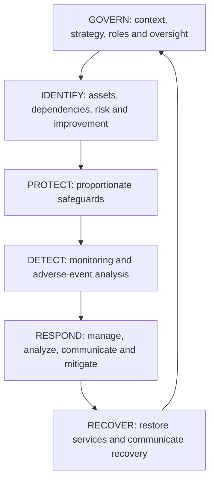
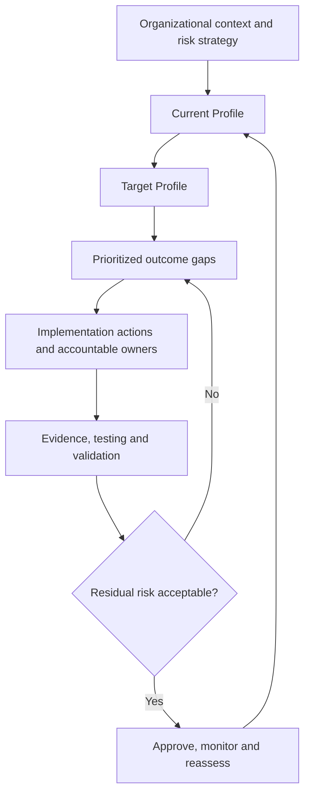
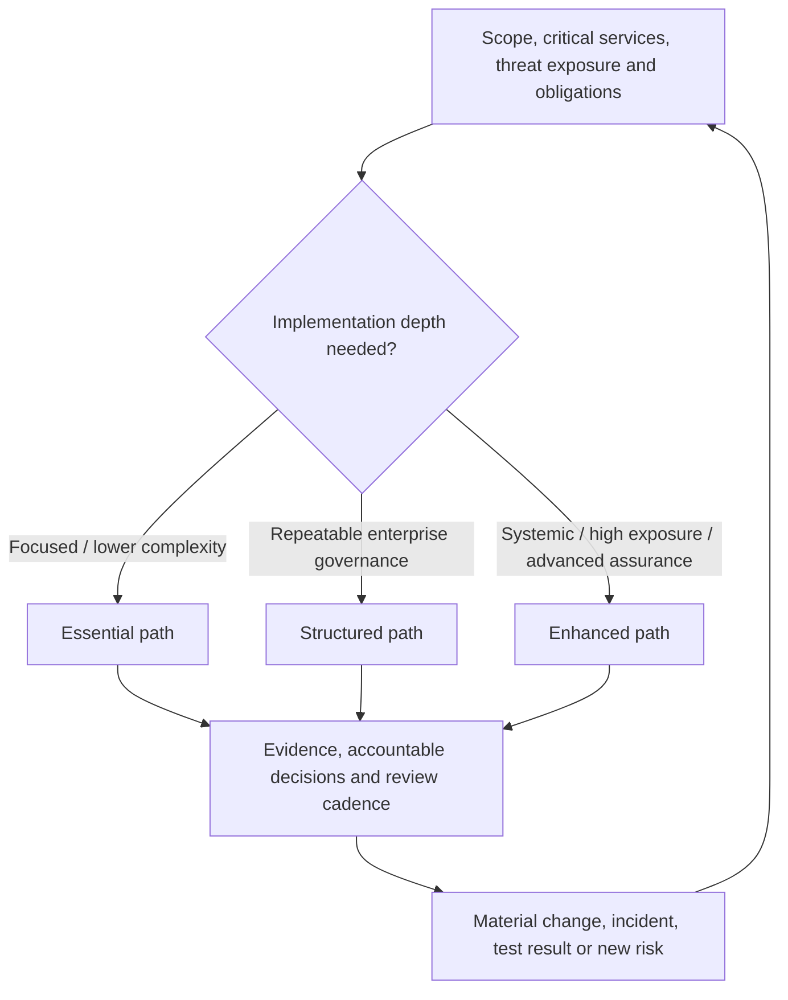

# Manual 09 — NIST CSF 2.0 Implementation Paths

## Purpose

These paths translate NIST CSF 2.0 outcomes into proportional operating patterns without treating the Framework as a prescriptive control catalog or certification scheme. Each path requires an explicit organizational context, risk strategy, Target Profile, accountable owners, evidence, exception handling, and human decisions.

## Essential path

Use where organizational complexity and cybersecurity exposure allow a focused implementation.

Minimum operating pattern:
- establish accountable cybersecurity governance and risk ownership;
- define critical mission/business services and dependencies;
- maintain a basic Current Profile and risk-informed Target Profile;
- identify important assets, data, services, suppliers, and technology dependencies;
- maintain a prioritized cybersecurity risk register;
- implement risk-based identity/access, data protection, platform protection, monitoring, incident response, and recovery practices;
- define material incident and risk escalation routes;
- retain evidence for significant decisions, tests, incidents, exceptions, and remediation;
- review progress and material changes on a defined cadence.

Completion requires evidence that the organization can explain its priority CSF outcomes, current gaps, accountable actions, accepted residual risk, and next review point.

## Structured path

Use where multiple business units, regulated obligations, material suppliers, or more complex technology environments require repeatable governance.

Adds to Essential:
- formal enterprise Current and Target Profiles;
- defined use of CSF Implementation Tiers as context for cybersecurity risk-governance characteristics, not maturity certificates;
- integration with enterprise risk management and executive reporting;
- documented cybersecurity roles, competencies, workforce demand, and training plans;
- systematic supplier and cyber supply-chain risk governance;
- defined metrics tied to outcomes and decisions rather than activity counts alone;
- formal control/evidence mappings using authoritative informative references where useful;
- independent or second-line challenge for material risk decisions;
- tested incident and recovery playbooks linked to business priorities;
- periodic Profile reassessment and improvement planning.

Completion requires traceable evidence across all six Functions and an approved improvement plan for material gaps.

## Enhanced path

Use where systemic importance, threat exposure, regulatory complexity, critical services, or organizational risk appetite warrants deeper integration and assurance.

Adds to Structured:
- quantitative or scenario-based risk analysis where decision-useful;
- continuous or high-frequency monitoring of material outcomes and control signals;
- machine-consumable crosswalks and informative-reference workflows with provenance and validation;
- advanced supplier concentration, fourth-party, resilience, and exit-risk analysis;
- threat-informed testing and adversarial exercises;
- automated evidence collection with integrity, lineage, access, and exception controls;
- executive and board-level risk reporting tied to enterprise objectives and risk appetite;
- cross-framework mapping that preserves source semantics and does not imply equivalence where none exists;
- formal assurance over selected high-risk outcomes;
- continuous improvement based on incidents, near misses, testing, audit findings, business change, and threat intelligence.

Completion requires evidence that automated or advanced practices remain governed by accountable human decisions and that exceptions or model/tool limitations are visible.

## Six-Function operating loop

1. **GOVERN** establishes context, objectives, risk strategy, policy, roles, oversight, and supply-chain expectations.
2. **IDENTIFY** determines what matters, what can go wrong, and where improvement is needed.
3. **PROTECT** implements safeguards proportionate to prioritized risk.
4. **DETECT** provides timely awareness of relevant adverse events and conditions.
5. **RESPOND** contains, analyzes, communicates, and mitigates cybersecurity incidents.
6. **RECOVER** restores capabilities and incorporates lessons into future governance and improvement.

The loop is iterative. Material changes, incidents, failed tests, supplier changes, or changed risk assumptions return affected decisions to GOVERN and IDENTIFY.

**Accessible explanation:** The six NIST CSF 2.0 Functions operate as a connected cycle rather than isolated checklists. Governance sets the context for identification and protection; detection informs response; recovery feeds lessons, changed assumptions, and improvement priorities back into governance.

## Profile and improvement route

**Accessible explanation:** CSF implementation begins with organizational context, compares Current and Target Profiles, prioritizes outcome gaps, implements accountable actions, and validates evidence. Unacceptable residual risk returns to treatment; accepted risk remains monitored and is reassessed as conditions change.

## Proportional implementation routing

**Accessible explanation:** The Essential, Structured, and Enhanced paths scale implementation depth to organizational context and exposure. All paths retain evidence, accountable decisions, and reassessment; material changes or new risk can move the organization to a different depth rather than locking it permanently into one tier.

## Evidence and decision loop

For each material CSF outcome, record:
- outcome/subcategory reference;
- organizational applicability and rationale;
- implementation method;
- accountable owner;
- evidence expected and evidence observed;
- test or validation method where applicable;
- gap/finding;
- risk consequence;
- treatment or exception;
- target date;
- residual risk;
- approver;
- next review date.

A policy statement, tool purchase, questionnaire response, or mapped control is not sufficient by itself to demonstrate an outcome.

## Stop and rollback conditions

Implementation or release stops when material scope is unknown, high-risk gaps lack accountable treatment, evidence contradicts claimed outcomes, authoritative sources are stale or unresolved, automated mappings lack provenance/validation, required human review is incomplete, or a material change invalidates earlier approval.

## Assurance statement

Manual 09 is implementation guidance. Use of the manual does not create NIST certification, guarantee cybersecurity effectiveness, establish legal or regulatory compliance, or prove that a particular control set is sufficient for every organization. Organizations remain responsible for context-specific risk decisions and competent human review.
