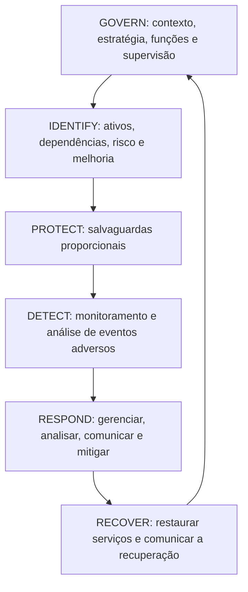
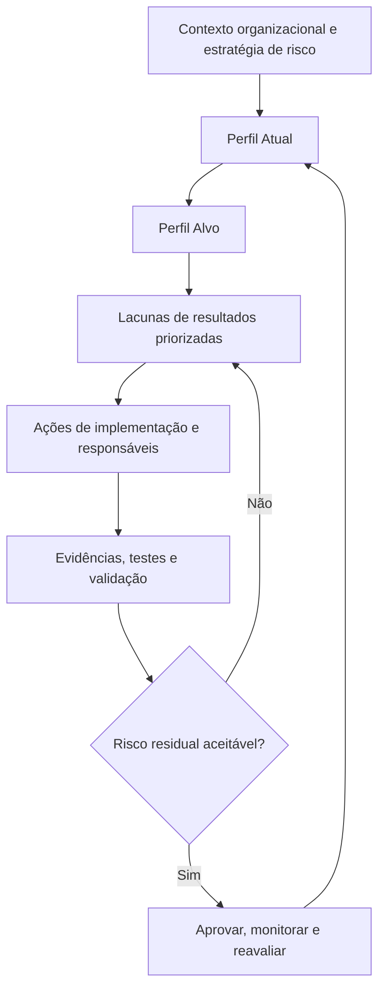
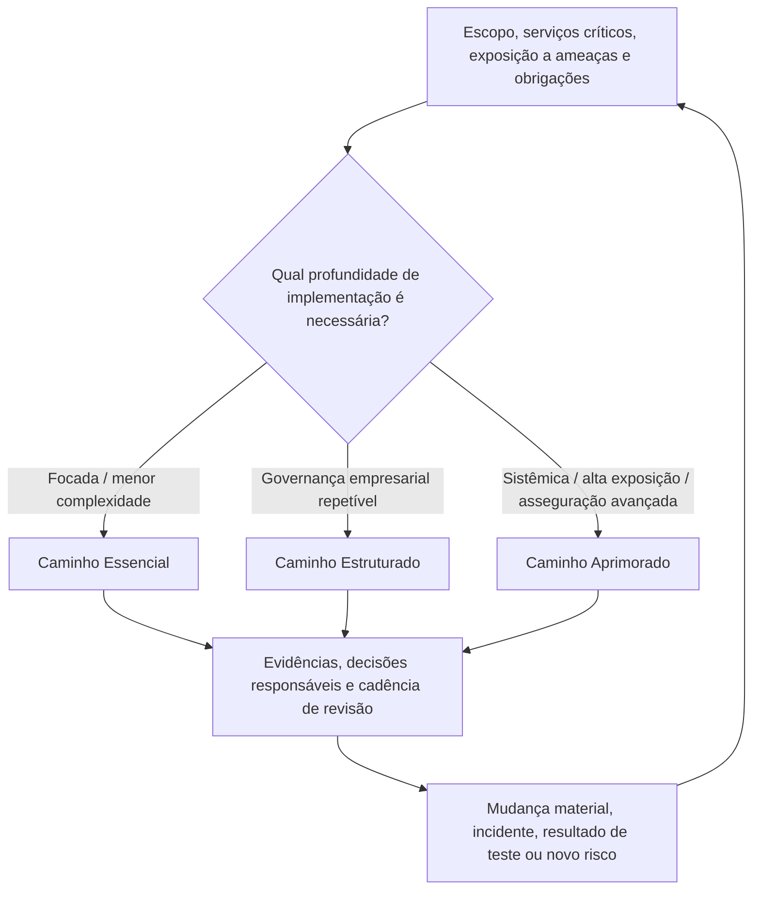

# Manual 09 — Caminhos de implementação do NIST CSF 2.0

> **Rascunho controlado assistido por máquina (`pt-BR`).** A edição em inglês continua sendo a fonte controlada. Esta localização não constitui aprovação semântica ou terminológica humana e permanece sujeita à etapa de revisão humana antes da publicação.

## Objetivo

Estes caminhos traduzem os resultados do NIST CSF 2.0 em padrões operacionais proporcionais sem tratar o Framework como um catálogo prescritivo de controles ou como um esquema de certificação. Cada caminho exige contexto organizacional explícito, estratégia de risco, Perfil Alvo, responsáveis, evidências, tratamento de exceções e decisões humanas.

## Caminho Essencial

Use quando a complexidade organizacional e a exposição de cibersegurança permitirem uma implementação focada.

Padrão operacional mínimo:
- estabelecer governança de cibersegurança e responsabilidade pelo risco;
- definir serviços críticos de missão/negócio e suas dependências;
- manter um Perfil Atual básico e um Perfil Alvo orientado por risco;
- identificar ativos, dados, serviços, fornecedores e dependências tecnológicas importantes;
- manter um registro priorizado de riscos de cibersegurança;
- implementar identidade/acesso, proteção de dados, proteção de plataformas, monitoramento, resposta a incidentes e recuperação de forma proporcional ao risco;
- definir rotas de escalonamento para incidentes e riscos materiais;
- manter evidências de decisões, testes, incidentes, exceções e remediações significativas;
- revisar o progresso e mudanças materiais em uma cadência definida.

A conclusão exige evidências de que a organização consegue explicar seus resultados CSF prioritários, lacunas atuais, ações responsáveis, risco residual aceito e próximo ponto de revisão.

## Caminho Estruturado

Use quando múltiplas unidades de negócio, obrigações reguladas, fornecedores materiais ou ambientes tecnológicos mais complexos exigirem governança repetível.

Adiciona ao Essencial:
- Perfis Atual e Alvo empresariais formais;
- uso definido dos Implementation Tiers do CSF como contexto para características de governança de risco de cibersegurança, e não como certificados de maturidade;
- integração com gestão de riscos corporativos e relatórios executivos;
- funções, competências, demanda de força de trabalho e planos de treinamento documentados;
- governança sistemática de fornecedores e risco da cadeia de suprimentos cibernética;
- métricas vinculadas a resultados e decisões, e não apenas a contagens de atividade;
- mapeamentos formais de controles/evidências usando referências informativas autorizadas quando úteis;
- desafio independente ou de segunda linha para decisões de risco material;
- playbooks testados de resposta e recuperação vinculados às prioridades de negócio;
- reavaliação periódica de Perfis e planejamento de melhorias.

A conclusão exige evidências rastreáveis nas seis Funções e um plano de melhoria aprovado para lacunas materiais.

## Caminho Aprimorado

Use quando importância sistêmica, exposição a ameaças, complexidade regulatória, serviços críticos ou apetite de risco da organização justificarem integração e asseguração mais profundas.

Adiciona ao Estruturado:
- análise quantitativa ou baseada em cenários quando útil para decisões;
- monitoramento contínuo ou de alta frequência de resultados materiais e sinais de controle;
- cruzamentos e fluxos de referências informativas consumíveis por máquina com proveniência e validação;
- análise avançada de concentração de fornecedores, quartas partes, resiliência e risco de saída;
- testes orientados por ameaças e exercícios adversariais;
- coleta automatizada de evidências com controles de integridade, linhagem, acesso e exceções;
- relatórios de risco para executivos e conselho vinculados a objetivos corporativos e apetite de risco;
- mapeamento entre frameworks que preserve a semântica da fonte e não implique equivalência quando ela não existir;
- asseguração formal sobre resultados selecionados de alto risco;
- melhoria contínua baseada em incidentes, quase incidentes, testes, achados de auditoria, mudanças de negócio e inteligência de ameaças.

A conclusão exige evidências de que práticas automatizadas ou avançadas permanecem governadas por decisões humanas responsáveis e de que exceções ou limitações de ferramentas/modelos estão visíveis.

## Ciclo operacional das seis Funções

1. **GOVERN** estabelece contexto, objetivos, estratégia de risco, políticas, funções, supervisão e expectativas da cadeia de suprimentos.
2. **IDENTIFY** determina o que importa, o que pode dar errado e onde é necessário melhorar.
3. **PROTECT** implementa salvaguardas proporcionais ao risco priorizado.
4. **DETECT** fornece percepção oportuna de eventos e condições adversas relevantes.
5. **RESPOND** contém, analisa, comunica e mitiga incidentes de cibersegurança.
6. **RECOVER** restaura capacidades e incorpora lições à governança e melhoria futuras.

O ciclo é iterativo. Mudanças materiais, incidentes, testes com falha, mudanças de fornecedores ou pressupostos de risco alterados devolvem as decisões afetadas a GOVERN e IDENTIFY.

**Explicação acessível:** As seis Funções do NIST CSF 2.0 operam como um ciclo conectado, e não como listas de verificação isoladas. A governança estabelece o contexto para identificar e proteger; a detecção informa a resposta; e a recuperação devolve lições, pressupostos alterados e prioridades de melhoria à governança.

## Caminho de Perfis e melhoria

**Explicação acessível:** A implementação do CSF começa pelo contexto organizacional, compara os Perfis Atual e Alvo, prioriza lacunas de resultados, implementa ações com responsáveis e valida evidências. Risco residual inaceitável retorna ao tratamento; risco aceito permanece monitorado e é reavaliado quando as condições mudam.

## Roteamento de implementação proporcional

**Explicação acessível:** Os caminhos Essencial, Estruturado e Aprimorado dimensionam a profundidade da implementação ao contexto e à exposição da organização. Todos preservam evidências, decisões responsáveis e reavaliação; mudanças materiais ou novos riscos podem exigir profundidade diferente em vez de fixar permanentemente a organização em um nível.

## Ciclo de evidência e decisão

Para cada resultado CSF material, registre:
- referência de resultado/subcategoria;
- aplicabilidade organizacional e justificativa;
- método de implementação;
- responsável;
- evidência esperada e observada;
- método de teste ou validação quando aplicável;
- lacuna/achado;
- consequência de risco;
- tratamento ou exceção;
- data-alvo;
- risco residual;
- aprovador;
- próxima data de revisão.

Uma declaração de política, compra de ferramenta, resposta de questionário ou controle mapeado não é suficiente, isoladamente, para demonstrar um resultado.

## Condições de parada e reversão

A implementação ou publicação para quando o escopo material é desconhecido, lacunas de alto risco não têm tratamento responsável, evidências contradizem resultados declarados, fontes autorizadas estão desatualizadas ou não resolvidas, mapeamentos automatizados não têm proveniência/validação, a revisão humana exigida está incompleta ou uma mudança material invalida uma aprovação anterior.

## Declaração de asseguração

O Manual 09 é orientação de implementação. O uso do manual não cria certificação NIST, não garante efetividade de cibersegurança, não estabelece conformidade legal ou regulatória e não prova que um conjunto específico de controles seja suficiente para toda organização. As organizações continuam responsáveis por decisões de risco específicas ao seu contexto e por revisão humana competente.
