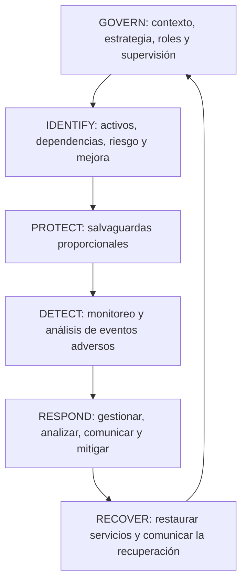
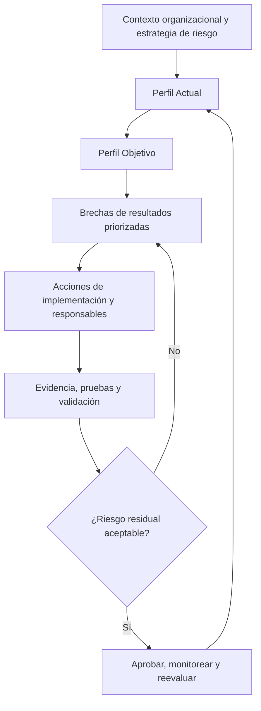
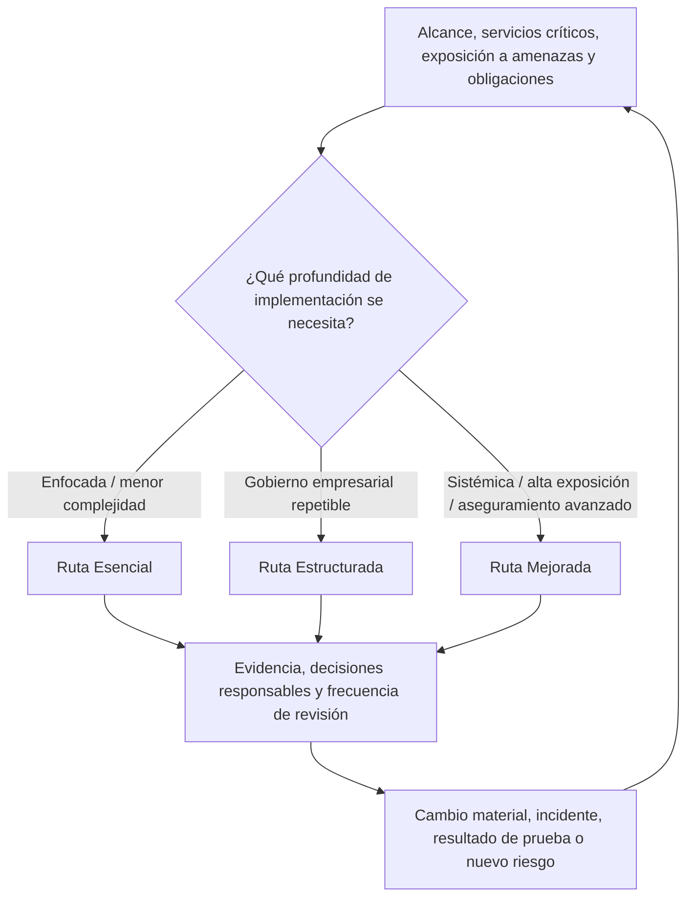

# Manual 09 — Rutas de implementación de NIST CSF 2.0

> **Borrador controlado asistido por máquina (`es-419`).** La edición en inglés sigue siendo la fuente controlada. Esta localización no constituye aprobación semántica ni terminológica humana y permanece sujeta a la compuerta de revisión humana antes de publicación.

## Propósito

Estas rutas traducen los resultados de NIST CSF 2.0 en patrones operativos proporcionales sin tratar el Marco como un catálogo prescriptivo de controles ni como un esquema de certificación. Cada ruta requiere contexto organizacional explícito, estrategia de riesgo, Perfil Objetivo, responsables, evidencia, gestión de excepciones y decisiones humanas.

## Ruta Esencial

Úsela cuando la complejidad organizacional y la exposición de ciberseguridad permitan una implementación enfocada.

Patrón operativo mínimo:
- establecer gobierno de ciberseguridad y responsabilidad sobre el riesgo;
- definir servicios críticos de misión/negocio y sus dependencias;
- mantener un Perfil Actual básico y un Perfil Objetivo informado por riesgo;
- identificar activos, datos, servicios, proveedores y dependencias tecnológicas importantes;
- mantener un registro priorizado de riesgos de ciberseguridad;
- implementar identidad/acceso, protección de datos, protección de plataformas, monitoreo, respuesta a incidentes y recuperación de acuerdo con el riesgo;
- definir rutas de escalamiento para incidentes y riesgos materiales;
- conservar evidencia de decisiones, pruebas, incidentes, excepciones y remediación significativas;
- revisar el progreso y los cambios materiales con una frecuencia definida.

La finalización requiere evidencia de que la organización puede explicar sus resultados CSF prioritarios, brechas actuales, acciones responsables, riesgo residual aceptado y siguiente punto de revisión.

## Ruta Estructurada

Úsela cuando varias unidades de negocio, obligaciones reguladas, proveedores materiales o entornos tecnológicos más complejos requieran gobierno repetible.

Añade a Esencial:
- Perfiles Actual y Objetivo empresariales formales;
- uso definido de los Niveles de Implementación (Implementation Tiers) de CSF como contexto para características de gobierno del riesgo de ciberseguridad, no como certificados de madurez;
- integración con gestión de riesgo empresarial e informes ejecutivos;
- roles, competencias, demanda de personal y planes de capacitación documentados;
- gobierno sistemático de proveedores y riesgo de cadena de suministro cibernética;
- métricas vinculadas a resultados y decisiones, no solo a conteos de actividad;
- mapeos formales de controles/evidencia mediante referencias informativas autorizadas cuando sean útiles;
- desafío independiente o de segunda línea para decisiones de riesgo material;
- manuales de respuesta y recuperación probados y vinculados con prioridades de negocio;
- reevaluación periódica de Perfiles y planificación de mejoras.

La finalización requiere evidencia trazable en las seis Funciones y un plan de mejora aprobado para las brechas materiales.

## Ruta Mejorada

Úsela cuando la importancia sistémica, exposición a amenazas, complejidad regulatoria, servicios críticos o apetito de riesgo de la organización justifiquen una integración y aseguramiento más profundos.

Añade a Estructurada:
- análisis cuantitativo o basado en escenarios cuando aporte valor a la decisión;
- monitoreo continuo o de alta frecuencia de resultados materiales y señales de control;
- cruces y flujos de referencias informativas consumibles por máquina con procedencia y validación;
- análisis avanzado de concentración de proveedores, cuartas partes, resiliencia y riesgo de salida;
- pruebas informadas por amenazas y ejercicios adversariales;
- recopilación automatizada de evidencia con controles de integridad, linaje, acceso y excepciones;
- informes de riesgo para ejecutivos y junta vinculados con objetivos empresariales y apetito de riesgo;
- mapeo entre marcos que preserve la semántica de la fuente y no implique equivalencia donde no exista;
- aseguramiento formal de resultados seleccionados de alto riesgo;
- mejora continua basada en incidentes, casi incidentes, pruebas, hallazgos de auditoría, cambios de negocio e inteligencia de amenazas.

La finalización requiere evidencia de que las prácticas automatizadas o avanzadas permanecen gobernadas por decisiones humanas responsables y que las excepciones o limitaciones de herramientas/modelos son visibles.

## Ciclo operativo de seis Funciones

1. **GOVERN** establece contexto, objetivos, estrategia de riesgo, políticas, roles, supervisión y expectativas de cadena de suministro.
2. **IDENTIFY** determina qué importa, qué puede salir mal y dónde se necesita mejorar.
3. **PROTECT** implementa salvaguardas proporcionales al riesgo priorizado.
4. **DETECT** proporciona conocimiento oportuno de eventos y condiciones adversas relevantes.
5. **RESPOND** contiene, analiza, comunica y mitiga incidentes de ciberseguridad.
6. **RECOVER** restaura capacidades e incorpora lecciones en el gobierno y la mejora futura.

El ciclo es iterativo. Cambios materiales, incidentes, pruebas fallidas, cambios de proveedores o supuestos de riesgo modificados devuelven las decisiones afectadas a GOVERN e IDENTIFY.

**Explicación accesible:** Las seis Funciones de NIST CSF 2.0 operan como un ciclo conectado y no como listas de verificación aisladas. El gobierno establece el contexto para identificar y proteger; la detección informa la respuesta; y la recuperación devuelve las lecciones, los supuestos modificados y las prioridades de mejora al gobierno.

## Ruta de Perfiles y mejora

**Explicación accesible:** La implementación de CSF comienza con el contexto organizacional, compara los Perfiles Actual y Objetivo, prioriza brechas de resultados, implementa acciones con responsables y valida evidencia. El riesgo residual inaceptable vuelve al tratamiento; el riesgo aceptado permanece monitoreado y se reevalúa cuando cambian las condiciones.

## Enrutamiento de implementación proporcional

**Explicación accesible:** Las rutas Esencial, Estructurada y Mejorada escalan la profundidad de implementación según el contexto y la exposición organizacional. Todas conservan evidencia, decisiones responsables y reevaluación; cambios materiales o nuevos riesgos pueden requerir una profundidad distinta en lugar de fijar permanentemente a la organización en un nivel.

## Ciclo de evidencia y decisión

Para cada resultado CSF material, registre:
- referencia de resultado/subcategoría;
- aplicabilidad organizacional y justificación;
- método de implementación;
- responsable;
- evidencia esperada y observada;
- método de prueba o validación cuando corresponda;
- brecha/hallazgo;
- consecuencia de riesgo;
- tratamiento o excepción;
- fecha objetivo;
- riesgo residual;
- aprobador;
- próxima fecha de revisión.

Una declaración de política, compra de herramienta, respuesta a cuestionario o control mapeado no es suficiente por sí sola para demostrar un resultado.

## Condiciones de detención y reversión

La implementación o publicación se detiene cuando el alcance material es desconocido, las brechas de alto riesgo no tienen tratamiento responsable, la evidencia contradice los resultados declarados, las fuentes autorizadas están obsoletas o sin resolver, los mapeos automatizados carecen de procedencia/validación, la revisión humana requerida está incompleta o un cambio material invalida una aprobación anterior.

## Declaración de aseguramiento

Manual 09 es guía de implementación. El uso del manual no crea certificación NIST, no garantiza efectividad de ciberseguridad, no establece cumplimiento legal o regulatorio y no demuestra que un conjunto particular de controles sea suficiente para toda organización. Las organizaciones siguen siendo responsables de decisiones de riesgo específicas de su contexto y de revisión humana competente.
