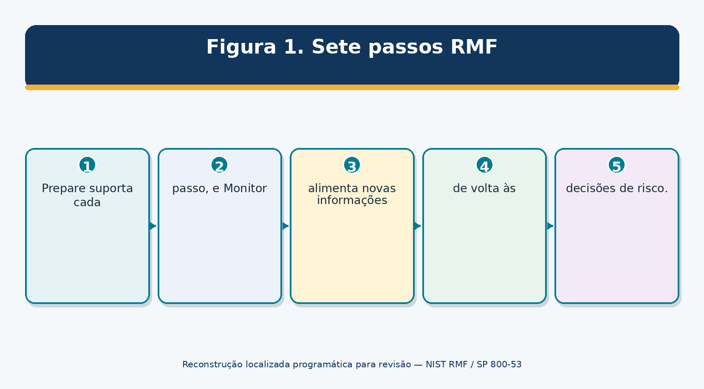
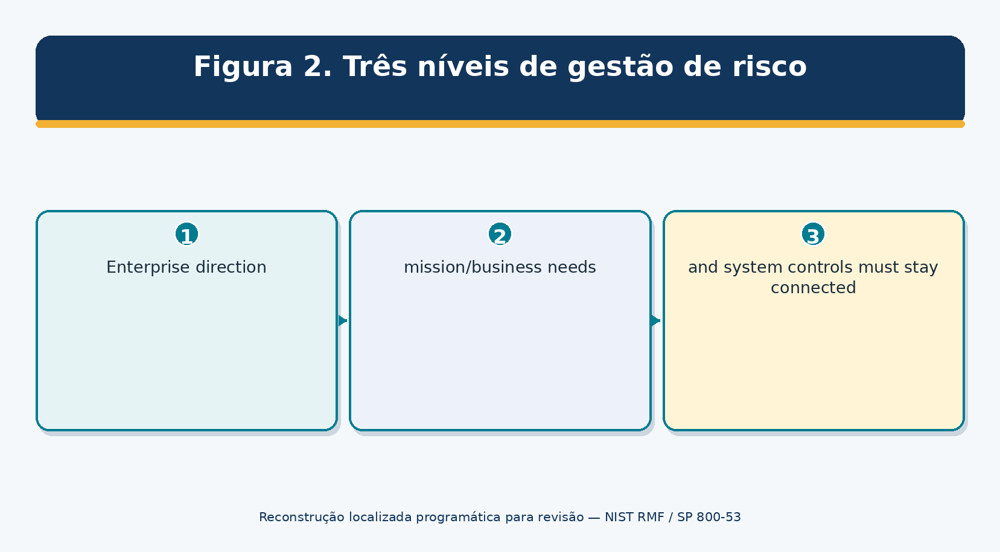
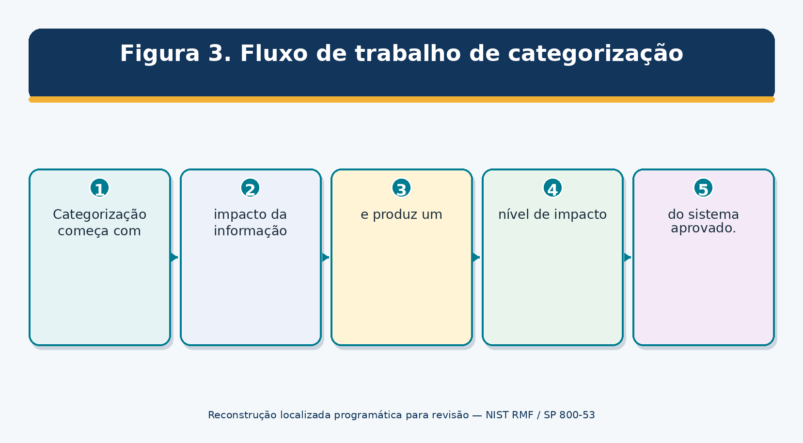
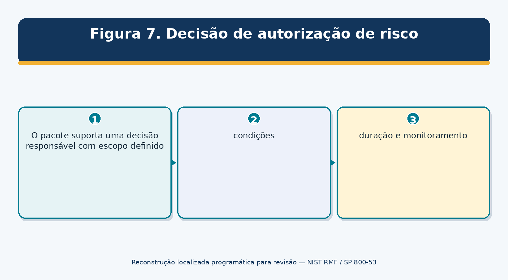
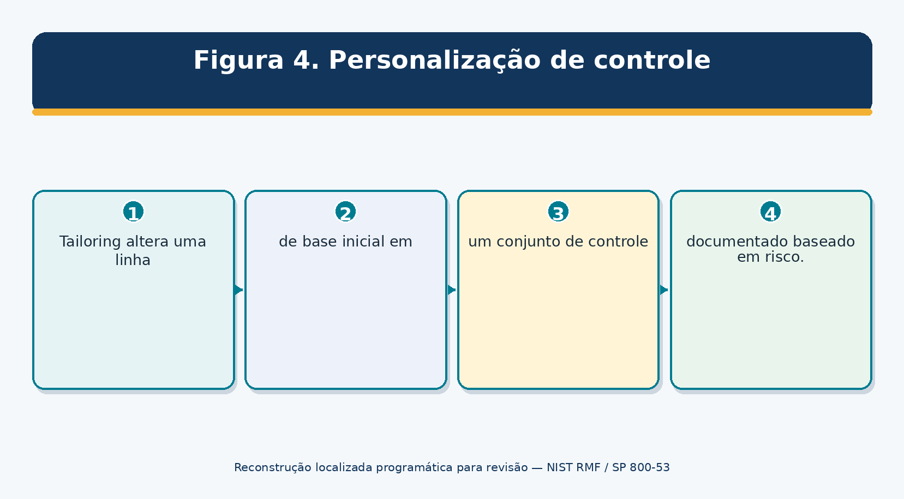
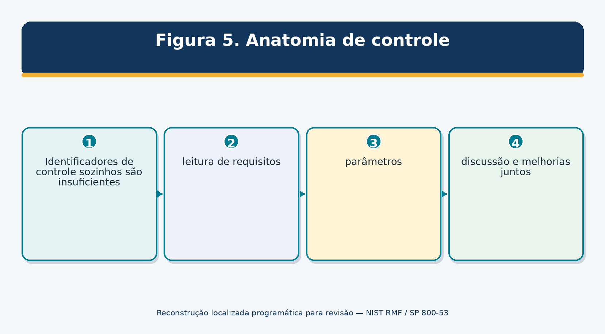
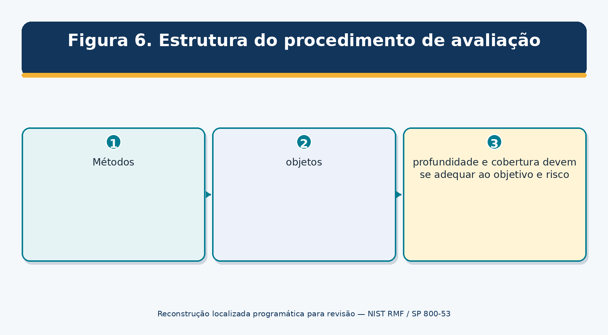
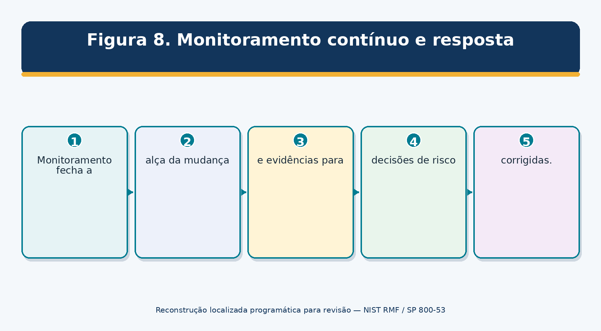
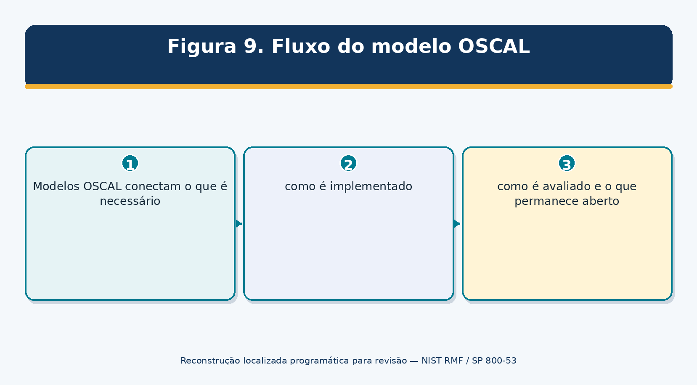
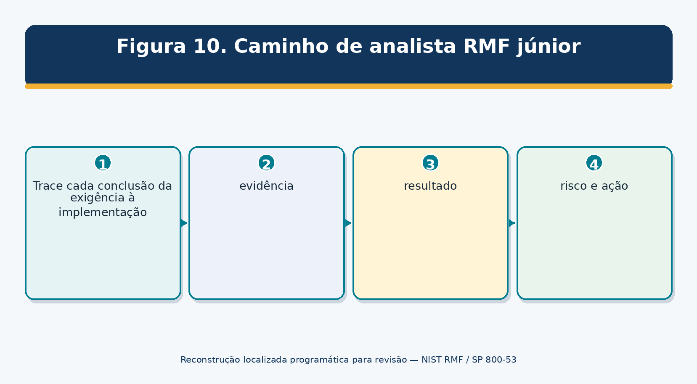

> **Status da revisão:** Rascunho de tradução assistida por máquina. Requer revisão humana de terminologia, significado, links, formatação e atualidade técnica antes de ser marcado como edição final.

**NIST QUADRO DE GESTÃO DE RISCOS

**AND SP 800-53 LIBERTAÇÃO 5.2.0

Prático Gerente e Manual de Analista Júnior

O que este manual faz: Explica as sete etapas do RMF, todas as 20 famílias de controle SP 800-53, linhas de base, adaptação, implementação, avaliação, autorização, monitoramento, OSCAL, ferramentas de código aberto, decisões de gestão e trabalho de analista pronto para o trabalho. □
□-----------------------------------------------------------------------------------------------------------------------------------------------------------------------------------------------------------------------------------------------------------------------------------------------------------------------------------

** Alberto (Al) Leiva**

Primeira edição • Julho de 2026

Prefácio

O Risk Management Framework é uma forma disciplinada de conectar necessidades de missão, design de sistema, segurança, privacidade, evidências e decisões de risco responsáveis ao longo de um ciclo de vida do sistema. SP 800-53 é o catálogo de controle utilizado dentro desse processo; não é uma lista de verificação que cria automaticamente segurança ou uma autorização.

Este manual usa linguagem simples, documentos de trabalho realistas e laboratórios seguros. Os termos federais são explicados, mas as organizações não federais podem adaptar os conceitos. Requisitos e autoridade variam de acordo com a lei, agência, contrato, setor, sistema e risco. Use fontes oficiais atuais e segurança qualificada, privacidade, engenharia, legal, aquisição, auditoria e autorizar profissionais para decisões reais.

Nota de informação actual:** Verificada em 14 de Julho de 2026: SP 800-37 Rev. 2 continua a ser a RMF final atual; SP 800-53 e SP 800-53A estão na Release 5.2.0 (2025 de Agosto); SP 800-53B linhas de base foram relançadas sem alterações basais; SP 800-18 Rev. 2 foi finalizada em 30 de Junho de 2026.
----------------------------------------------------------------------------------------------------------------------------------------------------------------------------------------------------------------------------------------------------

# # Como usar este manual

- Gerentes: comece com Capítulos 1–4, 7–13, 17–18 e 27.

- Analistas júnior: estudar em ordem, praticar Capítulos 26 e 28–29, e usar os modelos.

- Donos de sistemas e engenheiros: foco em fronteiras, seleção, implementação, evidências, monitoramento e capítulos familiares.

- Assessores: foco nos Capítulos 10, 15-18, 25 e 30.

- Adapte cada artefato à autoridade da organização, tolerância ao risco, sistema e obrigações.

Sumário

Este documento contém um índice nativo do Word e um guia de capítulo permanente.

[Prefácio [2](#preface)](#preface)

[Como usar este manual [2](#how-to-use-this-manual)](#how-to-use-this-manual)

[Quadro de conteúdos [3](#table-of-contents)](#table-of-contents)

[Guia do Capítulo [7](#chapter-guide)](#chapter-guide)

[1. RMF e SP 800-53 Fundações [8](#rmf-and-sp-800-53-foundations)](#rmf-and-sp-800-53-foundations)

[2. Suíte de Publicação NIST [9](#current-nist-publication-suite)](#current-nist-publication-suite)

[3. Governação, Funções e Decisões de Risco [10](#governance-roles-and-risk-decisions)](#governance-roles-and-risk-decisions)

[4. Ciclo de vida do sistema, âmbito e limite de autorização [11](#system-life-cycle-scope-and-authorization-boundary)](#system-life-cycle-scope-and-authorization-boundary)

[4.1 Questões limite [11](#boundary-questions)](#boundary-questions)

[5. Preparar ao nível da organização [12](#prepare-at-the-organization-level)](#prepare-at-the-organization-level)

[5.1 Preparação da organização [12](#organization-preparation)](#organization-preparation)

[6. Preparar ao nível do sistema [13](#prepare-at-the-system-level)](#prepare-at-the-system-level)

[6.1 Preparação do sistema [13](#system-preparation)](#system-preparation)

[7. Categorizar o Sistema [14](#categorize-the-system)](#categorize-the-system)

[7.1 Método [14](#method)](#method)

[8. Selecione controles [15](#select-controls)](#select-controls)

[8,1 Sequência de seleção [15](#selection-sequence)](#selection-sequence)

[9. Controlos de Implementação [16](#implement-controls)](#implement-controls)

[9.1 Fluxo de trabalho de implementação [16](#implementation-workflow)](#implementation-workflow)

[10. Controlos de avaliação [17](#assess-controls)](#assess-controls)

[10.1 Sequência de avaliação [17](#assessment-sequence)](#assessment-sequence)

[11. Autorizar o sistema ou os controlos comuns [18](#authorize-the-system-or-common-controls)](#authorize-the-system-or-common-controls)

[11.1 Pacote de autorização [18](#authorization-package)](#authorization-package)

[12. Monitorar continuamente [19](#monitor-continuously)](#monitor-continuously)

[12.1 Actividades de monitorização [19](#monitoring-activities)](#monitoring-activities)

[13. Bases de controlo e Alfaiataria [20](#control-baselines-and-tailoring)](#control-baselines-and-tailoring)

[13.1 Registo de adaptação [20](#tailoring-record)](#tailoring-record)

[14. Controlos comuns, híbridos e específicos do sistema [21](#common-hybrid-and-system-specific-controls)](#common-hybrid-and-system-specific-controls)

[14.1 Controlos de herdade [21](#inheritance-checks)](#inheritance-checks)

[15. Escrita de fortes declarações de implementação [22](#writing-strong-implementation-statements)](#writing-strong-implementation-statements)

[15.1 Lista de verificação da declaração [22](#statement-checklist)](#statement-checklist)

[16. Planeamento de avaliação e provas [23](#assessment-planning-and-evidence)](#assessment-planning-and-evidence)

[16.1 População e amostragem [23](#population-and-sampling)](#population-and-sampling)

[17. Pacote de autorização e POA&M [24](#authorization-package-and-poam)](#authorization-package-and-poam)

[17.1 Qualidade POA&M [24](#poam-quality)](#poam-quality)

[18. Estratégia de monitorização contínua [25](#continuous-monitoring-strategy)](#continuous-monitoring-strategy)

[19. OSCAL e Automação [26](#oscal-and-automation)](#oscal-and-automation)

[19.1 Garantias de automatização [26](#automation-safeguards)](#automation-safeguards)

[20. Famílias de controlo: acesso, sensibilização, auditoria e avaliação [27](#control-families-access-awareness-audit-and-assessment)](#control-families-access-awareness-audit-and-assessment)

[AC — Controlo de Acesso [27](#ac-access-control)](#ac-access-control)

[AT — Consciência e formação [27](#at-awareness-and-training)](#at-awareness-and-training)

[AU — Auditoria e responsabilidade [27](#au-audit-and-accountability)](#au-audit-and-accountability)

[CA — Avaliação, autorização e monitorização [27](#ca-assessment-authorization-and-monitoring)](#ca-assessment-authorization-and-monitoring)

[21. Famílias de controlo: Configuração, Contingência, Identidade, Incidente e Manutenção [28](#control-families-configuration-contingency-identity-incident-and-maintenance)](#control-families-configuration-contingency-identity-incident-and-maintenance)

[CM — Gestão de Configuração [28](#cm-configuration-management)](#cm-configuration-management)

[CP — Planeamento de contingência [28](#cp-contingency-planning)](#cp-contingency-planning)

[IA — Identificação e autenticação [28](#ia-identification-and-authentication)](#ia-identification-and-authentication)

[IR — Resposta ao incidente [28](#ir-incident-response)](#ir-incident-response)

[MA — Manutenção [28](#ma-maintenance)](#ma-maintenance)

[22. Famílias de controle: Mídia, Física, Planejamento, Programa e Pessoal [30](#control-families-media-physical-planning-program-and-personnel)](#control-families-media-physical-planning-program-and-personnel)

[MP — Proteção de mídia [30](#mp-media-protection)](#mp-media-protection)

[PE — Protecção física e ambiental [30](#pe-physical-and-environmental-protection)](#pe-physical-and-environmental-protection)

[PL — Planeamento [30](#pl-planning)](#pl-planning)

[PM — Gestão de Programas [30](#pm-program-management)](#pm-program-management)

[PS — Segurança do pessoal [30](#ps-personnel-security)](#ps-personnel-security)

[23. Famílias de controlo: privacidade, risco, aquisição, comunicações, integridade e cadeia de abastecimento [32](#control-families-privacy-risk-acquisition-communications-integrity-and-supply-chain)](#control-families-privacy-risk-acquisition-communications-integrity-and-supply-chain)

[PT — Processamento e Transparência PII [32](#pt-pii-processing-and-transparency)](#pt-pii-processing-and-transparency)

[RA — Avaliação dos riscos [32](#ra-risk-assessment)](#ra-risk-assessment)

[SA — Aquisição de sistemas e serviços [32](#sa-system-and-services-acquisition)](#sa-system-and-services-acquisition)

[SC — Protecção do sistema e das comunicações [32](#sc-system-and-communications-protection)](#sc-system-and-communications-protection)

[SI — Integridade do sistema e da informação [32](#si-system-and-information-integrity)](#si-system-and-information-integrity)

[SR — Gestão do risco da cadeia de abastecimento [33](#sr-supply-chain-risk-management)](#sr-supply-chain-risk-management)

[24. Privacy Risk and Security–Privacy Collaboration [34](#privacy-risk-and-securityprivacy-collaboration)](#privacy-risk-and-securityprivacy-collaboration)

[24.1 Colaboração [34](#collaboration)](#collaboration)

[25. Atualizações de software, confiabilidade de patch e versão 5.2.0 [35](#software-updates-patch-reliability-and-release-5.2.0)](#software-updates-patch-reliability-and-release-5.2.0)

[25.1 Concentração em evidência [35](#evidence-focus)](#evidence-focus)

[26. Ferramentas de código aberto e recursos oficiais [36](#open-source-tools-and-official-resources)](#open-source-tools-and-official-resources)

[26.1 NIST CPRT [36](#nist-cprt)](#nist-cprt)

[26,2 NIST Conteúdo OSCAL [36](#nist-oscal-content)](#nist-oscal-content)

[26.3 Trestle de conformidade [37](#compliance-trestle)](#compliance-trestle)

[26.4 Lula [37](#lula)](#lula)

[26.5 Assistente CISO [37](#ciso-assistant)](#ciso-assistant)

[26.6 Heimdall [37](#heimdall)](#heimdall)

[26.7 OpenControl [37](#opencontrol)](#opencontrol)

[26.8 CLI OSCAL [38](#oscal-cli)](#oscal-cli)

[26.9 Wazuh [38](#wazuh)](#wazuh)

[26.10 OpenSCAP [38](#openscap)](#openscap)

[26,11 osquery [38](#osquery)](#osquery)

[26,12 Nmap [38](#nmap)](#nmap)

[26.13 Greenbone Community Edition [39](#greenbone-community-edition)](#greenbone-community-edition)

[26.14 Trivy [39](#trivy)](#trivy)

[26,15 OWASP ZAP [39](#owasp-zap)](#owasp-zap)

[26.16 Keycloak [39](#keycloak)](#keycloak)

[26.17 DefectDojo [40](#defectdojo)](#defectdojo)

[26.18 Agente de política aberta [40](#open-policy-agent)](#open-policy-agent)

[27. Playbook RMF do gestor [41](#managers-rmf-playbook)](#managers-rmf-playbook)

[27.1 Ritmo do gestor [41](#manager-rhythm)](#manager-rhythm)

[28. Guia de carreira do analista júnior [42](#junior-analyst-career-guide)](#junior-analyst-career-guide)

[28.1 Funções comuns [42](#common-roles)](#common-roles)

[28.2 Trabalho típico [42](#typical-work)](#typical-work)

[29. Laboratório Fictício, Plano de Trinta Dias e Preparação de Entrevistas [44](#fictional-laboratory-thirty-day-plan-and-interview-preparation)](#fictional-laboratory-thirty-day-plan-and-interview-preparation)

[29.1 Laboratório de carteira [44](#portfolio-lab)](#portfolio-lab)

[29.2 Plano de trinta dias [44](#thirty-day-plan)](#thirty-day-plan)

[29.3 O que é RMF? [44](#what-is-rmf)](#what-is-rmf)

[29.4 O SP 800-53 é uma lista de verificação? [45](#is-sp-800-53-a-checklist)](#is-sp-800-53-a-checklist)

[29, 5 O que é uma linha de base? [45](#what-is-a-baseline)](#what-is-a-baseline)

[29.6 O que é a alfaiataria? [45] (#what-is-tailoring)] (#what-is-tailoring)

[29.7 O que é a herança de controlo? [45](#what-is-control-inheritance)](#what-is-control-inheritance)

[29,8 Como você avalia um controle? [45](#how-do-you-assess-a-control)](#how-do-you-assess-a-control)

[29.9 O que é autorização? [45] (#what-is-authorization)] (#what-is-authorization)

[29.10 O que é um POA&M? [45](#what-is-a-poam)](#what-is-a-poam)

[29.11 O que é OSCAL? [45] (#what-is-oscal)] (#what-is-oscal)

[29.12 O que é o SP atual 800-53? [45](#what-is-current-sp-800-53)](#what-is-current-sp-800-53)

[30. Modelos, Glossário, Índice e Referências [46](#templates-glossary-index-and-references)](#templates-glossary-index-and-references)

[30.1 Registo do sistema e dos limites [46](#system-and-boundary-record)](#system-and-boundary-record)

[30.2 Documento de execução do controlo [46](#control-implementation-workpaper)](#control-implementation-workpaper)

[30,3 Registo de avaliação e de verificação [46](#assessment-and-finding-record)](#assessment-and-finding-record)

[30.4 Registo de autorização e monitorização [46](#authorization-and-monitoring-record)](#authorization-and-monitoring-record)

[30,5 Glossário [47](#glossary)](#glossary)

[30,6 Índice de assunto [47](#subject-index)](#subject-index)

[30.7 Referências oficiais [47](#official-references)](#official-references)

Guia do Capítulo

Capítulo** Título** Início na página**
--------------------------------------------------------------------------------------------------------------------------------
Fundação RMF e SP 800-53
Suíte de Publicação NIST atual
3 Governança, Funções e Decisões de Risco
4 Ciclo de vida do sistema, escopo, e limite de autorização
Preparar ao nível da organização
Preparar ao nível do sistema
7 Categorizar o Sistema 11
8 Select Controls 12
Controlos de Implementação
* 10 * Avaliar controles * 14 *
Autorizar o sistema ou os controles comuns
Monitorar continuamente
• 13 • Bases de Controle e Alfaiataria
Controles comuns, híbridos e específicos do sistema
. . . . . . . . . .
O planeamento e a evidência da avaliação
Pacote de Autorização e POA&M .
Estratégia de Monitorização Contínua
OSCAL e Automação
20 Famílias de Controle: Acesso, Consciência, Auditoria e Avaliação
Famílias de Controle: Configuração, Contingência, Identidade, Incidente e Manutenção
22 Famílias de Controle: Mídia, Física, Planejamento, Programa e Pessoal
Famílias de controle: Privacy, Risk, Acquisition, Communications, Integrity, and Supply Chain 31
Privacidade Risco e Segurança – Colaboração Privacidade
Mais de 25 Atualizações de Software, Confiabilidade de Patch e Lançamento 5.2.0
26 Ferramentas de Código Aberto e Recursos Oficiais
RMF Playbook do gerente
Guia de carreira do analista júnior
29 Laboratório Fictício, Plano de Trinta Dias e Preparação de Entrevistas . 43 .
Modelos, Glossário, Índice e Referências

# 1. Fundação RMF e SP 800-53

*RMF gerencia risco de segurança e privacidade através de decisões de ciclo de vida responsável.

Figura 1. Sete passos RMF

Não é o mesmo que**
----------------------------------------------------------------------------------------------------------------------------------------
RMF Processo para organização e gestão de riscos do sistema .
* SP 800-53 * Catálogo flexível de controlo de segurança e privacidade * Uma lista de verificação universal ou linha de base *
* SP 800-53B * Federal baixa, moderada, alta e bases de dados de privacidade, além de orientação de alfaiataria * Um conjunto de controle final personalizado *
• SP 800-53A • Metodologia e procedimentos de avaliação
• Autorização • Decisão de risco do funcionário principal baseada num pacote de provas
• Monitoramento contínuo • Conscientização contínua dos controles, mudanças e riscos

*Idéia Core:** Os controles reduzem o risco somente quando são corretamente selecionados, implementados, operados, avaliados, corrigidos e monitorados no contexto real do sistema. □
□-----------------------------------------------------------------------------------------------------------------------------------------------------------------------------------------------------------------------------------

# 2. Current NIST Publication Suite

*Use a fonte oficial atual e entenda como cada publicação suporta o todo.*

**Publicação/recurso** **Uso actual**
-------------------------------------------------------------------------------------------------------------------------------------------
* SP 800-37 Rev. 2 * Seven-step RMF tarefas, papéis, organização / sistema de preparação e gerenciamento de risco de ciclo de vida
□ SP 800-53 Release 5.2.0 □ Catálogo de controle de segurança e privacidade atual, incluindo atualização de software e alterações de patches 2025
□ SP 800-53A Release 5.2.0 □ Procedimentos de avaliação actuais correspondentes à Release 5.2.0
□ SP 800-53B Release 5.2.0 □ Federal baixa/moderada/alta e valores basais de privacidade; 2025 a reemissão não fez alterações na linha de base
• SP 800-18 Rev. 2 • Segurança do sistema, privacidade e elementos de plano C-SCRM; ênfase legível por máquina
Guia de avaliação de risco
* SP 800-39 * Gestão do risco a nível da organização em três níveis *
Navegador e downloads para controles, linhas de base, procedimentos e referências atuais
Modelos legíveis por máquina para catálogos, perfis, componentes, SSPs, avaliações e POA&Ms

Controle de versão:** Grave a publicação da fonte, lançamento, formato, data de recuperação, perfil/versão base e alfaiataria local. Nunca misture texto, procedimentos e linhas de base de diferentes versões sem análise. □
O que é que se passa?

# 3. Governança, Funções e Decisões de Risco

*RMF papéis implementação separada, avaliação, propriedade e aceitação de risco.*

Figura 2. Três níveis de gestão de risco

** ** ** ** Responsabilidade primordial**
□-----------------------------------------------------------------------------------------------------------------------------------------------------------------------------------
Chefe da agência/organização
• Executivo de risco (função)
□ Autorizando oficial □ Aceita sistema/risco de controle comum ou impõe condições/autorização de negação
□ Autorização oficial designado representante □ Coordena as atividades como delegadas; não herda autoridade de risco não remunerada
O proprietário do sistema □ Missão, recursos, planos, controles, pacote e operação do sistema
□ Titular da informação / administrador □ Requisitos de informação, impacto, uso, compartilhamento e proteção
□ Segurança / agentes de privacidade
□ Control provider □ Implementos e documentos comuns, híbridos ou controles específicos do sistema
□ Avaliador de controle Planeia e realiza avaliação objetiva; relata resultados e limites
O administrador/engenheiro do sistema □ Constrói, configura, opera, monitora e corrige as capacidades do sistema
Arquiteto empresarial / proprietário da missão

# 4. Ciclo de vida do sistema, escopo, e limite de autorização

*Um limite claro é a base para categorização, controles, avaliação e autorização.*

## 4.1 Perguntas de limite

- Que missão ou função de negócios o sistema suporta?

- Quais pessoas, processos, aplicações, serviços, dispositivos, redes, dados, interfaces, locais, recursos de nuvem, tecnologia operacional e fornecedores pertencem ao interior?

- O que está lá fora senão ligado, herdado, confiado ou gerido através de um acordo?

- Onde estão limites de confiança, limites de autorização, fluxos de dados, caminhos administrativos e serviços externos?

- Quem é o dono de cada componente e responsabilidade de controlo?

- Quais mudanças requerem recategorização, reseleção, reavaliação ou revisão de autorização?

O que deve mostrar
-------------------------------------------------------------------------------------------------------------------------------------------------------------
Descrição do sistema □ Finalidade, usuários, ambiente, estado operacional, tecnologias, dependências
Diagrama de arquitetura, componentes, zonas, interfaces, limites de confiança, caminhos de gestão
• Fluxo de dados; tipos de informação, fontes, destinos, processamento, armazenamento, partilha, eliminação;
Inventário, hardware, software, firmware, recursos virtuais/nuvem, proprietários, versões
□ Acordo de interconexão • Sistemas, dados, controlos, responsabilidades, monitorização, incidente e rescisão
□ Alocação de controle □ Comum, híbrido, específico do sistema, herdado, provedor, responsabilidades do cliente

# 5. Prepare-se ao nível da organização

* Preparação de nível de organização faz o sistema RMF funcionar de forma consistente e eficiente.*

## 5.1 Preparação da organização

- Estabelecer funções de gestão de risco, estratégia, tolerância de risco, prioridades e comunicação.

- Identificar missões, processos de negócio, requisitos legais/política/contrato, stakeholders e ativos críticos.

- Desenvolver arquitetura empresarial, arquitetura de segurança/privacidade, controles comuns, requisitos de organização e estratégia de monitoramento.

- Estabelecer orientação de impacto, regras de ajuste de linha de base, valores de parâmetros, sobreposições, expectativas de avaliação e abordagem de autorização.

- Identificar riscos de cadeia de suprimentos, provedores externos, ameaças em toda a organização, suposições e dependências.

- Criar repositórios, automação, modelos, padrões de evidência, revisão de qualidade, métricas e processos de melhoria.

Princípio da eficiência:** Controles comuns reutilizáveis, parâmetros aprovados, evidências padrão e conteúdo legível por máquina reduzem o trabalho repetido do sistema – somente quando a propriedade e as evidências operacionais atuais são confiáveis. □
□-----------------------------------------------------------------------------------------------------------------------------------------------------------------------------------------------------------------------------------------------------------------------------------------------------------------

# 6. Prepare-se ao nível do sistema

* Preparação de nível de sistema define a missão específica, stakeholders, fronteira, informação e abordagem.*

6.1 Preparação do sistema

- Identificar missão / finalidade de negócios, proprietário do sistema, autorizar oficiais, agentes de segurança / privacidade, avaliadores, provedores, usuários e stakeholders.

- Definir limite de autorização, elementos do sistema, ambiente operacional, dependências, interfaces, serviços externos e cadeia de suprimentos.

- Identificar tipos de informações, finalidades de processamento, riscos de privacidade, fluxos de dados e requisitos legais/contratuais.

- Determinar estágio de ciclo de vida, abordagem desenvolvimento/aquisição, arquitetura, necessidades de engenharia e estratégia de autorização planejada.

- Registrar o sistema; identificar herança de controle comum e recursos fornecidos pela organização.

- Documento suposições, restrições, riscos, decisões necessárias, e agenda de pacotes.

# 7. Categorizar o Sistema

*Categorização descreve o impacto potencial da perda de confidencialidade, integridade ou disponibilidade.*

Figura 3. Fluxo de trabalho de categorização

Método ## 7.1

- Identificar todos os tipos de informações processadas, armazenadas ou transmitidas.

- Atribuir impacto potencial – baixo, moderado ou alto – para confidencialidade, integridade e disponibilidade usando orientação e contexto de missão aplicáveis.

- Aplicar o conceito de marca de alta qualidade para a categoria de segurança do sistema, em seguida, rever se agregação, dependências, privacidade, segurança ou efeitos da missão justificam o ajuste sob autoridade.

- Fundamentação documental, suposições, partes afetadas e aprovação.

- Revisita quando missão, dados, arquitetura, ambiente, usuários, fornecedores ou ameaças mudam materialmente.

Aviso de categorização:** Uma categoria de alto impacto não significa que os controles sejam fracos, e uma categoria de baixo impacto não significa que o sistema seja seguro. Expressa danos potenciais se os objetivos de segurança forem perdidos.
O que é que se passa?

# 8. Selecione controles

*Seleção cria um conjunto personalizado de controles que aborda o sistema e risco organizacional.*

# # 8.1 Sequência de seleção

- Escolha o perfil inicial apropriado ou definido pela organização.

- Aplicar considerações de escopo e identificar controles que sejam aplicáveis, não aplicáveis, herdados, híbridos ou específicos do sistema.

- Atribuir parâmetros definidos pela organização, tais como frequências, períodos de tempo, papéis, tecnologias e limiares.

- Adicione controles ou melhorias para ameaça, missão, privacidade, cadeia de suprimentos, lei, política, contrato, arquitetura ou risco.

- Utilizar controlos compensadores apenas através de equivalência aprovada e justificação documentada.

- Desenvolver abordagens de acompanhamento e avaliação; identificar responsabilidades e provas de implementação.

- Documentar o conjunto personalizado, raciocínio, dependências, controles comuns e risco residual.

Selecção de controle não é implementação:** Selecionar AC-2 não cria gerenciamento de conta. O sistema deve definir e operar as pessoas, processo, tecnologia, evidência e monitoramento necessários para cada requisito selecionado. □
□-----------------------------------------------------------------------------------------------------------------------------------------------------------------------------------------------------------------------------------------------------------------------------------------------------------------

9. Implementar controles

* Implementação transforma controles selecionados em salvaguardas reais, atribuídas, configuradas e operadas.*

## 9.1 Fluxo de trabalho de implementação

- Analisar cada instrução de controle, aprimoramento, parâmetro, orientação suplementar, controles relacionados e alocação.

- Traduza requisitos em arquitetura, procedimentos, configurações, automação, treinamento, contratos e tarefas operacionais.

- Atribuir o proprietário do controle responsável e implementadores responsáveis; identificar porções herdadas e compartilhadas.

- Defina população, frequência, gatilho, aprovação, exceção, registro, revisão, métrica e evidência.

- Construir e testar através do ciclo de vida de desenvolvimento do sistema; usar configuração e gerenciamento de mudanças.

- Escreva uma declaração de implementação precisa que explique quem faz o quê, onde, como, quando, com que configuração e evidência.

- Correct design ou falhas de operação antes da avaliação formal, quando possível.

# 10. Assess Controls

*Avaliação determina se os controles são implementados corretamente, funcionando como pretendido, e produzindo o resultado desejado.*

## 10.1 Sequência de avaliação

- Identificar a independência do avaliador e as qualificações adequadas ao risco.

- Desenvolver e aprovar um plano de avaliação com escopo, controles, procedimentos, métodos, objetos, profundidade, cobertura, cronograma, regras, evidências, amostragem e segurança.

- Validar o limite do sistema, o conjunto de controle, implementação, populações, controles herdados, e confiabilidade da fonte.

- Use métodos de exame, entrevista e teste; inquérito sozinho geralmente fornece evidências fracas.

- Registro de resultados satisfeitos ou não satisfeitos com evidências, exceções, limitações e risco.

- Permitir que os responsáveis corrijam as constatações; retestem as correções de forma independente.

- Emitir um relatório de avaliação que apoie a decisão do funcionário autorizador sem esconder incertezas.

A avaliação não é uma análise: ** Resultados automatizados podem testar condições importantes em escala, mas a avaliação também requer critérios, escopo, população, desenho, contexto operacional, revisão humana, limitações e análise de risco. □
----------------------------------------------------------------------------------------------------------------------------------------------------------------------------------------------------------------------------------------------------------------------------------------------------------------------------------------------------------------------------------------------------------------------------------------------------------------

# 11. Autorizar o Sistema ou Controles Comuns

*Autorização é uma decisão de risco senior explícita baseada no pacote e contexto organizacional.*

Figura 7. Decisão de autorização de risco

## 11.1 Pacote de autorização

- Planos de segurança, privacidade e C-SCRM, conforme aplicável.

- Relatórios de segurança e avaliação de privacidade.

- Plano de ação e marcos (POA&M).

- Resumo e avaliação de risco atual.

- Estratégia de monitoramento contínuo e informações de mudança significativa.

- Descrição do sistema, categorização, fronteira, arquitetura, dependências, herança de controle comum e acordos.

Decisão Possível** ** ** **
□--------------------------------------------------------------------------------------------------------------------------------------------------------------------------------------------------
• Autorização para operar/usar • Risco aceito para escopo, condições e tempo definidos
• Autorização de controlo comum • Decisão de risco para controlos herdados por vários sistemas
□ Autorização com condições □ Operação permitida apenas com limites, ações, marcos ou monitoramento declarados
O risco não é aceito; a operação/uso não é autorizado sob condições indicadas
• Abordagem de autorização em curso • Evidências correntes frequentes suportam decisões de risco contínuas sob critérios aprovados

Não é uma certificação:** Autorização não significa que o sistema é livre de risco ou compatível para sempre. É uma aceitação documentada do risco residual atual por um funcionário com autoridade. □
---------------------------------------------------------------------------------------------------------------------------------------------------------------------------------------------

# 12. Monitore continuamente

*Monitor rastreia controles, mudanças de sistema, ameaça, descobertas e risco após a autorização.*

## 12.1 Actividades de monitorização

- Sistema de rastreamento, arquitetura, dados, missão, usuário, fornecedor, propriedade, localização, ameaça, vulnerabilidade e mudanças legais.

- Avaliar os controlos seleccionados em frequências e gatilhos aprovados utilizando provas actuais.

- Monitorar controles comuns e comunicar alterações aos sistemas herdados.

- Atualizar planos, inventários, diagramas, resultados de avaliação, registro de risco e POA&M.

- Relatar postura e mudança material para proprietários de sistemas, executivos de risco, funcionários de segurança/privacidade, e funcionários que autorizam.

- Corrigir fraquezas, reteste, e determinar se mudança significativa ou risco aumentado requer reautorização ou termos alterados.

**Monitor de decisões:** Colete apenas evidências que tenham um proprietário, propósito, regra de qualidade, limiar, cadência de revisão, escalada e resposta. Mais painéis não melhoram automaticamente o gerenciamento de riscos. □
----------------------------------------------------------------------------------------------------------------------------------------------------------------------------------------------------------------------------------------------------------------

# 13. Bases de Controle e Alfaiataria

*Baselines são pontos de partida; a alfaiataria os torna apropriados e defensáveis.*

Figura 4. Personalização de controle

*Baselina** **Purpose**
----------------------------------------------------------------------------------------------------------
* Baixo * Iniciar controles de segurança para sistemas federais de baixo impacto *
• Controles de segurança para sistemas federais de impacto moderado
□ Alto □ Iniciando controles de segurança para sistemas federais de alto impacto
Privacy (Privacy) Controles de privacidade aplicados com base no risco de processamento e privacidade, não apenas no nível de impacto do sistema

# # 13.1 Registro de alfaiataria

- Base/perfil e liberação usados.

- Controle/melhoramento adicionado, removido, especializado, herdado ou compensado.

- Racionalidade e base de risco.

- Cada parâmetro definido pela organização e autoridade de origem.

- Atribuição e prestador comum/híbrido/específico do sistema.

- Compensação-controle de equivalência, limitação, aprovação e monitoramento.

- Risco residual, aprovação, data e futuro gatilho de revisão.

# 14. Controles comuns, híbridos e específicos do sistema

* Control alocation explica quem fornece cada controle e qual parte do sistema deve implementar.*

Tipo** Tipo** Tipo** Método** Exemplo**
----------------------------------------
□ Comum □ Implementado uma vez para múltiplos sistemas; herdado sob o escopo definido
O sistema específico do sistema é implementado para um sistema.
□ Hybrid □ Part common and part system-específico □ Serviço de identidade empresarial mais design de funções de aplicação
Sistema herdado depende de um provedor de controle autorizado .
□ Serviço externo O provedor e as responsabilidades do cliente são definidas por serviço e acordo.

14,1 Controlos de herdade

- Prestador, status de autorização, escopo, implementação, evidência, avaliação, achados, alterações e expiração são conhecidos.

- O controle herdado realmente se aplica à tecnologia, localização, serviço e uso do sistema.

- As responsabilidades cliente/sistema são implementadas e testadas.

- As alterações e fraquezas dos prestadores são comunicadas aos sistemas herdados.

- Se o controlo comum falhar ou se tornar indisponível, os sistemas afectados reavaliam o risco e a resposta.

# 15. Escrevendo fortes declarações de implementação

* Uma instrução de implementação deve deixar que outra pessoa entenda e teste o controle real.*

Figura 5. Anatomia de controle

* Declaração fraca** ** Padrão de instrução de Stronger**
--------------------------------------------------------------------------------------------------------------------------------------------------------------------------------------------------------------------------------------------------------------------------------------------------------------------
A organização usa o MFA. A equipe de identidade requer MFA resistente a phishing para funções de administrador nomeadas através do serviço de identidade aprovado; inscrições, exceções e revisão trimestral de cobertura são registradas em sistemas especificados. □
Os logs são revisados. As revisões de operações de segurança definiram eventos de alto risco continuamente através do SIEM e realizam revisão diária documentada de logons administrativos fracassados; os casos e exceções são mantidos para o período aprovado.
Os backups são realizados. As operações criam backups diários criptografados dos bancos de dados Tier 1 listados, mantém uma cópia isolada, monitora falhas e executa testes de restauração trimestrais contra RTO de quatro horas e RPO de 30 minutos.

## 15.1 Lista de verificação da declaração

- Quem é o dono e executa o controlo?

- Que sistemas, contas, dados, instalações, fornecedores e população estão cobertos?

- Que processo, configuração, ferramenta, regra e parâmetro o implementa?

- Onde é que ele opera e onde estão as provas?

- Quando/frequência/gatilho e quão rápido?

- Como aprovações, exceções, falhas, revisões, métricas, alterações e retestes são gerenciados?

- Que parte é herdada, partilhada, planeada, não aplicável ou ainda não opera?

# 16. Planejamento de Avaliação e Evidência

* Os procedimentos SP 800-53A são personalizados em um plano de avaliação aprovado.*

Figura 6. Estrutura do procedimento de avaliação

. . . . . . . . . .
-----------------------------------------------------------------------------------------------------------------
O objectivo de avaliação é a determinação que o procedimento é concebido para apoiar
□ Método • Examinar, entrevistar ou testar
□ Objeto □ Especificação, mecanismo, atividade, individual, ou evidência examinada
Nível de rigor/detalhes: básico, focado ou abrangente
Cobertura ou escopo: básico, focado ou abrangente
□ Evidência □ Informação fiável que apoia a determinação
Resultado Satisfeito ou não satisfeito, com exceções e limitações

# 16.1 População e amostragem

- Identificar a população completa antes de escolher uma amostra.

- Validar a exaustividade e a precisão utilizando fontes independentes, sempre que possível.

- Selecione testes de população completa quando a automação e o risco torná-lo prático.

- Para amostras, método documental, período, tamanho, estratos, base aleatória/julgamental e limitação.

- Expandir testes quando exceções sugerem um padrão ou fraqueza da população.

# 17. Pacote de Autorização e POA&M

*O pacote conta a história de risco do propósito do sistema para abrir fraqueza e monitoramento.*

# # 17.1 Qualidade de POA&M

- Encontrar e controlar/critérios.

- Condição, população afetada, evidência, data e fonte.

- Cenário de risco, contexto de probabilidade/impacto, gravidade e dependências.

- Causa e ação corretiva planejada - não apenas um sintoma.

- Milestones, recursos, proprietário responsável, conclusão programada e salvaguardas provisórias.

- Alterações, atrasos, aprovações, risco residual e escalada.

- Reteste procedimento, provas, resultado, revisão de encerramento, e data.

<tabela>
<colgroup>
<col style="largura: 35%" />
<col style="largura: 64%" />
</colgroup>
<thead>
< tr classe="header">
<th><ul>
<li>
<forte>Questão de embalagem</forte>
</li>
</ul></th>
<th><ul>
<li>
<forte>Evidência</forte>
</li>
</ul></th>
</tr>
</thead>
<tbody>
<tr classe="odd">
<td> O que está sendo autorizado?</td>
Limite, finalidade, usuários, informação, arquitetura, dependências</td>
</tr>
<tr class="even">
<td> Que controlos devem aplicar-se?</td>
< td>Categorização, linha de base, adaptação, parâmetros, requisitos</td>
</tr>
<tr classe="odd">
<td>Como são implementados os controles?</td>
<td>Sistema/planos de controlo comum, declarações de implementação, diagramas</td>
</tr>
<tr class="even">
Os controlos funcionam?</td>
<td>Plano de avaliação/relatório, suporte bruto, achados, retestes</td>
</tr>
<tr classe="odd">
< td>Que risco permanece?</td>
<td>Avaliação do risco, excepções, POA&amp;M, ameaça/mudança de contexto</td>
</tr>
<tr class="even">
< td>Como o risco ficará visível?</td>
<td>Estratégia de monitoramento, métricas, relatórios, gatilhos, propriedade</td>
</tr>
</corpo>
</quadro>

# 18. Estratégia de Monitoramento Contínuo

*Uma estratégia de monitoramento define quais evidências são coletadas, quantas vezes, e que decisão segue.*

Figura 8. Monitoramento contínuo e resposta

* ** Campo** **Exemplo conteúdo de decisão**
--------------------------------------------------------------------------------------------------------------------------------------------------
Controlo/risco Que requisito e risco os endereços de evidência
Indicador □ Configuração, cobertura, evento, descoberta, desempenho, exceção, ou mudança
Fonte/proprietário; sistema autoritativo e responsável proprietário de dados;
□ Frequência/gatilho □ Diariamente, mensal, anual, lançamento, incidente, mudança do provedor, mudança significativa □
Qualidade, precisão, pontualidade, integridade, acesso, sincronização de tempo
Limiar – Condição que requer revisão, escalada, correção, reavaliação ou ação de autorização
• Audiência • Implementador, proprietário do sistema, funcionário de segurança/privacidade, executivo de risco, oficial autorizador
• Retenção • Histórico obrigatório, proteção de evidências e atualização de pacotes

# 19. OSCAL e Automação

* OSCAL suporta informações de controle, implementação, avaliação e remediação legíveis por máquina.

Figura 9. Fluxo do modelo OSCAL

Modelo OSCAL**
--------------------------------------------------------------------------------------------------------------------------------------------------------------------------------------------------------------------------------------------
□ Catálogo □ Controles estruturados, melhorias, parâmetros e conteúdo de suporte
O perfil seleciona, modifica e organiza controles de catálogos
Definição de Componentes Descreve capacidades de implementação de controle reutilizáveis
Plano de segurança do sistema , descreve a implementação do sistema e controle ,
O Plano de Avaliação define o âmbito de avaliação, os assuntos, as tarefas, os métodos e o calendário
Resultados de avaliação , observações de registros, riscos, achados e resultados
Plano de Ação e Milestones Rastreia riscos, descobertas, ações, marcos e status

## 19.1 Salvaguardas de automação

- Tratar a libertação/etiqueta oficial e o esquema como dependências controladas.

- Validar sintaxe e semântica; os dados do esquema-válido ainda podem estar factualmente errados.

- Usar identificadores estáveis e rastrear evidências para sistemas de origem.

- Proteger sistema sensível, arquitetura, fraqueza, informações pessoais e fornecedor.

- Exigir revisão humana para alfaiataria, risco, descobertas, exceções e decisões de autorização.

- Track versão, mudança, aprovação, transformação, herança, e histórico de exportação.

# 20. Famílias de Controle: Acesso, Consciência, Auditoria e Avaliação

*Quatro famílias estabelecem quem pode agir, como as pessoas aprendem, o que é registrado, e como as decisões de garantia são tomadas.*

# # AC - Controle de Acesso

Limitar o acesso do sistema e da informação aos usuários, processos, dispositivos e ações autorizadas.

. ** Foco de implementação** . . . . . . . . . . . . .
------------------------------------------------------------------------------------------------------------------------------------------------------------------------------------------------------------------------------------------------------------------
□ Defina escopo, proprietário, requisitos, procedimentos, tecnologia, responsabilidades, exceções e monitoramento. Inventário da conta, funções, aprovações, MFA, regras de acesso, revisões, revogações, logs □ Combine evidência com o controle exato; valide população, data, configuração, operação, exceções e reteste.

# AT — Conscientização e Treinamento

Criar uma consciência geral e conhecimentos específicos para responsabilidades de segurança e privacidade.

. ** Foco de implementação** . . . . . . . . . . . . .
--- --------------------------------------------------------------------------------------------------------------------------------------------------------------------------------------------------------------------------------------------------------------------------------
□ Defina escopo, proprietário, requisitos, procedimentos, tecnologia, responsabilidades, exceções e monitoramento. A população, o currículo, o mapeamento do papel, a conclusão, os exercícios, as exceções, a avaliação, a evidência de correspondência ao controle exato; valida a população, a data, a configuração, a operação, as exceções, e o reteste.

# # UA — Auditoria e responsabilidade

Crie, proteja, revise, retenha e use registros que suportem detecção, investigação e responsabilização.

. ** Foco de implementação** . . . . . . . . . . . . .
--- -------------------------------------------------------------------------------------------------------------------------------------------------------------------------------------------------------- (-------------------------------
□ Defina escopo, proprietário, requisitos, procedimentos, tecnologia, responsabilidades, exceções e monitoramento. □ Lista de eventos, fontes de log, sincronia de tempo, campos, retenção, acesso, revisão, alertas □ Coincidir evidência com o controle exato; validar população, data, configuração, operação, exceções e reteste.

# # CA — Avaliação, Autorização e Monitoramento

Avaliar controles, gerenciar achados, autorizar o risco e monitorar a segurança e a postura de privacidade.

. ** Foco de implementação** . . . . . . . . . . . . .
--- -------------------------------------------------------------------------------------------------------------------------------------------------------------------------------------------------------- (-------------------------------
□ Defina escopo, proprietário, requisitos, procedimentos, tecnologia, responsabilidades, exceções e monitoramento. □ Planos de avaliação/relatórios, autorizações, POA&M, estratégia de monitoramento, resultados □ Coincidir evidência com o controle exato; validar população, data, configuração, operação, exceções e reteste.

# 21. Famílias de Controle: Configuração, Contingência, Identidade, Incidente e Manutenção

*Estas famílias garantem configuração, resiliência, identidade, resposta e manutenção controlada.*

# # CM - Gestão de Configuração

Estabeleça linhas de base controladas e gerencie configurações e mudanças seguras.

. ** Foco de implementação** . . . . . . . . . . . . .
--- ---------------------------------------------------------------------------------------------------------------------------------------------------------------------------------------------
□ Defina escopo, proprietário, requisitos, procedimentos, tecnologia, responsabilidades, exceções e monitoramento. □ Baselines, inventários, aprovações, testes de mudança, varreduras, desvios, avaliações □ Combine evidência com o controle exato; valide população, data, configuração, operação, exceções e reteste.

# CP — Planejamento de Contingências

Prepare, teste e mantenha capacidades de recuperação e continuidade.

. ** Foco de implementação** . . . . . . . . . . . . .
--- ------------------------------------------------------------------------------------------------------------------------------------------------------------------------------------------------- (---------------------------------------------------------------
□ Defina escopo, proprietário, requisitos, procedimentos, tecnologia, responsabilidades, exceções e monitoramento. □ BIA, planos, backups, processamento alternativo, exercícios, restaurações, RTO/RPO □ Combine evidência com o controle exato; valide a população, data, configuração, operação, exceções e reteste.

# # IA — Identificação e autenticação

Identificar e autenticar pessoas, dispositivos e processos com força adequada ao risco.

. ** Foco de implementação** . . . . . . . . . . . . .
--- --------------------------------------------------------------------------------------------------------------------------------------------------------------------------------------------------------------
□ Defina escopo, proprietário, requisitos, procedimentos, tecnologia, responsabilidades, exceções e monitoramento. A prova de identidade, autenticadores, MFA, federação, identidades de serviço, logs de ciclo de vida . Combine evidência com o controle exato; valide população, data, configuração, operação, exceções e reteste.

# # IR — Resposta ao incidente

Prepare-se para, detectar, analisar, conter, recuperar, relatar e melhorar após incidentes.

. ** Foco de implementação** . . . . . . . . . . . . .
--- ---------------------------------------------------------------------------------------------------------------------------------------------------------------------------------------------------------- (------------------------------------------------------
□ Defina escopo, proprietário, requisitos, procedimentos, tecnologia, responsabilidades, exceções e monitoramento. O plano, funções, playbooks, casos, evidência, notificação, exercícios, lições, coincidir evidência para o controle exato; validar população, data, configuração, operação, exceções e reteste.

# # MA — Manutenção

Controle a manutenção do sistema, ferramentas, pessoal, acesso e atividade remota.

. ** Foco de implementação** . . . . . . . . . . . . .
--- ---------------------------------------------------------------------------------------------------------------------------------------------------------------------------------------------
□ Defina escopo, proprietário, requisitos, procedimentos, tecnologia, responsabilidades, exceções e monitoramento. Programação de manutenção, aprovações, ferramentas, higienização, sessões remotas, logs . Combine evidências com o controle exato; valide população, data, configuração, operação, exceções e reteste.

# 22. Famílias de Controle: Mídia, Física, Planejamento, Programa e Pessoal

* Estas famílias protegem a mídia, instalações, planos, programas e pessoal.*

# # MP - Proteção de mídia

Proteger, controlar, transportar, higienizar e dispor de mídia digital e não digital.

. ** Foco de implementação** . . . . . . . . . . . . .
-----------------------------------------------------------------------------------------------------------------------------------------------------------------------------------------------------------------------------------------------------------------------------------
□ Defina escopo, proprietário, requisitos, procedimentos, tecnologia, responsabilidades, exceções e monitoramento. Inventário de mídia, acesso, marcação, transporte, criptografia, higienização, descarte; coincidir evidência com o controle exato; validar população, data, configuração, operação, exceções e reteste.

# # PE — Proteção física e ambiental

Proteja instalações, equipamentos, utilidades e pessoas de ameaças físicas e ambientais.

. ** Foco de implementação** . . . . . . . . . . . . .
--- -------------------------------------------------------------------------------------------------------------------------------------------------------------------------------------------------------- (-------------------------------
□ Defina escopo, proprietário, requisitos, procedimentos, tecnologia, responsabilidades, exceções e monitoramento. Emblemas, visitantes, câmeras, alarmes, energia, fogo, temperatura, avaliações de instalação . Combine evidência com o controle exato; valide população, data, configuração, operação, exceções e reteste. .

# # PL — Planejamento

Planos de segurança e privacidade do sistema de documentos, regras de comportamento, arquitetura e controles pretendidos.

. ** Foco de implementação** . . . . . . . . . . . . .
--- -----------------------------------------------------------------------------------------------------------------------------------------------------------------------------------------------------------------------------------------------------------------
□ Defina escopo, proprietário, requisitos, procedimentos, tecnologia, responsabilidades, exceções e monitoramento. □ Planos de sistema, limites, fluxos de dados, regras, aprovações, versões, revisão □ Combine evidências com o controle exato; valide população, data, configuração, operação, exceções e reteste.

# # PM — Gestão de Programas

Operar programas de segurança e privacidade de informação e governança compartilhada em toda a organização.

. ** Foco de implementação** . . . . . . . . . . . . .
----------------------------------------------------------------------------------------------------------------------------------------------------------------------------------------------------------------------------------------------------------------
□ Defina escopo, proprietário, requisitos, procedimentos, tecnologia, responsabilidades, exceções e monitoramento. Planos de programas, líderes, recursos, estratégia de risco, métricas, inventários corporativos, evidencie o controle exato; valide a população, data, configuração, operação, exceções e reteste.

# # PS — Segurança do Pessoal

Gerencie rastreamento de pessoal, acordos, transferências, rescisão, sanções e risco.

. ** Foco de implementação** . . . . . . . . . . . . .
-------------------------------------------------------------------------------------------------------------------------------------------------------------------------------------------------------------------------------------------------------------------------------------------------
□ Defina escopo, proprietário, requisitos, procedimentos, tecnologia, responsabilidades, exceções e monitoramento. Rastreamento, acordos, mudanças de papel, término de acesso, pessoal de terceiros □ Combine evidência com o controle exato; valide população, data, configuração, operação, exceções e reteste.

# 23. Famílias de Controle: Privacidade, Risco, Aquisição, Comunicações, Integridade e Cadeia de Abastecimento

* Essas famílias cobrem PII, risco, aquisição, arquitetura/comunicações, integridade e cadeias de suprimentos.*

# # PT – Processamento e Transparência PII

Gerencie propósitos de processamento, autoridade, minimização, consentimento, notificação, acesso, correção e responsabilidade de privacidade.

. ** Foco de implementação** . . . . . . . . . . . . .
--- --------------------------------------------------------------------------------------------------------------------------------------------------------------------------------------------------------------
□ Defina escopo, proprietário, requisitos, procedimentos, tecnologia, responsabilidades, exceções e monitoramento. • Inventário de dados, finalidade/autoridade, avisos, consentimento, minimização, direitos, avaliações; coincidir evidência com o controle exato; validar população, data, configuração, operação, exceções e reteste.

## RA — Avaliação de risco

Identifique ameaças, vulnerabilidades, probabilidades, impactos, problemas de privacidade e respostas de risco.

. ** Foco de implementação** . . . . . . . . . . . . .
--- --------------------------------------------------------------------------------------------------------------------------------------------------------------------------------------------------------------------------------------------------------------------------------
□ Defina escopo, proprietário, requisitos, procedimentos, tecnologia, responsabilidades, exceções e monitoramento. □ Avaliações de risco, resultados de vulnerabilidade, fontes de ameaça, impacto, tratamento, atualizações □ Combine evidências com o controle exato; valide a população, data, configuração, operação, exceções e reteste.

# # SA — Aquisição de Sistema e Serviços

Crie segurança e privacidade em aquisição, desenvolvimento, engenharia, fornecimento e serviços externos.

. ** Foco de implementação** . . . . . . . . . . . . .
--- ----------------------------------------------------------------------------------------------------------------------------------------------------------------------------------------------------------- (-----------------------------------------------------
□ Defina escopo, proprietário, requisitos, procedimentos, tecnologia, responsabilidades, exceções e monitoramento. Os requisitos, contratos, SDLC, arquitetura, desenvolvedores, testes, SBOM, evidência do fornecedor, combinam evidências com o controle exato; valide população, data, configuração, operação, exceções e reteste.

# # SC — Proteção do sistema e das comunicações

Proteja fronteiras, comunicações, arquitetura, criptografia, isolamento e recursos compartilhados.

. ** Foco de implementação** . . . . . . . . . . . . .
--- --------------------------------------------------------------------------------------------------------------------------------------------------------------------------------------------------------------------------------------------------------------------------------
□ Defina escopo, proprietário, requisitos, procedimentos, tecnologia, responsabilidades, exceções e monitoramento. Os diagramas, segmentação, regras de firewall, criptografia, chaves, protocolos, testes de contornos, combinam evidência com o controle exato; valide população, data, configuração, operação, exceções e reteste.

# # SI — Integridade do Sistema e da Informação

Encontre e corrija falhas, código malicioso, falhas de integridade, atualizações inseguras e comportamento anômalo.

. ** Foco de implementação** . . . . . . . . . . . . .
--- ------------------------------------------------------------------------------------------------------------------------------------------------------------------------------------------------------- (---------------------------------------------------------
□ Defina escopo, proprietário, requisitos, procedimentos, tecnologia, responsabilidades, exceções e monitoramento. Vulnerabilidades, patches, validação de integridade, defesas de malware, alertas, correções □ Combine evidência com o controle exato; valide população, data, configuração, operação, exceções e reteste.

# # SR — Gestão do Risco da Cadeia de Abastecimento

Gerencie riscos de produtos, serviços, fornecedores, desenvolvedores, integradores e níveis de cadeia de suprimentos.

. ** Foco de implementação** . . . . . . . . . . . . .
--- ------------------------------------------------------------------------------------------------------------------------------------------------------------------------------------------------------- (---------------------------------------------------------
□ Defina escopo, proprietário, requisitos, procedimentos, tecnologia, responsabilidades, exceções e monitoramento. O plano C-SCRM, inventário do fornecedor, criticidade, contratos, procedência, monitoramento, saída, coincidir evidência com o controle exato; validar população, data, configuração, operação, exceções e reteste.

# 24. Privacy Risk and Security–Privacy Collaboration

*Rev. 5 integra controles de segurança e privacidade, preservando objetivos distintos e métodos de risco.*

# # 24.1 Colaboração

- Segurança gerencia riscos de perda de confidencialidade, integridade e disponibilidade para operações, ativos, indivíduos, outras organizações e a Nação.

- Gestão de risco de privacidade examina problemas que as pessoas podem experimentar a partir do processamento de dados, mesmo quando os controles de segurança funcionam como projetado.

- Os controlos conjuntos necessitam de uma propriedade clara de segurança/privacidade, implementação partilhada, provas, avaliação, resultados e comunicação de riscos.

- A PT controla o processamento de PII e a transparência; os controlos relevantes em todas as famílias também podem apoiar a privacidade.

- Privacy baseline seleção e alfaiataria dependem do processamento, finalidade, autoridade, pessoas, dados, contexto e risco de privacidade – não apenas impacto FIPS.

Pergunta** Pergunta** Exemplo de artefato**
-----------------------------------------------------------------------------------------------------------------------------------------------------------------------------------------------
□ Por que os dados são processados? Objetivo, autoridade, sistema/plano de privacidade
□ Que dados e pessoas? Inventário de dados, tipos de informação, fluxo de dados
□ Que problemas poderia o processamento criar? Avaliação de risco de privacidade / PIA conforme aplicável
Como o processamento é limitado e explicado? Minimização, aviso, consentimento, retenção, partilha, procedimentos de direitos
Como os controles de segurança e privacidade são coordenados? Índice de colaboração, alocações, provas conjuntas e conclusões

# 25. Atualizações de Software, Confiabilidade de Patch e Lançamento 5.2.0

* Liberar 5.2.0 fortalece a atualização de software, patch, integridade e cobertura de desenvolvimento resistente.*

* **Release 5.2.0 mudança** **Significado claro**
□---------------------------------------------------------------------------------------------------------------------------------------------------------------------------------------------------------------------------------------------------------------------------------
• SA-15(13) — processo de desenvolvimento, melhorias de padrões e ferramentas □ Aumenta a atenção às práticas de desenvolvimento de software resilientes relacionadas com atualizações e patches
□ SA-24 — Design para a Resistência Cibernética • Novo controle enfatizando o design do sistema/software que pode suportar, recuperar, adaptar e continuar em condições adversas
□ SI-02(07) — melhoria da remediação de falhas
□ SI-07(12) — revisão do realce da verificação da integridade
Discussão / atualizações relacionadas-controle .Clarifica as relações de aquisição, design, documentação, gerenciamento de atualização, integridade, monitoramento, incidente e avaliação .
□ SP 800-53A 5.2.0 □ Adiciona os procedimentos correspondentes para os novos controlos/melhoramentos
SP 800-53B 5.2.0 □ Reemitido para consistência; NIST declara que as selecções de base não alteraram

## 25.1 Foco em evidência

- Atualizar origem, assinatura, verificação de integridade, entrega protegida, aprovação, teste, retrocesso, manipulação de falhas, inventário, cobertura de implantação, monitoramento e registros.

- Práticas de desenvolvedores e fornecedores, acesso de construção/lançamento, proveniência, SBOM, resposta à vulnerabilidade, período de suporte, fim de vida e comunicação com o cliente.

- Suposições de projeto resilientes, comportamento de condições adversas, isolamento, degradação, recuperação, diversidade, redundância e resultados de exercício.

# 26. Ferramentas Open-Source e Recursos Oficiais

*Recursos oficiais e ferramentas de código aberto podem apoiar a autoria, evidência, avaliação e monitoramento contínuo.*

*Recurso / ferramenta** **Purpose**
--------------------------------------------------------------------------------------------------
□ NIST CPRT □ Controlos oficiais, linhas de base, procedimentos e downloads
Conteúdo oficial legível por máquina NIST
□ Compliance Trestle – Criação, transformação e governança da OSCAL
> Lula Avaliação de provas de controle como código
O Assistente CISO O Risco, controles, evidências, avaliações e achados
Ver e normalizar os resultados da avaliação de segurança
□ OpenControl □ Documentação de conformidade como texto estruturado
OSCAL CLI Validar e transformar conteúdo OSCAL
* Wazuh * Monitoramento de endpoint, integridade do arquivo, análise de log e alertas
• OpenSCAP – Avaliação da configuração e vulnerabilidade
□ osquery □ Inventário de endpoint e consultas de configuração
O Nmap é uma descoberta autorizada de activos e serviços
Edição da Comunidade Greenbone
Repositório, imagem, dependência, segredo e verificação de IAC
OWASP ZAP O teste de segurança da aplicação web autorizado
Keycloak, identidade, papéis, MFA, sessões e eventos de auditoria
* DefectDojo * Encontrando agregação, atribuição, remediação e reteste *
□ Agente de Política Aberta

Autorização e limites:** Use ferramentas técnicas apenas em sistemas, redes, repositórios, dados e contas que possui ou tem permissão escrita para testar. Uma ferramenta pode suportar evidências; não pode escolher tolerância ao risco, aprovar a adaptação, aceitar o risco ou emitir autorização. □
□------------------------------------------------------------------------------------------------------------------------------------------------------------------------------------------------------------------------------------------------------------------------------------------------------------------------------------------------------------------------------------------------

# # 26,1 NIST CPRT

Objetivo: Controles oficiais atuais, linhas de base, procedimentos e downloads. Projecto oficial: [<u>NIST CPRT</u>](https://csrc.nist.gov/projects/cprt/catalog)

Início rápido e seguro: Abra o catálogo, selecione SP 800-53 Release 5.2.0, reveja o controle e discussão exatos e, em seguida, exporte um formato aprovado e release/date de registro.

Reter: autoridade, escopo, fonte/lançamento, versão, configuração/consulta, população, data, resultado bruto, validação do analista, limitação, mapeamento de controle, achado, correção e reteste. Proteger as informações do sistema e da vulnerabilidade.

# # 26,2 NIST Conteúdo Oscal

Objetivo: Conteúdo de controle NIST legível por máquina oficial. Projeto oficial: [<u>NIST Conteúdo Oscal</u>](https://github.com/usnistgov/oscal-content)

Início rápido seguro: Clone ou baixe uma versão marcada, valide a identidade do arquivo, inspecione o catálogo/profile SP 800-53 e preserve a versão fonte.

Reter: autoridade, escopo, fonte/lançamento, versão, configuração/consulta, população, data, resultado bruto, validação do analista, limitação, mapeamento de controle, achado, correção e reteste. Proteger as informações do sistema e da vulnerabilidade.

# # 26.3 Compliance Trestle

Objetivo: Criação, transformação e governança da OSCAL. Projecto oficial: [<u>Compliance Trestle</u>](https://github.com/oscal-compass/compliance-trestle)

Início rápido seguro: Crie um espaço de trabalho de laboratório, importe OSCAL oficial, autor de um pequeno perfil e definição de componentes, valide, reveja alterações e exporte.

Reter: autoridade, escopo, fonte/lançamento, versão, configuração/consulta, população, data, resultado bruto, validação do analista, limitação, mapeamento de controle, achado, correção e reteste. Proteger as informações do sistema e da vulnerabilidade.

# # 26.4 Lula

Objetivo: Avaliar provas de controle como código. Projecto oficial: [<u>Lula</u>](https://github.com/defenseunicorns/lula)

Início rápido seguro: Use um repositório de laboratório, defina uma validação não-destrutiva mapeada para um controle, execute-o contra dados sintéticos ou autorizados, revise evidências e veja o resultado.

Reter: autoridade, escopo, fonte/lançamento, versão, configuração/consulta, população, data, resultado bruto, validação do analista, limitação, mapeamento de controle, achado, correção e reteste. Proteger as informações do sistema e da vulnerabilidade.

# # 26.5 Assistente CISO

Objetivo: Risco, controles, evidências, avaliações e achados. Projeto oficial: [<u>CISO Assistant</u>](https://intuitem.github.io/ciso-assistant-community/)

Início rápido seguro: Crie um projeto abrangente, carregue um framework relevante, atribua proprietários, implementação de documentos, anexe evidências, avalie e rastreie as descobertas.

Reter: autoridade, escopo, fonte/lançamento, versão, configuração/consulta, população, data, resultado bruto, validação do analista, limitação, mapeamento de controle, achado, correção e reteste. Proteger as informações do sistema e da vulnerabilidade.

# # 26.6 Heimdall

Objetivo: Ver e normalizar os resultados da avaliação de segurança. Projeto oficial: [<u>Heimdall</u>](https://github.com/mitre/heimdall2)

Início rápido seguro: Importar um resultado de amostra aprovado, confirmar mapeamentos e pontuação, exceções de revisão, restringir o acesso e exportar um relatório higiénico.

Reter: autoridade, escopo, fonte/lançamento, versão, configuração/consulta, população, data, resultado bruto, validação do analista, limitação, mapeamento de controle, achado, correção e reteste. Proteger as informações do sistema e da vulnerabilidade.

# # 26.7 OpenControl

Objetivo: Documentação de conformidade como texto estruturado. Projeto oficial: [<u>OpenControl</u>](https://github.com/opencontrol)

Início rápido seguro: Criar um componente de laboratório, mapear um controle, escrever detalhes de implementação e referências de evidência, revisão por pares e rastrear no controle de versão.

Reter: autoridade, escopo, fonte/lançamento, versão, configuração/consulta, população, data, resultado bruto, validação do analista, limitação, mapeamento de controle, achado, correção e reteste. Proteger as informações do sistema e da vulnerabilidade.

# # 26.8 CLI OSCAL

Finalidade: Validar e transformar conteúdo OSCAL. Projeto oficial: [<u>OSCAL CLI</u>](https://github.com/usnistgov/oscal-cli)

Início rápido seguro: Validar um pequeno arquivo OSCAL de laboratório, corrigir erros de esquema, transformar apenas com versões aprovadas e reter saída de validação.

Reter: autoridade, escopo, fonte/lançamento, versão, configuração/consulta, população, data, resultado bruto, validação do analista, limitação, mapeamento de controle, achado, correção e reteste. Proteger as informações do sistema e da vulnerabilidade.

# # 26.9 Wazuh

Objetivo: Monitoramento de pontos finais, integridade do arquivo, análise de log e alertas. Projecto oficial: [<u>Wazuh</u>](https://wazuh.com/)

Início rápido seguro: Inscreva-se em um endpoint de laboratório, gere um evento inofensivo, valide coleta e alerta, cobertura de documentos e limitações e retenha evidências.

Reter: autoridade, escopo, fonte/lançamento, versão, configuração/consulta, população, data, resultado bruto, validação do analista, limitação, mapeamento de controle, achado, correção e reteste. Proteger as informações do sistema e da vulnerabilidade.

# # 26.10 OpenSCAP

Objetivo: Avaliação da configuração e vulnerabilidade. Projeto oficial: [<u>OpenSCAP</u>](https://www.open-scap.org/)

Início rápido seguro: Escolha um perfil aplicável para um sistema de laboratório, execute uma varredura autorizada, valide resultados, personalize documentos, corrija e rescan.

Reter: autoridade, escopo, fonte/lançamento, versão, configuração/consulta, população, data, resultado bruto, validação do analista, limitação, mapeamento de controle, achado, correção e reteste. Proteger as informações do sistema e da vulnerabilidade.

26.11 Osquery

Finalidade: Endpoint inventário e consultas de configuração. Projeto oficial: [<u>osquery</u>](https://www.osquery.io/)

Início rápido seguro: Execute consultas de laboratório somente leitura, defina a população, compare resultados com requisitos, valide exceções e registre consulta/versão.

Reter: autoridade, escopo, fonte/lançamento, versão, configuração/consulta, população, data, resultado bruto, validação do analista, limitação, mapeamento de controle, achado, correção e reteste. Proteger as informações do sistema e da vulnerabilidade.

# # 26.12 Nmap

Finalidade: Activo autorizado e descoberta de serviços. Projeto oficial: [<u>Nmap</u>](https://nmap.org/)

Início rápido seguro: Analise apenas faixas autorizadas por escrito com opções limitadas, concilie com inventário, investigue incógnitas e preserve evidências de escopo e comando.

Reter: autoridade, escopo, fonte/lançamento, versão, configuração/consulta, população, data, resultado bruto, validação do analista, limitação, mapeamento de controle, achado, correção e reteste. Proteger as informações do sistema e da vulnerabilidade.

# # 26.13 Greenbone Community Edition

Objetivo: Avaliação de vulnerabilidade autorizada. Projeto oficial: [<u>Greenbone Community Edition</u>](https://greenbone.github.io/docs/latest/)

Início rápido e seguro: Atualizar feeds, definir metas e credenciais aprovadas, validar cobertura, revisar achados, corretos e rescan.

Reter: autoridade, escopo, fonte/lançamento, versão, configuração/consulta, população, data, resultado bruto, validação do analista, limitação, mapeamento de controle, achado, correção e reteste. Proteger as informações do sistema e da vulnerabilidade.

# # 26.14 Trivy

Objetivo: Repositório, imagem, dependência, segredo e verificação de IAC. Projeto oficial: [<u>Trivy</u>](https://trivy.dev/)

Início rápido seguro: Analise um repositório ou imagem de treinamento autorizado, valide achados, exceções corretas ou aprovadas por documentos e reescane em CI.

Reter: autoridade, escopo, fonte/lançamento, versão, configuração/consulta, população, data, resultado bruto, validação do analista, limitação, mapeamento de controle, achado, correção e reteste. Proteger as informações do sistema e da vulnerabilidade.

# # 26.15 OWASP ZAP

Finalidade: Testes de segurança de aplicações web autorizados. Projecto oficial: [<u>OWASP ZAP</u>](https://www.zaproxy.org/)

Início rápido seguro: Use um aplicativo de treinamento, rasteje passivamente, use a varredura ativa apenas com permissão, valide achados, corrija e reteste.

Reter: autoridade, escopo, fonte/lançamento, versão, configuração/consulta, população, data, resultado bruto, validação do analista, limitação, mapeamento de controle, achado, correção e reteste. Proteger as informações do sistema e da vulnerabilidade.

# # 26.16 Keycloak

Objetivo: Identidade, papéis, MFA, sessões e eventos de auditoria. Projeto oficial: [<u>Keycloak</u>](https://www.keycloak.org/)

Início rápido seguro: Crie um reino de laboratório, configure papéis e MFA, teste joiner-mover-leaver e casos privilegiados, e reveja eventos.

Reter: autoridade, escopo, fonte/lançamento, versão, configuração/consulta, população, data, resultado bruto, validação do analista, limitação, mapeamento de controle, achado, correção e reteste. Proteger as informações do sistema e da vulnerabilidade.

# # 26.17 DefectDojo

Objetivo: Encontrar agregação, atribuição, remediação e reteste. Projeto oficial: [<u>DefectDojo</u>](https://www.defectdojo.org/)

Início rápido e seguro: Importar resultados de laboratório seguros, validar deduplicação e gravidade, atribuir ação, anexar evidências e fechar apenas após o reteste.

Reter: autoridade, escopo, fonte/lançamento, versão, configuração/consulta, população, data, resultado bruto, validação do analista, limitação, mapeamento de controle, achado, correção e reteste. Proteger as informações do sistema e da vulnerabilidade.

# # 26.18 Open Policy Agent

Objetivo: Decisões de política como código. Projeto oficial: [<u>Open Policy Agent</u>](https://www.openpolicyagent.org/)

Início rápido seguro: Escreva uma política de laboratório pequena para uma regra de configuração aprovada, teste casos de permissão/negação e falha, revisão por pares, decisões de registro e preservar autoridade de exceção humana.

Reter: autoridade, escopo, fonte/lançamento, versão, configuração/consulta, população, data, resultado bruto, validação do analista, limitação, mapeamento de controle, achado, correção e reteste. Proteger as informações do sistema e da vulnerabilidade.

# 27. RMF Playbook do gerente

* Os gerentes mantêm RMF focado em risco de missão, evidências confiáveis, decisões oportunas e correção.*

* * * * * * * * * * * * * * * * * * * * * * * * * * * * * * * * * * * * * * * * * *
----------------------------------------------------------------------------------
□ Limite □ Sabemos o que está dentro, herdado, conectado e externamente fornecido? □ Nuvem, fornecedor ou caminho de administração desconhecidos
O impacto reflete todos os tipos de informação, dependência, privacidade, segurança e efeito da missão? Categoria copiada de outro sistema
□ Selecção □ Baseline, alfaiate, parâmetros, adições e alocações são justificados? Conjunto de controlo tratado como uma lista de verificação sem acompanhamento
• Implementação • Os proprietários podem explicar quem/o/onde/como/quando e mostrar evidências operacionais? Linguagem de política copiada como implementação
□ Avaliação São credíveis o escopo, a população, os métodos, a independência, as limitações e os retestes? Varrer é igual à avaliação
□ Autorização; A decisão oficial entende risco residual e condições? O pacote esconde incerteza grave/aberta
□ Monitoramento □ Mudanças e indicadores levam a atualizações de resposta e pacote? Painel sem ação responsável
• POA&M □ As acções graves e atrasadas são financiadas e retestadas de forma independente? Extensões repetidas sem decisão de risco

## 27.1 Ritmo de gerente

- Mensal: achados graves, alterações significativas, POA&Ms em atraso, alterações de controle comum, limiares de monitoramento e condições de autorização.

- Trimestralmente: controlar a qualidade das evidências, vulnerabilidade e tendências de configuração, riscos de fornecedores, riscos de privacidade, resultados de recuperação/incidente e bloqueadores de recursos.

- Nos lançamentos ou grandes mudanças: fronteira, categorização, controle, avaliação e impacto da autorização.

- Ciclo anual ou aprovado: estratégia de risco, controles comuns, valores de parâmetros, estratégia de monitoramento, capacidade do avaliador, qualidade do pacote, métricas e melhoria do processo.

# 28. Guia de Carreira do Analista Júnior

*Junior RMF analistas criar valor através de limites precisos, mapeamentos, declarações, evidências, descobertas e rastreamento.*

Figura 10. Caminho de analista RMF júnior

# # 28.1 Funções comuns

- Júnior GRC Analisador

- RMF Analisador

- Assessor de Controles de Segurança (junior)

- Apoio ao responsável pela segurança do sistema de informação

- Analisador de conformidade de segurança cibernética

- Analisador de Autorização de Segurança

- Analista de Controles de Privacidade

- Analisador de Monitoramento Contínuo

# # 28.2 Trabalho típico

- Manter o inventário do sistema, limites, tipos de informação, categorizações, alocação de controle, evidências, achados, POA&M e versões de pacotes.

- Leia texto e procedimentos de controle exatos; lançamento de registros e parâmetros definidos pela organização.

- Elaborar declarações de implementação e validá-las com proprietários e provas.

- Recolha de evidências de forma segura, valide a qualidade da população e da fonte, execute as etapas de exame/entrevista/teste aprovadas e as limitações do documento.

- Escreva conclusões claras e trace marcos através de reteste independente.

- Use CPRT, OSCAL, planilhas, repositórios, painéis e ferramentas técnicas aprovadas sem reivindicar autoridade além do papel.

# 29. Laboratório Fictício, Plano de Trinta Dias e Preparação de Entrevistas

* Um sistema fictício e um laboratório autorizado podem se tornar um portfólio de entrada forte.*

Regra do laboratório:** Use organizações ficcionais, dados sintéticos, sistemas isolados e autorização escrita. Nunca escaneie alvos públicos ou publique planos de sistema reais, vulnerabilidades, credenciais, diagramas ou evidências de avaliação.
O que é que se passa?

## 29.1 Laboratório de Portfólio

- Criar uma organização fictícia de 100 pessoas e um portal de cliente hospedado na nuvem com um provedor de identidade, banco de dados, pipeline CI/CD, fornecedor de suporte e dados pessoais.

- Defina missão, stakeholders, fronteira, inventário, arquitetura, fluxo de dados, dependências, serviços externos e alocação de controle.

- Categorize confidencialidade, integridade e disponibilidade com tipos de informações documentadas e raciocínio de impacto.

- Selecione uma linha de base moderada como ponto de partida educacional; ajuste 20 controles representativos e parâmetros com lógica de risco fictícia.

- Escreva dez fortes declarações de implementação em diferentes famílias.

- Criar um plano de avaliação e testar cinco controles usando evidências sintéticas e ferramentas de laboratório autorizadas.

- Escreva dois achados, uma POA&M, evidência de correção e resultados de reteste.

- Criar um breve briefing de autorização e estratégia de monitoramento contínuo.

- Representar um perfil, fragmento de SSP, resultado de avaliação ou POA&M em OSCAL e validá-lo.

- Publicar artefatos higiénicos claramente rotulados de ficção e não uma autorização NIST.

# # 29,2 Plano de 30 dias

* Dias** * Foco** * Entrega**
----------------------------------------------------------------------------------------------------------------------------------------
1–4 RMF, suite de publicação, papéis, três níveis .
5–7 Limites, informações, fluxo de dados, categorização
□ 8–11 □ Linhas de base, alfaiataria, parâmetros, alocação
10 declarações de implementação
Métodos, populações, plano de avaliação e cinco trabalhos
Resultados, risco, POA&M, reteste Dois registos de busca-encerramento
• 23–25 • Autorização e acompanhamento • Breve estratégia e acompanhamento executivo
26–27 □ OSCAL e ferramentas aprovadas
Portfolio e entrevista

# # 29.3 O que é RMF?

Um processo de ciclo de vida de sete etapas para gerenciar o risco de segurança e privacidade: Preparar, categorizar, selecionar, implementar, avaliar, autorizar e monitorar.

## 29.4 O SP 800-53 é uma lista de verificação?

Não. É um catálogo de controle flexível. As organizações escolhem e adaptam os controlos através da gestão de riscos e dos requisitos aplicáveis.

## 29.5 O que é uma linha de base?

Um conjunto inicial de controles. A SP 800-53B fornece baixos, moderados, elevados e valores de privacidade para uso federal.

## 29.6 O que é alfaiataria?

Escopo documentado, parâmetros, adições, especialização, alocação e controles de compensação aprovados que fazem o conjunto inicial se encaixar no sistema e risco.

## 29.7 O que é a herança de controle?

Um sistema depende de um controle fornecido por outro provedor autorizado, enquanto ainda implementa e testa suas próprias responsabilidades de cliente.

## 29.8 Como avalia um controle?

Utilizar objetivos aprovados e examinar, entrevistar ou testar métodos com objetos definidos, profundidade, cobertura, população, evidência, exceções e limitações.

## 29.9 O que é autorização?

A decisão de um alto funcionário autorizado de aceitar um risco residual definido para um sistema ou controlos comuns nos termos indicados.

# # 29.10 O que é um POA&M?

Um plano rastreado para corrigir fraquezas identificadas, com risco, proprietário, marcos, recursos, programação, status e reteste.

# # 29.11 O que é OSCAL?

Modelos legíveis por máquina da NIST para controles, perfis, implementações, avaliações, resultados e POA&Ms.

# # 29.12 O que é atual SP 800-53?

Revisão 5, Release 5.2.0, emitida em agosto de 2025.

# 30. Modelos, Glossário, Índice e Referências

* Estruturas de trabalho reutilizáveis, termos-chave, índice de assunto e fontes oficiais.*

## 30.1 Registro de sistema e limite

* Campo** * Entrada**
-------------------------------------------------------------------------------------------------------------------------------------------
• Sistema/proprietário/missão
* Limite de autorização
Tipos de informação/fluxo de dados
* Arquitectura/interfaces
Serviços/fornecedores externos
• Controlos/herança comuns
Dependências/locações
* Category/rationale * \ \ \ \ \ \ \ \ \ \ \ \ \ \ \ \ \ \ \ \ \ \ \ \ \ \ \ \ \ \ \ \ \ \  \ \ \ \ \ \ \ \  \ \  
Estágio/mudanças do ciclo de vida
Aprovações/versão

# # 30.2 Documento de implementação de controle

* Campo** * Entrada**
-------------------------------------------------------------------------------------------------------------------------------------------
• Controlo/melhoramento/libertação
* Parâmetro/requisito:
Atribuições/fornecedores
• Âmbito de aplicação/população
Quem / o que / onde \ \ \ \ \ \ \ \ \ \ \ \ \ \ \ \ \ \ \ \ \ \ \ \ \ \ \ \ \ \ \ \ \ \ \  \ \ \ \ \ \ \  \ \  \  
Como / configuração \ \ \ \ \ \ \ \ \ \ \ \  \ \ \ \ \ \ \ \ \ \ \ \ \ \ \ \ \ \ \ \ \ \ \ \  \ \ \ \ \ \ \  \ \ \  
* Quando / gatilho/frequência
• Provas/fonte/retenção
Exceção/fracasso/revisão
• Proprietário/aprovação/atualização

## 30.3 Avaliação e registro de busca

* Campo** * Entrada**
□---------------------------------------------------------------------------------------------------------------------------------
Objectivo/método/objecto
* Profundidade/cobertura/período
* População/amostra/fiabilidade
Passos/tools/versão
Provas/resultados
Excepção/população afectada
* Risco/causas
* Acção/proprietário/milestones
Protecção provisória
Reteste/fechamento

## 30.4 Registro de autorização e monitoramento

* Campo** * Entrada**
-------------------------------------------------------------------------------------------------------------------------------------------
* Pacote/versão/data
Resumo dos riscos residuais
Decisão/oficiais/termos
□ Condições/expiração
• POA&M / riscos graves
□ Indicadores/fonte/frequência
* Limiar/escalão
* Activadores de mudança significativa
Informação/actualização do pacote
• Reautorização/fechamento

# # 30.5 Glossário

* ** ** ** ** ** ** **
----------------------------------------------------------------------------------------------------------------------------------------------------------------------------------------------------------------------------------------------------------------------------------------------------------------------------------------------------------------------------------------------------------
• Autorização; aceitação oficial do risco residual definido para um sistema ou para controlos comuns. □
• Limite de autorização; □
Início do conjunto de controle.
Controle comum . Controle implementado para vários sistemas.
O realce do controle do controle. O requisito adicional ou mais forte associado com um controle de base.
• Controlar a herança;
□ Parâmetro de controle □ Valor atribuído pela organização dentro de um controle.
Ferramenta de Cibersegurança e Referência de Privacidade do NIST.
O impacto do sistema tem precedência sobre outros objetivos de informação/segurança aplicáveis, sujeitos a análise aprovada. □
OSCAL O Open Security Controls Assessment Language.
Plano de ação e marcos para fraquezas, com ações corretivas. □
• Risco residual; risco remanescente após controlos e tratamento. □
□ RMF
□ categorização de segurança • Determinação de impacto potencial para confidencialidade, integridade e disponibilidade.
O Plano de Segurança do Sistema Descrição da implementação do sistema e controle.
Adaptação e especificação baseada em risco de um conjunto de controlo inicial.

# # 30.6 Índice de assunto

**Sujeito** **Capítulo**
----------------------
. Avaliação .. 10, 16–17 .
Autorização
□ Linhas de base/facilitação
Categorização
• Controlos comuns
• Famílias de controlo
Implementação
Analistas júnior
Gestor
• Monitorização
Oscal 19, 26
□ POA&M 17, 30
Privacidade 24
Release 5.2.0 2, 25
Funções
Selecção
Limite do sistema
Ferramentas

## 30.7 Referências oficiais

- [<u>NIST Risk Management Framework</u>](https://csrc.nist.gov/projects/risk-management)

- [<u>NIST SP 800-37 Rev. 2</u>](https://csrc.nist.gov/pubs/sp/800/37/r2/final)

- [<u>NIST SP 800-53 Rev. 5 e Release 5.2.0</u>](https://csrc.nist.gov/pubs/sp/800/53/r5/upd1/final)

- [<u>NIST SP 800-53A Rev. 5 e Release 5.2.0</u>](https://csrc.nist.gov/pubs/sp/800/53/a/r5/final)

- [<u>NIST SP 800-53B</u>](https://csrc.nist.gov/pubs/sp/800/53/b/upd1/final)

- [<u>NIST 2025 Lançamento 5.2.0 anúncio</u>](https://csrc.nist.gov/News/2025/nist-releases-revision-to-sp-800-53-controls)

- [<u>NIST SP 800-18 Rev. 2</u>](https://csrc.nist.gov/pubs/sp/800/18/r2/final)

- [<u>NIST SP 800-30 Rev. 1</u>](https://csrc.nist.gov/pubs/sp/800/30/r1/final)

- [<u>NIST SP 800-39</u>](https://csrc.nist.gov/pubs/sp/800/39/final)

- [<u>NIST CPRT</u>](https://csrc.nist.gov/projects/cprt/catalog)

- [<u>NIST Oscal</u>](https://pages.nist.gov/OSCAL/)

- [<u>NIST SP 800-53 controla os downloads</u>](https://csrc.nist.gov/projects/risk-management/sp800-53-controls/downloads)

- [<u>NIST RMF cursos introdutórios</u>](https://csrc.nist.gov/projects/risk-management/rmf-courses)

Lembrete final:** lançamentos NIST, linhas de base, parâmetros, sobreposições, sistemas, ameaças, leis, contratos, ferramentas e mudança de risco organizacional. Confirme a fonte oficial atual, a autoridade local e os requisitos aplicáveis antes da implementação, avaliação ou autorização. □
------------------------------------------------------------------------------------------------------------------------------------------------------------------------------------------------------------------------------------------------------------------------------
