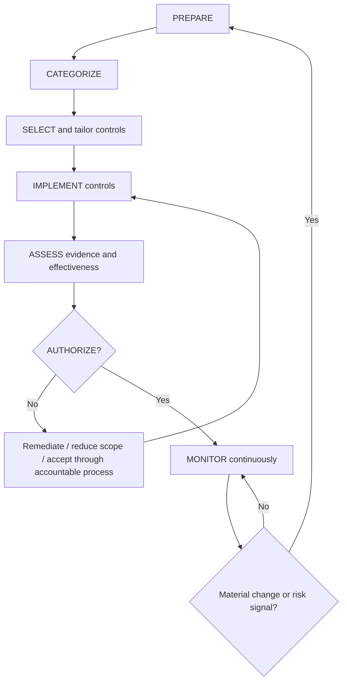
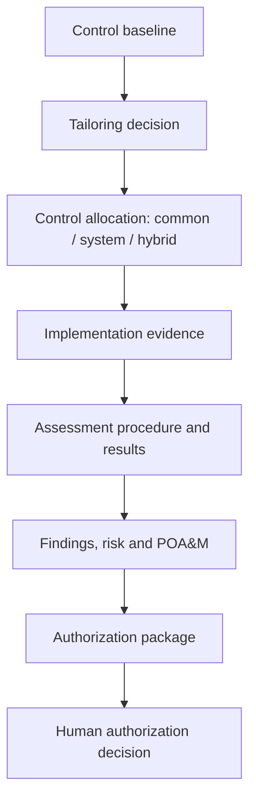
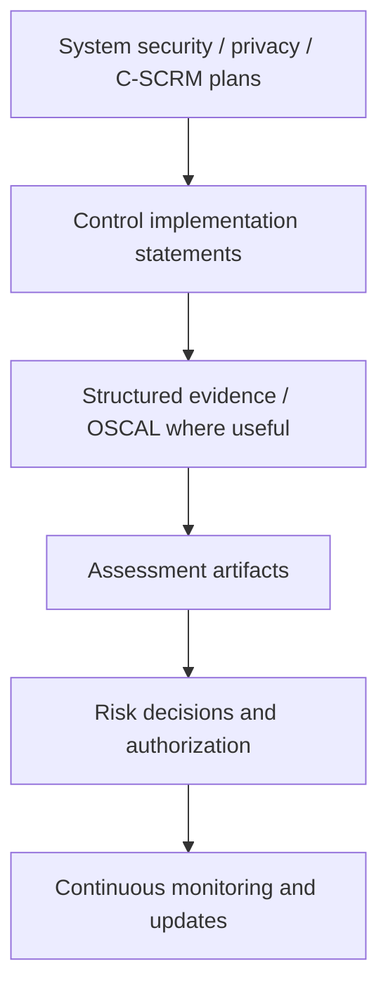

# Manual 10 — Implementation Paths

## Essential

Use for smaller or bounded systems. Minimum implementation expectations:

- defined system boundary, owner, mission/business context, and accountable roles;
- RMF step ownership and documented decision points;
- appropriate categorization and initial control baseline selection;
- documented tailoring rationale;
- clear identification of common, system-specific, and hybrid controls;
- implementation evidence for selected controls;
- risk-based assessment planning and findings tracking;
- explicit authorization decision by the accountable human official;
- continuous-monitoring cadence, exceptions, and POA&M tracking.

## Structured

Use for multiple systems, shared services, regulated environments, or material organizational risk. Add:

- organization-level risk strategy linked to system-level decisions;
- reusable common-control governance and inheritance evidence;
- system security, privacy, and C-SCRM planning aligned to SP 800-18 Rev. 2;
- formal control-tailoring records and overlays where appropriate;
- structured assessment evidence aligned to SP 800-53A;
- machine-readable evidence and OSCAL where operationally useful;
- formal authorization package management;
- recurring continuous-monitoring and reassessment triggers;
- exception, risk-acceptance, and POA&M governance with expiration and remediation ownership.

## Enhanced

Use for high-impact, mission-critical, enterprise-scale, highly regulated, or interconnected environments. Add:

- cross-system risk aggregation and enterprise risk reporting;
- rigorous common-control provider governance and inheritance validation;
- independent assessment and specialized technical testing where risk warrants;
- automated evidence collection with provenance controls;
- OSCAL-backed system/control/assessment artifacts where feasible;
- continuous-control monitoring linked to material change and authorization status;
- formal ongoing-authorization criteria where adopted by the organization;
- executive risk acceptance for material residual risk;
- resilience, supply-chain, privacy, and dependency risk integrated into authorization decisions.

## RMF evidence route

**Accessible explanation:** RMF is a continuous evidence-and-decision lifecycle. A failed authorization decision returns work for remediation or accountable risk treatment rather than creating automatic approval. Monitoring feeds material change back into preparation and reassessment.

## Control evidence chain

**Accessible explanation:** Evidence must connect baseline selection, tailoring, allocation, implementation, assessment, findings, remediation and the final accountable authorization decision. No checklist or automated workflow replaces that chain.

## Planning and machine-readable evidence chain

**Accessible explanation:** System plans and implementation statements should remain connected to assessment evidence, risk decisions, authorization, and monitoring. Machine-readable formats can improve traceability but do not create assurance by themselves.

## Control boundary

The manual is risk-based, tailorable, and evidence-based. It must not present SP 800-53 controls as universally mandatory outside their applicable governance context, must not treat the baseline as an untailored checklist, and must not imply that passing repository QA or an automated control test constitutes authorization, certification, or risk acceptance.
