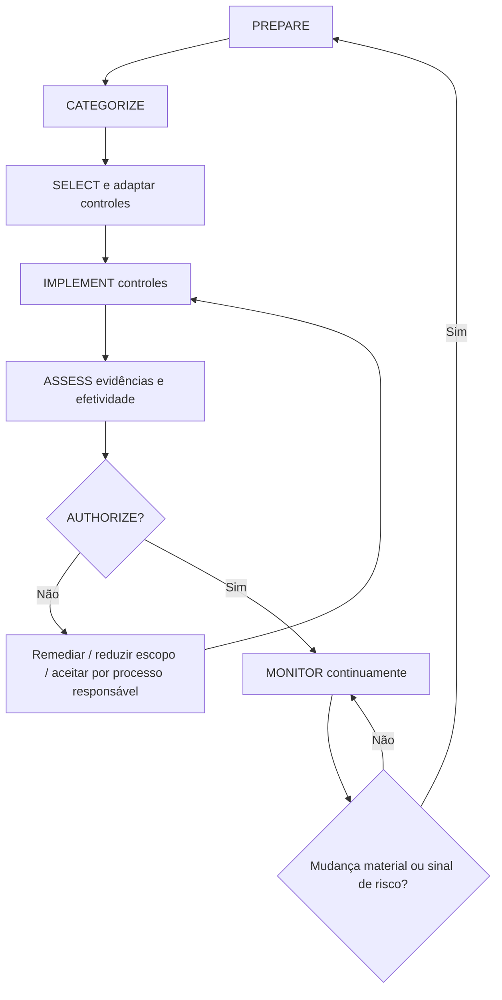
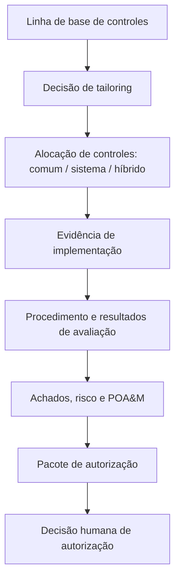
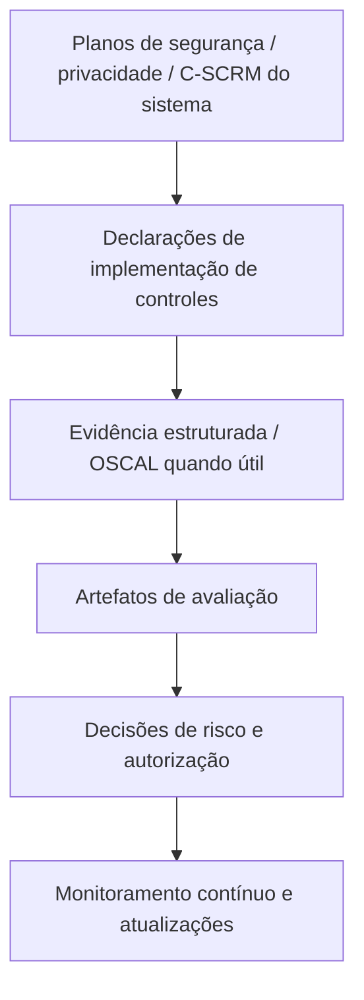

# Manual 10 — Caminhos de implementação

> **Rascunho controlado assistido por máquina (`pt-BR`).** A edição em inglês continua sendo a fonte controlada. Esta localização não constitui aprovação semântica ou terminológica humana e permanece sujeita à etapa de revisão humana antes da publicação.

## Essencial

Use para sistemas menores ou de escopo limitado. Expectativas mínimas de implementação:

- limite do sistema, proprietário, contexto de missão/negócio e funções responsáveis definidos;
- responsáveis por cada etapa do RMF e pontos de decisão documentados;
- categorização apropriada e seleção inicial da linha de base de controles;
- justificativa documentada de tailoring;
- identificação clara de controles comuns, específicos do sistema e híbridos;
- evidência de implementação para os controles selecionados;
- planejamento de avaliação baseado em risco e acompanhamento de achados;
- decisão explícita de autorização pela autoridade humana responsável;
- cadência de monitoramento contínuo, exceções e acompanhamento de POA&M.

## Estruturado

Use para múltiplos sistemas, serviços compartilhados, ambientes regulados ou risco organizacional material. Adicione:

- estratégia de risco em nível organizacional vinculada às decisões em nível de sistema;
- governança reutilizável de controles comuns e evidência de herança;
- planejamento de segurança, privacidade e C-SCRM do sistema alinhado ao SP 800-18 Rev. 2;
- registros formais de tailoring de controles e overlays quando apropriado;
- evidência estruturada de avaliação alinhada ao SP 800-53A;
- evidência legível por máquina e OSCAL quando operacionalmente útil;
- gestão formal do pacote de autorização;
- monitoramento contínuo recorrente e gatilhos de reavaliação;
- governança de exceções, aceitação de risco e POA&M com expiração e responsabilidade por remediação.

## Aprimorado

Use para ambientes de alto impacto, missão crítica, escala empresarial, alta regulação ou interconexão. Adicione:

- agregação de risco entre sistemas e relatórios de risco corporativo;
- governança rigorosa de provedores de controles comuns e validação de herança;
- avaliação independente e testes técnicos especializados quando o risco justificar;
- coleta automatizada de evidências com controles de proveniência;
- artefatos de sistema/controle/avaliação apoiados por OSCAL quando viável;
- monitoramento contínuo de controles vinculado a mudanças materiais e ao status de autorização;
- critérios formais de autorização contínua quando adotados pela organização;
- aceitação executiva de risco residual material;
- resiliência, cadeia de suprimentos, privacidade e risco de dependências integrados às decisões de autorização.

## Rota de evidência RMF

**Explicação acessível:** O RMF é um ciclo contínuo de evidência e decisão. Uma decisão negativa de autorização devolve o trabalho para remediação ou tratamento responsável do risco, em vez de criar aprovação automática. O monitoramento devolve mudanças materiais à preparação e à reavaliação.

## Cadeia de evidência de controles

**Explicação acessível:** A evidência deve conectar seleção da linha de base, tailoring, alocação, implementação, avaliação, achados, remediação e a decisão final de autorização responsável. Nenhuma lista de verificação ou fluxo automatizado substitui essa cadeia.

## Cadeia de planejamento e evidência legível por máquina

**Explicação acessível:** Os planos do sistema e as declarações de implementação devem permanecer conectados às evidências de avaliação, decisões de risco, autorização e monitoramento. Formatos legíveis por máquina podem melhorar a rastreabilidade, mas não criam asseguração por si mesmos.

## Limite de controle

O manual é baseado em risco, adaptável e baseado em evidências. Ele não deve apresentar controles do SP 800-53 como universalmente obrigatórios fora de seu contexto de governança aplicável, não deve tratar a linha de base como uma lista de verificação sem tailoring e não deve implicar que passar no QA do repositório ou em um teste automatizado de controles constitui autorização, certificação ou aceitação de risco.
