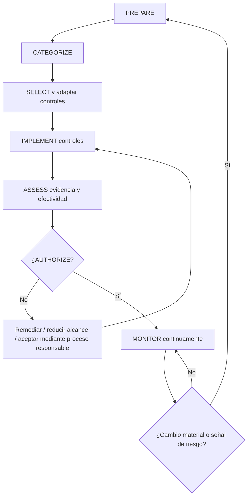
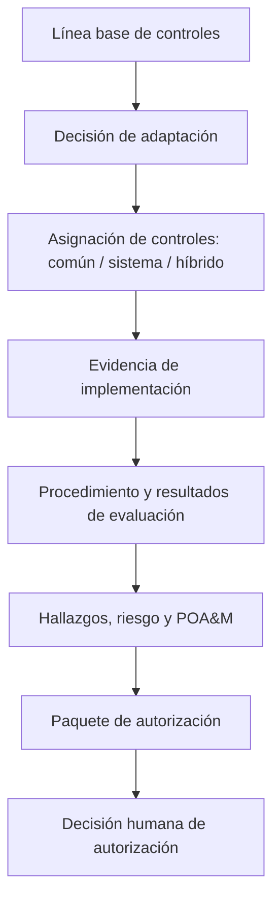
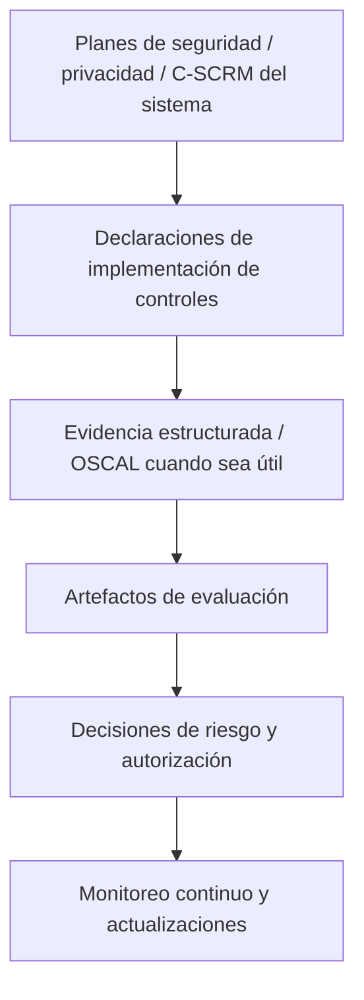

# Manual 10 — Rutas de implementación

> **Borrador controlado asistido por máquina (`es-419`).** La edición en inglés sigue siendo la fuente controlada. Esta localización no constituye aprobación semántica o terminológica humana y permanece sujeta a la compuerta de revisión humana antes de publicación.

## Esencial

Use esta ruta para sistemas más pequeños o con alcance acotado. Expectativas mínimas de implementación:

- límite del sistema, propietario, contexto de misión/negocio y roles responsables definidos;
- responsables de cada paso de RMF y puntos de decisión documentados;
- categorización apropiada y selección inicial de línea base de controles;
- justificación documentada de la adaptación;
- identificación clara de controles comunes, específicos del sistema e híbridos;
- evidencia de implementación para los controles seleccionados;
- planificación de evaluación basada en riesgo y seguimiento de hallazgos;
- decisión explícita de autorización por la autoridad humana responsable;
- frecuencia de monitoreo continuo, excepciones y seguimiento de POA&M.

## Estructurada

Use esta ruta para múltiples sistemas, servicios compartidos, entornos regulados o riesgo organizacional material. Añada:

- estrategia de riesgo a nivel organizacional vinculada con decisiones a nivel de sistema;
- gobierno reutilizable de controles comunes y evidencia de herencia;
- planificación de seguridad, privacidad y C-SCRM del sistema alineada con SP 800-18 Rev. 2;
- registros formales de adaptación de controles y overlays cuando corresponda;
- evidencia de evaluación estructurada alineada con SP 800-53A;
- evidencia legible por máquina y OSCAL cuando sea operacionalmente útil;
- gestión formal del paquete de autorización;
- monitoreo continuo recurrente y activadores de reevaluación;
- gobierno de excepciones, aceptación de riesgo y POA&M con vencimiento y responsables de remediación.

## Mejorada

Use esta ruta para entornos de alto impacto, misión crítica, escala empresarial, alta regulación o interconexión. Añada:

- agregación de riesgo entre sistemas e informes de riesgo empresarial;
- gobierno riguroso de proveedores de controles comunes y validación de herencia;
- evaluación independiente y pruebas técnicas especializadas cuando el riesgo lo justifique;
- recopilación automatizada de evidencia con controles de procedencia;
- artefactos de sistema/control/evaluación respaldados por OSCAL cuando sea factible;
- monitoreo continuo de controles vinculado con cambios materiales y estado de autorización;
- criterios formales de autorización continua cuando la organización los adopte;
- aceptación ejecutiva de riesgo residual material;
- resiliencia, cadena de suministro, privacidad y riesgo de dependencias integrados en decisiones de autorización.

## Ruta de evidencia RMF

**Explicación accesible:** RMF es un ciclo continuo de evidencia y decisión. Una decisión negativa de autorización devuelve el trabajo a remediación o tratamiento responsable del riesgo en vez de crear aprobación automática. El monitoreo devuelve los cambios materiales a preparación y reevaluación.

## Cadena de evidencia de controles

**Explicación accesible:** La evidencia debe conectar selección de línea base, adaptación, asignación, implementación, evaluación, hallazgos, remediación y la decisión final de autorización responsable. Ninguna lista de verificación o flujo automatizado sustituye esa cadena.

## Cadena de planificación y evidencia legible por máquina

**Explicación accesible:** Los planes del sistema y las declaraciones de implementación deben permanecer conectados con la evidencia de evaluación, decisiones de riesgo, autorización y monitoreo. Los formatos legibles por máquina pueden mejorar la trazabilidad, pero no crean aseguramiento por sí mismos.

## Límite de control

El manual es basado en riesgo, adaptable y basado en evidencia. No debe presentar los controles SP 800-53 como universalmente obligatorios fuera de su contexto de gobierno aplicable, no debe tratar la línea base como una lista de verificación sin adaptación y no debe implicar que aprobar QA del repositorio o una prueba automatizada de controles constituye autorización, certificación o aceptación de riesgo.
