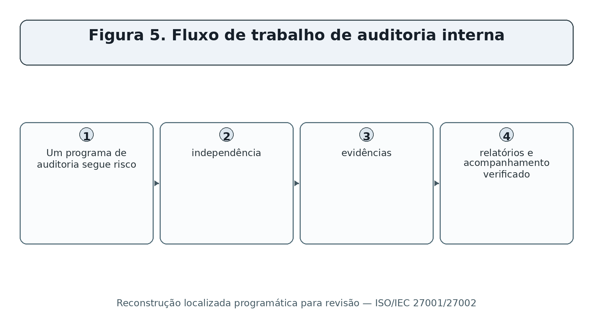
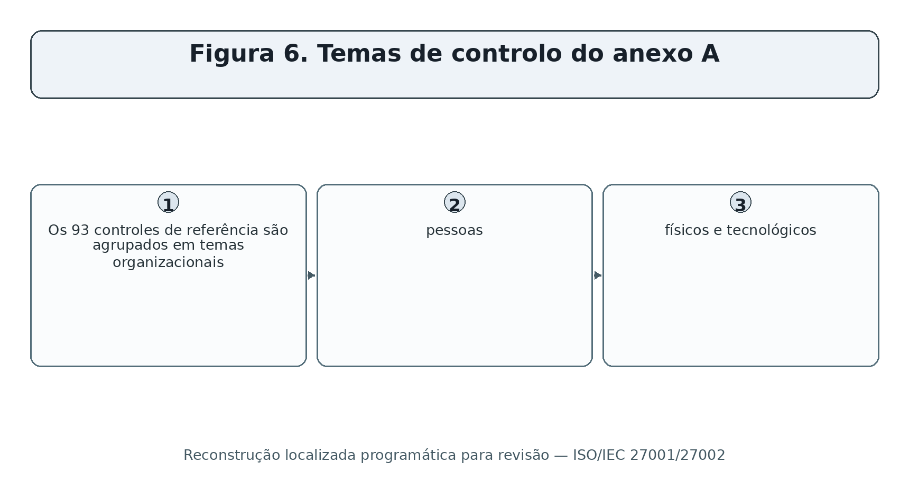
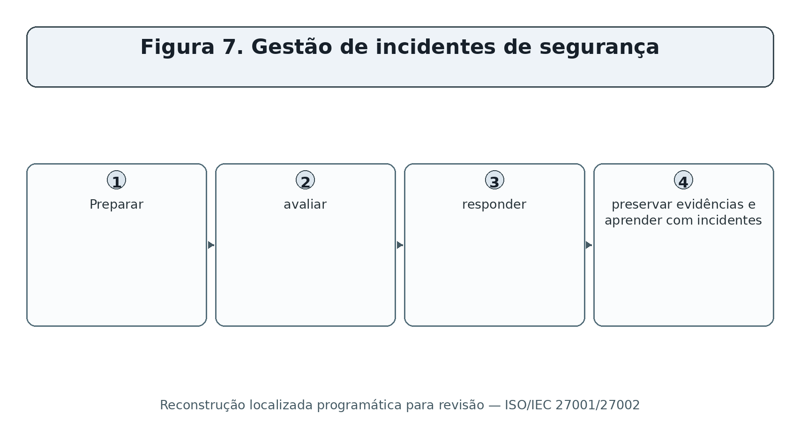
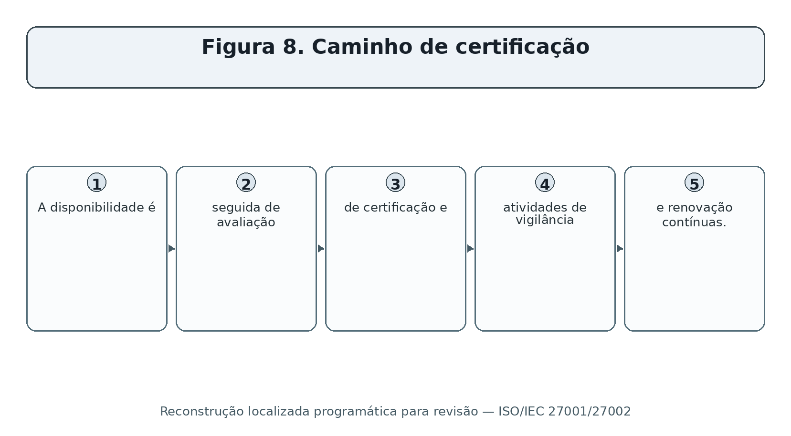
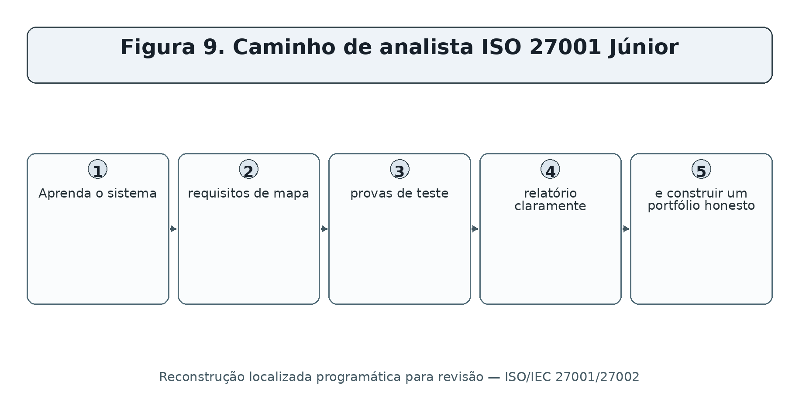

> **Status da revisão:** Rascunho de tradução assistida por máquina. Requer revisão humana de terminologia, significado, links, formatação e atualidade técnica antes de ser marcado como edição final.

** SÉRIES PRÁTICAS DE CIBERSegurança, PRIVACIDADE E CONFORMIDADE

**ISO/IEC 27001:2022 & ISO/IEC 27002:2022**

**IsMS prático, risco, auditoria, controles e ferramentas de código aberto

* Um manual de trabalho para gerentes, analistas júnior, estudantes, mudadores de carreira, auditores internos e equipes de segurança*

** Alberto (Al) Leiva**

Primeira edição • Julho de 2026

• todos os 93 controles do Anexo A • risco • declaração de aplicabilidade • auditoria • certificação • provas • ferramentas • laboratórios • preparação para a carreira
-------------------------------------------------------------------------------------------------------------------------------------------------------

# Publicação e Aviso de Uso

Autor: Alberto (Al) Leiva

Edição: Primeira Edição, Julho 2026

Este manual educacional independente não é uma publicação ISO, consultoria jurídica, decisão de certificação, relatório de auditoria ou substituto para os padrões licenciados ISO/IEC. As publicações ISO têm direitos autorais. As descrições de controlo e de cláusula aqui são resumos originais; use as normas oficiais para requisitos exatos e orientação.

ISO desenvolve padrões, mas não certifica as organizações. A certificação é opcional e é realizada por organismos de certificação. Verifique o status de acreditação, escopo, locais, versão e certificado antes de confiar em uma reivindicação de certificação.

## Uso ético e autorizado

Use ferramentas técnicas apenas em sistemas, aplicativos, redes, contas em nuvem, repositórios e dados que você possui ou estão especificamente autorizados por escrito para avaliar. Use dados sintéticos e sistemas isolados em laboratórios.

Prefácio

* Uma introdução prática à gestão da segurança da informação e à garantia baseada em provas.*

ISO/IEC 27001 é um padrão de requisitos para estabelecer, implementar, manter e melhorar continuamente um sistema de gestão da segurança da informação. Utiliza o gerenciamento de risco para preservar a confidencialidade, integridade e disponibilidade de forma que se encaixe na organização. ISO/IEC 27002 fornece orientações de controlo detalhadas, mas não é em si uma norma de certificação.

As edições de base atuais são ISO/IEC 27001:2022 e ISO/IEC 27002:2022. ISO/IEC 27001:2022 A alteração 1:2024 acrescenta explicitamente a consideração das alterações climáticas ao contexto organizacional e observa que as partes interessadas podem ter requisitos relacionados com o clima. A emenda não significa que cada organização deve criar um programa climático; deve fazer e apoiar uma determinação fundamentada de relevância dentro do contexto ISMS.

Um ISMS bem sucedido não é uma pasta de políticas. Trata-se de um sistema de gestão funcional: líderes estabelecem direção, os proprietários de risco tomam decisões de tratamento informadas, as equipes operam controles, os testes de auditoria interna o sistema, os resultados das revisões de gestão e as ações corretivas evitam a recorrência.

Como usar este manual

Os gerentes devem começar com os capítulos 1–5 e 18–23.

Os analistas júnior devem estudar cláusulas, temas do Anexo A, testes de evidências, ferramentas, laboratório e preparação de entrevista.

Os auditores internos devem centrar-se em critérios objetivos, independência, populações completas, amostragem, resultados, medidas corretivas e acompanhamento.

As organizações que buscam certificação devem confirmar as expectativas de certificação, alteração, escopo de certificação e credenciamento com profissionais competentes.

*Conteúdo:** Este documento contém um campo nativo da tabela de conteúdos do Word e um guia de capítulo verificado. Depois de editar, clique com o botão direito do mouse no conteúdo e escolha o Campo de Atualização e, em seguida, atualize a tabela inteira.
----------------------------------------------------------------------------------------------------------------------------------------------------------------------------------------------------------------------------------------------------------------

Sumário

[Comunicação de publicação e uso [2]](#publication-and-use-notice)

[Uso ética e autorizada [2]](#ethical-and-authorized-use)

[Prefácio [3]](#preface)

[Como usar este manual [4]](#how-to-use-this-manual)

[Sumário [4]](#table-of-contents)

[1. ISO/IEC 27001 e 27002 Fundações [7]](#isoiec-27001-and-27002-foundations)

[2. Âmbito de aplicação do ISMS e partes interessadas [8]](#isms-scope-and-interested-parties)

[3. Avaliação dos riscos e tratamento dos riscos [9]](#risk-assessment-and-risk-treatment)

[4. Declaração de aplicabilidade [10]](#statement-of-applicability)

[5. Documentação e provas [11]](#documentation-and-evidence)

[6. Cláusula 4 — Contexto da organização [12]](#clause-4-context-of-the-organization)

[7. Cláusula 5 — Liderança [13]](#clause-5-leadership)

[8. Cláusula 6 — Planejamento [14]](#clause-6-planning)

[9. Cláusula 7 — Apoio [15]](#clause-7-support)

[10. Cláusula 8 — Operação [16]](#clause-8-operation)

[11. Cláusula 9 — Avaliação do desempenho [17]](#clause-9-performance-evaluation)

[12. Cláusula 10 — Melhoria [18]](#clause-10-improvement)

[13. Anexo A 5 Controles organizacionais [19]](#annex-a-5-organizational-controls)

[14) Anexo A 6 Pessoas que controlam [22]](#annex-a-6-people-controls)

[15. Anexo A 7 Controles físicos [23]](#annex-a-7-physical-controls)

[16. Anexo A 8 Controles tecnológicos [24]](#annex-a-8-technological-controls)

[17. Controles de execução com ISO/IEC 27002 [26]](#implementing-controls-with-isoiec-27002)

[18. Testes Métricos e de Controlo [27]](#metrics-and-control-testing)

[19. Auditoria Interna [28]](#internal-audit)

[20. Revisão de gestão e ação corretiva [29]](#management-review-and-corrective-action)

[21. Preparação da certificação [30]](#certification-readiness)

[22. Ferramentas de Código Aberto [31]](#open-source-tools)

[22.1 Assistente CISO [31]](#ciso-assistant)

[22.2 Comunidade SimpleRisk [31]](#simplerisk-community)

[22.3 Wazuh [31]](#wazuh)

[22,4 osquery [32]](#osquery)

[22.5 OpenSCAP [32]](#openscap)

[22.6 Greenbone Community Edition [32]](#greenbone-community-edition)

[22,7 Nmap [32]](#nmap)

[22.8 Trivy [32]](#trivy)

[22,9 OWASP ZAP [33]](#owasp-zap)

[22.10 Keycloak [33]](#keycloak)

[22.11 DefectDojo [33]](#defectdojo)

[22,12 AIDE [33]](#aide)

[22.13 Lynis [33]](#lynis)

[22.14 Agente de política aberta [33]](#open-policy-agent)

[23. Manual do SGSI para gerentes [35]](#managers-isms-playbook)

[24. Guia de carreira do analista júnior [36]](#junior-analyst-career-guide)

[24,1 Trabalho júnior típico [36]](#typical-junior-work)

[24,2 Valor dos empregadores de competências [37]](#skills-employers-value)

[25. Laboratório Fictício e Portfólio [38]](#fictional-laboratory-and-portfolio)

[26. Plano de aprendizagem de trinta dias [39]](#thirty-day-learning-plan)

[27. Preparação da entrevista [40]](#interview-preparation)

[27.1 O que é um ISMS? [40]](#what-is-an-isms)

[27,2 ISO 27001 versus 27002? [40]](#iso-27001-versus-27002)

[27.3 O que é o SoA? [40]](#what-is-the-soa)

[27.4 Todos os controles do anexo A são obrigatórios? [40]](#are-all-annex-a-controls-mandatory)

[27.5 Como se testa um controlo? [40]](#how-do-you-test-a-control)

[27.6 O que é uma não conformidade? [40]](#what-is-a-nonconformity)

[27.7 O que mudou em 2024? [40]](#what-changed-in-2024)

[27.8 O que pode um analista júnior concluir com segurança? [40]](#what-can-a-junior-analyst-safely-conclude)

[27.9 Perguntas ao empregador [40]](#questions-to-ask-the-employer)

[28. Modelos, Glossário, Índice e Referências [42]](#templates-glossary-index-and-references)

[28.1 Registro mínimo de risco [42]](#minimal-risk-record)

[28.2 Papel de trabalho para teste de controle [42]](#control-test-workpaper)

[28.3 Glossário [42]](#glossary)

[28,4 Índice de assunto [43]](#subject-index)

[28.5 Referências oficiais [43]](#official-references)

# 1. Criar uma empresa fictícia com dois produtos, um serviço de nuvem, uma força de trabalho remota, e três fornecedores.

# 2. Escreva uma análise de contexto de uma página, registro do partido interessado, determinação da relevância do clima e declaração do escopo.

# 3. Criar critérios de risco e um registro de risco de dez cenários com proprietários e decisões de tratamento.

# 4. Criar um plano de tratamento e SoA que aborda todos os 93 controles Anexo A com justificativas concisas e estado de implementação honesto.

# 5. Construa políticas de amostragem, procedimentos, objetivos, métricas, registros de ativos e fornecedores, registro de treinamento, registro de incidentes e exercício de continuidade.

# 6. Use algumas ferramentas de código aberto em laboratórios isolados e capturar escopo, configuração, resultados, validação, remediação e evidências de reteste.

# 7. Projete e execute um plano de auditoria interna contra cláusulas e controles selecionados.

# 8. Escreva duas não conformidades, registros de causa raiz, ações corretivas e testes de eficácia.

# 9. Crie minutos de gerenciamento-revisão mostrando entradas, decisões, proprietários, recursos e prazos.

# 10. Publique somente artefatos sintéticos e higienizados, com uma declaração clara de limitações.

O artefato de Portfólio** O que demonstra**
□------------------------------------------------------------------------------------------------------------------
Contexto, partidos, escopo . Cláusula 4 raciocínio e limites .
• Método de risco, registro, tratamento
□ Declaração de aplicabilidade
□ Controle papel de teste □ Evidência, amostragem, exceção e conclusão
Programa, plano, critérios, relatório e acompanhamento
□ Minutos de análise de gestão
• Registro de acção correctiva
O Memorando de evidência da ferramenta O Alfabetismo técnico e limitações

# 11. Cláusula 9 — Avaliação do desempenho

* Requisitos em linguagem plana, foco de verificação e evidência de exemplo.*

□ ** Finalidade da clausa: ** Avaliação do desempenho
-----------------------

*Cláusula** **Plain signification** ** **Verificação de foco** **Exemplo evidência**
---------------------------------------------------------------------------------------------------------------------------------------------------------------------------------------------------------------------------------------------------------------------------------------------------------------------------------------------------------------------------------------------------------------------------------------------------------------------------------------------------------
Defina o que monitorar e medir, como e quando fazê-lo, quem o avalia e como os resultados são retidos e analisados. Confirmar propriedade, escopo, método, aprovação, provas operacionais, exceções, correção e registros retidos. Políticas, registros, planos, registros, minutos, resultados, aprovações e evidências de seguimento.
9.2.1 Realizar auditorias internas em intervalos planejados para avaliar a conformidade com os requisitos organizacionais e ISO/IEC 27001 e implementação eficaz. Confirmar propriedade, escopo, método, aprovação, provas operacionais, exceções, correção e registros retidos. Políticas, registros, planos, registros, minutos, resultados, aprovações e evidências de seguimento.
9.2.2 Manter um programa de auditoria com frequência, métodos, responsabilidades, planejamento, relatórios, escopo, critérios, auditores objetivos, resultados retidos e ação corretiva oportuna. Confirmar propriedade, escopo, método, aprovação, provas operacionais, exceções, correção e registros retidos. Políticas, registros, planos, registros, minutos, resultados, aprovações e evidências de seguimento.
□ 9.3.1 □ Top management revê o ISMS em intervalos planejados para adequação, adequação e eficácia contínuas. Confirmar propriedade, escopo, método, aprovação, provas operacionais, exceções, correção e registros retidos. Políticas, registros, planos, registros, minutos, resultados, aprovações e evidências de seguimento.
Leia os insumos necessários, tais como ações anteriores, mudanças de contexto, necessidades interessadas, desempenho, feedback, risco, tratamento e oportunidades de melhoria. Confirmar propriedade, escopo, método, aprovação, provas operacionais, exceções, correção e registros retidos. Políticas, registros, planos, registros, minutos, resultados, aprovações e evidências de seguimento.
□ 9.3.3 □ Registre as decisões da análise crítica pela direção sobre melhorias e mudanças necessárias no SGSI. Confirmar propriedade, escopo, método, aprovação, provas operacionais, exceções, correção e registros retidos. Políticas, registros, planos, registros, minutos, resultados, aprovações e evidências de seguimento.

Use o texto oficial licenciado ISO/IEC 27001 para requisitos normativos exatos. Este manual parafraseia conceitos para a educação e não substitui o padrão.

Figura 5. Fluxo de trabalho de auditoria interna

# 12. Cláusula 10 — Melhoria

* Requisitos em linguagem plana, foco de verificação e evidência de exemplo.*

□ ** Finalidade da clausa: ** Melhoria
O que é que se passa?

*Cláusula** **Plain signification** ** **Verificação de foco** **Exemplo evidência**
---------------------------------------------------------------------------------------------------------------------------------------------------------------------------------------------------------------------------------------------------------------------------------------------------------------------------------------------------------------------------------------------------------------------------------
□ 10.1 □ Melhorar continuamente a adequação, adequação e eficácia do ISMS. Confirmar propriedade, escopo, método, aprovação, provas operacionais, exceções, correção e registros retidos. Políticas, registros, planos, registros, minutos, resultados, aprovações e evidências de seguimento.
Reagir a não conformidades, corrigi-las, analisar as causas, prevenir a recorrência, verificar a eficácia e manter evidências. Confirmar propriedade, escopo, método, aprovação, provas operacionais, exceções, correção e registros retidos. Políticas, registros, planos, registros, minutos, resultados, aprovações e evidências de seguimento.

Use o texto oficial licenciado ISO/IEC 27001 para requisitos normativos exatos. Este manual parafraseia conceitos para a educação e não substitui o padrão.

Figura 6. Temas de controlo do anexo A

# 13. Anexo A 5 Controles organizacionais

* Resumos originais dos controles de referência, foco de verificação e exemplos de provas.*

Controle** Controle** Significado prático** Foco de verificação**Exemplo de evidência**
-------------------------------------------------------------------------------------------------------------------------------------------------------------------------------------------------
Manter políticas de segurança da informação aprovadas. Confirmar risco ou obrigação, design, proprietário, implementação, operação, exceções e medição. □ Procedimento, configuração, registro, registro, ticket, revisão, teste ou observação. □
5.2 Defina funções e responsabilidades de segurança. Confirmar risco ou obrigação, design, proprietário, implementação, operação, exceções e medição. □ Procedimento, configuração, registro, registro, ticket, revisão, teste ou observação. □
□ 5.3 □ Funções conflitantes separadas. Confirmar risco ou obrigação, design, proprietário, implementação, operação, exceções e medição. □ Procedimento, configuração, registro, registro, ticket, revisão, teste ou observação. □
5,4 Requerer que os gestores executem as responsabilidades de segurança. Confirmar risco ou obrigação, design, proprietário, implementação, operação, exceções e medição. □ Procedimento, configuração, registro, registro, ticket, revisão, teste ou observação. □
Manter o contato apropriado com as autoridades. Confirmar risco ou obrigação, design, proprietário, implementação, operação, exceções e medição. □ Procedimento, configuração, registro, registro, ticket, revisão, teste ou observação. □
Participe de grupos de segurança relevantes e fóruns profissionais. Confirmar risco ou obrigação, design, proprietário, implementação, operação, exceções e medição. □ Procedimento, configuração, registro, registro, ticket, revisão, teste ou observação. □
5.7 ! Colete e use a inteligência de ameaça. Confirmar risco ou obrigação, design, proprietário, implementação, operação, exceções e medição. □ Procedimento, configuração, registro, registro, ticket, revisão, teste ou observação. □
□ 5.8 □ Criar segurança na gestão de projetos. Confirmar risco ou obrigação, design, proprietário, implementação, operação, exceções e medição. □ Procedimento, configuração, registro, registro, ticket, revisão, teste ou observação. □
Informações de inventário e ativos associados. Confirmar risco ou obrigação, design, proprietário, implementação, operação, exceções e medição. □ Procedimento, configuração, registro, registro, ticket, revisão, teste ou observação. □
5.10 Definição de regras de uso e manuseio aceitáveis. Confirmar risco ou obrigação, design, proprietário, implementação, operação, exceções e medição. □ Procedimento, configuração, registro, registro, ticket, revisão, teste ou observação. □
5,11 Recupere ativos organizacionais quando os papéis terminarem ou mudarem. Confirmar risco ou obrigação, design, proprietário, implementação, operação, exceções e medição. □ Procedimento, configuração, registro, registro, ticket, revisão, teste ou observação. □
□ 5.12 □ Classifique informações de acordo com a necessidade e risco. Confirmar risco ou obrigação, design, proprietário, implementação, operação, exceções e medição. □ Procedimento, configuração, registro, registro, ticket, revisão, teste ou observação. □
□ 5.13 □ Informação do rótulo consistente com a classificação. Confirmar risco ou obrigação, design, proprietário, implementação, operação, exceções e medição. □ Procedimento, configuração, registro, registro, ticket, revisão, teste ou observação. □
6.14 Proteger as transferências de informação. Confirmar risco ou obrigação, design, proprietário, implementação, operação, exceções e medição. □ Procedimento, configuração, registro, registro, ticket, revisão, teste ou observação. □
• 5.15 • Estabelecer regras de acesso-controle. Confirmar risco ou obrigação, design, proprietário, implementação, operação, exceções e medição. □ Procedimento, configuração, registro, registro, ticket, revisão, teste ou observação. □
5.16 Gerenciar identidades ao longo de seu ciclo de vida. Confirmar risco ou obrigação, design, proprietário, implementação, operação, exceções e medição. □ Procedimento, configuração, registro, registro, ticket, revisão, teste ou observação. □
5.17 . Proteger informações de autenticação. Confirmar risco ou obrigação, design, proprietário, implementação, operação, exceções e medição. □ Procedimento, configuração, registro, registro, ticket, revisão, teste ou observação. □
5,18 Aprovar, rever, modificar e remover direitos de acesso. Confirmar risco ou obrigação, design, proprietário, implementação, operação, exceções e medição. □ Procedimento, configuração, registro, registro, ticket, revisão, teste ou observação. □
5.19 Gerenciar risco de segurança nas relações de fornecedores. Confirmar risco ou obrigação, design, proprietário, implementação, operação, exceções e medição. □ Procedimento, configuração, registro, registro, ticket, revisão, teste ou observação. □
Inclua os requisitos de segurança nos acordos de fornecedores. Confirmar risco ou obrigação, design, proprietário, implementação, operação, exceções e medição. □ Procedimento, configuração, registro, registro, ticket, revisão, teste ou observação. □
Gerencie o risco de segurança da cadeia de fornecimento de TIC. Confirmar risco ou obrigação, design, proprietário, implementação, operação, exceções e medição. □ Procedimento, configuração, registro, registro, ticket, revisão, teste ou observação. □
Monitorar, rever e controlar as mudanças entre fornecedores e serviços. Confirmar risco ou obrigação, design, proprietário, implementação, operação, exceções e medição. □ Procedimento, configuração, registro, registro, ticket, revisão, teste ou observação. □
□ 5.23 □ Govern aquisição, uso, gerenciamento e saída dos serviços de nuvem. Confirmar risco ou obrigação, design, proprietário, implementação, operação, exceções e medição. □ Procedimento, configuração, registro, registro, ticket, revisão, teste ou observação. □
Preparar e planejar a gestão de incidentes de segurança. Confirmar risco ou obrigação, design, proprietário, implementação, operação, exceções e medição. □ Procedimento, configuração, registro, registro, ticket, revisão, teste ou observação. □
5.25 Avaliar eventos e decidir se eles são incidentes. Confirmar risco ou obrigação, design, proprietário, implementação, operação, exceções e medição. □ Procedimento, configuração, registro, registro, ticket, revisão, teste ou observação. □
Responder a incidentes de segurança. Confirmar risco ou obrigação, design, proprietário, implementação, operação, exceções e medição. □ Procedimento, configuração, registro, registro, ticket, revisão, teste ou observação. □
5.27 Aprenda com incidentes e melhore os controles. Confirmar risco ou obrigação, design, proprietário, implementação, operação, exceções e medição. □ Procedimento, configuração, registro, registro, ticket, revisão, teste ou observação. □
5.28 Identifique, recolha, adquira e preserve a evidência. Confirmar risco ou obrigação, design, proprietário, implementação, operação, exceções e medição. □ Procedimento, configuração, registro, registro, ticket, revisão, teste ou observação. □
5.29 . Proteger a informação durante a interrupção. Confirmar risco ou obrigação, design, proprietário, implementação, operação, exceções e medição. □ Procedimento, configuração, registro, registro, ticket, revisão, teste ou observação. □
• 5.30 □ Preparar as TIC para apoiar a continuidade do negócio. Confirmar risco ou obrigação, design, proprietário, implementação, operação, exceções e medição. □ Procedimento, configuração, registro, registro, ticket, revisão, teste ou observação. □
5,31 Identifique e atenda aos requisitos legais, regulamentares e contratuais. Confirmar risco ou obrigação, design, proprietário, implementação, operação, exceções e medição. □ Procedimento, configuração, registro, registro, ticket, revisão, teste ou observação. □
5,32 Proteger os direitos de propriedade intelectual. Confirmar risco ou obrigação, design, proprietário, implementação, operação, exceções e medição. □ Procedimento, configuração, registro, registro, ticket, revisão, teste ou observação. □
□ 5.33 □ Proteger os registos durante todo o seu ciclo de vida. Confirmar risco ou obrigação, design, proprietário, implementação, operação, exceções e medição. □ Procedimento, configuração, registro, registro, ticket, revisão, teste ou observação. □
□ 5.34 □ Proteger a privacidade e as informações pessoalmente identificáveis. Confirmar risco ou obrigação, design, proprietário, implementação, operação, exceções e medição. □ Procedimento, configuração, registro, registro, ticket, revisão, teste ou observação. □
□ 5.35 □ Organize avaliações independentes da segurança da informação. Confirmar risco ou obrigação, design, proprietário, implementação, operação, exceções e medição. □ Procedimento, configuração, registro, registro, ticket, revisão, teste ou observação. □
• 5.36 • Verificar o cumprimento das políticas de segurança, regras e normas. Confirmar risco ou obrigação, design, proprietário, implementação, operação, exceções e medição. □ Procedimento, configuração, registro, registro, ticket, revisão, teste ou observação. □
Manter procedimentos operacionais documentados. Confirmar risco ou obrigação, design, proprietário, implementação, operação, exceções e medição. □ Procedimento, configuração, registro, registro, ticket, revisão, teste ou observação. □

Regra da seleção:** O anexo A é um conjunto de referência utilizado para verificar se os controles necessários não foram ignorados. A organização pode precisar de outros controles. Qualquer inclusão ou exclusão deve ser justificada através de tratamento de risco e registada na Declaração de Aplicabilidade. □
----------------------------------------------------------------------------------------------------------------------------------------------------------------------------------------------------------------------------------------------------------------------------------------------------------------------------------------------------------------------------------------------------------------------------------------------------------------------------------------------------------------

Figura 7. Gestão de incidentes de segurança

# 14. Anexo A 6 As pessoas controlam

* Resumos originais dos controles de referência, foco de verificação e exemplos de provas.*

Controle** Controle** Significado prático** Foco de verificação**Exemplo de evidência**
----------------------------------------------------------------------------------------------------------------------------------------------------------------------------------------------------------------------------
□ 6.1 □ Candidatos de tela e pessoal de acordo com a lei, o papel e o risco. Confirmar risco ou obrigação, design, proprietário, implementação, operação, exceções e medição. □ Procedimento, configuração, registro, registro, ticket, revisão, teste ou observação. □
6.2 Incluir responsabilidades de segurança em termos de emprego. Confirmar risco ou obrigação, design, proprietário, implementação, operação, exceções e medição. □ Procedimento, configuração, registro, registro, ticket, revisão, teste ou observação. □
6.3 □ Fornecer consciencialização, educação e formação baseadas em funções. Confirmar risco ou obrigação, design, proprietário, implementação, operação, exceções e medição. □ Procedimento, configuração, registro, registro, ticket, revisão, teste ou observação. □
6.4 Opere um processo disciplinar justo e comunicado. Confirmar risco ou obrigação, design, proprietário, implementação, operação, exceções e medição. □ Procedimento, configuração, registro, registro, ticket, revisão, teste ou observação. □
6.5.5 Gerenciar os deveres de segurança após a cessação ou mudança de função. Confirmar risco ou obrigação, design, proprietário, implementação, operação, exceções e medição. □ Procedimento, configuração, registro, registro, ticket, revisão, teste ou observação. □
6.6 Use acordos adequados de confidencialidade ou não divulgação. Confirmar risco ou obrigação, design, proprietário, implementação, operação, exceções e medição. □ Procedimento, configuração, registro, registro, ticket, revisão, teste ou observação. □
6.7 Proteger a informação durante o trabalho remoto. Confirmar risco ou obrigação, design, proprietário, implementação, operação, exceções e medição. □ Procedimento, configuração, registro, registro, ticket, revisão, teste ou observação. □
6.8 Tornar a comunicação de eventos de segurança fácil e oportuna. Confirmar risco ou obrigação, design, proprietário, implementação, operação, exceções e medição. □ Procedimento, configuração, registro, registro, ticket, revisão, teste ou observação. □

Regra da seleção:** O anexo A é um conjunto de referência utilizado para verificar se os controles necessários não foram ignorados. A organização pode precisar de outros controles. Qualquer inclusão ou exclusão deve ser justificada através de tratamento de risco e registada na Declaração de Aplicabilidade. □
----------------------------------------------------------------------------------------------------------------------------------------------------------------------------------------------------------------------------------------------------------------------------------------------------------------------------------------------------------------------------------------------------------------------------------------------------------------------------------------------------------------

# 15. Anexo A 7 Controles físicos

* Resumos originais dos controles de referência, foco de verificação e exemplos de provas.*

Controle** Controle** Significado prático** Foco de verificação**Exemplo de evidência**
---------------------------------------------------------------------------------------------------------------------------------------------------------------------------------------------------------------------------------------------------------------
Defina e proteja perímetros de segurança física. Confirmar risco ou obrigação, design, proprietário, implementação, operação, exceções e medição. □ Procedimento, configuração, registro, registro, ticket, revisão, teste ou observação. □
□ 7.2 □ Controle a entrada física. Confirmar risco ou obrigação, design, proprietário, implementação, operação, exceções e medição. □ Procedimento, configuração, registro, registro, ticket, revisão, teste ou observação. □
7.3 Escritórios seguros, quartos e instalações. Confirmar risco ou obrigação, design, proprietário, implementação, operação, exceções e medição. □ Procedimento, configuração, registro, registro, ticket, revisão, teste ou observação. □
Monitorar instalações para acesso físico não autorizado. Confirmar risco ou obrigação, design, proprietário, implementação, operação, exceções e medição. □ Procedimento, configuração, registro, registro, ticket, revisão, teste ou observação. □
7.5 Proteger contra ameaças físicas e ambientais. Confirmar risco ou obrigação, design, proprietário, implementação, operação, exceções e medição. □ Procedimento, configuração, registro, registro, ticket, revisão, teste ou observação. □
Aplicar regras de trabalho para áreas seguras. Confirmar risco ou obrigação, design, proprietário, implementação, operação, exceções e medição. □ Procedimento, configuração, registro, registro, ticket, revisão, teste ou observação. □
Use práticas claras e de tela clara. Confirmar risco ou obrigação, design, proprietário, implementação, operação, exceções e medição. □ Procedimento, configuração, registro, registro, ticket, revisão, teste ou observação. □
Local e proteger o equipamento apropriadamente. Confirmar risco ou obrigação, design, proprietário, implementação, operação, exceções e medição. □ Procedimento, configuração, registro, registro, ticket, revisão, teste ou observação. □
7.9 Proteger os activos utilizados fora das instalações organizacionais. Confirmar risco ou obrigação, design, proprietário, implementação, operação, exceções e medição. □ Procedimento, configuração, registro, registro, ticket, revisão, teste ou observação. □
7.10 Gerencie os meios de armazenamento ao longo de seu ciclo de vida. Confirmar risco ou obrigação, design, proprietário, implementação, operação, exceções e medição. □ Procedimento, configuração, registro, registro, ticket, revisão, teste ou observação. □
□ 7.11. Proteger utilitários de suporte. Confirmar risco ou obrigação, design, proprietário, implementação, operação, exceções e medição. □ Procedimento, configuração, registro, registro, ticket, revisão, teste ou observação. □
Proteger a energia e o cabeamento de dados. Confirmar risco ou obrigação, design, proprietário, implementação, operação, exceções e medição. □ Procedimento, configuração, registro, registro, ticket, revisão, teste ou observação. □
7,13 h Mantenha o equipamento com segurança. Confirmar risco ou obrigação, design, proprietário, implementação, operação, exceções e medição. □ Procedimento, configuração, registro, registro, ticket, revisão, teste ou observação. □
□ 7.14 □ Eliminar ou reutilizar equipamentos com segurança. Confirmar risco ou obrigação, design, proprietário, implementação, operação, exceções e medição. □ Procedimento, configuração, registro, registro, ticket, revisão, teste ou observação. □

Regra da seleção:** O anexo A é um conjunto de referência utilizado para verificar se os controles necessários não foram ignorados. A organização pode precisar de outros controles. Qualquer inclusão ou exclusão deve ser justificada através de tratamento de risco e registada na Declaração de Aplicabilidade. □
----------------------------------------------------------------------------------------------------------------------------------------------------------------------------------------------------------------------------------------------------------------------------------------------------------------------------------------------------------------------------------------------------------------------------------------------------------------------------------------------------------------

# 16. Anexo A 8 Controles tecnológicos

* Resumos originais dos controles de referência, foco de verificação e exemplos de provas.*

Controle** Controle** Significado prático** Foco de verificação**Exemplo de evidência**
----------------------------------------------------------------------------------------------------------------------------------------------------------------------------------------------------------------------------------------------------------------------------------------------------------------
□ 8.1 □ Dispositivos de endpoint do utilizador seguros. Confirmar risco ou obrigação, design, proprietário, implementação, operação, exceções e medição. □ Procedimento, configuração, registro, registro, ticket, revisão, teste ou observação. □
Controle os direitos de acesso privilegiados. Confirmar risco ou obrigação, design, proprietário, implementação, operação, exceções e medição. □ Procedimento, configuração, registro, registro, ticket, revisão, teste ou observação. □
.8.3 Restrinja o acesso à informação de acordo com a política. Confirmar risco ou obrigação, design, proprietário, implementação, operação, exceções e medição. □ Procedimento, configuração, registro, registro, ticket, revisão, teste ou observação. □
Controle o acesso ao código fonte e ferramentas de desenvolvimento. Confirmar risco ou obrigação, design, proprietário, implementação, operação, exceções e medição. □ Procedimento, configuração, registro, registro, ticket, revisão, teste ou observação. □
Use autenticação segura. Confirmar risco ou obrigação, design, proprietário, implementação, operação, exceções e medição. □ Procedimento, configuração, registro, registro, ticket, revisão, teste ou observação. □
• 8.6 • Gerenciar capacidade. Confirmar risco ou obrigação, design, proprietário, implementação, operação, exceções e medição. □ Procedimento, configuração, registro, registro, ticket, revisão, teste ou observação. □
□ 8.7 □ Proteger contra malware. Confirmar risco ou obrigação, design, proprietário, implementação, operação, exceções e medição. □ Procedimento, configuração, registro, registro, ticket, revisão, teste ou observação. □
* 8.8 * Gerenciar vulnerabilidades técnicas. Confirmar risco ou obrigação, design, proprietário, implementação, operação, exceções e medição. □ Procedimento, configuração, registro, registro, ticket, revisão, teste ou observação. □
□ 8.9 □ Gerenciar configurações. Confirmar risco ou obrigação, design, proprietário, implementação, operação, exceções e medição. □ Procedimento, configuração, registro, registro, ticket, revisão, teste ou observação. □
8,10, apagar informações de forma segura quando já não é necessário. Confirmar risco ou obrigação, design, proprietário, implementação, operação, exceções e medição. □ Procedimento, configuração, registro, registro, ticket, revisão, teste ou observação. □
□ 8.11 □ Máscara de dados sensíveis quando apropriado. Confirmar risco ou obrigação, design, proprietário, implementação, operação, exceções e medição. □ Procedimento, configuração, registro, registro, ticket, revisão, teste ou observação. □
• 8.12 • Evite vazamento de dados. Confirmar risco ou obrigação, design, proprietário, implementação, operação, exceções e medição. □ Procedimento, configuração, registro, registro, ticket, revisão, teste ou observação. □
• 8,13 • Manter e testar backups. Confirmar risco ou obrigação, design, proprietário, implementação, operação, exceções e medição. □ Procedimento, configuração, registro, registro, ticket, revisão, teste ou observação. □
□ 8.14 □ Fornecer redundância onde a disponibilidade o exija. Confirmar risco ou obrigação, design, proprietário, implementação, operação, exceções e medição. □ Procedimento, configuração, registro, registro, ticket, revisão, teste ou observação. □
8.15 Gerar, proteger, reter e rever logs. Confirmar risco ou obrigação, design, proprietário, implementação, operação, exceções e medição. □ Procedimento, configuração, registro, registro, ticket, revisão, teste ou observação. □
8,16 sistemas de monitoramento e redes para comportamento anormal. Confirmar risco ou obrigação, design, proprietário, implementação, operação, exceções e medição. □ Procedimento, configuração, registro, registro, ticket, revisão, teste ou observação. □
8.17. Sincronizar relógios. Confirmar risco ou obrigação, design, proprietário, implementação, operação, exceções e medição. □ Procedimento, configuração, registro, registro, ticket, revisão, teste ou observação. □
8.18. Controlar utilitários poderosos do sistema. Confirmar risco ou obrigação, design, proprietário, implementação, operação, exceções e medição. □ Procedimento, configuração, registro, registro, ticket, revisão, teste ou observação. □
8,19 - Instalação de software de controle em sistemas operacionais. Confirmar risco ou obrigação, design, proprietário, implementação, operação, exceções e medição. □ Procedimento, configuração, registro, registro, ticket, revisão, teste ou observação. □
□ 8.20 □ Redes seguras. Confirmar risco ou obrigação, design, proprietário, implementação, operação, exceções e medição. □ Procedimento, configuração, registro, registro, ticket, revisão, teste ou observação. □
Serviços de rede seguros. Confirmar risco ou obrigação, design, proprietário, implementação, operação, exceções e medição. □ Procedimento, configuração, registro, registro, ticket, revisão, teste ou observação. □
Segregate redes onde necessário. Confirmar risco ou obrigação, design, proprietário, implementação, operação, exceções e medição. □ Procedimento, configuração, registro, registro, ticket, revisão, teste ou observação. □
Controle o acesso a sites externos. Confirmar risco ou obrigação, design, proprietário, implementação, operação, exceções e medição. □ Procedimento, configuração, registro, registro, ticket, revisão, teste ou observação. □
Use e gerencie a criptografia apropriadamente. Confirmar risco ou obrigação, design, proprietário, implementação, operação, exceções e medição. □ Procedimento, configuração, registro, registro, ticket, revisão, teste ou observação. □
Opere um ciclo de vida de desenvolvimento seguro. Confirmar risco ou obrigação, design, proprietário, implementação, operação, exceções e medição. □ Procedimento, configuração, registro, registro, ticket, revisão, teste ou observação. □
□ 8.26 □ Defina requisitos de segurança da aplicação. Confirmar risco ou obrigação, design, proprietário, implementação, operação, exceções e medição. □ Procedimento, configuração, registro, registro, ticket, revisão, teste ou observação. □
8,27, aplicar princípios seguros de arquitetura e engenharia. Confirmar risco ou obrigação, design, proprietário, implementação, operação, exceções e medição. □ Procedimento, configuração, registro, registro, ticket, revisão, teste ou observação. □
8.28 Use práticas de codificação seguras. Confirmar risco ou obrigação, design, proprietário, implementação, operação, exceções e medição. □ Procedimento, configuração, registro, registro, ticket, revisão, teste ou observação. □
8,29 Ou Execute testes de segurança no desenvolvimento e aceitação. Confirmar risco ou obrigação, design, proprietário, implementação, operação, exceções e medição. □ Procedimento, configuração, registro, registro, ticket, revisão, teste ou observação. □
□ 8.30 □ Controle o desenvolvimento terceirizado. Confirmar risco ou obrigação, design, proprietário, implementação, operação, exceções e medição. □ Procedimento, configuração, registro, registro, ticket, revisão, teste ou observação. □
□ 8.31 □ Ambientes de desenvolvimento, teste e produção separados. Confirmar risco ou obrigação, design, proprietário, implementação, operação, exceções e medição. □ Procedimento, configuração, registro, registro, ticket, revisão, teste ou observação. □
8.32 Gerenciar as mudanças com segurança. Confirmar risco ou obrigação, design, proprietário, implementação, operação, exceções e medição. □ Procedimento, configuração, registro, registro, ticket, revisão, teste ou observação. □
8.33 . Proteger a informação do teste. Confirmar risco ou obrigação, design, proprietário, implementação, operação, exceções e medição. □ Procedimento, configuração, registro, registro, ticket, revisão, teste ou observação. □
8.34 . Proteger os sistemas operacionais durante os testes de auditoria. Confirmar risco ou obrigação, design, proprietário, implementação, operação, exceções e medição. □ Procedimento, configuração, registro, registro, ticket, revisão, teste ou observação. □

Regra da seleção:** O anexo A é um conjunto de referência utilizado para verificar se os controles necessários não foram ignorados. A organização pode precisar de outros controles. Qualquer inclusão ou exclusão deve ser justificada através de tratamento de risco e registada na Declaração de Aplicabilidade. □
----------------------------------------------------------------------------------------------------------------------------------------------------------------------------------------------------------------------------------------------------------------------------------------------------------------------------------------------------------------------------------------------------------------------------------------------------------------------------------------------------------------

# 17. Controles de implementação com ISO/IEC 27002

* Como transformar decisões de risco em controles que se encaixam na organização.*

# 18. Métricas e Testes de Controle

* Como verificar se o ISMS e seus controles funcionam.*

* ** ** ** ** ** ** ** ** ** ** ** ** ** ** ** ** **
□-----------------------------------------------------------------------------------------------------------------------------------------------------------------------------------------------------------------------------------------------------------------------------------------------------------------------------------------------------------------------------------------------------------------
Risco Todos os riscos atuais; amostra alta, alterado, aceito, e itens atrasados; Reperform pontuação, trace tratamento, confirmar aprovação do proprietário e revisão; Método, registro, aprovações, tratamento e risco residual
Todos os trabalhadores, privilegiados, serviços e identidades de terceiros Necessidade de teste, aprovação, MFA, revisão, mudança, inatividade, e terminação
Todos os ativos e resultados Validar cobertura, priorização, exceções, prazos, correção e rescan Inventário, varreduras, tickets, aprovações e retestes
□ Fornecedores □ População completa do fornecedor; serviços críticos e alterados da amostra □ Teste a devida diligência, acordo, responsabilidade, monitoramento, incidente e saída
Todos os eventos e incidentes reportados Todos os eventos e incidentes relatados
Continuidade Processos críticos e suporte TIC Trace business needs to recovery design and exercises BIA, plans, test records, gaps and retests
Todos os objetivos e medidas do ISMS. Verifique definição, qualidade dos dados, tendência, alvo, análise, decisão e ação.

- Definir critérios exatos, escopo, período, população, controle, proprietário, evidência e resultado esperado.

- Avalie o design antes da operação de teste.

- Obter a população completa e validar sua completude e precisão de forma independente.

- Selecione uma amostra baseada em risco cobrindo datas relevantes, proprietários, locais, falhas, exceções e alterações.

- Inspecionar registros, observar trabalho, entrevistar pessoal, examinar configuração, e reperformance onde prático.

- Excepções documentais como fatos ligados a critérios; não exagere ou esconda limitações.

- Atribuir correção, análise de causa raiz, proprietário, data de vencimento, proteção provisória, e escalada.

- Reteste e indicar a conclusão final e limitação restante.

# 19. Auditoria Interna

* Uma avaliação independente da conformidade e uma aplicação eficaz.*

Mantenha um programa de auditoria que considere a importância do processo, mudança, risco e resultados anteriores.

Definir objetivo, escopo, critérios, tempo, método, amostragem, registros e relatórios para cada auditoria.

Seleccionar os auditores competentes e suficientemente objectivos; os auditores não devem controlar o seu próprio trabalho sem salvaguardas.

Use o padrão licenciado, requisitos organizacionais, decisões de risco, SoA, políticas e obrigações aplicáveis como critérios.

Registar provas e conclusões suficientemente claras de que outra pessoa competente pode compreender a base.

Reportar os resultados à gestão relevante e acompanhar as correções e ações corretivas através da revisão da eficácia.

Tipo de localização** ** ** ** ** Resposta exigida**
------------------------------------------------------------------------------------------------------------------------------------------------------------------
Conformidade A evidência suporta os critérios
Oportunidade de melhoria Uma sugestão de melhoria útil que não é uma inconformidade oculta Avaliar voluntariamente e registrar decisão
Não-conformidade Um ou mais requisitos não são preenchidos, corrigir, analisar a causa, agir para prevenir a recorrência e verificar a eficácia
• Limitação da auditoria – Escopo, evidência, tempo, independência ou acesso restringiu a conclusão – Divulgar claramente e resolver quando possível

# 20. Revisão de Gestão e Ação Corretiva

* Decisões de liderança que mantêm o ISMS adequado e eficaz.*

• ** ** ** ** ** ** ** ** **
□----------------------------------------------------------------------------------------------------------------
• As ações anteriores foram concluídas e eficazes?
O que mudou, incluindo a relevância climática e as necessidades das partes interessadas?
Performance O que mostram métricas, objetivos, incidentes, resultados de auditoria e não conformidades?
O feedback do partido interessado O que relatam os clientes, reguladores, trabalhadores, fornecedores e proprietários?
Os níveis de risco, aceitação, tratamento, recursos e SoA ainda são apropriados?
Oportunidades de melhoria Que mudanças a liderança deve aprovar?

- Contenha ou corrija o problema imediato.

- Determinar a extensão e se falhas semelhantes existem em outro lugar.

- Analisar a causa com provas, não culpar.

- Plano de acção proporcional ao efeito e ao risco de recorrência.

- Aplicar alterações sob a propriedade e datas de vencimento.

- Verificar a eficácia usando evidências definidas após tempo de operação suficiente.

- Atualizar risco, controles, documentos, treinamento, objetivos e SoA quando necessário.

# 21. Preparação da certificação

* O que a certificação faz, como geralmente procede, e o que não garante.*

Figura 8. Caminho de certificação

A certificação é opcional; as organizações podem implementar ISO/IEC 27001 sem procurar um certificado.

ISO não realiza certificação. Um organismo de certificação independente realiza auditorias de certificação.

A acreditação proporciona uma confiança adicional na competência de um organismo de certificação; verificar o âmbito de acreditação e de certificação relevantes.

A Fase 1 avalia geralmente a prontidão, o âmbito, o sistema documentado e a preparação para a auditoria de execução.

A fase 2 avalia a implementação e a eficácia em todo o âmbito definido.

As atividades de vigilância e recertificação avaliam a conformidade contínua; os pormenores devem ser confirmados com o organismo de certificação seleccionado e as regras de acreditação.

Um certificado tem alcance e tempo limite. Ele não prova que cada produto é seguro, que nenhum incidente pode ocorrer, ou que cada sistema na empresa está incluído.

Área de preparação** Verificação de aceitação**
---------------------------------------------------------------------------------------------------------------------------------
• Escopo • Claro, suportável, refletido em operações reais e intenção de certificado
Método utilizado de forma consistente; registro completo; os proprietários aceitam risco residual
Todos os controles do Anexo A abordados; seleções, exclusões e status suportados
• Controles Implementados, operados tempo suficiente para produzir evidências confiáveis, e medidos
• Auditoria interna • Programa e auditoria completa concluídas com provas objectivas e seguimento
• Análise de gestão
• Acção correctiva; Não conformidades corrigidas; causa e eficácia abordadas
Emenda □ Relevância climática e requisitos das partes interessadas considerados e evidenciados

# 22. Ferramentas de Código Aberto

* Links oficiais, inícios rápidos seguros, evidências e limitações.*

. **Ferramenta** . **Purpose** . **Possível suporte** .
------------------------------------------------------------------------------------
□ Ciso Assistant; intuitem.github.io; ISMS, riscos, controles, provas
SimpleRisk Community www.simplerisk.com
• Wazuh – wazuh.com – SIEM, monitorização dos parâmetros de avaliação, MIF
.osquery , www.osquery.io , Endpoint inventário e consultas ,
□ OpenSCAP   www.open-scap.org
- Greenbone Community Edition - Greenbone.github.io - Gestão da vulnerabilidade
O Nmap nmap.org O Ativo e a descoberta do serviço
Varredura de código, imagem, dependência, segredo e configuração
• OWASP ZAP
□ Keycloak www.keycloak.org
DefectDojo www.defectdojo.org
• Monitorização da integridade dos ficheiros □
Lynis, cisofy.com, auditoria de segurança Linux
□ Open Policy Agent www.openpolicyagent.org

Limitação crítica: ** Ferramentas suportam controles e evidências; elas não selecionam tratamento de risco, determinam conformidade, substituem auditores competentes ou certificam uma organização. Validar cobertura, qualidade de dados, configuração, permissões, atualizações e revisão humana.
(---------------------------------------------------------------------------------------------------------------------------------------------------------------------------------------------------------------------------------------------------------------

# # 22.1 Assistente CISO

Objetivo: ISMS, riscos, controles, evidências. Projeto oficial: [<u>CISO Assistant</u>](https://intuitem.github.io/ciso-assistant-community/)

Início rápido seguro: Implantar em um ambiente de teste isolado; criar um projeto de framework, escopo, registro de risco, ações de tratamento, proprietários e registros de evidências.

Evidência: escopo aprovado, configuração, versão, cobertura, resultados, revisão, exceção, remediação e reteste. Proteja credenciais, registros, relatórios e backups.

# # 22.2 Comunidade de Risco Simples

Objetivo: Registro de risco e tratamento. Projecto oficial: [<u>SimpleRisk Community</u>](https://www.simplerisk.com/)

Início rápido e seguro: Instale com segurança, defina critérios de risco, registre riscos e proprietários, escolha tratamentos, rastreie datas de vencimento e exporte relatórios revisados.

Evidência: escopo aprovado, configuração, versão, cobertura, resultados, revisão, exceção, remediação e reteste. Proteja credenciais, registros, relatórios e backups.

# # 22,3 Wazuh

Objetivo: SIEM, monitorização do desfecho, MIF. Projecto oficial: [<u>Wazuh</u>](https://wazuh.com/)

Início rápido e seguro: Instale um gerente de laboratório e agente, confirme a inscrição, desencadeie um evento de teste autorizado, reveja o alerta e preserve a configuração e a evidência de alerta.

Evidência: escopo aprovado, configuração, versão, cobertura, resultados, revisão, exceção, remediação e reteste. Proteja credenciais, registros, relatórios e backups.

# # 22,4 Osquery

Finalidade: Inventário de Endpoint e consultas. Projeto oficial: [<u>osquery</u>](https://www.osquery.io/)

Início rápido seguro: Instale em um host de laboratório, execute consultas somente de leitura para software, usuários, processos ou configurações, agendar consultas aprovadas e cobertura de documentos.

Evidência: escopo aprovado, configuração, versão, cobertura, resultados, revisão, exceção, remediação e reteste. Proteja credenciais, registros, relatórios e backups.

# # 22.5 OpenSCAP

Objetivo: Avaliação da configuração do Linux. Projeto oficial: [<u>OpenSCAP</u>](https://www.open-scap.org/)

Início rápido seguro: Selecione um perfil apropriado, escaneie um sistema de laboratório, valide os achados manualmente, registre exceções, corrija e rescan.

Evidência: escopo aprovado, configuração, versão, cobertura, resultados, revisão, exceção, remediação e reteste. Proteja credenciais, registros, relatórios e backups.

## 22.6 Greenbone Community Edition

Objetivo: Gestão da vulnerabilidade. Projeto oficial: [<u>Greenbone Community Edition</u>](https://greenbone.github.io/docs/latest/)

Início rápido e seguro: Autorize alvos, atualize feeds, execute varreduras de laboratório autenticadas, valide cobertura e achados, atribua remediação e rescan.

Evidência: escopo aprovado, configuração, versão, cobertura, resultados, revisão, exceção, remediação e reteste. Proteja credenciais, registros, relatórios e backups.

# # 22,7 Nmap

Objetivo: Descoberta de ativos e serviços. Projeto oficial: [<u>Nmap</u>](https://nmap.org/)

Início rápido seguro: Use apenas em intervalos autorizados; comece com uma varredura de serviço limitada, compare resultados com inventário, investigue desconhecidos e mantenha o comando e escopo.

Evidência: escopo aprovado, configuração, versão, cobertura, resultados, revisão, exceção, remediação e reteste. Proteja credenciais, registros, relatórios e backups.

## 22.8 Trivy

Objetivo: Digitalização de código, imagem, dependência, segredo e configuração. Projeto oficial: [<u>Trivy</u>](https://trivy.dev/)

Início rápido seguro: Examine um repositório de testes ou uma imagem de container, valide os achados, suprime apenas com aprovação e razão, corrija e reescane.

Evidência: escopo aprovado, configuração, versão, cobertura, resultados, revisão, exceção, remediação e reteste. Proteja credenciais, registros, relatórios e backups.

# # 22,9 OWASP ZAP

Objetivo: Teste de aplicação na web autorizado. Projecto oficial: [<u>OWASP ZAP</u>](https://www.zaproxy.org/)

Início rápido seguro: Proxy um aplicativo de treinamento, rasteje passivamente, use a varredura ativa apenas com aprovação escrita, valide resultados e remediação de registros.

Evidência: escopo aprovado, configuração, versão, cobertura, resultados, revisão, exceção, remediação e reteste. Proteja credenciais, registros, relatórios e backups.

## 22.10 Keycloak

Objetivo: Identidade, MFA, papéis e logs. Projeto oficial: [<u>Keycloak</u>](https://www.keycloak.org/)

Início rápido e seguro: Crie um reino de laboratório, usuários, grupos, papéis menos privilegiados, MFA, configurações de sessão e eventos; teste os casos de joiner, movedor e leaver.

Evidência: escopo aprovado, configuração, versão, cobertura, resultados, revisão, exceção, remediação e reteste. Proteja credenciais, registros, relatórios e backups.

## 22.11 DefectDojo

Objetivo: Encontrar ingestão e remediação. Projeto oficial: [<u>DefectDojo</u>](https://www.defectdojo.org/)

Início rápido e seguro: Importar resultados seguros do scanner, desduplicar cuidadosamente, atribuir proprietários, definir prazos baseados no risco, anexar prova e fechar apenas após o reteste.

Evidência: escopo aprovado, configuração, versão, cobertura, resultados, revisão, exceção, remediação e reteste. Proteja credenciais, registros, relatórios e backups.

## 22.12 ADEUS

Objetivo: Monitorização da integridade dos ficheiros. Projecto oficial: [<u>AIDE</u>](https://aide.github.io/)

Início rápido seguro: Crie uma linha de base em um host de laboratório, faça uma alteração de arquivo autorizada, execute uma verificação, investigue a diferença e proteja a linha de base.

Evidência: escopo aprovado, configuração, versão, cobertura, resultados, revisão, exceção, remediação e reteste. Proteja credenciais, registros, relatórios e backups.

# # 22.13 Lynis

Objetivo: Auditoria de segurança Linux. Projeto oficial: [<u>Lynis</u>](https://cisofy.com/lynis/)

Início rápido seguro: Audite um anfitrião de laboratório, reveja sugestões contra o escopo e o risco, documente decisões, corrija itens selecionados e reexecute.

Evidência: escopo aprovado, configuração, versão, cobertura, resultados, revisão, exceção, remediação e reteste. Proteja credenciais, registros, relatórios e backups.

# # 22.14 Open Policy Agent

Objetivo: Política como código. Projeto oficial: [<u>Open Policy Agent</u>](https://www.openpolicyagent.org/)

Início rápido seguro: Escreva uma pequena regra de laboratório, teste de entradas permitidas e negadas, rever a política e testes, e preservar resultados como evidência de suporte.

Evidência: escopo aprovado, configuração, versão, cobertura, resultados, revisão, exceção, remediação e reteste. Proteja credenciais, registros, relatórios e backups.

# 23. Manual do SGSI para gerentes

*Perguntas, painel, propriedade e decisões os gerentes devem controlar.*

O escopo do ISMS ainda está alinhado com estratégia, serviços, locais, fornecedores, uso de nuvem, pessoas e fluxos de dados?

O que mudou no contexto, partes interessadas, obrigações legais, ameaças, tecnologia ou relevância climática?

Os critérios de risco são fiáveis e os proprietários aprovam explicitamente o tratamento e o risco residual?

O SoA corresponde à implementação de controle real e ações abertas?

Os objetivos e as métricas produzem decisões em vez de painéis decorativos?

Incidentes, constatações de auditoria, exceções, ações atrasadas e falhas repetidas são agravados?

A auditoria interna e a revisão da gestão têm independência, competência, tempo e provas suficientes?

As reivindicações de certificação, escopo, acreditação e declarações do cliente são precisas?

* * * * * * * * * * * * * * * * * * * * * * * * * * * * *
----------------------------------------------------
□ Contexto e escopo □ São atuais os limites, dependências, partidos e mudanças? Verde / Amarelo / Vermelho
Risco Os critérios são consistentes e as decisões do proprietário são oportunas? Verde / Amarelo / Vermelho
O SoA e os controles estão alinhados entre seleção, status e evidência? Verde / Amarelo / Vermelho
Performance - Os objetivos, métricas, incidentes e tendências impulsionam a ação? Verde / Amarelo / Vermelho
Os fornecedores são controlados risco, responsabilidade, monitoramento, incidentes e saídas? Verde / Amarelo / Vermelho
As auditorias são objetivas e as conclusões corrigidas de forma eficaz? Verde / Amarelo / Vermelho
• Melhoramento • Causas de raiz, recorrência e lições são abordadas? Verde / Amarelo / Vermelho
□ Certificação □ As reivindicações são avaliadas, atuais e suportáveis? Verde / Amarelo / Vermelho

# 24. Guia de Carreira do Analista Júnior

* Uma rota prática para ISMS, GRC, trabalho de risco, auditoria e conformidade.*

Figura 9. Caminho de analista ISO 27001 Júnior

GRC Júnior Analisador

Analisador de conformidade ISO 27001

Analista de Controles de Segurança

Coordenador do ISMS

Analista de Risco

Associado à Auditoria Interna

Analista de Riscos de Terceiros

Analista de Garantia de Segurança

# # 24,1 Típico trabalho júnior

- Manter escopo, ativo, obrigação, fornecedor, risco, controle, SoA, evidências, achados e registros de ação.

- Recolha provas sem alterar os registos e valide a integralidade.

- Mapa riscos e requisitos para controles, proprietários, procedimentos, sistemas e provas.

- Teste amostras de acesso, mudança, vulnerabilidade, incidente, backup, fornecedor, consciência, física e controles de continuidade.

- Apoiar auditorias internas, análises de gestão, métricas, ações corretivas e preparação de certificação.

- Escreva conclusões factuais e divulgue limitações de amostragem, escopo e provas.

- Proteger informações confidenciais e permanecer dentro da autorização.

# # 24.2 Valor dos empregadores de competências

Competência** Prova**
----------------------------------------------------------------------------------------------------------------- (----------------------------------------------------------------------------------------------------------------------------------------------------------------------------------
Os conceitos do ISMS explicam as cláusulas 4–10 e a melhoria contínua
• Risco • Criar um plano de registro e tratamento consistente
(SoA) Justifique seleções, exclusões, status e evidências ,
• Teste de evidência; Defina populações, amostras, procedimentos, exceções e retestes;
□ Alfabetização técnica; Interpretar identidade, nuvem, registro, vulnerabilidade, backup e evidência de configuração;
• Comunicação • Escrever conclusões concisas, acções e resumos de gestão
Ético Use dados sintéticos, sistemas autorizados e alegações honestas

# 25. Laboratório Fictício e Portfólio

* Um ambiente de prática segura usando dados sintéticos e sistemas de laboratório autorizados.*

Regra do laboratório:** Use uma organização fictícia, dados sintéticos, sistemas isolados e ferramentas que você está autorizado a operar. Não afirme que um projeto de portfólio é uma certificação real ou auditoria do cliente. □
□-----------------------------------------------------------------------------------------------------------------------------------------------------------------------------------------------------------------------------------------------------------------------------------------------------------------

# 26. Plano de Aprendizagem de Trinta Dias

* Uma programação focada para a construção de capacidade de nível júnior útil.*

* Dias** * Foco** * Entrega**
--------------------------------------------------------------------------------------
1–5 ISMS, CIA, cláusulas, ISO 27001/27002 relação, âmbito de aplicação
• 6–10 • Critérios de risco, cenários, avaliação, tratamento, aceitação
Os temas do Anexo A e a Declaração de Aplicabilidade
15–18 Políticas, competência, comunicação, controle de documentos, operações
□ 19–22 □ Métricas, monitorização, auditoria interna, revisão da gestão
23–25; Não conformidade, causa raiz, ação corretiva, melhoria; Dois registros de achados e ação corretiva;
26–28 Laboratórios de ferramentas de código aberto autorizados Dois memorandos de evidência e reteste
29–30 □ Limpeza e prática de entrevista de carteiras

# 27. Preparação da entrevista

* Respostas claras, cenários práticos e perguntas para o empregador.*

## 27.1 O que é um ISMS?

Um sistema de gestão para controlar o risco de segurança da informação através de liderança, planejamento, operação, avaliação e melhoria contínua.

# # 27,2 ISO 27001 versus 27002?

27001 contém requisitos ISMS certificados; 27002 fornece orientação de controle detalhada e não é em si uma norma de certificação.

# # 27.3 O que é o SoA?

Um registro controlado dos controles necessários, a justificação da inclusão ou exclusão no anexo A e o estado de execução, ligados ao tratamento e às provas.

## 27.4 Todos os controles do Anexo A são obrigatórios?

A organização deve utilizar o anexo A como verificação de referência e justificar as decisões. Controles necessários seguem tratamento de risco e obrigações; outros controles também podem ser necessários.

# # 27.5 Como se testa um controle?

Defina critérios e escopo, valide a população, amostra por risco, inspecione e reperforme evidências, exceções documentais e correção de reteste.

# # 27.6 O que é uma não conformidade?

Falha em cumprir uma exigência. Requer correção, avaliação, ação adequada e revisão de efetividade.

# # 27.7 O que mudou em 2024?

A alteração exige uma consideração explícita da relevância das alterações climáticas no contexto e observa que as partes interessadas podem ter requisitos relacionados com o clima.

# # 27.8 O que pode um analista júnior concluir com segurança?

Factos estatais apoiados por elementos de prova e âmbito definidos, divulgar limitações e evitar reclamar a autoridade de auditoria ou certificação.

# # 27.9 Perguntas para perguntar ao empregador

- Qual é o escopo ISMS certificado ou pretendido?

- Quem é o dono da aceitação do risco e do SoA?

- Como as populações de evidência são produzidas e validadas?

- Que sistemas gerem riscos, controles, fornecedores, resultados e medidas correctivas?

- Como é mantida a independência do auditor interno?

- Com que equipas técnicas trabalhará este papel?

- Como as conclusões júnior são revistas e treinadas?

# 28. Modelos, Glossário, Índice e Referências

* Estruturas de trabalho reutilizáveis, termos importantes e pontos de partida autoritários.*

# # 28.1 Registro de risco mínimo

* Campo** * Entrada**
----------------------------------------------------------------------------------------------------------------------
ID de risco e proprietário
Objetivo / ativo
"Evento e condição de ameaça"
Consequências
Controles existentes
* Litígio e impacto
O risco actual
O titular do tratamento e da acção □ \ \ \ \ \ \ \ \ \  \ \ \ \ \ \  \ \ \  \  \ \ \ \ \ \ \ \ \ 
Risco residual e aceitação
Data de revisão

# # 28.2 Papel de teste de controle

* Campo** * Entrada**
---------------------------------------------------------
• Critérios e controlo
Âmbito de aplicação e período
• Proprietário e sistemas
• Verificação da população e da completude
Exemplo e justificação
Procedimento realizado
• Provas inspeccionadas
Excepções
Conclusão e limitação
* Correcção e reteste

# # 28.3 Glossário

* ** ** ** ** ** ** **
--------------------------------------------------------------------------------------------------------------------------------------------------------------------------
• Anexo A • Conjunto de referência de 93 controles de segurança da informação em ISO/IEC 27001:2022.
. CIA . . Confidencialidade, integridade e disponibilidade.
O cumprimento de uma exigência.
□ Controle □ Medida que modifica ou mantém o risco.
- Acção correctiva - Acção que aborda a causa de uma não conformidade para prevenir a recorrência.
Informações documentadas A organização deve controlar e manter ou reter.
□ Parte interessada; Pessoa ou organização que pode afetar, ser afetada ou perceber-se afetada por uma decisão ou atividade. □
Sistema de gestão da segurança da informação.
Não-conformidade Não-conformidade
Risco residual . Risco remanescente após o tratamento.
O proprietário do risco é uma pessoa ou entidade responsável e autorizada a gerir um risco.
(SoA ) Declaração de Aplicabilidade.
Gestão de topo □ Pessoa ou grupo que dirige e controla a organização no mais alto nível dentro do escopo.

# # 28.4 Índice de assuntos

**Sujeito** **Capítulo**
----------------------------------
□ Controles do anexo A
Auditoria
□ Certificação
Emenda Climática 1, 2, 6, 21
• Acção correctiva
□ Evidências
□ Partes interessadas
Analistas júnior
Revisão de gestão , 11, 20 ,
□ Métricas 11, 18
• Ferramentas de código aberto
• Avaliação e tratamento de riscos
Âmbito de aplicação
Declaração de Aplicabilidade
Fornecedores 13, 18, 23

# # 28.5 Referências oficiais

[<u>ISO/IEC 27001:2022 visão geral</u>](https://www.iso.org/standard/27001)

[<u>ISO/IEC 27001:2022/Amd 1:2024</u>](https://www.iso.org/standard/88435.html)

[<u>ISO/IEC 27002:2022 visão geral</u>](https://www.iso.org/standard/75652.html)

[<u>ISO/IAF comunicação sobre alterações climáticas</u>](https://iaf.nu/iaf_system/uploads/documents/Joint_ISO-IAF_Communique_re_Climate_Change_Amds_to_ISO_MSS_Feb_2024_Final.pdf)

[<u>ISO certification overview</u>](https://www.iso.org/certification.html)

[<u>ISO/IEC 27000 family</u>](https://www.iso.org/standard/iso-iec-27000-family)

**Lembramento final:** Compra ou acesso legal às normas oficiais antes da implementação ou avaliação. Confirme edições atuais, emendas, acreditação, escopo de certificação, requisitos legais, contratos, tecnologia, ameaças e mudança organizacional.
□--------------------------------------------------------------------------------------------------------------------------------------------------------------------------------------------------------------------------------------------------------------------------------------------------------------------------------------------------
