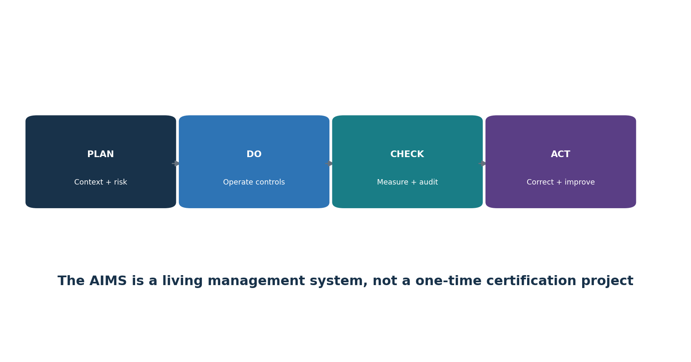
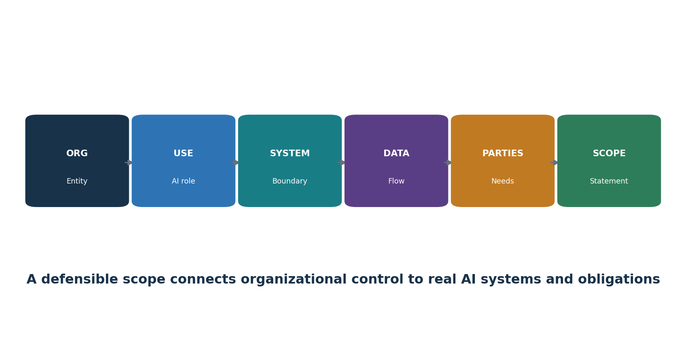
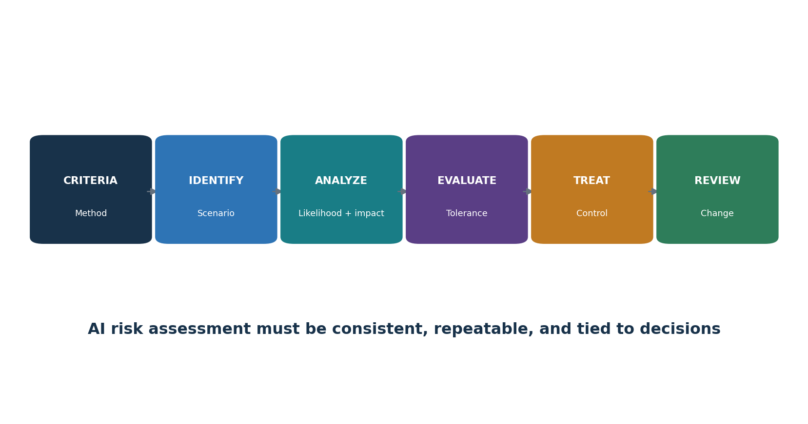
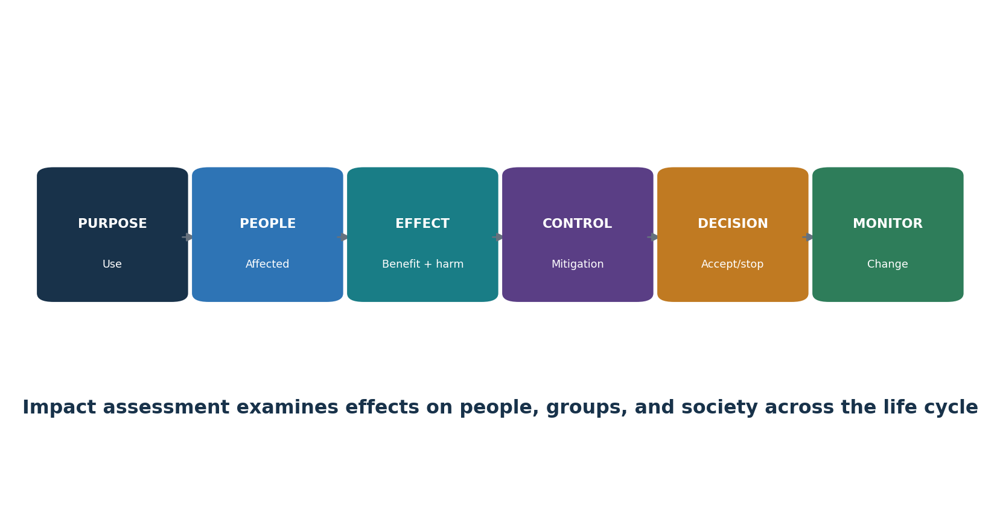
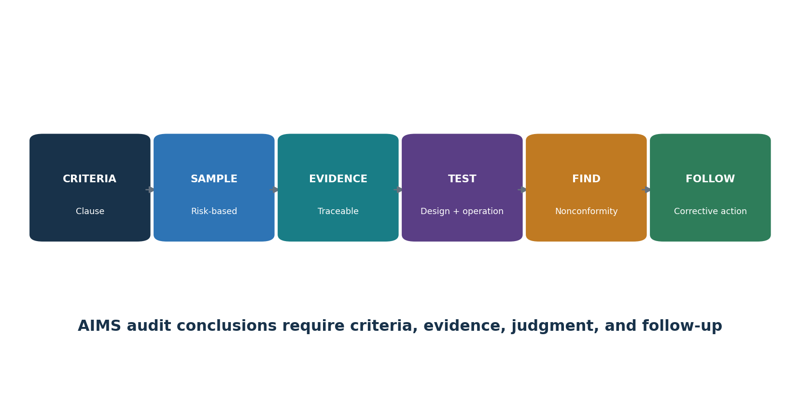

**ISO/IEC 42001:2023**

**AI MANAGEMENT SYSTEM**

Practical AIMS Manager and Junior Analyst Manual

| **What this manual does:** Explains how to establish, implement, operate, audit, certify, and improve an AI management system. It breaks down Clauses 4–10, all nine Annex A control groups, risk and impact assessment, the Statement of Applicability, certification, evidence, tools, manager decisions, and junior analyst work. |
|--------------------------------------------------------------------------------------------------------------------------------------------------------------------------------------------------------------------------------------------------------------------------------------------------------------------------------------|

**Alberto (Al) Leiva**

First Edition • July 2026

# Preface

ISO/IEC 42001 helps organizations govern AI through an organization-wide management system. It does not certify that every output is correct or that every AI system is safe. It requires leadership, context, risk-based planning, resources, operational controls, performance evaluation, corrective action, and continual improvement around the responsible development, provision, or use of AI systems.

This manual explains concepts in original language and does not reproduce the copyrighted standard. Obtain an authorized copy of ISO/IEC 42001:2023 and any standards used for implementation or audit. Certification, laws, sector duties, contracts, and technical risk must be evaluated against the organization’s actual scope and facts.

| **Current-information note:** Verified August 24, 2026. ISO/IEC 42001:2023 remains the published AIMS requirements standard. ISO/IEC 42005:2025 provides AI system impact-assessment guidance. ISO/IEC 42006:2025 adds requirements for bodies auditing and certifying AIMS. ISO 19011:2026 is the current management-system audit guideline. ISO/IEC 42003 remains an approved work item and ISO/IEC 42007 has advanced to draft international standard status; both remain under development and are not treated as requirements here. |
|----------------------------------------------------------------------------------------------------------------------------------------------------------------------------------------------------------------------------------------------------------------------------------------------------------------------------------------------------------------------------------------------------------------------------------------|

## How to use this manual

- AIMS leaders and managers: start with Chapters 1–10, 16–20, and 29–31.

- Implementers and GRC teams: study in order and use every template in Chapter 32.

- AI, data, product, security, privacy, and legal teams: focus on Chapters 6–15 and 20–28.

- Internal auditors: focus on Chapters 16–20 and 29, then practice the lab in Chapter 31.

- Junior analysts: learn the clause intent, produce evidence, write findings, and never claim certification or auditor authority you do not hold.

# Table of Contents

This file contains a true native Word table of contents plus a permanent page-numbered chapter guide.

*The permanent page-numbered chapter guide follows.*

# Chapter Guide

| **Chapter** | **Title**                                                              | **Starts on page** |
|-------------|------------------------------------------------------------------------|--------------------|
| 1           | ISO/IEC 42001 and the AI Management System                             | 5                  |
| 2           | AIMS Architecture and the Plan-Do-Check-Act Cycle                      | 6                  |
| 3           | Applicability, Organizational Roles, and Implementation Roadmap        | 7                  |
| 4           | Clause 4: Context of the Organization                                  | 9                  |
| 5           | Clause 5: Leadership                                                   | 10                 |
| 6           | Clause 6.1: Actions to Address Risks and Opportunities                 | 11                 |
| 7           | Clause 6.1.2: AI Risk Assessment                                       | 12                 |
| 8           | Clause 6.1.3: AI Risk Treatment and the Statement of Applicability     | 14                 |
| 9           | Clause 6.1.4: AI System Impact Assessment                              | 15                 |
| 10          | Clause 6.2 and 6.3: Objectives and Planning Changes                    | 17                 |
| 11          | Clause 7.1: Resources                                                  | 18                 |
| 12          | Clauses 7.2–7.4: Competence, Awareness, and Communication              | 19                 |
| 13          | Clause 7.5: Documented Information                                     | 20                 |
| 14          | Clause 8.1: Operational Planning and Control                           | 21                 |
| 15          | Clauses 8.2–8.4: Operational Risk, Treatment, and Impact Assessment    | 22                 |
| 16          | Clause 9.1: Monitoring, Measurement, Analysis, and Evaluation          | 23                 |
| 17          | Clause 9.2: Internal Audit                                             | 24                 |
| 18          | Clause 9.3: Management Review                                          | 26                 |
| 19          | Clause 10: Nonconformity, Corrective Action, and Continual Improvement | 27                 |
| 20          | Annexes A–D and the Statement of Applicability                         | 28                 |
| 21          | Annex A.2: Policies Related to AI                                      | 29                 |
| 22          | Annex A.3: Internal Organization                                       | 30                 |
| 23          | Annex A.4: Resources for AI Systems                                    | 31                 |
| 24          | Annex A.5 and ISO/IEC 42005: AI System Impact Assessment               | 32                 |
| 25          | Annex A.6: AI System Life Cycle                                        | 33                 |
| 26          | Annex A.7: Data for AI Systems                                         | 34                 |
| 27          | Annex A.8: Information for Interested Parties                          | 36                 |
| 28          | Annex A.9 and A.10: Responsible Use, Suppliers, and Customers          | 38                 |
| 29          | Certification, ISO/IEC 42006:2025, and Audit Readiness                 | 40                 |
| 30          | Open-Source AIMS Evidence and AI Assurance Tools                       | 42                 |
| 31          | Manager and Junior Analyst Playbook, Laboratory, and Interviews        | 47                 |
| 32          | Templates, Glossary, Index, and Official References                    | 51                 |

# 1. ISO/IEC 42001 and the AI Management System

*ISO/IEC 42001 specifies requirements for an organization to establish, implement, maintain, and continually improve an AI management system.*

| **Concept**       | **Plain meaning**                                                                                | **Evidence question**                                                |
|-------------------|--------------------------------------------------------------------------------------------------|----------------------------------------------------------------------|
| AIMS              | Interrelated policies, objectives, processes, roles, controls, and records for responsible AI    | Does the system operate across the defined scope?                    |
| Organization role | Developer/provider, deployer/user, supplier, customer, or several roles                          | Which responsibilities are controlled?                               |
| AI system         | People, data, models, software, infrastructure, processes, and interfaces used for an AI outcome | What is the complete boundary?                                       |
| Conformity        | Requirements are fulfilled within the certified scope                                            | What clause, implementation, evidence, and result support the claim? |
| Certification     | Independent third-party assessment of the AIMS against ISO/IEC 42001                             | What entity, scope, standard, body, dates, and status are certified? |

## 1.1 What certification does not prove

- It does not guarantee every AI output is accurate, unbiased, secure, lawful, safe, or explainable.

- It does not certify AI products individually unless the certificate’s AIMS scope and scheme explicitly support that claim.

- It does not replace product testing, legal analysis, impact assessment, privacy/security controls, domain validation, or human oversight.

- It does not transfer accountability from the organization to the certification body or supplier.

# 2. AIMS Architecture and the Plan-Do-Check-Act Cycle

*The AIMS follows the harmonized management-system structure and a continual Plan-Do-Check-Act cycle.*

Figure 1. AIMS Plan-Do-Check-Act cycle

| **PDCA stage** | **ISO/IEC 42001 work**                                                              | **Typical output**                                                      |
|----------------|-------------------------------------------------------------------------------------|-------------------------------------------------------------------------|
| Plan           | Context, leadership, risk/opportunity, assessment, treatment, objectives, resources | Scope, policy, methods, risk register, impact process, SoA, objectives  |
| Do             | Competence, communication, documentation, operational controls, assessments         | Procedures, system records, approvals, supplier and life-cycle evidence |
| Check          | Monitoring, measurement, analysis, internal audit, management review                | Metrics, evaluation, audit report, review decisions                     |
| Act            | Nonconformity, correction, root cause, corrective action, improvement               | Action records, effectiveness tests, updated risks/controls/objectives  |

## 2.1 Integrating with existing systems

- Reuse governance, document control, risk, audit, corrective action, supplier, security, privacy, quality, and continuity processes when their scope and controls fit AI risk.

- Create AI-specific additions for impact assessment, model/data lifecycle, responsible use, transparency, human oversight, and value-chain responsibilities.

- Keep one source of truth and map it to ISO/IEC 27001:2022, ISO 9001, privacy, legal, NIST AI RMF, and sector obligations rather than duplicating records.

# 3. Applicability, Organizational Roles, and Implementation Roadmap

*A useful implementation begins with organizational control, an accurate AI inventory, accountable roles, and a staged roadmap.*

Figure 2. Scope-building chain

| **Role**                                 | **Core responsibility**                                            |
|------------------------------------------|--------------------------------------------------------------------|
| Governing body / executives              | Oversight, direction, resources, risk appetite, material decisions |
| AIMS leader                              | Coordinate management system, performance, audits, improvement     |
| Business/AI system owner                 | Purpose, outcome, affected process, risk, approval, monitoring     |
| Model/data/product/engineering           | Requirements, design, data, evaluation, deployment, change         |
| Security/privacy/legal/compliance/safety | Specialist requirements, review, challenge, incidents              |
| Procurement/supplier manager             | Due diligence, allocation, contracts, evidence, monitoring, exit   |
| Internal audit                           | Independent, objective assessment without owning the controls      |

## 3.1 Implementation roadmap

- Authorize the program and obtain the standards; define purpose, sponsor, resources, and governance.

- Inventory AI systems and roles; conduct context and interested-party analysis; draft scope and policy.

- Define risk, impact, treatment, SoA, objectives, document, competence, communication, and operational processes.

- Implement Annex A and additional controls according to risk; collect evidence during real operation.

- Measure performance; complete internal audit and management review; correct nonconformities and verify effectiveness.

- Select a competent certification body; complete Stage 1 and Stage 2; maintain surveillance and improvement.

# 4. Clause 4: Context of the Organization

*Clause 4 establishes why the AIMS exists, who matters, what it covers, and how its processes interact.*

## 4.1 Internal and external issues

- Strategy, culture, governance, risk appetite, resources, competence, data maturity, technology architecture, existing management systems, and organizational change.

- Law, regulation, sector expectations, contracts, customer requirements, standards, public trust, societal concerns, markets, suppliers, threats, technology/model change, and climate-related issues where relevant to intended AIMS outcomes.

- Record why each issue is relevant, owner, effect on the AIMS, response, and review trigger.

## 4.2 Interested parties and requirements

- Identify people and groups affected by AI, even if they are not direct users or customers.

- Include regulators, customers, workers, users, data subjects, suppliers, partners, communities, shareholders, auditors, insurers, and the public as relevant.

- Separate needs/expectations from binding compliance obligations; record authority/source, system/process, owner, evidence, and change monitoring.

- Determine which requirements the organization will address through the AIMS.

## 4.3 Scope statement

| **Scope element**           | **Required clarity**                                              |
|-----------------------------|-------------------------------------------------------------------|
| Organization                | Legal entities, business units, locations, functions              |
| AI role                     | Developer/provider, deployer/user, service/supplier, combination  |
| Products/services/processes | AI-enabled offerings and internal uses                            |
| Technology and data         | Systems, models, environments, interfaces, key datasets           |
| Boundaries/dependencies     | Shared services, suppliers, customers, exclusions                 |
| Justification               | Why boundaries are valid and do not avoid applicable requirements |

## 4.4 AIMS processes

- Define process purpose, inputs, outputs, sequence, interaction, owner, criteria, controls, resources, records, measures, risks, and improvement.

- A process map should connect inventory, risk, impact, treatment, objectives, lifecycle, data, supplier, use, monitoring, incidents, audit, review, and corrective action.

# 5. Clause 5: Leadership

*Leadership must own the AIMS, policy, integration, resources, communication, performance, and accountable roles.*

## 5.1 Demonstrating leadership

- Make AIMS objectives compatible with strategy and responsible-AI commitments.

- Integrate AIMS requirements into business, product, procurement, data, technology, people, risk, and change processes.

- Provide competent people, time, tools, data, infrastructure, budget, independent challenge, and authority.

- Communicate that effective AI management and conformity matter, including when delivery pressure conflicts with controls.

- Review performance and support people who contribute to improvement or raise concerns.

- Ensure intended results are achieved rather than treating certification as the only outcome.

## 5.2 AI policy

- State purpose, principles, commitments to applicable requirements, risk-based responsible AI, objectives, and continual improvement.

- Match the organization’s AI roles, context, culture, impact, law, products, and risk appetite.

- Align security, privacy, quality, data, ethics, HR, procurement, product, records, safety, and incident policies.

- Approve at the right level, communicate it to relevant people, make it available as appropriate, and review it after planned intervals and material change.

## 5.3 Roles, responsibilities, authorities

- Define accountability for the AIMS and for reporting performance to top management.

- Assign owners for every AI system, risk, impact, data source, model, supplier, control, metric, incident, change, and corrective action.

- Define approval and escalation authority; prevent conflicts where the same team creates, validates, accepts, and audits high-impact risk without adequate challenge.

# 6. Clause 6.1: Actions to Address Risks and Opportunities

*Planning turns context into managed risks, opportunities, controls, objectives, and controlled change.*

## 6.1 Planning inputs

- Context and interested-party requirements; AIMS scope and processes.

- AI inventory, system roles, life-cycle stage, affected people, data, models, suppliers, integrations, and use conditions.

- Strategic benefits and opportunities, along with threats, failures, harms, uncertainty, and reasonably foreseeable misuse.

- Applicable legal, regulatory, contractual, security, privacy, safety, quality, records, accessibility, employment, IP, consumer, and sector obligations.

## 6.1.1 Risk and opportunity actions

- Plan actions proportionate to the effect on AIMS outcomes; integrate them into processes rather than keeping a separate register only.

- Define action, owner, resource, date, measure, evidence, dependency, residual decision, and effectiveness evaluation.

- Opportunities may include improved oversight, data quality, transparency, evaluation, competence, efficiency, stakeholder trust, and innovation.

- Prevent intended controls from creating new risks, such as excessive monitoring, inaccessible notices, or review overload.

# 7. Clause 6.1.2: AI Risk Assessment

*The AI risk-assessment process must use defined, repeatable criteria to identify, analyze, evaluate, and prioritize risk.*

Figure 3. AI risk-assessment workflow

## 7.1 Risk method

- Define scope, unit of analysis, risk categories, impact dimensions, likelihood, severity, scale, duration, reversibility, affected groups, uncertainty, aggregation, tolerance, and decision authority.

- Identify risk scenarios across intended use, foreseeable misuse, failure, attack, data, model, human behavior, suppliers, environment, law, and societal effect.

- Analyze inherent risk and existing controls with evidence; distinguish current, target, and residual risk.

- Evaluate against criteria; prioritize treatment based on people and business consequence, not a single technical score.

- Ensure consistent, valid, and comparable results and preserve the assessment as documented information.

- Reassess at planned intervals and after material changes, incidents, new affected groups, model/provider updates, drift, legal change, or control failure.

| **Risk record** | **Minimum detail**                                                                            |
|-----------------|-----------------------------------------------------------------------------------------------|
| Scenario        | Cause/actor, vulnerable condition, event/action, system behavior, affected party, consequence |
| Context         | Use, people, geography, scale, data, model/version, tools, supplier, assumptions              |
| Analysis        | Likelihood, impact dimensions, uncertainty, evidence, existing control effectiveness          |
| Treatment       | Avoid/reduce/share/accept, controls, owner, date, measure, residual risk                      |
| Decision        | Authorized approver, rationale, conditions, expiry, monitoring, review trigger                |

# 8. Clause 6.1.3: AI Risk Treatment and the Statement of Applicability

*Risk treatment selects controls, compares them to Annex A, produces the Statement of Applicability, and obtains residual-risk approval.*

## 8.1 Treatment process

- Choose treatment options: avoid, change/reduce, share/transfer, accept within authority, or conduct a tightly limited pilot to reduce uncertainty.

- Determine necessary controls from legal and contractual requirements, AI risk and impact results, architecture, stakeholders, and objectives.

- Compare selected controls with Annex A to check that no relevant reference control was overlooked.

- Add controls beyond Annex A when needed for security, privacy, safety, quality, technical evaluation, accessibility, resilience, or sector obligations.

- Create and approve a treatment plan and obtain authorization for residual risk.

- Preserve treatment results and changes as controlled documented information.

## 8.2 Statement of Applicability fields

| **Field**               | **Purpose**                                                        |
|-------------------------|--------------------------------------------------------------------|
| Control reference/title | Annex A or additional control identity                             |
| Applicable?             | Included or excluded for the defined AIMS scope                    |
| Justification           | Risk, obligation, objective, architecture, or reason for exclusion |
| Implementation          | Policy/process/system and accountable owner                        |
| Status                  | Implemented, partial, planned, not applicable                      |
| Evidence/test           | Current proof and operating-effectiveness result                   |
| Dependencies/gaps       | Supplier/customer/shared controls and findings                     |
| Review                  | Last/next review and change triggers                               |

| **SoA warning:** The Statement of Applicability is not a copied checklist. It must agree with the current scope, risk and impact assessments, treatment plan, real implementation, evidence, and risk decisions. |
|------------------------------------------------------------------------------------------------------------------------------------------------------------------------------------------------------------------|

# 9. Clause 6.1.4: AI System Impact Assessment

*AI system impact assessment examines how an AI system may affect individuals, groups, and society throughout its life cycle.*

Figure 4. AI system impact assessment

## 9.1 Impact-assessment process

- Define triggers, scope, roles, independence, methods, affected-party engagement, approval, retention, review, and relationship to risk treatment and decisions.

- Describe purpose, users, affected people, decisions/content, degree of automation, alternatives, data, model, suppliers, geography, scale, duration, and prohibited/foreseeable uses.

- Identify intended benefits and adverse impacts on rights, fairness, privacy, safety, security, health, accessibility, employment, finance, children/vulnerable groups, environment, culture, public services, democracy, and social/economic conditions as relevant.

- Consider direct, indirect, cumulative, delayed, reversible/irreversible, individual, group, and societal impacts.

- Evaluate likelihood, severity, scale, duration, reversibility, distribution, uncertainty, and affected-party views.

- Select mitigations, human oversight, notices, choices, redress, monitoring, thresholds, and stop criteria; obtain accountable approval.

- Update before major change and after incidents, complaints, new evidence, drift, or expansion of use.

## 9.2 Risk assessment versus impact assessment

| **Risk assessment**                                                                   | **Impact assessment**                                                                         |
|---------------------------------------------------------------------------------------|-----------------------------------------------------------------------------------------------|
| Manages uncertainty affecting objectives, including organization, people, and society | Focuses specifically on potential effects of an AI system on individuals, groups, and society |
| Can aggregate portfolio and process risk                                              | Must stay connected to the particular system/use and affected context                         |
| Feeds treatment, controls, and residual acceptance                                    | Feeds design, deployment, use, transparency, oversight, redress, and monitoring               |
| Both must exchange findings and remain consistent                                     | Both require documented methods, evidence, decisions, and review                              |

# 10. Clause 6.2 and 6.3: Objectives and Planning Changes

*Objectives translate policy and risk decisions into measurable results; changes must be planned and controlled.*

## 10.1 Objective record

- Objective and intended result, connected policy/risk/requirement and scope.

- Measure, calculation, data source, population, baseline, target, threshold, frequency, owner, reporting, and limitation.

- Actions, resources, responsibilities, schedule, dependencies, evidence, and evaluation method.

- Response when performance misses the target; reassessment when the metric creates harmful incentives.

| **Objective example**         | **Better measure**                                                                                                          |
|-------------------------------|-----------------------------------------------------------------------------------------------------------------------------|
| Complete AI inventory         | Active systems with validated owner, use, data/model/provider, risk tier, assessment and status ÷ reconciled active systems |
| Improve assessment timeliness | Median and overdue days from intake/material change to approved risk and impact decision by tier                            |
| Strengthen evaluation         | High-impact systems meeting defined production-like acceptance thresholds, including subgroup and severe-failure views      |
| Improve supplier control      | Critical AI suppliers with current scoped review, contract duties, evidence and closed material gaps ÷ critical suppliers   |
| Improve remediation           | Findings corrected and effectiveness-retested within risk-based target, with exception age and impact                       |

## 10.2 Planning AIMS changes

- Define purpose, consequences, integrity of the AIMS, resources, responsibilities, timeline, transition, communication, evidence, and rollback.

- Triggers include scope, entity, product, use, model, data, supplier, law, certification, process, organization, tooling, audit method, and objectives.

# 11. Clause 7.1: Resources

*The organization must determine and provide resources needed to establish, operate, evaluate, and improve the AIMS.*

| **Resource**   | **Examples**                                                                            | **Evidence**                                                        |
|----------------|-----------------------------------------------------------------------------------------|---------------------------------------------------------------------|
| People         | AIMS, domain, data, ML, product, security, privacy, legal, safety, audit, human factors | Capacity plan, roles, competence, independence, workload            |
| Data           | Training/validation/test/production, labels, metadata, rights, reference sets           | Inventory, lineage, quality, access, retention, provenance          |
| Tools          | Development, annotation, evaluation, monitoring, security, documentation                | Approved inventory, versions, validation, access, support           |
| Compute/system | Cloud/on-prem/edge, storage, network, registry, logging, sandbox                        | Architecture, ownership, capacity, resilience, environmental impact |
| Finance/time   | Budget, evaluation cost, supplier review, stakeholder engagement, remediation           | Plans, approvals, actuals, constraints, decisions                   |

## 11.1 Resource decisions

- Match resource depth to scope, risk, system complexity, scale, legal duties, and affected people.

- Separate development, validation, approval, and audit enough to manage conflicts of interest.

- Monitor reviewer overload, evaluation coverage, data gaps, supplier limits, expiring licenses, model deprecation, and technical debt.

- Document accepted constraints and their effect on objectives and residual risk.

# 12. Clauses 7.2–7.4: Competence, Awareness, and Communication

*Competence, awareness, and communication make policies and controls usable in real decisions.*

## 12.1 Competence

- Define required education, training, skill, experience, independence, behavior, and authority by role and risk tier.

- Evaluate current competence; provide training, mentoring, supervised practice, specialist support, or reassignment.

- Assess effectiveness through observation, work-product review, scenario exercise, test, and outcomes—not attendance alone.

- Retain evidence and reassess after role, system, risk, law, method, or incident change.

## 12.2 Awareness

- People understand policy, their contribution, benefits of improved performance, consequences of nonconformity, concerns channel, and escalation.

- Users understand approved/prohibited use, data restrictions, verification, human oversight, limitations, incident/complaint handling, and stop conditions.

## 12.3 Communication plan

| **Field**      | **Question**                                                                         |
|----------------|--------------------------------------------------------------------------------------|
| What           | Policy, system/use, limits, impacts, incidents, results, changes, duties             |
| Why/audience   | Decision maker, worker, user, affected person, customer, supplier, regulator, public |
| When           | Lifecycle gate, planned interval, incident, complaint, change, legal trigger         |
| How            | Training, notice, system card, report, contract, dashboard, meeting, alert           |
| Owner/approval | Who prepares, validates, approves, delivers, and records?                            |
| Feedback       | How are questions, accessibility, understanding, concerns, and correction handled?   |

# 13. Clause 7.5: Documented Information

*Documented information must be controlled enough to be trustworthy, findable, protected, current, retained, and usable.*

## 13.1 Document-control lifecycle

- Create/identify: title, owner, ID, version, date, format, classification, scope, related system/model/data, and approval.

- Review/approve: competent reviewer, conflicts, criteria, comments, disposition, and authorization.

- Publish/use: correct audience, access, training, effective date, point-of-use availability, and withdrawal of obsolete versions.

- Change: reason, affected requirements/processes/systems, approvals, version history, transition, and rollback.

- Protect: confidentiality, integrity, availability, privacy, security, backup, recovery, and evidence preservation.

- Retain/dispose: legal/business period, holds, archive, deletion, supplier copies, derived data, and verification.

| **Required/important records** | **Example**                                                                            |
|--------------------------------|----------------------------------------------------------------------------------------|
| AIMS foundation                | Context, interested parties, scope, policy, process map, roles                         |
| Planning                       | Risk method/assessment, treatment, SoA, impact process/records, objectives, changes    |
| Operations                     | AI inventory, resources, lifecycle, data, supplier/use, communication, incidents       |
| Evaluation                     | Metrics, analysis, internal audit, management review                                   |
| Improvement                    | Nonconformity, correction, root cause, corrective action, effectiveness                |
| System traceability            | Model/data/prompt/tool/configuration versions, approvals, evaluations, logs, decisions |

# 14. Clause 8.1: Operational Planning and Control

*Operational planning turns AIMS requirements into repeatable controls for AI intake, design, acquisition, deployment, use, change, incident, and retirement.*

## 14.1 Operational control

- Define criteria and controls for processes; operate them as planned; retain enough evidence to prove performance.

- Control planned changes and review unintended changes; reduce adverse effects.

- Control externally provided processes, products, and services according to risk and responsibility.

- Use risk tiers and lifecycle gates to match review, independence, testing, approval, monitoring, and escalation to impact.

| **Gate**        | **Required decision evidence**                                                                    |
|-----------------|---------------------------------------------------------------------------------------------------|
| Intake          | Purpose, owner, AI role, affected people, data, supplier, preliminary risk, prohibited-use check  |
| Design/acquire  | Requirements, risk/impact, architecture, resources, data, supplier duties, controls, tests        |
| Build/configure | Versions, lineage, secure development, documentation, evaluation readiness                        |
| Validate        | Representative tests, thresholds, failures, independent challenge, limitations, corrective action |
| Deploy          | Approval, conditions, user information, oversight, monitoring, incident, rollback, support        |
| Operate/change  | Performance, drift, complaints, incidents, provider changes, regression, reassessment             |
| Retire          | Replacement, user/party communication, access, integrations, data, models, records, deletion      |

# 15. Clauses 8.2–8.4: Operational Risk, Treatment, and Impact Assessment

*The organization must execute risk assessment, risk treatment, and impact assessment at planned intervals and when significant change occurs.*

## 15.1 Operational triggers

- New or changed AI system, intended use, affected population, geography, scale, automation, decision authority, model, data, prompt, tool, integration, supplier, or infrastructure.

- New law, contract, incident, complaint, audit finding, vulnerability, threat intelligence, safety concern, drift, evaluation failure, unexpected impact, or supplier notice.

- Changes to risk criteria, objectives, controls, monitoring, organizational ownership, certification scope, or resource capacity.

## 15.2 Operational evidence

- Current approved assessment linked to exact system/model/data/configuration/use version.

- Treatment plan and SoA agree with implemented controls, gaps, exceptions, residual approval, and monitoring.

- Impact assessment includes affected parties, direct/indirect and societal effects, mitigations, redress, and review triggers.

- Actions are integrated into product, data, security, privacy, supplier, user, incident, and change workflows.

- Results and changes are retained as controlled documented information.

# 16. Clause 9.1: Monitoring, Measurement, Analysis, and Evaluation

*Performance evaluation determines whether the AIMS and its controls achieve intended results.*

## 16.1 Measurement design

- Decide what to monitor/measure, methods, timing, responsibility, acceptance criteria, analysis, evaluation, reporting, and retention.

- Verify data sources, definitions, populations, completeness, accuracy, time, access, transformations, and limitations.

- Use leading and lagging indicators across governance, risk, impact, lifecycle, data, supplier, use, complaints, incidents, audit, and improvement.

- Avoid averages that hide severe failures or subgroup effects; combine quantitative and qualitative evidence.

- Evaluate trends and causes, compare to objectives, and create decisions/actions when thresholds are missed.

| **AIMS measure**                    | **Decision enabled**                                            |
|-------------------------------------|-----------------------------------------------------------------|
| Inventory/control coverage          | Unknown or unowned AI use and assessment gaps                   |
| Risk/impact age and change coverage | Whether decisions remain current after system/context change    |
| Evaluation results                  | Release, restriction, redesign, rollback, or added oversight    |
| Complaints/incidents/redress        | People impacts, recurrence, communication and corrective action |
| Supplier changes/evidence           | Reassessment, contract action, alternative, or exit             |
| Audit/nonconformity aging           | Control weakness, root cause, resource and management attention |

# 17. Clause 9.2: Internal Audit

*Internal audit provides independent, risk-based evidence that the AIMS conforms and operates effectively.*

Figure 5. AIMS audit chain

## 17.1 Audit program

- Define objectives, scope, frequency, methods, responsibilities, planning, criteria, reporting, follow-up, resources, risks, and records.

- Prioritize high-impact systems, new models/use, weak controls, incidents, complaints, changes, suppliers, prior findings, and stale evidence.

- Select auditors for management-system and AI-domain competence, objectivity, confidentiality, communication, and independence.

- Use interviews, document review, observation, trace-through, data analysis, sampling, reperformance, and safe technical demonstration.

- Report results to relevant management and ensure correction/corrective action and effectiveness follow-up.

## 17.2 Audit workpaper

| **Field**    | **Example**                                                               |
|--------------|---------------------------------------------------------------------------|
| Criteria     | Exact clause/control, internal procedure, law/contract as applicable      |
| Scope/sample | Process, AI system/version, period, population, selection rationale       |
| Evidence     | Source, owner, date, version, query, observation, reliability             |
| Test/result  | Design and operation, expected versus observed, exceptions                |
| Conclusion   | Conforms, opportunity, observation, or nonconformity with objective basis |
| Follow-up    | Correction, root cause, corrective action, owner/date, effectiveness      |

# 18. Clause 9.3: Management Review

*Management review ensures top management evaluates suitability, adequacy, effectiveness, direction, resources, and improvement.*

## 18.1 Inputs

- Status of actions from prior reviews and changes in internal/external issues or interested-party requirements.

- AIMS performance and trends: objectives, nonconformities/corrective actions, monitoring/measurement, internal audits, and relevant external assurance.

- Risk and impact assessment results, treatment status, SoA changes, incidents, complaints, concerns, redress, supplier and legal changes.

- Adequacy of resources, competence, independence, infrastructure, data, tools, and budget.

- Opportunities for continual improvement and strategic alignment.

## 18.2 Outputs

- Decisions and actions about improvement, changes to AIMS scope/policy/objectives/processes/controls, resource needs, risk decisions, and strategic direction.

- For each action: rationale, owner, due date, resources, expected result, measure, dependency, escalation, and follow-up.

- Retain agenda, materials, attendees/authority, discussion, decisions, dissent/concerns, actions, and closure evidence.

| **Avoid the slide-deck review:** Management review is a decision process. A dashboard presentation without challenges, risk decisions, resource commitments, actions, and follow-up is weak evidence. |
|-------------------------------------------------------------------------------------------------------------------------------------------------------------------------------------------------------|

# 19. Clause 10: Nonconformity, Corrective Action, and Continual Improvement

*Improvement corrects problems, removes causes, checks effectiveness, and strengthens the AIMS as risk and technology change.*

## 19.1 Corrective-action method

- React to nonconformity; control/correct it; address consequences, affected people, decisions, data, systems, and communications.

- Evaluate cause and recurrence: review evidence, determine why controls failed or were bypassed, and find similar conditions elsewhere.

- Implement proportionate action with owner, date, resources, interim protection, change control, and risk/impact reassessment.

- Review effectiveness using defined evidence after enough operation; do not close based only on a new document.

- Update risks, impacts, controls, objectives, competence, supplier terms, monitoring, audit program, and documented information as needed.

- Retain nature of nonconformity, actions, and effectiveness results.

| **Weak response**    | **Stronger response**                                                                                        |
|----------------------|--------------------------------------------------------------------------------------------------------------|
| Retrain the employee | Examine unclear process, workload, incentives, interface, access, approval and monitoring; fix system causes |
| Update policy        | Change workflow/control, communicate, train, test operation, monitor recurrence                              |
| Supplier will fix    | Track contract, mitigation, customer control, deadline, test, residual risk, alternative/exit                |
| Finding closed       | Evidence correction plus root-cause action and effectiveness review across similar scope                     |

# 20. Annexes A–D and the Statement of Applicability

*Annex A is a reference set of 38 controls in nine groups; Annex B gives guidance, Annex C provides AI objective/risk-source ideas, and Annex D supports sector/domain use.*

| **Group** | **Theme**                              | **Controls** | **Implementation focus**                                                                                                                       |
|-----------|----------------------------------------|--------------|------------------------------------------------------------------------------------------------------------------------------------------------|
| A.2       | Policies related to AI                 | 3            | Policy, alignment with other policies, and planned/event-driven review.                                                                        |
| A.3       | Internal organization                  | 2            | AI roles and responsibilities plus a protected concern-reporting process.                                                                      |
| A.4       | Resources for AI systems               | 5            | Document data, tools, system/compute, and human resources across the life cycle.                                                               |
| A.5       | Assessing impacts of AI systems        | 4            | A repeatable process, records, impacts on people/groups, and societal impacts.                                                                 |
| A.6       | AI system life cycle                   | 9            | Responsible-development objectives and processes, requirements, design records, V&V, deployment, operation, technical documentation, and logs. |
| A.7       | Data for AI systems                    | 5            | Data management, acquisition, quality, provenance, and preparation.                                                                            |
| A.8       | Information for interested parties     | 4            | User information, external reporting, incident communication, and other stakeholder information.                                               |
| A.9       | Use of AI systems                      | 3            | Responsible-use process and objectives plus adherence to intended use.                                                                         |
| A.10      | Third-party and customer relationships | 3            | Responsibility allocation, supplier governance, and customer obligations.                                                                      |

## 20.1 How the annexes work

- Clauses 4–10 contain the certifiable management-system requirements.

- Annex A supplies reference control objectives and controls to consider during risk treatment; it is not a universal checklist.

- Annex B provides implementation guidance for the Annex A controls without adding requirements.

- Annex C offers examples of AI objectives and risk sources that can support planning and assessment.

- Annex D explains how the AIMS can be used across domains and sectors.

- The organization may select additional controls; the SoA explains applicability and implementation.

# 21. Annex A.2: Policies Related to AI

*Annex A.2 establishes a coherent AI policy framework that is aligned, approved, communicated, and reviewed.*

## 21.1 Control implementation

- Create an AI policy appropriate to the organization’s roles, purpose, context, risk, impact, and responsible-AI commitments.

- Align it with security, privacy, data, quality, product, HR, procurement, legal, records, safety, accessibility, incident, and communication policies.

- Resolve contradictions such as an innovation goal that encourages unapproved tools or a retention policy that conflicts with traceability.

- Approve at appropriate management level; communicate to relevant people and parties; connect to objectives, procedures, controls, training, and enforcement.

- Review on schedule and after law, technology, business, scope, incident, audit, complaint, supplier, or material system change.

| **Evidence**           | **Test**                                                                     |
|------------------------|------------------------------------------------------------------------------|
| Approved AI policy     | Verify scope, commitments, authority, effective date, availability and owner |
| Policy map             | Trace AI requirements to related policies and resolved conflicts             |
| Communication/training | Sample roles; verify understanding and practical workflow                    |
| Review record          | Check inputs, changes, decision, approval and follow-through                 |

# 22. Annex A.3: Internal Organization

*Annex A.3 assigns AI responsibilities and creates a protected way to report concerns.*

## 22.1 Roles and responsibilities

- Define lifecycle and management-system accountability for each AI system and shared service.

- Assign business outcome, AI/model, data, product, security, privacy, legal, impact, human oversight, supplier, incident, audit, and residual-risk roles.

- Define approval and escalation authority, deputies, conflicts, segregation, and emergency decisions.

- Update roles after organization, employment, supplier, system, scope, or risk change; remove access promptly.

## 22.2 Reporting concerns

- Provide accessible internal and external channels, confidentiality/anonymity where appropriate, non-retaliation, triage, investigation, protection, escalation, feedback, and records.

- Accept concerns about unsafe use, bias, rights, privacy, security, data, misleading output, hidden AI, supplier behavior, pressure to bypass controls, or retaliation.

- Measure awareness, accessibility, response, recurrence, overdue cases, and corrective action without exposing reporters.

| **Concern channels are controls:** A channel is ineffective if people do not know it exists, fear retaliation, cannot report externally affected harm, or never receive evidence that concerns are investigated and corrected. |
|--------------------------------------------------------------------------------------------------------------------------------------------------------------------------------------------------------------------------------|

# 23. Annex A.4: Resources for AI Systems

*When Annex A.4 controls are selected through the organization's risk-treatment process and Statement of Applicability, implementation should maintain visibility into the data, tools, systems and computing resources, and people needed across the AI life cycle.*

| **Resource record** | **Details**                                                                                                  |
|---------------------|--------------------------------------------------------------------------------------------------------------|
| Data                | Source, owner, purpose, rights, sensitivity, people, quality, bias, version, lineage, retention, location    |
| Tooling             | Algorithms, frameworks, packages, models, prompts, evaluation, annotation, orchestration, versions, support  |
| System/compute      | Cloud/on-prem/edge, accounts, environments, storage, network, GPUs, capacity, resilience, energy/environment |
| Human               | Role, organization/supplier, competence, independence, access, workload, decision authority                  |
| Dependencies        | Provider, subprocessor, API, identity, monitoring, content filter, vector store, business process            |

## 23.1 Resource documentation workflow

- Connect resources to exact AI systems, lifecycle stages, owners, risk/impact assessments, supplier records, versions, and change history.

- Reconcile resource inventories to code, model registries, data catalogs, cloud/API billing, identity, network, procurement, and interviews.

- Identify unapproved/shadow resources, unsupported components, missing competence, capacity limits, common dependencies, and environmental effects.

- Use the record for reproducibility, incident response, change assessment, recovery, supplier exit, and retirement.

# 24. Annex A.5 and ISO/IEC 42005: AI System Impact Assessment

*Annex A.5 operationalizes impact assessment; ISO/IEC 42005:2025 supplies complementary current guidance.*

## 24.1 Four control outcomes

- A defined, repeatable AI system impact-assessment process with triggers, roles, methods, lifecycle integration, approval, and review.

- Controlled documentation of assessments, assumptions, evidence, affected parties, impacts, mitigations, decisions, and changes.

- Specific evaluation of impacts on individuals and groups, including fairness, rights, privacy, safety, health, accessibility, financial/employment effects, vulnerable people, human oversight, and redress as relevant.

- Evaluation of broader societal effects such as public safety, environment, economy, culture, democratic processes, misinformation, labor, market concentration, and deliberate misuse as relevant.

## 24.2 Assessment quality checks

- Affected people/groups are identified beyond direct users and customers.

- Benefits and harms are both evaluated, including distribution and alternatives.

- The method considers scale, duration, reversibility, cumulative and indirect effects, uncertainty, and foreseeable misuse.

- Stakeholder engagement is meaningful, accessible, documented, and protected.

- Mitigations become owned requirements, tests, notices, oversight, monitoring, redress, and stop criteria.

- Assessment version matches the deployed system/use and is updated after material change.

# 25. Annex A.6: AI System Life Cycle

*Annex A.6 connects responsible-development objectives to requirements, design, testing, deployment, operation, documentation, and event logging.*

Figure 6. Responsible AI system life cycle

| **Life-cycle area**            | **Implementation evidence**                                                                                            |
|--------------------------------|------------------------------------------------------------------------------------------------------------------------|
| Responsible objectives/process | Fairness, safety, privacy, transparency, security, robustness and other relevant measurable goals; lifecycle procedure |
| Requirements/specification     | Purpose, functional and nonfunctional criteria, affected people, data, model, human oversight, limits, obligations     |
| Design/development records     | Architecture, decisions, alternatives, assumptions, components, threats, interfaces, provenance, reviews               |
| Verification/validation        | Methods, evaluation data, scorers, thresholds, severe failures, subgroup/edge/adversarial tests, limitations           |
| Deployment                     | Release approval, environment, configuration, user information, migration, monitoring, rollback                        |
| Operation/monitoring           | Performance, drift, security, safety, impact, complaints, changes, support, repair, updates                            |
| Technical documentation/logs   | Audience-appropriate instructions plus traceable events for audit, incidents, decisions, and improvement               |

## 25.1 Change and retirement

- Version model, data, prompts, retrieval, tools, code, infrastructure, policies, evaluation, approvals, and monitoring.

- Define material-change triggers and regression scope; deploy gradually with rollback.

- Retire users, identities, integrations, endpoints, models, datasets, indexes, logs, documentation, contracts, and provider copies according to obligations; preserve required records.

# 26. Annex A.7: Data for AI Systems

*When Annex A.7 controls are selected through the organization's risk-treatment process and Statement of Applicability, implementation should govern data acquisition, quality, provenance, and preparation for AI development, enhancement, and operation.*

Figure 7. AI data evidence chain

## 26.1 Data controls

- Define data-management requirements for privacy, security, representativeness, explainability, provenance, accuracy, integrity, availability, retention, and deletion as relevant.

- Document acquisition/selection: source, method, people/population, rights/license, prior purpose, consent/authority where applicable, metadata, date, restrictions, and known bias.

- Set use-specific quality criteria and thresholds for accuracy, completeness, consistency, currency, uniqueness, validity, representativeness, labels, and subgroup coverage.

- Preserve provenance through creation, acquisition, transfer, transformation, labeling, augmentation, filtering, versioning, validation, use, sharing, correction, and deletion.

- Document preparation methods, code/tool/version, parameters, people, quality checks, rationale, outputs, and reproducibility.

- Separate and protect training, validation, test, production, monitoring, and incident datasets; prevent evaluation-set leakage.

| **Data evidence**   | **Test**                                                                       |
|---------------------|--------------------------------------------------------------------------------|
| Dataset/data card   | Trace purpose, population, fields, source, rights, quality, limitations, owner |
| Lineage             | Reproduce source-to-feature transformations and version                        |
| Quality result      | Verify full population/sample, rules, failures, correction and approval        |
| Access/retention    | Sample grants, reviews, removals, use, copies, deletion                        |
| Bias/representation | Check relevant groups, history, proxies, labels, gaps and mitigation           |

# 27. Annex A.8: Information for Interested Parties

*When Annex A.8 controls are selected through the organization's risk-treatment process and Statement of Applicability, implementation should provide useful information for users and interested parties, together with reporting and incident communication.*

Figure 8. Interested-party information

## 27.1 Information package

- Users: intended purpose, capabilities, limitations, expected input/output, prohibited use, verification, human oversight, monitoring, escalation, and support.

- Affected people: that AI is used where appropriate, role in the decision, important factors/limitations, data and rights, human review, correction, appeal, complaint, and redress.

- Customers/partners: responsibilities, configuration, data, control dependencies, evidence, incidents, changes, support, and exit.

- Regulators/auditors: controlled documentation, scope, assessments, controls, test results, incidents, changes, findings, and corrective action as required.

- Public: proportionate transparency, significant impacts, governance, safety information, contact, and reports where appropriate.

## 27.2 External reporting and incidents

- Provide accessible channels to report errors, harm, bias, security/privacy concerns, misuse, accessibility problems, or unexpected effects.

- Define triage, severity, investigation, protection, feedback, correction, redress, escalation, retention, and trend analysis.

- Predefine incident audiences, content, owner/spokesperson, legal review, timing, channel, accessibility, coordination, updates, and closure.

- Do not over-disclose security-sensitive or personal information; do not hide material limitations behind confidentiality.

# 28. Annex A.9 and A.10: Responsible Use, Suppliers, and Customers

*Annex A.9 governs responsible use and intended purpose; Annex A.10 allocates duties across suppliers, customers, and the AI value chain.*

Figure 9. Third-party AI life cycle

## 28.1 Responsible use

- Define approved and prohibited uses, users, data, outputs, decisions, autonomy, verification, human oversight, logging, support, incident, and stop conditions.

- Set measurable responsible-use objectives tied to relevant impacts and risk.

- Train users and supervisors; enforce through identity, configuration, interfaces, policy, monitoring, review, and consequences.

- Detect scope creep and require reassessment before repurposing, expansion, new populations, higher impact, or new integrations/tools.

## 28.2 Third parties and customers

- Map developer/provider/deployer, data/model/tool/cloud suppliers, integrators, human services, customers, users, and affected parties.

- Allocate responsibility for data, requirements, testing, configuration, transparency, human oversight, security, incidents, monitoring, change, evidence, rights, deletion, and exit.

- Perform risk-based due diligence and contracting; verify model/system documentation, evaluation, security/privacy assurance, data terms, IP, support, vulnerabilities, changes, subprocessors, resilience, and portability.

- Monitor provider model/terms/training/retention/subprocessor/incidents/deprecation changes and reassess promptly.

- Define customer obligations and support; do not use customer responsibility as a vague transfer of provider duties.

# 29. Certification, ISO/IEC 42006:2025, and Audit Readiness

*Certification evaluates the AIMS against ISO/IEC 42001 within a defined scope; ISO/IEC 42006:2025 strengthens requirements for certification bodies.*

## 29.1 Certification path

- Select a competent certification body and verify its accreditation/status, scheme, geography, competence, impartiality, scope capability, and contract.

- Application and planning: organization, AIMS scope, roles, sites, people, systems, complexity, outsourced processes, standards, and audit time.

- Stage 1: readiness, scope, documented system, context, risk/impact methods, SoA, internal audit, management review, and Stage 2 preparedness.

- Stage 2: implementation and operating effectiveness through interviews, samples, records, observation, and trace-through.

- Resolve nonconformities with correction, cause, corrective action, and effectiveness evidence under scheme rules.

- Certification decision, certificate, surveillance, scope changes, recertification, suspension/withdrawal, and ongoing improvement.

## 29.2 ISO/IEC 42006:2025 significance

- It adds AIMS-specific requirements for bodies that audit and certify against ISO/IEC 42001 and builds on ISO/IEC 17021-1.

- It supports appropriate competence, consistent audit processes, impartiality, audit time, and rigor for organizations that develop, provide, or use AI systems.

- The organization should verify that a claimed certification is issued under a relevant accredited scheme and that certificate scope and status match the claim.

| **Audit evidence pack** | **Examples**                                                                                |
|-------------------------|---------------------------------------------------------------------------------------------|
| Foundation              | Scope, context, parties, policy, process map, roles, inventory                              |
| Planning                | Risk method/results, treatment, SoA, impact process/results, objectives, changes            |
| Support/operation       | Resources, competence, communication, documents, lifecycle, data, use, suppliers, incidents |
| Evaluation/improvement  | Metrics, internal audit, management review, findings, corrective actions, effectiveness     |
| Trace samples           | End-to-end records for representative high/medium/low-risk AI systems and material changes  |

## 29.3 Audit readiness without theater

- Operate controls long enough to produce honest evidence; do not create records after the fact.

- Reconcile scope, inventory, risk, impact, SoA, supplier, system versions, metrics, audit, and management review.

- Train interviewees to explain their real work and show evidence, not memorize answers.

- Disclose gaps, accepted risk, limitations, incidents, and corrective action accurately.

# 30. Open-Source AIMS Evidence and AI Assurance Tools

*Open-source tools can support traceability, evaluation, monitoring, policy, privacy, and findings, but they do not decide ISO conformity.*

| **Tool**           | **Purpose**                                                                    |
|--------------------|--------------------------------------------------------------------------------|
| MLflow             | Experiment tracking, model registry, lineage, approval, and deployment records |
| DVC                | Version control for data, models, and pipelines                                |
| OpenLineage        | Open standard and tooling for data/job lineage events                          |
| OpenMetadata       | Data catalog, lineage, ownership, glossary, and quality metadata               |
| Great Expectations | Automated data-quality expectations and validation results                     |
| Evidently          | Data quality, drift, model performance, and monitoring reports                 |
| Deepchecks         | Testing for data, ML models, and LLM applications                              |
| Giskard            | AI testing and vulnerability scanning                                          |
| Promptfoo          | Prompt, model, RAG, and red-team evaluations                                   |
| Garak              | LLM vulnerability scanning and probes                                          |
| PyRIT              | Risk identification and red-team orchestration for generative AI               |
| Inspect AI         | Reproducible AI evaluations                                                    |
| Presidio           | Detection and de-identification of personal information                        |
| ModelScan          | Static scanning of serialized model files                                      |
| CycloneDX          | Software, ML, and AI bill-of-materials formats and tools                       |
| Open Policy Agent  | Policy-as-code decisions                                                       |
| DefectDojo         | Finding intake, deduplication, ownership, remediation, and retest              |
| Langfuse           | Open-source LLM tracing, prompt management, and evaluation                     |

| **Tool governance:** Use only authorized systems, models, accounts, repositories, and data. Start with isolated environments and synthetic data. Protect credentials, prompts, outputs, traces, personal information, and findings. Record versions and validate automated results. |
|-------------------------------------------------------------------------------------------------------------------------------------------------------------------------------------------------------------------------------------------------------------------------------------|

## 30.1 MLflow

Purpose: Experiment tracking, model registry, lineage, approval, and deployment records. Official project: [<u>MLflow</u>](https://mlflow.org/)

Safe quick start: Create a local project; log parameters, dataset reference, metrics, artifacts, owner, and approval; register only a tested model; restrict registry changes.

AIMS evidence: authority/scope, system/model/data versions, identity, tool/version/configuration, criteria/thresholds, date, source population, result, human validation, limitations, finding, owner/action, approval, and retest.

## 30.2 DVC

Purpose: Version control for data, models, and pipelines. Official project: [<u>DVC</u>](https://dvc.org/)

Safe quick start: Use a synthetic dataset in a training repository; version data and pipeline stages; reproduce a run; protect remote storage and credentials.

AIMS evidence: authority/scope, system/model/data versions, identity, tool/version/configuration, criteria/thresholds, date, source population, result, human validation, limitations, finding, owner/action, approval, and retest.

## 30.3 OpenLineage

Purpose: Open standard and tooling for data/job lineage events. Official project: [<u>OpenLineage</u>](https://openlineage.io/)

Safe quick start: Instrument a small lab pipeline; record dataset and job relationships; check event completeness; protect sensitive metadata.

AIMS evidence: authority/scope, system/model/data versions, identity, tool/version/configuration, criteria/thresholds, date, source population, result, human validation, limitations, finding, owner/action, approval, and retest.

## 30.4 OpenMetadata

Purpose: Data catalog, lineage, ownership, glossary, and quality metadata. Official project: [<u>OpenMetadata</u>](https://open-metadata.org/)

Safe quick start: Deploy a lab instance; catalog synthetic datasets; assign owners/classification; document lineage and retention; restrict connectors.

AIMS evidence: authority/scope, system/model/data versions, identity, tool/version/configuration, criteria/thresholds, date, source population, result, human validation, limitations, finding, owner/action, approval, and retest.

## 30.5 Great Expectations

Purpose: Automated data-quality expectations and validation results. Official project: [<u>Great Expectations</u>](https://greatexpectations.io/)

Safe quick start: Define accuracy, completeness, range, and null expectations for synthetic data; run validation; preserve suite/version/results and exceptions.

AIMS evidence: authority/scope, system/model/data versions, identity, tool/version/configuration, criteria/thresholds, date, source population, result, human validation, limitations, finding, owner/action, approval, and retest.

## 30.6 Evidently

Purpose: Data quality, drift, model performance, and monitoring reports. Official project: [<u>Evidently</u>](https://www.evidentlyai.com/)

Safe quick start: Create reference and current synthetic datasets; run a report; define action thresholds; investigate before retraining or rollback.

AIMS evidence: authority/scope, system/model/data versions, identity, tool/version/configuration, criteria/thresholds, date, source population, result, human validation, limitations, finding, owner/action, approval, and retest.

## 30.7 Deepchecks

Purpose: Testing for data, ML models, and LLM applications. Official project: [<u>Deepchecks</u>](https://github.com/deepchecks/deepchecks)

Safe quick start: Run a focused suite on approved lab data; review relevance and false positives; record exceptions; rerun after correction.

AIMS evidence: authority/scope, system/model/data versions, identity, tool/version/configuration, criteria/thresholds, date, source population, result, human validation, limitations, finding, owner/action, approval, and retest.

## 30.8 Giskard

Purpose: AI testing and vulnerability scanning. Official project: [<u>Giskard</u>](https://github.com/Giskard-AI/giskard-oss)

Safe quick start: Connect only an approved test model and dataset; select relevant tests; validate failures manually; keep the report and remediation retest.

AIMS evidence: authority/scope, system/model/data versions, identity, tool/version/configuration, criteria/thresholds, date, source population, result, human validation, limitations, finding, owner/action, approval, and retest.

## 30.9 Promptfoo

Purpose: Prompt, model, RAG, and red-team evaluations. Official project: [<u>Promptfoo</u>](https://www.promptfoo.dev/)

Safe quick start: Create a versioned YAML suite with synthetic cases and expected behavior; run locally; review failures; retain configuration and results.

AIMS evidence: authority/scope, system/model/data versions, identity, tool/version/configuration, criteria/thresholds, date, source population, result, human validation, limitations, finding, owner/action, approval, and retest.

## 30.10 Garak

Purpose: LLM vulnerability scanning and probes. Official project: [<u>Garak</u>](https://github.com/NVIDIA/garak)

Safe quick start: Use an isolated lab model and a limited approved probe set; cap requests and cost; protect outputs; validate each finding.

AIMS evidence: authority/scope, system/model/data versions, identity, tool/version/configuration, criteria/thresholds, date, source population, result, human validation, limitations, finding, owner/action, approval, and retest.

## 30.11 PyRIT

Purpose: Risk identification and red-team orchestration for generative AI. Official project: [<u>PyRIT</u>](https://github.com/microsoft/PyRIT)

Safe quick start: Define written lab rules; use harmless objectives and synthetic data; set request/time/cost limits; protect transcripts and findings.

AIMS evidence: authority/scope, system/model/data versions, identity, tool/version/configuration, criteria/thresholds, date, source population, result, human validation, limitations, finding, owner/action, approval, and retest.

## 30.12 Inspect AI

Purpose: Reproducible AI evaluations. Official project: [<u>Inspect AI</u>](https://inspect.aisi.org.uk/)

Safe quick start: Define a task, dataset, solver, scorer, and acceptance rule; pin versions; run an approved model; retain logs and limitations.

AIMS evidence: authority/scope, system/model/data versions, identity, tool/version/configuration, criteria/thresholds, date, source population, result, human validation, limitations, finding, owner/action, approval, and retest.

## 30.13 Presidio

Purpose: Detection and de-identification of personal information. Official project: [<u>Presidio</u>](https://presidio.dataprivacystack.org/)

Safe quick start: Test on synthetic examples; configure recognizers for language/context; inspect false positives and misses; protect analyzer output.

AIMS evidence: authority/scope, system/model/data versions, identity, tool/version/configuration, criteria/thresholds, date, source population, result, human validation, limitations, finding, owner/action, approval, and retest.

## 30.14 ModelScan

Purpose: Static scanning of serialized model files. Official project: [<u>ModelScan</u>](https://github.com/protectai/modelscan)

Safe quick start: Scan an artifact in quarantine; verify source and hash; investigate warnings; never load an untrusted model merely to test it.

AIMS evidence: authority/scope, system/model/data versions, identity, tool/version/configuration, criteria/thresholds, date, source population, result, human validation, limitations, finding, owner/action, approval, and retest.

## 30.15 CycloneDX

Purpose: Software, ML, and AI bill-of-materials formats and tools. Official project: [<u>CycloneDX</u>](https://cyclonedx.org/)

Safe quick start: Generate a bill of materials for a lab repository; validate components and versions; link findings to owners and supplier records.

AIMS evidence: authority/scope, system/model/data versions, identity, tool/version/configuration, criteria/thresholds, date, source population, result, human validation, limitations, finding, owner/action, approval, and retest.

## 30.16 Open Policy Agent

Purpose: Policy-as-code decisions. Official project: [<u>Open Policy Agent</u>](https://www.openpolicyagent.org/)

Safe quick start: Write a small lab rule for approved model/data/use; test allow, deny, and missing-data cases; peer-review changes; keep human exception authority.

AIMS evidence: authority/scope, system/model/data versions, identity, tool/version/configuration, criteria/thresholds, date, source population, result, human validation, limitations, finding, owner/action, approval, and retest.

## 30.17 DefectDojo

Purpose: Finding intake, deduplication, ownership, remediation, and retest. Official project: [<u>DefectDojo</u>](https://www.defectdojo.org/)

Safe quick start: Import safe lab results; validate duplicates and severity; assign owner/date; attach evidence; close only after retest.

AIMS evidence: authority/scope, system/model/data versions, identity, tool/version/configuration, criteria/thresholds, date, source population, result, human validation, limitations, finding, owner/action, approval, and retest.

## 30.18 Langfuse

Purpose: Open-source LLM tracing, prompt management, and evaluation. Official project: [<u>Langfuse</u>](https://langfuse.com/)

Safe quick start: Use an approved lab; redact sensitive fields; trace a workflow; restrict access/retention; connect traces to evaluation and incident records.

AIMS evidence: authority/scope, system/model/data versions, identity, tool/version/configuration, criteria/thresholds, date, source population, result, human validation, limitations, finding, owner/action, approval, and retest.

# 31. Manager and Junior Analyst Playbook, Laboratory, and Interviews

*Managers keep the AIMS tied to real outcomes; junior analysts create reliable inventories, workpapers, findings, and improvement evidence.*

Figure 10. Junior AIMS analyst pathway

## 31.1 Manager questions

| **Question**             | **Strong evidence**                                                                | **Red flag**                              |
|--------------------------|------------------------------------------------------------------------------------|-------------------------------------------|
| What is in scope?        | Reconciled AI inventory, organization/role/system/data/supplier boundaries         | Marketing scope broader than certificate  |
| Who may decide?          | Named business, system, data, impact, risk, supplier, incident and audit authority | AI team accepts business/legal risk alone |
| What harms are possible? | Current risk and impact assessments with affected people and alternatives          | Only model accuracy considered            |
| What proves readiness?   | Versioned production-like evaluation, thresholds, failures, oversight, rollback    | Vendor demo or policy only                |
| What changes risk?       | Trigger list, monitoring, provider notice, regression, reassessment                | Automatic updates without review          |
| Is the AIMS improving?   | Objectives, audit, complaints/incidents, root causes, effective actions            | Certificate is the only success measure   |

## 31.2 Junior analyst work

- Maintain AI inventory, scope, interested parties, obligations, risk/impact registers, SoA, supplier records, objectives, evidence, and actions.

- Map clauses/controls to processes and real system evidence; reconcile populations and versions.

- Test document control, competence, lifecycle gates, data lineage/quality, evaluation, responsible use, supplier change, monitoring, incident, and corrective action.

- Write objective findings and manager summaries; track correction and effectiveness retest.

- Support internal audits and management review without making decisions reserved for owners or auditors.

| **Portfolio lab rule:** Use a fictional organization, synthetic data, and local or approved test models. Never claim the project is certified, audited by an accredited body, or based on confidential employer evidence. |
|---------------------------------------------------------------------------------------------------------------------------------------------------------------------------------------------------------------------------|

## 31.3 Fictional laboratory

- Create a fictional 100-person company that develops a customer-support RAG assistant and uses a purchased HR drafting assistant that cannot make employment decisions.

- Define AIMS context, interested parties, roles, scope, policy, process map, AI inventory, obligations, and implementation roadmap.

- Create a risk method, six risk scenarios, treatment plan, 38-control SoA, and two impact assessments using ISO/IEC 42005 concepts.

- Build resource, dataset, model/system, supplier, user-information, communication, competence, and document-control records.

- Run synthetic evaluations using two open-source tools; retain versions, thresholds, failures, correction, and retest.

- Create objectives/dashboard, internal audit plan and five workpapers, two findings, corrective actions, management-review pack, and certification readiness report.

- Publish only sanitized fictional evidence and an honest limitations statement.

## 31.4 Thirty-day plan

| **Days** | **Focus**                       | **Deliverable**                              |
|----------|---------------------------------|----------------------------------------------|
| 1–3      | Standard, AIMS, PDCA            | Clause map and glossary                      |
| 4–6      | Context, parties, scope         | Scope and interested-party register          |
| 7–9      | Leadership and planning         | Policy, RACI, objectives                     |
| 10–12    | Risk and treatment              | Method, register, plan, SoA                  |
| 13–15    | Impact assessment               | Two impact workpapers                        |
| 16–18    | Support and documents           | Competence, communication, document controls |
| 19–21    | Lifecycle, data, use, suppliers | Five control workpapers                      |
| 22–24    | Measurement and tools           | Dashboard and evaluation evidence            |
| 25–27    | Audit and corrective action     | Audit report, findings, effectiveness plan   |
| 28–30    | Management review and interview | Review pack, readiness memo, STAR stories    |

## 31.5 What is ISO/IEC 42001?

A certifiable management-system standard for organizations that develop, provide, or use AI systems. It establishes requirements for responsible governance, risk, impact, operation, evaluation, and improvement.

## 31.6 What is an AIMS?

The organization’s interrelated policies, objectives, processes, roles, controls, and records for managing AI responsibly within a defined scope.

## 31.7 Are all Annex A controls mandatory?

They are reference controls considered through risk treatment. The organization documents applicability and implementation in the Statement of Applicability and may add other controls.

## 31.8 Risk versus impact assessment?

Risk assessment manages uncertainty affecting objectives. AI system impact assessment focuses on effects on individuals, groups, and society. They exchange findings but are not identical.

## 31.9 What is the Statement of Applicability?

A controlled record explaining which Annex A and additional controls apply, why, how they are implemented, their status, evidence, gaps, and review.

## 31.10 Stage 1 versus Stage 2?

Stage 1 evaluates scope, documented system, readiness and planning. Stage 2 evaluates implementation and operating effectiveness through evidence and sampling.

## 31.11 What is a nonconformity?

A requirement is not fulfilled. The finding must identify criteria, objective evidence, and the gap without prescribing the auditee’s solution.

## 31.12 How do tools prove conformity?

They do not. Tools produce evidence that must be scoped, validated, interpreted against requirements, connected to controls, and reviewed by competent people.

## 31.13 How do you test a corrective action?

Verify correction, root-cause action, application to similar conditions, and evidence that recurrence risk was reduced after sufficient operation.

## 31.14 What makes a strong junior analyst?

Accurate scope, careful evidence, clause understanding, clear writing, respect for affected people, honest uncertainty, safe tool use, and reliable follow-through.

# 32. Templates, Glossary, Index, and Official References

*Reusable work structures and authoritative references support consistent AIMS implementation and audit.*

## 32.1 AIMS scope and context record

| **Field**                              | **Entry**                                                                        |
|----------------------------------------|----------------------------------------------------------------------------------|
| Organizations/business units/locations | \_\_\_\_\_\_\_\_\_\_\_\_\_\_\_\_\_\_\_\_\_\_\_\_\_\_\_\_\_\_\_\_\_\_\_\_\_\_\_\_ |
| AI role, products/services/processes   | \_\_\_\_\_\_\_\_\_\_\_\_\_\_\_\_\_\_\_\_\_\_\_\_\_\_\_\_\_\_\_\_\_\_\_\_\_\_\_\_ |
| AI systems/models/data/environments    | \_\_\_\_\_\_\_\_\_\_\_\_\_\_\_\_\_\_\_\_\_\_\_\_\_\_\_\_\_\_\_\_\_\_\_\_\_\_\_\_ |
| Internal/external issues               | \_\_\_\_\_\_\_\_\_\_\_\_\_\_\_\_\_\_\_\_\_\_\_\_\_\_\_\_\_\_\_\_\_\_\_\_\_\_\_\_ |
| Interested parties and requirements    | \_\_\_\_\_\_\_\_\_\_\_\_\_\_\_\_\_\_\_\_\_\_\_\_\_\_\_\_\_\_\_\_\_\_\_\_\_\_\_\_ |
| Legal/contractual obligations          | \_\_\_\_\_\_\_\_\_\_\_\_\_\_\_\_\_\_\_\_\_\_\_\_\_\_\_\_\_\_\_\_\_\_\_\_\_\_\_\_ |
| Boundaries, interfaces, dependencies   | \_\_\_\_\_\_\_\_\_\_\_\_\_\_\_\_\_\_\_\_\_\_\_\_\_\_\_\_\_\_\_\_\_\_\_\_\_\_\_\_ |
| Outsourced/shared processes            | \_\_\_\_\_\_\_\_\_\_\_\_\_\_\_\_\_\_\_\_\_\_\_\_\_\_\_\_\_\_\_\_\_\_\_\_\_\_\_\_ |
| Exclusions and justification           | \_\_\_\_\_\_\_\_\_\_\_\_\_\_\_\_\_\_\_\_\_\_\_\_\_\_\_\_\_\_\_\_\_\_\_\_\_\_\_\_ |
| Scope approval and review triggers     | \_\_\_\_\_\_\_\_\_\_\_\_\_\_\_\_\_\_\_\_\_\_\_\_\_\_\_\_\_\_\_\_\_\_\_\_\_\_\_\_ |

## 32.2 AI risk and treatment record

| **Field**                              | **Entry**                                                                        |
|----------------------------------------|----------------------------------------------------------------------------------|
| System/use/version/owner               | \_\_\_\_\_\_\_\_\_\_\_\_\_\_\_\_\_\_\_\_\_\_\_\_\_\_\_\_\_\_\_\_\_\_\_\_\_\_\_\_ |
| Scenario, affected party, consequence  | \_\_\_\_\_\_\_\_\_\_\_\_\_\_\_\_\_\_\_\_\_\_\_\_\_\_\_\_\_\_\_\_\_\_\_\_\_\_\_\_ |
| Likelihood/impact/uncertainty/evidence | \_\_\_\_\_\_\_\_\_\_\_\_\_\_\_\_\_\_\_\_\_\_\_\_\_\_\_\_\_\_\_\_\_\_\_\_\_\_\_\_ |
| Existing controls and effectiveness    | \_\_\_\_\_\_\_\_\_\_\_\_\_\_\_\_\_\_\_\_\_\_\_\_\_\_\_\_\_\_\_\_\_\_\_\_\_\_\_\_ |
| Risk evaluation/tolerance              | \_\_\_\_\_\_\_\_\_\_\_\_\_\_\_\_\_\_\_\_\_\_\_\_\_\_\_\_\_\_\_\_\_\_\_\_\_\_\_\_ |
| Treatment option/control               | \_\_\_\_\_\_\_\_\_\_\_\_\_\_\_\_\_\_\_\_\_\_\_\_\_\_\_\_\_\_\_\_\_\_\_\_\_\_\_\_ |
| Annex A/additional control mapping     | \_\_\_\_\_\_\_\_\_\_\_\_\_\_\_\_\_\_\_\_\_\_\_\_\_\_\_\_\_\_\_\_\_\_\_\_\_\_\_\_ |
| Owner/resource/date/measure            | \_\_\_\_\_\_\_\_\_\_\_\_\_\_\_\_\_\_\_\_\_\_\_\_\_\_\_\_\_\_\_\_\_\_\_\_\_\_\_\_ |
| Residual risk/approver/conditions      | \_\_\_\_\_\_\_\_\_\_\_\_\_\_\_\_\_\_\_\_\_\_\_\_\_\_\_\_\_\_\_\_\_\_\_\_\_\_\_\_ |
| Monitoring/review/retest               | \_\_\_\_\_\_\_\_\_\_\_\_\_\_\_\_\_\_\_\_\_\_\_\_\_\_\_\_\_\_\_\_\_\_\_\_\_\_\_\_ |

## 32.3 Statement of Applicability

| **Field**                       | **Entry**                                                                        |
|---------------------------------|----------------------------------------------------------------------------------|
| Control reference/title         | \_\_\_\_\_\_\_\_\_\_\_\_\_\_\_\_\_\_\_\_\_\_\_\_\_\_\_\_\_\_\_\_\_\_\_\_\_\_\_\_ |
| Applicability and justification | \_\_\_\_\_\_\_\_\_\_\_\_\_\_\_\_\_\_\_\_\_\_\_\_\_\_\_\_\_\_\_\_\_\_\_\_\_\_\_\_ |
| Related risk/impact/obligation  | \_\_\_\_\_\_\_\_\_\_\_\_\_\_\_\_\_\_\_\_\_\_\_\_\_\_\_\_\_\_\_\_\_\_\_\_\_\_\_\_ |
| Implementation and owner        | \_\_\_\_\_\_\_\_\_\_\_\_\_\_\_\_\_\_\_\_\_\_\_\_\_\_\_\_\_\_\_\_\_\_\_\_\_\_\_\_ |
| Status and target date          | \_\_\_\_\_\_\_\_\_\_\_\_\_\_\_\_\_\_\_\_\_\_\_\_\_\_\_\_\_\_\_\_\_\_\_\_\_\_\_\_ |
| Evidence and test result        | \_\_\_\_\_\_\_\_\_\_\_\_\_\_\_\_\_\_\_\_\_\_\_\_\_\_\_\_\_\_\_\_\_\_\_\_\_\_\_\_ |
| Supplier/customer dependencies  | \_\_\_\_\_\_\_\_\_\_\_\_\_\_\_\_\_\_\_\_\_\_\_\_\_\_\_\_\_\_\_\_\_\_\_\_\_\_\_\_ |
| Gap/exception/residual risk     | \_\_\_\_\_\_\_\_\_\_\_\_\_\_\_\_\_\_\_\_\_\_\_\_\_\_\_\_\_\_\_\_\_\_\_\_\_\_\_\_ |
| Last/next review                | \_\_\_\_\_\_\_\_\_\_\_\_\_\_\_\_\_\_\_\_\_\_\_\_\_\_\_\_\_\_\_\_\_\_\_\_\_\_\_\_ |
| Change history/approval         | \_\_\_\_\_\_\_\_\_\_\_\_\_\_\_\_\_\_\_\_\_\_\_\_\_\_\_\_\_\_\_\_\_\_\_\_\_\_\_\_ |

## 32.4 AI system impact assessment

| **Field**                                   | **Entry**                                                                        |
|---------------------------------------------|----------------------------------------------------------------------------------|
| Purpose, use, affected people, alternatives | \_\_\_\_\_\_\_\_\_\_\_\_\_\_\_\_\_\_\_\_\_\_\_\_\_\_\_\_\_\_\_\_\_\_\_\_\_\_\_\_ |
| System/data/model/supplier/context          | \_\_\_\_\_\_\_\_\_\_\_\_\_\_\_\_\_\_\_\_\_\_\_\_\_\_\_\_\_\_\_\_\_\_\_\_\_\_\_\_ |
| Benefits and adverse impacts                | \_\_\_\_\_\_\_\_\_\_\_\_\_\_\_\_\_\_\_\_\_\_\_\_\_\_\_\_\_\_\_\_\_\_\_\_\_\_\_\_ |
| Individual/group/societal effects           | \_\_\_\_\_\_\_\_\_\_\_\_\_\_\_\_\_\_\_\_\_\_\_\_\_\_\_\_\_\_\_\_\_\_\_\_\_\_\_\_ |
| Likelihood/severity/scale/duration          | \_\_\_\_\_\_\_\_\_\_\_\_\_\_\_\_\_\_\_\_\_\_\_\_\_\_\_\_\_\_\_\_\_\_\_\_\_\_\_\_ |
| Reversibility/distribution/uncertainty      | \_\_\_\_\_\_\_\_\_\_\_\_\_\_\_\_\_\_\_\_\_\_\_\_\_\_\_\_\_\_\_\_\_\_\_\_\_\_\_\_ |
| Stakeholder engagement                      | \_\_\_\_\_\_\_\_\_\_\_\_\_\_\_\_\_\_\_\_\_\_\_\_\_\_\_\_\_\_\_\_\_\_\_\_\_\_\_\_ |
| Mitigation/oversight/transparency/redress   | \_\_\_\_\_\_\_\_\_\_\_\_\_\_\_\_\_\_\_\_\_\_\_\_\_\_\_\_\_\_\_\_\_\_\_\_\_\_\_\_ |
| Decision/authority/conditions               | \_\_\_\_\_\_\_\_\_\_\_\_\_\_\_\_\_\_\_\_\_\_\_\_\_\_\_\_\_\_\_\_\_\_\_\_\_\_\_\_ |
| Monitoring/triggers/review                  | \_\_\_\_\_\_\_\_\_\_\_\_\_\_\_\_\_\_\_\_\_\_\_\_\_\_\_\_\_\_\_\_\_\_\_\_\_\_\_\_ |

## 32.5 Internal audit workpaper

| **Field**                       | **Entry**                                                                        |
|---------------------------------|----------------------------------------------------------------------------------|
| Criteria/scope/objective        | \_\_\_\_\_\_\_\_\_\_\_\_\_\_\_\_\_\_\_\_\_\_\_\_\_\_\_\_\_\_\_\_\_\_\_\_\_\_\_\_ |
| Process/system/version/period   | \_\_\_\_\_\_\_\_\_\_\_\_\_\_\_\_\_\_\_\_\_\_\_\_\_\_\_\_\_\_\_\_\_\_\_\_\_\_\_\_ |
| Population/sample/rationale     | \_\_\_\_\_\_\_\_\_\_\_\_\_\_\_\_\_\_\_\_\_\_\_\_\_\_\_\_\_\_\_\_\_\_\_\_\_\_\_\_ |
| Evidence/source/reliability     | \_\_\_\_\_\_\_\_\_\_\_\_\_\_\_\_\_\_\_\_\_\_\_\_\_\_\_\_\_\_\_\_\_\_\_\_\_\_\_\_ |
| Test/expected result            | \_\_\_\_\_\_\_\_\_\_\_\_\_\_\_\_\_\_\_\_\_\_\_\_\_\_\_\_\_\_\_\_\_\_\_\_\_\_\_\_ |
| Observed result/exceptions      | \_\_\_\_\_\_\_\_\_\_\_\_\_\_\_\_\_\_\_\_\_\_\_\_\_\_\_\_\_\_\_\_\_\_\_\_\_\_\_\_ |
| Conclusion/nonconformity        | \_\_\_\_\_\_\_\_\_\_\_\_\_\_\_\_\_\_\_\_\_\_\_\_\_\_\_\_\_\_\_\_\_\_\_\_\_\_\_\_ |
| Risk/impact/cause indication    | \_\_\_\_\_\_\_\_\_\_\_\_\_\_\_\_\_\_\_\_\_\_\_\_\_\_\_\_\_\_\_\_\_\_\_\_\_\_\_\_ |
| Correction/corrective action    | \_\_\_\_\_\_\_\_\_\_\_\_\_\_\_\_\_\_\_\_\_\_\_\_\_\_\_\_\_\_\_\_\_\_\_\_\_\_\_\_ |
| Effectiveness/follow-up/closure | \_\_\_\_\_\_\_\_\_\_\_\_\_\_\_\_\_\_\_\_\_\_\_\_\_\_\_\_\_\_\_\_\_\_\_\_\_\_\_\_ |

## 32.6 Management review record

| **Field**                             | **Entry**                                                                        |
|---------------------------------------|----------------------------------------------------------------------------------|
| Prior action status                   | \_\_\_\_\_\_\_\_\_\_\_\_\_\_\_\_\_\_\_\_\_\_\_\_\_\_\_\_\_\_\_\_\_\_\_\_\_\_\_\_ |
| Context/party changes                 | \_\_\_\_\_\_\_\_\_\_\_\_\_\_\_\_\_\_\_\_\_\_\_\_\_\_\_\_\_\_\_\_\_\_\_\_\_\_\_\_ |
| Objectives/performance trends         | \_\_\_\_\_\_\_\_\_\_\_\_\_\_\_\_\_\_\_\_\_\_\_\_\_\_\_\_\_\_\_\_\_\_\_\_\_\_\_\_ |
| Risk/impact/treatment/SoA             | \_\_\_\_\_\_\_\_\_\_\_\_\_\_\_\_\_\_\_\_\_\_\_\_\_\_\_\_\_\_\_\_\_\_\_\_\_\_\_\_ |
| Audit/nonconformity/corrective action | \_\_\_\_\_\_\_\_\_\_\_\_\_\_\_\_\_\_\_\_\_\_\_\_\_\_\_\_\_\_\_\_\_\_\_\_\_\_\_\_ |
| Incidents/complaints/concerns/redress | \_\_\_\_\_\_\_\_\_\_\_\_\_\_\_\_\_\_\_\_\_\_\_\_\_\_\_\_\_\_\_\_\_\_\_\_\_\_\_\_ |
| Supplier/legal/system changes         | \_\_\_\_\_\_\_\_\_\_\_\_\_\_\_\_\_\_\_\_\_\_\_\_\_\_\_\_\_\_\_\_\_\_\_\_\_\_\_\_ |
| Resources/competence                  | \_\_\_\_\_\_\_\_\_\_\_\_\_\_\_\_\_\_\_\_\_\_\_\_\_\_\_\_\_\_\_\_\_\_\_\_\_\_\_\_ |
| Decisions/actions/owners/dates        | \_\_\_\_\_\_\_\_\_\_\_\_\_\_\_\_\_\_\_\_\_\_\_\_\_\_\_\_\_\_\_\_\_\_\_\_\_\_\_\_ |
| Effectiveness/follow-up               | \_\_\_\_\_\_\_\_\_\_\_\_\_\_\_\_\_\_\_\_\_\_\_\_\_\_\_\_\_\_\_\_\_\_\_\_\_\_\_\_ |

## 32.7 Glossary

| **Term**                    | **Meaning**                                                                                                 |
|-----------------------------|-------------------------------------------------------------------------------------------------------------|
| AIMS                        | Artificial intelligence management system.                                                                  |
| AI system impact assessment | Structured evaluation of potential effects on individuals, groups, and society.                             |
| Annex A                     | ISO/IEC 42001 reference control objectives and controls.                                                    |
| Annex B                     | Implementation guidance for Annex A controls.                                                               |
| Certification               | Third-party attestation that the scoped AIMS conforms to specified requirements.                            |
| Conformity                  | Fulfillment of a requirement.                                                                               |
| Control                     | Measure that maintains or modifies risk.                                                                    |
| Correction                  | Action to eliminate a detected nonconformity.                                                               |
| Corrective action           | Action to eliminate cause and prevent recurrence.                                                           |
| Documented information      | Information the organization controls and maintains, plus its medium.                                       |
| Interested party            | Person or organization that can affect, be affected by, or perceive itself affected by a decision/activity. |
| Internal audit              | Independent and objective systematic process for evaluating evidence against criteria.                      |
| Nonconformity               | Non-fulfillment of a requirement.                                                                           |
| Objective                   | Result to be achieved.                                                                                      |
| Residual risk               | Risk remaining after treatment.                                                                             |
| Risk owner                  | Person/entity with accountability and authority to manage risk.                                             |
| SoA                         | Statement of Applicability.                                                                                 |
| Stage 1                     | Certification readiness and documented-system audit stage.                                                  |
| Stage 2                     | Certification implementation and operating-effectiveness audit stage.                                       |
| Top management              | Person/group directing and controlling the organization at the highest level within scope.                  |

## 32.8 Subject index

| **Subject**            | **Chapter** |
|------------------------|-------------|
| Annex A controls       | 20–28       |
| Audit                  | 17, 29      |
| Certification          | 29          |
| Context/scope          | 3–4         |
| Corrective action      | 19          |
| Data                   | 23, 26      |
| Documents              | 13          |
| Impact assessment      | 9, 24       |
| Interested parties     | 4, 27       |
| Leadership/policy      | 5, 21       |
| Lifecycle              | 14–15, 25   |
| Manager/junior analyst | 31          |
| Measurement/review     | 16–18       |
| Objectives/change      | 10          |
| Resources/competence   | 11–12, 23   |
| Risk/treatment/SoA     | 6–8         |
| Suppliers/use          | 28          |
| Tools                  | 30          |

## 32.9 Official references

- [<u>ISO/IEC 42001:2023 official page</u>](https://www.iso.org/standard/42001)

- [<u>ISO 42001 explained</u>](https://www.iso.org/home/insights-news/resources/iso-42001-explained-what-it-is.html)

- [<u>ISO/IEC 42001 Online Browsing Platform</u>](https://www.iso.org/obp/ui/en/#iso:std:iso-iec:42001:ed-1:v1:en)

- [<u>ISO/IEC 42005:2025 AI system impact assessment</u>](https://www.iso.org/standard/42005)

- [<u>ISO/IEC 42006:2025 certification bodies</u>](https://www.iso.org/standard/42006)

- [<u>ISO 19011:2026 audit guidelines</u>](https://www.iso.org/standard/19011)

- [<u>ISO/IEC 23894:2023 AI risk management</u>](https://www.iso.org/standard/77304.html)

- [<u>ISO/IEC 22989:2022 AI concepts and terminology</u>](https://www.iso.org/standard/74296.html)

- [<u>ISO/IEC 23053:2022 ML system framework</u>](https://www.iso.org/standard/74438.html)

- [<u>ISO/IEC 38507:2022 governance implications of AI</u>](https://www.iso.org/standard/56641.html)

- [<u>ISO/IEC 27001:2022 information-security management-system requirements</u>](https://www.iso.org/standard/27001)

- [<u>ISO/IEC 27001:2022/Amd 1:2024 climate-action changes</u>](https://www.iso.org/standard/88435.html)

- [<u>ISO/IEC 17021-1:2015 management-system certification bodies</u>](https://www.iso.org/standard/61651.html)

- [<u>ISO/IEC JTC 1/SC 42 catalogue</u>](https://committee.iso.org/committee/6794475/x/catalogue/)

- [<u>ISO management-system standards</u>](https://www.iso.org/management-system-standards.html)

- [<u>IAF CertSearch</u>](https://www.iafcertsearch.org/)

- [<u>NIST AI Risk Management Framework</u>](https://www.nist.gov/itl/ai-risk-management-framework)

- [<u>OECD AI Principles</u>](https://oecd.ai/en/ai-principles)

- [<u>EU AI Act official policy page</u>](https://digital-strategy.ec.europa.eu/en/policies/regulatory-framework-ai)

| **Final reminder:** Use an authorized copy of the standard. ISO standards, certification schemes, accreditation, laws, AI systems, providers, risks, tools, and official guidance change. Verify the current source, exact edition, certificate scope/status, system version, and organizational facts before implementation, audit, certification, or public claims. |
|-----------------------------------------------------------------------------------------------------------------------------------------------------------------------------------------------------------------------------------------------------------------------------------------------------------------------------------------------------------------------|
