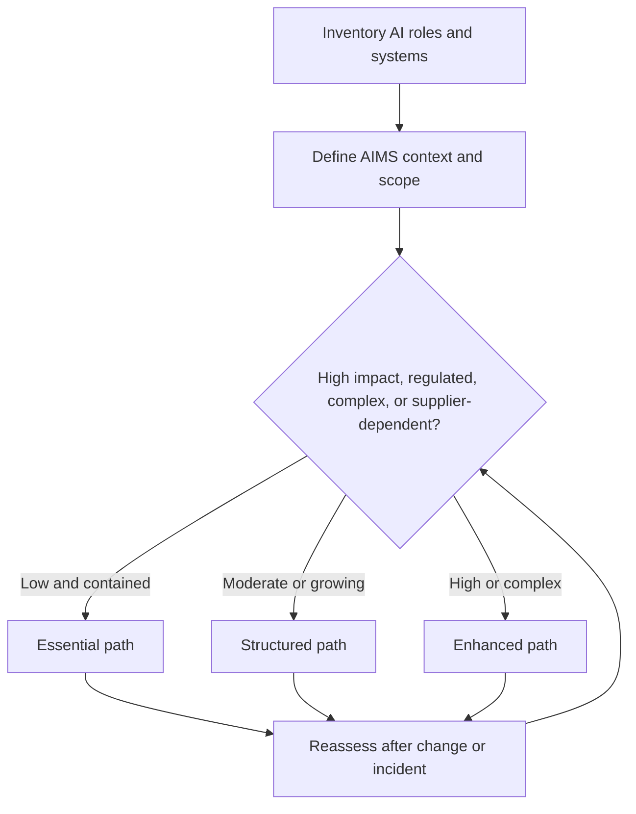
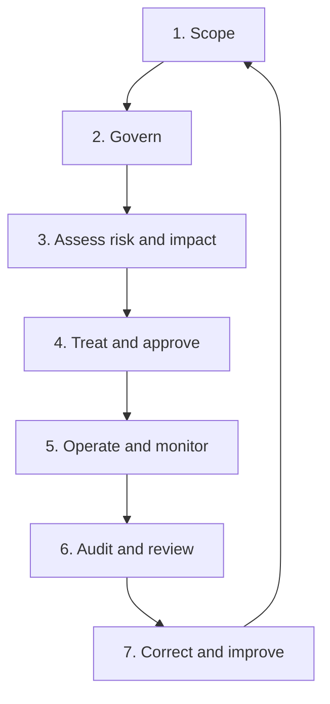
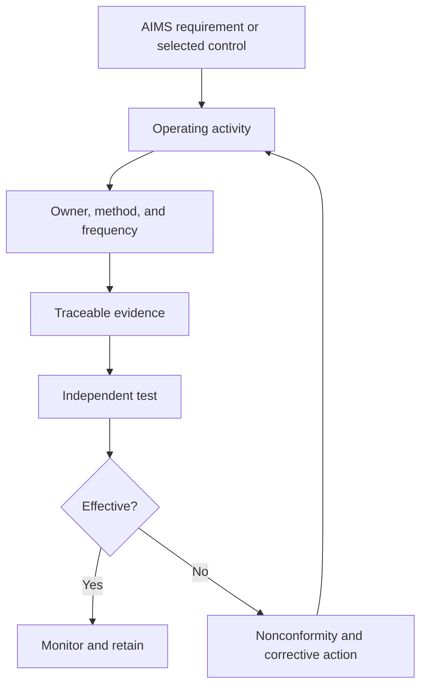

# Manual 02 — ISO/IEC 42001 Implementation Paths for Every Organization

**Controlled development language:** English

**Audience:** organizations that provide, develop, acquire, deploy, operate, or use AI systems

**Accountable human creator:** Alberto “Al” Leiva

This entry point converts an AI management system into practical work for organizations with different resources and risk profiles. Organization size influences staffing and formality, but it never overrides AI risk, impact, legal duties, system complexity, data sensitivity, or dependency on suppliers.

Every path addresses leadership, risk assessment, operational control, performance evaluation, corrective action, and continual improvement. The difference is the depth, independence, specialization, and monitoring needed for the organization’s actual risk.

Use authorized ISO publications as the normative source. This guide is original educational implementation assistance and does not reproduce ISO standards or establish conformity or certification.

## 1. Choose the implementation path by risk and complexity

Start with the organization’s AI roles, systems, intended uses, affected people, data, suppliers, and operating jurisdictions. Then select the lightest path that can still control the actual risk.

**Accessible explanation:** The organization first inventories its AI roles and systems and defines the AIMS context and scope. Risk, impact, regulation, complexity, and supplier dependency determine whether the Essential, Structured, or Enhanced path is appropriate. Changes and incidents return the decision to reassessment.

### Essential path

Usually appropriate for a micro or small organization with a limited number of lower-impact AI uses and manageable dependencies.

Minimum operating outcomes:

- one accountable executive and one AIMS coordinator;
- a scoped AI inventory with owners and intended purposes;
- documented risk and impact screening before approval;
- a concise AI policy and acceptable-use rules;
- supplier review and minimum contractual protections;
- approval, monitoring, incident, change, and retirement records;
- a proportionate Statement of Applicability with reasons;
- periodic internal review by someone independent of the work tested; and
- management review and corrective-action evidence.

One person may hold several roles, but that person should not approve and independently audit the same work without an alternative safeguard.

### Structured path

Usually appropriate for a midsize organization, multiple business units, material personal or confidential data, several suppliers, or moderate-impact AI decisions.

Add:

- a formal AIMS committee and documented decision rights;
- risk, impact, data, security, privacy, and supplier assessment methods;
- an integrated control library and evidence register;
- role-based competence requirements and training;
- release gates, monitoring thresholds, change triggers, and incident exercises;
- an annual risk-based internal-audit programme;
- tracked nonconformities, root causes, remediation, and effectiveness tests; and
- executive metrics covering inventory, risk, control operation, incidents, and overdue actions.

### Enhanced path

Usually appropriate for a large or complex enterprise, high-impact or regulated uses, foundation-model or agentic-AI dependencies, safety-related systems, global operations, or significant effects on people.

Add:

- governing-body oversight and three-lines accountability;
- independent model, data, security, privacy, fairness, robustness, and human-oversight testing;
- continuous control and model-performance monitoring;
- formal challenge, escalation, stop-use, and risk-acceptance authority;
- portfolio and system-level risk aggregation;
- supplier and fourth-party concentration analysis;
- legal and regulatory crosswalks by jurisdiction and actor role;
- independent assurance and certification-readiness reviews; and
- crisis, regulator, customer, and affected-person response exercises.

## 2. Implement the AIMS as a repeatable operating cycle

The AIMS is not a one-time documentation project. Each gate must create a decision, an accountable owner, and evidence that can later be tested.

**Accessible explanation:** The implementation cycle defines scope, establishes governance, assesses risk and impact, selects treatment and approval, operates and monitors controls, performs audit and management review, and uses corrective action to improve the next cycle.

### Gate 1 — Scope

Document organizational boundaries, AI roles, covered products and services, life-cycle activities, data, locations, suppliers, interested parties, interfaces, and justified exclusions.

### Gate 2 — Govern

Approve policy, objectives, risk criteria, impact-assessment triggers, decision rights, resources, competence expectations, communications, and controlled-document requirements.

### Gate 3 — Assess risk and impact

Identify reasonably foreseeable benefits, harms, uncertainty, affected people, data and security threats, failure modes, supplier dependencies, existing controls, and residual exposure.

### Gate 4 — Treat and approve

Select controls, document the Statement of Applicability, assign owners and deadlines, define acceptance criteria, address unresolved risk, and record an authorized decision.

### Gate 5 — Operate and monitor

Run the approved processes, retain evidence, test thresholds, monitor changes, handle incidents and complaints, verify supplier obligations, and reassess after defined triggers.

### Gate 6 — Audit and review

Use competent and impartial reviewers to test conformity and effectiveness. Management evaluates performance, changes, resources, findings, risk, opportunities, and improvement decisions.

### Gate 7 — Correct and improve

Contain problems, correct consequences, determine causes, implement actions, test effectiveness, update risks and controls, and share lessons without hiding unsuccessful results.

## 3. Assign accountable roles without assuming a large staff

| Responsibility | Essential | Structured | Enhanced |
|---|---|---|---|
| Direction and risk acceptance | Executive sponsor | Executive committee | Governing body and accountable executives |
| AIMS coordination | Named coordinator | Dedicated manager or programme lead | Enterprise AIMS office |
| System ownership | Business owner | Business and technical co-owners | Portfolio, product, model, and deployment owners |
| Risk and impact assessment | Cross-functional review as needed | Standing multidisciplinary reviewers | Independent specialist functions and affected-party input |
| Control operation | Named control owners | Control owners with evidence calendar | Federated control owners with continuous monitoring |
| Internal audit | Independent qualified person or external support | Risk-based internal-audit programme | Independent audit function with specialist AI competence |
| Management review | Sponsor review | Scheduled executive review | Governing-body and executive oversight cycle |

Outsourcing work does not outsource accountability. Contracts, consultants, tools, and certification bodies support the AIMS but do not own management’s decisions.

## 4. Build the minimum controlled records

Every organization should maintain, at a minimum:

1. AIMS context, interested-party, and scope record;
2. AI inventory with role, owner, purpose, status, data, supplier, and risk fields;
3. policy, objectives, decision rights, and competence records;
4. risk and opportunity method and completed assessments;
5. AI system impact-assessment method and completed assessments;
6. treatment plan and Statement of Applicability;
7. system life-cycle, data, supplier, transparency, and responsible-use evidence;
8. monitoring, measurement, incident, complaint, change, and retirement records;
9. internal-audit programme, plans, workpapers, findings, and follow-up;
10. management-review inputs, decisions, owners, and deadlines; and
11. nonconformity, root-cause, corrective-action, and effectiveness evidence.

## 5. Connect requirements to evidence and assurance

**Accessible explanation:** An AIMS requirement or selected control becomes an operating activity with an owner, method, and frequency. The activity produces traceable evidence for independent testing. Effective controls remain under monitoring; ineffective controls create a nonconformity and corrective action that returns to the operating activity.

Evidence should be authentic, complete enough for the conclusion, protected from inappropriate change, linked to the correct system and period, and retained for an approved duration.

## 6. Measure whether implementation works

Use metrics that reveal control performance rather than document volume:

- percentage of AI systems with confirmed owner, purpose, risk tier, and current status;
- overdue risk or impact assessments;
- systems operating outside approved conditions;
- control tests passed, failed, or not completed;
- unresolved supplier-evidence and contract gaps;
- incidents, complaints, overrides, and stop-use decisions;
- monitoring thresholds exceeded and time to response;
- overdue nonconformities and corrective-action age;
- repeat findings and failed effectiveness tests;
- management-review decisions completed by due date; and
- changes that triggered timely reassessment.

## 7. Preserve the standards and assurance boundary

The controlled source registry identifies current official pages using these IDs:

- `iso-iec-42001-2023` — AIMS requirements and guidance;
- `iso-iec-42005-2025` — AI system impact-assessment guidance;
- `iso-iec-42006-2025` — additional requirements for bodies auditing and certifying AIMS;
- `iso-iec-23894-2023` — AI risk-management guidance; and
- `iso-19011-2026` — management-system audit guidance.

The registry also controls `iso-iec-22989-2022`, `iso-iec-23053-2022`, `iso-iec-38507-2022`, `iso-iec-27001-2022`, and `iso-iec-27001-2022-amd1-2024`. The supporting certification source `iso-iec-17021-1-2015` remains published but is under systematic review.

Do not claim that:

- using this manual establishes conformity;
- implementing a tool satisfies a requirement automatically;
- certification proves every AI system is safe, lawful, unbiased, secure, or effective;
- ISO/IEC 42006 is a requirement imposed directly on every organization seeking certification; or
- ISO/IEC 42001 certification alone proves compliance with the EU AI Act or another law.

## 8. First 90 days

| Period | Minimum outcome |
|---|---|
| Days 1–30 | Sponsor, AIMS coordinator, initial scope, AI inventory, urgent restrictions, source register, and evidence location |
| Days 31–60 | Policy, objectives, roles, risk and impact methods, initial assessments, supplier controls, and treatment priorities |
| Days 61–90 | Statement of Applicability, implemented priority controls, monitoring plan, competence records, audit schedule, and first management review |

After day 90, complete the remaining treatment plan, test operating effectiveness, close priority nonconformities, reassess after changes, and prepare for independent assurance only when the AIMS has enough operating history and evidence.

---

Repository QA checks structure and controlled-source integrity. It does not provide certification, legal advice, or an audit opinion.
