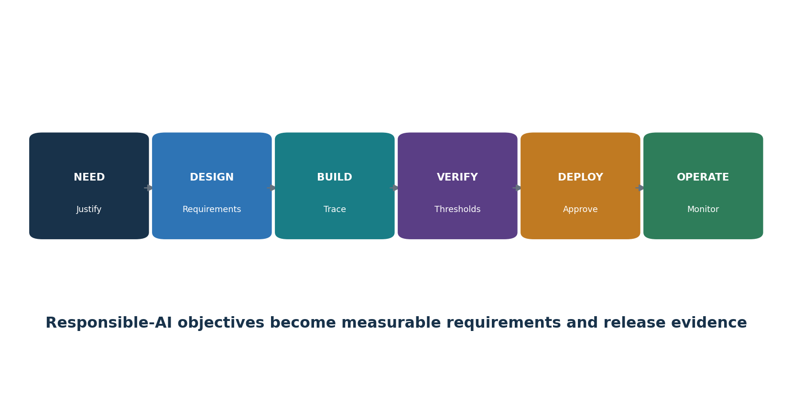
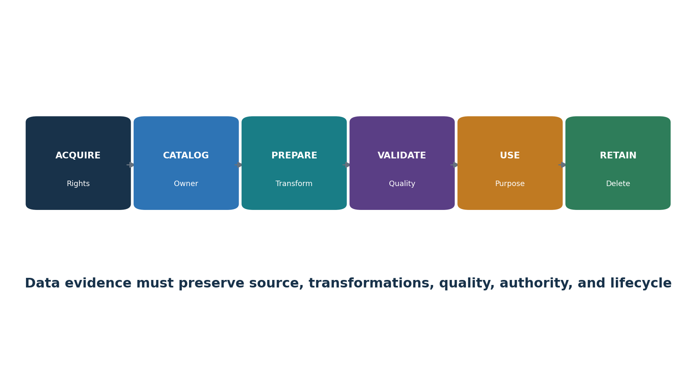
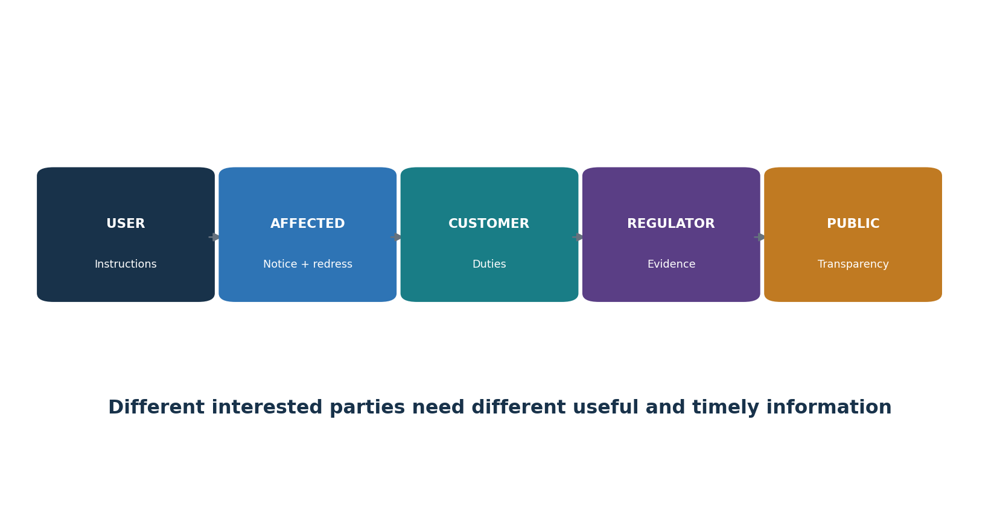
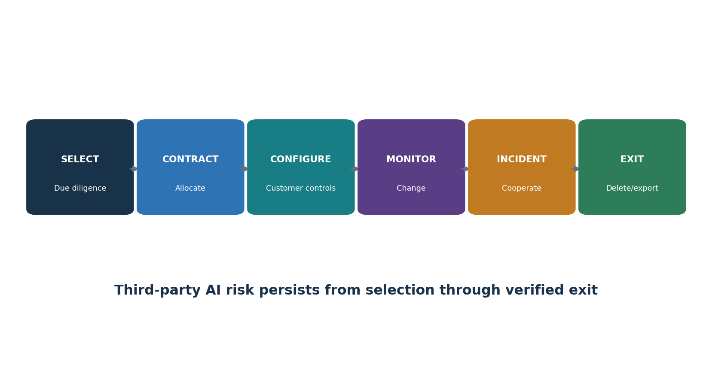
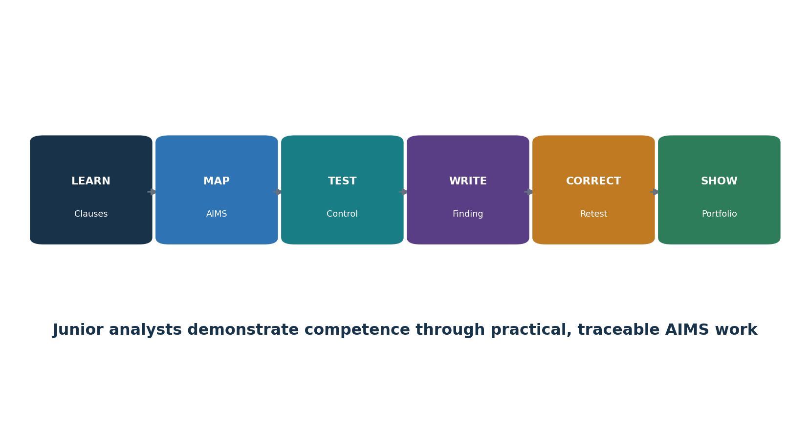

# 25. Anexo A.6: Ciclo de vida del sistema de IA

*El Anexo A.6 conecta los objetivos de desarrollo responsable con requisitos, diseño, pruebas, despliegue, operación, documentación y registro de eventos.*

Figura 6. Ciclo de vida responsable del sistema de IA

> **Explicación accesible:** La figura muestra un flujo desde objetivos y requisitos hasta diseño, verificación/validación, despliegue, operación, seguimiento, cambio y retiro. Cada etapa debe dejar versiones, criterios, resultados, aprobaciones y decisiones rastreables.

| **Área del ciclo de vida** | **Evidencia de implementación** |
|---|---|
| Objetivos/proceso responsable | Equidad, seguridad funcional, privacidad, transparencia, ciberseguridad, robustez y otros objetivos medibles pertinentes; procedimiento de ciclo de vida |
| Requisitos/especificación | Propósito, criterios funcionales y no funcionales, personas afectadas, datos, modelo, supervisión humana, límites y obligaciones |
| Registros de diseño/desarrollo | Arquitectura, decisiones, alternativas, supuestos, componentes, amenazas, interfaces, procedencia y revisiones |
| Verificación/validación | Métodos, datos de evaluación, calificadores, umbrales, fallas graves, pruebas por subgrupos/casos límite/adversariales y limitaciones |
| Despliegue | Aprobación de liberación, entorno, configuración, información al usuario, migración, seguimiento y reversión |
| Operación/seguimiento | Desempeño, deriva, seguridad, seguridad funcional, impacto, quejas, cambios, soporte, reparación y actualizaciones |
| Documentación técnica/logs | Instrucciones adecuadas a la audiencia más eventos trazables para auditoría, incidentes, decisiones y mejora |

## 25.1 Cambio y retiro

- Versione modelo, datos, prompts, recuperación, herramientas, código, infraestructura, políticas, evaluación, aprobaciones y seguimiento.
- Defina disparadores de cambio material y alcance de regresión; despliegue gradualmente con capacidad de reversión.
- Retire usuarios, identidades, integraciones, endpoints, modelos, conjuntos de datos, índices, logs, documentación, contratos y copias del proveedor conforme a obligaciones; preserve los registros requeridos.

# 26. Anexo A.7: Datos para sistemas de IA

*El Anexo A.7 exige adquisición, calidad, procedencia y preparación gobernadas de datos para desarrollo, mejora y operación de IA.*

Figura 7. Cadena de evidencia de datos de IA

> **Explicación accesible:** La cadena de evidencia sigue los datos desde su origen, autoridad y derechos, pasando por adquisición, transformación, etiquetado, calidad, versionado y uso, hasta retención o eliminación. Debe permitir reproducir qué datos sustentaron cada versión y decisión relevante.

## 26.1 Controles de datos

- Defina requisitos de gestión de datos para privacidad, seguridad, representatividad, explicabilidad, procedencia, exactitud, integridad, disponibilidad, retención y eliminación según corresponda.
- Documente adquisición/selección: fuente, método, personas/población, derechos/licencia, propósito anterior, consentimiento/autoridad cuando aplique, metadatos, fecha, restricciones y sesgos conocidos.
- Establezca criterios y umbrales de calidad específicos del uso para exactitud, completitud, coherencia, vigencia, unicidad, validez, representatividad, etiquetas y cobertura de subgrupos.
- Preserve procedencia a través de creación, adquisición, transferencia, transformación, etiquetado, aumento, filtrado, versionado, validación, uso, intercambio, corrección y eliminación.
- Documente métodos de preparación, código/herramienta/versión, parámetros, personas, comprobaciones de calidad, justificación, salidas y reproducibilidad.
- Separe y proteja conjuntos de entrenamiento, validación, prueba, producción, seguimiento e incidentes; evite contaminación del conjunto de evaluación.

| **Evidencia de datos** | **Prueba** |
|---|---|
| Ficha de conjunto/datos | Trazar propósito, población, campos, fuente, derechos, calidad, limitaciones y propietario |
| Linaje | Reproducir transformaciones de fuente a característica y versión |
| Resultado de calidad | Verificar población/muestra, reglas, fallas, corrección y aprobación |
| Acceso/retención | Muestrear concesiones, revisiones, retiros, uso, copias y eliminación |
| Sesgo/representación | Comprobar grupos pertinentes, historia, proxies, etiquetas, brechas y mitigación |

# 27. Anexo A.8: Información para partes interesadas

*El Anexo A.8 exige información útil para usuarios y partes interesadas, además de reporte y comunicación de incidentes.*

Figura 8. Información para partes interesadas

> **Explicación accesible:** La información debe adaptarse a la audiencia. Usuarios necesitan propósito, capacidades y límites; personas afectadas necesitan saber cómo interviene la IA y cómo solicitar revisión o reparación; clientes, reguladores y público reciben información proporcional a sus responsabilidades y riesgos.

## 27.1 Paquete de información

- Usuarios: propósito previsto, capacidades, limitaciones, entradas/salidas esperadas, uso prohibido, verificación, supervisión humana, seguimiento, escalamiento y soporte.
- Personas afectadas: que se utiliza IA cuando corresponda, su papel en la decisión, factores/limitaciones importantes, datos y derechos, revisión humana, corrección, apelación, queja y reparación.
- Clientes/socios: responsabilidades, configuración, datos, dependencias de control, evidencia, incidentes, cambios, soporte y salida.
- Reguladores/auditores: documentación controlada, alcance, evaluaciones, controles, resultados de pruebas, incidentes, cambios, hallazgos y acción correctiva según se requiera.
- Público: transparencia proporcional, impactos significativos, gobierno, información de seguridad, contacto e informes cuando corresponda.

## 27.2 Reporte externo e incidentes

- Proporcione canales accesibles para reportar errores, daños, sesgo, preocupaciones de seguridad/privacidad, uso indebido, problemas de accesibilidad o efectos inesperados.
- Defina triaje, gravedad, investigación, protección, retroalimentación, corrección, reparación, escalamiento, retención y análisis de tendencias.
- Predefina audiencias de incidentes, contenido, propietario/portavoz, revisión legal, momento, canal, accesibilidad, coordinación, actualizaciones y cierre.
- No divulgue en exceso información sensible de seguridad o datos personales; tampoco oculte limitaciones materiales detrás de la confidencialidad.

# 28. Anexos A.9 y A.10: Uso responsable, proveedores y clientes

*El Anexo A.9 gobierna el uso responsable y el propósito previsto; el Anexo A.10 asigna deberes entre proveedores, clientes y la cadena de valor de IA.*

Figura 9. Ciclo de vida de IA de terceros

> **Explicación accesible:** El control de terceros comienza identificando actores y responsabilidades, sigue con debida diligencia y contratos, supervisa cambios del proveedor y termina con continuidad, portabilidad, eliminación y salida. La responsabilidad no puede transferirse mediante lenguaje contractual ambiguo.

## 28.1 Uso responsable

- Defina usos aprobados y prohibidos, usuarios, datos, resultados, decisiones, autonomía, verificación, supervisión humana, logging, soporte, incidente y condiciones de detención.
- Establezca objetivos medibles de uso responsable vinculados a impactos y riesgos pertinentes.
- Capacite a usuarios y supervisores; haga cumplir mediante identidad, configuración, interfaces, política, seguimiento, revisión y consecuencias.
- Detecte expansión no controlada del alcance y exija reevaluación antes de reutilización, ampliación, nuevas poblaciones, mayor impacto o nuevas integraciones/herramientas.

## 28.2 Terceros y clientes

- Mapee desarrollador/proveedor/implementador, proveedores de datos/modelos/herramientas/nube, integradores, servicios humanos, clientes, usuarios y partes afectadas.
- Asigne responsabilidad por datos, requisitos, pruebas, configuración, transparencia, supervisión humana, seguridad, incidentes, seguimiento, cambio, evidencia, derechos, eliminación y salida.
- Realice debida diligencia y contratación basadas en riesgo; verifique documentación de modelo/sistema, evaluación, aseguramiento de seguridad/privacidad, términos de datos, PI, soporte, vulnerabilidades, cambios, subprocesadores, resiliencia y portabilidad.
- Supervise cambios del proveedor en modelo/términos/entrenamiento/retención/subprocesadores/incidentes/obsolescencia y reevalúe oportunamente.
- Defina obligaciones y soporte del cliente; no utilice la responsabilidad del cliente como transferencia vaga de deberes del proveedor.

# 29. Certificación, ISO/IEC 42006:2025 y preparación para auditoría

*La certificación evalúa el SGIA frente a ISO/IEC 42001 dentro de un alcance definido; ISO/IEC 42006:2025 fortalece requisitos para organismos de certificación.*

## 29.1 Ruta de certificación

- Seleccione un organismo de certificación competente y verifique acreditación/estado, esquema, geografía, competencia, imparcialidad, capacidad de alcance y contrato.
- Solicitud y planificación: organización, alcance del SGIA, funciones, sitios, personas, sistemas, complejidad, procesos externalizados, normas y tiempo de auditoría.
- Etapa 1: preparación, alcance, sistema documentado, contexto, métodos de riesgo/impacto, Declaración de Aplicabilidad, auditoría interna, revisión por la dirección y preparación para Etapa 2.
- Etapa 2: implementación y eficacia operacional mediante entrevistas, muestras, registros, observación y trazabilidad.
- Resuelva no conformidades con corrección, causa, acción correctiva y evidencia de eficacia conforme a las reglas del esquema.
- Decisión de certificación, certificado, vigilancia, cambios de alcance, recertificación, suspensión/retiro y mejora continua.

## 29.2 Importancia de ISO/IEC 42006:2025

- Añade requisitos específicos de SGIA para organismos que auditan y certifican frente a ISO/IEC 42001 y se apoya en ISO/IEC 17021-1.
- Apoya competencia apropiada, procesos de auditoría coherentes, imparcialidad, tiempo de auditoría y rigor para organizaciones que desarrollan, proporcionan o utilizan sistemas de IA.
- La organización debe verificar que una certificación declarada se emita bajo un esquema acreditado pertinente y que el alcance y estado del certificado coincidan con la afirmación.

| **Paquete de evidencia de auditoría** | **Ejemplos** |
|---|---|
| Fundamento | Alcance, contexto, partes, política, mapa de procesos, funciones e inventario |
| Planificación | Método/resultados de riesgo, tratamiento, Declaración de Aplicabilidad, proceso/resultados de impacto, objetivos y cambios |
| Soporte/operación | Recursos, competencia, comunicación, documentos, ciclo de vida, datos, uso, proveedores e incidentes |
| Evaluación/mejora | Métricas, auditoría interna, revisión por la dirección, hallazgos, acciones correctivas y eficacia |
| Muestras trazables | Registros de extremo a extremo de sistemas de IA representativos de riesgo alto/medio/bajo y cambios materiales |

## 29.3 Preparación para auditoría sin teatro

- Opere los controles el tiempo suficiente para producir evidencia honesta; no cree registros después de los hechos.
- Reconcile alcance, inventario, riesgo, impacto, Declaración de Aplicabilidad, proveedor, versiones del sistema, métricas, auditoría y revisión por la dirección.
- Prepare a entrevistados para explicar su trabajo real y mostrar evidencia, no para memorizar respuestas.
- Revele con precisión brechas, riesgos aceptados, limitaciones, incidentes y acciones correctivas.

# 30. Herramientas de código abierto para evidencia del SGIA y aseguramiento de IA

*Las herramientas de código abierto pueden apoyar trazabilidad, evaluación, seguimiento, políticas, privacidad y hallazgos, pero no deciden la conformidad con ISO.*

| **Herramienta** | **Propósito** |
|---|---|
| MLflow | Seguimiento de experimentos, registro de modelos, linaje, aprobación y registros de despliegue |
| DVC | Control de versiones para datos, modelos y pipelines |
| OpenLineage | Estándar abierto y herramientas para eventos de linaje de datos/trabajos |
| OpenMetadata | Catálogo de datos, linaje, propiedad, glosario y metadatos de calidad |
| Great Expectations | Expectativas automatizadas de calidad de datos y resultados de validación |
| Evidently | Calidad de datos, deriva, desempeño de modelos e informes de seguimiento |
| Deepchecks | Pruebas para datos, modelos ML y aplicaciones LLM |
| Giskard | Pruebas de IA y análisis de vulnerabilidades |
| Promptfoo | Evaluaciones de prompts, modelos, RAG y red teaming |
| Garak | Análisis y sondas de vulnerabilidades de LLM |
| PyRIT | Identificación de riesgos y orquestación de red teaming para IA generativa |
| Inspect AI | Evaluaciones reproducibles de IA |
| Presidio | Detección y desidentificación de información personal |
| ModelScan | Análisis estático de archivos de modelos serializados |
| CycloneDX | Formatos y herramientas de lista de materiales de software, ML e IA |
| Open Policy Agent | Decisiones de política como código |
| DefectDojo | Admisión, deduplicación, propiedad, remediación y reprueba de hallazgos |
| Langfuse | Trazabilidad de LLM, gestión de prompts y evaluación de código abierto |

| **Gobierno de herramientas:** Utilice únicamente sistemas, modelos, cuentas, repositorios y datos autorizados. Comience con entornos aislados y datos sintéticos. Proteja credenciales, prompts, resultados, trazas, información personal y hallazgos. Registre versiones y valide resultados automatizados. |
|---|

## 30.1 MLflow

**Propósito:** Seguimiento de experimentos, registro de modelos, linaje, aprobación y registros de despliegue. Proyecto oficial: [MLflow](https://mlflow.org/)

**Inicio seguro:** Cree un proyecto local; registre parámetros, referencia de conjunto de datos, métricas, artefactos, propietario y aprobación; registre únicamente modelos probados; restrinja cambios al registro.

**Evidencia del SGIA:** autoridad/alcance, versiones de sistema/modelo/datos, identidad, herramienta/versión/configuración, criterios/umbrales, fecha, población fuente, resultado, validación humana, limitaciones, hallazgo, propietario/acción, aprobación y reprueba.

## 30.2 DVC

**Propósito:** Control de versiones para datos, modelos y pipelines. Proyecto oficial: [DVC](https://dvc.org/)

**Inicio seguro:** Utilice un conjunto sintético en un repositorio de entrenamiento; versione datos y etapas del pipeline; reproduzca una ejecución; proteja almacenamiento remoto y credenciales.

**Evidencia del SGIA:** autoridad/alcance, versiones de sistema/modelo/datos, identidad, herramienta/versión/configuración, criterios/umbrales, fecha, población fuente, resultado, validación humana, limitaciones, hallazgo, propietario/acción, aprobación y reprueba.

## 30.3 OpenLineage

**Propósito:** Estándar abierto y herramientas para eventos de linaje de datos/trabajos. Proyecto oficial: [OpenLineage](https://openlineage.io/)

**Inicio seguro:** Instrumente un pipeline pequeño de laboratorio; registre relaciones entre conjuntos de datos y trabajos; verifique integridad de eventos; proteja metadatos sensibles.

**Evidencia del SGIA:** autoridad/alcance, versiones de sistema/modelo/datos, identidad, herramienta/versión/configuración, criterios/umbrales, fecha, población fuente, resultado, validación humana, limitaciones, hallazgo, propietario/acción, aprobación y reprueba.

## 30.4 OpenMetadata

**Propósito:** Catálogo de datos, linaje, propiedad, glosario y metadatos de calidad. Proyecto oficial: [OpenMetadata](https://open-metadata.org/)

**Inicio seguro:** Despliegue una instancia de laboratorio; catalogue conjuntos sintéticos; asigne propietarios/clasificación; documente linaje y retención; restrinja conectores.

**Evidencia del SGIA:** autoridad/alcance, versiones de sistema/modelo/datos, identidad, herramienta/versión/configuración, criterios/umbrales, fecha, población fuente, resultado, validación humana, limitaciones, hallazgo, propietario/acción, aprobación y reprueba.

## 30.5 Great Expectations

**Propósito:** Expectativas automatizadas de calidad de datos y resultados de validación. Proyecto oficial: [Great Expectations](https://greatexpectations.io/)

**Inicio seguro:** Defina expectativas de exactitud, completitud, rango y nulos para datos sintéticos; ejecute validación; conserve suite/versión/resultados y excepciones.

**Evidencia del SGIA:** autoridad/alcance, versiones de sistema/modelo/datos, identidad, herramienta/versión/configuración, criterios/umbrales, fecha, población fuente, resultado, validación humana, limitaciones, hallazgo, propietario/acción, aprobación y reprueba.

## 30.6 Evidently

**Propósito:** Calidad de datos, deriva, desempeño del modelo e informes de seguimiento. Proyecto oficial: [Evidently](https://www.evidentlyai.com/)

**Inicio seguro:** Cree conjuntos sintéticos de referencia y actuales; ejecute un informe; defina umbrales de acción; investigue antes de reentrenar o revertir.

**Evidencia del SGIA:** autoridad/alcance, versiones de sistema/modelo/datos, identidad, herramienta/versión/configuración, criterios/umbrales, fecha, población fuente, resultado, validación humana, limitaciones, hallazgo, propietario/acción, aprobación y reprueba.

## 30.7 Deepchecks

**Propósito:** Pruebas para datos, modelos ML y aplicaciones LLM. Proyecto oficial: [Deepchecks](https://github.com/deepchecks/deepchecks)

**Inicio seguro:** Ejecute una suite enfocada sobre datos de laboratorio aprobados; revise relevancia y falsos positivos; registre excepciones; repita después de la corrección.

**Evidencia del SGIA:** autoridad/alcance, versiones de sistema/modelo/datos, identidad, herramienta/versión/configuración, criterios/umbrales, fecha, población fuente, resultado, validación humana, limitaciones, hallazgo, propietario/acción, aprobación y reprueba.

## 30.8 Giskard

**Propósito:** Pruebas de IA y análisis de vulnerabilidades. Proyecto oficial: [Giskard](https://github.com/Giskard-AI/giskard)

**Inicio seguro:** Conecte solo un modelo y conjunto de prueba aprobados; seleccione pruebas pertinentes; valide fallas manualmente; conserve informe y reprueba de remediación.

**Evidencia del SGIA:** autoridad/alcance, versiones de sistema/modelo/datos, identidad, herramienta/versión/configuración, criterios/umbrales, fecha, población fuente, resultado, validación humana, limitaciones, hallazgo, propietario/acción, aprobación y reprueba.

## 30.9 Promptfoo

**Propósito:** Evaluaciones de prompts, modelos, RAG y red teaming. Proyecto oficial: [Promptfoo](https://www.promptfoo.dev/)

**Inicio seguro:** Cree una suite YAML versionada con casos sintéticos y comportamiento esperado; ejecútela localmente; revise fallas; conserve configuración y resultados.

**Evidencia del SGIA:** autoridad/alcance, versiones de sistema/modelo/datos, identidad, herramienta/versión/configuración, criterios/umbrales, fecha, población fuente, resultado, validación humana, limitaciones, hallazgo, propietario/acción, aprobación y reprueba.

## 30.10 Garak

**Propósito:** Análisis y sondas de vulnerabilidades de LLM. Proyecto oficial: [Garak](https://github.com/NVIDIA/garak)

**Inicio seguro:** Utilice un modelo aislado de laboratorio y un conjunto limitado de sondas aprobadas; limite solicitudes y costos; proteja resultados; valide cada hallazgo.

**Evidencia del SGIA:** autoridad/alcance, versiones de sistema/modelo/datos, identidad, herramienta/versión/configuración, criterios/umbrales, fecha, población fuente, resultado, validación humana, limitaciones, hallazgo, propietario/acción, aprobación y reprueba.

## 30.11 PyRIT

**Propósito:** Identificación de riesgos y orquestación de red teaming para IA generativa. Proyecto oficial: [PyRIT](https://github.com/Azure/PyRIT)

**Inicio seguro:** Defina reglas escritas de laboratorio; use objetivos inocuos y datos sintéticos; establezca límites de solicitudes/tiempo/costo; proteja transcripciones y hallazgos.

**Evidencia del SGIA:** autoridad/alcance, versiones de sistema/modelo/datos, identidad, herramienta/versión/configuración, criterios/umbrales, fecha, población fuente, resultado, validación humana, limitaciones, hallazgo, propietario/acción, aprobación y reprueba.

## 30.12 Inspect AI

**Propósito:** Evaluaciones reproducibles de IA. Proyecto oficial: [Inspect AI](https://inspect.aisi.org.uk/)

**Inicio seguro:** Defina tarea, conjunto de datos, solver, evaluador y regla de aceptación; fije versiones; ejecute un modelo aprobado; conserve logs y limitaciones.

**Evidencia del SGIA:** autoridad/alcance, versiones de sistema/modelo/datos, identidad, herramienta/versión/configuración, criterios/umbrales, fecha, población fuente, resultado, validación humana, limitaciones, hallazgo, propietario/acción, aprobación y reprueba.

## 30.13 Presidio

**Propósito:** Detección y desidentificación de información personal. Proyecto oficial: [Presidio](https://microsoft.github.io/presidio/)

**Inicio seguro:** Pruebe con ejemplos sintéticos; configure reconocedores para idioma/contexto; inspeccione falsos positivos y omisiones; proteja la salida del analizador.

**Evidencia del SGIA:** autoridad/alcance, versiones de sistema/modelo/datos, identidad, herramienta/versión/configuración, criterios/umbrales, fecha, población fuente, resultado, validación humana, limitaciones, hallazgo, propietario/acción, aprobación y reprueba.

## 30.14 ModelScan

**Propósito:** Análisis estático de archivos de modelos serializados. Proyecto oficial: [ModelScan](https://github.com/protectai/modelscan)

**Inicio seguro:** Analice un artefacto en cuarentena; verifique fuente y hash; investigue advertencias; nunca cargue un modelo no confiable solamente para probarlo.

**Evidencia del SGIA:** autoridad/alcance, versiones de sistema/modelo/datos, identidad, herramienta/versión/configuración, criterios/umbrales, fecha, población fuente, resultado, validación humana, limitaciones, hallazgo, propietario/acción, aprobación y reprueba.

## 30.15 CycloneDX

**Propósito:** Formatos y herramientas de lista de materiales de software, ML e IA. Proyecto oficial: [CycloneDX](https://cyclonedx.org/)

**Inicio seguro:** Genere una lista de materiales para un repositorio de laboratorio; valide componentes y versiones; vincule hallazgos con propietarios y registros de proveedores.

**Evidencia del SGIA:** autoridad/alcance, versiones de sistema/modelo/datos, identidad, herramienta/versión/configuración, criterios/umbrales, fecha, población fuente, resultado, validación humana, limitaciones, hallazgo, propietario/acción, aprobación y reprueba.

## 30.16 Open Policy Agent

**Propósito:** Decisiones de política como código. Proyecto oficial: [Open Policy Agent](https://www.openpolicyagent.org/)

**Inicio seguro:** Escriba una regla pequeña de laboratorio para modelo/datos/uso aprobados; pruebe permitir, negar y casos con datos faltantes; haga revisión por pares; conserve autoridad humana para excepciones.

**Evidencia del SGIA:** autoridad/alcance, versiones de sistema/modelo/datos, identidad, herramienta/versión/configuración, criterios/umbrales, fecha, población fuente, resultado, validación humana, limitaciones, hallazgo, propietario/acción, aprobación y reprueba.

## 30.17 DefectDojo

**Propósito:** Admisión, deduplicación, propiedad, remediación y reprueba de hallazgos. Proyecto oficial: [DefectDojo](https://www.defectdojo.org/)

**Inicio seguro:** Importe resultados seguros de laboratorio; valide duplicados y gravedad; asigne propietario/fecha; adjunte evidencia; cierre solo después de reprueba.

**Evidencia del SGIA:** autoridad/alcance, versiones de sistema/modelo/datos, identidad, herramienta/versión/configuración, criterios/umbrales, fecha, población fuente, resultado, validación humana, limitaciones, hallazgo, propietario/acción, aprobación y reprueba.

## 30.18 Langfuse

**Propósito:** Trazabilidad de LLM, gestión de prompts y evaluación de código abierto. Proyecto oficial: [Langfuse](https://langfuse.com/)

**Inicio seguro:** Use un laboratorio aprobado; redacte campos sensibles; trace un flujo; restrinja acceso/retención; conecte trazas con evaluación y registros de incidentes.

**Evidencia del SGIA:** autoridad/alcance, versiones de sistema/modelo/datos, identidad, herramienta/versión/configuración, criterios/umbrales, fecha, población fuente, resultado, validación humana, limitaciones, hallazgo, propietario/acción, aprobación y reprueba.

# 31. Guía práctica para responsables y analistas junior, laboratorio y entrevistas

*Los responsables mantienen el SGIA conectado con resultados reales; los analistas junior crean inventarios, papeles de trabajo, hallazgos y evidencia de mejora confiables.*

Figura 10. Ruta del analista junior de SGIA

> **Explicación accesible:** La ruta del analista junior comienza con comprensión de alcance y criterios, continúa con inventarios y evidencia, pruebas y papeles de trabajo, redacción objetiva de hallazgos, seguimiento de acciones y aprendizaje continuo, sin asumir autoridad de certificación o auditoría que no corresponda.

## 31.1 Preguntas para responsables

| **Pregunta** | **Evidencia sólida** | **Señal de alerta** |
|---|---|---|
| ¿Qué está dentro del alcance? | Inventario reconciliado de IA y límites de organización/función/sistema/datos/proveedor | Alcance de marketing más amplio que el certificado |
| ¿Quién puede decidir? | Autoridad nombrada de negocio, sistema, datos, impacto, riesgo, proveedor, incidente y auditoría | El equipo de IA acepta solo el riesgo legal/comercial |
| ¿Qué daños son posibles? | Evaluaciones vigentes de riesgo e impacto con personas afectadas y alternativas | Solo se considera exactitud del modelo |
| ¿Qué demuestra preparación? | Evaluación versionada y similar a producción, umbrales, fallas, supervisión y reversión | Solo demostración del proveedor o política |
| ¿Qué cambia el riesgo? | Lista de disparadores, seguimiento, aviso del proveedor, regresión y reevaluación | Actualizaciones automáticas sin revisión |
| ¿Está mejorando el SGIA? | Objetivos, auditoría, quejas/incidentes, causas raíz y acciones eficaces | El certificado es la única medida de éxito |

## 31.2 Trabajo del analista junior

- Mantenga inventario de IA, alcance, partes interesadas, obligaciones, registros de riesgo/impacto, Declaración de Aplicabilidad, registros de proveedores, objetivos, evidencia y acciones.
- Mapee cláusulas/controles a procesos y evidencia real del sistema; reconcilie poblaciones y versiones.
- Pruebe control documental, competencia, puertas del ciclo de vida, linaje/calidad de datos, evaluación, uso responsable, cambio de proveedores, seguimiento, incidentes y acción correctiva.
- Redacte hallazgos objetivos y resúmenes para responsables; siga la corrección y la reprueba de eficacia.
- Apoye auditorías internas y revisión por la dirección sin tomar decisiones reservadas a propietarios o auditores.

| **Regla del laboratorio de portafolio:** Utilice una organización ficticia, datos sintéticos y modelos locales o de prueba aprobados. Nunca afirme que el proyecto está certificado, que fue auditado por un organismo acreditado o que se basa en evidencia confidencial de un empleador. |
|---|

## 31.3 Laboratorio ficticio

- Cree una empresa ficticia de 100 personas que desarrolla un asistente RAG de soporte al cliente y utiliza un asistente adquirido para redactar contenido de RR. HH. que no puede tomar decisiones laborales.
- Defina contexto del SGIA, partes interesadas, funciones, alcance, política, mapa de procesos, inventario de IA, obligaciones y hoja de ruta de implementación.
- Cree método de riesgo, seis escenarios, plan de tratamiento, Declaración de Aplicabilidad de 38 controles y dos evaluaciones de impacto utilizando conceptos de ISO/IEC 42005.
- Construya registros de recursos, conjuntos de datos, modelo/sistema, proveedores, información al usuario, comunicación, competencia y control documental.
- Ejecute evaluaciones sintéticas con dos herramientas de código abierto; conserve versiones, umbrales, fallas, corrección y reprueba.
- Cree objetivos/tablero, plan de auditoría interna y cinco papeles de trabajo, dos hallazgos, acciones correctivas, paquete de revisión por la dirección e informe de preparación para certificación.
- Publique únicamente evidencia ficticia saneada y una declaración honesta de limitaciones.

## 31.4 Plan de treinta días

| **Días** | **Enfoque** | **Entregable** |
|---|---|---|
| 1–3 | Norma, SGIA, PHVA | Mapa de cláusulas y glosario |
| 4–6 | Contexto, partes, alcance | Alcance y registro de partes interesadas |
| 7–9 | Liderazgo y planificación | Política, RACI y objetivos |
| 10–12 | Riesgo y tratamiento | Método, registro, plan y Declaración de Aplicabilidad |
| 13–15 | Evaluación de impacto | Dos papeles de trabajo de impacto |
| 16–18 | Soporte y documentos | Competencia, comunicación y controles documentales |
| 19–21 | Ciclo de vida, datos, uso, proveedores | Cinco papeles de trabajo de controles |
| 22–24 | Medición y herramientas | Tablero y evidencia de evaluación |
| 25–27 | Auditoría y acción correctiva | Informe de auditoría, hallazgos y plan de eficacia |
| 28–30 | Revisión por la dirección y entrevista | Paquete de revisión, memo de preparación e historias STAR |

## 31.5 ¿Qué es ISO/IEC 42001?

Una norma certificable de sistema de gestión para organizaciones que desarrollan, proporcionan o utilizan sistemas de IA. Establece requisitos para gobierno responsable, riesgo, impacto, operación, evaluación y mejora.

## 31.6 ¿Qué es un SGIA?

Las políticas, objetivos, procesos, funciones, controles y registros interrelacionados de la organización para gestionar IA responsablemente dentro de un alcance definido.

## 31.7 ¿Son obligatorios todos los controles del Anexo A?

Son controles de referencia considerados a través del tratamiento del riesgo. La organización documenta aplicabilidad e implementación en la Declaración de Aplicabilidad y puede añadir otros controles.

## 31.8 ¿Evaluación de riesgos frente a evaluación de impacto?

La evaluación de riesgos gestiona incertidumbre que afecta objetivos. La evaluación de impacto de sistemas de IA se concentra en efectos sobre individuos, grupos y sociedad. Intercambian hallazgos, pero no son idénticas.

## 31.9 ¿Qué es la Declaración de Aplicabilidad?

Un registro controlado que explica qué controles del Anexo A y adicionales aplican, por qué, cómo están implementados, su estado, evidencia, brechas y revisión.

## 31.10 ¿Etapa 1 frente a Etapa 2?

Etapa 1 evalúa alcance, sistema documentado, preparación y planificación. Etapa 2 evalúa implementación y eficacia operacional mediante evidencia y muestreo.

## 31.11 ¿Qué es una no conformidad?

Un requisito no se cumple. El hallazgo debe identificar criterios, evidencia objetiva y la brecha sin prescribir la solución del auditado.

## 31.12 ¿Cómo demuestran las herramientas la conformidad?

No la demuestran. Las herramientas producen evidencia que debe delimitarse, validarse, interpretarse frente a requisitos, conectarse con controles y ser revisada por personas competentes.

## 31.13 ¿Cómo se prueba una acción correctiva?

Verifique corrección, acción sobre la causa raíz, aplicación a condiciones similares y evidencia de que el riesgo de recurrencia disminuyó después de suficiente operación.

## 31.14 ¿Qué caracteriza a un analista junior sólido?

Alcance exacto, evidencia cuidadosa, comprensión de cláusulas, redacción clara, respeto por personas afectadas, incertidumbre honesta, uso seguro de herramientas y seguimiento confiable.

# 32. Plantillas, glosario, índice y referencias oficiales

*Estructuras de trabajo reutilizables y referencias autoritativas apoyan una implementación y auditoría coherentes del SGIA.*

## 32.1 Registro de alcance y contexto del SGIA

| **Campo** | **Entrada** |
|---|---|
| Organizaciones/unidades/ubicaciones | ________________________________________ |
| Función de IA, productos/servicios/procesos | ________________________________________ |
| Sistemas/modelos/datos/entornos de IA | ________________________________________ |
| Cuestiones internas/externas | ________________________________________ |
| Partes interesadas y requisitos | ________________________________________ |
| Obligaciones legales/contractuales | ________________________________________ |
| Límites, interfaces y dependencias | ________________________________________ |
| Procesos externalizados/compartidos | ________________________________________ |
| Exclusiones y justificación | ________________________________________ |
| Aprobación del alcance y disparadores de revisión | ________________________________________ |

## 32.2 Registro de riesgo y tratamiento de IA

| **Campo** | **Entrada** |
|---|---|
| Sistema/uso/versión/propietario | ________________________________________ |
| Escenario, parte afectada, consecuencia | ________________________________________ |
| Probabilidad/impacto/incertidumbre/evidencia | ________________________________________ |
| Controles existentes y eficacia | ________________________________________ |
| Evaluación/tolerancia de riesgo | ________________________________________ |
| Opción de tratamiento/control | ________________________________________ |
| Mapeo a Anexo A/control adicional | ________________________________________ |
| Propietario/recurso/fecha/medida | ________________________________________ |
| Riesgo residual/aprobador/condiciones | ________________________________________ |
| Seguimiento/revisión/reprueba | ________________________________________ |

## 32.3 Declaración de Aplicabilidad

| **Campo** | **Entrada** |
|---|---|
| Referencia/título del control | ________________________________________ |
| Aplicabilidad y justificación | ________________________________________ |
| Riesgo/impacto/obligación relacionada | ________________________________________ |
| Implementación y propietario | ________________________________________ |
| Estado y fecha objetivo | ________________________________________ |
| Evidencia y resultado de prueba | ________________________________________ |
| Dependencias de proveedor/cliente | ________________________________________ |
| Brecha/excepción/riesgo residual | ________________________________________ |
| Última/próxima revisión | ________________________________________ |
| Historial de cambios/aprobación | ________________________________________ |

## 32.4 Evaluación de impacto de sistemas de IA

| **Campo** | **Entrada** |
|---|---|
| Propósito, uso, personas afectadas, alternativas | ________________________________________ |
| Sistema/datos/modelo/proveedor/contexto | ________________________________________ |
| Beneficios e impactos adversos | ________________________________________ |
| Efectos individuales/grupales/sociales | ________________________________________ |
| Probabilidad/gravedad/escala/duración | ________________________________________ |
| Reversibilidad/distribución/incertidumbre | ________________________________________ |
| Participación de partes interesadas | ________________________________________ |
| Mitigación/supervisión/transparencia/reparación | ________________________________________ |
| Decisión/autoridad/condiciones | ________________________________________ |
| Seguimiento/disparadores/revisión | ________________________________________ |

## 32.5 Papel de trabajo de auditoría interna

| **Campo** | **Entrada** |
|---|---|
| Criterios/alcance/objetivo | ________________________________________ |
| Proceso/sistema/versión/periodo | ________________________________________ |
| Población/muestra/justificación | ________________________________________ |
| Evidencia/fuente/confiabilidad | ________________________________________ |
| Prueba/resultado esperado | ________________________________________ |
| Resultado observado/excepciones | ________________________________________ |
| Conclusión/no conformidad | ________________________________________ |
| Indicación de riesgo/impacto/causa | ________________________________________ |
| Corrección/acción correctiva | ________________________________________ |
| Eficacia/seguimiento/cierre | ________________________________________ |

## 32.6 Registro de revisión por la dirección

| **Campo** | **Entrada** |
|---|---|
| Estado de acciones anteriores | ________________________________________ |
| Cambios de contexto/partes | ________________________________________ |
| Objetivos/tendencias de desempeño | ________________________________________ |
| Riesgo/impacto/tratamiento/Declaración de Aplicabilidad | ________________________________________ |
| Auditoría/no conformidad/acción correctiva | ________________________________________ |
| Incidentes/quejas/preocupaciones/reparación | ________________________________________ |
| Cambios de proveedores/legales/sistemas | ________________________________________ |
| Recursos/competencia | ________________________________________ |
| Decisiones/acciones/propietarios/fechas | ________________________________________ |
| Eficacia/seguimiento | ________________________________________ |

## 32.7 Glosario

| **Término** | **Significado** |
|---|---|
| SGIA | Sistema de gestión de inteligencia artificial. |
| Evaluación de impacto de sistemas de IA | Evaluación estructurada de efectos potenciales sobre individuos, grupos y sociedad. |
| Anexo A | Objetivos de control y controles de referencia de ISO/IEC 42001. |
| Anexo B | Orientación para implementar los controles del Anexo A. |
| Certificación | Atestación de tercera parte de que el SGIA delimitado cumple requisitos especificados. |
| Conformidad | Cumplimiento de un requisito. |
| Control | Medida que mantiene o modifica el riesgo. |
| Corrección | Acción para eliminar una no conformidad detectada. |
| Acción correctiva | Acción para eliminar una causa y prevenir recurrencia. |
| Información documentada | Información que la organización controla y mantiene, junto con su medio. |
| Parte interesada | Persona u organización que puede afectar, verse afectada o percibirse afectada por una decisión/actividad. |
| Auditoría interna | Proceso sistemático, independiente y objetivo para evaluar evidencia frente a criterios. |
| No conformidad | Incumplimiento de un requisito. |
| Objetivo | Resultado por alcanzar. |
| Riesgo residual | Riesgo que permanece después del tratamiento. |
| Propietario del riesgo | Persona/entidad con rendición de cuentas y autoridad para gestionar el riesgo. |
| Declaración de Aplicabilidad (SoA) | Registro de aplicabilidad de controles del SGIA. |
| Etapa 1 | Etapa de auditoría de preparación para certificación y sistema documentado. |
| Etapa 2 | Etapa de auditoría de implementación y eficacia operacional para certificación. |
| Alta dirección | Persona/grupo que dirige y controla la organización al nivel más alto dentro del alcance. |

## 32.8 Índice temático

| **Tema** | **Capítulo** |
|---|---:|
| Controles del Anexo A | 20–28 |
| Auditoría | 17, 29 |
| Certificación | 29 |
| Contexto/alcance | 3–4 |
| Acción correctiva | 19 |
| Datos | 23, 26 |
| Documentos | 13 |
| Evaluación de impacto | 9, 24 |
| Partes interesadas | 4, 27 |
| Liderazgo/política | 5, 21 |
| Ciclo de vida | 14–15, 25 |
| Responsable/analista junior | 31 |
| Medición/revisión | 16–18 |
| Objetivos/cambio | 10 |
| Recursos/competencia | 11–12, 23 |
| Riesgo/tratamiento/Declaración de Aplicabilidad | 6–8 |
| Proveedores/uso | 28 |
| Herramientas | 30 |

## 32.9 Referencias oficiales

- [Página oficial ISO/IEC 42001:2023](https://www.iso.org/standard/42001)
- [ISO 42001 explicada](https://www.iso.org/home/insights-news/resources/iso-42001-explained-what-it-is.html)
- [ISO/IEC 42001 Online Browsing Platform](https://www.iso.org/obp/ui/en/#iso:std:iso-iec:42001:ed-1:v1:en)
- [ISO/IEC 42005:2025 — evaluación de impacto de sistemas de IA](https://www.iso.org/standard/42005)
- [ISO/IEC 42006:2025 — organismos de certificación](https://www.iso.org/standard/42006)
- [ISO 19011:2026 — directrices de auditoría](https://www.iso.org/standard/19011)
- [ISO/IEC 23894:2023 — gestión de riesgos de IA](https://www.iso.org/standard/77304.html)
- [ISO/IEC 22989:2022 — conceptos y terminología de IA](https://www.iso.org/standard/74296.html)
- [ISO/IEC 23053:2022 — marco para sistemas ML](https://www.iso.org/standard/74438.html)
- [ISO/IEC 38507:2022 — implicaciones de gobierno de IA](https://www.iso.org/standard/56641.html)
- [Catálogo ISO/IEC JTC 1/SC 42](https://committee.iso.org/committee/6794475/x/catalogue/)
- [Normas ISO de sistemas de gestión](https://www.iso.org/management-system-standards.html)
- [IAF CertSearch](https://www.iafcertsearch.org/)
- [NIST AI Risk Management Framework](https://www.nist.gov/itl/ai-risk-management-framework)
- [Principios de IA de la OCDE](https://oecd.ai/en/ai-principles)
- [Página oficial de política de la Ley de IA de la UE](https://digital-strategy.ec.europa.eu/en/policies/regulatory-framework-ai)

| **Recordatorio final:** Utilice una copia autorizada de la norma. Las normas ISO, los esquemas de certificación, la acreditación, las leyes, los sistemas de IA, los proveedores, los riesgos, las herramientas y la orientación oficial cambian. Verifique la fuente vigente, la edición exacta, el alcance/estado del certificado, la versión del sistema y los hechos de la organización antes de implementar, auditar, certificar o realizar afirmaciones públicas. |
|---|
