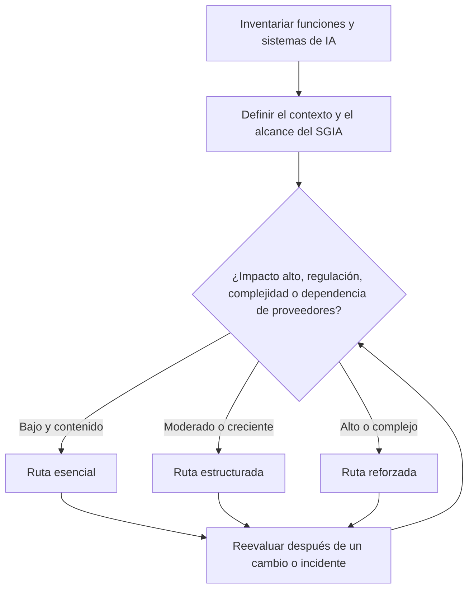
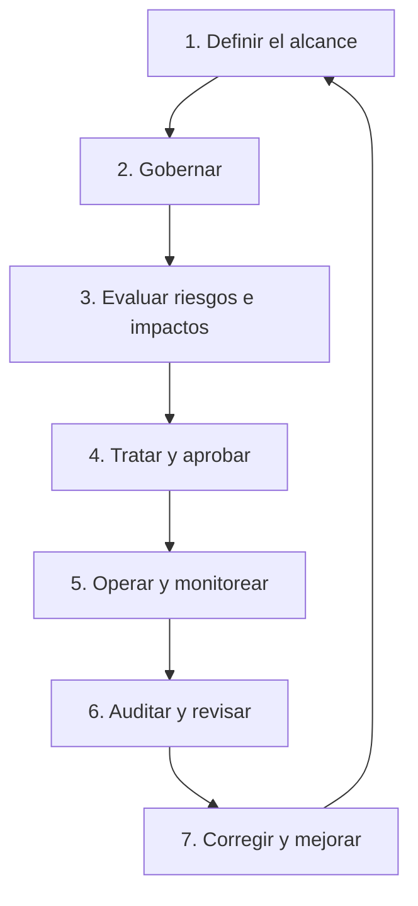
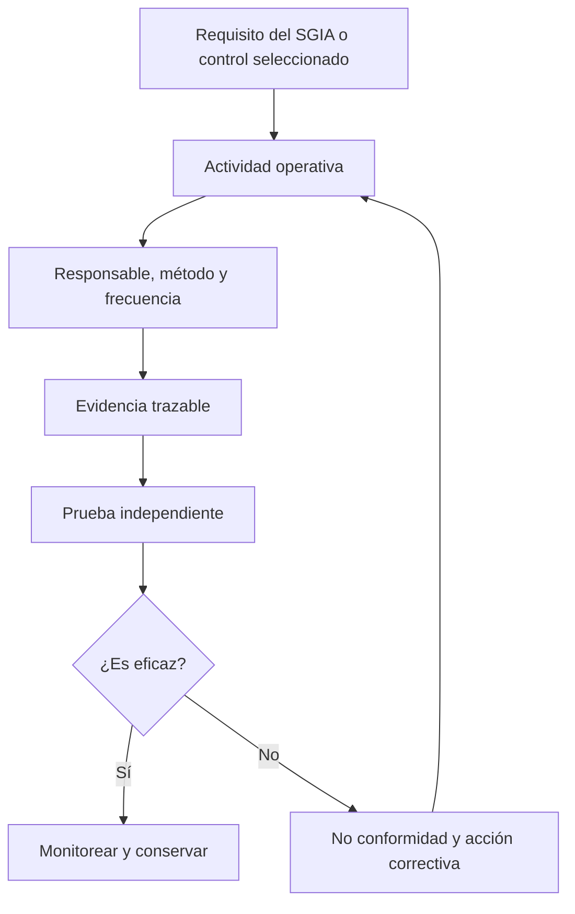

# Manual 02 — Rutas de implementación de ISO/IEC 42001 para organizaciones de todos los tamaños

**Idioma fuente controlado:** inglés

**Idioma de localización:** español neutro de América Latina (`es-419`)

**Audiencia:** organizaciones que proveen, desarrollan, adquieren, despliegan, operan o utilizan sistemas de IA

**Creador humano responsable:** Alberto “Al” Leiva

Este punto de entrada convierte un sistema de gestión de la inteligencia artificial (SGIA) en trabajo práctico para organizaciones con distintos recursos y perfiles de riesgo. El tamaño influye en la dotación de personal y el grado de formalidad, pero nunca sustituye el análisis del riesgo y el impacto de la IA, las obligaciones legales, la complejidad del sistema, la sensibilidad de los datos ni la dependencia de proveedores.

Todas las rutas abarcan liderazgo, evaluación de riesgos, control operativo, evaluación del desempeño, acciones correctivas y mejora continua. La diferencia está en la profundidad, independencia, especialización y vigilancia necesarias para el riesgo real de la organización.

Utilice publicaciones ISO autorizadas como fuente normativa. Esta guía es orientación educativa original para la implementación; no reproduce las normas ISO ni demuestra conformidad o certificación.

## 1. Elija la ruta según el riesgo y la complejidad

Comience por las funciones de IA de la organización, los sistemas, los usos previstos, las personas afectadas, los datos, los proveedores y las jurisdicciones operativas. Después elija la ruta más ligera que todavía pueda controlar el riesgo real.

**Explicación accesible:** La organización primero inventaría sus funciones y sistemas de IA y define el contexto y alcance del SGIA. El riesgo, el impacto, la regulación, la complejidad y la dependencia de proveedores determinan si corresponde la ruta esencial, estructurada o reforzada. Los cambios y los incidentes devuelven la decisión a una nueva evaluación.

### Ruta esencial

Suele ser apropiada para una micro o pequeña organización con pocos usos de IA de menor impacto y dependencias manejables.

Resultados operativos mínimos:

- una persona ejecutiva responsable y una persona coordinadora del SGIA;
- un inventario de IA dentro del alcance, con responsables y finalidades previstas;
- evaluaciones documentadas y diferenciadas de riesgo y de impacto antes de la aprobación;
- una política concisa de IA y reglas de uso aceptable;
- revisión de proveedores y protecciones contractuales mínimas;
- registros de aprobación, monitoreo, incidentes, cambios y retiro;
- una Declaración de Aplicabilidad proporcional con sus justificaciones;
- revisión interna periódica por una persona independiente del trabajo evaluado; y
- evidencia de revisión por la dirección y de acciones correctivas.

Una misma persona puede desempeñar varias funciones, pero no debería aprobar y auditar de forma independiente el mismo trabajo sin una salvaguarda alternativa.

### Ruta estructurada

Suele ser apropiada para una organización mediana, varias unidades de negocio, datos personales o confidenciales relevantes, varios proveedores o decisiones de IA de impacto moderado.

Agregue:

- un comité formal del SGIA y derechos de decisión documentados;
- métodos para evaluar riesgos, impactos, datos, seguridad, privacidad y proveedores;
- una biblioteca integrada de controles y un registro de evidencia;
- requisitos de competencia y capacitación basados en las funciones;
- puertas de liberación, umbrales de monitoreo, activadores de cambio y ejercicios de incidentes;
- un programa anual de auditoría interna basado en riesgos;
- no conformidades, causas raíz, remediaciones y pruebas de eficacia con seguimiento; y
- métricas ejecutivas sobre inventario, riesgo, operación de controles, incidentes y acciones vencidas.

### Ruta reforzada

Suele ser apropiada para una empresa grande o compleja, usos de alto impacto o regulados, dependencias de modelos fundacionales o IA agéntica, sistemas relacionados con la seguridad, operaciones globales o efectos significativos sobre las personas.

Agregue:

- supervisión del órgano de gobierno y responsabilidad basada en tres líneas;
- pruebas independientes de modelos, datos, seguridad, privacidad, equidad, robustez y supervisión humana;
- monitoreo continuo de controles y del desempeño de los modelos;
- autoridad formal para cuestionar, escalar, detener el uso y aceptar riesgos;
- agregación de riesgos a nivel de cartera y de sistema;
- análisis de concentración de proveedores y cuartas partes;
- mapeos legales y regulatorios por jurisdicción y función;
- aseguramiento independiente y revisiones de preparación para la certificación; y
- ejercicios de respuesta ante crisis, autoridades, clientes y personas afectadas.

## 2. Implemente el SGIA como un ciclo operativo repetible

El SGIA no es un proyecto documental de una sola vez. Cada puerta debe producir una decisión, una persona responsable y evidencia que luego pueda someterse a pruebas.

**Explicación accesible:** El ciclo de implementación define el alcance, establece el gobierno, evalúa riesgos e impactos, selecciona el tratamiento y la aprobación, opera y monitorea los controles, realiza la auditoría y la revisión por la dirección, y utiliza las acciones correctivas para mejorar el ciclo siguiente.

### Puerta 1 — Definir el alcance

Documente los límites organizacionales, las funciones de IA, los productos y servicios cubiertos, las actividades del ciclo de vida, los datos, las ubicaciones, los proveedores, las partes interesadas, las interfaces y las exclusiones justificadas.

### Puerta 2 — Gobernar

Apruebe la política, los objetivos, los criterios de riesgo, los activadores de evaluación de impacto, los derechos de decisión, los recursos, las expectativas de competencia, las comunicaciones y los requisitos de información documentada controlada.

### Puerta 3 — Evaluar riesgos e impactos

Identifique beneficios, daños y fallas razonablemente previsibles, incertidumbre, personas afectadas, amenazas para los datos y la seguridad, dependencias de proveedores, controles existentes y exposición residual.

### Puerta 4 — Tratar y aprobar

Seleccione controles, documente la Declaración de Aplicabilidad, asigne responsables y plazos, defina criterios de aceptación, atienda el riesgo no resuelto y registre una decisión autorizada.

### Puerta 5 — Operar y monitorear

Ejecute los procesos aprobados, conserve evidencia, pruebe umbrales, monitoree cambios, gestione incidentes y quejas, verifique obligaciones de proveedores y vuelva a evaluar después de los activadores definidos.

### Puerta 6 — Auditar y revisar

Utilice revisores competentes e imparciales para comprobar la conformidad y la eficacia. La dirección evalúa el desempeño, los cambios, los recursos, los hallazgos, los riesgos, las oportunidades y las decisiones de mejora.

### Puerta 7 — Corregir y mejorar

Contenga los problemas, corrija sus consecuencias, determine las causas, implemente acciones, pruebe su eficacia, actualice los riesgos y controles, y comparta las lecciones sin ocultar los resultados desfavorables.

## 3. Asigne funciones responsables sin suponer una plantilla grande

| Responsabilidad | Esencial | Estructurada | Reforzada |
|---|---|---|---|
| Dirección y aceptación de riesgos | Patrocinador ejecutivo | Comité ejecutivo | Órgano de gobierno y ejecutivos responsables |
| Coordinación del SGIA | Coordinador designado | Gerente o líder de programa dedicado | Oficina empresarial del SGIA |
| Propiedad del sistema | Responsable del negocio | Corresponsables de negocio y tecnología | Responsables de cartera, producto, modelo y despliegue |
| Evaluación de riesgos e impactos | Revisión interdisciplinaria según sea necesario | Revisores multidisciplinarios permanentes | Funciones especialistas independientes y participación de personas afectadas |
| Operación de controles | Responsables de control designados | Responsables con calendario de evidencia | Responsables federados con monitoreo continuo |
| Auditoría interna | Persona calificada e independiente o apoyo externo | Programa de auditoría interna basado en riesgos | Función independiente con competencia especializada en IA |
| Revisión por la dirección | Revisión del patrocinador | Revisión ejecutiva programada | Ciclo de supervisión del órgano de gobierno y la dirección |

Externalizar trabajo no externaliza la responsabilidad. Los contratos, consultores, herramientas y organismos de certificación apoyan al SGIA, pero no son propietarios de las decisiones de la dirección.

## 4. Construya los registros controlados mínimos

Cada organización debería mantener, como mínimo:

1. registro del contexto, las partes interesadas y el alcance del SGIA;
2. inventario de IA con función, responsable, finalidad, estado, datos, proveedor y riesgo;
3. política, objetivos, derechos de decisión y registros de competencia;
4. método de riesgos y oportunidades y evaluaciones completadas;
5. método de evaluación de impacto de sistemas de IA y evaluaciones completadas;
6. plan de tratamiento y Declaración de Aplicabilidad;
7. evidencia del ciclo de vida, datos, proveedores, transparencia y uso responsable;
8. registros de monitoreo, medición, incidentes, quejas, cambios y retiro;
9. programa, planes, papeles de trabajo, hallazgos y seguimiento de auditoría interna;
10. entradas, decisiones, responsables y plazos de la revisión por la dirección; y
11. evidencia de no conformidades, causas raíz, acciones correctivas y comprobación de eficacia.

## 5. Conecte los requisitos con la evidencia y el aseguramiento

**Explicación accesible:** Un requisito del SGIA o un control seleccionado se convierte en una actividad operativa con responsable, método y frecuencia. La actividad produce evidencia trazable para una prueba independiente. Los controles eficaces continúan bajo monitoreo; los ineficaces generan una no conformidad y una acción correctiva que vuelve a la actividad operativa.

La evidencia debe ser auténtica, suficientemente completa para sustentar la conclusión, estar protegida contra cambios indebidos, vinculada con el sistema y período correctos y conservada durante un plazo aprobado.

## 6. Mida si la implementación funciona

Utilice métricas que revelen el desempeño de los controles y no el volumen de documentos:

- porcentaje de sistemas de IA con responsable, finalidad, nivel de riesgo y estado vigentes;
- evaluaciones de riesgos o impactos vencidas;
- sistemas que operan fuera de las condiciones aprobadas;
- pruebas de controles aprobadas, fallidas o no completadas;
- brechas no resueltas de evidencia y contratos de proveedores;
- incidentes, quejas, anulaciones y decisiones de detener el uso;
- umbrales de monitoreo superados y tiempo de respuesta;
- no conformidades vencidas y antigüedad de las acciones correctivas;
- hallazgos repetidos y pruebas de eficacia fallidas;
- decisiones de la revisión por la dirección completadas dentro del plazo; y
- cambios que activaron una reevaluación oportuna.

## 7. Preserve los límites de las normas y del aseguramiento

El registro de fuentes controladas identifica las páginas oficiales vigentes con estos identificadores:

- `iso-iec-42001-2023` — requisitos y orientación para el SGIA;
- `iso-iec-42005-2025` — orientación para la evaluación de impacto de sistemas de IA;
- `iso-iec-42006-2025` — requisitos adicionales para organismos que auditan y certifican SGIA;
- `iso-iec-23894-2023` — orientación para la gestión de riesgos de IA; y
- `iso-19011-2026` — orientación para auditorías de sistemas de gestión.

El registro también controla `iso-iec-22989-2022`, `iso-iec-23053-2022`, `iso-iec-38507-2022`, `iso-iec-27001-2022` e `iso-iec-27001-2022-amd1-2024`. La fuente de apoyo para certificación `iso-iec-17021-1-2015` continúa publicada, pero está en revisión sistemática.

No afirme que:

- el uso de este manual demuestra conformidad;
- implementar una herramienta satisface automáticamente un requisito;
- la certificación demuestra que todo sistema de IA es seguro, legal, imparcial, protegido o eficaz;
- ISO/IEC 42006 impone requisitos directamente a toda organización que busca certificarse; o
- la certificación ISO/IEC 42001 por sí sola demuestra cumplimiento de la Ley de IA de la UE u otra ley.

## 8. Primeros 90 días

| Período | Resultado mínimo |
|---|---|
| Días 1–30 | Patrocinador, coordinador del SGIA, alcance inicial, inventario de IA, restricciones urgentes, registro de fuentes y ubicación de la evidencia |
| Días 31–60 | Política, objetivos, funciones, métodos de riesgo e impacto, evaluaciones iniciales, controles de proveedores y prioridades de tratamiento |
| Días 61–90 | Declaración de Aplicabilidad, controles prioritarios implementados, plan de monitoreo, registros de competencia, programa de auditoría y primera revisión por la dirección |

Después del día 90, complete el plan de tratamiento restante, pruebe la eficacia operativa, cierre las no conformidades prioritarias, vuelva a evaluar después de cambios y prepárese para un aseguramiento independiente solo cuando el SGIA cuente con suficiente historial operativo y evidencia.

---

El QA del repositorio comprueba la estructura, la paridad estructural automatizada y la integridad de las fuentes controladas. No proporciona certificación, asesoría legal ni una opinión de auditoría.
