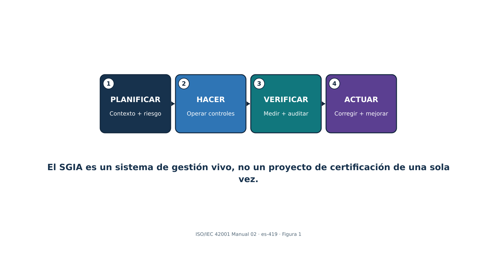
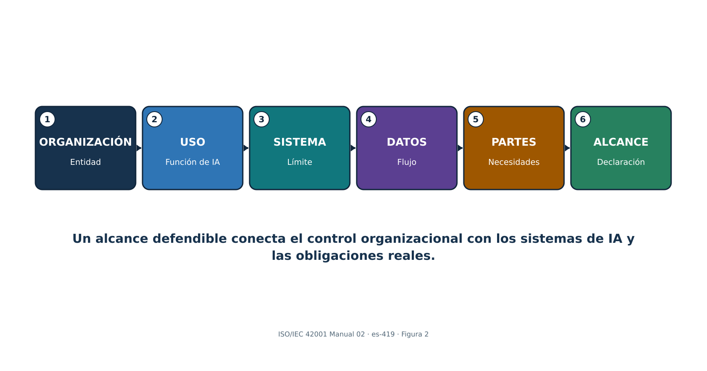
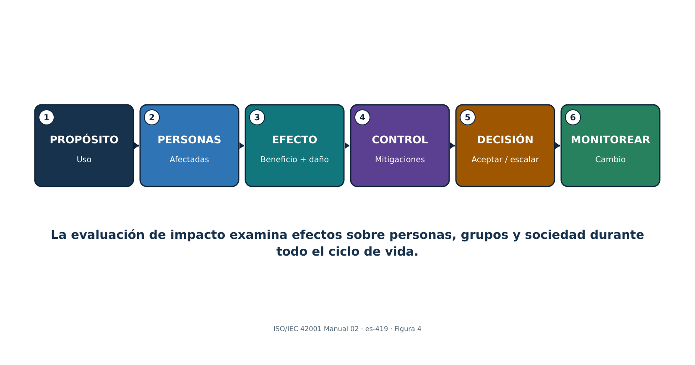
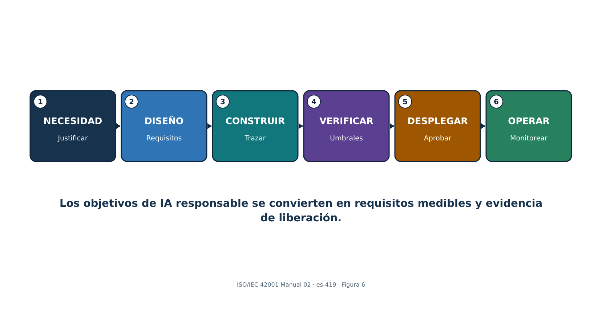
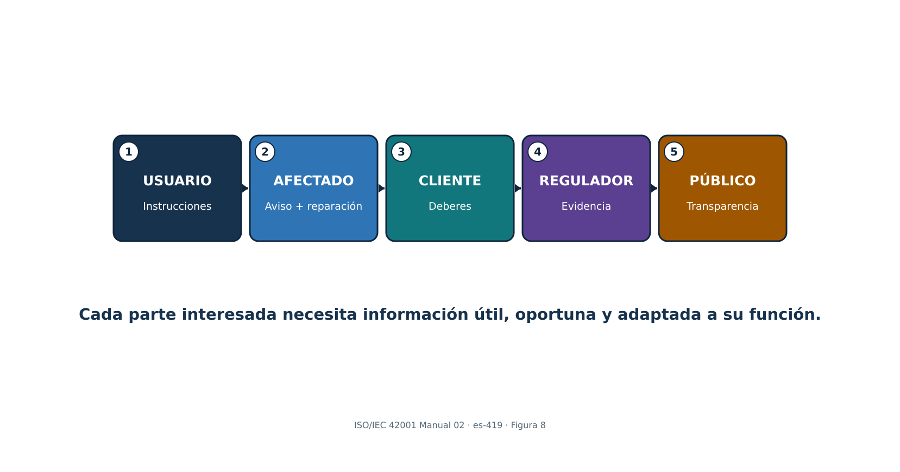
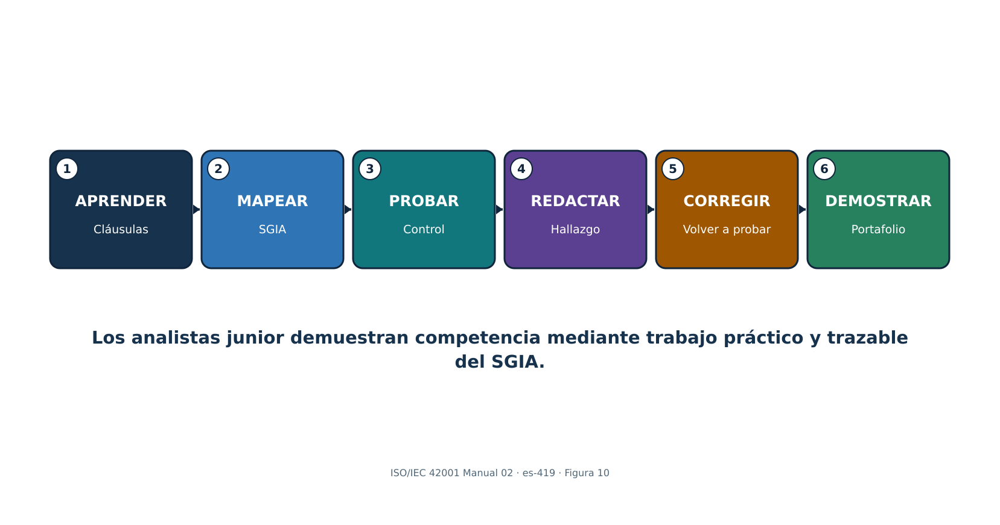

> **Control de publicación: Este documento es un borrador derivado mecánicamente de los cuatro archivos fuente localizados de la rama indicada. Requiere revisión semántica humana. No es una traducción autorizada por ISO y su generación no demuestra certificación, conformidad, cumplimiento legal ni aseguramiento de auditoría. La asistencia de IA se utilizó conforme a la divulgación del repositorio; la autoría y responsabilidad humana permanecen con Alberto (Al) Leiva.**

> **Source control:** `build/iso-iec-42001-manual-02-2026` @ `b1ddffa6a33376ec72db570d8437f996cf61b97d` · 2026-08-24 · First Edition / v1.0

| **Qué hace este manual:** Explica cómo establecer, implementar, operar, auditar, preparar para certificación y mejorar un sistema de gestión de inteligencia artificial. Desglosa las cláusulas 4–10, los nueve grupos de controles del Anexo A, la evaluación de riesgos e impactos, la Declaración de Aplicabilidad, la certificación, la evidencia, las herramientas, las decisiones de gestión y el trabajo del analista junior. |
|---|

**Alberto (Al) Leiva**

Primera edición • julio de 2026

> **Estado de localización:** Fuente localizada en español de América Latina (`es-419`). Esta parte cubre los preliminares y los capítulos 1–8 del maestro controlado en inglés. Debe utilizarse junto con las demás partes localizadas hasta que se genere el maestro consolidado y los artefactos DOCX/PDF. No constituye una traducción oficial de ISO.

# Prefacio

ISO/IEC 42001 ayuda a las organizaciones a gobernar la inteligencia artificial mediante un sistema de gestión de alcance organizacional. No certifica que cada resultado sea correcto ni que cada sistema de IA sea seguro. Exige liderazgo, contexto, planificación basada en riesgos, recursos, controles operacionales, evaluación del desempeño, acción correctiva y mejora continua en torno al desarrollo, provisión o uso responsable de sistemas de IA.

Este manual explica los conceptos con redacción original y no reproduce la norma protegida por derechos de autor. Obtenga una copia autorizada de ISO/IEC 42001:2023 y de cualquier norma que utilice para implementación o auditoría. La certificación, las leyes, los deberes sectoriales, los contratos y el riesgo técnico deben evaluarse frente al alcance y los hechos reales de la organización.

| **Nota sobre vigencia de la información:** Verificado el 24 de agosto de 2026. ISO/IEC 42001:2023 continúa siendo la norma publicada de requisitos para SGIA. ISO/IEC 42005:2025 proporciona orientación para la evaluación de impacto de sistemas de IA. ISO/IEC 42006:2025 añade requisitos para los organismos que auditan y certifican SGIA. ISO 19011:2026 es la guía vigente para auditorías de sistemas de gestión. ISO/IEC 42003 continúa como tema de trabajo aprobado e ISO/IEC 42007 ha avanzado a la etapa de borrador de norma internacional; ambas continúan en desarrollo y aquí no se tratan como requisitos. |
|---|

## Cómo utilizar este manual

- Líderes y responsables del SGIA: comiencen por los capítulos 1–10, 16–20 y 29–31.
- Equipos de implementación y GRC: estudien el contenido en orden y utilicen todas las plantillas del capítulo 32.
- Equipos de IA, datos, producto, seguridad, privacidad y legal: concéntrense en los capítulos 6–15 y 20–28.
- Auditores internos: concéntrense en los capítulos 16–20 y 29, y después practiquen el laboratorio del capítulo 31.
- Analistas junior: aprendan la intención de las cláusulas, produzcan evidencia, redacten hallazgos y nunca afirmen una certificación ni autoridad de auditor que no posean.

# Tabla de contenido

El archivo fuente en Word contiene una tabla de contenido nativa y una guía permanente de capítulos con páginas. En esta edición Markdown localizada, la guía de capítulos conserva el orden del maestro controlado.

# Guía de capítulos

| **Capítulo** | **Título** | **Página de inicio en el maestro inglés** |
|---:|---|---:|
| 1 | ISO/IEC 42001 y el sistema de gestión de inteligencia artificial | 5 |
| 2 | Arquitectura del SGIA y ciclo Planificar-Hacer-Verificar-Actuar | 6 |
| 3 | Aplicabilidad, funciones organizacionales y hoja de ruta de implementación | 7 |
| 4 | Cláusula 4: Contexto de la organización | 9 |
| 5 | Cláusula 5: Liderazgo | 10 |
| 6 | Cláusula 6.1: Acciones para abordar riesgos y oportunidades | 11 |
| 7 | Cláusula 6.1.2: Evaluación de riesgos de IA | 12 |
| 8 | Cláusula 6.1.3: Tratamiento del riesgo de IA y Declaración de Aplicabilidad | 14 |
| 9 | Cláusula 6.1.4: Evaluación de impacto de sistemas de IA | 15 |
| 10 | Cláusulas 6.2 y 6.3: Objetivos y planificación de cambios | 17 |
| 11 | Cláusula 7.1: Recursos | 18 |
| 12 | Cláusulas 7.2–7.4: Competencia, toma de conciencia y comunicación | 19 |
| 13 | Cláusula 7.5: Información documentada | 20 |
| 14 | Cláusula 8.1: Planificación y control operacional | 21 |
| 15 | Cláusulas 8.2–8.4: Riesgo operacional, tratamiento y evaluación de impacto | 22 |
| 16 | Cláusula 9.1: Seguimiento, medición, análisis y evaluación | 23 |
| 17 | Cláusula 9.2: Auditoría interna | 24 |
| 18 | Cláusula 9.3: Revisión por la dirección | 26 |
| 19 | Cláusula 10: No conformidad, acción correctiva y mejora continua | 27 |
| 20 | Anexos A–D y la Declaración de Aplicabilidad | 28 |
| 21 | Anexo A.2: Políticas relacionadas con IA | 29 |
| 22 | Anexo A.3: Organización interna | 30 |
| 23 | Anexo A.4: Recursos para sistemas de IA | 31 |
| 24 | Anexo A.5 e ISO/IEC 42005: Evaluación de impacto de sistemas de IA | 32 |
| 25 | Anexo A.6: Ciclo de vida del sistema de IA | 33 |
| 26 | Anexo A.7: Datos para sistemas de IA | 34 |
| 27 | Anexo A.8: Información para partes interesadas | 36 |
| 28 | Anexos A.9 y A.10: Uso responsable, proveedores y clientes | 38 |
| 29 | Certificación, ISO/IEC 42006:2025 y preparación para auditoría | 40 |
| 30 | Herramientas de código abierto para evidencia del SGIA y aseguramiento de IA | 42 |
| 31 | Guía práctica para responsables y analistas junior, laboratorio y entrevistas | 47 |
| 32 | Plantillas, glosario, índice y referencias oficiales | 51 |

# 1. ISO/IEC 42001 y el sistema de gestión de inteligencia artificial

*ISO/IEC 42001 especifica requisitos para que una organización establezca, implemente, mantenga y mejore continuamente un sistema de gestión de inteligencia artificial.*

| **Concepto** | **Significado sencillo** | **Pregunta de evidencia** |
|---|---|---|
| SGIA | Políticas, objetivos, procesos, funciones, controles y registros interrelacionados para una IA responsable | ¿El sistema funciona en todo el alcance definido? |
| Función de la organización | Desarrollador/proveedor, implementador/usuario, proveedor, cliente o varias funciones | ¿Qué responsabilidades están bajo control? |
| Sistema de IA | Personas, datos, modelos, software, infraestructura, procesos e interfaces utilizados para producir un resultado de IA | ¿Cuál es el límite completo? |
| Conformidad | Los requisitos se cumplen dentro del alcance certificado | ¿Qué cláusula, implementación, evidencia y resultado respaldan la afirmación? |
| Certificación | Evaluación independiente de tercera parte del SGIA frente a ISO/IEC 42001 | ¿Qué entidad, alcance, norma, organismo, fechas y estado están certificados? |

## 1.1 Lo que la certificación no demuestra

- No garantiza que cada resultado de IA sea preciso, imparcial, protegido frente a amenazas, lícito, seguro para las personas o explicable.
- No certifica individualmente productos de IA salvo que el alcance del SGIA certificado y el esquema respalden explícitamente esa afirmación.
- No sustituye las pruebas de producto, el análisis legal, la evaluación de impacto, los controles de privacidad y seguridad, la validación de dominio ni la supervisión humana.
- No transfiere la rendición de cuentas de la organización al organismo de certificación ni al proveedor.

# 2. Arquitectura del SGIA y ciclo Planificar-Hacer-Verificar-Actuar

*El SGIA sigue la estructura armonizada de los sistemas de gestión y un ciclo continuo Planificar-Hacer-Verificar-Actuar (PHVA).*

{width=6.15in height=3.23274in}

Figura 1. Ciclo PHVA del SGIA

> **Explicación accesible:** La figura muestra que el SGIA opera como un ciclo. La organización planifica el contexto, los riesgos, los impactos y los objetivos; ejecuta controles y procesos; verifica el desempeño mediante medición, auditoría interna y revisión por la dirección; y actúa sobre no conformidades y oportunidades de mejora antes de reiniciar el ciclo.

| **Etapa PHVA** | **Trabajo de ISO/IEC 42001** | **Resultado típico** |
|---|---|---|
| Planificar | Contexto, liderazgo, riesgo/oportunidad, evaluación, tratamiento, objetivos y recursos | Alcance, política, métodos, registro de riesgos, proceso de impacto, Declaración de Aplicabilidad y objetivos |
| Hacer | Competencia, comunicación, documentación, controles operacionales y evaluaciones | Procedimientos, registros del sistema, aprobaciones y evidencia de proveedores y ciclo de vida |
| Verificar | Seguimiento, medición, análisis, auditoría interna y revisión por la dirección | Métricas, evaluación, informe de auditoría y decisiones de revisión |
| Actuar | No conformidad, corrección, causa raíz, acción correctiva y mejora | Registros de acciones, pruebas de eficacia y actualización de riesgos, controles y objetivos |

## 2.1 Integración con sistemas existentes

- Reutilice los procesos de gobierno, control documental, riesgo, auditoría, acción correctiva, proveedores, seguridad, privacidad, calidad y continuidad cuando su alcance y controles sean adecuados para el riesgo de IA.
- Cree adiciones específicas de IA para evaluación de impacto, ciclo de vida de modelos y datos, uso responsable, transparencia, supervisión humana y responsabilidades de la cadena de valor.
- Mantenga una sola fuente de verdad y mapéela a ISO/IEC 27001:2022, ISO 9001, privacidad, obligaciones legales, NIST AI RMF y deberes sectoriales en vez de duplicar registros.

# 3. Aplicabilidad, funciones organizacionales y hoja de ruta de implementación

*Una implementación útil comienza con control organizacional, un inventario de IA exacto, funciones responsables y una hoja de ruta por etapas.*

{width=6.15in height=3.23274in}

Figura 2. Cadena para construir el alcance

> **Explicación accesible:** La figura representa la construcción del alcance desde la organización y sus funciones de IA hasta los sistemas, datos, proveedores, interfaces y exclusiones. Cada límite debe tener una justificación que no evite requisitos aplicables.

| **Función** | **Responsabilidad principal** |
|---|---|
| Órgano de gobierno / ejecutivos | Supervisión, dirección, recursos, apetito de riesgo y decisiones materiales |
| Líder del SGIA | Coordinar el sistema de gestión, desempeño, auditorías y mejora |
| Propietario de negocio/sistema de IA | Propósito, resultado, proceso afectado, riesgo, aprobación y seguimiento |
| Modelo/datos/producto/ingeniería | Requisitos, diseño, datos, evaluación, despliegue y cambio |
| Seguridad/privacidad/legal/cumplimiento/seguridad funcional | Requisitos especializados, revisión, cuestionamiento e incidentes |
| Compras/gestor de proveedores | Debida diligencia, asignación de responsabilidades, contratos, evidencia, seguimiento y salida |
| Auditoría interna | Evaluación independiente y objetiva sin ser propietaria de los controles |

## 3.1 Hoja de ruta de implementación

- Autorice el programa y obtenga las normas; defina propósito, patrocinador, recursos y gobierno.
- Inventaríe sistemas de IA y funciones; realice análisis de contexto y partes interesadas; redacte el alcance y la política.
- Defina procesos de riesgo, impacto, tratamiento, Declaración de Aplicabilidad, objetivos, documentos, competencia, comunicación y operación.
- Implemente los controles del Anexo A y controles adicionales según el riesgo; recopile evidencia durante la operación real.
- Mida el desempeño; complete la auditoría interna y la revisión por la dirección; corrija no conformidades y verifique la eficacia.
- Seleccione un organismo de certificación competente; complete Etapa 1 y Etapa 2; mantenga vigilancia y mejora.

# 4. Cláusula 4: Contexto de la organización

*La cláusula 4 establece por qué existe el SGIA, quién importa, qué cubre y cómo interactúan sus procesos.*

## 4.1 Cuestiones internas y externas

- Estrategia, cultura, gobierno, apetito de riesgo, recursos, competencia, madurez de datos, arquitectura tecnológica, sistemas de gestión existentes y cambio organizacional.
- Leyes, regulación, expectativas sectoriales, contratos, requisitos de clientes, normas, confianza pública, preocupaciones sociales, mercados, proveedores, amenazas, cambios tecnológicos o de modelos y cuestiones climáticas cuando sean pertinentes para los resultados previstos del SGIA.
- Registre por qué cada cuestión es relevante, su responsable, el efecto sobre el SGIA, la respuesta y el disparador de revisión.

## 4.2 Partes interesadas y requisitos

- Identifique a las personas y grupos afectados por la IA, aunque no sean usuarios ni clientes directos.
- Incluya, según corresponda, reguladores, clientes, trabajadores, usuarios, titulares de datos, proveedores, socios, comunidades, accionistas, auditores, aseguradoras y público.
- Separe necesidades y expectativas de las obligaciones de cumplimiento vinculantes; registre autoridad/fuente, sistema/proceso, responsable, evidencia y seguimiento de cambios.
- Determine qué requisitos abordará la organización mediante el SGIA.

## 4.3 Declaración de alcance

| **Elemento del alcance** | **Claridad requerida** |
|---|---|
| Organización | Entidades legales, unidades de negocio, ubicaciones y funciones |
| Función de IA | Desarrollador/proveedor, implementador/usuario, servicio/proveedor o combinación |
| Productos/servicios/procesos | Ofertas habilitadas por IA y usos internos |
| Tecnología y datos | Sistemas, modelos, entornos, interfaces y conjuntos de datos clave |
| Límites/dependencias | Servicios compartidos, proveedores, clientes y exclusiones |
| Justificación | Por qué los límites son válidos y no eluden requisitos aplicables |

## 4.4 Procesos del SGIA

- Defina propósito del proceso, entradas, salidas, secuencia, interacción, propietario, criterios, controles, recursos, registros, medidas, riesgos y mejora.
- Un mapa de procesos debe conectar inventario, riesgo, impacto, tratamiento, objetivos, ciclo de vida, datos, proveedores, uso, seguimiento, incidentes, auditoría, revisión y acción correctiva.

# 5. Cláusula 5: Liderazgo

*La alta dirección debe asumir la responsabilidad del SGIA, la política, la integración, los recursos, la comunicación, el desempeño y las funciones responsables.*

## 5.1 Demostración de liderazgo

- Haga que los objetivos del SGIA sean compatibles con la estrategia y los compromisos de IA responsable.
- Integre los requisitos del SGIA en procesos de negocio, producto, compras, datos, tecnología, personas, riesgo y cambio.
- Proporcione personas competentes, tiempo, herramientas, datos, infraestructura, presupuesto, cuestionamiento independiente y autoridad.
- Comunique que la gestión eficaz de IA y la conformidad son importantes, incluso cuando la presión de entrega entre en conflicto con los controles.
- Revise el desempeño y apoye a las personas que contribuyen a la mejora o plantean preocupaciones.
- Asegure que se logren los resultados previstos en lugar de tratar la certificación como el único resultado.

## 5.2 Política de IA

- Declare propósito, principios, compromisos con requisitos aplicables, IA responsable basada en riesgos, objetivos y mejora continua.
- Adapte la política a las funciones de IA, contexto, cultura, impacto, ley, productos y apetito de riesgo de la organización.
- Alinee seguridad, privacidad, calidad, datos, ética, RR. HH., compras, producto, registros, seguridad funcional e incidentes.
- Apruebe al nivel adecuado, comunique a las personas pertinentes, póngala a disposición según corresponda y revísela a intervalos planificados y después de cambios materiales.

## 5.3 Funciones, responsabilidades y autoridades

- Defina la responsabilidad por el SGIA y por informar su desempeño a la alta dirección.
- Asigne propietarios para cada sistema de IA, riesgo, impacto, fuente de datos, modelo, proveedor, control, métrica, incidente, cambio y acción correctiva.
- Defina autoridad de aprobación y escalamiento; evite conflictos donde el mismo equipo crea, valida, acepta y audita riesgos de alto impacto sin cuestionamiento suficiente.

# 6. Cláusula 6.1: Acciones para abordar riesgos y oportunidades

*La planificación convierte el contexto en riesgos, oportunidades, controles, objetivos y cambios gestionados.*

## 6.1 Entradas de planificación

- Contexto y requisitos de partes interesadas; alcance y procesos del SGIA.
- Inventario de IA, funciones del sistema, etapa del ciclo de vida, personas afectadas, datos, modelos, proveedores, integraciones y condiciones de uso.
- Beneficios y oportunidades estratégicas, junto con amenazas, fallas, daños, incertidumbre y uso indebido razonablemente previsible.
- Obligaciones legales, regulatorias, contractuales, de seguridad, privacidad, seguridad funcional, calidad, registros, accesibilidad, empleo, propiedad intelectual, consumo y sectoriales aplicables.

## 6.1.1 Acciones sobre riesgos y oportunidades

- Planifique acciones proporcionales al efecto sobre los resultados del SGIA; intégrelas en los procesos en lugar de mantener únicamente un registro separado.
- Defina acción, propietario, recurso, fecha, medida, evidencia, dependencia, decisión residual y evaluación de eficacia.
- Las oportunidades pueden incluir mejor supervisión, calidad de datos, transparencia, evaluación, competencia, eficiencia, confianza de partes interesadas e innovación.
- Evite que los controles previstos creen nuevos riesgos, como vigilancia excesiva, avisos inaccesibles o sobrecarga de revisión.

# 7. Cláusula 6.1.2: Evaluación de riesgos de IA

*El proceso de evaluación de riesgos de IA debe utilizar criterios definidos y repetibles para identificar, analizar, evaluar y priorizar riesgos.*

{width=6.15in height=3.23274in}

Figura 3. Flujo de evaluación de riesgos de IA

> **Explicación accesible:** La evaluación parte de un escenario de riesgo definido, analiza contexto, probabilidad, consecuencias, incertidumbre y controles existentes, compara el resultado con criterios establecidos, selecciona tratamiento y conserva evidencia para una decisión residual autorizada y una futura reevaluación.

## 7.1 Método de riesgo

- Defina alcance, unidad de análisis, categorías de riesgo, dimensiones de impacto, probabilidad, gravedad, escala, duración, reversibilidad, grupos afectados, incertidumbre, agregación, tolerancia y autoridad de decisión.
- Identifique escenarios de riesgo sobre uso previsto, uso indebido previsible, falla, ataque, datos, modelo, comportamiento humano, proveedores, entorno, ley y efecto social.
- Analice el riesgo inherente y los controles existentes con evidencia; distinga riesgo actual, objetivo y residual.
- Evalúe frente a criterios; priorice el tratamiento según las consecuencias para personas y negocio, no mediante una sola puntuación técnica.
- Asegure resultados coherentes, válidos y comparables y conserve la evaluación como información documentada.
- Reevalúe a intervalos planificados y después de cambios materiales, incidentes, nuevos grupos afectados, actualizaciones de modelos/proveedores, deriva, cambios legales o fallas de control.

| **Registro de riesgo** | **Detalle mínimo** |
|---|---|
| Escenario | Causa/actor, condición vulnerable, evento/acción, comportamiento del sistema, parte afectada y consecuencia |
| Contexto | Uso, personas, geografía, escala, datos, modelo/versión, herramientas, proveedor y supuestos |
| Análisis | Probabilidad, dimensiones de impacto, incertidumbre, evidencia y eficacia de controles existentes |
| Tratamiento | Evitar/reducir/compartir/aceptar, controles, propietario, fecha, medida y riesgo residual |
| Decisión | Aprobador autorizado, justificación, condiciones, vencimiento, seguimiento y disparador de revisión |

# 8. Cláusula 6.1.3: Tratamiento del riesgo de IA y Declaración de Aplicabilidad

*El tratamiento del riesgo selecciona controles, los compara con el Anexo A, produce la Declaración de Aplicabilidad y obtiene aprobación del riesgo residual.*

## 8.1 Proceso de tratamiento

- Elija opciones de tratamiento: evitar, cambiar/reducir, compartir/transferir, aceptar dentro de la autoridad o realizar un piloto estrictamente limitado para reducir incertidumbre.
- Determine los controles necesarios a partir de requisitos legales y contractuales, resultados de riesgo e impacto de IA, arquitectura, partes interesadas y objetivos.
- Compare los controles seleccionados con el Anexo A para verificar que no se haya omitido ningún control de referencia pertinente.
- Añada controles más allá del Anexo A cuando sean necesarios para seguridad, privacidad, seguridad funcional, calidad, evaluación técnica, accesibilidad, resiliencia u obligaciones sectoriales.
- Cree y apruebe un plan de tratamiento y obtenga autorización para el riesgo residual.
- Conserve los resultados y cambios del tratamiento como información documentada controlada.

## 8.2 Campos de la Declaración de Aplicabilidad

| **Campo** | **Propósito** |
|---|---|
| Referencia/título del control | Identidad del control del Anexo A o adicional |
| ¿Aplicable? | Incluido o excluido para el alcance definido del SGIA |
| Justificación | Riesgo, obligación, objetivo, arquitectura o razón de exclusión |
| Implementación | Política/proceso/sistema y propietario responsable |
| Estado | Implementado, parcial, planificado o no aplicable |
| Evidencia/prueba | Evidencia actual y resultado de eficacia operacional |
| Dependencias/brechas | Controles compartidos de proveedor/cliente y hallazgos |
| Revisión | Última/próxima revisión y disparadores de cambio |

| **Advertencia sobre la Declaración de Aplicabilidad:** No es una lista de verificación copiada. Debe concordar con el alcance vigente, las evaluaciones de riesgo e impacto, el plan de tratamiento, la implementación real, la evidencia y las decisiones de riesgo. |
|---|

# 9. Cláusula 6.1.4: Evaluación de impacto de sistemas de IA

*La evaluación de impacto de sistemas de IA examina cómo un sistema de IA puede afectar a personas, grupos y a la sociedad a lo largo de su ciclo de vida.*

{width=6.15in height=3.23274in}

Figura 4. Evaluación de impacto de sistemas de IA

> **Explicación accesible:** La evaluación parte del propósito y contexto del sistema, identifica personas y grupos afectados, examina beneficios y efectos adversos directos, indirectos y sociales, valora gravedad, escala, duración, reversibilidad e incertidumbre, y convierte las mitigaciones en decisiones, supervisión, transparencia, reparación y seguimiento.

## 9.1 Proceso de evaluación de impacto

- Defina disparadores, alcance, funciones, independencia, métodos, participación de partes afectadas, aprobación, retención, revisión y relación con el tratamiento de riesgos y las decisiones.
- Describa propósito, usuarios, personas afectadas, decisiones/contenido, grado de automatización, alternativas, datos, modelo, proveedores, geografía, escala, duración y usos prohibidos o previsibles.
- Identifique beneficios previstos e impactos adversos sobre derechos, equidad, privacidad, seguridad funcional, ciberseguridad, salud, accesibilidad, empleo, finanzas, niños/grupos vulnerables, medio ambiente, cultura, servicios públicos, democracia y condiciones sociales/económicas según corresponda.
- Considere impactos directos, indirectos, acumulativos, diferidos, reversibles/irreversibles, individuales, grupales y sociales.
- Evalúe probabilidad, gravedad, escala, duración, reversibilidad, distribución, incertidumbre y opiniones de las partes afectadas.
- Seleccione mitigaciones, supervisión humana, avisos, opciones, reparación, seguimiento, umbrales y criterios de detención; obtenga aprobación responsable.
- Actualice antes de cambios importantes y después de incidentes, quejas, nueva evidencia, deriva o ampliación del uso.

## 9.2 Evaluación de riesgos frente a evaluación de impacto

| **Evaluación de riesgos** | **Evaluación de impacto** |
|---|---|
| Gestiona incertidumbre que afecta objetivos, incluida la organización, las personas y la sociedad | Se concentra específicamente en efectos potenciales de un sistema de IA sobre individuos, grupos y sociedad |
| Puede agregar riesgo de cartera y de procesos | Debe permanecer conectada con el sistema/uso particular y el contexto afectado |
| Alimenta tratamiento, controles y aceptación residual | Alimenta diseño, despliegue, uso, transparencia, supervisión, reparación y seguimiento |
| Ambas deben intercambiar hallazgos y mantenerse coherentes | Ambas requieren métodos documentados, evidencia, decisiones y revisión |

# 10. Cláusulas 6.2 y 6.3: Objetivos y planificación de cambios

*Los objetivos convierten las decisiones de política y riesgo en resultados medibles; los cambios deben planificarse y controlarse.*

## 10.1 Registro de objetivos

- Objetivo y resultado previsto, con la política/riesgo/requisito y alcance relacionados.
- Medida, cálculo, fuente de datos, población, línea base, meta, umbral, frecuencia, propietario, reporte y limitación.
- Acciones, recursos, responsabilidades, cronograma, dependencias, evidencia y método de evaluación.
- Respuesta cuando el desempeño no alcance la meta; reevaluación cuando la métrica genere incentivos perjudiciales.

| **Ejemplo de objetivo** | **Mejor medida** |
|---|---|
| Completar inventario de IA | Sistemas activos con propietario, uso, datos/modelo/proveedor, nivel de riesgo, evaluación y estado validados ÷ sistemas activos reconciliados |
| Mejorar oportunidad de evaluaciones | Mediana y días vencidos desde la admisión/cambio material hasta la decisión aprobada de riesgo e impacto, por nivel |
| Fortalecer evaluación | Sistemas de alto impacto que cumplen umbrales de aceptación definidos y similares a producción, incluidas vistas por subgrupos y fallas graves |
| Mejorar control de proveedores | Proveedores críticos de IA con revisión vigente y delimitada, obligaciones contractuales, evidencia y brechas materiales cerradas ÷ proveedores críticos |
| Mejorar remediación | Hallazgos corregidos y cuya eficacia fue reevaluada dentro del objetivo basado en riesgo, con antigüedad e impacto de excepciones |

## 10.2 Planificación de cambios del SGIA

- Defina propósito, consecuencias, integridad del SGIA, recursos, responsabilidades, cronograma, transición, comunicación, evidencia y reversión.
- Los disparadores incluyen alcance, entidad, producto, uso, modelo, datos, proveedor, ley, certificación, proceso, organización, herramientas, método de auditoría y objetivos.

# 11. Cláusula 7.1: Recursos

*La organización debe determinar y proporcionar los recursos necesarios para establecer, operar, evaluar y mejorar el SGIA.*

| **Recurso** | **Ejemplos** | **Evidencia** |
|---|---|---|
| Personas | SGIA, dominio, datos, ML, producto, seguridad, privacidad, legal, seguridad funcional, auditoría y factores humanos | Plan de capacidad, funciones, competencia, independencia y carga de trabajo |
| Datos | Entrenamiento/validación/prueba/producción, etiquetas, metadatos, derechos y conjuntos de referencia | Inventario, linaje, calidad, acceso, retención y procedencia |
| Herramientas | Desarrollo, anotación, evaluación, seguimiento, seguridad y documentación | Inventario aprobado, versiones, validación, acceso y soporte |
| Cómputo/sistema | Nube/local/borde, almacenamiento, red, registro, logging y sandbox | Arquitectura, propiedad, capacidad, resiliencia e impacto ambiental |
| Finanzas/tiempo | Presupuesto, costo de evaluación, revisión de proveedores, participación de partes y remediación | Planes, aprobaciones, ejecución real, restricciones y decisiones |

## 11.1 Decisiones sobre recursos

- Ajuste la profundidad de recursos al alcance, riesgo, complejidad del sistema, escala, obligaciones legales y personas afectadas.
- Separe suficientemente desarrollo, validación, aprobación y auditoría para gestionar conflictos de interés.
- Vigile sobrecarga de revisores, cobertura de evaluación, brechas de datos, límites de proveedores, licencias por vencer, obsolescencia de modelos y deuda técnica.
- Documente las restricciones aceptadas y su efecto sobre objetivos y riesgo residual.

# 12. Cláusulas 7.2–7.4: Competencia, toma de conciencia y comunicación

*La competencia, la toma de conciencia y la comunicación hacen que las políticas y controles sean utilizables en decisiones reales.*

## 12.1 Competencia

- Defina educación, formación, habilidad, experiencia, independencia, comportamiento y autoridad requeridos por función y nivel de riesgo.
- Evalúe la competencia actual; proporcione formación, mentoría, práctica supervisada, apoyo especializado o reasignación.
- Evalúe la eficacia mediante observación, revisión del producto de trabajo, ejercicios de escenarios, pruebas y resultados, no solo asistencia.
- Conserve evidencia y reevalúe después de cambios de función, sistema, riesgo, ley, método o incidente.

## 12.2 Toma de conciencia

- Las personas comprenden la política, su contribución, los beneficios de mejorar el desempeño, las consecuencias de la no conformidad, el canal de preocupaciones y el escalamiento.
- Los usuarios comprenden usos aprobados/prohibidos, restricciones de datos, verificación, supervisión humana, limitaciones, manejo de incidentes/quejas y condiciones de detención.

## 12.3 Plan de comunicación

| **Campo** | **Pregunta** |
|---|---|
| Qué | Política, sistema/uso, límites, impactos, incidentes, resultados, cambios y deberes |
| Por qué/audiencia | Responsable de decisión, trabajador, usuario, persona afectada, cliente, proveedor, regulador o público |
| Cuándo | Puerta del ciclo de vida, intervalo planificado, incidente, queja, cambio o disparador legal |
| Cómo | Formación, aviso, ficha del sistema, informe, contrato, tablero, reunión o alerta |
| Propietario/aprobación | ¿Quién prepara, valida, aprueba, entrega y registra? |
| Retroalimentación | ¿Cómo se gestionan preguntas, accesibilidad, comprensión, preocupaciones y corrección? |

# 13. Cláusula 7.5: Información documentada

*La información documentada debe controlarse lo suficiente para ser confiable, localizable, protegida, vigente, conservada y utilizable.*

## 13.1 Ciclo de vida del control documental

- Crear/identificar: título, propietario, ID, versión, fecha, formato, clasificación, alcance, sistema/modelo/datos relacionados y aprobación.
- Revisar/aprobar: revisor competente, conflictos, criterios, comentarios, disposición y autorización.
- Publicar/utilizar: audiencia correcta, acceso, formación, fecha de vigencia, disponibilidad en el punto de uso y retiro de versiones obsoletas.
- Cambiar: motivo, requisitos/procesos/sistemas afectados, aprobaciones, historial de versiones, transición y reversión.
- Proteger: confidencialidad, integridad, disponibilidad, privacidad, seguridad, respaldo, recuperación y preservación de evidencia.
- Retener/eliminar: periodo legal/comercial, retenciones, archivo, eliminación, copias de proveedores, datos derivados y verificación.

| **Registros requeridos/importantes** | **Ejemplo** |
|---|---|
| Fundamento del SGIA | Contexto, partes interesadas, alcance, política, mapa de procesos y funciones |
| Planificación | Método/evaluación de riesgo, tratamiento, Declaración de Aplicabilidad, proceso/registros de impacto, objetivos y cambios |
| Operaciones | Inventario de IA, recursos, ciclo de vida, datos, proveedor/uso, comunicación e incidentes |
| Evaluación | Métricas, análisis, auditoría interna y revisión por la dirección |
| Mejora | No conformidad, corrección, causa raíz, acción correctiva y eficacia |
| Trazabilidad del sistema | Versiones de modelo/datos/prompt/herramienta/configuración, aprobaciones, evaluaciones, logs y decisiones |

# 14. Cláusula 8.1: Planificación y control operacional

*La planificación operacional convierte los requisitos del SGIA en controles repetibles para admisión, diseño, adquisición, despliegue, uso, cambio, incidente y retiro de IA.*

## 14.1 Control operacional

- Defina criterios y controles para los procesos; opérelos según lo planificado; conserve evidencia suficiente para demostrar desempeño.
- Controle los cambios planificados y revise los cambios no intencionados; reduzca efectos adversos.
- Controle procesos, productos y servicios proporcionados externamente según riesgo y responsabilidad.
- Utilice niveles de riesgo y puertas del ciclo de vida para ajustar revisión, independencia, pruebas, aprobación, seguimiento y escalamiento al impacto.

| **Puerta** | **Evidencia requerida para la decisión** |
|---|---|
| Admisión | Propósito, propietario, función de IA, personas afectadas, datos, proveedor, riesgo preliminar y verificación de usos prohibidos |
| Diseño/adquisición | Requisitos, riesgo/impacto, arquitectura, recursos, datos, deberes del proveedor, controles y pruebas |
| Construcción/configuración | Versiones, linaje, desarrollo seguro, documentación y preparación para evaluación |
| Validación | Pruebas representativas, umbrales, fallas, cuestionamiento independiente, limitaciones y acción correctiva |
| Despliegue | Aprobación, condiciones, información al usuario, supervisión, seguimiento, incidente, reversión y soporte |
| Operación/cambio | Desempeño, deriva, quejas, incidentes, cambios del proveedor, regresión y reevaluación |
| Retiro | Sustitución, comunicación a usuarios/partes, acceso, integraciones, datos, modelos, registros y eliminación |

# 15. Cláusulas 8.2–8.4: Riesgo operacional, tratamiento y evaluación de impacto

*La organización debe ejecutar evaluación de riesgos, tratamiento del riesgo y evaluación de impacto a intervalos planificados y cuando ocurra un cambio significativo.*

## 15.1 Disparadores operacionales

- Sistema de IA nuevo o modificado, uso previsto, población afectada, geografía, escala, automatización, autoridad de decisión, modelo, datos, prompt, herramienta, integración, proveedor o infraestructura.
- Nueva ley, contrato, incidente, queja, hallazgo de auditoría, vulnerabilidad, inteligencia de amenazas, preocupación de seguridad funcional, deriva, falla de evaluación, impacto inesperado o aviso del proveedor.
- Cambios en criterios de riesgo, objetivos, controles, seguimiento, propiedad organizacional, alcance de certificación o capacidad de recursos.

## 15.2 Evidencia operacional

- Evaluación aprobada y vigente vinculada a la versión exacta de sistema/modelo/datos/configuración/uso.
- El plan de tratamiento y la Declaración de Aplicabilidad concuerdan con controles implementados, brechas, excepciones, aprobación residual y seguimiento.
- La evaluación de impacto incluye partes afectadas, efectos directos/indirectos y sociales, mitigaciones, reparación y disparadores de revisión.
- Las acciones están integradas en flujos de producto, datos, seguridad, privacidad, proveedores, usuarios, incidentes y cambios.
- Los resultados y cambios se conservan como información documentada controlada.

# 16. Cláusula 9.1: Seguimiento, medición, análisis y evaluación

*La evaluación del desempeño determina si el SGIA y sus controles logran los resultados previstos.*

## 16.1 Diseño de la medición

- Decida qué seguir/medir, métodos, momento, responsabilidad, criterios de aceptación, análisis, evaluación, reporte y retención.
- Verifique fuentes de datos, definiciones, poblaciones, integridad, exactitud, tiempo, acceso, transformaciones y limitaciones.
- Utilice indicadores adelantados y rezagados sobre gobierno, riesgo, impacto, ciclo de vida, datos, proveedores, uso, quejas, incidentes, auditoría y mejora.
- Evite promedios que oculten fallas graves o efectos en subgrupos; combine evidencia cuantitativa y cualitativa.
- Evalúe tendencias y causas, compare con objetivos y genere decisiones/acciones cuando no se alcancen umbrales.

| **Medida del SGIA** | **Decisión que permite** |
|---|---|
| Cobertura de inventario/controles | Uso de IA desconocido o sin propietario y brechas de evaluación |
| Antigüedad de riesgo/impacto y cobertura de cambios | Si las decisiones siguen vigentes después de cambios del sistema/contexto |
| Resultados de evaluación | Liberar, restringir, rediseñar, revertir o añadir supervisión |
| Quejas/incidentes/reparación | Impactos sobre personas, recurrencia, comunicación y acción correctiva |
| Cambios/evidencia de proveedores | Reevaluación, acción contractual, alternativa o salida |
| Antigüedad de auditoría/no conformidad | Debilidad de control, causa raíz, recursos y atención de la dirección |

# 17. Cláusula 9.2: Auditoría interna

*La auditoría interna proporciona evidencia independiente y basada en riesgos de que el SGIA es conforme y funciona eficazmente.*

{width=6.15in height=3.23274in}

Figura 5. Cadena de auditoría del SGIA

> **Explicación accesible:** La cadena de auditoría conecta criterios definidos, alcance y muestreo con evidencia verificable, pruebas, conclusiones, hallazgos y seguimiento. La independencia y la competencia del auditor deben ser proporcionales al riesgo y la complejidad de los sistemas evaluados.

## 17.1 Programa de auditoría

- Defina objetivos, alcance, frecuencia, métodos, responsabilidades, planificación, criterios, reporte, seguimiento, recursos, riesgos y registros.
- Priorice sistemas de alto impacto, modelos/usos nuevos, controles débiles, incidentes, quejas, cambios, proveedores, hallazgos anteriores y evidencia desactualizada.
- Seleccione auditores por competencia en sistemas de gestión y dominio de IA, objetividad, confidencialidad, comunicación e independencia.
- Utilice entrevistas, revisión documental, observación, trazabilidad de extremo a extremo, análisis de datos, muestreo, repetición de pruebas y demostraciones técnicas seguras.
- Informe resultados a la dirección pertinente y asegure corrección/acción correctiva y seguimiento de eficacia.

## 17.2 Papel de trabajo de auditoría

| **Campo** | **Ejemplo** |
|---|---|
| Criterios | Cláusula/control exacto, procedimiento interno, ley/contrato según corresponda |
| Alcance/muestra | Proceso, sistema/versión de IA, periodo, población y justificación de selección |
| Evidencia | Fuente, propietario, fecha, versión, consulta, observación y confiabilidad |
| Prueba/resultado | Diseño y operación, esperado frente a observado y excepciones |
| Conclusión | Conforme, oportunidad, observación o no conformidad con fundamento objetivo |
| Seguimiento | Corrección, causa raíz, acción correctiva, propietario/fecha y eficacia |

# 18. Cláusula 9.3: Revisión por la dirección

*La revisión por la dirección asegura que la alta dirección evalúe conveniencia, adecuación, eficacia, dirección, recursos y mejora.*

## 18.1 Entradas

- Estado de acciones de revisiones anteriores y cambios en cuestiones internas/externas o requisitos de partes interesadas.
- Desempeño y tendencias del SGIA: objetivos, no conformidades/acciones correctivas, seguimiento/medición, auditorías internas y aseguramiento externo pertinente.
- Resultados de evaluaciones de riesgo e impacto, estado del tratamiento, cambios en la Declaración de Aplicabilidad, incidentes, quejas, preocupaciones, reparación y cambios legales y de proveedores.
- Adecuación de recursos, competencia, independencia, infraestructura, datos, herramientas y presupuesto.
- Oportunidades de mejora continua y alineación estratégica.

## 18.2 Salidas

- Decisiones y acciones sobre mejora, cambios al alcance/política/objetivos/procesos/controles del SGIA, necesidades de recursos, decisiones de riesgo y dirección estratégica.
- Para cada acción: justificación, propietario, fecha límite, recursos, resultado esperado, medida, dependencia, escalamiento y seguimiento.
- Conserve agenda, materiales, asistentes/autoridad, discusión, decisiones, disenso/preocupaciones, acciones y evidencia de cierre.

| **Evite una revisión que sea solo una presentación:** La revisión por la dirección es un proceso de decisión. Un tablero sin cuestionamientos, decisiones de riesgo, compromisos de recursos, acciones y seguimiento constituye evidencia débil. |
|---|

# 19. Cláusula 10: No conformidad, acción correctiva y mejora continua

*La mejora corrige problemas, elimina causas, comprueba eficacia y fortalece el SGIA a medida que cambian el riesgo y la tecnología.*

## 19.1 Método de acción correctiva

- Reaccione ante la no conformidad; contrólela/corríjala; atienda consecuencias, personas afectadas, decisiones, datos, sistemas y comunicaciones.
- Evalúe causa y recurrencia: revise evidencia, determine por qué fallaron o fueron evitados los controles y busque condiciones similares en otras áreas.
- Implemente acciones proporcionales con propietario, fecha, recursos, protección interina, control de cambios y reevaluación de riesgo/impacto.
- Revise la eficacia con evidencia definida después de suficiente operación; no cierre basándose únicamente en un documento nuevo.
- Actualice riesgos, impactos, controles, objetivos, competencia, términos de proveedores, seguimiento, programa de auditoría e información documentada según sea necesario.
- Conserve la naturaleza de la no conformidad, las acciones y los resultados de eficacia.

| **Respuesta débil** | **Respuesta más sólida** |
|---|---|
| Volver a capacitar al empleado | Examine proceso poco claro, carga de trabajo, incentivos, interfaz, acceso, aprobación y seguimiento; corrija causas del sistema |
| Actualizar la política | Cambie flujo/control, comunique, capacite, pruebe la operación y siga la recurrencia |
| El proveedor lo corregirá | Siga contrato, mitigación, control del cliente, plazo, prueba, riesgo residual y alternativa/salida |
| Hallazgo cerrado | Evidencia de corrección más acción sobre causa raíz y revisión de eficacia en condiciones similares |

# 20. Anexos A–D y la Declaración de Aplicabilidad

*El Anexo A es un conjunto de referencia de 38 controles en nueve grupos; el Anexo B ofrece orientación, el Anexo C proporciona ideas de objetivos de IA y fuentes de riesgo y el Anexo D apoya el uso por sectores y dominios.*

| **Grupo** | **Tema** | **Controles** | **Enfoque de implementación** |
|---|---|---:|---|
| A.2 | Políticas relacionadas con IA | 3 | Política, alineación con otras políticas y revisión planificada o impulsada por eventos |
| A.3 | Organización interna | 2 | Funciones y responsabilidades de IA más un proceso protegido para reportar preocupaciones |
| A.4 | Recursos para sistemas de IA | 5 | Documentar datos, herramientas, sistema/cómputo y recursos humanos durante el ciclo de vida |
| A.5 | Evaluación de impactos de sistemas de IA | 4 | Proceso repetible, registros, impactos sobre personas/grupos e impactos sociales |
| A.6 | Ciclo de vida del sistema de IA | 9 | Objetivos y procesos de desarrollo responsable, requisitos, registros de diseño, V&V, despliegue, operación, documentación técnica y logs |
| A.7 | Datos para sistemas de IA | 5 | Gestión, adquisición, calidad, procedencia y preparación de datos |
| A.8 | Información para partes interesadas | 4 | Información al usuario, reporte externo, comunicación de incidentes y otra información a partes interesadas |
| A.9 | Uso de sistemas de IA | 3 | Proceso y objetivos de uso responsable más adhesión al uso previsto |
| A.10 | Relaciones con terceros y clientes | 3 | Asignación de responsabilidades, gobierno de proveedores y obligaciones de clientes |

## 20.1 Cómo funcionan los anexos

- Las cláusulas 4–10 contienen los requisitos certificables del sistema de gestión.
- El Anexo A proporciona objetivos de control y controles de referencia que deben considerarse durante el tratamiento del riesgo; no es una lista universal.
- El Anexo B proporciona orientación de implementación para los controles del Anexo A sin añadir requisitos.
- El Anexo C ofrece ejemplos de objetivos de IA y fuentes de riesgo que pueden apoyar la planificación y evaluación.
- El Anexo D explica cómo puede utilizarse el SGIA en distintos dominios y sectores.
- La organización puede seleccionar controles adicionales; la Declaración de Aplicabilidad explica su aplicabilidad e implementación.

# 21. Anexo A.2: Políticas relacionadas con IA

*El Anexo A.2 establece un marco coherente de políticas de IA alineado, aprobado, comunicado y revisado.*

## 21.1 Implementación del control

- Cree una política de IA adecuada a las funciones, propósito, contexto, riesgo, impacto y compromisos de IA responsable de la organización.
- Alinéela con políticas de seguridad, privacidad, datos, calidad, producto, RR. HH., compras, legal, registros, seguridad funcional, accesibilidad, incidentes y comunicación.
- Resuelva contradicciones, por ejemplo un objetivo de innovación que fomente herramientas no aprobadas o una política de retención que entre en conflicto con la trazabilidad.
- Apruebe al nivel directivo apropiado; comunique a personas y partes pertinentes; conecte con objetivos, procedimientos, controles, formación y aplicación.
- Revise según calendario y después de cambios en leyes, tecnología, negocio, alcance, incidentes, auditorías, quejas, proveedores o sistemas materiales.

| **Evidencia** | **Prueba** |
|---|---|
| Política de IA aprobada | Verificar alcance, compromisos, autoridad, fecha de vigencia, disponibilidad y propietario |
| Mapa de políticas | Trazar requisitos de IA a políticas relacionadas y conflictos resueltos |
| Comunicación/formación | Muestrear funciones; verificar comprensión y flujo de trabajo práctico |
| Registro de revisión | Comprobar entradas, cambios, decisión, aprobación y seguimiento |

# 22. Anexo A.3: Organización interna

*El Anexo A.3 asigna responsabilidades de IA y crea una forma protegida de reportar preocupaciones.*

## 22.1 Funciones y responsabilidades

- Defina la rendición de cuentas del ciclo de vida y del sistema de gestión para cada sistema de IA y servicio compartido.
- Asigne funciones sobre resultado de negocio, IA/modelo, datos, producto, seguridad, privacidad, legal, impacto, supervisión humana, proveedor, incidente, auditoría y riesgo residual.
- Defina autoridad de aprobación y escalamiento, suplentes, conflictos, segregación y decisiones de emergencia.
- Actualice funciones después de cambios de organización, empleo, proveedor, sistema, alcance o riesgo; elimine acceso oportunamente.

## 22.2 Reporte de preocupaciones

- Proporcione canales internos y externos accesibles, confidencialidad/anonimato cuando corresponda, no represalia, triaje, investigación, protección, escalamiento, retroalimentación y registros.
- Acepte preocupaciones sobre uso inseguro, sesgo, derechos, privacidad, seguridad, datos, resultados engañosos, IA oculta, conducta del proveedor, presión para eludir controles o represalias.
- Mida conocimiento, accesibilidad, respuesta, recurrencia, casos vencidos y acción correctiva sin exponer a quienes reportan.

| **Los canales de preocupaciones son controles:** Un canal es ineficaz si las personas no saben que existe, temen represalias, no pueden reportar daños externos o nunca reciben evidencia de que las preocupaciones se investigan y corrigen. |
|---|

# 23. Anexo A.4: Recursos para sistemas de IA

*El Anexo A.4 exige visibilidad de los datos, herramientas, sistema/cómputo y personas necesarios durante el ciclo de vida de la IA.*

| **Registro de recurso** | **Detalles** |
|---|---|
| Datos | Fuente, propietario, propósito, derechos, sensibilidad, personas, calidad, sesgo, versión, linaje, retención y ubicación |
| Herramientas | Algoritmos, frameworks, paquetes, modelos, prompts, evaluación, anotación, orquestación, versiones y soporte |
| Sistema/cómputo | Nube/local/borde, cuentas, entornos, almacenamiento, red, GPU, capacidad, resiliencia y energía/medio ambiente |
| Humano | Función, organización/proveedor, competencia, independencia, acceso, carga y autoridad de decisión |
| Dependencias | Proveedor, subencargado, API, identidad, seguimiento, filtro de contenido, almacén vectorial y proceso de negocio |

## 23.1 Flujo de documentación de recursos

- Conecte recursos a sistemas de IA exactos, etapas del ciclo de vida, propietarios, evaluaciones de riesgo/impacto, registros de proveedores, versiones e historial de cambios.
- Concilie los inventarios de recursos con el código, los registros de modelos, los catálogos de datos, la facturación de nube/API, la identidad, la red, las compras y las entrevistas.
- Identifique recursos no aprobados o sombra, componentes sin soporte, falta de competencia, límites de capacidad, dependencias comunes y efectos ambientales.
- Utilice el registro para reproducibilidad, respuesta a incidentes, evaluación de cambios, recuperación, salida de proveedores y retiro.

# 24. Anexo A.5 e ISO/IEC 42005: Evaluación de impacto de sistemas de IA

*El Anexo A.5 operacionaliza la evaluación de impacto; ISO/IEC 42005:2025 proporciona orientación complementaria vigente.*

## 24.1 Cuatro resultados de control

- Un proceso definido y repetible de evaluación de impacto de sistemas de IA con disparadores, funciones, métodos, integración con el ciclo de vida, aprobación y revisión.
- Documentación controlada de evaluaciones, supuestos, evidencia, partes afectadas, impactos, mitigaciones, decisiones y cambios.
- Evaluación específica de impactos sobre individuos y grupos, incluida equidad, derechos, privacidad, seguridad funcional, salud, accesibilidad, efectos financieros/laborales, personas vulnerables, supervisión humana y reparación según corresponda.
- Evaluación de efectos sociales más amplios, como seguridad pública, medio ambiente, economía, cultura, procesos democráticos, desinformación, trabajo, concentración de mercado y uso indebido deliberado cuando sea pertinente.

## 24.2 Comprobaciones de calidad de la evaluación

- Las personas/grupos afectados se identifican más allá de usuarios y clientes directos.
- Se evalúan tanto beneficios como daños, incluida su distribución y alternativas.
- El método considera escala, duración, reversibilidad, efectos acumulativos e indirectos, incertidumbre y uso indebido previsible.
- La participación de partes interesadas es significativa, accesible, documentada y protegida.
- Las mitigaciones se convierten en requisitos con propietario, pruebas, avisos, supervisión, seguimiento, reparación y criterios de detención.
- La versión de la evaluación coincide con el sistema/uso desplegado y se actualiza después de cambios materiales.

# 25. Anexo A.6: Ciclo de vida del sistema de IA

*El Anexo A.6 conecta los objetivos de desarrollo responsable con requisitos, diseño, pruebas, despliegue, operación, documentación y registro de eventos.*

{width=6.15in height=3.23274in}

Figura 6. Ciclo de vida responsable del sistema de IA

> **Explicación accesible:** La figura muestra un flujo desde objetivos y requisitos hasta diseño, verificación/validación, despliegue, operación, seguimiento, cambio y retiro. Cada etapa debe dejar versiones, criterios, resultados, aprobaciones y decisiones rastreables.

| **Área del ciclo de vida** | **Evidencia de implementación** |
|---|---|
| Objetivos/proceso responsable | Equidad, seguridad funcional, privacidad, transparencia, ciberseguridad, robustez y otros objetivos medibles pertinentes; procedimiento de ciclo de vida |
| Requisitos/especificación | Propósito, criterios funcionales y no funcionales, personas afectadas, datos, modelo, supervisión humana, límites y obligaciones |
| Registros de diseño/desarrollo | Arquitectura, decisiones, alternativas, supuestos, componentes, amenazas, interfaces, procedencia y revisiones |
| Verificación/validación | Métodos, datos de evaluación, calificadores, umbrales, fallas graves, pruebas por subgrupos/casos límite/adversariales y limitaciones |
| Despliegue | Aprobación de liberación, entorno, configuración, información al usuario, migración, seguimiento y reversión |
| Operación/seguimiento | Desempeño, deriva, seguridad, seguridad funcional, impacto, quejas, cambios, soporte, reparación y actualizaciones |
| Documentación técnica/logs | Instrucciones adecuadas a la audiencia más eventos trazables para auditoría, incidentes, decisiones y mejora |

## 25.1 Cambio y retiro

- Versione modelo, datos, prompts, recuperación, herramientas, código, infraestructura, políticas, evaluación, aprobaciones y seguimiento.
- Defina disparadores de cambio material y alcance de regresión; despliegue gradualmente con capacidad de reversión.
- Retire usuarios, identidades, integraciones, endpoints, modelos, conjuntos de datos, índices, logs, documentación, contratos y copias del proveedor conforme a obligaciones; preserve los registros requeridos.

# 26. Anexo A.7: Datos para sistemas de IA

*El Anexo A.7 exige adquisición, calidad, procedencia y preparación gobernadas de datos para desarrollo, mejora y operación de IA.*

{width=6.15in height=3.23274in}

Figura 7. Cadena de evidencia de datos de IA

> **Explicación accesible:** La cadena de evidencia sigue los datos desde su origen, autoridad y derechos, pasando por adquisición, transformación, etiquetado, calidad, versionado y uso, hasta retención o eliminación. Debe permitir reproducir qué datos sustentaron cada versión y decisión relevante.

## 26.1 Controles de datos

- Defina requisitos de gestión de datos para privacidad, seguridad, representatividad, explicabilidad, procedencia, exactitud, integridad, disponibilidad, retención y eliminación según corresponda.
- Documente adquisición/selección: fuente, método, personas/población, derechos/licencia, propósito anterior, consentimiento/autoridad cuando aplique, metadatos, fecha, restricciones y sesgos conocidos.
- Establezca criterios y umbrales de calidad específicos del uso para exactitud, completitud, coherencia, vigencia, unicidad, validez, representatividad, etiquetas y cobertura de subgrupos.
- Preserve procedencia a través de creación, adquisición, transferencia, transformación, etiquetado, aumento, filtrado, versionado, validación, uso, intercambio, corrección y eliminación.
- Documente métodos de preparación, código/herramienta/versión, parámetros, personas, comprobaciones de calidad, justificación, salidas y reproducibilidad.
- Separe y proteja conjuntos de entrenamiento, validación, prueba, producción, seguimiento e incidentes; evite contaminación del conjunto de evaluación.

| **Evidencia de datos** | **Prueba** |
|---|---|
| Ficha de conjunto/datos | Trazar propósito, población, campos, fuente, derechos, calidad, limitaciones y propietario |
| Linaje | Reproducir transformaciones de fuente a característica y versión |
| Resultado de calidad | Verificar población/muestra, reglas, fallas, corrección y aprobación |
| Acceso/retención | Muestrear concesiones, revisiones, retiros, uso, copias y eliminación |
| Sesgo/representación | Comprobar grupos pertinentes, historia, proxies, etiquetas, brechas y mitigación |

# 27. Anexo A.8: Información para partes interesadas

*El Anexo A.8 exige información útil para usuarios y partes interesadas, además de reporte y comunicación de incidentes.*

{width=6.15in height=3.23274in}

Figura 8. Información para partes interesadas

> **Explicación accesible:** La información debe adaptarse a la audiencia. Usuarios necesitan propósito, capacidades y límites; personas afectadas necesitan saber cómo interviene la IA y cómo solicitar revisión o reparación; clientes, reguladores y público reciben información proporcional a sus responsabilidades y riesgos.

## 27.1 Paquete de información

- Usuarios: propósito previsto, capacidades, limitaciones, entradas/salidas esperadas, uso prohibido, verificación, supervisión humana, seguimiento, escalamiento y soporte.
- Personas afectadas: que se utiliza IA cuando corresponda, su papel en la decisión, factores/limitaciones importantes, datos y derechos, revisión humana, corrección, apelación, queja y reparación.
- Clientes/socios: responsabilidades, configuración, datos, dependencias de control, evidencia, incidentes, cambios, soporte y salida.
- Reguladores/auditores: documentación controlada, alcance, evaluaciones, controles, resultados de pruebas, incidentes, cambios, hallazgos y acción correctiva según se requiera.
- Público: transparencia proporcional, impactos significativos, gobierno, información de seguridad, contacto e informes cuando corresponda.

## 27.2 Reporte externo e incidentes

- Proporcione canales accesibles para reportar errores, daños, sesgo, preocupaciones de seguridad/privacidad, uso indebido, problemas de accesibilidad o efectos inesperados.
- Defina triaje, gravedad, investigación, protección, retroalimentación, corrección, reparación, escalamiento, retención y análisis de tendencias.
- Predefina audiencias de incidentes, contenido, propietario/portavoz, revisión legal, momento, canal, accesibilidad, coordinación, actualizaciones y cierre.
- No divulgue en exceso información sensible de seguridad o datos personales; tampoco oculte limitaciones materiales detrás de la confidencialidad.

# 28. Anexos A.9 y A.10: Uso responsable, proveedores y clientes

*El Anexo A.9 gobierna el uso responsable y el propósito previsto; el Anexo A.10 asigna deberes entre proveedores, clientes y la cadena de valor de IA.*

{width=6.15in height=3.23274in}

Figura 9. Ciclo de vida de IA de terceros

> **Explicación accesible:** El control de terceros comienza identificando actores y responsabilidades, sigue con debida diligencia y contratos, supervisa cambios del proveedor y termina con continuidad, portabilidad, eliminación y salida. La responsabilidad no puede transferirse mediante lenguaje contractual ambiguo.

## 28.1 Uso responsable

- Defina usos aprobados y prohibidos, usuarios, datos, resultados, decisiones, autonomía, verificación, supervisión humana, logging, soporte, incidente y condiciones de detención.
- Establezca objetivos medibles de uso responsable vinculados a impactos y riesgos pertinentes.
- Capacite a usuarios y supervisores; haga cumplir mediante identidad, configuración, interfaces, política, seguimiento, revisión y consecuencias.
- Detecte expansión no controlada del alcance y exija reevaluación antes de reutilización, ampliación, nuevas poblaciones, mayor impacto o nuevas integraciones/herramientas.

## 28.2 Terceros y clientes

- Mapee desarrollador/proveedor/implementador, proveedores de datos/modelos/herramientas/nube, integradores, servicios humanos, clientes, usuarios y partes afectadas.
- Asigne responsabilidad por datos, requisitos, pruebas, configuración, transparencia, supervisión humana, seguridad, incidentes, seguimiento, cambio, evidencia, derechos, eliminación y salida.
- Realice debida diligencia y contratación basadas en riesgo; verifique documentación de modelo/sistema, evaluación, aseguramiento de seguridad/privacidad, términos de datos, PI, soporte, vulnerabilidades, cambios, subprocesadores, resiliencia y portabilidad.
- Supervise cambios del proveedor en modelo/términos/entrenamiento/retención/subprocesadores/incidentes/obsolescencia y reevalúe oportunamente.
- Defina obligaciones y soporte del cliente; no utilice la responsabilidad del cliente como transferencia vaga de deberes del proveedor.

# 29. Certificación, ISO/IEC 42006:2025 y preparación para auditoría

*La certificación evalúa el SGIA frente a ISO/IEC 42001 dentro de un alcance definido; ISO/IEC 42006:2025 fortalece requisitos para organismos de certificación.*

## 29.1 Ruta de certificación

- Seleccione un organismo de certificación competente y verifique acreditación/estado, esquema, geografía, competencia, imparcialidad, capacidad de alcance y contrato.
- Solicitud y planificación: organización, alcance del SGIA, funciones, sitios, personas, sistemas, complejidad, procesos externalizados, normas y tiempo de auditoría.
- Etapa 1: preparación, alcance, sistema documentado, contexto, métodos de riesgo/impacto, Declaración de Aplicabilidad, auditoría interna, revisión por la dirección y preparación para Etapa 2.
- Etapa 2: implementación y eficacia operacional mediante entrevistas, muestras, registros, observación y trazabilidad.
- Resuelva no conformidades con corrección, causa, acción correctiva y evidencia de eficacia conforme a las reglas del esquema.
- Decisión de certificación, certificado, auditorías de vigilancia, cambios de alcance, recertificación, suspensión/retiro y mejora continua.

## 29.2 Importancia de ISO/IEC 42006:2025

- Añade requisitos específicos de SGIA para organismos que auditan y certifican frente a ISO/IEC 42001 y se apoya en ISO/IEC 17021-1.
- Apoya competencia apropiada, procesos de auditoría coherentes, imparcialidad, tiempo de auditoría y rigor para organizaciones que desarrollan, proporcionan o utilizan sistemas de IA.
- La organización debe verificar que una certificación declarada se emita bajo un esquema acreditado pertinente y que el alcance y estado del certificado coincidan con la afirmación.

| **Paquete de evidencia de auditoría** | **Ejemplos** |
|---|---|
| Fundamento | Alcance, contexto, partes, política, mapa de procesos, funciones e inventario |
| Planificación | Método/resultados de riesgo, tratamiento, Declaración de Aplicabilidad, proceso/resultados de impacto, objetivos y cambios |
| Soporte/operación | Recursos, competencia, comunicación, documentos, ciclo de vida, datos, uso, proveedores e incidentes |
| Evaluación/mejora | Métricas, auditoría interna, revisión por la dirección, hallazgos, acciones correctivas y eficacia |
| Muestras trazables | Registros de extremo a extremo de sistemas de IA representativos de riesgo alto/medio/bajo y cambios materiales |

## 29.3 Preparación para auditoría sin teatro

- Opere los controles el tiempo suficiente para producir evidencia honesta; no cree registros después de los hechos.
- Concilie el alcance, el inventario, el riesgo, el impacto, la Declaración de Aplicabilidad, el proveedor, las versiones del sistema, las métricas, la auditoría y la revisión por la dirección.
- Prepare a entrevistados para explicar su trabajo real y mostrar evidencia, no para memorizar respuestas.
- Revele con precisión brechas, riesgos aceptados, limitaciones, incidentes y acciones correctivas.

# 30. Herramientas de código abierto para evidencia del SGIA y aseguramiento de IA

*Las herramientas de código abierto pueden apoyar trazabilidad, evaluación, seguimiento, políticas, privacidad y hallazgos, pero no deciden la conformidad con ISO.*

| **Herramienta** | **Propósito** |
|---|---|
| MLflow | Seguimiento de experimentos, registro de modelos, linaje, aprobación y registros de despliegue |
| DVC | Control de versiones para datos, modelos y pipelines |
| OpenLineage | Estándar abierto y herramientas para eventos de linaje de datos/trabajos |
| OpenMetadata | Catálogo de datos, linaje, propiedad, glosario y metadatos de calidad |
| Great Expectations | Expectativas automatizadas de calidad de datos y resultados de validación |
| Evidently | Calidad de datos, deriva, desempeño de modelos e informes de seguimiento |
| Deepchecks | Pruebas para datos, modelos ML y aplicaciones LLM |
| Giskard | Pruebas de IA y análisis de vulnerabilidades |
| Promptfoo | Evaluaciones de prompts, modelos, RAG y red teaming |
| Garak | Análisis y sondas de vulnerabilidades de LLM |
| PyRIT | Identificación de riesgos y orquestación de red teaming para IA generativa |
| Inspect AI | Evaluaciones reproducibles de IA |
| Presidio | Detección y desidentificación de información personal |
| ModelScan | Análisis estático de archivos de modelos serializados |
| CycloneDX | Formatos y herramientas de lista de materiales de software, ML e IA |
| Open Policy Agent | Decisiones de política como código |
| DefectDojo | Admisión, deduplicación, propiedad, remediación y nueva prueba de hallazgos |
| Langfuse | Trazabilidad de LLM, gestión de prompts y evaluación de código abierto |

| **Gobierno de herramientas:** Utilice únicamente sistemas, modelos, cuentas, repositorios y datos autorizados. Comience con entornos aislados y datos sintéticos. Proteja credenciales, prompts, resultados, trazas, información personal y hallazgos. Registre versiones y valide resultados automatizados. |
|---|

## 30.1 MLflow

**Propósito:** Seguimiento de experimentos, registro de modelos, linaje, aprobación y registros de despliegue. Proyecto oficial: [MLflow](https://mlflow.org/)

**Inicio seguro:** Cree un proyecto local; registre parámetros, referencia de conjunto de datos, métricas, artefactos, propietario y aprobación; registre únicamente modelos probados; restrinja cambios al registro.

**Evidencia del SGIA:** autoridad/alcance, versiones de sistema/modelo/datos, identidad, herramienta/versión/configuración, criterios/umbrales, fecha, población fuente, resultado, validación humana, limitaciones, hallazgo, propietario/acción, aprobación y nueva prueba.

## 30.2 DVC

**Propósito:** Control de versiones para datos, modelos y pipelines. Proyecto oficial: [DVC](https://dvc.org/)

**Inicio seguro:** Utilice un conjunto sintético en un repositorio de entrenamiento; versione datos y etapas del pipeline; reproduzca una ejecución; proteja almacenamiento remoto y credenciales.

**Evidencia del SGIA:** autoridad/alcance, versiones de sistema/modelo/datos, identidad, herramienta/versión/configuración, criterios/umbrales, fecha, población fuente, resultado, validación humana, limitaciones, hallazgo, propietario/acción, aprobación y nueva prueba.

## 30.3 OpenLineage

**Propósito:** Estándar abierto y herramientas para eventos de linaje de datos/trabajos. Proyecto oficial: [OpenLineage](https://openlineage.io/)

**Inicio seguro:** Instrumente un pipeline pequeño de laboratorio; registre relaciones entre conjuntos de datos y trabajos; verifique integridad de eventos; proteja metadatos sensibles.

**Evidencia del SGIA:** autoridad/alcance, versiones de sistema/modelo/datos, identidad, herramienta/versión/configuración, criterios/umbrales, fecha, población fuente, resultado, validación humana, limitaciones, hallazgo, propietario/acción, aprobación y nueva prueba.

## 30.4 OpenMetadata

**Propósito:** Catálogo de datos, linaje, propiedad, glosario y metadatos de calidad. Proyecto oficial: [OpenMetadata](https://open-metadata.org/)

**Inicio seguro:** Despliegue una instancia de laboratorio; catalogue conjuntos sintéticos; asigne propietarios/clasificación; documente linaje y retención; restrinja conectores.

**Evidencia del SGIA:** autoridad/alcance, versiones de sistema/modelo/datos, identidad, herramienta/versión/configuración, criterios/umbrales, fecha, población fuente, resultado, validación humana, limitaciones, hallazgo, propietario/acción, aprobación y nueva prueba.

## 30.5 Great Expectations

**Propósito:** Expectativas automatizadas de calidad de datos y resultados de validación. Proyecto oficial: [Great Expectations](https://greatexpectations.io/)

**Inicio seguro:** Defina expectativas de exactitud, completitud, rango y nulos para datos sintéticos; ejecute validación; conserve suite/versión/resultados y excepciones.

**Evidencia del SGIA:** autoridad/alcance, versiones de sistema/modelo/datos, identidad, herramienta/versión/configuración, criterios/umbrales, fecha, población fuente, resultado, validación humana, limitaciones, hallazgo, propietario/acción, aprobación y nueva prueba.

## 30.6 Evidently

**Propósito:** Calidad de datos, deriva, desempeño del modelo e informes de seguimiento. Proyecto oficial: [Evidently](https://www.evidentlyai.com/)

**Inicio seguro:** Cree conjuntos sintéticos de referencia y actuales; ejecute un informe; defina umbrales de acción; investigue antes de reentrenar o revertir.

**Evidencia del SGIA:** autoridad/alcance, versiones de sistema/modelo/datos, identidad, herramienta/versión/configuración, criterios/umbrales, fecha, población fuente, resultado, validación humana, limitaciones, hallazgo, propietario/acción, aprobación y nueva prueba.

## 30.7 Deepchecks

**Propósito:** Pruebas para datos, modelos ML y aplicaciones LLM. Proyecto oficial: [Deepchecks](https://github.com/deepchecks/deepchecks)

**Inicio seguro:** Ejecute una suite enfocada sobre datos de laboratorio aprobados; revise relevancia y falsos positivos; registre excepciones; repita después de la corrección.

**Evidencia del SGIA:** autoridad/alcance, versiones de sistema/modelo/datos, identidad, herramienta/versión/configuración, criterios/umbrales, fecha, población fuente, resultado, validación humana, limitaciones, hallazgo, propietario/acción, aprobación y nueva prueba.

## 30.8 Giskard

**Propósito:** Pruebas de IA y análisis de vulnerabilidades. Proyecto oficial: [Giskard](https://github.com/Giskard-AI/giskard-oss)

**Inicio seguro:** Conecte solo un modelo y conjunto de prueba aprobados; seleccione pruebas pertinentes; valide fallas manualmente; conserve informe y nueva prueba de remediación.

**Evidencia del SGIA:** autoridad/alcance, versiones de sistema/modelo/datos, identidad, herramienta/versión/configuración, criterios/umbrales, fecha, población fuente, resultado, validación humana, limitaciones, hallazgo, propietario/acción, aprobación y nueva prueba.

## 30.9 Promptfoo

**Propósito:** Evaluaciones de prompts, modelos, RAG y red teaming. Proyecto oficial: [Promptfoo](https://www.promptfoo.dev/)

**Inicio seguro:** Cree una suite YAML versionada con casos sintéticos y comportamiento esperado; ejecútela localmente; revise fallas; conserve configuración y resultados.

**Evidencia del SGIA:** autoridad/alcance, versiones de sistema/modelo/datos, identidad, herramienta/versión/configuración, criterios/umbrales, fecha, población fuente, resultado, validación humana, limitaciones, hallazgo, propietario/acción, aprobación y nueva prueba.

## 30.10 Garak

**Propósito:** Análisis y sondas de vulnerabilidades de LLM. Proyecto oficial: [Garak](https://github.com/NVIDIA/garak)

**Inicio seguro:** Utilice un modelo aislado de laboratorio y un conjunto limitado de sondas aprobadas; limite solicitudes y costos; proteja resultados; valide cada hallazgo.

**Evidencia del SGIA:** autoridad/alcance, versiones de sistema/modelo/datos, identidad, herramienta/versión/configuración, criterios/umbrales, fecha, población fuente, resultado, validación humana, limitaciones, hallazgo, propietario/acción, aprobación y nueva prueba.

## 30.11 PyRIT

**Propósito:** Identificación de riesgos y orquestación de red teaming para IA generativa. Proyecto oficial: [PyRIT](https://github.com/microsoft/PyRIT)

**Inicio seguro:** Defina reglas escritas de laboratorio; use objetivos inocuos y datos sintéticos; establezca límites de solicitudes/tiempo/costo; proteja transcripciones y hallazgos.

**Evidencia del SGIA:** autoridad/alcance, versiones de sistema/modelo/datos, identidad, herramienta/versión/configuración, criterios/umbrales, fecha, población fuente, resultado, validación humana, limitaciones, hallazgo, propietario/acción, aprobación y nueva prueba.

## 30.12 Inspect AI

**Propósito:** Evaluaciones reproducibles de IA. Proyecto oficial: [Inspect AI](https://inspect.aisi.org.uk/)

**Inicio seguro:** Defina tarea, conjunto de datos, solver, evaluador y regla de aceptación; fije versiones; ejecute un modelo aprobado; conserve logs y limitaciones.

**Evidencia del SGIA:** autoridad/alcance, versiones de sistema/modelo/datos, identidad, herramienta/versión/configuración, criterios/umbrales, fecha, población fuente, resultado, validación humana, limitaciones, hallazgo, propietario/acción, aprobación y nueva prueba.

## 30.13 Presidio

**Propósito:** Detección y desidentificación de información personal. Proyecto oficial: [Presidio](https://presidio.dataprivacystack.org/)

**Inicio seguro:** Pruebe con ejemplos sintéticos; configure reconocedores para idioma/contexto; inspeccione falsos positivos y omisiones; proteja la salida del analizador.

**Evidencia del SGIA:** autoridad/alcance, versiones de sistema/modelo/datos, identidad, herramienta/versión/configuración, criterios/umbrales, fecha, población fuente, resultado, validación humana, limitaciones, hallazgo, propietario/acción, aprobación y nueva prueba.

## 30.14 ModelScan

**Propósito:** Análisis estático de archivos de modelos serializados. Proyecto oficial: [ModelScan](https://github.com/protectai/modelscan)

**Inicio seguro:** Analice un artefacto en cuarentena; verifique fuente y hash; investigue advertencias; nunca cargue un modelo no confiable solamente para probarlo.

**Evidencia del SGIA:** autoridad/alcance, versiones de sistema/modelo/datos, identidad, herramienta/versión/configuración, criterios/umbrales, fecha, población fuente, resultado, validación humana, limitaciones, hallazgo, propietario/acción, aprobación y nueva prueba.

## 30.15 CycloneDX

**Propósito:** Formatos y herramientas de lista de materiales de software, ML e IA. Proyecto oficial: [CycloneDX](https://cyclonedx.org/)

**Inicio seguro:** Genere una lista de materiales para un repositorio de laboratorio; valide componentes y versiones; vincule hallazgos con propietarios y registros de proveedores.

**Evidencia del SGIA:** autoridad/alcance, versiones de sistema/modelo/datos, identidad, herramienta/versión/configuración, criterios/umbrales, fecha, población fuente, resultado, validación humana, limitaciones, hallazgo, propietario/acción, aprobación y nueva prueba.

## 30.16 Open Policy Agent

**Propósito:** Decisiones de política como código. Proyecto oficial: [Open Policy Agent](https://www.openpolicyagent.org/)

**Inicio seguro:** Escriba una regla pequeña de laboratorio para modelo/datos/uso aprobados; pruebe permitir, negar y casos con datos faltantes; haga revisión por pares; conserve autoridad humana para excepciones.

**Evidencia del SGIA:** autoridad/alcance, versiones de sistema/modelo/datos, identidad, herramienta/versión/configuración, criterios/umbrales, fecha, población fuente, resultado, validación humana, limitaciones, hallazgo, propietario/acción, aprobación y nueva prueba.

## 30.17 DefectDojo

**Propósito:** Admisión, deduplicación, propiedad, remediación y nueva prueba de hallazgos. Proyecto oficial: [DefectDojo](https://www.defectdojo.org/)

**Inicio seguro:** Importe resultados seguros de laboratorio; valide duplicados y gravedad; asigne propietario/fecha; adjunte evidencia; cierre solo después de nueva prueba.

**Evidencia del SGIA:** autoridad/alcance, versiones de sistema/modelo/datos, identidad, herramienta/versión/configuración, criterios/umbrales, fecha, población fuente, resultado, validación humana, limitaciones, hallazgo, propietario/acción, aprobación y nueva prueba.

## 30.18 Langfuse

**Propósito:** Trazabilidad de LLM, gestión de prompts y evaluación de código abierto. Proyecto oficial: [Langfuse](https://langfuse.com/)

**Inicio seguro:** Use un laboratorio aprobado; redacte campos sensibles; trace un flujo; restrinja acceso/retención; conecte trazas con evaluación y registros de incidentes.

**Evidencia del SGIA:** autoridad/alcance, versiones de sistema/modelo/datos, identidad, herramienta/versión/configuración, criterios/umbrales, fecha, población fuente, resultado, validación humana, limitaciones, hallazgo, propietario/acción, aprobación y nueva prueba.

# 31. Guía práctica para responsables y analistas junior, laboratorio y entrevistas

*Los responsables mantienen el SGIA conectado con resultados reales; los analistas junior crean inventarios, papeles de trabajo, hallazgos y evidencia de mejora confiables.*

{width=6.15in height=3.23274in}

Figura 10. Ruta del analista junior de SGIA

> **Explicación accesible:** La ruta del analista junior comienza con comprensión de alcance y criterios, continúa con inventarios y evidencia, pruebas y papeles de trabajo, redacción objetiva de hallazgos, seguimiento de acciones y aprendizaje continuo, sin asumir autoridad de certificación o auditoría que no corresponda.

## 31.1 Preguntas para responsables

| **Pregunta** | **Evidencia sólida** | **Señal de alerta** |
|---|---|---|
| ¿Qué está dentro del alcance? | Inventario reconciliado de IA y límites de organización/función/sistema/datos/proveedor | Alcance de marketing más amplio que el certificado |
| ¿Quién puede decidir? | Autoridad nombrada de negocio, sistema, datos, impacto, riesgo, proveedor, incidente y auditoría | El equipo de IA acepta solo el riesgo legal/comercial |
| ¿Qué daños son posibles? | Evaluaciones vigentes de riesgo e impacto con personas afectadas y alternativas | Solo se considera exactitud del modelo |
| ¿Qué demuestra preparación? | Evaluación versionada y similar a producción, umbrales, fallas, supervisión y reversión | Solo demostración del proveedor o política |
| ¿Qué cambia el riesgo? | Lista de disparadores, seguimiento, aviso del proveedor, regresión y reevaluación | Actualizaciones automáticas sin revisión |
| ¿Está mejorando el SGIA? | Objetivos, auditoría, quejas/incidentes, causas raíz y acciones eficaces | El certificado es la única medida de éxito |

## 31.2 Trabajo del analista junior

- Mantenga inventario de IA, alcance, partes interesadas, obligaciones, registros de riesgo/impacto, Declaración de Aplicabilidad, registros de proveedores, objetivos, evidencia y acciones.
- Mapee cláusulas/controles a procesos y evidencia real del sistema; reconcilie poblaciones y versiones.
- Pruebe control documental, competencia, puertas del ciclo de vida, linaje/calidad de datos, evaluación, uso responsable, cambio de proveedores, seguimiento, incidentes y acción correctiva.
- Redacte hallazgos objetivos y resúmenes para responsables; siga la corrección y la nueva prueba de eficacia.
- Apoye auditorías internas y revisión por la dirección sin tomar decisiones reservadas a propietarios o auditores.

| **Regla del laboratorio de portafolio:** Utilice una organización ficticia, datos sintéticos y modelos locales o de prueba aprobados. Nunca afirme que el proyecto está certificado, que fue auditado por un organismo acreditado o que se basa en evidencia confidencial de un empleador. |
|---|

## 31.3 Laboratorio ficticio

- Cree una empresa ficticia de 100 personas que desarrolla un asistente RAG de soporte al cliente y utiliza un asistente adquirido para redactar contenido de RR. HH. que no puede tomar decisiones laborales.
- Defina contexto del SGIA, partes interesadas, funciones, alcance, política, mapa de procesos, inventario de IA, obligaciones y hoja de ruta de implementación.
- Cree método de riesgo, seis escenarios, plan de tratamiento, Declaración de Aplicabilidad de 38 controles y dos evaluaciones de impacto utilizando conceptos de ISO/IEC 42005.
- Construya registros de recursos, conjuntos de datos, modelo/sistema, proveedores, información al usuario, comunicación, competencia y control documental.
- Ejecute evaluaciones sintéticas con dos herramientas de código abierto; conserve versiones, umbrales, fallas, corrección y nueva prueba.
- Cree objetivos/tablero, plan de auditoría interna y cinco papeles de trabajo, dos hallazgos, acciones correctivas, paquete de revisión por la dirección e informe de preparación para certificación.
- Publique únicamente evidencia ficticia saneada y una declaración honesta de limitaciones.

## 31.4 Plan de treinta días

| **Días** | **Enfoque** | **Entregable** |
|---|---|---|
| 1–3 | Norma, SGIA, PHVA | Mapa de cláusulas y glosario |
| 4–6 | Contexto, partes, alcance | Alcance y registro de partes interesadas |
| 7–9 | Liderazgo y planificación | Política, RACI y objetivos |
| 10–12 | Riesgo y tratamiento | Método, registro, plan y Declaración de Aplicabilidad |
| 13–15 | Evaluación de impacto | Dos papeles de trabajo de impacto |
| 16–18 | Soporte y documentos | Competencia, comunicación y controles documentales |
| 19–21 | Ciclo de vida, datos, uso, proveedores | Cinco papeles de trabajo de controles |
| 22–24 | Medición y herramientas | Tablero y evidencia de evaluación |
| 25–27 | Auditoría y acción correctiva | Informe de auditoría, hallazgos y plan de eficacia |
| 28–30 | Revisión por la dirección y entrevista | Paquete de revisión, memo de preparación e historias STAR |

## 31.5 ¿Qué es ISO/IEC 42001?

Una norma certificable de sistema de gestión para organizaciones que desarrollan, proporcionan o utilizan sistemas de IA. Establece requisitos para gobierno responsable, riesgo, impacto, operación, evaluación y mejora.

## 31.6 ¿Qué es un SGIA?

Las políticas, objetivos, procesos, funciones, controles y registros interrelacionados de la organización para gestionar IA responsablemente dentro de un alcance definido.

## 31.7 ¿Son obligatorios todos los controles del Anexo A?

Son controles de referencia considerados a través del tratamiento del riesgo. La organización documenta aplicabilidad e implementación en la Declaración de Aplicabilidad y puede añadir otros controles.

## 31.8 ¿Evaluación de riesgos frente a evaluación de impacto?

La evaluación de riesgos gestiona incertidumbre que afecta objetivos. La evaluación de impacto de sistemas de IA se concentra en efectos sobre individuos, grupos y sociedad. Intercambian hallazgos, pero no son idénticas.

## 31.9 ¿Qué es la Declaración de Aplicabilidad?

Un registro controlado que explica qué controles del Anexo A y adicionales aplican, por qué, cómo están implementados, su estado, evidencia, brechas y revisión.

## 31.10 ¿Etapa 1 frente a Etapa 2?

Etapa 1 evalúa alcance, sistema documentado, preparación y planificación. Etapa 2 evalúa implementación y eficacia operacional mediante evidencia y muestreo.

## 31.11 ¿Qué es una no conformidad?

Un requisito no se cumple. El hallazgo debe identificar criterios, evidencia objetiva y la brecha sin prescribir la solución del auditado.

## 31.12 ¿Cómo demuestran las herramientas la conformidad?

No la demuestran. Las herramientas producen evidencia que debe delimitarse, validarse, interpretarse frente a requisitos, conectarse con controles y ser revisada por personas competentes.

## 31.13 ¿Cómo se prueba una acción correctiva?

Verifique corrección, acción sobre la causa raíz, aplicación a condiciones similares y evidencia de que el riesgo de recurrencia disminuyó después de suficiente operación.

## 31.14 ¿Qué caracteriza a un analista junior sólido?

Alcance exacto, evidencia cuidadosa, comprensión de cláusulas, redacción clara, respeto por personas afectadas, incertidumbre honesta, uso seguro de herramientas y seguimiento confiable.

# 32. Plantillas, glosario, índice y referencias oficiales

*Estructuras de trabajo reutilizables y referencias autoritativas apoyan una implementación y auditoría coherentes del SGIA.*

## 32.1 Registro de alcance y contexto del SGIA

| **Campo** | **Entrada** |
|---|---|
| Organizaciones/unidades/ubicaciones | ________________________________________ |
| Función de IA, productos/servicios/procesos | ________________________________________ |
| Sistemas/modelos/datos/entornos de IA | ________________________________________ |
| Cuestiones internas/externas | ________________________________________ |
| Partes interesadas y requisitos | ________________________________________ |
| Obligaciones legales/contractuales | ________________________________________ |
| Límites, interfaces y dependencias | ________________________________________ |
| Procesos externalizados/compartidos | ________________________________________ |
| Exclusiones y justificación | ________________________________________ |
| Aprobación del alcance y disparadores de revisión | ________________________________________ |

## 32.2 Registro de riesgo y tratamiento de IA

| **Campo** | **Entrada** |
|---|---|
| Sistema/uso/versión/propietario | ________________________________________ |
| Escenario, parte afectada, consecuencia | ________________________________________ |
| Probabilidad/impacto/incertidumbre/evidencia | ________________________________________ |
| Controles existentes y eficacia | ________________________________________ |
| Evaluación/tolerancia de riesgo | ________________________________________ |
| Opción de tratamiento/control | ________________________________________ |
| Mapeo a Anexo A/control adicional | ________________________________________ |
| Propietario/recurso/fecha/medida | ________________________________________ |
| Riesgo residual/aprobador/condiciones | ________________________________________ |
| Seguimiento/revisión/nueva prueba | ________________________________________ |

## 32.3 Declaración de Aplicabilidad

| **Campo** | **Entrada** |
|---|---|
| Referencia/título del control | ________________________________________ |
| Aplicabilidad y justificación | ________________________________________ |
| Riesgo/impacto/obligación relacionada | ________________________________________ |
| Implementación y propietario | ________________________________________ |
| Estado y fecha objetivo | ________________________________________ |
| Evidencia y resultado de prueba | ________________________________________ |
| Dependencias de proveedor/cliente | ________________________________________ |
| Brecha/excepción/riesgo residual | ________________________________________ |
| Última/próxima revisión | ________________________________________ |
| Historial de cambios/aprobación | ________________________________________ |

## 32.4 Evaluación de impacto de sistemas de IA

| **Campo** | **Entrada** |
|---|---|
| Propósito, uso, personas afectadas, alternativas | ________________________________________ |
| Sistema/datos/modelo/proveedor/contexto | ________________________________________ |
| Beneficios e impactos adversos | ________________________________________ |
| Efectos individuales/grupales/sociales | ________________________________________ |
| Probabilidad/gravedad/escala/duración | ________________________________________ |
| Reversibilidad/distribución/incertidumbre | ________________________________________ |
| Participación de partes interesadas | ________________________________________ |
| Mitigación/supervisión/transparencia/reparación | ________________________________________ |
| Decisión/autoridad/condiciones | ________________________________________ |
| Seguimiento/disparadores/revisión | ________________________________________ |

## 32.5 Papel de trabajo de auditoría interna

| **Campo** | **Entrada** |
|---|---|
| Criterios/alcance/objetivo | ________________________________________ |
| Proceso/sistema/versión/periodo | ________________________________________ |
| Población/muestra/justificación | ________________________________________ |
| Evidencia/fuente/confiabilidad | ________________________________________ |
| Prueba/resultado esperado | ________________________________________ |
| Resultado observado/excepciones | ________________________________________ |
| Conclusión/no conformidad | ________________________________________ |
| Indicación de riesgo/impacto/causa | ________________________________________ |
| Corrección/acción correctiva | ________________________________________ |
| Eficacia/seguimiento/cierre | ________________________________________ |

## 32.6 Registro de revisión por la dirección

| **Campo** | **Entrada** |
|---|---|
| Estado de acciones anteriores | ________________________________________ |
| Cambios de contexto/partes | ________________________________________ |
| Objetivos/tendencias de desempeño | ________________________________________ |
| Riesgo/impacto/tratamiento/Declaración de Aplicabilidad | ________________________________________ |
| Auditoría/no conformidad/acción correctiva | ________________________________________ |
| Incidentes/quejas/preocupaciones/reparación | ________________________________________ |
| Cambios de proveedores/legales/sistemas | ________________________________________ |
| Recursos/competencia | ________________________________________ |
| Decisiones/acciones/propietarios/fechas | ________________________________________ |
| Eficacia/seguimiento | ________________________________________ |

## 32.7 Glosario

| **Término** | **Significado** |
|---|---|
| SGIA | Sistema de gestión de inteligencia artificial. |
| Evaluación de impacto de sistemas de IA | Evaluación estructurada de efectos potenciales sobre individuos, grupos y sociedad. |
| Anexo A | Objetivos de control y controles de referencia de ISO/IEC 42001. |
| Anexo B | Orientación para implementar los controles del Anexo A. |
| Certificación | Atestación de tercera parte de que el SGIA delimitado cumple requisitos especificados. |
| Conformidad | Cumplimiento de un requisito. |
| Control | Medida que mantiene o modifica el riesgo. |
| Corrección | Acción para eliminar una no conformidad detectada. |
| Acción correctiva | Acción para eliminar una causa y prevenir recurrencia. |
| Información documentada | Información que la organización controla y mantiene, junto con su medio. |
| Parte interesada | Persona u organización que puede afectar, verse afectada o percibirse afectada por una decisión/actividad. |
| Auditoría interna | Proceso sistemático, independiente y objetivo para evaluar evidencia frente a criterios. |
| No conformidad | Incumplimiento de un requisito. |
| Objetivo | Resultado por alcanzar. |
| Riesgo residual | Riesgo que permanece después del tratamiento. |
| Propietario del riesgo | Persona/entidad con rendición de cuentas y autoridad para gestionar el riesgo. |
| Declaración de Aplicabilidad (SoA) | Registro de aplicabilidad de controles del SGIA. |
| Etapa 1 | Etapa de auditoría de preparación para certificación y sistema documentado. |
| Etapa 2 | Etapa de auditoría de implementación y eficacia operacional para certificación. |
| Alta dirección | Persona/grupo que dirige y controla la organización al nivel más alto dentro del alcance. |

## 32.8 Índice temático

| **Tema** | **Capítulo** |
|---|---:|
| Controles del Anexo A | 20–28 |
| Auditoría | 17, 29 |
| Certificación | 29 |
| Contexto/alcance | 3–4 |
| Acción correctiva | 19 |
| Datos | 23, 26 |
| Documentos | 13 |
| Evaluación de impacto | 9, 24 |
| Partes interesadas | 4, 27 |
| Liderazgo/política | 5, 21 |
| Ciclo de vida | 14–15, 25 |
| Responsable/analista junior | 31 |
| Medición/revisión | 16–18 |
| Objetivos/cambio | 10 |
| Recursos/competencia | 11–12, 23 |
| Riesgo/tratamiento/Declaración de Aplicabilidad | 6–8 |
| Proveedores/uso | 28 |
| Herramientas | 30 |

## 32.9 Referencias oficiales

- [Página oficial ISO/IEC 42001:2023](https://www.iso.org/standard/42001)
- [ISO 42001 explicada](https://www.iso.org/home/insights-news/resources/iso-42001-explained-what-it-is.html)
- [ISO/IEC 42001 Online Browsing Platform](https://www.iso.org/obp/ui/en/#iso:std:iso-iec:42001:ed-1:v1:en)
- [ISO/IEC 42005:2025 — evaluación de impacto de sistemas de IA](https://www.iso.org/standard/42005)
- [ISO/IEC 42006:2025 — organismos de certificación](https://www.iso.org/standard/42006)
- [ISO 19011:2026 — directrices de auditoría](https://www.iso.org/standard/19011)
- [ISO/IEC 23894:2023 — gestión de riesgos de IA](https://www.iso.org/standard/77304.html)
- [ISO/IEC 22989:2022 — conceptos y terminología de IA](https://www.iso.org/standard/74296.html)
- [ISO/IEC 23053:2022 — marco para sistemas ML](https://www.iso.org/standard/74438.html)
- [ISO/IEC 38507:2022 — implicaciones de gobierno de IA](https://www.iso.org/standard/56641.html)
- [ISO/IEC 27001:2022 — requisitos de sistemas de gestión de seguridad de la información](https://www.iso.org/standard/27001)
- [ISO/IEC 27001:2022/Amd 1:2024 — cambios sobre acción climática](https://www.iso.org/standard/88435.html)
- [ISO/IEC 17021-1:2015 — organismos de auditoría y certificación de sistemas de gestión](https://www.iso.org/standard/61651.html)
- [Catálogo ISO/IEC JTC 1/SC 42](https://committee.iso.org/committee/6794475/x/catalogue/)
- [Normas ISO de sistemas de gestión](https://www.iso.org/management-system-standards.html)
- [IAF CertSearch](https://www.iafcertsearch.org/)
- [NIST AI Risk Management Framework](https://www.nist.gov/itl/ai-risk-management-framework)
- [Principios de IA de la OCDE](https://oecd.ai/en/ai-principles)
- [Página oficial de política de la Ley de IA de la UE](https://digital-strategy.ec.europa.eu/en/policies/regulatory-framework-ai)

| **Recordatorio final:** Utilice una copia autorizada de la norma. Las normas ISO, los esquemas de certificación, la acreditación, las leyes, los sistemas de IA, los proveedores, los riesgos, las herramientas y la orientación oficial cambian. Verifique la fuente vigente, la edición exacta, el alcance/estado del certificado, la versión del sistema y los hechos de la organización antes de implementar, auditar, certificar o realizar afirmaciones públicas. |
|---|
