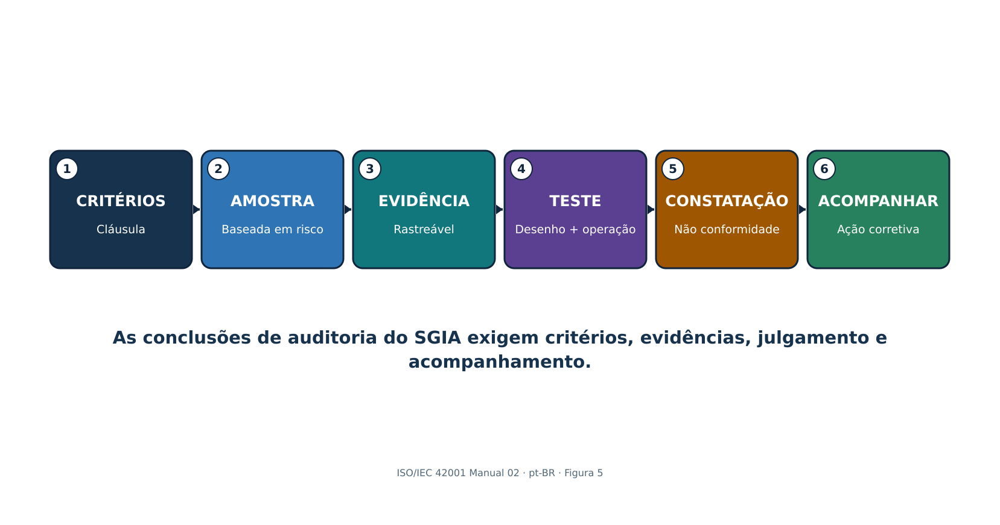

# 17. Cláusula 9.2: Auditoria interna

*A auditoria interna fornece evidência independente e baseada em riscos de que o SGIA está conforme e opera de forma eficaz.*

Figura 5. Cadeia de auditoria do SGIA

> **Explicação acessível:** A cadeia de auditoria conecta critérios definidos, escopo e amostragem com evidências verificáveis, testes, conclusões, constatações e acompanhamento. Independência e competência do auditor devem ser proporcionais ao risco e à complexidade dos sistemas avaliados.

## 17.1 Programa de auditoria

- Defina objetivos, escopo, frequência, métodos, responsabilidades, planejamento, critérios, reporte, acompanhamento, recursos, riscos e registros.
- Priorize sistemas de alto impacto, novos modelos/usos, controles fracos, incidentes, reclamações, mudanças, fornecedores, constatações anteriores e evidências desatualizadas.
- Selecione auditores por competência em sistemas de gestão e domínio de IA, objetividade, confidencialidade, comunicação e independência.
- Use entrevistas, revisão documental, observação, rastreamento ponta a ponta, análise de dados, amostragem, reexecução e demonstração técnica segura.
- Reporte resultados à gestão relevante e assegure correção/ação corretiva e acompanhamento da eficácia.

## 17.2 Papel de trabalho de auditoria

| **Campo** | **Exemplo** |
|---|---|
| Critérios | Cláusula/controle exato, procedimento interno, lei/contrato conforme aplicável |
| Escopo/amostra | Processo, sistema/versão de IA, período, população e justificativa da seleção |
| Evidência | Fonte, proprietário, data, versão, consulta, observação e confiabilidade |
| Teste/resultado | Projeto e operação, esperado versus observado e exceções |
| Conclusão | Conforme, oportunidade, observação ou não conformidade com base objetiva |
| Acompanhamento | Correção, causa-raiz, ação corretiva, proprietário/data e eficácia |

# 18. Cláusula 9.3: Análise crítica pela direção

*A análise crítica pela direção assegura que a alta direção avalie adequação, suficiência, eficácia, direção, recursos e melhoria.*

## 18.1 Entradas

- Status das ações de análises anteriores e mudanças em questões internas/externas ou requisitos de partes interessadas.
- Desempenho e tendências do SGIA: objetivos, não conformidades/ações corretivas, monitoramento/medição, auditorias internas e asseguração externa relevante.
- Resultados de avaliações de risco e impacto, status do tratamento, mudanças na Declaração de Aplicabilidade, incidentes, reclamações, preocupações, reparação e mudanças de fornecedores e legais.
- Adequação de recursos, competência, independência, infraestrutura, dados, ferramentas e orçamento.
- Oportunidades de melhoria contínua e alinhamento estratégico.

## 18.2 Saídas

- Decisões e ações sobre melhoria, mudanças em escopo/política/objetivos/processos/controles do SGIA, necessidades de recursos, decisões de risco e direção estratégica.
- Para cada ação: justificativa, proprietário, data de vencimento, recursos, resultado esperado, medida, dependência, escalonamento e acompanhamento.
- Preserve pauta, materiais, participantes/autoridade, discussão, decisões, divergências/preocupações, ações e evidência de encerramento.

| **Evite uma análise crítica que seja apenas apresentação:** A análise crítica pela direção é um processo decisório. Um painel sem questionamento, decisões de risco, compromissos de recursos, ações e acompanhamento constitui evidência fraca. |
|---|

# 19. Cláusula 10: Não conformidade, ação corretiva e melhoria contínua

*A melhoria corrige problemas, remove causas, verifica eficácia e fortalece o SGIA à medida que risco e tecnologia mudam.*

## 19.1 Método de ação corretiva

- Reaja à não conformidade; controle/corrija; trate consequências, pessoas afetadas, decisões, dados, sistemas e comunicações.
- Avalie causa e recorrência: revise evidências, determine por que controles falharam ou foram contornados e encontre condições semelhantes em outros pontos.
- Implemente ação proporcional com proprietário, data, recursos, proteção temporária, controle de mudanças e reavaliação de risco/impacto.
- Revise eficácia com evidência definida após operação suficiente; não encerre apenas porque um novo documento foi criado.
- Atualize riscos, impactos, controles, objetivos, competência, termos de fornecedores, monitoramento, programa de auditoria e informação documentada conforme necessário.
- Preserve a natureza da não conformidade, ações e resultados de eficácia.

| **Resposta fraca** | **Resposta mais forte** |
|---|---|
| Treinar novamente o empregado | Examine processo pouco claro, carga, incentivos, interface, acesso, aprovação e monitoramento; corrija causas sistêmicas |
| Atualizar política | Altere fluxo/controle, comunique, treine, teste operação e monitore recorrência |
| O fornecedor corrigirá | Acompanhe contrato, mitigação, controle do cliente, prazo, teste, risco residual e alternativa/saída |
| Constatação encerrada | Evidência de correção mais ação de causa-raiz e análise de eficácia em condições semelhantes |

# 20. Anexos A–D e a Declaração de Aplicabilidade

*O Anexo A é um conjunto de referência de 38 controles em nove grupos; o Anexo B fornece orientação, o Anexo C apresenta ideias de objetivos de IA e fontes de risco e o Anexo D apoia uso por setores e domínios.*

| **Grupo** | **Tema** | **Controles** | **Foco de implementação** |
|---|---|---:|---|
| A.2 | Políticas relacionadas à IA | 3 | Política, alinhamento com outras políticas e revisão planejada ou orientada por eventos |
| A.3 | Organização interna | 2 | Papéis e responsabilidades de IA mais processo protegido para relatar preocupações |
| A.4 | Recursos para sistemas de IA | 5 | Documentar dados, ferramentas, sistema/computação e recursos humanos no ciclo de vida |
| A.5 | Avaliação de impactos de sistemas de IA | 4 | Processo repetível, registros, impactos sobre pessoas/grupos e impactos sociais |
| A.6 | Ciclo de vida do sistema de IA | 9 | Objetivos/processos de desenvolvimento responsável, requisitos, registros de projeto, V&V, implantação, operação, documentação técnica e logs |
| A.7 | Dados para sistemas de IA | 5 | Gestão, aquisição, qualidade, proveniência e preparação de dados |
| A.8 | Informação para partes interessadas | 4 | Informação ao usuário, reporte externo, comunicação de incidentes e outras informações para partes interessadas |
| A.9 | Uso de sistemas de IA | 3 | Processo e objetivos de uso responsável mais aderência ao uso pretendido |
| A.10 | Relacionamentos com terceiros e clientes | 3 | Alocação de responsabilidade, governança de fornecedores e obrigações de clientes |

## 20.1 Como os anexos funcionam

- As Cláusulas 4–10 contêm os requisitos certificáveis do sistema de gestão.
- O Anexo A fornece objetivos e controles de referência a considerar durante o tratamento de riscos; não é uma lista universal.
- O Anexo B fornece orientação de implementação para controles do Anexo A sem adicionar requisitos.
- O Anexo C oferece exemplos de objetivos de IA e fontes de risco para apoiar planejamento e avaliação.
- O Anexo D explica como o SGIA pode ser utilizado em domínios e setores.
- A organização pode selecionar controles adicionais; a Declaração de Aplicabilidade explica aplicabilidade e implementação.

# 21. Anexo A.2: Políticas relacionadas à IA

*O Anexo A.2 estabelece uma estrutura coerente de políticas de IA alinhada, aprovada, comunicada e revisada.*

## 21.1 Implementação do controle

- Crie política de IA adequada aos papéis, finalidade, contexto, risco, impacto e compromissos de IA responsável da organização.
- Alinhe-a com políticas de segurança, privacidade, dados, qualidade, produto, RH, compras, jurídico, registros, segurança funcional, acessibilidade, incidentes e comunicação.
- Resolva contradições, como meta de inovação que incentive ferramentas não aprovadas ou política de retenção que conflite com rastreabilidade.
- Aprove no nível gerencial apropriado; comunique a pessoas e partes relevantes; conecte a objetivos, procedimentos, controles, treinamento e aplicação.
- Revise conforme cronograma e após mudanças em lei, tecnologia, negócio, escopo, incidente, auditoria, reclamação, fornecedor ou sistema material.

| **Evidência** | **Teste** |
|---|---|
| Política de IA aprovada | Verificar escopo, compromissos, autoridade, data de vigência, disponibilidade e proprietário |
| Mapa de políticas | Rastrear requisitos de IA para políticas relacionadas e conflitos resolvidos |
| Comunicação/treinamento | Amostrar papéis; verificar compreensão e fluxo de trabalho prático |
| Registro de revisão | Verificar entradas, mudanças, decisão, aprovação e acompanhamento |

# 22. Anexo A.3: Organização interna

*O Anexo A.3 atribui responsabilidades de IA e cria uma forma protegida de relatar preocupações.*

## 22.1 Papéis e responsabilidades

- Defina responsabilização pelo ciclo de vida e pelo sistema de gestão para cada sistema de IA e serviço compartilhado.
- Atribua papéis de resultado de negócio, IA/modelo, dados, produto, segurança, privacidade, jurídico, impacto, supervisão humana, fornecedor, incidente, auditoria e risco residual.
- Defina autoridade de aprovação e escalonamento, substitutos, conflitos, segregação e decisões de emergência.
- Atualize papéis após mudanças organizacionais, de emprego, fornecedor, sistema, escopo ou risco; remova acesso prontamente.

## 22.2 Relato de preocupações

- Forneça canais internos e externos acessíveis, confidencialidade/anonimato quando apropriado, não retaliação, triagem, investigação, proteção, escalonamento, retorno e registros.
- Aceite preocupações sobre uso inseguro, viés, direitos, privacidade, segurança, dados, saída enganosa, IA oculta, comportamento de fornecedor, pressão para contornar controles ou retaliação.
- Meça conscientização, acessibilidade, resposta, recorrência, casos vencidos e ação corretiva sem expor denunciantes.

| **Canais de preocupação são controles:** Um canal é ineficaz se as pessoas não sabem que existe, temem retaliação, não conseguem relatar dano externo ou nunca recebem evidência de que as preocupações são investigadas e corrigidas. |
|---|

# 23. Anexo A.4: Recursos para sistemas de IA

*O Anexo A.4 exige visibilidade dos dados, ferramentas, sistema/computação e pessoas necessários em todo o ciclo de vida da IA.*

| **Registro de recurso** | **Detalhes** |
|---|---|
| Dados | Fonte, proprietário, finalidade, direitos, sensibilidade, pessoas, qualidade, viés, versão, linhagem, retenção e localização |
| Ferramentas | Algoritmos, frameworks, pacotes, modelos, prompts, avaliação, anotação, orquestração, versões e suporte |
| Sistema/computação | Nuvem/local/borda, contas, ambientes, armazenamento, rede, GPUs, capacidade, resiliência e energia/meio ambiente |
| Humano | Papel, organização/fornecedor, competência, independência, acesso, carga e autoridade de decisão |
| Dependências | Provedor, suboperador, API, identidade, monitoramento, filtro de conteúdo, banco vetorial e processo de negócio |

## 23.1 Fluxo de documentação de recursos

- Conecte recursos a sistemas de IA exatos, estágios do ciclo de vida, proprietários, avaliações de risco/impacto, registros de fornecedores, versões e histórico de mudanças.
- Reconcilie inventários de recursos com código, registros de modelos, catálogos de dados, faturamento de nuvem/API, identidade, rede, compras e entrevistas.
- Identifique recursos não aprovados/sombra, componentes sem suporte, falta de competência, limites de capacidade, dependências comuns e efeitos ambientais.
- Use o registro para reprodutibilidade, resposta a incidentes, avaliação de mudanças, recuperação, saída de fornecedores e retirada.

# 24. Anexo A.5 e ISO/IEC 42005: Avaliação de impacto de sistemas de IA

*O Anexo A.5 operacionaliza a avaliação de impacto; a ISO/IEC 42005:2025 fornece orientação atual complementar.*

## 24.1 Quatro resultados de controle

- Processo definido e repetível de avaliação de impacto de sistemas de IA com gatilhos, papéis, métodos, integração ao ciclo de vida, aprovação e revisão.
- Documentação controlada de avaliações, premissas, evidências, partes afetadas, impactos, mitigações, decisões e mudanças.
- Avaliação específica dos impactos sobre indivíduos e grupos, incluindo equidade, direitos, privacidade, segurança funcional, saúde, acessibilidade, efeitos financeiros/trabalhistas, pessoas vulneráveis, supervisão humana e reparação conforme relevante.
- Avaliação de efeitos sociais mais amplos, como segurança pública, meio ambiente, economia, cultura, processos democráticos, desinformação, trabalho, concentração de mercado e uso indevido deliberado, quando relevante.

## 24.2 Verificações de qualidade da avaliação

- Pessoas/grupos afetados são identificados além de usuários e clientes diretos.
- Benefícios e danos são ambos avaliados, incluindo distribuição e alternativas.
- O método considera escala, duração, reversibilidade, efeitos cumulativos e indiretos, incerteza e uso indevido previsível.
- Participação de partes interessadas é significativa, acessível, documentada e protegida.
- Mitigações tornam-se requisitos com proprietário, testes, avisos, supervisão, monitoramento, reparação e critérios de interrupção.
- A versão da avaliação corresponde ao sistema/uso implantado e é atualizada após mudança material.
