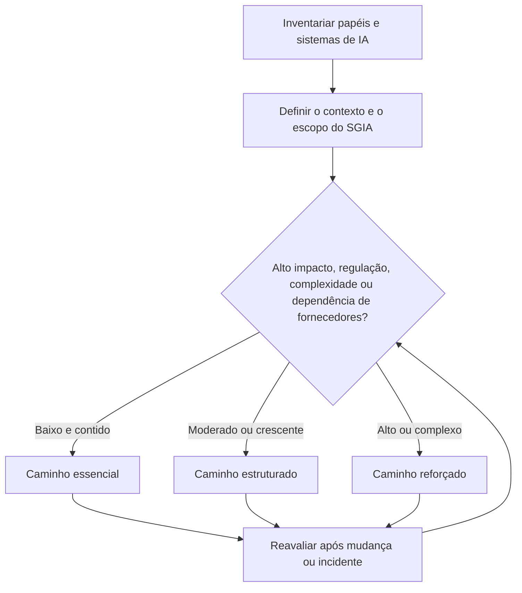
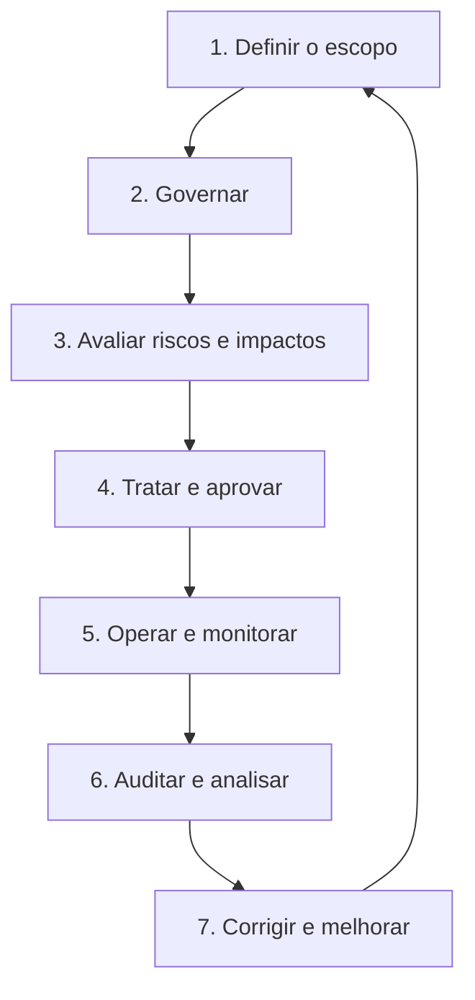
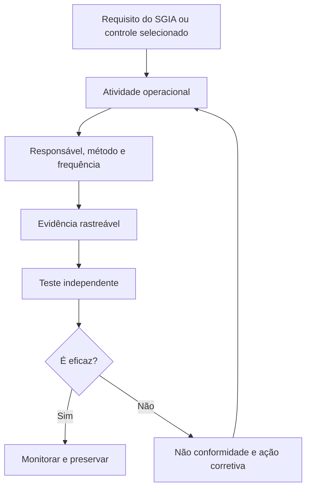

# Manual 02 — Caminhos de implementação da ISO/IEC 42001 para organizações de todos os portes

**Idioma-fonte controlado:** inglês

**Idioma de localização:** português do Brasil (`pt-BR`)

**Público:** organizações que fornecem, desenvolvem, adquirem, implantam, operam ou utilizam sistemas de IA

**Criador humano responsável:** Alberto “Al” Leiva

Este ponto de entrada transforma um sistema de gestão de inteligência artificial (SGIA) em trabalho prático para organizações com diferentes recursos e perfis de risco. O porte influencia a alocação de pessoas e o grau de formalidade, mas nunca substitui a análise do risco e do impacto da IA, das obrigações legais, da complexidade do sistema, da sensibilidade dos dados ou da dependência de fornecedores.

Todos os caminhos abrangem liderança, avaliação de riscos, controle operacional, avaliação de desempenho, ação corretiva e melhoria contínua. A diferença está na profundidade, independência, especialização e monitoramento necessários para o risco real da organização.

Utilize publicações ISO autorizadas como fonte normativa. Este guia é orientação educacional original para implementação; não reproduz as normas ISO nem demonstra conformidade ou certificação.

## 1. Escolha o caminho de acordo com o risco e a complexidade

Comece pelos papéis de IA da organização, sistemas, usos pretendidos, pessoas afetadas, dados, fornecedores e jurisdições operacionais. Em seguida, escolha o caminho mais simples que ainda seja capaz de controlar o risco real.

**Explicação acessível:** A organização primeiro inventaria seus papéis e sistemas de IA e define o contexto e o escopo do SGIA. Risco, impacto, regulação, complexidade e dependência de fornecedores determinam se o caminho essencial, estruturado ou reforçado é adequado. Mudanças e incidentes fazem a decisão retornar para uma nova avaliação.

### Caminho essencial

Geralmente é adequado para uma micro ou pequena organização com poucos usos de IA de menor impacto e dependências administráveis.

Resultados operacionais mínimos:

- um executivo responsável e um coordenador do SGIA;
- um inventário de IA dentro do escopo, com proprietários e finalidades pretendidas;
- triagens documentadas e distintas de risco e de impacto antes da aprovação;
- uma política concisa de IA e regras de uso aceitável;
- análise de fornecedores e proteções contratuais mínimas;
- registros de aprovação, monitoramento, incidentes, mudanças e desativação;
- uma Declaração de Aplicabilidade proporcional com justificativas;
- revisão interna periódica por uma pessoa independente do trabalho testado; e
- evidências de análise crítica pela direção e de ações corretivas.

Uma mesma pessoa pode exercer várias funções, mas não deveria aprovar e auditar de forma independente o mesmo trabalho sem uma salvaguarda alternativa.

### Caminho estruturado

Geralmente é adequado para uma organização de médio porte, várias unidades de negócio, dados pessoais ou confidenciais relevantes, vários fornecedores ou decisões de IA de impacto moderado.

Acrescente:

- um comitê formal do SGIA e direitos de decisão documentados;
- métodos para avaliar riscos, impactos, dados, segurança, privacidade e fornecedores;
- uma biblioteca integrada de controles e um registro de evidências;
- requisitos de competência e treinamento baseados nas funções;
- marcos de liberação, limites de monitoramento, gatilhos de mudança e exercícios de incidentes;
- um programa anual de auditoria interna baseado em riscos;
- não conformidades, causas-raiz, remediações e testes de eficácia rastreados; e
- métricas executivas sobre inventário, risco, operação dos controles, incidentes e ações vencidas.

### Caminho reforçado

Geralmente é adequado para uma empresa grande ou complexa, usos de alto impacto ou regulados, dependências de modelos fundacionais ou IA agêntica, sistemas relacionados à segurança, operações globais ou efeitos significativos sobre as pessoas.

Acrescente:

- supervisão do órgão de governança e responsabilização com base em três linhas;
- testes independentes de modelos, dados, segurança, privacidade, equidade, robustez e supervisão humana;
- monitoramento contínuo dos controles e do desempenho dos modelos;
- autoridade formal para questionar, escalonar, interromper o uso e aceitar riscos;
- agregação de riscos nos níveis de portfólio e sistema;
- análise de concentração de fornecedores e quartas partes;
- mapeamentos legais e regulatórios por jurisdição e papel;
- asseguração independente e análises de prontidão para certificação; e
- exercícios de resposta a crises, autoridades, clientes e pessoas afetadas.

## 2. Implemente o SGIA como um ciclo operacional repetível

O SGIA não é um projeto documental executado uma única vez. Cada marco deve gerar uma decisão, um responsável e evidências que depois possam ser testadas.

**Explicação acessível:** O ciclo de implementação define o escopo, estabelece a governança, avalia riscos e impactos, seleciona o tratamento e a aprovação, opera e monitora os controles, realiza auditoria e análise crítica pela direção e utiliza ações corretivas para melhorar o ciclo seguinte.

### Marco 1 — Definir o escopo

Documente os limites organizacionais, os papéis de IA, os produtos e serviços cobertos, as atividades do ciclo de vida, os dados, os locais, os fornecedores, as partes interessadas, as interfaces e as exclusões justificadas.

### Marco 2 — Governar

Aprove a política, os objetivos, os critérios de risco, os gatilhos para avaliação de impacto, os direitos de decisão, os recursos, as expectativas de competência, as comunicações e os requisitos de informação documentada controlada.

### Marco 3 — Avaliar riscos e impactos

Identifique benefícios, danos e falhas razoavelmente previsíveis, incertezas, pessoas afetadas, ameaças aos dados e à segurança, dependências de fornecedores, controles existentes e exposição residual.

### Marco 4 — Tratar e aprovar

Selecione controles, documente a Declaração de Aplicabilidade, atribua responsáveis e prazos, defina critérios de aceitação, trate o risco não resolvido e registre uma decisão autorizada.

### Marco 5 — Operar e monitorar

Execute os processos aprovados, preserve evidências, teste limites, monitore mudanças, trate incidentes e reclamações, verifique obrigações de fornecedores e reavalie após os gatilhos definidos.

### Marco 6 — Auditar e analisar

Utilize revisores competentes e imparciais para testar a conformidade e a eficácia. A direção avalia desempenho, mudanças, recursos, constatações, riscos, oportunidades e decisões de melhoria.

### Marco 7 — Corrigir e melhorar

Contenha os problemas, corrija suas consequências, determine as causas, implemente ações, teste a eficácia, atualize riscos e controles e compartilhe as lições sem esconder resultados desfavoráveis.

## 3. Atribua papéis responsáveis sem presumir uma equipe grande

| Responsabilidade | Essencial | Estruturado | Reforçado |
|---|---|---|---|
| Direção e aceitação de riscos | Patrocinador executivo | Comitê executivo | Órgão de governança e executivos responsáveis |
| Coordenação do SGIA | Coordenador designado | Gerente ou líder de programa dedicado | Escritório corporativo do SGIA |
| Propriedade do sistema | Proprietário de negócio | Coproprietários de negócio e tecnologia | Proprietários de portfólio, produto, modelo e implantação |
| Avaliação de riscos e impactos | Revisão interdisciplinar quando necessário | Revisores multidisciplinares permanentes | Funções especializadas independentes e participação de pessoas afetadas |
| Operação dos controles | Proprietários de controle designados | Proprietários com calendário de evidências | Proprietários federados com monitoramento contínuo |
| Auditoria interna | Pessoa qualificada e independente ou apoio externo | Programa de auditoria interna baseado em riscos | Função independente com competência especializada em IA |
| Análise crítica pela direção | Análise do patrocinador | Análise executiva programada | Ciclo de supervisão do órgão de governança e da direção |

Terceirizar o trabalho não terceiriza a responsabilidade. Contratos, consultores, ferramentas e organismos de certificação apoiam o SGIA, mas não são responsáveis pelas decisões da direção.

## 4. Construa os registros controlados mínimos

Cada organização deveria manter, no mínimo:

1. registro do contexto, das partes interessadas e do escopo do SGIA;
2. inventário de IA com papel, proprietário, finalidade, status, dados, fornecedor e risco;
3. política, objetivos, direitos de decisão e registros de competência;
4. método para riscos e oportunidades e avaliações concluídas;
5. método de avaliação de impacto de sistemas de IA e avaliações concluídas;
6. plano de tratamento e Declaração de Aplicabilidade;
7. evidências do ciclo de vida, dados, fornecedores, transparência e uso responsável;
8. registros de monitoramento, medição, incidentes, reclamações, mudanças e desativação;
9. programa, planos, papéis de trabalho, constatações e acompanhamento de auditoria interna;
10. entradas, decisões, responsáveis e prazos da análise crítica pela direção; e
11. evidências de não conformidades, causas-raiz, ações corretivas e testes de eficácia.

## 5. Conecte requisitos a evidências e asseguração

**Explicação acessível:** Um requisito do SGIA ou um controle selecionado se transforma em uma atividade operacional com responsável, método e frequência. A atividade produz evidência rastreável para um teste independente. Controles eficazes permanecem sob monitoramento; controles ineficazes geram uma não conformidade e uma ação corretiva que retorna à atividade operacional.

A evidência deve ser autêntica, suficientemente completa para sustentar a conclusão, protegida contra alterações indevidas, vinculada ao sistema e ao período corretos e preservada pelo prazo aprovado.

## 6. Meça se a implementação funciona

Utilize métricas que revelem o desempenho dos controles, e não o volume de documentos:

- percentual de sistemas de IA com proprietário, finalidade, nível de risco e status vigentes;
- avaliações de riscos ou impactos vencidas;
- sistemas operando fora das condições aprovadas;
- testes de controles aprovados, reprovados ou não concluídos;
- lacunas não resolvidas de evidências e contratos de fornecedores;
- incidentes, reclamações, substituições de decisão e decisões de interromper o uso;
- limites de monitoramento excedidos e tempo de resposta;
- não conformidades vencidas e idade das ações corretivas;
- constatações repetidas e testes de eficácia reprovados;
- decisões da análise crítica pela direção concluídas dentro do prazo; e
- mudanças que acionaram uma reavaliação no momento adequado.

## 7. Preserve os limites das normas e da asseguração

O registro de fontes controladas identifica as páginas oficiais vigentes com estes identificadores:

- `iso-iec-42001-2023` — requisitos e orientação para o SGIA;
- `iso-iec-42005-2025` — orientação para avaliação de impacto de sistemas de IA;
- `iso-iec-42006-2025` — requisitos adicionais para organismos que auditam e certificam SGIA;
- `iso-iec-23894-2023` — orientação para gestão de riscos de IA; e
- `iso-19011-2026` — orientação para auditorias de sistemas de gestão.

O registro também controla `iso-iec-22989-2022`, `iso-iec-23053-2022`, `iso-iec-38507-2022`, `iso-iec-27001-2022` e `iso-iec-27001-2022-amd1-2024`. A fonte de apoio à certificação `iso-iec-17021-1-2015` continua publicada, mas está em revisão sistemática.

Não afirme que:

- o uso deste manual demonstra conformidade;
- a implementação de uma ferramenta atende automaticamente a um requisito;
- a certificação demonstra que todo sistema de IA é seguro, legal, imparcial, protegido ou eficaz;
- a ISO/IEC 42006 impõe requisitos diretamente a toda organização que busca certificação; ou
- a certificação ISO/IEC 42001, isoladamente, demonstra conformidade com a Lei de IA da UE ou outra lei.

## 8. Primeiros 90 dias

| Período | Resultado mínimo |
|---|---|
| Dias 1–30 | Patrocinador, coordenador do SGIA, escopo inicial, inventário de IA, restrições urgentes, registro de fontes e local das evidências |
| Dias 31–60 | Política, objetivos, papéis, métodos de risco e impacto, avaliações iniciais, controles de fornecedores e prioridades de tratamento |
| Dias 61–90 | Declaração de Aplicabilidade, controles prioritários implementados, plano de monitoramento, registros de competência, programa de auditoria e primeira análise crítica pela direção |

Após o dia 90, conclua o plano de tratamento restante, teste a eficácia operacional, encerre as não conformidades prioritárias, reavalie após mudanças e prepare-se para asseguração independente somente quando o SGIA tiver histórico operacional e evidências suficientes.

---

O QA do repositório verifica a estrutura, a paridade estrutural automatizada e a integridade das fontes controladas. Ele não fornece certificação, aconselhamento jurídico nem opinião de auditoria.
