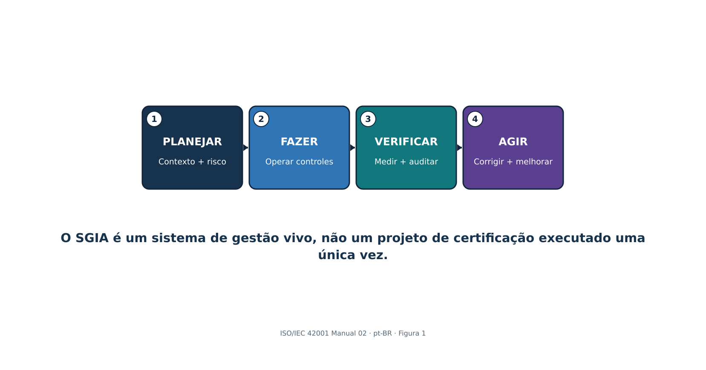
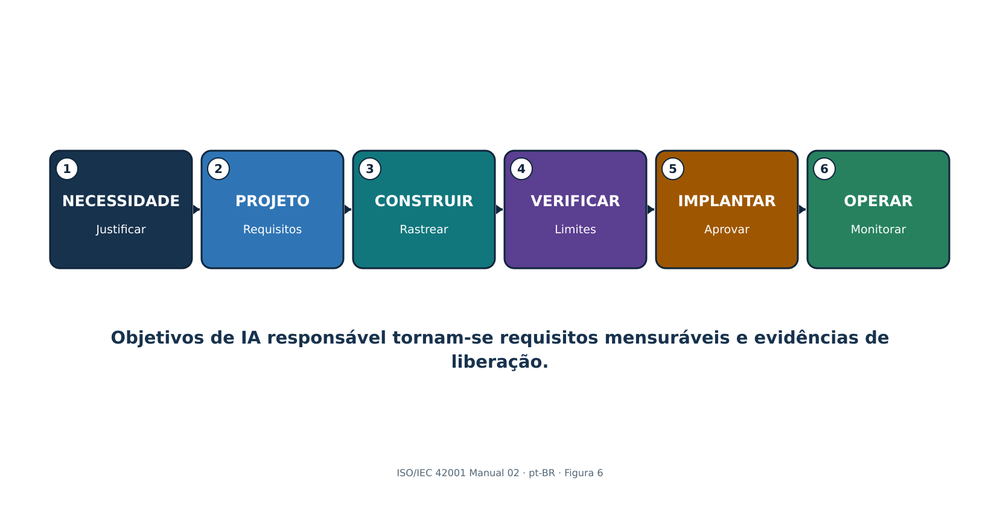
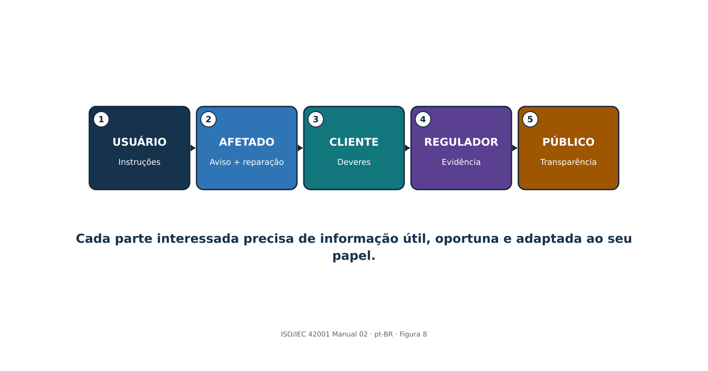
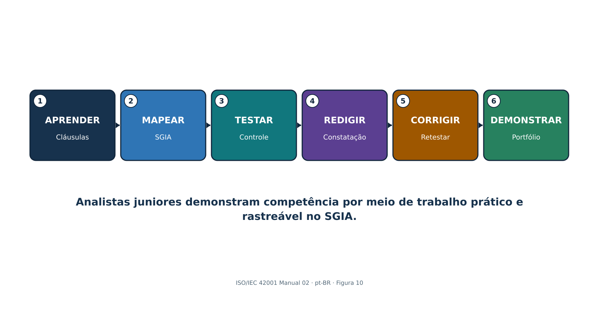

> **Controle de publicação: Este documento é um rascunho derivado mecanicamente dos quatro arquivos fonte localizados da ramificação indicada. Requer revisão semântica humana. Não é uma tradução autorizada pela ISO, e sua geração não demonstra certificação, conformidade, cumprimento legal nem asseguração de auditoria. A assistência de IA foi utilizada conforme a divulgação do repositório; a autoria e a responsabilidade humana permanecem com Alberto (Al) Leiva.**

> **Source control:** `build/iso-iec-42001-manual-02-2026` @ `b1ddffa6a33376ec72db570d8437f996cf61b97d` · 2026-08-24 · First Edition / v1.0

| **O que este manual faz:** Explica como estabelecer, implementar, operar, auditar, preparar para certificação e melhorar um sistema de gestão de inteligência artificial. Detalha as Cláusulas 4–10, os nove grupos de controles do Anexo A, avaliação de riscos e impactos, a Declaração de Aplicabilidade, certificação, evidências, ferramentas, decisões gerenciais e o trabalho do analista júnior. |
|---|

**Alberto (Al) Leiva**

Primeira edição • julho de 2026

> **Status da localização:** Fonte localizada em português do Brasil (`pt-BR`). Esta parte cobre os elementos preliminares e os Capítulos 1–8 do mestre controlado em inglês. Deve ser utilizada com as demais partes localizadas até a geração do mestre consolidado e dos artefatos DOCX/PDF. Não constitui tradução oficial da ISO.

# Prefácio

A ISO/IEC 42001 ajuda organizações a governar a inteligência artificial por meio de um sistema de gestão em toda a organização. Ela não certifica que toda saída esteja correta nem que todo sistema de IA seja seguro. Exige liderança, contexto, planejamento baseado em riscos, recursos, controles operacionais, avaliação de desempenho, ação corretiva e melhoria contínua em torno do desenvolvimento, fornecimento ou uso responsável de sistemas de IA.

Este manual explica conceitos em redação original e não reproduz a norma protegida por direitos autorais. Obtenha uma cópia autorizada da ISO/IEC 42001:2023 e de quaisquer normas utilizadas na implementação ou auditoria. Certificação, leis, deveres setoriais, contratos e riscos técnicos devem ser avaliados em relação ao escopo e aos fatos reais da organização.

| **Nota de informação atual:** Verificado em 24 de agosto de 2026. A ISO/IEC 42001:2023 continua sendo a norma publicada de requisitos para SGIA. A ISO/IEC 42005:2025 fornece orientação sobre avaliação de impacto de sistemas de IA. A ISO/IEC 42006:2025 acrescenta requisitos para organismos que auditam e certificam SGIA. A ISO 19011:2026 é a orientação atual para auditoria de sistemas de gestão. A ISO/IEC 42003 continua como item de trabalho aprovado e a ISO/IEC 42007 avançou para o estágio de projeto de norma internacional; ambas continuam em desenvolvimento e não são tratadas aqui como requisitos. |
|---|

## Como utilizar este manual

- Líderes e gestores do SGIA: comecem pelos Capítulos 1–10, 16–20 e 29–31.
- Implementadores e equipes de GRC: estudem em ordem e utilizem todos os modelos do Capítulo 32.
- Equipes de IA, dados, produto, segurança, privacidade e jurídico: concentrem-se nos Capítulos 6–15 e 20–28.
- Auditores internos: concentrem-se nos Capítulos 16–20 e 29 e depois pratiquem o laboratório do Capítulo 31.
- Analistas juniores: aprendam a intenção das cláusulas, produzam evidências, redijam constatações e nunca aleguem certificação ou autoridade de auditor que não possuam.

# Sumário

O arquivo-fonte em Word contém um sumário nativo e um guia permanente de capítulos com páginas. Nesta edição Markdown localizada, o guia preserva a ordem do mestre controlado.

# Guia de capítulos

| **Capítulo** | **Título** | **Página inicial no mestre inglês** |
|---:|---|---:|
| 1 | ISO/IEC 42001 e o sistema de gestão de inteligência artificial | 5 |
| 2 | Arquitetura do SGIA e ciclo Planejar-Fazer-Verificar-Agir | 6 |
| 3 | Aplicabilidade, papéis organizacionais e roteiro de implementação | 7 |
| 4 | Cláusula 4: Contexto da organização | 9 |
| 5 | Cláusula 5: Liderança | 10 |
| 6 | Cláusula 6.1: Ações para abordar riscos e oportunidades | 11 |
| 7 | Cláusula 6.1.2: Avaliação de riscos de IA | 12 |
| 8 | Cláusula 6.1.3: Tratamento de riscos de IA e Declaração de Aplicabilidade | 14 |
| 9 | Cláusula 6.1.4: Avaliação de impacto de sistemas de IA | 15 |
| 10 | Cláusulas 6.2 e 6.3: Objetivos e planejamento de mudanças | 17 |
| 11 | Cláusula 7.1: Recursos | 18 |
| 12 | Cláusulas 7.2–7.4: Competência, conscientização e comunicação | 19 |
| 13 | Cláusula 7.5: Informação documentada | 20 |
| 14 | Cláusula 8.1: Planejamento e controle operacional | 21 |
| 15 | Cláusulas 8.2–8.4: Risco operacional, tratamento e avaliação de impacto | 22 |
| 16 | Cláusula 9.1: Monitoramento, medição, análise e avaliação | 23 |
| 17 | Cláusula 9.2: Auditoria interna | 24 |
| 18 | Cláusula 9.3: Análise crítica pela direção | 26 |
| 19 | Cláusula 10: Não conformidade, ação corretiva e melhoria contínua | 27 |
| 20 | Anexos A–D e a Declaração de Aplicabilidade | 28 |
| 21 | Anexo A.2: Políticas relacionadas à IA | 29 |
| 22 | Anexo A.3: Organização interna | 30 |
| 23 | Anexo A.4: Recursos para sistemas de IA | 31 |
| 24 | Anexo A.5 e ISO/IEC 42005: Avaliação de impacto de sistemas de IA | 32 |
| 25 | Anexo A.6: Ciclo de vida do sistema de IA | 33 |
| 26 | Anexo A.7: Dados para sistemas de IA | 34 |
| 27 | Anexo A.8: Informação para partes interessadas | 36 |
| 28 | Anexos A.9 e A.10: Uso responsável, fornecedores e clientes | 38 |
| 29 | Certificação, ISO/IEC 42006:2025 e prontidão para auditoria | 40 |
| 30 | Ferramentas de código aberto para evidências do SGIA e asseguração de IA | 42 |
| 31 | Guia de gestores e analistas juniores, laboratório e entrevistas | 47 |
| 32 | Modelos, glossário, índice e referências oficiais | 51 |

# 1. ISO/IEC 42001 e o sistema de gestão de inteligência artificial

*A ISO/IEC 42001 especifica requisitos para que uma organização estabeleça, implemente, mantenha e melhore continuamente um sistema de gestão de inteligência artificial.*

| **Conceito** | **Significado simples** | **Pergunta de evidência** |
|---|---|---|
| SGIA | Políticas, objetivos, processos, papéis, controles e registros inter-relacionados para IA responsável | O sistema opera em todo o escopo definido? |
| Papel da organização | Desenvolvedor/fornecedor, implantador/usuário, fornecedor, cliente ou vários papéis | Quais responsabilidades estão controladas? |
| Sistema de IA | Pessoas, dados, modelos, software, infraestrutura, processos e interfaces utilizados para um resultado de IA | Qual é o limite completo? |
| Conformidade | Requisitos são atendidos dentro do escopo certificado | Que cláusula, implementação, evidência e resultado sustentam a alegação? |
| Certificação | Avaliação independente por terceira parte do SGIA em relação à ISO/IEC 42001 | Qual entidade, escopo, norma, organismo, datas e status estão certificados? |

## 1.1 O que a certificação não comprova

- Não garante que toda saída de IA seja precisa, imparcial, protegida contra ameaças, lícita, segura para as pessoas ou explicável.
- Não certifica produtos de IA individualmente, salvo quando o escopo do SGIA certificado e o esquema sustentarem explicitamente essa alegação.
- Não substitui testes de produto, análise jurídica, avaliação de impacto, controles de privacidade/segurança, validação de domínio ou supervisão humana.
- Não transfere a responsabilização da organização para o organismo de certificação ou fornecedor.

# 2. Arquitetura do SGIA e ciclo Planejar-Fazer-Verificar-Agir

*O SGIA segue a estrutura harmonizada dos sistemas de gestão e um ciclo contínuo Planejar-Fazer-Verificar-Agir (PDCA).*

{width=6.15in height=3.23274in}

Figura 1. Ciclo PDCA do SGIA

> **Explicação acessível:** A figura mostra que o SGIA funciona como um ciclo. A organização planeja contexto, riscos, impactos e objetivos; executa controles e processos; verifica o desempenho por medição, auditoria interna e análise crítica pela direção; e age sobre não conformidades e oportunidades de melhoria antes de reiniciar o ciclo.

| **Etapa PDCA** | **Trabalho da ISO/IEC 42001** | **Saída típica** |
|---|---|---|
| Planejar | Contexto, liderança, risco/oportunidade, avaliação, tratamento, objetivos e recursos | Escopo, política, métodos, registro de riscos, processo de impacto, Declaração de Aplicabilidade e objetivos |
| Fazer | Competência, comunicação, documentação, controles operacionais e avaliações | Procedimentos, registros do sistema, aprovações e evidências de fornecedores e ciclo de vida |
| Verificar | Monitoramento, medição, análise, auditoria interna e análise crítica pela direção | Métricas, avaliação, relatório de auditoria e decisões de análise crítica |
| Agir | Não conformidade, correção, causa-raiz, ação corretiva e melhoria | Registros de ações, testes de eficácia e riscos/controles/objetivos atualizados |

## 2.1 Integração com sistemas existentes

- Reutilize processos de governança, controle documental, risco, auditoria, ação corretiva, fornecedores, segurança, privacidade, qualidade e continuidade quando seu escopo e controles forem adequados ao risco de IA.
- Crie complementos específicos de IA para avaliação de impacto, ciclo de vida de modelos/dados, uso responsável, transparência, supervisão humana e responsabilidades da cadeia de valor.
- Mantenha uma única fonte de verdade e mapeie-a para ISO/IEC 27001:2022, ISO 9001, privacidade, obrigações legais, NIST AI RMF e deveres setoriais em vez de duplicar registros.

# 3. Aplicabilidade, papéis organizacionais e roteiro de implementação

*Uma implementação útil começa com controle organizacional, inventário preciso de IA, papéis responsáveis e um roteiro por etapas.*

{width=6.15in height=3.23274in}

Figura 2. Cadeia de construção do escopo

> **Explicação acessível:** A figura representa a construção do escopo desde a organização e seus papéis de IA até sistemas, dados, fornecedores, interfaces e exclusões. Cada limite deve ter justificativa que não evite requisitos aplicáveis.

| **Papel** | **Responsabilidade principal** |
|---|---|
| Órgão de governança / executivos | Supervisão, direção, recursos, apetite a risco e decisões materiais |
| Líder do SGIA | Coordenar sistema de gestão, desempenho, auditorias e melhoria |
| Proprietário de negócio/sistema de IA | Finalidade, resultado, processo afetado, risco, aprovação e monitoramento |
| Modelo/dados/produto/engenharia | Requisitos, projeto, dados, avaliação, implantação e mudança |
| Segurança/privacidade/jurídico/conformidade/segurança funcional | Requisitos especializados, revisão, contestação e incidentes |
| Compras/gestor de fornecedores | Diligência prévia, alocação, contratos, evidências, monitoramento e saída |
| Auditoria interna | Avaliação independente e objetiva sem ser proprietária dos controles |

## 3.1 Roteiro de implementação

- Autorize o programa e obtenha as normas; defina finalidade, patrocinador, recursos e governança.
- Inventarie sistemas e papéis de IA; realize análise de contexto e partes interessadas; redija escopo e política.
- Defina processos de risco, impacto, tratamento, Declaração de Aplicabilidade, objetivos, documentos, competência, comunicação e operação.
- Implemente controles do Anexo A e controles adicionais conforme o risco; colete evidências durante a operação real.
- Meça o desempenho; conclua auditoria interna e análise crítica pela direção; corrija não conformidades e verifique eficácia.
- Selecione um organismo de certificação competente; conclua Estágio 1 e Estágio 2; mantenha supervisão e melhoria.

# 4. Cláusula 4: Contexto da organização

*A Cláusula 4 estabelece por que o SGIA existe, quem importa, o que ele abrange e como seus processos interagem.*

## 4.1 Questões internas e externas

- Estratégia, cultura, governança, apetite a risco, recursos, competência, maturidade de dados, arquitetura tecnológica, sistemas de gestão existentes e mudança organizacional.
- Lei, regulamentação, expectativas setoriais, contratos, requisitos de clientes, normas, confiança pública, preocupações sociais, mercados, fornecedores, ameaças, mudança de tecnologia/modelo e questões climáticas quando relevantes aos resultados pretendidos do SGIA.
- Registre por que cada questão é relevante, responsável, efeito sobre o SGIA, resposta e gatilho de revisão.

## 4.2 Partes interessadas e requisitos

- Identifique pessoas e grupos afetados pela IA, mesmo que não sejam usuários ou clientes diretos.
- Inclua reguladores, clientes, trabalhadores, usuários, titulares de dados, fornecedores, parceiros, comunidades, acionistas, auditores, seguradoras e público, conforme relevante.
- Separe necessidades e expectativas de obrigações vinculantes de conformidade; registre autoridade/fonte, sistema/processo, responsável, evidência e monitoramento de mudanças.
- Determine quais requisitos a organização abordará por meio do SGIA.

## 4.3 Declaração de escopo

| **Elemento do escopo** | **Clareza necessária** |
|---|---|
| Organização | Entidades legais, unidades de negócio, locais e funções |
| Papel de IA | Desenvolvedor/fornecedor, implantador/usuário, serviço/fornecedor ou combinação |
| Produtos/serviços/processos | Ofertas habilitadas por IA e usos internos |
| Tecnologia e dados | Sistemas, modelos, ambientes, interfaces e conjuntos de dados principais |
| Limites/dependências | Serviços compartilhados, fornecedores, clientes e exclusões |
| Justificativa | Por que os limites são válidos e não evitam requisitos aplicáveis |

## 4.4 Processos do SGIA

- Defina finalidade do processo, entradas, saídas, sequência, interação, proprietário, critérios, controles, recursos, registros, medidas, riscos e melhoria.
- Um mapa de processos deve conectar inventário, risco, impacto, tratamento, objetivos, ciclo de vida, dados, fornecedores, uso, monitoramento, incidentes, auditoria, análise crítica e ação corretiva.

# 5. Cláusula 5: Liderança

*A alta direção deve assumir o SGIA, a política, a integração, os recursos, a comunicação, o desempenho e os papéis responsáveis.*

## 5.1 Demonstração de liderança

- Torne os objetivos do SGIA compatíveis com a estratégia e os compromissos de IA responsável.
- Integre requisitos do SGIA aos processos de negócio, produto, compras, dados, tecnologia, pessoas, risco e mudança.
- Forneça pessoas competentes, tempo, ferramentas, dados, infraestrutura, orçamento, contestação independente e autoridade.
- Comunique que a gestão eficaz de IA e a conformidade importam, inclusive quando a pressão por entrega conflita com controles.
- Analise o desempenho e apoie pessoas que contribuem para melhoria ou levantam preocupações.
- Assegure que os resultados pretendidos sejam alcançados, em vez de tratar certificação como único resultado.

## 5.2 Política de IA

- Declare finalidade, princípios, compromissos com requisitos aplicáveis, IA responsável baseada em riscos, objetivos e melhoria contínua.
- Adeque a política aos papéis de IA, contexto, cultura, impacto, lei, produtos e apetite a risco da organização.
- Alinhe segurança, privacidade, qualidade, dados, ética, RH, compras, produto, registros, segurança funcional e incidentes.
- Aprove no nível adequado, comunique às pessoas relevantes, disponibilize conforme apropriado e revise em intervalos planejados e após mudanças materiais.

## 5.3 Papéis, responsabilidades e autoridades

- Defina responsabilização pelo SGIA e por reportar desempenho à alta direção.
- Atribua proprietários para cada sistema de IA, risco, impacto, fonte de dados, modelo, fornecedor, controle, métrica, incidente, mudança e ação corretiva.
- Defina autoridade de aprovação e escalonamento; evite conflitos em que a mesma equipe cria, valida, aceita e audita risco de alto impacto sem contestação adequada.

# 6. Cláusula 6.1: Ações para abordar riscos e oportunidades

*O planejamento transforma contexto em riscos, oportunidades, controles, objetivos e mudanças gerenciadas.*

## 6.1 Entradas de planejamento

- Contexto e requisitos de partes interessadas; escopo e processos do SGIA.
- Inventário de IA, papéis do sistema, etapa do ciclo de vida, pessoas afetadas, dados, modelos, fornecedores, integrações e condições de uso.
- Benefícios e oportunidades estratégicas, juntamente com ameaças, falhas, danos, incerteza e uso indevido razoavelmente previsível.
- Obrigações legais, regulatórias, contratuais, de segurança, privacidade, segurança funcional, qualidade, registros, acessibilidade, trabalho, propriedade intelectual, consumidor e setor aplicáveis.

## 6.1.1 Ações sobre riscos e oportunidades

- Planeje ações proporcionais ao efeito sobre resultados do SGIA; integre-as aos processos em vez de manter apenas um registro separado.
- Defina ação, proprietário, recurso, data, medida, evidência, dependência, decisão residual e avaliação de eficácia.
- Oportunidades podem incluir melhor supervisão, qualidade de dados, transparência, avaliação, competência, eficiência, confiança de partes interessadas e inovação.
- Evite que controles pretendidos criem novos riscos, como monitoramento excessivo, avisos inacessíveis ou sobrecarga de revisão.

# 7. Cláusula 6.1.2: Avaliação de riscos de IA

*O processo de avaliação de riscos de IA deve usar critérios definidos e repetíveis para identificar, analisar, avaliar e priorizar riscos.*

{width=6.15in height=3.23274in}

Figura 3. Fluxo de avaliação de riscos de IA

> **Explicação acessível:** A avaliação parte de um cenário de risco definido, analisa contexto, probabilidade, consequências, incerteza e controles existentes, compara o resultado com critérios estabelecidos, seleciona tratamento e preserva evidências para decisão residual autorizada e futura reavaliação.

## 7.1 Método de risco

- Defina escopo, unidade de análise, categorias de risco, dimensões de impacto, probabilidade, gravidade, escala, duração, reversibilidade, grupos afetados, incerteza, agregação, tolerância e autoridade de decisão.
- Identifique cenários de risco em uso pretendido, uso indevido previsível, falha, ataque, dados, modelo, comportamento humano, fornecedores, ambiente, lei e efeito social.
- Analise risco inerente e controles existentes com evidências; diferencie risco atual, alvo e residual.
- Avalie em relação aos critérios; priorize tratamento segundo consequências para pessoas e negócio, não por uma única pontuação técnica.
- Assegure resultados consistentes, válidos e comparáveis e preserve a avaliação como informação documentada.
- Reavalie em intervalos planejados e após mudanças materiais, incidentes, novos grupos afetados, atualizações de modelo/fornecedor, drift, mudança legal ou falha de controle.

| **Registro de risco** | **Detalhe mínimo** |
|---|---|
| Cenário | Causa/ator, condição vulnerável, evento/ação, comportamento do sistema, parte afetada e consequência |
| Contexto | Uso, pessoas, geografia, escala, dados, modelo/versão, ferramentas, fornecedor e premissas |
| Análise | Probabilidade, dimensões de impacto, incerteza, evidências e eficácia dos controles existentes |
| Tratamento | Evitar/reduzir/compartilhar/aceitar, controles, proprietário, data, medida e risco residual |
| Decisão | Aprovador autorizado, justificativa, condições, validade, monitoramento e gatilho de revisão |

# 8. Cláusula 6.1.3: Tratamento de riscos de IA e Declaração de Aplicabilidade

*O tratamento de riscos seleciona controles, compara-os ao Anexo A, produz a Declaração de Aplicabilidade e obtém aprovação do risco residual.*

## 8.1 Processo de tratamento

- Escolha opções de tratamento: evitar, alterar/reduzir, compartilhar/transferir, aceitar dentro da autoridade ou conduzir piloto estritamente limitado para reduzir incerteza.
- Determine controles necessários a partir de requisitos legais e contratuais, resultados de risco e impacto de IA, arquitetura, partes interessadas e objetivos.
- Compare controles selecionados com o Anexo A para verificar que nenhum controle de referência relevante foi ignorado.
- Acrescente controles além do Anexo A quando necessários para segurança, privacidade, segurança funcional, qualidade, avaliação técnica, acessibilidade, resiliência ou obrigações setoriais.
- Crie e aprove plano de tratamento e obtenha autorização para o risco residual.
- Preserve resultados e mudanças do tratamento como informação documentada controlada.

## 8.2 Campos da Declaração de Aplicabilidade

| **Campo** | **Finalidade** |
|---|---|
| Referência/título do controle | Identidade do controle do Anexo A ou adicional |
| Aplicável? | Incluído ou excluído para o escopo definido do SGIA |
| Justificativa | Risco, obrigação, objetivo, arquitetura ou razão de exclusão |
| Implementação | Política/processo/sistema e proprietário responsável |
| Status | Implementado, parcial, planejado ou não aplicável |
| Evidência/teste | Evidência atual e resultado de eficácia operacional |
| Dependências/lacunas | Controles compartilhados de fornecedor/cliente e constatações |
| Revisão | Última/próxima revisão e gatilhos de mudança |

| **Alerta sobre a Declaração de Aplicabilidade:** Ela não é uma lista copiada. Deve concordar com o escopo atual, avaliações de risco e impacto, plano de tratamento, implementação real, evidências e decisões de risco. |
|---|

# 9. Cláusula 6.1.4: Avaliação de impacto de sistemas de IA

*A avaliação de impacto de sistemas de IA examina como um sistema de IA pode afetar indivíduos, grupos e a sociedade ao longo de seu ciclo de vida.*

{width=6.15in height=3.23274in}

Figura 4. Avaliação de impacto de sistemas de IA

> **Explicação acessível:** A avaliação parte da finalidade e do contexto do sistema, identifica pessoas e grupos afetados, examina benefícios e efeitos adversos diretos, indiretos e sociais, avalia gravidade, escala, duração, reversibilidade e incerteza e converte mitigações em decisões, supervisão, transparência, reparação e monitoramento.

## 9.1 Processo de avaliação de impacto

- Defina gatilhos, escopo, papéis, independência, métodos, participação das partes afetadas, aprovação, retenção, revisão e relação com tratamento de riscos e decisões.
- Descreva finalidade, usuários, pessoas afetadas, decisões/conteúdo, grau de automação, alternativas, dados, modelo, fornecedores, geografia, escala, duração e usos proibidos ou previsíveis.
- Identifique benefícios pretendidos e impactos adversos sobre direitos, equidade, privacidade, segurança funcional, cibersegurança, saúde, acessibilidade, emprego, finanças, crianças/grupos vulneráveis, meio ambiente, cultura, serviços públicos, democracia e condições sociais/econômicas, conforme relevante.
- Considere impactos diretos, indiretos, cumulativos, tardios, reversíveis/irreversíveis, individuais, de grupo e sociais.
- Avalie probabilidade, gravidade, escala, duração, reversibilidade, distribuição, incerteza e opiniões das partes afetadas.
- Selecione mitigações, supervisão humana, avisos, escolhas, reparação, monitoramento, limites e critérios de interrupção; obtenha aprovação responsável.
- Atualize antes de mudanças importantes e após incidentes, reclamações, novas evidências, drift ou expansão do uso.

## 9.2 Avaliação de riscos versus avaliação de impacto

| **Avaliação de riscos** | **Avaliação de impacto** |
|---|---|
| Gerencia incerteza que afeta objetivos, incluindo organização, pessoas e sociedade | Foca especificamente efeitos potenciais de um sistema de IA sobre indivíduos, grupos e sociedade |
| Pode agregar risco de portfólio e processos | Deve permanecer ligada ao sistema/uso específico e ao contexto afetado |
| Alimenta tratamento, controles e aceitação residual | Alimenta projeto, implantação, uso, transparência, supervisão, reparação e monitoramento |
| Ambas devem trocar constatações e permanecer coerentes | Ambas exigem métodos documentados, evidências, decisões e revisão |

# 10. Cláusulas 6.2 e 6.3: Objetivos e planejamento de mudanças

*Os objetivos transformam decisões de política e risco em resultados mensuráveis; mudanças devem ser planejadas e controladas.*

## 10.1 Registro de objetivos

- Objetivo e resultado pretendido, vinculados à política/risco/requisito e ao escopo.
- Medida, cálculo, fonte de dados, população, linha de base, meta, limite, frequência, proprietário, reporte e limitação.
- Ações, recursos, responsabilidades, cronograma, dependências, evidências e método de avaliação.
- Resposta quando o desempenho não atinge a meta; reavaliação quando a métrica cria incentivos prejudiciais.

| **Exemplo de objetivo** | **Medida melhor** |
|---|---|
| Completar inventário de IA | Sistemas ativos com proprietário, uso, dados/modelo/fornecedor, nível de risco, avaliação e status validados ÷ sistemas ativos reconciliados |
| Melhorar tempestividade da avaliação | Mediana e dias vencidos desde admissão/mudança material até decisão aprovada de risco e impacto, por nível |
| Fortalecer avaliação | Sistemas de alto impacto que atendem limites definidos e semelhantes à produção, incluindo subgrupos e falhas graves |
| Melhorar controle de fornecedores | Fornecedores críticos de IA com revisão atual e delimitada, obrigações contratuais, evidências e lacunas materiais encerradas ÷ fornecedores críticos |
| Melhorar remediação | Constatações corrigidas e retestadas quanto à eficácia dentro da meta baseada em risco, com idade e impacto das exceções |

## 10.2 Planejamento de mudanças do SGIA

- Defina finalidade, consequências, integridade do SGIA, recursos, responsabilidades, cronograma, transição, comunicação, evidências e rollback.
- Gatilhos incluem escopo, entidade, produto, uso, modelo, dados, fornecedor, lei, certificação, processo, organização, ferramentas, método de auditoria e objetivos.

# 11. Cláusula 7.1: Recursos

*A organização deve determinar e fornecer os recursos necessários para estabelecer, operar, avaliar e melhorar o SGIA.*

| **Recurso** | **Exemplos** | **Evidência** |
|---|---|---|
| Pessoas | SGIA, domínio, dados, ML, produto, segurança, privacidade, jurídico, segurança funcional, auditoria e fatores humanos | Plano de capacidade, papéis, competência, independência e carga de trabalho |
| Dados | Treinamento/validação/teste/produção, rótulos, metadados, direitos e conjuntos de referência | Inventário, linhagem, qualidade, acesso, retenção e proveniência |
| Ferramentas | Desenvolvimento, anotação, avaliação, monitoramento, segurança e documentação | Inventário aprovado, versões, validação, acesso e suporte |
| Computação/sistema | Nuvem/local/borda, armazenamento, rede, registro, logging e sandbox | Arquitetura, propriedade, capacidade, resiliência e impacto ambiental |
| Finanças/tempo | Orçamento, custo de avaliação, revisão de fornecedores, participação de partes e remediação | Planos, aprovações, realizados, restrições e decisões |

## 11.1 Decisões sobre recursos

- Ajuste a profundidade dos recursos ao escopo, risco, complexidade do sistema, escala, deveres legais e pessoas afetadas.
- Separe desenvolvimento, validação, aprovação e auditoria o suficiente para gerenciar conflitos de interesse.
- Monitore sobrecarga de revisores, cobertura de avaliação, lacunas de dados, limites de fornecedores, licenças vencendo, descontinuação de modelos e dívida técnica.
- Documente restrições aceitas e seu efeito sobre objetivos e risco residual.

# 12. Cláusulas 7.2–7.4: Competência, conscientização e comunicação

*Competência, conscientização e comunicação tornam políticas e controles utilizáveis em decisões reais.*

## 12.1 Competência

- Defina educação, treinamento, habilidade, experiência, independência, comportamento e autoridade necessários por papel e nível de risco.
- Avalie a competência atual; forneça treinamento, mentoria, prática supervisionada, apoio especializado ou realocação.
- Avalie eficácia por observação, revisão do produto de trabalho, exercícios de cenário, testes e resultados — não apenas presença.
- Preserve evidências e reavalie após mudanças de papel, sistema, risco, lei, método ou incidente.

## 12.2 Conscientização

- As pessoas entendem a política, sua contribuição, benefícios de melhoria de desempenho, consequências da não conformidade, canal de preocupações e escalonamento.
- Usuários entendem uso aprovado/proibido, restrições de dados, verificação, supervisão humana, limitações, tratamento de incidentes/reclamações e condições de interrupção.

## 12.3 Plano de comunicação

| **Campo** | **Pergunta** |
|---|---|
| O quê | Política, sistema/uso, limites, impactos, incidentes, resultados, mudanças e deveres |
| Por quê/público | Tomador de decisão, trabalhador, usuário, pessoa afetada, cliente, fornecedor, regulador ou público |
| Quando | Marco do ciclo de vida, intervalo planejado, incidente, reclamação, mudança ou gatilho legal |
| Como | Treinamento, aviso, ficha do sistema, relatório, contrato, painel, reunião ou alerta |
| Proprietário/aprovação | Quem prepara, valida, aprova, entrega e registra? |
| Retorno | Como são tratados dúvidas, acessibilidade, compreensão, preocupações e correção? |

# 13. Cláusula 7.5: Informação documentada

*A informação documentada deve ser controlada o suficiente para ser confiável, localizável, protegida, atual, retida e utilizável.*

## 13.1 Ciclo de vida do controle documental

- Criar/identificar: título, proprietário, ID, versão, data, formato, classificação, escopo, sistema/modelo/dados relacionados e aprovação.
- Revisar/aprovar: revisor competente, conflitos, critérios, comentários, disposição e autorização.
- Publicar/utilizar: público correto, acesso, treinamento, data de vigência, disponibilidade no ponto de uso e retirada de versões obsoletas.
- Alterar: motivo, requisitos/processos/sistemas afetados, aprovações, histórico de versões, transição e rollback.
- Proteger: confidencialidade, integridade, disponibilidade, privacidade, segurança, backup, recuperação e preservação de evidências.
- Reter/descartar: período legal/comercial, retenções, arquivo, exclusão, cópias de fornecedores, dados derivados e verificação.

| **Registros exigidos/importantes** | **Exemplo** |
|---|---|
| Base do SGIA | Contexto, partes interessadas, escopo, política, mapa de processos e papéis |
| Planejamento | Método/avaliação de risco, tratamento, Declaração de Aplicabilidade, processo/registros de impacto, objetivos e mudanças |
| Operações | Inventário de IA, recursos, ciclo de vida, dados, fornecedor/uso, comunicação e incidentes |
| Avaliação | Métricas, análise, auditoria interna e análise crítica pela direção |
| Melhoria | Não conformidade, correção, causa-raiz, ação corretiva e eficácia |
| Rastreabilidade do sistema | Versões de modelo/dados/prompt/ferramenta/configuração, aprovações, avaliações, logs e decisões |

# 14. Cláusula 8.1: Planejamento e controle operacional

*O planejamento operacional transforma requisitos do SGIA em controles repetíveis para admissão, projeto, aquisição, implantação, uso, mudança, incidente e retirada de IA.*

## 14.1 Controle operacional

- Defina critérios e controles para processos; opere-os como planejado; retenha evidências suficientes para demonstrar desempenho.
- Controle mudanças planejadas e revise mudanças não intencionais; reduza efeitos adversos.
- Controle processos, produtos e serviços fornecidos externamente conforme risco e responsabilidade.
- Use níveis de risco e marcos do ciclo de vida para ajustar revisão, independência, testes, aprovação, monitoramento e escalonamento ao impacto.

| **Marco** | **Evidência necessária para a decisão** |
|---|---|
| Admissão | Finalidade, proprietário, papel de IA, pessoas afetadas, dados, fornecedor, risco preliminar e verificação de uso proibido |
| Projeto/aquisição | Requisitos, risco/impacto, arquitetura, recursos, dados, deveres do fornecedor, controles e testes |
| Construção/configuração | Versões, linhagem, desenvolvimento seguro, documentação e prontidão para avaliação |
| Validação | Testes representativos, limites, falhas, contestação independente, limitações e ação corretiva |
| Implantação | Aprovação, condições, informação ao usuário, supervisão, monitoramento, incidente, rollback e suporte |
| Operação/mudança | Desempenho, drift, reclamações, incidentes, mudanças do fornecedor, regressão e reavaliação |
| Retirada | Substituição, comunicação a usuários/partes, acesso, integrações, dados, modelos, registros e exclusão |

# 15. Cláusulas 8.2–8.4: Risco operacional, tratamento e avaliação de impacto

*A organização deve executar avaliação de riscos, tratamento de riscos e avaliação de impacto em intervalos planejados e quando ocorrer mudança significativa.*

## 15.1 Gatilhos operacionais

- Sistema de IA novo ou alterado, uso pretendido, população afetada, geografia, escala, automação, autoridade de decisão, modelo, dados, prompt, ferramenta, integração, fornecedor ou infraestrutura.
- Nova lei, contrato, incidente, reclamação, constatação de auditoria, vulnerabilidade, inteligência de ameaças, preocupação de segurança funcional, drift, falha de avaliação, impacto inesperado ou aviso de fornecedor.
- Mudanças nos critérios de risco, objetivos, controles, monitoramento, propriedade organizacional, escopo de certificação ou capacidade de recursos.

## 15.2 Evidência operacional

- Avaliação atual e aprovada ligada à versão exata de sistema/modelo/dados/configuração/uso.
- Plano de tratamento e Declaração de Aplicabilidade concordam com controles implementados, lacunas, exceções, aprovação residual e monitoramento.
- Avaliação de impacto inclui partes afetadas, efeitos diretos/indiretos e sociais, mitigações, reparação e gatilhos de revisão.
- Ações são integradas a fluxos de produto, dados, segurança, privacidade, fornecedores, usuários, incidentes e mudanças.
- Resultados e mudanças são preservados como informação documentada controlada.

# 16. Cláusula 9.1: Monitoramento, medição, análise e avaliação

*A avaliação de desempenho determina se o SGIA e seus controles alcançam os resultados pretendidos.*

## 16.1 Projeto da medição

- Decida o que monitorar/medir, métodos, momento, responsabilidade, critérios de aceitação, análise, avaliação, reporte e retenção.
- Verifique fontes de dados, definições, populações, completude, precisão, tempo, acesso, transformações e limitações.
- Use indicadores antecedentes e consequentes em governança, risco, impacto, ciclo de vida, dados, fornecedores, uso, reclamações, incidentes, auditoria e melhoria.
- Evite médias que ocultem falhas graves ou efeitos em subgrupos; combine evidências quantitativas e qualitativas.
- Avalie tendências e causas, compare com objetivos e gere decisões/ações quando limites não forem atingidos.

| **Medida do SGIA** | **Decisão habilitada** |
|---|---|
| Cobertura de inventário/controles | Uso de IA desconhecido ou sem proprietário e lacunas de avaliação |
| Idade de risco/impacto e cobertura de mudanças | Se decisões continuam atuais após mudança de sistema/contexto |
| Resultados de avaliação | Liberar, restringir, reprojetar, reverter ou adicionar supervisão |
| Reclamações/incidentes/reparação | Impactos sobre pessoas, recorrência, comunicação e ação corretiva |
| Mudanças/evidências de fornecedores | Reavaliação, ação contratual, alternativa ou saída |
| Idade de auditoria/não conformidade | Fraqueza de controle, causa-raiz, recursos e atenção da direção |

# 17. Cláusula 9.2: Auditoria interna

*A auditoria interna fornece evidência independente e baseada em riscos de que o SGIA está conforme e opera de forma eficaz.*

{width=6.15in height=3.23274in}

Figura 5. Cadeia de auditoria do SGIA

> **Explicação acessível:** A cadeia de auditoria conecta critérios definidos, escopo e amostragem com evidências verificáveis, testes, conclusões, constatações e acompanhamento. Independência e competência do auditor devem ser proporcionais ao risco e à complexidade dos sistemas avaliados.

## 17.1 Programa de auditoria

- Defina objetivos, escopo, frequência, métodos, responsabilidades, planejamento, critérios, reporte, acompanhamento, recursos, riscos e registros.
- Priorize sistemas de alto impacto, novos modelos/usos, controles fracos, incidentes, reclamações, mudanças, fornecedores, constatações anteriores e evidências desatualizadas.
- Selecione auditores por competência em sistemas de gestão e domínio de IA, objetividade, confidencialidade, comunicação e independência.
- Use entrevistas, revisão documental, observação, rastreamento ponta a ponta, análise de dados, amostragem, reexecução e demonstração técnica segura.
- Reporte resultados à gestão relevante e assegure correção/ação corretiva e acompanhamento da eficácia.

## 17.2 Papel de trabalho de auditoria

| **Campo** | **Exemplo** |
|---|---|
| Critérios | Cláusula/controle exato, procedimento interno, lei/contrato conforme aplicável |
| Escopo/amostra | Processo, sistema/versão de IA, período, população e justificativa da seleção |
| Evidência | Fonte, proprietário, data, versão, consulta, observação e confiabilidade |
| Teste/resultado | Projeto e operação, esperado versus observado e exceções |
| Conclusão | Conforme, oportunidade, observação ou não conformidade com base objetiva |
| Acompanhamento | Correção, causa-raiz, ação corretiva, proprietário/data e eficácia |

# 18. Cláusula 9.3: Análise crítica pela direção

*A análise crítica pela direção assegura que a alta direção avalie adequação, suficiência, eficácia, direção, recursos e melhoria.*

## 18.1 Entradas

- Status das ações de análises anteriores e mudanças em questões internas/externas ou requisitos de partes interessadas.
- Desempenho e tendências do SGIA: objetivos, não conformidades/ações corretivas, monitoramento/medição, auditorias internas e asseguração externa relevante.
- Resultados de avaliações de risco e impacto, status do tratamento, mudanças na Declaração de Aplicabilidade, incidentes, reclamações, preocupações, reparação e mudanças de fornecedores e legais.
- Adequação de recursos, competência, independência, infraestrutura, dados, ferramentas e orçamento.
- Oportunidades de melhoria contínua e alinhamento estratégico.

## 18.2 Saídas

- Decisões e ações sobre melhoria, mudanças em escopo/política/objetivos/processos/controles do SGIA, necessidades de recursos, decisões de risco e direção estratégica.
- Para cada ação: justificativa, proprietário, data de vencimento, recursos, resultado esperado, medida, dependência, escalonamento e acompanhamento.
- Preserve pauta, materiais, participantes/autoridade, discussão, decisões, divergências/preocupações, ações e evidência de encerramento.

| **Evite uma análise crítica que seja apenas apresentação:** A análise crítica pela direção é um processo decisório. Um painel sem questionamento, decisões de risco, compromissos de recursos, ações e acompanhamento constitui evidência fraca. |
|---|

# 19. Cláusula 10: Não conformidade, ação corretiva e melhoria contínua

*A melhoria corrige problemas, remove causas, verifica eficácia e fortalece o SGIA à medida que risco e tecnologia mudam.*

## 19.1 Método de ação corretiva

- Reaja à não conformidade; controle/corrija; trate consequências, pessoas afetadas, decisões, dados, sistemas e comunicações.
- Avalie causa e recorrência: revise evidências, determine por que controles falharam ou foram contornados e encontre condições semelhantes em outros pontos.
- Implemente ação proporcional com proprietário, data, recursos, proteção temporária, controle de mudanças e reavaliação de risco/impacto.
- Revise eficácia com evidência definida após operação suficiente; não encerre apenas porque um novo documento foi criado.
- Atualize riscos, impactos, controles, objetivos, competência, termos de fornecedores, monitoramento, programa de auditoria e informação documentada conforme necessário.
- Preserve a natureza da não conformidade, ações e resultados de eficácia.

| **Resposta fraca** | **Resposta mais forte** |
|---|---|
| Treinar novamente o empregado | Examine processo pouco claro, carga, incentivos, interface, acesso, aprovação e monitoramento; corrija causas sistêmicas |
| Atualizar política | Altere fluxo/controle, comunique, treine, teste operação e monitore recorrência |
| O fornecedor corrigirá | Acompanhe contrato, mitigação, controle do cliente, prazo, teste, risco residual e alternativa/saída |
| Constatação encerrada | Evidência de correção mais ação de causa-raiz e análise de eficácia em condições semelhantes |

# 20. Anexos A–D e a Declaração de Aplicabilidade

*O Anexo A é um conjunto de referência de 38 controles em nove grupos; o Anexo B fornece orientação, o Anexo C apresenta ideias de objetivos de IA e fontes de risco e o Anexo D apoia uso por setores e domínios.*

| **Grupo** | **Tema** | **Controles** | **Foco de implementação** |
|---|---|---:|---|
| A.2 | Políticas relacionadas à IA | 3 | Política, alinhamento com outras políticas e revisão planejada ou orientada por eventos |
| A.3 | Organização interna | 2 | Papéis e responsabilidades de IA mais processo protegido para relatar preocupações |
| A.4 | Recursos para sistemas de IA | 5 | Documentar dados, ferramentas, sistema/computação e recursos humanos no ciclo de vida |
| A.5 | Avaliação de impactos de sistemas de IA | 4 | Processo repetível, registros, impactos sobre pessoas/grupos e impactos sociais |
| A.6 | Ciclo de vida do sistema de IA | 9 | Objetivos/processos de desenvolvimento responsável, requisitos, registros de projeto, V&V, implantação, operação, documentação técnica e logs |
| A.7 | Dados para sistemas de IA | 5 | Gestão, aquisição, qualidade, proveniência e preparação de dados |
| A.8 | Informação para partes interessadas | 4 | Informação ao usuário, reporte externo, comunicação de incidentes e outras informações para partes interessadas |
| A.9 | Uso de sistemas de IA | 3 | Processo e objetivos de uso responsável mais aderência ao uso pretendido |
| A.10 | Relacionamentos com terceiros e clientes | 3 | Alocação de responsabilidade, governança de fornecedores e obrigações de clientes |

## 20.1 Como os anexos funcionam

- As Cláusulas 4–10 contêm os requisitos certificáveis do sistema de gestão.
- O Anexo A fornece objetivos e controles de referência a considerar durante o tratamento de riscos; não é uma lista universal.
- O Anexo B fornece orientação de implementação para controles do Anexo A sem adicionar requisitos.
- O Anexo C oferece exemplos de objetivos de IA e fontes de risco para apoiar planejamento e avaliação.
- O Anexo D explica como o SGIA pode ser utilizado em domínios e setores.
- A organização pode selecionar controles adicionais; a Declaração de Aplicabilidade explica aplicabilidade e implementação.

# 21. Anexo A.2: Políticas relacionadas à IA

*O Anexo A.2 estabelece uma estrutura coerente de políticas de IA alinhada, aprovada, comunicada e revisada.*

## 21.1 Implementação do controle

- Crie política de IA adequada aos papéis, finalidade, contexto, risco, impacto e compromissos de IA responsável da organização.
- Alinhe-a com políticas de segurança, privacidade, dados, qualidade, produto, RH, compras, jurídico, registros, segurança funcional, acessibilidade, incidentes e comunicação.
- Resolva contradições, como meta de inovação que incentive ferramentas não aprovadas ou política de retenção que conflite com rastreabilidade.
- Aprove no nível gerencial apropriado; comunique a pessoas e partes relevantes; conecte a objetivos, procedimentos, controles, treinamento e aplicação.
- Revise conforme cronograma e após mudanças em lei, tecnologia, negócio, escopo, incidente, auditoria, reclamação, fornecedor ou sistema material.

| **Evidência** | **Teste** |
|---|---|
| Política de IA aprovada | Verificar escopo, compromissos, autoridade, data de vigência, disponibilidade e proprietário |
| Mapa de políticas | Rastrear requisitos de IA para políticas relacionadas e conflitos resolvidos |
| Comunicação/treinamento | Amostrar papéis; verificar compreensão e fluxo de trabalho prático |
| Registro de revisão | Verificar entradas, mudanças, decisão, aprovação e acompanhamento |

# 22. Anexo A.3: Organização interna

*O Anexo A.3 atribui responsabilidades de IA e cria uma forma protegida de relatar preocupações.*

## 22.1 Papéis e responsabilidades

- Defina responsabilização pelo ciclo de vida e pelo sistema de gestão para cada sistema de IA e serviço compartilhado.
- Atribua papéis de resultado de negócio, IA/modelo, dados, produto, segurança, privacidade, jurídico, impacto, supervisão humana, fornecedor, incidente, auditoria e risco residual.
- Defina autoridade de aprovação e escalonamento, substitutos, conflitos, segregação e decisões de emergência.
- Atualize papéis após mudanças organizacionais, de emprego, fornecedor, sistema, escopo ou risco; remova acesso prontamente.

## 22.2 Relato de preocupações

- Forneça canais internos e externos acessíveis, confidencialidade/anonimato quando apropriado, não retaliação, triagem, investigação, proteção, escalonamento, retorno e registros.
- Aceite preocupações sobre uso inseguro, viés, direitos, privacidade, segurança, dados, saída enganosa, IA oculta, comportamento de fornecedor, pressão para contornar controles ou retaliação.
- Meça conscientização, acessibilidade, resposta, recorrência, casos vencidos e ação corretiva sem expor denunciantes.

| **Canais de preocupação são controles:** Um canal é ineficaz se as pessoas não sabem que existe, temem retaliação, não conseguem relatar dano externo ou nunca recebem evidência de que as preocupações são investigadas e corrigidas. |
|---|

# 23. Anexo A.4: Recursos para sistemas de IA

*O Anexo A.4 exige visibilidade dos dados, ferramentas, sistema/computação e pessoas necessários em todo o ciclo de vida da IA.*

| **Registro de recurso** | **Detalhes** |
|---|---|
| Dados | Fonte, proprietário, finalidade, direitos, sensibilidade, pessoas, qualidade, viés, versão, linhagem, retenção e localização |
| Ferramentas | Algoritmos, frameworks, pacotes, modelos, prompts, avaliação, anotação, orquestração, versões e suporte |
| Sistema/computação | Nuvem/local/borda, contas, ambientes, armazenamento, rede, GPUs, capacidade, resiliência e energia/meio ambiente |
| Humano | Papel, organização/fornecedor, competência, independência, acesso, carga e autoridade de decisão |
| Dependências | Provedor, suboperador, API, identidade, monitoramento, filtro de conteúdo, banco vetorial e processo de negócio |

## 23.1 Fluxo de documentação de recursos

- Conecte recursos a sistemas de IA exatos, estágios do ciclo de vida, proprietários, avaliações de risco/impacto, registros de fornecedores, versões e histórico de mudanças.
- Reconcilie inventários de recursos com código, registros de modelos, catálogos de dados, faturamento de nuvem/API, identidade, rede, compras e entrevistas.
- Identifique recursos não aprovados/sombra, componentes sem suporte, falta de competência, limites de capacidade, dependências comuns e efeitos ambientais.
- Use o registro para reprodutibilidade, resposta a incidentes, avaliação de mudanças, recuperação, saída de fornecedores e retirada.

# 24. Anexo A.5 e ISO/IEC 42005: Avaliação de impacto de sistemas de IA

*O Anexo A.5 operacionaliza a avaliação de impacto; a ISO/IEC 42005:2025 fornece orientação atual complementar.*

## 24.1 Quatro resultados de controle

- Processo definido e repetível de avaliação de impacto de sistemas de IA com gatilhos, papéis, métodos, integração ao ciclo de vida, aprovação e revisão.
- Documentação controlada de avaliações, premissas, evidências, partes afetadas, impactos, mitigações, decisões e mudanças.
- Avaliação específica dos impactos sobre indivíduos e grupos, incluindo equidade, direitos, privacidade, segurança funcional, saúde, acessibilidade, efeitos financeiros/trabalhistas, pessoas vulneráveis, supervisão humana e reparação conforme relevante.
- Avaliação de efeitos sociais mais amplos, como segurança pública, meio ambiente, economia, cultura, processos democráticos, desinformação, trabalho, concentração de mercado e uso indevido deliberado, quando relevante.

## 24.2 Verificações de qualidade da avaliação

- Pessoas/grupos afetados são identificados além de usuários e clientes diretos.
- Benefícios e danos são ambos avaliados, incluindo distribuição e alternativas.
- O método considera escala, duração, reversibilidade, efeitos cumulativos e indiretos, incerteza e uso indevido previsível.
- Participação de partes interessadas é significativa, acessível, documentada e protegida.
- Mitigações tornam-se requisitos com proprietário, testes, avisos, supervisão, monitoramento, reparação e critérios de interrupção.
- A versão da avaliação corresponde ao sistema/uso implantado e é atualizada após mudança material.

# 25. Anexo A.6: Ciclo de vida do sistema de IA

*O Anexo A.6 conecta objetivos de desenvolvimento responsável a requisitos, projeto, testes, implantação, operação, documentação e registro de eventos.*

{width=6.15in height=3.23274in}

Figura 6. Ciclo de vida responsável do sistema de IA

> **Explicação acessível:** A figura mostra um fluxo de objetivos e requisitos para projeto, verificação/validação, implantação, operação, monitoramento, mudança e retirada. Cada etapa deve deixar versões, critérios, resultados, aprovações e decisões rastreáveis.

| **Área do ciclo de vida** | **Evidência de implementação** |
|---|---|
| Objetivos/processo responsável | Equidade, segurança funcional, privacidade, transparência, cibersegurança, robustez e outros objetivos mensuráveis relevantes; procedimento do ciclo de vida |
| Requisitos/especificação | Finalidade, critérios funcionais e não funcionais, pessoas afetadas, dados, modelo, supervisão humana, limites e obrigações |
| Registros de projeto/desenvolvimento | Arquitetura, decisões, alternativas, premissas, componentes, ameaças, interfaces, proveniência e revisões |
| Verificação/validação | Métodos, dados de avaliação, avaliadores, limites, falhas graves, testes de subgrupos/casos extremos/adversariais e limitações |
| Implantação | Aprovação de liberação, ambiente, configuração, informação ao usuário, migração, monitoramento e rollback |
| Operação/monitoramento | Desempenho, drift, segurança, segurança funcional, impacto, reclamações, mudanças, suporte, reparo e atualizações |
| Documentação técnica/logs | Instruções adequadas ao público mais eventos rastreáveis para auditoria, incidentes, decisões e melhoria |

## 25.1 Mudança e retirada

- Versione modelo, dados, prompts, recuperação, ferramentas, código, infraestrutura, políticas, avaliação, aprovações e monitoramento.
- Defina gatilhos de mudança material e escopo de regressão; implante gradualmente com rollback.
- Retire usuários, identidades, integrações, endpoints, modelos, conjuntos de dados, índices, logs, documentação, contratos e cópias de fornecedores conforme obrigações; preserve registros exigidos.

# 26. Anexo A.7: Dados para sistemas de IA

*O Anexo A.7 exige aquisição, qualidade, proveniência e preparação governadas de dados para desenvolvimento, melhoria e operação de IA.*

{width=6.15in height=3.23274in}

Figura 7. Cadeia de evidências de dados de IA

> **Explicação acessível:** A cadeia de evidências acompanha os dados desde sua origem, autoridade e direitos, passando por aquisição, transformação, rotulagem, qualidade, versionamento e uso, até retenção ou exclusão. Deve permitir reproduzir quais dados sustentaram cada versão e decisão relevante.

## 26.1 Controles de dados

- Defina requisitos de gestão de dados para privacidade, segurança, representatividade, explicabilidade, proveniência, precisão, integridade, disponibilidade, retenção e exclusão conforme relevante.
- Documente aquisição/seleção: fonte, método, pessoas/população, direitos/licença, finalidade anterior, consentimento/autoridade quando aplicável, metadados, data, restrições e vieses conhecidos.
- Estabeleça critérios e limites de qualidade específicos do uso para precisão, completude, consistência, atualidade, unicidade, validade, representatividade, rótulos e cobertura de subgrupos.
- Preserve proveniência por criação, aquisição, transferência, transformação, rotulagem, aumento, filtragem, versionamento, validação, uso, compartilhamento, correção e exclusão.
- Documente métodos de preparação, código/ferramenta/versão, parâmetros, pessoas, verificações de qualidade, justificativa, saídas e reprodutibilidade.
- Separe e proteja conjuntos de treinamento, validação, teste, produção, monitoramento e incidentes; evite vazamento do conjunto de avaliação.

| **Evidência de dados** | **Teste** |
|---|---|
| Ficha de conjunto/dados | Rastrear finalidade, população, campos, fonte, direitos, qualidade, limitações e proprietário |
| Linhagem | Reproduzir transformações de fonte para atributo e versão |
| Resultado de qualidade | Verificar população/amostra, regras, falhas, correção e aprovação |
| Acesso/retenção | Amostrar concessões, revisões, remoções, uso, cópias e exclusão |
| Viés/representação | Verificar grupos relevantes, histórico, proxies, rótulos, lacunas e mitigação |

# 27. Anexo A.8: Informação para partes interessadas

*O Anexo A.8 exige informação útil para usuários e partes interessadas, além de reporte e comunicação de incidentes.*

{width=6.15in height=3.23274in}

Figura 8. Informação para partes interessadas

> **Explicação acessível:** A informação deve ser adaptada ao público. Usuários precisam de finalidade, capacidades e limites; pessoas afetadas precisam saber como a IA participa e como solicitar revisão ou reparação; clientes, reguladores e público recebem informação proporcional às suas responsabilidades e riscos.

## 27.1 Pacote de informação

- Usuários: finalidade pretendida, capacidades, limitações, entradas/saídas esperadas, uso proibido, verificação, supervisão humana, monitoramento, escalonamento e suporte.
- Pessoas afetadas: que IA é usada quando apropriado, papel na decisão, fatores/limitações importantes, dados e direitos, revisão humana, correção, recurso, reclamação e reparação.
- Clientes/parceiros: responsabilidades, configuração, dados, dependências de controle, evidências, incidentes, mudanças, suporte e saída.
- Reguladores/auditores: documentação controlada, escopo, avaliações, controles, resultados de testes, incidentes, mudanças, constatações e ação corretiva conforme exigido.
- Público: transparência proporcional, impactos significativos, governança, informações de segurança, contato e relatórios quando apropriado.

## 27.2 Reporte externo e incidentes

- Forneça canais acessíveis para relatar erros, danos, viés, preocupações de segurança/privacidade, uso indevido, problemas de acessibilidade ou efeitos inesperados.
- Defina triagem, gravidade, investigação, proteção, retorno, correção, reparação, escalonamento, retenção e análise de tendências.
- Predefina públicos do incidente, conteúdo, proprietário/porta-voz, revisão jurídica, tempo, canal, acessibilidade, coordenação, atualizações e encerramento.
- Não divulgue excessivamente informações sensíveis de segurança ou dados pessoais; tampouco esconda limitações materiais atrás de confidencialidade.

# 28. Anexos A.9 e A.10: Uso responsável, fornecedores e clientes

*O Anexo A.9 governa o uso responsável e a finalidade pretendida; o Anexo A.10 aloca deveres entre fornecedores, clientes e a cadeia de valor de IA.*

{width=6.15in height=3.23274in}

Figura 9. Ciclo de vida de IA de terceiros

> **Explicação acessível:** O controle de terceiros começa identificando atores e responsabilidades, segue com diligência prévia e contratos, monitora mudanças do fornecedor e termina com continuidade, portabilidade, exclusão e saída. Responsabilidade não pode ser transferida por linguagem contratual vaga.

## 28.1 Uso responsável

- Defina usos aprovados e proibidos, usuários, dados, saídas, decisões, autonomia, verificação, supervisão humana, logging, suporte, incidente e condições de interrupção.
- Estabeleça objetivos mensuráveis de uso responsável ligados a impactos e riscos relevantes.
- Treine usuários e supervisores; aplique por identidade, configuração, interfaces, política, monitoramento, revisão e consequências.
- Detecte expansão de escopo e exija reavaliação antes de reutilização, expansão, novas populações, maior impacto ou novas integrações/ferramentas.

## 28.2 Terceiros e clientes

- Mapeie desenvolvedor/fornecedor/implantador, fornecedores de dados/modelos/ferramentas/nuvem, integradores, serviços humanos, clientes, usuários e partes afetadas.
- Aloque responsabilidade por dados, requisitos, testes, configuração, transparência, supervisão humana, segurança, incidentes, monitoramento, mudança, evidências, direitos, exclusão e saída.
- Realize diligência prévia e contratação baseadas em risco; verifique documentação de modelo/sistema, avaliação, asseguração de segurança/privacidade, termos de dados, propriedade intelectual, suporte, vulnerabilidades, mudanças, subprocessadores, resiliência e portabilidade.
- Monitore mudanças de fornecedor em modelo/termos/treinamento/retenção/subprocessadores/incidentes/descontinuação e reavalie prontamente.
- Defina obrigações e suporte do cliente; não use responsabilidade do cliente como transferência vaga de deveres do fornecedor.

# 29. Certificação, ISO/IEC 42006:2025 e prontidão para auditoria

*A certificação avalia o SGIA em relação à ISO/IEC 42001 dentro de um escopo definido; a ISO/IEC 42006:2025 fortalece requisitos para organismos de certificação.*

## 29.1 Caminho de certificação

- Selecione organismo de certificação competente e verifique acreditação/status, esquema, geografia, competência, imparcialidade, capacidade de escopo e contrato.
- Solicitação e planejamento: organização, escopo do SGIA, papéis, locais, pessoas, sistemas, complexidade, processos terceirizados, normas e tempo de auditoria.
- Estágio 1: prontidão, escopo, sistema documentado, contexto, métodos de risco/impacto, Declaração de Aplicabilidade, auditoria interna, análise crítica pela direção e preparação para Estágio 2.
- Estágio 2: implementação e eficácia operacional por entrevistas, amostras, registros, observação e rastreamento.
- Resolva não conformidades com correção, causa, ação corretiva e evidência de eficácia conforme regras do esquema.
- Decisão de certificação, certificado, auditorias de supervisão, mudanças de escopo, recertificação, suspensão/retirada e melhoria contínua.

## 29.2 Importância da ISO/IEC 42006:2025

- Acrescenta requisitos específicos de SGIA para organismos que auditam e certificam em relação à ISO/IEC 42001 e se baseia na ISO/IEC 17021-1.
- Apoia competência apropriada, processos de auditoria consistentes, imparcialidade, tempo de auditoria e rigor para organizações que desenvolvem, fornecem ou usam sistemas de IA.
- A organização deve verificar que uma certificação alegada seja emitida sob esquema acreditado relevante e que escopo e status do certificado correspondam à alegação.

| **Pacote de evidências de auditoria** | **Exemplos** |
|---|---|
| Base | Escopo, contexto, partes, política, mapa de processos, papéis e inventário |
| Planejamento | Método/resultados de risco, tratamento, Declaração de Aplicabilidade, processo/resultados de impacto, objetivos e mudanças |
| Suporte/operação | Recursos, competência, comunicação, documentos, ciclo de vida, dados, uso, fornecedores e incidentes |
| Avaliação/melhoria | Métricas, auditoria interna, análise crítica pela direção, constatações, ações corretivas e eficácia |
| Amostras rastreáveis | Registros ponta a ponta de sistemas de IA representativos de risco alto/médio/baixo e mudanças materiais |

## 29.3 Prontidão para auditoria sem teatro

- Opere controles tempo suficiente para produzir evidências honestas; não crie registros depois do fato.
- Reconcilie escopo, inventário, risco, impacto, Declaração de Aplicabilidade, fornecedor, versões do sistema, métricas, auditoria e análise crítica pela direção.
- Prepare entrevistados para explicar o trabalho real e mostrar evidências, não memorizar respostas.
- Divulgue com precisão lacunas, riscos aceitos, limitações, incidentes e ações corretivas.

# 30. Ferramentas de código aberto para evidências do SGIA e asseguração de IA

*Ferramentas de código aberto podem apoiar rastreabilidade, avaliação, monitoramento, políticas, privacidade e constatações, mas não decidem conformidade com ISO.*

| **Ferramenta** | **Finalidade** |
|---|---|
| MLflow | Rastreamento de experimentos, registro de modelos, linhagem, aprovação e registros de implantação |
| DVC | Controle de versões para dados, modelos e pipelines |
| OpenLineage | Padrão aberto e ferramentas para eventos de linhagem de dados/trabalhos |
| OpenMetadata | Catálogo de dados, linhagem, propriedade, glossário e metadados de qualidade |
| Great Expectations | Expectativas automatizadas de qualidade de dados e resultados de validação |
| Evidently | Qualidade de dados, drift, desempenho de modelos e relatórios de monitoramento |
| Deepchecks | Testes de dados, modelos de ML e aplicações LLM |
| Giskard | Testes de IA e varredura de vulnerabilidades |
| Promptfoo | Avaliações de prompts, modelos, RAG e red teaming |
| Garak | Varredura e sondas de vulnerabilidades de LLM |
| PyRIT | Identificação de riscos e orquestração de red teaming para IA generativa |
| Inspect AI | Avaliações reproduzíveis de IA |
| Presidio | Detecção e desidentificação de informações pessoais |
| ModelScan | Varredura estática de arquivos de modelos serializados |
| CycloneDX | Formatos e ferramentas de lista de materiais de software, ML e IA |
| Open Policy Agent | Decisões de política como código |
| DefectDojo | Admissão, deduplicação, propriedade, remediação e reteste de constatações |
| Langfuse | Rastreamento de LLM, gestão de prompts e avaliação de código aberto |

| **Governança de ferramentas:** Use somente sistemas, modelos, contas, repositórios e dados autorizados. Comece com ambientes isolados e dados sintéticos. Proteja credenciais, prompts, saídas, rastros, informações pessoais e constatações. Registre versões e valide resultados automatizados. |
|---|

## 30.1 MLflow

**Finalidade:** Rastreamento de experimentos, registro de modelos, linhagem, aprovação e registros de implantação. Projeto oficial: [MLflow](https://mlflow.org/)

**Início seguro:** Crie projeto local; registre parâmetros, referência de conjunto de dados, métricas, artefatos, proprietário e aprovação; registre apenas modelo testado; restrinja mudanças no registro.

**Evidência do SGIA:** autoridade/escopo, versões de sistema/modelo/dados, identidade, ferramenta/versão/configuração, critérios/limites, data, população-fonte, resultado, validação humana, limitações, constatação, proprietário/ação, aprovação e reteste.

## 30.2 DVC

**Finalidade:** Controle de versões para dados, modelos e pipelines. Projeto oficial: [DVC](https://dvc.org/)

**Início seguro:** Use conjunto de dados sintético em repositório de treinamento; versione dados e etapas de pipeline; reproduza uma execução; proteja armazenamento remoto e credenciais.

**Evidência do SGIA:** autoridade/escopo, versões de sistema/modelo/dados, identidade, ferramenta/versão/configuração, critérios/limites, data, população-fonte, resultado, validação humana, limitações, constatação, proprietário/ação, aprovação e reteste.

## 30.3 OpenLineage

**Finalidade:** Padrão aberto e ferramentas para eventos de linhagem de dados/trabalhos. Projeto oficial: [OpenLineage](https://openlineage.io/)

**Início seguro:** Instrumente pequeno pipeline de laboratório; registre relações entre conjuntos de dados e trabalhos; verifique completude de eventos; proteja metadados sensíveis.

**Evidência do SGIA:** autoridade/escopo, versões de sistema/modelo/dados, identidade, ferramenta/versão/configuração, critérios/limites, data, população-fonte, resultado, validação humana, limitações, constatação, proprietário/ação, aprovação e reteste.

## 30.4 OpenMetadata

**Finalidade:** Catálogo de dados, linhagem, propriedade, glossário e metadados de qualidade. Projeto oficial: [OpenMetadata](https://open-metadata.org/)

**Início seguro:** Implante instância de laboratório; catalogue conjuntos sintéticos; atribua proprietários/classificação; documente linhagem e retenção; restrinja conectores.

**Evidência do SGIA:** autoridade/escopo, versões de sistema/modelo/dados, identidade, ferramenta/versão/configuração, critérios/limites, data, população-fonte, resultado, validação humana, limitações, constatação, proprietário/ação, aprovação e reteste.

## 30.5 Great Expectations

**Finalidade:** Expectativas automatizadas de qualidade de dados e resultados de validação. Projeto oficial: [Great Expectations](https://greatexpectations.io/)

**Início seguro:** Defina expectativas de precisão, completude, faixa e nulos para dados sintéticos; execute validação; preserve suite/versão/resultados e exceções.

**Evidência do SGIA:** autoridade/escopo, versões de sistema/modelo/dados, identidade, ferramenta/versão/configuração, critérios/limites, data, população-fonte, resultado, validação humana, limitações, constatação, proprietário/ação, aprovação e reteste.

## 30.6 Evidently

**Finalidade:** Qualidade de dados, drift, desempenho do modelo e relatórios de monitoramento. Projeto oficial: [Evidently](https://www.evidentlyai.com/)

**Início seguro:** Crie conjuntos sintéticos de referência e atuais; execute relatório; defina limites de ação; investigue antes de retreinar ou fazer rollback.

**Evidência do SGIA:** autoridade/escopo, versões de sistema/modelo/dados, identidade, ferramenta/versão/configuração, critérios/limites, data, população-fonte, resultado, validação humana, limitações, constatação, proprietário/ação, aprovação e reteste.

## 30.7 Deepchecks

**Finalidade:** Testes de dados, modelos de ML e aplicações LLM. Projeto oficial: [Deepchecks](https://github.com/deepchecks/deepchecks)

**Início seguro:** Execute suite focada sobre dados de laboratório aprovados; revise relevância e falsos positivos; registre exceções; repita após correção.

**Evidência do SGIA:** autoridade/escopo, versões de sistema/modelo/dados, identidade, ferramenta/versão/configuração, critérios/limites, data, população-fonte, resultado, validação humana, limitações, constatação, proprietário/ação, aprovação e reteste.

## 30.8 Giskard

**Finalidade:** Testes de IA e varredura de vulnerabilidades. Projeto oficial: [Giskard](https://github.com/Giskard-AI/giskard-oss)

**Início seguro:** Conecte apenas modelo e conjunto de teste aprovados; selecione testes relevantes; valide falhas manualmente; preserve relatório e reteste de remediação.

**Evidência do SGIA:** autoridade/escopo, versões de sistema/modelo/dados, identidade, ferramenta/versão/configuração, critérios/limites, data, população-fonte, resultado, validação humana, limitações, constatação, proprietário/ação, aprovação e reteste.

## 30.9 Promptfoo

**Finalidade:** Avaliações de prompts, modelos, RAG e red teaming. Projeto oficial: [Promptfoo](https://www.promptfoo.dev/)

**Início seguro:** Crie suite YAML versionada com casos sintéticos e comportamento esperado; execute localmente; revise falhas; preserve configuração e resultados.

**Evidência do SGIA:** autoridade/escopo, versões de sistema/modelo/dados, identidade, ferramenta/versão/configuração, critérios/limites, data, população-fonte, resultado, validação humana, limitações, constatação, proprietário/ação, aprovação e reteste.

## 30.10 Garak

**Finalidade:** Varredura e sondas de vulnerabilidades de LLM. Projeto oficial: [Garak](https://github.com/NVIDIA/garak)

**Início seguro:** Use modelo isolado de laboratório e conjunto limitado de sondas aprovadas; limite solicitações e custo; proteja saídas; valide cada constatação.

**Evidência do SGIA:** autoridade/escopo, versões de sistema/modelo/dados, identidade, ferramenta/versão/configuração, critérios/limites, data, população-fonte, resultado, validação humana, limitações, constatação, proprietário/ação, aprovação e reteste.

## 30.11 PyRIT

**Finalidade:** Identificação de riscos e orquestração de red teaming para IA generativa. Projeto oficial: [PyRIT](https://github.com/microsoft/PyRIT)

**Início seguro:** Defina regras de laboratório por escrito; use objetivos inofensivos e dados sintéticos; estabeleça limites de solicitações/tempo/custo; proteja transcrições e constatações.

**Evidência do SGIA:** autoridade/escopo, versões de sistema/modelo/dados, identidade, ferramenta/versão/configuração, critérios/limites, data, população-fonte, resultado, validação humana, limitações, constatação, proprietário/ação, aprovação e reteste.

## 30.12 Inspect AI

**Finalidade:** Avaliações reproduzíveis de IA. Projeto oficial: [Inspect AI](https://inspect.aisi.org.uk/)

**Início seguro:** Defina tarefa, conjunto de dados, solver, avaliador e regra de aceitação; fixe versões; execute modelo aprovado; preserve logs e limitações.

**Evidência do SGIA:** autoridade/escopo, versões de sistema/modelo/dados, identidade, ferramenta/versão/configuração, critérios/limites, data, população-fonte, resultado, validação humana, limitações, constatação, proprietário/ação, aprovação e reteste.

## 30.13 Presidio

**Finalidade:** Detecção e desidentificação de informações pessoais. Projeto oficial: [Presidio](https://presidio.dataprivacystack.org/)

**Início seguro:** Teste em exemplos sintéticos; configure reconhecedores para idioma/contexto; inspecione falsos positivos e perdas; proteja a saída do analisador.

**Evidência do SGIA:** autoridade/escopo, versões de sistema/modelo/dados, identidade, ferramenta/versão/configuração, critérios/limites, data, população-fonte, resultado, validação humana, limitações, constatação, proprietário/ação, aprovação e reteste.

## 30.14 ModelScan

**Finalidade:** Varredura estática de arquivos de modelos serializados. Projeto oficial: [ModelScan](https://github.com/protectai/modelscan)

**Início seguro:** Analise artefato em quarentena; verifique fonte e hash; investigue alertas; nunca carregue modelo não confiável somente para testá-lo.

**Evidência do SGIA:** autoridade/escopo, versões de sistema/modelo/dados, identidade, ferramenta/versão/configuração, critérios/limites, data, população-fonte, resultado, validação humana, limitações, constatação, proprietário/ação, aprovação e reteste.

## 30.15 CycloneDX

**Finalidade:** Formatos e ferramentas de lista de materiais de software, ML e IA. Projeto oficial: [CycloneDX](https://cyclonedx.org/)

**Início seguro:** Gere lista de materiais para repositório de laboratório; valide componentes e versões; vincule constatações a proprietários e registros de fornecedores.

**Evidência do SGIA:** autoridade/escopo, versões de sistema/modelo/dados, identidade, ferramenta/versão/configuração, critérios/limites, data, população-fonte, resultado, validação humana, limitações, constatação, proprietário/ação, aprovação e reteste.

## 30.16 Open Policy Agent

**Finalidade:** Decisões de política como código. Projeto oficial: [Open Policy Agent](https://www.openpolicyagent.org/)

**Início seguro:** Escreva pequena regra de laboratório para modelo/dados/uso aprovados; teste permitir, negar e casos sem dados; faça revisão por pares; preserve autoridade humana de exceção.

**Evidência do SGIA:** autoridade/escopo, versões de sistema/modelo/dados, identidade, ferramenta/versão/configuração, critérios/limites, data, população-fonte, resultado, validação humana, limitações, constatação, proprietário/ação, aprovação e reteste.

## 30.17 DefectDojo

**Finalidade:** Admissão, deduplicação, propriedade, remediação e reteste de constatações. Projeto oficial: [DefectDojo](https://www.defectdojo.org/)

**Início seguro:** Importe resultados seguros de laboratório; valide duplicatas e severidade; atribua proprietário/data; anexe evidências; encerre apenas após reteste.

**Evidência do SGIA:** autoridade/escopo, versões de sistema/modelo/dados, identidade, ferramenta/versão/configuração, critérios/limites, data, população-fonte, resultado, validação humana, limitações, constatação, proprietário/ação, aprovação e reteste.

## 30.18 Langfuse

**Finalidade:** Rastreamento de LLM, gestão de prompts e avaliação de código aberto. Projeto oficial: [Langfuse](https://langfuse.com/)

**Início seguro:** Use laboratório aprovado; oculte campos sensíveis; rastreie fluxo; restrinja acesso/retenção; conecte rastros a avaliação e registros de incidentes.

**Evidência do SGIA:** autoridade/escopo, versões de sistema/modelo/dados, identidade, ferramenta/versão/configuração, critérios/limites, data, população-fonte, resultado, validação humana, limitações, constatação, proprietário/ação, aprovação e reteste.

# 31. Guia de gestores e analistas juniores, laboratório e entrevistas

*Gestores mantêm o SGIA ligado a resultados reais; analistas juniores criam inventários, papéis de trabalho, constatações e evidências de melhoria confiáveis.*

{width=6.15in height=3.23274in}

Figura 10. Caminho do analista júnior de SGIA

> **Explicação acessível:** O caminho do analista júnior começa com compreensão de escopo e critérios, segue por inventários e evidências, testes e papéis de trabalho, redação objetiva de constatações, acompanhamento de ações e aprendizagem contínua, sem assumir autoridade de certificação ou auditoria que não corresponda.

## 31.1 Perguntas para gestores

| **Pergunta** | **Evidência forte** | **Sinal de alerta** |
|---|---|---|
| O que está no escopo? | Inventário reconciliado de IA e limites de organização/papel/sistema/dados/fornecedor | Escopo de marketing maior que o certificado |
| Quem pode decidir? | Autoridade nomeada de negócio, sistema, dados, impacto, risco, fornecedor, incidente e auditoria | Equipe de IA aceita sozinha risco jurídico/comercial |
| Que danos são possíveis? | Avaliações atuais de risco e impacto com pessoas afetadas e alternativas | Apenas precisão do modelo considerada |
| O que comprova prontidão? | Avaliação versionada e semelhante à produção, limites, falhas, supervisão e rollback | Apenas demonstração do fornecedor ou política |
| O que muda o risco? | Lista de gatilhos, monitoramento, aviso de fornecedor, regressão e reavaliação | Atualizações automáticas sem revisão |
| O SGIA está melhorando? | Objetivos, auditoria, reclamações/incidentes, causas-raiz e ações eficazes | Certificado é a única medida de sucesso |

## 31.2 Trabalho do analista júnior

- Mantenha inventário de IA, escopo, partes interessadas, obrigações, registros de risco/impacto, Declaração de Aplicabilidade, registros de fornecedores, objetivos, evidências e ações.
- Mapeie cláusulas/controles para processos e evidências reais do sistema; reconcilie populações e versões.
- Teste controle documental, competência, marcos do ciclo de vida, linhagem/qualidade de dados, avaliação, uso responsável, mudança de fornecedores, monitoramento, incidentes e ação corretiva.
- Redija constatações objetivas e resumos para gestores; acompanhe correção e reteste de eficácia.
- Apoie auditorias internas e análise crítica pela direção sem tomar decisões reservadas a proprietários ou auditores.

| **Regra do laboratório de portfólio:** Use organização fictícia, dados sintéticos e modelos locais ou de teste aprovados. Nunca alegue que o projeto é certificado, auditado por organismo acreditado ou baseado em evidências confidenciais de empregador. |
|---|

## 31.3 Laboratório fictício

- Crie empresa fictícia de 100 pessoas que desenvolve assistente RAG de suporte ao cliente e usa assistente adquirido para redação de RH que não pode tomar decisões de emprego.
- Defina contexto do SGIA, partes interessadas, papéis, escopo, política, mapa de processos, inventário de IA, obrigações e roteiro de implementação.
- Crie método de risco, seis cenários, plano de tratamento, Declaração de Aplicabilidade de 38 controles e duas avaliações de impacto usando conceitos da ISO/IEC 42005.
- Construa registros de recursos, conjuntos de dados, modelo/sistema, fornecedores, informação ao usuário, comunicação, competência e controle documental.
- Execute avaliações sintéticas com duas ferramentas de código aberto; preserve versões, limites, falhas, correção e reteste.
- Crie objetivos/painel, plano de auditoria interna e cinco papéis de trabalho, duas constatações, ações corretivas, pacote de análise crítica pela direção e relatório de prontidão para certificação.
- Publique apenas evidências fictícias sanitizadas e declaração honesta de limitações.

## 31.4 Plano de trinta dias

| **Dias** | **Foco** | **Entregável** |
|---|---|---|
| 1–3 | Norma, SGIA, PDCA | Mapa de cláusulas e glossário |
| 4–6 | Contexto, partes, escopo | Escopo e registro de partes interessadas |
| 7–9 | Liderança e planejamento | Política, RACI e objetivos |
| 10–12 | Risco e tratamento | Método, registro, plano e Declaração de Aplicabilidade |
| 13–15 | Avaliação de impacto | Dois papéis de trabalho de impacto |
| 16–18 | Suporte e documentos | Competência, comunicação e controles documentais |
| 19–21 | Ciclo de vida, dados, uso e fornecedores | Cinco papéis de trabalho de controles |
| 22–24 | Medição e ferramentas | Painel e evidências de avaliação |
| 25–27 | Auditoria e ação corretiva | Relatório de auditoria, constatações e plano de eficácia |
| 28–30 | Análise crítica pela direção e entrevista | Pacote de análise crítica, memorando de prontidão e histórias STAR |

## 31.5 O que é ISO/IEC 42001?

Uma norma certificável de sistema de gestão para organizações que desenvolvem, fornecem ou usam sistemas de IA. Estabelece requisitos para governança responsável, risco, impacto, operação, avaliação e melhoria.

## 31.6 O que é um SGIA?

As políticas, objetivos, processos, papéis, controles e registros inter-relacionados da organização para gerir IA responsavelmente dentro de um escopo definido.

## 31.7 Todos os controles do Anexo A são obrigatórios?

São controles de referência considerados por meio do tratamento de riscos. A organização documenta aplicabilidade e implementação na Declaração de Aplicabilidade e pode adicionar outros controles.

## 31.8 Avaliação de riscos versus avaliação de impacto?

A avaliação de riscos gerencia incerteza que afeta objetivos. A avaliação de impacto de sistemas de IA foca efeitos sobre indivíduos, grupos e sociedade. Elas trocam constatações, mas não são idênticas.

## 31.9 O que é a Declaração de Aplicabilidade?

Registro controlado que explica quais controles do Anexo A e adicionais se aplicam, por quê, como são implementados, seu status, evidências, lacunas e revisão.

## 31.10 Estágio 1 versus Estágio 2?

Estágio 1 avalia escopo, sistema documentado, prontidão e planejamento. Estágio 2 avalia implementação e eficácia operacional por evidências e amostragem.

## 31.11 O que é uma não conformidade?

Um requisito não é atendido. A constatação deve identificar critérios, evidência objetiva e lacuna sem prescrever a solução do auditado.

## 31.12 Como ferramentas comprovam conformidade?

Elas não comprovam. Ferramentas produzem evidências que devem ser delimitadas, validadas, interpretadas em relação aos requisitos, conectadas aos controles e revisadas por pessoas competentes.

## 31.13 Como testar uma ação corretiva?

Verifique correção, ação sobre causa-raiz, aplicação a condições semelhantes e evidência de que o risco de recorrência foi reduzido após operação suficiente.

## 31.14 O que caracteriza um bom analista júnior?

Escopo preciso, evidências cuidadosas, compreensão de cláusulas, redação clara, respeito às pessoas afetadas, incerteza honesta, uso seguro de ferramentas e acompanhamento confiável.

# 32. Modelos, glossário, índice e referências oficiais

*Estruturas reutilizáveis de trabalho e referências autoritativas apoiam implementação e auditoria consistentes do SGIA.*

## 32.1 Registro de escopo e contexto do SGIA

| **Campo** | **Entrada** |
|---|---|
| Organizações/unidades/locais | ________________________________________ |
| Papel de IA, produtos/serviços/processos | ________________________________________ |
| Sistemas/modelos/dados/ambientes de IA | ________________________________________ |
| Questões internas/externas | ________________________________________ |
| Partes interessadas e requisitos | ________________________________________ |
| Obrigações legais/contratuais | ________________________________________ |
| Limites, interfaces e dependências | ________________________________________ |
| Processos terceirizados/compartilhados | ________________________________________ |
| Exclusões e justificativa | ________________________________________ |
| Aprovação do escopo e gatilhos de revisão | ________________________________________ |

## 32.2 Registro de risco e tratamento de IA

| **Campo** | **Entrada** |
|---|---|
| Sistema/uso/versão/proprietário | ________________________________________ |
| Cenário, parte afetada, consequência | ________________________________________ |
| Probabilidade/impacto/incerteza/evidência | ________________________________________ |
| Controles existentes e eficácia | ________________________________________ |
| Avaliação/tolerância de risco | ________________________________________ |
| Opção de tratamento/controle | ________________________________________ |
| Mapeamento ao Anexo A/controle adicional | ________________________________________ |
| Proprietário/recurso/data/medida | ________________________________________ |
| Risco residual/aprovador/condições | ________________________________________ |
| Monitoramento/revisão/reteste | ________________________________________ |

## 32.3 Declaração de Aplicabilidade

| **Campo** | **Entrada** |
|---|---|
| Referência/título do controle | ________________________________________ |
| Aplicabilidade e justificativa | ________________________________________ |
| Risco/impacto/obrigação relacionada | ________________________________________ |
| Implementação e proprietário | ________________________________________ |
| Status e data-alvo | ________________________________________ |
| Evidência e resultado de teste | ________________________________________ |
| Dependências de fornecedor/cliente | ________________________________________ |
| Lacuna/exceção/risco residual | ________________________________________ |
| Última/próxima revisão | ________________________________________ |
| Histórico de mudanças/aprovação | ________________________________________ |

## 32.4 Avaliação de impacto de sistemas de IA

| **Campo** | **Entrada** |
|---|---|
| Finalidade, uso, pessoas afetadas, alternativas | ________________________________________ |
| Sistema/dados/modelo/fornecedor/contexto | ________________________________________ |
| Benefícios e impactos adversos | ________________________________________ |
| Efeitos individuais/de grupo/sociais | ________________________________________ |
| Probabilidade/gravidade/escala/duração | ________________________________________ |
| Reversibilidade/distribuição/incerteza | ________________________________________ |
| Participação de partes interessadas | ________________________________________ |
| Mitigação/supervisão/transparência/reparação | ________________________________________ |
| Decisão/autoridade/condições | ________________________________________ |
| Monitoramento/gatilhos/revisão | ________________________________________ |

## 32.5 Papel de trabalho de auditoria interna

| **Campo** | **Entrada** |
|---|---|
| Critérios/escopo/objetivo | ________________________________________ |
| Processo/sistema/versão/período | ________________________________________ |
| População/amostra/justificativa | ________________________________________ |
| Evidência/fonte/confiabilidade | ________________________________________ |
| Teste/resultado esperado | ________________________________________ |
| Resultado observado/exceções | ________________________________________ |
| Conclusão/não conformidade | ________________________________________ |
| Indicação de risco/impacto/causa | ________________________________________ |
| Correção/ação corretiva | ________________________________________ |
| Eficácia/acompanhamento/encerramento | ________________________________________ |

## 32.6 Registro de análise crítica pela direção

| **Campo** | **Entrada** |
|---|---|
| Status das ações anteriores | ________________________________________ |
| Mudanças de contexto/partes | ________________________________________ |
| Objetivos/tendências de desempenho | ________________________________________ |
| Risco/impacto/tratamento/Declaração de Aplicabilidade | ________________________________________ |
| Auditoria/não conformidade/ação corretiva | ________________________________________ |
| Incidentes/reclamações/preocupações/reparação | ________________________________________ |
| Mudanças de fornecedores/jurídicas/sistemas | ________________________________________ |
| Recursos/competência | ________________________________________ |
| Decisões/ações/proprietários/datas | ________________________________________ |
| Eficácia/acompanhamento | ________________________________________ |

## 32.7 Glossário

| **Termo** | **Significado** |
|---|---|
| SGIA | Sistema de gestão de inteligência artificial. |
| Avaliação de impacto de sistemas de IA | Avaliação estruturada de efeitos potenciais sobre indivíduos, grupos e sociedade. |
| Anexo A | Objetivos de controle e controles de referência da ISO/IEC 42001. |
| Anexo B | Orientação para implementação dos controles do Anexo A. |
| Certificação | Atestação de terceira parte de que o SGIA delimitado está conforme com requisitos especificados. |
| Conformidade | Atendimento de um requisito. |
| Controle | Medida que mantém ou modifica o risco. |
| Correção | Ação para eliminar uma não conformidade detectada. |
| Ação corretiva | Ação para eliminar causa e prevenir recorrência. |
| Informação documentada | Informação que a organização controla e mantém, além de seu meio. |
| Parte interessada | Pessoa ou organização que pode afetar, ser afetada ou perceber-se afetada por decisão/atividade. |
| Auditoria interna | Processo sistemático independente e objetivo para avaliar evidências em relação a critérios. |
| Não conformidade | Não atendimento de um requisito. |
| Objetivo | Resultado a ser alcançado. |
| Risco residual | Risco restante após tratamento. |
| Proprietário do risco | Pessoa/entidade com responsabilização e autoridade para gerenciar risco. |
| Declaração de Aplicabilidade (SoA) | Registro de aplicabilidade dos controles do SGIA. |
| Estágio 1 | Etapa de auditoria de prontidão para certificação e sistema documentado. |
| Estágio 2 | Etapa de auditoria de implementação e eficácia operacional para certificação. |
| Alta direção | Pessoa/grupo que dirige e controla a organização no nível mais alto dentro do escopo. |

## 32.8 Índice temático

| **Tema** | **Capítulo** |
|---|---:|
| Controles do Anexo A | 20–28 |
| Auditoria | 17, 29 |
| Certificação | 29 |
| Contexto/escopo | 3–4 |
| Ação corretiva | 19 |
| Dados | 23, 26 |
| Documentos | 13 |
| Avaliação de impacto | 9, 24 |
| Partes interessadas | 4, 27 |
| Liderança/política | 5, 21 |
| Ciclo de vida | 14–15, 25 |
| Gestor/analista júnior | 31 |
| Medição/análise crítica | 16–18 |
| Objetivos/mudança | 10 |
| Recursos/competência | 11–12, 23 |
| Risco/tratamento/Declaração de Aplicabilidade | 6–8 |
| Fornecedores/uso | 28 |
| Ferramentas | 30 |

## 32.9 Referências oficiais

- [Página oficial ISO/IEC 42001:2023](https://www.iso.org/standard/42001)
- [ISO 42001 explicada](https://www.iso.org/home/insights-news/resources/iso-42001-explained-what-it-is.html)
- [ISO/IEC 42001 Online Browsing Platform](https://www.iso.org/obp/ui/en/#iso:std:iso-iec:42001:ed-1:v1:en)
- [ISO/IEC 42005:2025 — avaliação de impacto de sistemas de IA](https://www.iso.org/standard/42005)
- [ISO/IEC 42006:2025 — organismos de certificação](https://www.iso.org/standard/42006)
- [ISO 19011:2026 — diretrizes de auditoria](https://www.iso.org/standard/19011)
- [ISO/IEC 23894:2023 — gestão de riscos de IA](https://www.iso.org/standard/77304.html)
- [ISO/IEC 22989:2022 — conceitos e terminologia de IA](https://www.iso.org/standard/74296.html)
- [ISO/IEC 23053:2022 — estrutura de sistemas de ML](https://www.iso.org/standard/74438.html)
- [ISO/IEC 38507:2022 — implicações de governança de IA](https://www.iso.org/standard/56641.html)
- [ISO/IEC 27001:2022 — requisitos de sistemas de gestão de segurança da informação](https://www.iso.org/standard/27001)
- [ISO/IEC 27001:2022/Amd 1:2024 — mudanças relativas à ação climática](https://www.iso.org/standard/88435.html)
- [ISO/IEC 17021-1:2015 — organismos de auditoria e certificação de sistemas de gestão](https://www.iso.org/standard/61651.html)
- [Catálogo ISO/IEC JTC 1/SC 42](https://committee.iso.org/committee/6794475/x/catalogue/)
- [Normas ISO de sistemas de gestão](https://www.iso.org/management-system-standards.html)
- [IAF CertSearch](https://www.iafcertsearch.org/)
- [NIST AI Risk Management Framework](https://www.nist.gov/itl/ai-risk-management-framework)
- [Princípios de IA da OCDE](https://oecd.ai/en/ai-principles)
- [Página oficial de política do Regulamento de IA da UE](https://digital-strategy.ec.europa.eu/en/policies/regulatory-framework-ai)

| **Lembrete final:** Use uma cópia autorizada da norma. Normas ISO, esquemas de certificação, acreditação, leis, sistemas de IA, fornecedores, riscos, ferramentas e orientações oficiais mudam. Verifique a fonte atual, edição exata, escopo/status do certificado, versão do sistema e fatos organizacionais antes de implementação, auditoria, certificação ou alegações públicas. |
|---|
