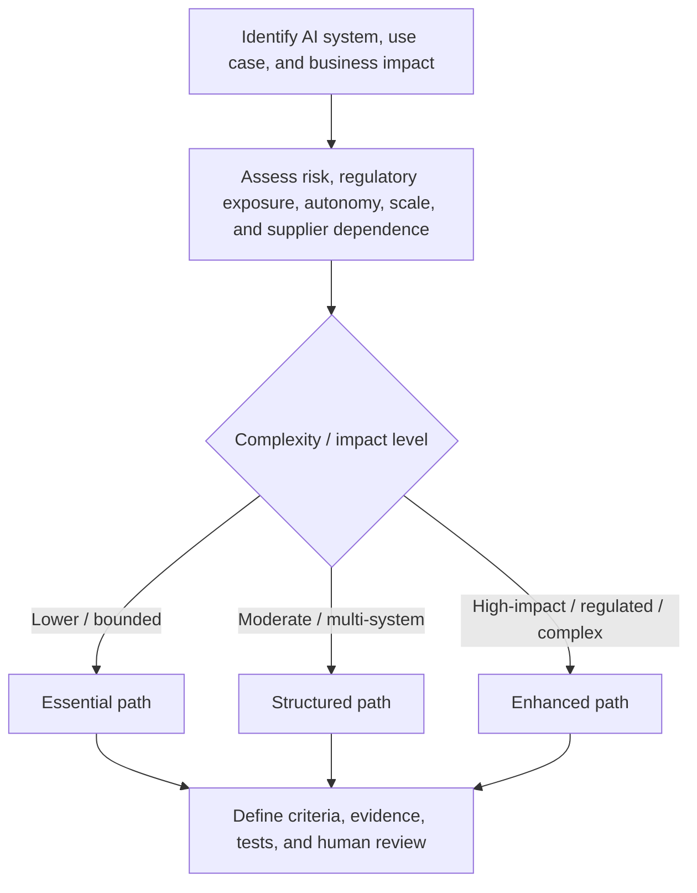
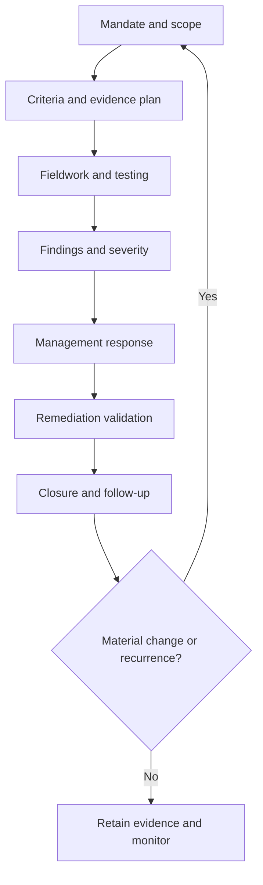
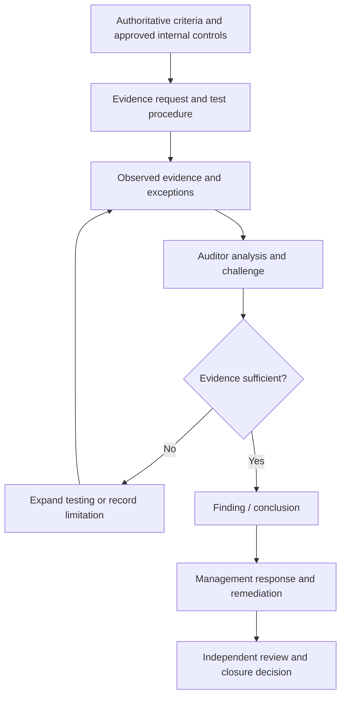

# Manual 05 — AI Auditing and Assurance Implementation Paths

This implementation entry provides a proportional operating model for organizations conducting AI audit and assurance work. It does not change the truthfulness requirement: every conclusion must state what was examined, against which criteria, with what evidence, under which limitations, and by whom.

## 1. Select the assurance path

### Essential

Use when AI scope is limited, organizational complexity is low, the audit team is small, or the engagement is an initial readiness/internal review. Minimum expectations:

- written mandate, objective, criteria, and scope;
- inventory of in-scope AI systems/use cases and accountable owners;
- documented evidence request and test plan;
- traceable findings and management responses;
- explicit evidence limitations and residual risk;
- remediation tracking and follow-up;
- reviewer/date/decision record.

### Structured

Use when multiple AI systems, business units, regulatory obligations, suppliers, or higher-risk use cases are involved. Add:

- risk-based sampling and documented rationale;
- separation of design-effectiveness and operating-effectiveness testing;
- lifecycle and change-management testing;
- model/data/system lineage evidence;
- supplier and dependency assurance;
- human-oversight effectiveness testing;
- severity methodology and root-cause analysis;
- independent quality review before closure.

### Enhanced

Use for high-impact, safety-relevant, highly regulated, externally assured, enterprise-scale, or complex agentic/Generative AI environments. Add:

- specialist technical testing and challenge;
- independent audit/assurance leadership where required;
- expanded sampling and population-quality controls;
- scenario, misuse, abuse, red-team, resilience, incident, and rollback evidence;
- cross-framework criteria mapping;
- executive/board escalation thresholds;
- formal remediation validation and recurrence analysis;
- retained evidence package capable of external scrutiny.

## 2. Route by risk and complexity

**Accessible explanation:** Start with the AI system or use case and evaluate impact, regulatory exposure, autonomy, organizational scale, and supplier dependence. Lower-complexity work follows Essential controls, moderate multi-system work follows Structured controls, and high-impact or regulated work follows Enhanced controls. Every path still requires defined criteria, evidence, tests, and human review.

## 3. Audit lifecycle

### Stage 1 — Mandate and scope

Record the audit sponsor, authority, objective, intended users, independence considerations, systems/use cases, locations, lifecycle stages, suppliers, exclusions, time period, and reporting route. Scope exclusions must never be hidden when they could change how a reader interprets the result.

### Stage 2 — Criteria and evidence plan

Criteria may include law, regulation, contractual obligations, organizational policy, approved risk appetite, internal controls, NIST guidance, ISO management-system requirements available under appropriate licensing, or other controlled requirements. Record source/version and whether each criterion is mandatory, voluntary, contractual, or internally adopted.

For each objective, define expected evidence, population, sample approach, test method, responsible tester, and expected conclusion type. Avoid vague tests such as “review governance.” State exactly what evidence would support or contradict the control objective.

### Stage 3 — Fieldwork and testing

Test relevant combinations of:

- governance and accountability;
- AI inventory and use-case approval;
- risk and impact assessment;
- data provenance, quality, privacy, and access controls;
- model/system development and evaluation;
- Generative AI and agentic-AI guardrails;
- security threats and mitigations;
- human oversight and escalation;
- transparency and user communication;
- supplier/vendor dependencies;
- logging, monitoring, incidents, rollback, and decommissioning;
- policy exceptions and risk acceptance.

Differentiate documentary evidence from operational evidence. A policy alone does not prove implementation; a configuration screenshot alone does not prove sustained operation.

### Stage 4 — Findings and severity

A controlled finding should contain:

1. **Criteria** — what requirement/control expectation applies.
2. **Condition** — what evidence shows actually occurred.
3. **Cause** — why the gap exists, when supportable.
4. **Risk/impact** — why the condition matters.
5. **Evidence** — traceable supporting records.
6. **Scope/limitation** — population/sample/time boundaries.
7. **Severity** — using the approved methodology.
8. **Owner** — accountable management owner.

Do not upgrade an observation into a confirmed failure without adequate evidence. Do not downgrade a confirmed high-risk condition merely because remediation is planned.

### Stage 5 — Management response

Capture agreement/disagreement, rationale, accountable owner, remediation action, target date, risk acceptance/escalation where applicable, and dependencies. Management response does not erase the original finding.

### Stage 6 — Remediation validation

Validate corrective action against the finding and root cause. Evidence should demonstrate that the changed control is implemented and, where appropriate, operating for a sufficient period. Record residual risk and any partial remediation honestly.

### Stage 7 — Closure and follow-up

Close only when the approved closure criteria are satisfied. Preserve unresolved items, exceptions, evidence links, reviewer decisions, and recurrence indicators. Material system, model, data, supplier, legal, or source changes can trigger reassessment.

**Accessible explanation:** The audit starts with an authorized scope, proceeds through criteria/evidence planning, fieldwork, findings, management response, remediation validation, and closure. A material change or recurrence returns the work to a new scoped assessment rather than silently relying on old evidence.

## 4. Evidence sufficiency and sampling

The engagement should define evidence sufficiency before conclusions are finalized. Consider relevance, reliability, completeness, timeliness, source independence, population quality, reproducibility, and contradictory evidence.

Sampling should record:

- population definition;
- population completeness checks;
- sample size and selection method;
- risk-based or statistical rationale as applicable;
- exceptions found;
- whether exceptions require expanded testing;
- conclusion limitations.

For AI systems, evidence may include system cards, model cards, impact assessments, risk registers, evaluation results, red-team reports, prompts/test suites, guardrail configurations, logs, incident tickets, change records, access records, supplier attestations, contracts, DPIAs, approvals, monitoring metrics, and user-feedback evidence. The existence of an artifact is not automatically proof that the control is effective.

## 5. Technical and human testing

AI assurance frequently requires both technical evidence and human-process evidence. The engagement should determine whether it has the competence to test:

- model/system behavior under expected and adverse conditions;
- hallucination/confabulation risk where relevant;
- content provenance and integrity;
- bias/fairness controls where applicable;
- security and privacy controls;
- prompt injection and tool-use boundaries;
- agent permissions and authorization;
- data leakage paths;
- monitoring and incident detection;
- stop, rollback, containment, and decommissioning mechanisms.

When competence is unavailable, record the limitation or use a qualified specialist. Do not imply testing that was not performed.

## 6. Independence, competence, and conflicts

Document who designed the control, who operates it, who tested it, and who reviews the conclusion. Internal audit, second-line assurance, readiness assessment, and external certification contexts have different independence expectations. The manual must not collapse those distinctions.

Conflict-of-interest controls should address self-review, management participation, vendor incentives, implementation-team involvement, and pressure to alter severity or conclusions.

## 7. Cross-framework assurance

A single AI control may support multiple criteria, but mapping does not prove equivalence. Crosswalks should preserve the original requirement meaning, applicability, scope, and evidence expectations. Examples of controlled source families include ISO/IEC 42001, ISO 19011, ISO/IEC 42006, NIST AI RMF, NIST AI 600-1, and NIST SP 800-53A.

Where a proprietary standard is involved, the repository may summarize original implementation concepts but must not reproduce copyrighted requirements beyond permitted use.

## 8. Reporting model

The report should separate:

- executive conclusion;
- engagement objective and scope;
- criteria;
- methodology and sampling;
- confirmed findings;
- observations and recommendations;
- evidence limitations;
- management responses;
- unresolved disputes;
- residual risk;
- follow-up requirements;
- assurance boundary.

A readiness review must not be labeled as certification. Internal QA must not be labeled as independent audit assurance. Repository QA must not be presented as evidence that an organization complies with a law, framework, or standard.

## 9. Evidence-to-decision chain

**Accessible explanation:** Conclusions originate from controlled criteria, planned tests, and observed evidence. If evidence is insufficient, testing expands or the limitation is recorded. Only sufficiently supported conclusions proceed to management response, remediation, independent review, and closure.

## 10. Minimum release evidence for this manual

Before Manual 05 can be published, the project must retain:

- controlled English source master;
- source verification and source-status record;
- editorial/technical review evidence;
- `es-419` and `pt-BR` semantic-review evidence;
- graphic accessibility evidence;
- DOCX/PDF processing evidence;
- page-level QA;
- security/repository audit;
- checksums and release manifest;
- reviewer/date/decision records;
- final human release approval.

Passing automated checks is supporting evidence only. Human judgment remains required where the control framework says it is required.
