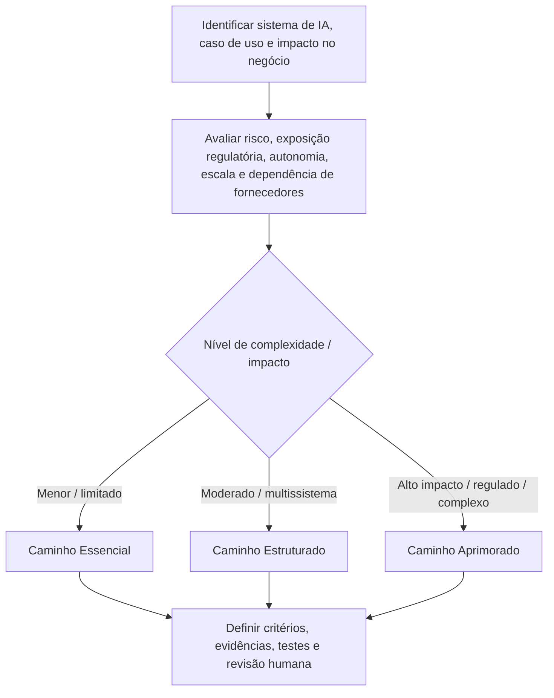
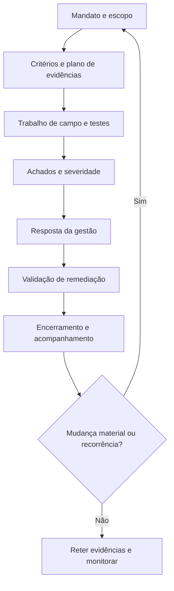
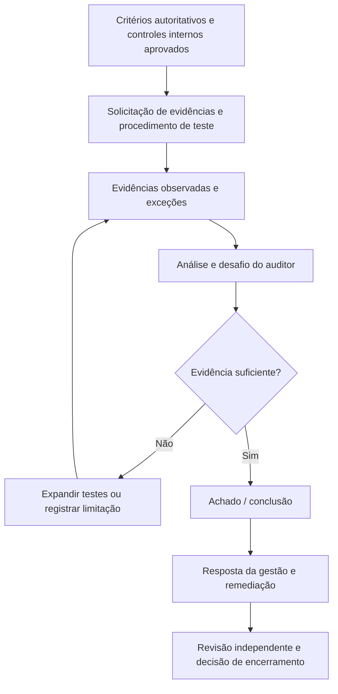

# Manual 05 — Caminhos de implementação para auditoria e asseguração de IA

Esta seção de implementação fornece um modelo operacional proporcional para organizações que realizam trabalhos de auditoria e asseguração de IA. Ela não altera o requisito de veracidade: toda conclusão deve declarar o que foi examinado, contra quais critérios, com quais evidências, sob quais limitações e por quem.

## 1. Selecionar o caminho de asseguração

### Essencial

Use quando o escopo de IA for limitado, a complexidade organizacional for baixa, a equipe de auditoria for pequena ou o trabalho for uma revisão inicial de prontidão ou interna. Expectativas mínimas:

- mandato, objetivo, critérios e escopo por escrito;
- inventário de sistemas/casos de uso de IA no escopo e responsáveis;
- solicitação de evidências e plano de testes documentados;
- achados e respostas da gestão rastreáveis;
- limitações de evidência e risco residual explícitos;
- acompanhamento de remediação e follow-up;
- registro de revisor/data/decisão.

### Estruturado

Use quando houver vários sistemas de IA, unidades de negócio, obrigações regulatórias, fornecedores ou casos de uso de maior risco. Acrescente:

- amostragem baseada em risco e justificativa documentada;
- separação entre testes de eficácia de desenho e eficácia operacional;
- testes de ciclo de vida e gestão de mudanças;
- evidência de linhagem de modelo/dados/sistema;
- asseguração de fornecedores e dependências;
- testes de eficácia da supervisão humana;
- metodologia de severidade e análise de causa raiz;
- revisão independente de qualidade antes do encerramento.

### Aprimorado

Use para ambientes de alto impacto, relevantes para segurança, altamente regulados, sujeitos a asseguração externa, de escala empresarial ou com IA generativa/agêntica complexa. Acrescente:

- testes técnicos especializados e desafio independente;
- liderança independente de auditoria/asseguração quando aplicável;
- amostragem ampliada e controles de qualidade da população;
- evidências de cenários, uso indevido, abuso, red team, resiliência, incidentes e rollback;
- mapeamento de critérios entre frameworks;
- limites de escalonamento executivo/conselho;
- validação formal de remediação e análise de recorrência;
- pacote de evidências retido capaz de suportar escrutínio externo.

## 2. Direcionamento por risco e complexidade

**Explicação acessível:** Comece com o sistema ou caso de uso de IA e avalie impacto, exposição regulatória, autonomia, escala organizacional e dependência de fornecedores. Trabalhos de menor complexidade seguem controles Essenciais, trabalhos multissistema moderados seguem controles Estruturados e trabalhos de alto impacto ou regulados seguem controles Aprimorados. Todo caminho exige critérios, evidências, testes e revisão humana definidos.

## 3. Ciclo de vida da auditoria

### Etapa 1 — Mandato e escopo

Registre patrocinador, autoridade, objetivo, usuários previstos, considerações de independência, sistemas/casos de uso, locais, etapas do ciclo de vida, fornecedores, exclusões, período e rota de reporte. Exclusões de escopo nunca devem ser ocultadas quando puderem alterar a interpretação do resultado.

### Etapa 2 — Critérios e plano de evidências

Os critérios podem incluir leis, regulamentos, obrigações contratuais, políticas organizacionais, apetite de risco aprovado, controles internos, orientações NIST, requisitos de sistemas de gestão ISO disponíveis sob licença apropriada ou outros requisitos controlados. Registre a fonte/versão e se cada critério é obrigatório, voluntário, contratual ou adotado internamente.

Para cada objetivo, defina evidência esperada, população, abordagem de amostra, método de teste, responsável pelo teste e tipo de conclusão esperado. Evite testes vagos como “revisar governança”. Declare exatamente qual evidência apoiaria ou contraditaria o objetivo de controle.

### Etapa 3 — Trabalho de campo e testes

Teste combinações relevantes de:

- governança e responsabilização;
- inventário de IA e aprovação de casos de uso;
- avaliação de risco e impacto;
- proveniência, qualidade, privacidade e controles de acesso de dados;
- desenvolvimento e avaliação de modelo/sistema;
- guardrails de IA generativa e agêntica;
- ameaças de segurança e mitigações;
- supervisão humana e escalonamento;
- transparência e comunicação com usuários;
- dependências de fornecedores;
- logging, monitoramento, incidentes, rollback e desativação;
- exceções de política e aceitação de risco.

Diferencie evidência documental de evidência operacional. Uma política sozinha não prova implementação; uma captura de configuração sozinha não prova operação sustentada.

### Etapa 4 — Achados e severidade

Um achado controlado deve conter:

1. **Critério** — requisito ou expectativa de controle aplicável.
2. **Condição** — o que a evidência demonstra que ocorreu.
3. **Causa** — por que a lacuna existe, quando suportável.
4. **Risco/impacto** — por que a condição importa.
5. **Evidência** — registros de suporte rastreáveis.
6. **Escopo/limitação** — limites de população/amostra/tempo.
7. **Severidade** — usando a metodologia aprovada.
8. **Responsável** — proprietário de gestão responsável.

Não promova uma observação a falha confirmada sem evidência adequada. Não reduza uma condição confirmada de alto risco apenas porque há remediação planejada.

### Etapa 5 — Resposta da gestão

Registre concordância/discordância, justificativa, responsável, ação de remediação, data-alvo, aceitação/escalonamento de risco quando aplicável e dependências. A resposta da gestão não apaga o achado original.

### Etapa 6 — Validação de remediação

Valide a ação corretiva em relação ao achado e à causa raiz. A evidência deve demonstrar que o controle alterado foi implementado e, quando apropriado, está operando por período suficiente. Registre honestamente risco residual e remediação parcial.

### Etapa 7 — Encerramento e acompanhamento

Encerre somente quando os critérios de encerramento aprovados forem atendidos. Preserve itens não resolvidos, exceções, links de evidência, decisões de revisão e indicadores de recorrência. Mudanças materiais em sistema, modelo, dados, fornecedor, lei ou fonte podem acionar nova avaliação.

**Explicação acessível:** A auditoria começa com um escopo autorizado, segue pelo planejamento de critérios/evidências, trabalho de campo, achados, resposta da gestão, validação de remediação e encerramento. Uma mudança material ou recorrência leva o trabalho de volta a uma nova avaliação com escopo definido, em vez de depender silenciosamente de evidência antiga.

## 4. Suficiência de evidências e amostragem

O trabalho deve definir a suficiência das evidências antes de finalizar conclusões. Considere relevância, confiabilidade, completude, tempestividade, independência da fonte, qualidade da população, reprodutibilidade e evidência contraditória.

A amostragem deve registrar:

- definição da população;
- verificações de completude da população;
- tamanho da amostra e método de seleção;
- justificativa baseada em risco ou estatística, conforme aplicável;
- exceções encontradas;
- se as exceções exigem expansão dos testes;
- limitações da conclusão.

Para sistemas de IA, evidências podem incluir system cards, model cards, avaliações de impacto, registros de risco, resultados de avaliação, relatórios de red team, prompts/conjuntos de teste, configurações de guardrails, logs, tickets de incidentes, registros de mudança, registros de acesso, atestações de fornecedores, contratos, DPIAs, aprovações, métricas de monitoramento e evidências de feedback de usuários. A existência de um artefato não prova automaticamente a eficácia do controle.

## 5. Testes técnicos e humanos

A asseguração de IA frequentemente exige evidência técnica e evidência de processos humanos. O trabalho deve determinar se possui competência para testar:

- comportamento do modelo/sistema em condições esperadas e adversas;
- risco de alucinação/confabulação quando relevante;
- proveniência e integridade do conteúdo;
- controles de viés/equidade quando aplicáveis;
- controles de segurança e privacidade;
- prompt injection e limites de uso de ferramentas;
- permissões e autorização de agentes;
- caminhos de vazamento de dados;
- monitoramento e detecção de incidentes;
- mecanismos de parada, rollback, contenção e desativação.

Quando não houver competência suficiente, registre a limitação ou use especialista qualificado. Não dê a entender que testes não realizados foram executados.

## 6. Independência, competência e conflitos

Documente quem projetou o controle, quem o opera, quem o testou e quem revisa a conclusão. Auditoria interna, asseguração de segunda linha, avaliação de prontidão e certificação externa possuem expectativas de independência diferentes. O manual não deve colapsar essas distinções.

Controles de conflito de interesse devem tratar autorrevisão, participação da gestão, incentivos de fornecedores, envolvimento da equipe de implementação e pressão para alterar severidade ou conclusões.

## 7. Asseguração entre frameworks

Um único controle de IA pode apoiar múltiplos critérios, mas o mapeamento não prova equivalência. Crosswalks devem preservar o significado original do requisito, aplicabilidade, escopo e expectativas de evidência. Exemplos de famílias de fontes controladas incluem ISO/IEC 42001, ISO 19011, ISO/IEC 42006, NIST AI RMF, NIST AI 600-1 e NIST SP 800-53A.

Quando houver padrão proprietário, o repositório pode resumir conceitos originais de implementação, mas não deve reproduzir requisitos protegidos além do uso permitido.

## 8. Modelo de relatório

O relatório deve separar:

- conclusão executiva;
- objetivo e escopo do trabalho;
- critérios;
- metodologia e amostragem;
- achados confirmados;
- observações e recomendações;
- limitações de evidência;
- respostas da gestão;
- disputas não resolvidas;
- risco residual;
- requisitos de acompanhamento;
- limite de asseguração.

Uma revisão de prontidão não deve ser rotulada como certificação. QA interna não deve ser rotulada como asseguração independente de auditoria. QA do repositório não deve ser apresentada como evidência de que uma organização cumpre uma lei, framework ou padrão.

## 9. Cadeia de evidência até a decisão

**Explicação acessível:** As conclusões se originam em critérios controlados, testes planejados e evidências observadas. Se a evidência for insuficiente, os testes são expandidos ou a limitação é registrada. Somente conclusões suficientemente sustentadas seguem para resposta da gestão, remediação, revisão independente e encerramento.

## 10. Evidência mínima de liberação para este manual

Antes da publicação do Manual 05, o projeto deve reter:

- fonte mestra controlada em inglês;
- verificação de fontes e registro do estado das fontes;
- evidência de revisão editorial/técnica;
- evidência de revisão semântica de `es-419` e `pt-BR`;
- evidência de acessibilidade de gráficos;
- evidência de processamento DOCX/PDF;
- QA em nível de página;
- auditoria de segurança/repositório;
- checksums e manifesto de liberação;
- registros de revisor/data/decisão;
- aprovação humana final de liberação.

A aprovação em verificações automatizadas é apenas evidência de suporte. O julgamento humano continua obrigatório quando o framework de controle assim exigir.
