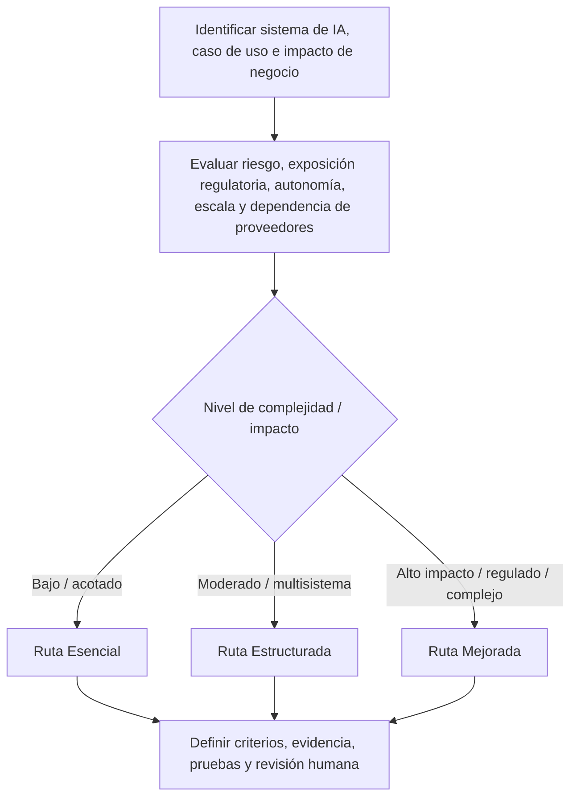
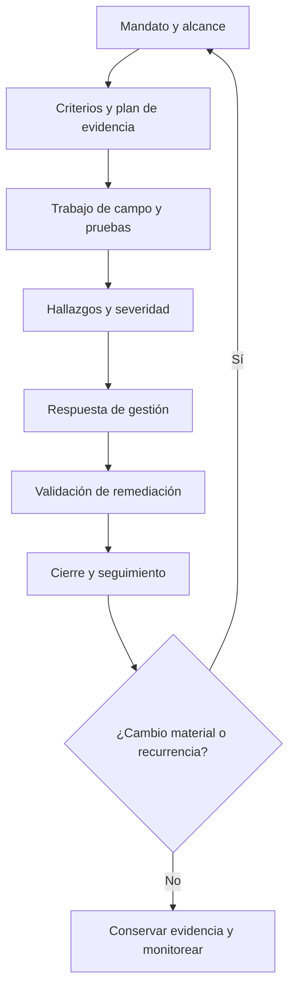
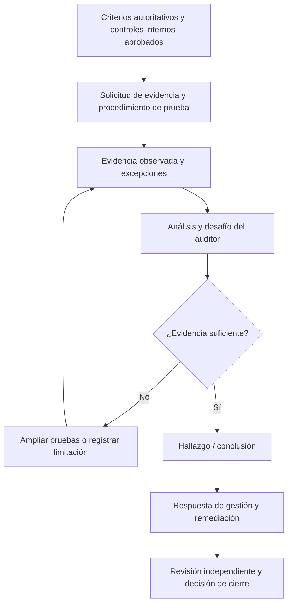

# Manual 05 — Rutas de implementación para auditoría y aseguramiento de IA

Esta sección de implementación proporciona un modelo operativo proporcional para organizaciones que realizan auditoría y aseguramiento de IA. No modifica el requisito de veracidad: toda conclusión debe indicar qué se examinó, contra qué criterios, con qué evidencia, bajo qué limitaciones y por quién.

## 1. Seleccionar la ruta de aseguramiento

### Esencial

Úsela cuando el alcance de IA sea limitado, la complejidad organizacional sea baja, el equipo de auditoría sea pequeño o el trabajo sea una revisión inicial de preparación o interna. Expectativas mínimas:

- mandato, objetivo, criterios y alcance por escrito;
- inventario de sistemas/casos de uso de IA incluidos y responsables;
- solicitud de evidencia y plan de pruebas documentados;
- hallazgos y respuestas de gestión trazables;
- limitaciones de evidencia y riesgo residual explícitos;
- seguimiento de remediación y seguimiento posterior;
- registro de revisor/fecha/decisión.

### Estructurada

Úsela cuando existan múltiples sistemas de IA, unidades de negocio, obligaciones regulatorias, proveedores o casos de uso de mayor riesgo. Agregue:

- muestreo basado en riesgo y justificación documentada;
- separación de pruebas de eficacia de diseño y eficacia operativa;
- pruebas del ciclo de vida y gestión de cambios;
- evidencia de linaje de modelo/datos/sistema;
- aseguramiento de proveedores y dependencias;
- pruebas de eficacia de supervisión humana;
- metodología de severidad y análisis de causa raíz;
- revisión independiente de calidad antes del cierre.

### Mejorada

Úsela para entornos de alto impacto, relevantes para la seguridad, altamente regulados, sujetos a aseguramiento externo, de escala empresarial o con IA generativa/agéntica compleja. Agregue:

- pruebas técnicas especializadas y desafío independiente;
- liderazgo independiente de auditoría/aseguramiento cuando corresponda;
- muestreo ampliado y controles de calidad de la población;
- evidencia de escenarios, uso indebido, abuso, red teaming, resiliencia, incidentes y reversión;
- mapeo de criterios entre marcos;
- umbrales de escalamiento ejecutivo/directivo;
- validación formal de remediación y análisis de recurrencia;
- paquete de evidencia conservado capaz de soportar escrutinio externo.

## 2. Enrutamiento por riesgo y complejidad

**Explicación accesible:** Comience con el sistema o caso de uso de IA y evalúe impacto, exposición regulatoria, autonomía, escala organizacional y dependencia de proveedores. El trabajo de menor complejidad sigue controles Esenciales, el trabajo multisistema moderado sigue controles Estructurados y el trabajo de alto impacto o regulado sigue controles Mejorados. Toda ruta exige criterios, evidencia, pruebas y revisión humana definidos.

## 3. Ciclo de vida de auditoría

### Etapa 1 — Mandato y alcance

Registre patrocinador, autoridad, objetivo, usuarios previstos, consideraciones de independencia, sistemas/casos de uso, ubicaciones, etapas del ciclo de vida, proveedores, exclusiones, período y ruta de reporte. Las exclusiones de alcance no deben ocultarse cuando puedan cambiar la interpretación del resultado.

### Etapa 2 — Criterios y plan de evidencia

Los criterios pueden incluir leyes, regulación, obligaciones contractuales, políticas organizacionales, apetito de riesgo aprobado, controles internos, guías NIST, requisitos de sistemas de gestión ISO disponibles bajo la licencia correspondiente u otros requisitos controlados. Registre la fuente/versión y si cada criterio es obligatorio, voluntario, contractual o adoptado internamente.

Para cada objetivo, defina evidencia esperada, población, enfoque de muestra, método de prueba, responsable y tipo de conclusión esperado. Evite pruebas vagas como “revisar gobernanza”. Indique exactamente qué evidencia respaldaría o contradiría el objetivo de control.

### Etapa 3 — Trabajo de campo y pruebas

Pruebe combinaciones relevantes de:

- gobernanza y rendición de cuentas;
- inventario de IA y aprobación de casos de uso;
- evaluación de riesgo e impacto;
- procedencia, calidad, privacidad y controles de acceso de datos;
- desarrollo y evaluación de modelo/sistema;
- salvaguardas de IA generativa y agéntica;
- amenazas de seguridad y mitigaciones;
- supervisión humana y escalamiento;
- transparencia y comunicación con usuarios;
- dependencias de proveedores;
- registro, monitoreo, incidentes, reversión y retiro;
- excepciones de política y aceptación de riesgo.

Diferencie evidencia documental de evidencia operativa. Una política por sí sola no demuestra implementación; una captura de configuración por sí sola no demuestra operación sostenida.

### Etapa 4 — Hallazgos y severidad

Un hallazgo controlado debe contener:

1. **Criterio** — requisito o expectativa de control aplicable.
2. **Condición** — lo que la evidencia demuestra que ocurrió.
3. **Causa** — por qué existe la brecha, cuando sea sustentable.
4. **Riesgo/impacto** — por qué importa la condición.
5. **Evidencia** — registros trazables de respaldo.
6. **Alcance/limitación** — límites de población/muestra/tiempo.
7. **Severidad** — usando la metodología aprobada.
8. **Responsable** — propietario de gestión responsable.

No convierta una observación en falla confirmada sin evidencia suficiente. No reduzca una condición confirmada de alto riesgo solo porque exista remediación planificada.

### Etapa 5 — Respuesta de gestión

Registre acuerdo/desacuerdo, justificación, responsable, acción de remediación, fecha objetivo, aceptación/escalamiento de riesgo cuando corresponda y dependencias. La respuesta de gestión no elimina el hallazgo original.

### Etapa 6 — Validación de remediación

Valide la acción correctiva contra el hallazgo y su causa raíz. La evidencia debe demostrar que el control modificado está implementado y, cuando corresponda, operando durante un período suficiente. Registre honestamente riesgo residual y remediación parcial.

### Etapa 7 — Cierre y seguimiento

Cierre solo cuando se satisfagan los criterios de cierre aprobados. Preserve asuntos no resueltos, excepciones, vínculos de evidencia, decisiones de revisión e indicadores de recurrencia. Cambios materiales de sistema, modelo, datos, proveedor, ley o fuente pueden activar una nueva evaluación.

**Explicación accesible:** La auditoría comienza con un alcance autorizado, continúa con la planificación de criterios/evidencia, trabajo de campo, hallazgos, respuesta de gestión, validación de remediación y cierre. Un cambio material o recurrencia devuelve el trabajo a una nueva evaluación con alcance definido en lugar de confiar silenciosamente en evidencia anterior.

## 4. Suficiencia de evidencia y muestreo

El trabajo debe definir la suficiencia de evidencia antes de finalizar conclusiones. Considere relevancia, confiabilidad, integridad, oportunidad, independencia de la fuente, calidad de la población, reproducibilidad y evidencia contradictoria.

El muestreo debe registrar:

- definición de población;
- verificaciones de integridad de población;
- tamaño de muestra y método de selección;
- justificación basada en riesgo o estadística según corresponda;
- excepciones detectadas;
- si las excepciones requieren ampliar pruebas;
- limitaciones de la conclusión.

Para sistemas de IA, la evidencia puede incluir system cards, model cards, evaluaciones de impacto, registros de riesgo, resultados de evaluación, informes de red team, prompts/conjuntos de prueba, configuraciones de guardrails, logs, tickets de incidentes, registros de cambio, registros de acceso, atestaciones de proveedores, contratos, DPIA, aprobaciones, métricas de monitoreo y evidencia de retroalimentación de usuarios. La existencia de un artefacto no demuestra automáticamente eficacia del control.

## 5. Pruebas técnicas y humanas

El aseguramiento de IA suele requerir evidencia técnica y evidencia de procesos humanos. El trabajo debe determinar si cuenta con competencia para probar:

- comportamiento del modelo/sistema bajo condiciones esperadas y adversas;
- riesgo de alucinación/confabulación cuando sea relevante;
- procedencia e integridad del contenido;
- controles de sesgo/equidad cuando correspondan;
- controles de seguridad y privacidad;
- inyección de prompts y límites de uso de herramientas;
- permisos y autorización de agentes;
- rutas de fuga de datos;
- monitoreo y detección de incidentes;
- mecanismos de detención, reversión, contención y retiro.

Cuando no exista competencia suficiente, registre la limitación o use un especialista calificado. No implique que se realizaron pruebas que no ocurrieron.

## 6. Independencia, competencia y conflictos

Documente quién diseñó el control, quién lo opera, quién lo probó y quién revisa la conclusión. Auditoría interna, aseguramiento de segunda línea, evaluación de preparación y certificación externa tienen expectativas de independencia distintas. El manual no debe colapsar esas diferencias.

Los controles de conflicto de interés deben abordar auto-revisión, participación de gestión, incentivos de proveedores, participación del equipo de implementación y presión para alterar severidad o conclusiones.

## 7. Aseguramiento entre marcos

Un solo control de IA puede respaldar múltiples criterios, pero un mapeo no demuestra equivalencia. Los crosswalks deben preservar el significado original del requisito, aplicabilidad, alcance y expectativas de evidencia. Ejemplos de familias de fuentes controladas incluyen ISO/IEC 42001, ISO 19011, ISO/IEC 42006, NIST AI RMF, NIST AI 600-1 y NIST SP 800-53A.

Cuando intervenga un estándar propietario, el repositorio puede resumir conceptos originales de implementación, pero no debe reproducir requisitos protegidos más allá del uso permitido.

## 8. Modelo de reporte

El informe debe separar:

- conclusión ejecutiva;
- objetivo y alcance del trabajo;
- criterios;
- metodología y muestreo;
- hallazgos confirmados;
- observaciones y recomendaciones;
- limitaciones de evidencia;
- respuestas de gestión;
- disputas no resueltas;
- riesgo residual;
- requisitos de seguimiento;
- límite de aseguramiento.

Una revisión de preparación no debe etiquetarse como certificación. La QA interna no debe etiquetarse como aseguramiento independiente de auditoría. La QA del repositorio no debe presentarse como evidencia de que una organización cumple una ley, marco o estándar.

## 9. Cadena de evidencia a decisión

**Explicación accesible:** Las conclusiones se originan en criterios controlados, pruebas planificadas y evidencia observada. Si la evidencia es insuficiente, se amplían las pruebas o se registra la limitación. Solo conclusiones suficientemente sustentadas pasan a respuesta de gestión, remediación, revisión independiente y cierre.

## 10. Evidencia mínima de liberación para este manual

Antes de publicar el Manual 05, el proyecto debe conservar:

- maestro de fuente controlada en inglés;
- verificación de fuentes y registro de estado de fuentes;
- evidencia de revisión editorial/técnica;
- evidencia de revisión semántica de `es-419` y `pt-BR`;
- evidencia de accesibilidad de gráficos;
- evidencia de procesamiento DOCX/PDF;
- QA a nivel de página;
- auditoría de seguridad/repositorio;
- checksums y manifiesto de liberación;
- registros de revisor/fecha/decisión;
- aprobación humana final de liberación.

Pasar verificaciones automatizadas constituye solo evidencia de soporte. El juicio humano sigue siendo obligatorio cuando el marco de control lo exige.
