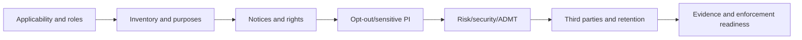
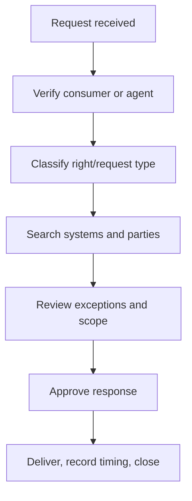
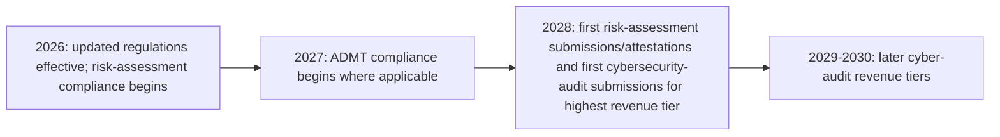

# Manual 12 — CCPA / CPRA Implementation Paths

These paths scale implementation depth without changing the underlying legal obligations. Applicability and legal interpretation remain organization-specific and require competent human judgment.

## Path A — Essential

Designed for smaller or less complex organizations whose California privacy obligations can be operated through a comparatively bounded data environment.

Minimum operating package:
- applicability and threshold analysis;
- role inventory for business, service provider, contractor, and third-party relationships;
- personal-information and sensitive-PI inventory;
- notice at collection and privacy-policy controls;
- consumer-rights intake, verification, response, timing, and evidence;
- sale/sharing and opt-out preference signal handling;
- retention/deletion rules;
- contract controls for service providers/contractors;
- risk-assessment screening;
- reasonable-security baseline;
- evidence register and periodic management review.

## Path B — Structured

Designed for organizations with multiple business units, websites/apps, advertising ecosystems, suppliers, data products, or higher-volume consumer requests.

Add:
- enterprise data-flow and purpose inventory;
- automated opt-out preference signal testing;
- sensitive-PI use/disclosure controls;
- minors/opt-in workflow where applicable;
- financial-incentive governance;
- formal service-provider/contractor due diligence;
- documented risk-assessment methodology and review board;
- cybersecurity-audit readiness planning;
- ADMT inventory and applicability screening;
- request-quality metrics and exception review;
- data retention/deletion validation;
- privacy engineering integration into change management;
- enforcement-response evidence package.

## Path C — Enhanced

Designed for large, data-intensive, advertising-heavy, AI-enabled, multinational, or highly regulated organizations.

Add:
- enterprise California privacy control framework;
- automated data discovery with human validation;
- continuous preference-signal monitoring;
- advanced advertising/measurement/identity-resolution governance;
- centralized sensitive-PI controls;
- formal risk-assessment portfolio governance;
- independent challenge for material risk assessments;
- cybersecurity-audit evidence architecture and phased-deadline readiness;
- ADMT significant-decision governance, pre-use notices, access/opt-out operations, and 2027 readiness;
- data-broker/DROP applicability screening where relevant;
- continuous third-party and data-flow monitoring;
- executive privacy metrics and corrective-action tracking;
- crosswalks to GDPR, NIST Privacy Framework, ISO/IEC 27701, ISO/IEC 27001, and sector requirements where useful.

## Seven-gate California privacy lifecycle

**Accessible explanation:** The California privacy lifecycle begins with applicability and role analysis, then maps data and purposes, operationalizes notices and rights, handles opt-out and sensitive-PI controls, evaluates risk/security/ADMT obligations, governs downstream parties and retention, and maintains evidence for review and enforcement readiness.

## Consumer-rights routing

**Accessible explanation:** A request should be validated, classified, searched across relevant systems and downstream parties, reviewed for applicable exceptions or scope limits, approved by accountable personnel, delivered within the applicable timing requirements, and closed with evidence.

## 2026–2028 phased-regulation timeline

**Accessible explanation:** Updated CPPA regulations are effective in 2026, but some compliance dates are phased. Risk-assessment obligations begin in 2026; ADMT requirements begin in 2027 where applicable; risk-assessment submission/attestation and the first cybersecurity-audit submissions begin in 2028, with later audit tiers following. Exact applicability and dates must be reverified at the final candidate.

## Fail-closed boundary

Automation may validate required records, timing fields, request workflow completeness, preference-signal tests, evidence links, and source-state labels. It cannot make final organization-specific legal conclusions on applicability, exemptions, ADMT classification, risk-assessment sufficiency, audit scope, or compliance. Human legal/privacy review and Final Human Release Approval remain mandatory.
