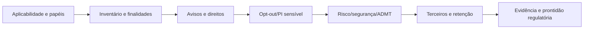
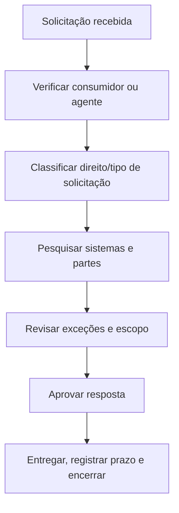
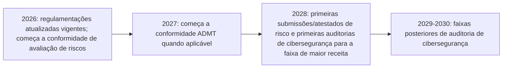

# Manual 12 — Caminhos de implementação CCPA / CPRA

> **Rascunho controlado assistido por máquina (`pt-BR`).** A edição em inglês continua sendo a fonte controlada. Esta localização não constitui aprovação jurídica, semântica ou terminológica humana e permanece sujeita a revisão competente antes da publicação.

Estes caminhos dimensionam a profundidade da implementação sem alterar as obrigações jurídicas subjacentes. A aplicabilidade e a interpretação jurídica permanecem específicas de cada organização e exigem julgamento humano competente.

## Caminho A — Essencial

Projetado para organizações menores ou menos complexas cujas obrigações de privacidade da Califórnia possam ser operadas em um ambiente de dados comparativamente delimitado.

Pacote operacional mínimo:
- análise de aplicabilidade e limites;
- inventário de papéis para relações de empresa, prestador de serviços, contratado e terceiros;
- inventário de informações pessoais e informações pessoais sensíveis;
- controles de aviso na coleta e política de privacidade;
- entrada, verificação, resposta, prazos e evidências de direitos dos consumidores;
- tratamento de venda/compartilhamento e sinais de preferência de opt-out;
- regras de retenção/eliminação;
- controles contratuais para prestadores de serviços/contratados;
- triagem de avaliação de riscos;
- linha de base de segurança razoável;
- registro de evidências e revisão periódica de gestão.

## Caminho B — Estruturado

Projetado para organizações com múltiplas unidades de negócio, sites/apps, ecossistemas de publicidade, fornecedores, produtos de dados ou maior volume de solicitações de consumidores.

Adicione:
- inventário corporativo de fluxos de dados e finalidades;
- testes automatizados de sinais de preferência de opt-out;
- controles de uso/divulgação de informações pessoais sensíveis;
- fluxo de opt-in para menores quando aplicável;
- governança de incentivos financeiros;
- due diligence formal de prestadores de serviços/contratados;
- metodologia documentada de avaliação de riscos e comitê de revisão;
- planejamento de prontidão para auditoria de cibersegurança;
- inventário de ADMT e triagem de aplicabilidade;
- métricas de qualidade de solicitações e revisão de exceções;
- validação de retenção/eliminação de dados;
- integração de engenharia de privacidade à gestão de mudanças;
- pacote de evidências para resposta regulatória.

## Caminho C — Aprimorado

Projetado para organizações grandes, intensivas em dados, com forte atividade publicitária, habilitadas por IA, multinacionais ou altamente reguladas.

Adicione:
- framework corporativo de controles de privacidade da Califórnia;
- descoberta automatizada de dados com validação humana;
- monitoramento contínuo de sinais de preferência;
- governança avançada de publicidade, medição e resolução de identidade;
- controles centralizados de informações pessoais sensíveis;
- governança formal do portfólio de avaliações de risco;
- desafio independente para avaliações de risco materiais;
- arquitetura de evidências para auditoria de cibersegurança e prontidão para prazos escalonados;
- governança de decisões significativas com ADMT, avisos prévios ao uso, operações de acesso/opt-out e prontidão para 2027;
- triagem de aplicabilidade de data brokers/DROP quando relevante;
- monitoramento contínuo de terceiros e fluxos de dados;
- métricas executivas de privacidade e acompanhamento de ações corretivas;
- crosswalks com RGPD, NIST Privacy Framework, ISO/IEC 27701, ISO/IEC 27001 e requisitos setoriais quando útil.

## Ciclo de privacidade da Califórnia com sete gates

**Explicação acessível:** O ciclo de privacidade da Califórnia começa com análise de aplicabilidade e papéis, mapeia dados e finalidades, operacionaliza avisos e direitos, trata opt-out e informações pessoais sensíveis, avalia obrigações de risco/segurança/ADMT, governa terceiros e retenção e mantém evidências para revisão e prontidão regulatória.

## Roteamento de direitos dos consumidores

**Explicação acessível:** Uma solicitação deve ser validada, classificada, pesquisada nos sistemas relevantes e partes downstream, revisada quanto a exceções ou limites de escopo aplicáveis, aprovada por pessoal responsável, entregue dentro dos prazos aplicáveis e encerrada com evidência.

## Cronograma regulatório escalonado 2026–2028

**Explicação acessível:** As regulamentações atualizadas da CPPA estão em vigor em 2026, mas algumas datas de conformidade são escalonadas. As obrigações de avaliação de riscos começam em 2026; os requisitos de ADMT começam em 2027 quando aplicáveis; as submissões/atestados de avaliação de riscos e as primeiras auditorias de cibersegurança começam em 2028, seguidas por faixas posteriores. A aplicabilidade e as datas exatas devem ser verificadas novamente no candidato final.

## Limite fail-closed

A automação pode validar registros obrigatórios, campos de prazo, completude dos fluxos de solicitações, testes de sinais de preferência, links de evidência e rótulos de estado das fontes. Ela não pode emitir conclusões jurídicas finais específicas da organização sobre aplicabilidade, isenções, classificação ADMT, suficiência de avaliação de riscos, escopo de auditoria ou conformidade. A revisão humana competente de privacidade/jurídica permanece obrigatória. A autorização final de liberação do proprietário aplica-se conforme o procedimento permanente do repositório quando todos os gates substantivos anteriores estiverem verdes.
