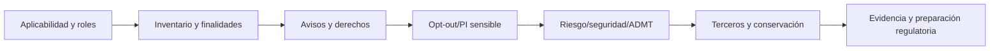
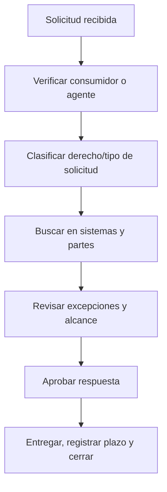
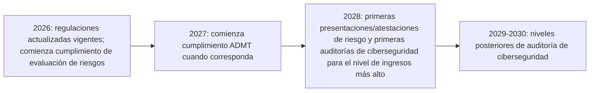

# Manual 12 — Rutas de implementación CCPA / CPRA

> **Borrador controlado asistido por máquina (`es-419`).** La edición en inglés sigue siendo la fuente controlada. Esta localización no constituye aprobación jurídica, semántica o terminológica humana y permanece sujeta a revisión competente antes de publicación.

Estas rutas escalan la profundidad de implementación sin modificar las obligaciones jurídicas subyacentes. La aplicabilidad y la interpretación jurídica siguen siendo específicas de cada organización y requieren juicio humano competente.

## Ruta A — Esencial

Diseñada para organizaciones más pequeñas o menos complejas cuyas obligaciones de privacidad de California puedan operarse mediante un entorno de datos comparativamente acotado.

Paquete operativo mínimo:
- análisis de aplicabilidad y umbrales;
- inventario de roles para relaciones de empresa, proveedor de servicios, contratista y terceros;
- inventario de información personal e información personal sensible;
- controles de aviso al momento de recopilación y política de privacidad;
- ingreso, verificación, respuesta, plazos y evidencia de derechos de consumidores;
- gestión de venta/intercambio y señales de preferencia de opt-out;
- reglas de conservación/eliminación;
- controles contractuales para proveedores de servicios/contratistas;
- selección para evaluación de riesgos;
- línea base de seguridad razonable;
- registro de evidencia y revisión periódica de gestión.

## Ruta B — Estructurada

Diseñada para organizaciones con múltiples unidades de negocio, sitios web/apps, ecosistemas publicitarios, proveedores, productos de datos o mayor volumen de solicitudes de consumidores.

Añada:
- inventario empresarial de flujos de datos y finalidades;
- pruebas automatizadas de señales de preferencia de opt-out;
- controles de uso/divulgación de información personal sensible;
- flujo de opt-in para menores cuando corresponda;
- gobierno de incentivos financieros;
- debida diligencia formal para proveedores de servicios/contratistas;
- metodología documentada de evaluación de riesgos y comité de revisión;
- planificación de preparación para auditorías de ciberseguridad;
- inventario de ADMT y selección de aplicabilidad;
- métricas de calidad de solicitudes y revisión de excepciones;
- validación de conservación/eliminación de datos;
- integración de ingeniería de privacidad en gestión de cambios;
- paquete de evidencia para respuesta regulatoria.

## Ruta C — Mejorada

Diseñada para organizaciones grandes, intensivas en datos, con alta actividad publicitaria, habilitadas por IA, multinacionales o altamente reguladas.

Añada:
- marco empresarial de controles de privacidad de California;
- descubrimiento automatizado de datos con validación humana;
- monitoreo continuo de señales de preferencia;
- gobierno avanzado de publicidad, medición y resolución de identidad;
- controles centralizados de información personal sensible;
- gobierno formal de cartera de evaluaciones de riesgo;
- desafío independiente para evaluaciones de riesgo materiales;
- arquitectura de evidencia para auditoría de ciberseguridad y preparación para plazos escalonados;
- gobierno de decisiones significativas con ADMT, avisos previos al uso, operaciones de acceso/opt-out y preparación para 2027;
- selección de aplicabilidad para corredores de datos/DROP cuando corresponda;
- monitoreo continuo de terceros y flujos de datos;
- métricas ejecutivas de privacidad y seguimiento de acciones correctivas;
- cruces con RGPD, NIST Privacy Framework, ISO/IEC 27701, ISO/IEC 27001 y requisitos sectoriales cuando sea útil.

## Ciclo de privacidad de California de siete compuertas

**Explicación accesible:** El ciclo de privacidad de California comienza con análisis de aplicabilidad y roles, luego mapea datos y finalidades, operacionaliza avisos y derechos, gestiona opt-out e información personal sensible, evalúa obligaciones de riesgo/seguridad/ADMT, gobierna terceros y conservación y mantiene evidencia para revisión y preparación regulatoria.

## Enrutamiento de derechos de consumidores

**Explicación accesible:** Una solicitud debe validarse, clasificarse, buscarse en sistemas relevantes y partes posteriores, revisarse frente a excepciones o límites de alcance aplicables, aprobarse por personal responsable, entregarse dentro de los plazos aplicables y cerrarse con evidencia.

## Cronología regulatoria escalonada 2026–2028

**Explicación accesible:** Las regulaciones actualizadas de la CPPA están vigentes en 2026, pero algunas fechas de cumplimiento son escalonadas. Las obligaciones de evaluación de riesgos comienzan en 2026; los requisitos de ADMT comienzan en 2027 cuando sean aplicables; las presentaciones/atestaciones de evaluación de riesgos y las primeras auditorías de ciberseguridad comienzan en 2028, seguidas por niveles posteriores. La aplicabilidad y las fechas exactas deben volver a verificarse en el candidato final.

## Límite fail-closed

La automatización puede validar registros requeridos, campos de plazos, completitud de flujos de solicitudes, pruebas de señales de preferencia, enlaces de evidencia y etiquetas de estado de fuentes. No puede emitir conclusiones jurídicas finales específicas de una organización sobre aplicabilidad, exenciones, clasificación ADMT, suficiencia de evaluación de riesgos, alcance de auditoría o cumplimiento. La revisión humana competente de privacidad/jurídica sigue siendo obligatoria. La autorización final de liberación del propietario se aplica conforme al procedimiento permanente del repositorio una vez que todas las compuertas sustantivas anteriores estén en verde.
