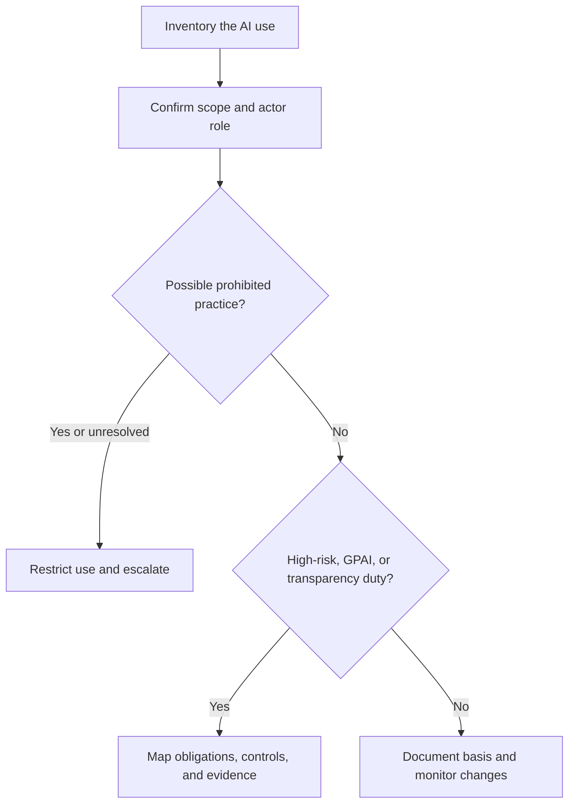
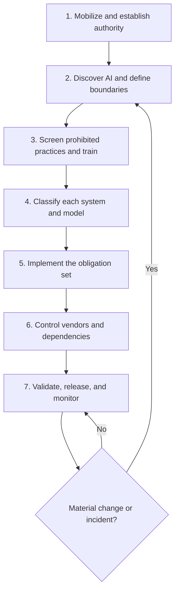
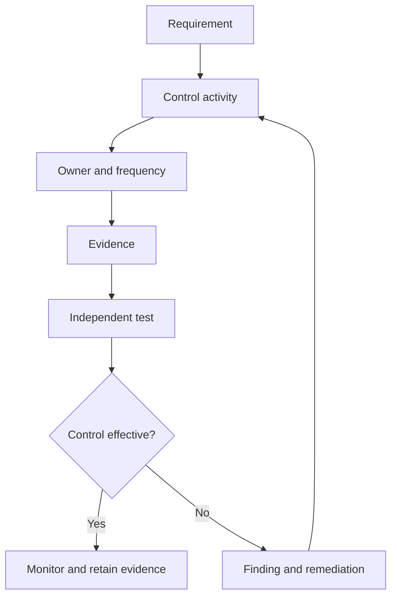

# Manual 01 — EU AI Act Practical Implementation Paths

**Controlled language:** English  
**Audience:** organizations of every size that provide, deploy, import, distribute, or otherwise use AI systems or general-purpose AI models in a context connected to the European Union  
**Legal baseline verified:** 24 August 2026  
**Status:** implementation entry point; use with the full 138-chapter manual and Appendices A–Z

> This document is operational guidance, not legal advice. Organization size changes how work can be resourced; it does not by itself remove an obligation. Determine the applicable legal actor, system or model category, jurisdictional connection, and application date from the current consolidated law.

## 1. Start with role and scope, not company size

Complete one record for every AI system, model, service, feature, pilot, and material use case. Do not classify a product only once if the organization has more than one role.

| Question | Required output |
|---|---|
| Does the EU AI Act apply territorially or extraterritorially? | Applicability decision with facts, owner, reviewer, date, and legal source |
| Is the organization a provider, deployer, importer, distributor, product manufacturer, authorized representative, or downstream provider? | Actor-role record for each system or model |
| Is the item an AI system, a general-purpose AI model, both through integration, or outside the definition? | Documented classification and boundary |
| Is a prohibited practice implicated? | Signed screening decision and immediate stop/escalation record where needed |
| Is the system high-risk, subject to transparency duties, or neither? | Risk-category decision with the relevant legal basis |
| Is a third party involved? | Vendor, contract, documentation, dependency, and change-notification record |
| Which provisions apply now and which apply later? | Provision-by-provision application-date register |

When an answer is uncertain, mark it **unresolved** and restrict deployment as appropriate. Do not silently classify uncertainty as low risk.

### Visual guide — Classification and routing

**Accessible explanation:** Every AI use enters the inventory and receives a scope and actor-role decision. A possible prohibited practice is restricted and escalated. Other uses are evaluated for high-risk, GPAI, and transparency duties; applicable obligations become controls and evidence, while other decisions remain documented and monitored for change.

## 2. Minimum implementation lifecycle

### Gate 1 — Mobilize and establish authority

1. Name an accountable executive sponsor and operating owner.
2. Approve a short AI governance charter and escalation route.
3. Identify qualified legal, privacy, security, human-rights, product, and assurance support.
4. Create a controlled evidence location and decision log.

**Exit evidence:** charter, responsibility matrix, escalation contacts, legal-source register, and approved implementation plan.

### Gate 2 — Discover AI and define boundaries

1. Inventory purchased, internally developed, embedded, experimental, and employee-adopted AI.
2. Record intended purpose, users, affected people, inputs, outputs, data sources, model dependencies, jurisdictions, and vendors.
3. Map each system and model to one or more legal actor roles.
4. Establish intake so procurement, engineering, business teams, and employees cannot introduce AI outside the inventory.

**Exit evidence:** inventory, system boundary diagrams, owner attestations, vendor list, and discovery reconciliation.

### Gate 3 — Screen prohibited practices and establish AI literacy

1. Test every use case against the current prohibited-practice provisions.
2. Stop, restrict, or escalate any use that may be prohibited.
3. Provide role-based AI literacy appropriate to staff knowledge, context of use, and affected people.
4. Preserve screening and training evidence.

**Exit evidence:** prohibited-practice checklist, exception/escalation records, training matrix, completion records, and competence checks.

### Gate 4 — Classify each system and model

Classify, at minimum:

- legal actor role or roles;
- excluded or out-of-scope activity, with reasons;
- prohibited practice exposure;
- high-risk system category and any exception analysis;
- transparency duties;
- general-purpose AI model involvement and systemic-risk considerations where relevant;
- personal-data, employment, biometric, safety, consumer, accessibility, and fundamental-rights dependencies;
- substantial-modification risk; and
- applicable provision dates under the current consolidated text.

**Exit evidence:** approved classification record, cited source, reviewer, review date, trigger events, and next review date.

### Gate 5 — Implement the obligation set

For each applicable role and category, convert the legal requirement into a control with an owner, frequency, evidence, test method, exception process, and dependency.

High-risk provider readiness may require controls covering risk management, data and data governance, technical documentation, record-keeping, transparency and instructions for use, human oversight, accuracy, robustness, cybersecurity, quality management, conformity assessment, registration, post-market monitoring, and serious-incident handling. Apply only the obligations that the current law assigns to the organization and system.

Deployer readiness may include operation according to instructions, assignment of competent human oversight, input-data controls where applicable, monitoring, log retention where under the deployer's control, worker information, fundamental-rights impact assessment where required, and incident or risk escalation.

GPAI and transparency readiness must distinguish provider duties from downstream or deployer duties. Treat official guidelines and codes of practice as non-binding implementation aids unless a binding instrument gives them a different legal effect.

**Exit evidence:** article-to-control register, procedures, completed assessments, technical records, notices, approvals, logs, test results, and remediation records.

### Gate 6 — Control vendors and the AI supply chain

1. Identify every model, dataset, platform, API, integrator, evaluator, hosting provider, and material subcontractor.
2. Obtain documentation needed to perform the organization's own classification and obligations.
3. Define contract rights for audit evidence, incident notice, regulatory cooperation, security, data use, intellectual property, model or service changes, localization, subcontractors, continuity, and termination.
4. Monitor changes that could alter intended purpose, performance, risk, legal role, or substantial-modification status.
5. Maintain a replacement, isolation, or shutdown plan for critical dependencies.

**Exit evidence:** due-diligence file, approved contract checklist, dependency map, monitoring results, change assessments, and exit plan.

### Gate 7 — Validate, release, and monitor

1. Test control design before deployment.
2. Test operating effectiveness using representative evidence.
3. Require approval from accountable owners and independent challenge proportionate to risk.
4. Monitor incidents, performance, bias and disparate effects, security, drift, complaints, overrides, vendor changes, legal change, and regulatory change.
5. Reclassify after material changes; do not treat initial approval as permanent.

**Exit evidence:** test plan and results, approval record, residual-risk decision, monitoring plan, incident procedure, audit trail, and reclassification history.

### Visual guide — Seven implementation gates

**Accessible explanation:** The programme moves through seven controlled gates from governance mobilization to continuous monitoring. A material change or incident sends the system back through discovery, classification, and any affected controls; otherwise monitoring continues.

## 3. Three implementation paths

The following paths describe resourcing models. They do not replace the legal classification performed above.

| Capability | Micro and small organization | Midsize organization | Large or complex enterprise |
|---|---|---|---|
| Accountability | One executive sponsor and one named AI control owner; combine roles but document conflicts | Cross-functional AI governance group with product and business owners | Board-approved operating model, executive committee, and formal three-lines responsibilities |
| Inventory | Controlled spreadsheet or simple GRC register with monthly owner attestation | Central register integrated with procurement, privacy, security, and change processes | Automated discovery plus enterprise inventory, ownership attestations, and entity/jurisdiction mapping |
| Legal support | Retained specialist for unresolved, prohibited, high-risk, GPAI, and fundamental-rights questions | In-house legal/privacy lead with specialist escalation | Dedicated regulatory counsel and coordinated multi-jurisdiction legal-change function |
| Risk assessment | Standard questionnaire and documented approval; outsource specialized testing | Formal assessment workflow with security, privacy, data, and human-rights reviewers | Integrated impact, model-risk, safety, security, privacy, and fundamental-rights assessment programme |
| Technical assurance | Vendor evidence plus targeted independent testing for higher-risk uses | Internal test capability with external specialists where necessary | Independent validation teams, controlled test environments, red teaming, and continuous monitoring |
| Vendor control | Approved-vendor list, standard questionnaire, minimum clauses, renewal review | Risk-tiered due diligence, contract standards, and ongoing monitoring | Enterprise third-party AI risk programme with concentration, fourth-party, resilience, and exit controls |
| Evidence | Restricted shared repository with naming and retention rules | GRC evidence library linked to controls, systems, owners, and findings | Enterprise evidence architecture with lineage, immutable records where needed, and regulatory-response capability |
| Assurance | Annual independent review and event-driven review | Risk-based internal audit and control testing | Continuous control monitoring plus independent internal and external assurance |

### Micro and small organization: minimum viable control set

Use this path when the organization has limited personnel, provided that the risk and legal classification supports it.

1. Maintain one complete AI register.
2. Assign one accountable sponsor and one day-to-day owner.
3. Adopt one AI use and acquisition policy.
4. Complete prohibited-practice and role/category screening before use.
5. Train everyone who acquires, configures, supervises, or relies on AI.
6. Use the vendor questionnaire and contract checklist in Appendices O and P.
7. Obtain external legal or technical help for unresolved or high-impact cases.
8. Store approvals, vendor evidence, notices, tests, incidents, and changes in one controlled location.
9. Review the register at least quarterly and after every material change.

Do not use a small-company path to avoid documentation, testing, human oversight, or conformity work that is legally applicable.

### Midsize organization: managed programme

1. Establish a monthly AI governance forum.
2. Integrate AI intake with procurement, change management, privacy, security, HR, and product governance.
3. Assign a system owner and control owner for every material AI use.
4. Use risk-tiered review and independent challenge.
5. Maintain a common control library and evidence register.
6. Test a sample of controls quarterly and conduct an annual risk-based audit.
7. Monitor vendor, model, data, performance, legal, and incident changes.
8. Report inventory completeness, unresolved classifications, overdue remediation, incidents, and control-test results to executives.

### Large or complex enterprise: integrated programme

1. Establish board and executive oversight across entities and jurisdictions.
2. Operate a formal AI management system aligned, where useful, with ISO/IEC 42001 without claiming that alignment alone proves EU AI Act compliance.
3. Automate discovery and connect AI inventory to asset, model, data, vendor, privacy, security, product, and regulatory registers.
4. Maintain separate ownership for management, independent risk/compliance challenge, and internal audit.
5. Run specialized validation for safety, security, robustness, explainability, bias, accessibility, human oversight, and fundamental-rights risk as applicable.
6. Maintain regulatory examination, serious-incident, recall/corrective-action, and evidence-preservation playbooks.
7. Monitor concentration and systemic dependencies in GPAI, cloud, data, and model supply chains.
8. Provide consolidated reporting with drill-down to system, entity, role, obligation, control, evidence, finding, and remediation.

## 4. Suggested internal programme milestones

These are management targets, not statutory dates. Binding dates belong in the controlled legal-date register.

| Period | Minimum outcome |
|---|---|
| Days 1–30 | Sponsor, owner, legal baseline, inventory launch, prohibited-practice triage, urgent restrictions, AI literacy plan, and evidence location |
| Days 31–90 | Actor and risk classification, intake process, vendor controls, core policies, control mapping, and prioritized remediation |
| Months 4–6 | Implemented obligation sets, technical and human-oversight tests, contract remediation, monitoring, and first control-effectiveness review |
| Months 7–12 | Closed high-priority gaps, independent assurance, repeatable reporting, regulatory-response readiness, and approved continuous-improvement plan |

## 5. Evidence index for every AI system

Each system record should link to the following, marking an item **not applicable** only with an approved reason:

- applicability and actor-role decision;
- intended purpose and system boundary;
- prohibited-practice screening;
- high-risk and transparency classification;
- GPAI dependency assessment;
- data, privacy, security, and fundamental-rights assessments as applicable;
- vendor due diligence and contract controls;
- technical documentation and instructions;
- human-oversight design and training;
- test results and limitations;
- approval and residual-risk decision;
- notices, labels, registrations, or conformity records as applicable;
- deployment, monitoring, logs, overrides, complaints, and incidents;
- change and substantial-modification assessments;
- corrective actions and closure evidence; and
- retention and disposal decision.

### Evidence-and-assurance chain

**Accessible explanation:** A requirement becomes a controlled activity with an owner and frequency. The activity produces evidence that is tested independently. Effective controls continue under monitoring; ineffective controls create findings and remediation that returns to control design.

## 6. Metrics that reveal implementation quality

- percentage of AI systems with a confirmed owner;
- inventory attestation completion and reconciliation exceptions;
- unresolved actor, scope, and risk classifications;
- prohibited-practice screenings completed before deployment;
- role-based AI literacy completion and competence results;
- high-risk obligations mapped to implemented and tested controls;
- systems with overdue vendor evidence or contract remediation;
- open critical findings and average remediation age;
- unapproved model, data, purpose, or vendor changes;
- incidents, complaints, overrides, and monitoring exceptions; and
- legal-source reviews completed before their due dates.

Avoid a single compliance percentage that hides unknown inventory, unresolved legal questions, or untested controls.

## 7. Controlled sources

Use the repository source IDs in `.compliance/authoritative-sources.json`:

- `eu-ai-act-consolidated-2026-07-27` — current consolidated Regulation (EU) 2024/1689;
- `eu-ai-omnibus-2026-1744` — binding 2026 amendment;
- `ec-eu-ai-act-implementation` — official implementation overview, non-binding except where it describes binding law;
- `ec-eu-ai-act-enforcement` — official enforcement overview, non-binding guidance; and
- `ec-eu-ai-transparency-code-2026` — voluntary transparency code and related official implementation material.

The dedicated workflow verifies that these sources, this implementation entry point, the full manual, and the principal evidence appendices remain present and connected. Passing workflow checks demonstrates repository integrity only; it is not a legal-compliance determination.

## 8. Related manual components

- [Canonical Foundation](./EU_AI_Act_GRC_Manual_Foundation_CORRECTED_MASTER.md)
- [Application Timeline and Transitional Rules](./chapters/06_Application_Timeline_and_Transitional_Rules_CORRECTED.md)
- [First 30 Days](./chapters/129_First_30_Days_CORRECTED_MASTER.md)
- [High-Risk Readiness Roadmap](./chapters/133_High_Risk_Readiness_Roadmap_CORRECTED_MASTER.md)
- [GPAI Readiness Roadmap](./chapters/134_GPAI_Readiness_Roadmap_CORRECTED_MASTER.md)
- [Transparency Readiness Roadmap](./chapters/135_Transparency_Readiness_Roadmap_CORRECTED_MASTER.md)
- [AI Vendor Questionnaire](./appendices/Appendix_O_AI_Vendor_Questionnaire_CORRECTED_MASTER.md)
- [Contract Clause Checklist](./appendices/Appendix_P_Contract_Clause_Checklist_CORRECTED_MASTER.md)
- [Implementation Roadmap](./appendices/Appendix_Z_Implementation_Roadmap_CORRECTED_MASTER.md)
